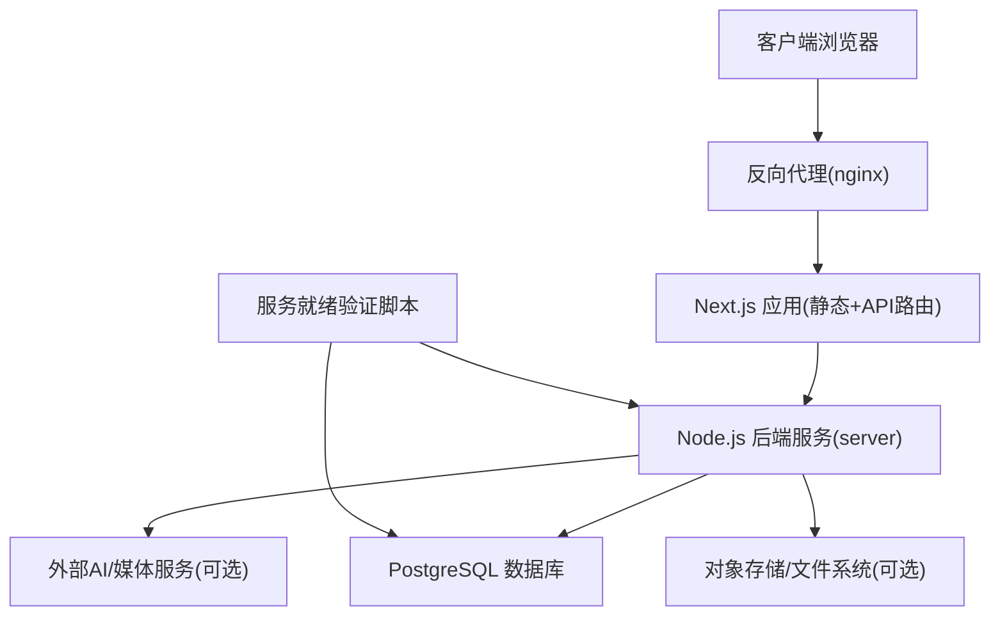
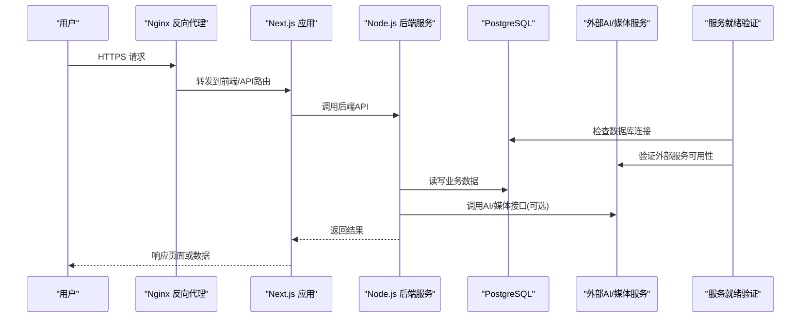
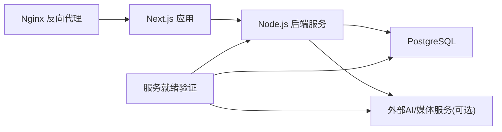

# 部署指南

<cite>
**本文引用的文件**   
- [Dockerfile](file://Dockerfile)
- [docker-compose.dev.yml](file://docker-compose.dev.yml)
- [docker-compose.prod.yml](file://docker-compose.prod.yml)
- [.dockerignore](file://.dockerignore)
- [server/Dockerfile](file://server/Dockerfile)
- [deploy/reverse-proxy/Dockerfile](file://deploy/reverse-proxy/Dockerfile)
- [deploy/reverse-proxy/entrypoint.sh](file://deploy/reverse-proxy/entrypoint.sh)
- [config/tts.env.example](file://config/tts.env.example)
- [scripts/setup/postgres-init.sql](file://scripts/setup/postgres-init.sql)
- [scripts/setup/db-migrate.ts](file://scripts/setup/db-migrate.ts)
- [scripts/migration/sqlite-backup.ts](file://scripts/migration/sqlite-backup.ts)
- [drizzle.config.ts](file://drizzle.config.ts)
- [next.config.ts](file://next.config.ts)
- [package.json](file://package.json)
- [server/package.json](file://server/package.json)
- [src/instrumentation.ts](file://src/instrumentation.ts)
- [server/src/index.ts](file://server/src/index.ts)
- [server/src/server/api.ts](file://server/src/server/api.ts)
- [server/src/server/job-runner.ts](file://server/src/server/job-runner.ts)
- [server/src/server/job-store.ts](file://server/src/server/job-store.ts)
- [server/src/lib/load-env.ts](file://server/src/lib/load-env.ts)
- [server/src/lib/logger.ts](file://server/src/lib/logger.ts)
- [server/src/capture/run-capture.ts](file://server/src/capture/run-capture.ts)
- [server/src/compose/run-pipeline.ts](file://server/src/compose/run-pipeline.ts)
- [server/src/tts/orchestrate.ts](file://server/src/tts/orchestrate.ts)
- [server/src/tts/narration.ts](file://server/src/tts/narration.ts)
- [server/src/tts/media.ts](file://server/src/tts/media.ts)
- [server/src/lib/step-client.ts](file://server/src/lib/step-client.ts)
- [server/body-linear.json](file://server/body-linear.json)
- [server/body-magicui.json](file://server/body-magicui.json)
- [server/body-posthog.json](file://server/body-posthog.json)
- [server/body-resend.json](file://server/body-resend.json)
- [server/body-shadcn.json](file://server/body-shadcn.json)
- [server/body-supabase.json](file://server/body-synthetic.json)
- [scripts/verify/managed-service-readiness.mjs](file://scripts/verify/managed-service-readiness.mjs)
</cite>

## 更新摘要
**变更内容**   
- 新增托管服务就绪验证脚本，用于安全预检查和部署验证
- 更新 Docker Compose 生产配置以支持新的验证流程
- 增强部署前的服务健康检查机制

## 目录
1. [简介](#简介)
2. [项目结构](#项目结构)
3. [核心组件](#核心组件)
4. [架构总览](#架构总览)
5. [详细组件分析](#详细组件分析)
6. [依赖关系分析](#依赖关系分析)
7. [性能考量](#性能考量)
8. [故障排查指南](#故障排查指南)
9. [结论](#结论)
10. [附录](#附录)

## 简介
本指南面向生产环境，提供 PurpleInk 平台的完整部署说明。内容涵盖：
- Docker 容器化与镜像构建
- 容器编排与服务发现（Compose、反向代理）
- 环境变量与 SSL/TLS 配置
- PostgreSQL 数据库安装、初始化、迁移与备份策略
- **新增** 托管服务就绪验证与安全预检查
- 监控与日志收集（应用指标、结构化日志、聚合方案）
- CI/CD 流水线建议（自动化测试、构建发布、灰度发布）
- 主流云平台部署方案与最佳实践

## 项目结构
仓库采用多阶段构建与前后端分离的部署形态：
- 根级 Dockerfile 用于构建前端产物并生成运行镜像
- server 子目录包含 Node.js 后端服务及其独立 Dockerfile
- deploy/reverse-proxy 提供 Nginx 反向代理容器模板
- docker-compose.* 定义开发/生产编排
- scripts 提供数据库初始化、迁移、备份与验证等运维脚本
- drizzle.config.ts 管理数据库迁移配置
- next.config.ts 管理 Next.js 运行时行为

图表来源
- [docker-compose.prod.yml](file://docker-compose.prod.yml)
- [deploy/reverse-proxy/Dockerfile](file://deploy/reverse-proxy/Dockerfile)
- [Dockerfile](file://Dockerfile)
- [server/Dockerfile](file://server/Dockerfile)
- [scripts/verify/managed-service-readiness.mjs](file://scripts/verify/managed-service-readiness.mjs)

章节来源
- [Dockerfile](file://Dockerfile)
- [server/Dockerfile](file://server/Dockerfile)
- [docker-compose.dev.yml](file://docker-compose.dev.yml)
- [docker-compose.prod.yml](file://docker-compose.prod.yml)
- [deploy/reverse-proxy/Dockerfile](file://deploy/reverse-proxy/Dockerfile)
- [deploy/reverse-proxy/entrypoint.sh](file://deploy/reverse-proxy/entrypoint.sh)

## 核心组件
- 反向代理：Nginx 容器，负责 TLS 终止、静态资源缓存、请求转发与健康检查
- 前端应用：Next.js 应用，提供 Web UI 与 API 路由
- 后端服务：Node.js 服务，处理任务编排、渲染、TTS、捕获等
- 数据库：PostgreSQL，持久化业务数据与队列状态
- **新增** 服务就绪验证：托管服务健康检查与安全预验证脚本
- 工具脚本：数据库初始化、迁移、备份与验证

章节来源
- [deploy/reverse-proxy/Dockerfile](file://deploy/reverse-proxy/Dockerfile)
- [deploy/reverse-proxy/entrypoint.sh](file://deploy/reverse-proxy/entrypoint.sh)
- [Dockerfile](file://Dockerfile)
- [server/Dockerfile](file://server/Dockerfile)
- [scripts/setup/postgres-init.sql](file://scripts/setup/postgres-init.sql)
- [scripts/setup/db-migrate.ts](file://scripts/setup/db-migrate.ts)
- [scripts/verify/managed-service-readiness.mjs](file://scripts/verify/managed-service-readiness.mjs)

## 架构总览
PurpleInk 的生产架构由五层组成：
- 接入层：Nginx 反向代理，统一入口、SSL 卸载、限流与访问控制
- 应用层：Next.js 应用（静态页面 + API 路由），承载用户交互与轻量逻辑
- 服务层：Node.js 后端服务，执行重任务（渲染、TTS、捕获、管道编排）
- 数据层：PostgreSQL 数据库，存储业务数据、会话、队列与制品元信息
- **新增** 验证层：服务就绪检查与安全预验证，确保部署前所有依赖服务可用

图表来源
- [docker-compose.prod.yml](file://docker-compose.prod.yml)
- [server/src/server/api.ts](file://server/src/server/api.ts)
- [server/src/server/job-runner.ts](file://server/src/server/job-runner.ts)
- [server/src/server/job-store.ts](file://server/src/server/job-store.ts)
- [scripts/verify/managed-service-readiness.mjs](file://scripts/verify/managed-service-readiness.mjs)

## 详细组件分析

### 反向代理（Nginx）
- 职责：TLS 终止、静态资源缓存、请求转发、健康检查、基础认证（可选）
- 关键文件：
  - 镜像构建：[deploy/reverse-proxy/Dockerfile](file://deploy/reverse-proxy/Dockerfile)
  - 启动入口：[deploy/reverse-proxy/entrypoint.sh](file://deploy/reverse-proxy/entrypoint.sh)
- 配置要点：
  - 证书挂载路径与环境变量注入
  - upstream 指向 Next.js 与后端服务
  - location 规则区分静态资源与 API 路由
  - 安全头与速率限制

章节来源
- [deploy/reverse-proxy/Dockerfile](file://deploy/reverse-proxy/Dockerfile)
- [deploy/reverse-proxy/entrypoint.sh](file://deploy/reverse-proxy/entrypoint.sh)

### 前端应用（Next.js）
- 职责：Web UI、API 路由、SSR/静态导出
- 构建与运行：
  - 根级 Dockerfile 多阶段构建前端产物
  - 通过环境变量控制运行时行为
- 关键配置：
  - [next.config.ts](file://next.config.ts) 中代理、路径重写、安全设置
  - [package.json](file://package.json) 中的构建脚本与依赖

章节来源
- [Dockerfile](file://Dockerfile)
- [next.config.ts](file://next.config.ts)
- [package.json](file://package.json)

### 后端服务（Node.js）
- 职责：任务调度、渲染管线、TTS、媒体捕获、凭证管理
- 关键模块：
  - API 路由：[server/src/server/api.ts](file://server/src/server/api.ts)
  - 任务运行器：[server/src/server/job-runner.ts](file://server/src/server/job-runner.ts)
  - 任务存储：[server/src/server/job-store.ts](file://server/src/server/job-store.ts)
  - 环境加载：[server/src/lib/load-env.ts](file://server/src/lib/load-env.ts)
  - 日志：[server/src/lib/logger.ts](file://server/src/lib/logger.ts)
  - 捕获流程：[server/src/capture/run-capture.ts](file://server/src/capture/run-capture.ts)
  - 渲染管线：[server/src/compose/run-pipeline.ts](file://server/src/compose/run-pipeline.ts)
  - TTS 编排：[server/src/tts/orchestrate.ts](file://server/src/tts/orchestrate.ts)、[server/src/tts/narration.ts](file://server/src/tts/narration.ts)、[server/src/tts/media.ts](file://server/src/tts/media.ts)
  - Step 客户端：[server/src/lib/step-client.ts](file://server/src/lib/step-client.ts)
- 镜像构建：[server/Dockerfile](file://server/Dockerfile)

章节来源
- [server/Dockerfile](file://server/Dockerfile)
- [server/src/server/api.ts](file://server/src/server/api.ts)
- [server/src/server/job-runner.ts](file://server/src/server/job-runner.ts)
- [server/src/server/job-store.ts](file://server/src/server/job-store.ts)
- [server/src/lib/load-env.ts](file://server/src/lib/load-env.ts)
- [server/src/lib/logger.ts](file://server/src/lib/logger.ts)
- [server/src/capture/run-capture.ts](file://server/src/capture/run-capture.ts)
- [server/src/compose/run-pipeline.ts](file://server/src/compose/run-pipeline.ts)
- [server/src/tts/orchestrate.ts](file://server/src/tts/orchestrate.ts)
- [server/src/tts/narration.ts](file://server/src/tts/narration.ts)
- [server/src/tts/media.ts](file://server/src/tts/media.ts)
- [server/src/lib/step-client.ts](file://server/src/lib/step-client.ts)

### 数据库（PostgreSQL）
- 职责：持久化业务数据、队列、会话、制品元信息
- 初始化与迁移：
  - 初始化脚本：[scripts/setup/postgres-init.sql](file://scripts/setup/postgres-init.sql)
  - 迁移脚本：[scripts/setup/db-migrate.ts](file://scripts/setup/db-migrate.ts)
  - 迁移配置：[drizzle.config.ts](file://drizzle.config.ts)
- 备份策略：
  - SQLite 备份脚本参考：[scripts/migration/sqlite-backup.ts](file://scripts/migration/sqlite-backup.ts)
  - 生产建议使用 pg_dump 定时备份与异地存储

章节来源
- [scripts/setup/postgres-init.sql](file://scripts/setup/postgres-init.sql)
- [scripts/setup/db-migrate.ts](file://scripts/setup/db-migrate.ts)
- [drizzle.config.ts](file://drizzle.config.ts)
- [scripts/migration/sqlite-backup.ts](file://scripts/migration/sqlite-backup.ts)

### 服务就绪验证（新增）
- 职责：部署前的安全预检查与服务健康验证
- 关键功能：
  - 数据库连接性检查
  - 外部服务可用性验证
  - 安全配置验证
  - 部署环境完整性检查
- 执行时机：
  - 容器启动前预检查
  - CI/CD 流水线中的冒烟测试
  - 手动部署验证

**新增** 章节来源
- [scripts/verify/managed-service-readiness.mjs](file://scripts/verify/managed-service-readiness.mjs)

### 编排与容器化
- 开发编排：[docker-compose.dev.yml](file://docker-compose.dev.yml)
- 生产编排：[docker-compose.prod.yml](file://docker-compose.prod.yml)
- 忽略文件：[.dockerignore](file://.dockerignore)
- 镜像构建：
  - 前端：[Dockerfile](file://Dockerfile)
  - 后端：[server/Dockerfile](file://server/Dockerfile)
  - 反向代理：[deploy/reverse-proxy/Dockerfile](file://deploy/reverse-proxy/Dockerfile)

**更新** 生产编排现已集成服务就绪验证流程，确保部署前所有依赖服务可用。

章节来源
- [docker-compose.dev.yml](file://docker-compose.dev.yml)
- [docker-compose.prod.yml](file://docker-compose.prod.yml)
- [.dockerignore](file://.dockerignore)
- [Dockerfile](file://Dockerfile)
- [server/Dockerfile](file://server/Dockerfile)
- [deploy/reverse-proxy/Dockerfile](file://deploy/reverse-proxy/Dockerfile)

## 依赖关系分析
- 反向代理依赖上游 Next.js 与后端服务
- Next.js 通过 API 路由调用后端服务
- 后端服务依赖 PostgreSQL 与可选的外部 AI/媒体服务
- **新增** 服务就绪验证脚本依赖所有核心服务进行健康检查
- 所有服务通过 Compose 网络进行服务发现

图表来源
- [docker-compose.prod.yml](file://docker-compose.prod.yml)
- [server/src/server/api.ts](file://server/src/server/api.ts)
- [scripts/verify/managed-service-readiness.mjs](file://scripts/verify/managed-service-readiness.mjs)

章节来源
- [docker-compose.prod.yml](file://docker-compose.prod.yml)
- [server/src/server/api.ts](file://server/src/server/api.ts)
- [scripts/verify/managed-service-readiness.mjs](file://scripts/verify/managed-service-readiness.mjs)

## 性能考量
- 反向代理层启用 gzip/brotli 压缩与静态资源缓存
- Next.js 使用增量静态再生与边缘缓存优化首屏
- 后端服务连接池与异步任务队列提升吞吐
- 数据库连接池、索引优化与慢查询监控
- 大文件上传与下载使用分片与断点续传
- 媒体处理任务拆分与并行化，避免阻塞主线程
- **新增** 服务就绪验证在容器启动时快速失败，减少部署等待时间

## 故障排查指南
- 反向代理问题：检查证书挂载、upstream 可达性、location 规则
- Next.js 问题：查看构建产物、环境变量、代理配置
- 后端服务问题：检查日志、数据库连接、外部服务可用性
- 数据库问题：检查初始化脚本、迁移状态、连接数与锁等待
- **新增** 服务就绪验证问题：检查验证脚本输出、依赖服务状态、网络连接
- 监控与日志：
  - 应用指标：在 [src/instrumentation.ts](file://src/instrumentation.ts) 中集成指标采集
  - 结构化日志：在 [server/src/lib/logger.ts](file://server/src/lib/logger.ts) 中输出 JSON 格式日志
  - 日志聚合：将容器日志推送到集中式日志系统（如 ELK/Loki）

章节来源
- [src/instrumentation.ts](file://src/instrumentation.ts)
- [server/src/lib/logger.ts](file://server/src/lib/logger.ts)
- [scripts/verify/managed-service-readiness.mjs](file://scripts/verify/managed-service-readiness.mjs)

## 结论
通过容器化与编排，PurpleInk 平台在生产环境中具备高可用、可扩展与易维护的特性。**新增的服务就绪验证机制**进一步增强了部署的安全性与可靠性。结合合理的反向代理、数据库管理与监控日志体系，可保障服务的稳定性与性能。建议在 CI/CD 中引入自动化测试、构建发布与灰度发布，进一步提升交付质量与风险控制能力。

## 附录

### 环境变量与配置清单
- 通用环境变量：
  - DATABASE_URL：PostgreSQL 连接串
  - NODE_ENV：运行环境（development/production）
  - LOG_LEVEL：日志级别
  - PORT：服务端口
- 反向代理：
  - TLS 证书路径与密钥
  - 上游服务地址与端口
- TTS 与外部服务：
  - 参考示例：[config/tts.env.example](file://config/tts.env.example)
- 后端服务：
  - 参考加载逻辑：[server/src/lib/load-env.ts](file://server/src/lib/load-env.ts)
- **新增** 服务验证：
  - 验证超时配置
  - 重试次数设置
  - 健康检查端点配置

章节来源
- [config/tts.env.example](file://config/tts.env.example)
- [server/src/lib/load-env.ts](file://server/src/lib/load-env.ts)
- [scripts/verify/managed-service-readiness.mjs](file://scripts/verify/managed-service-readiness.mjs)

### 数据库部署与备份
- 初始化：
  - 使用 [scripts/setup/postgres-init.sql](file://scripts/setup/postgres-init.sql) 创建库与用户
- 迁移：
  - 使用 [scripts/setup/db-migrate.ts](file://scripts/setup/db-migrate.ts) 与 [drizzle.config.ts](file://drizzle.config.ts) 执行迁移
- 备份：
  - 定期执行 pg_dump 并归档至对象存储
  - 参考备份脚本思路：[scripts/migration/sqlite-backup.ts](file://scripts/migration/sqlite-backup.ts)

章节来源
- [scripts/setup/postgres-init.sql](file://scripts/setup/postgres-init.sql)
- [scripts/setup/db-migrate.ts](file://scripts/setup/db-migrate.ts)
- [drizzle.config.ts](file://drizzle.config.ts)
- [scripts/migration/sqlite-backup.ts](file://scripts/migration/sqlite-backup.ts)

### CI/CD 流水线建议
- 触发条件：代码推送与合并请求
- 步骤：
  - 安装依赖与类型检查
  - 单元测试与集成测试（含数据库测试）
  - **新增** 服务就绪验证与安全检查
  - 构建镜像（前端与后端）
  - 推送镜像到镜像仓库
  - 部署到预发环境并进行冒烟测试
  - 灰度发布与全量发布
- 回滚策略：保留历史镜像版本，快速回滚

### 云平台部署方案
- Kubernetes：
  - 使用 Deployment/Service/Ingress 管理应用与反向代理
  - ConfigMap/Secret 管理配置与敏感信息
  - HorizontalPodAutoscaler 实现弹性伸缩
  - **新增** Job 资源管理服务就绪验证
- 托管容器服务（如阿里云 ACK、腾讯云 TKE、AWS EKS）：
  - 使用托管数据库与对象存储
  - 利用云厂商的负载均衡与证书管理服务
  - **新增** 健康检查探针配置
- Serverless（如 Vercel/Cloudflare Pages + Cloud Functions）：
  - 适合轻量场景，复杂任务需拆分到独立服务

### 监控与日志聚合
- 指标采集：
  - 在 [src/instrumentation.ts](file://src/instrumentation.ts) 中集成 Prometheus/OpenTelemetry
- 日志聚合：
  - 使用 Fluent Bit/Filebeat 收集容器日志
  - 推送到 Elasticsearch/Loki 进行检索与分析
  - **新增** 服务验证日志记录
- 告警：
  - 基于阈值与异常模式设置告警规则
  - **新增** 服务就绪失败告警

章节来源
- [src/instrumentation.ts](file://src/instrumentation.ts)
- [scripts/verify/managed-service-readiness.mjs](file://scripts/verify/managed-service-readiness.mjs)

### 服务就绪验证流程（新增）
- 验证时机：
  - 容器启动前预检查
  - CI/CD 流水线中的冒烟测试
  - 手动部署验证
- 验证内容：
  - 数据库连接性检查
  - 外部服务可用性验证
  - 安全配置验证
  - 部署环境完整性检查
- 失败处理：
  - 自动重试机制
  - 详细的错误信息输出
  - 容器启动失败保护

**新增** 章节来源
- [scripts/verify/managed-service-readiness.mjs](file://scripts/verify/managed-service-readiness.mjs)