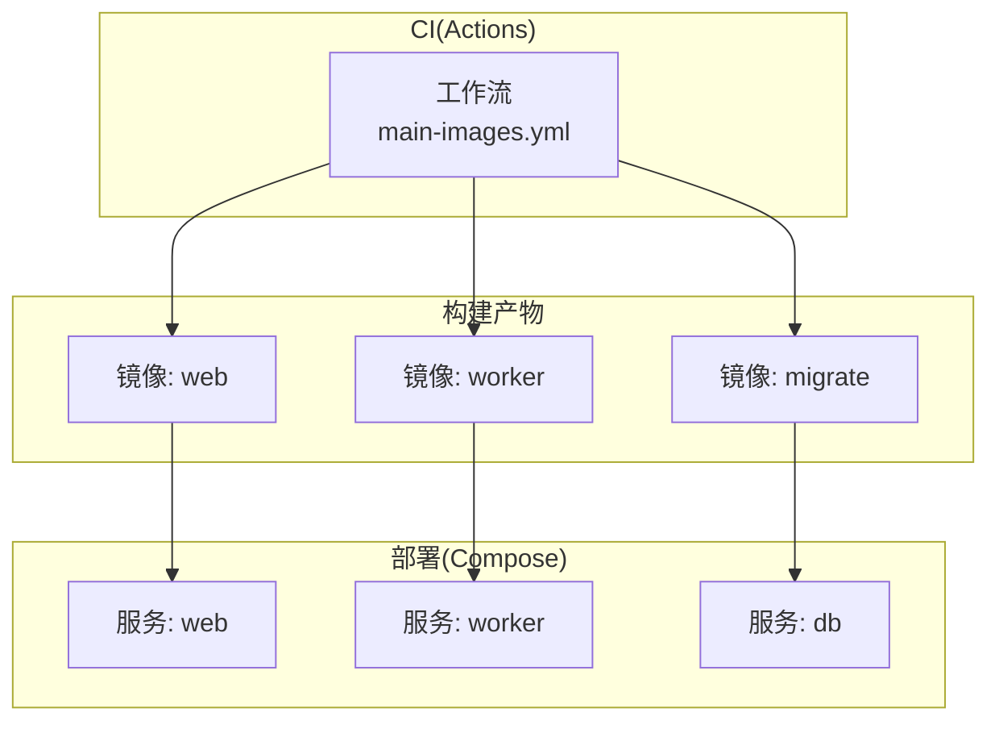
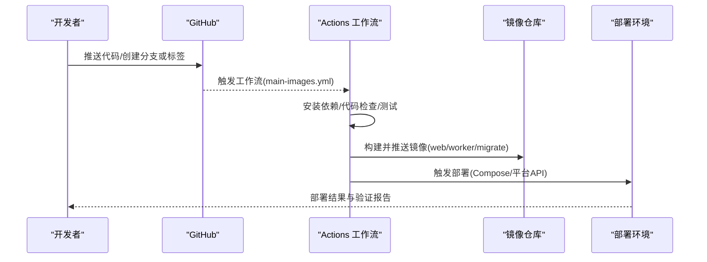
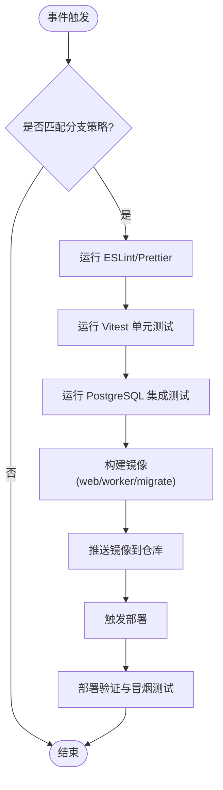
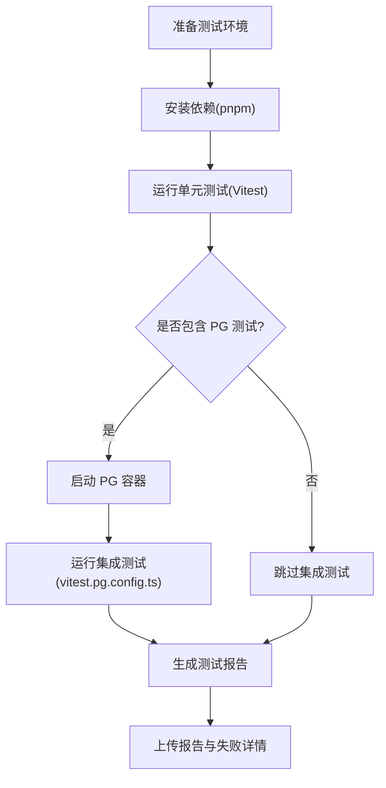
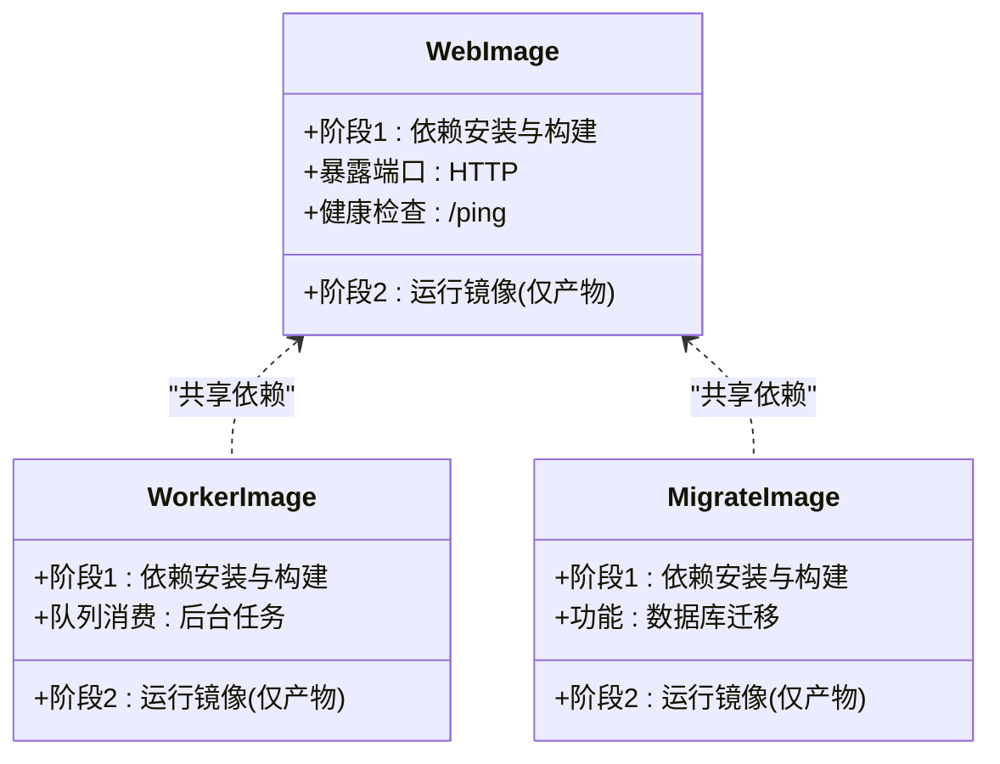
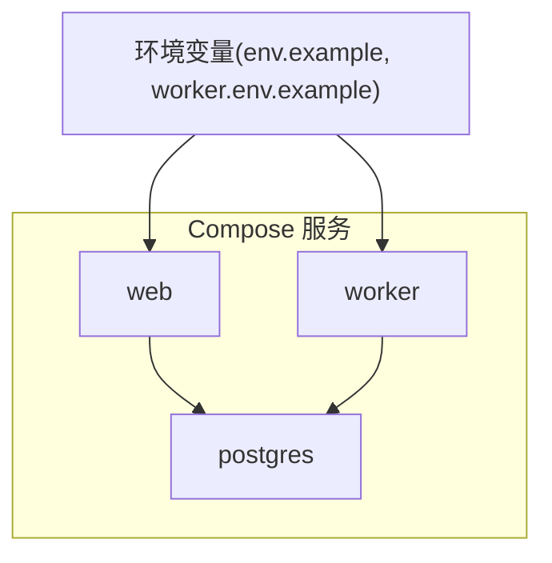
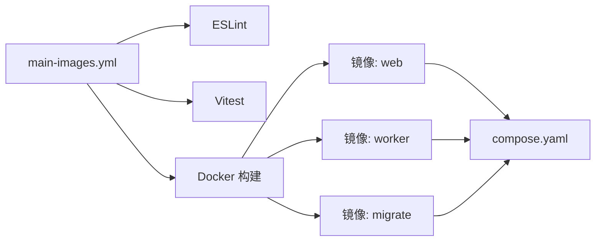

# CI/CD 流水线

<cite>
**本文引用的文件**   
- [main-images.yml](file://.github/workflows/main-images.yml)
- [Dockerfile.web](file://Dockerfile.web)
- [Dockerfile.worker](file://Dockerfile.worker)
- [Dockerfile.migrate](file://Dockerfile.migrate)
- [compose.yaml](file://deploy/compose.yaml)
- [env.example](file://deploy/env.example)
- [worker.env.example](file://deploy/worker.env.example)
- [package.json](file://package.json)
- [vitest.config.ts](file://vitest.config.ts)
- [vitest.pg.config.ts](file://vitest.pg.config.ts)
- [eslint.config.mjs](file://eslint.config.mjs)
- [.dockerignore](file://.dockerignore)
</cite>

## 目录
1. [简介](#简介)
2. [项目结构](#项目结构)
3. [核心组件](#核心组件)
4. [架构总览](#架构总览)
5. [详细组件分析](#详细组件分析)
6. [依赖关系分析](#依赖关系分析)
7. [性能考虑](#性能考虑)
8. [故障排查指南](#故障排查指南)
9. [结论](#结论)
10. [附录](#附录)

## 简介
本文件为 PurpleInk 项目的 CI/CD 流水线提供完整说明，涵盖 GitHub Actions 工作流配置、代码检查、测试执行、镜像构建与部署自动化、分支策略、版本标签管理、发布流程、安全扫描、环境部署策略（蓝绿与滚动更新）、回滚机制、部署验证与监控告警、性能基准测试、回归测试以及发布审批流程。文档面向开发与运维人员，力求以循序渐进的方式帮助读者快速理解并落地实施。

## 项目结构
仓库采用多容器架构：Web 服务、Worker 任务处理与数据库迁移各自独立镜像；部署使用 Docker Compose 编排；CI 通过 GitHub Actions 触发镜像构建与推送。关键目录与文件如下：
- .github/workflows: GitHub Actions 工作流定义
- deploy: 生产与预发环境的 Compose 编排与环境模板
- 根级 Dockerfile.*: Web、Worker、Migrate 的镜像构建定义
- package.json: 前端与后端共享的脚本入口（lint/test/build）
- vitest.config.ts / vitest.pg.config.ts: 单元测试与 PostgreSQL 集成测试配置
- eslint.config.mjs: 代码质量检查规则
- .dockerignore: 镜像构建时排除无关文件

**图示来源** 
- [main-images.yml](file://.github/workflows/main-images.yml)
- [Dockerfile.web](file://Dockerfile.web)
- [Dockerfile.worker](file://Dockerfile.worker)
- [Dockerfile.migrate](file://Dockerfile.migrate)
- [compose.yaml](file://deploy/compose.yaml)

**章节来源**
- [main-images.yml](file://.github/workflows/main-images.yml)
- [compose.yaml](file://deploy/compose.yaml)
- [Dockerfile.web](file://Dockerfile.web)
- [Dockerfile.worker](file://Dockerfile.worker)
- [Dockerfile.migrate](file://Dockerfile.migrate)

## 核心组件
- 代码质量检查
  - ESLint 静态检查，统一代码风格与潜在错误检测
  - Prettier 格式化（由包管理器脚本驱动）
- 测试体系
  - 单元测试：Vitest 运行
  - 集成测试：PostgreSQL 环境下的测试套件
- 镜像构建
  - 多阶段构建优化体积与安全性
  - 按服务拆分镜像（web、worker、migrate）
- 部署编排
  - Docker Compose 管理多服务生命周期
  - 环境变量模板与敏感信息隔离

**章节来源**
- [eslint.config.mjs](file://eslint.config.mjs)
- [vitest.config.ts](file://vitest.config.ts)
- [vitest.pg.config.ts](file://vitest.pg.config.ts)
- [package.json](file://package.json)
- [Dockerfile.web](file://Dockerfile.web)
- [Dockerfile.worker](file://Dockerfile.worker)
- [Dockerfile.migrate](file://Dockerfile.migrate)
- [compose.yaml](file://deploy/compose.yaml)

## 架构总览
下图展示从代码提交到镜像构建、推送与部署的整体流程，包括分支策略与标签触发的发布路径。

**图示来源** 
- [main-images.yml](file://.github/workflows/main-images.yml)
- [compose.yaml](file://deploy/compose.yaml)

**章节来源**
- [main-images.yml](file://.github/workflows/main-images.yml)
- [compose.yaml](file://deploy/compose.yaml)

## 详细组件分析

### 工作流与触发策略
- 触发条件
  - 默认分支推送（如 main）触发预览构建与测试
  - 语义化标签（如 v*）触发稳定版构建与发布
- 并行矩阵
  - 针对 Node.js 版本与操作系统进行矩阵构建，提升覆盖率与兼容性
- 缓存与增量
  - 缓存 pnpm 依赖与构建产物，缩短构建时间
- 工件上传
  - 上传测试报告与构建日志，便于问题定位

**图示来源** 
- [main-images.yml](file://.github/workflows/main-images.yml)

**章节来源**
- [main-images.yml](file://.github/workflows/main-images.yml)

### 代码质量与安全扫描
- 代码质量
  - ESLint 规则集与自定义规则，确保前后端一致规范
  - 在 PR 中阻断不合规变更
- 安全扫描
  - 依赖漏洞扫描（建议引入 npm audit 或第三方工具）
  - 镜像层安全扫描（建议引入 Trivy/Grype）
- 许可证与合规
  - 第三方依赖许可证检查（可选）

**章节来源**
- [eslint.config.mjs](file://eslint.config.mjs)
- [package.json](file://package.json)

### 测试体系与执行
- 单元测试
  - Vitest 配置覆盖前端组件、业务逻辑与工具函数
- 集成测试
  - PostgreSQL 专用配置，启动临时数据库容器执行数据相关用例
- 端到端冒烟
  - 部署后对关键 API 与健康检查端点进行冒烟测试

**图示来源** 
- [vitest.config.ts](file://vitest.config.ts)
- [vitest.pg.config.ts](file://vitest.pg.config.ts)
- [package.json](file://package.json)

**章节来源**
- [vitest.config.ts](file://vitest.config.ts)
- [vitest.pg.config.ts](file://vitest.pg.config.ts)
- [package.json](file://package.json)

### 镜像构建与优化
- 多阶段构建
  - 构建阶段：安装依赖、编译与资源优化
  - 运行阶段：最小化运行时镜像，减少攻击面
- 分层缓存
  - 将依赖安装与源码拷贝分离，利用 Docker 层缓存加速
- 安全加固
  - 非 root 用户运行、关闭不必要端口、精简基础镜像

**图示来源** 
- [Dockerfile.web](file://Dockerfile.web)
- [Dockerfile.worker](file://Dockerfile.worker)
- [Dockerfile.migrate](file://Dockerfile.migrate)

**章节来源**
- [Dockerfile.web](file://Dockerfile.web)
- [Dockerfile.worker](file://Dockerfile.worker)
- [Dockerfile.migrate](file://Dockerfile.migrate)
- [.dockerignore](file://.dockerignore)

### 部署编排与环境管理
- Compose 编排
  - 定义 web、worker、db 等服务及其依赖关系
  - 网络与卷挂载，持久化数据与共享资源
- 环境变量
  - 使用 env.example 与 worker.env.example 作为模板
  - 敏感信息通过密钥管理服务注入
- 健康检查
  - 服务就绪探针与重启策略

**图示来源** 
- [compose.yaml](file://deploy/compose.yaml)
- [env.example](file://deploy/env.example)
- [worker.env.example](file://deploy/worker.env.example)

**章节来源**
- [compose.yaml](file://deploy/compose.yaml)
- [env.example](file://deploy/env.example)
- [worker.env.example](file://deploy/worker.env.example)

### 分支策略与版本标签管理
- 分支模型
  - main: 稳定分支，用于生产发布
  - develop: 集成分支，日常开发合并
  - feature/*: 功能分支，PR 合并至 develop
  - release/*: 预发布分支，打标签后进入生产
- 标签规范
  - 语义化版本（vMAJOR.MINOR.PATCH）
  - 标签触发稳定构建与发布流程
- 保护规则
  - 主分支要求 PR 审查与状态检查通过

**章节来源**
- [main-images.yml](file://.github/workflows/main-images.yml)

### 发布流程与审批
- 发布候选
  - 从 release/* 分支创建标签，触发稳定构建
- 审批门禁
  - 需要至少一名维护者批准
  - 所有检查必须通过（测试、安全、构建）
- 发布产物
  - 镜像推送到仓库，附带版本标签与最新标记
  - 生成发布说明与变更记录

**章节来源**
- [main-images.yml](file://.github/workflows/main-images.yml)

### 蓝绿部署与滚动更新
- 蓝绿部署
  - 同时运行两套相同环境，切换流量指向新版本
  - 快速回滚至旧版本
- 滚动更新
  - 逐步替换实例，避免服务中断
  - 结合健康检查与就绪探针
- 流量切换
  - 通过反向代理或服务网格实现零停机切换

[本节为概念性内容，未直接分析具体文件]

### 回滚机制与部署验证
- 回滚策略
  - 基于镜像标签快速回滚到上一个稳定版本
  - 数据库迁移需具备向下兼容或可逆方案
- 部署验证
  - 冒烟测试与关键指标校验
  - 错误率与延迟阈值告警
- 自动回滚
  - 当健康检查失败或错误率超限时自动回滚

**章节来源**
- [compose.yaml](file://deploy/compose.yaml)

### 监控告警与可观测性
- 指标采集
  - 应用指标与系统指标上报
- 日志聚合
  - 集中式日志收集与检索
- 告警规则
  - 错误率、延迟、资源使用率阈值
- 追踪链路
  - 分布式追踪与请求链路可视化

[本节为概念性内容，未直接分析具体文件]

### 性能基准测试与回归测试
- 基准测试
  - 关键接口压测与吞吐/延迟基线
- 回归测试
  - 每次发布前执行回归套件
- 性能对比
  - 与历史基线对比，异常波动告警

**章节来源**
- [vitest.config.ts](file://vitest.config.ts)
- [vitest.pg.config.ts](file://vitest.pg.config.ts)

## 依赖关系分析
- 工作流依赖
  - main-images.yml 依赖 Node.js 环境、pnpm、Docker CLI
- 镜像依赖
  - web/worker/migrate 共享基础镜像与依赖安装步骤
- 部署依赖
  - compose.yaml 依赖外部数据库与密钥管理

**图示来源** 
- [main-images.yml](file://.github/workflows/main-images.yml)
- [Dockerfile.web](file://Dockerfile.web)
- [Dockerfile.worker](file://Dockerfile.worker)
- [Dockerfile.migrate](file://Dockerfile.migrate)
- [compose.yaml](file://deploy/compose.yaml)

**章节来源**
- [main-images.yml](file://.github/workflows/main-images.yml)
- [compose.yaml](file://deploy/compose.yaml)

## 性能考虑
- 构建优化
  - 使用 pnpm 缓存与 Docker 层缓存
  - 并行任务与矩阵构建
- 镜像瘦身
  - 多阶段构建与最小化运行时
  - 移除调试信息与无用依赖
- 测试加速
  - 并行测试与只运行变更相关用例
- 部署效率
  - 增量部署与滚动更新减少停机时间

[本节为通用指导，未直接分析具体文件]

## 故障排查指南
- 常见问题
  - 依赖安装失败：检查网络与缓存
  - 测试失败：查看测试报告与日志
  - 镜像构建失败：检查 Dockerfile 与上下文
  - 部署失败：检查环境变量与服务依赖
- 诊断步骤
  - 启用详细日志与调试模式
  - 本地复现与最小化用例
  - 分阶段验证（构建→镜像→部署）

**章节来源**
- [main-images.yml](file://.github/workflows/main-images.yml)
- [compose.yaml](file://deploy/compose.yaml)

## 结论
PurpleInk 的 CI/CD 流水线以 GitHub Actions 为核心，结合多镜像构建与 Compose 编排，实现了从代码检查、测试、构建到部署的全自动化。通过严格的分支策略、版本标签管理与发布审批，保障了发布质量与稳定性。蓝绿部署与滚动更新提供了高可用与快速回滚能力，配合监控告警与可观测性体系，确保生产环境的稳定运行。建议持续引入安全扫描与性能基准测试，进一步提升交付质量与效率。

## 附录
- 最佳实践
  - 保持依赖与基础镜像更新
  - 严格的环境变量与密钥管理
  - 完善的测试覆盖与回归策略
- 参考文件
  - 工作流与镜像定义、Compose 编排与环境模板

[本节为总结性内容，未直接分析具体文件]