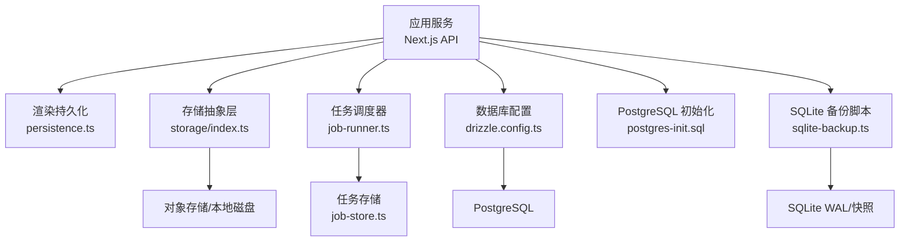
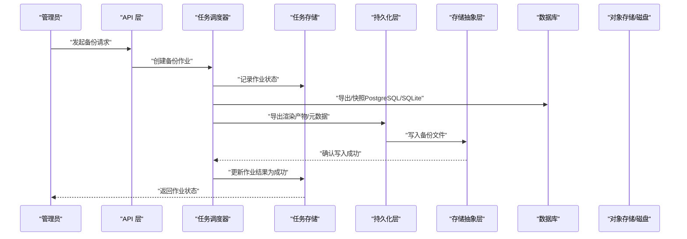
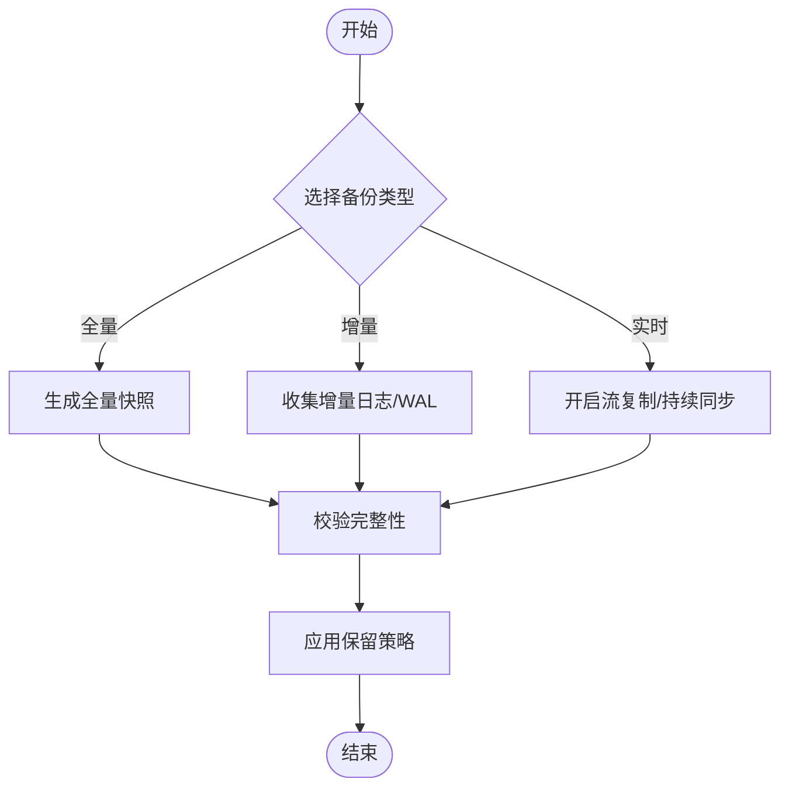
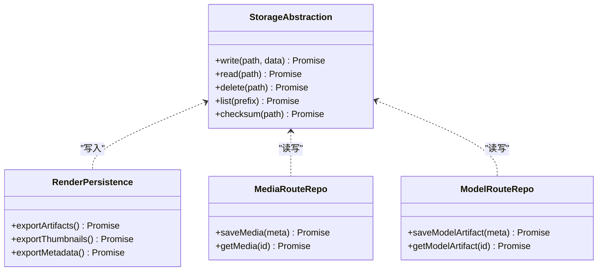
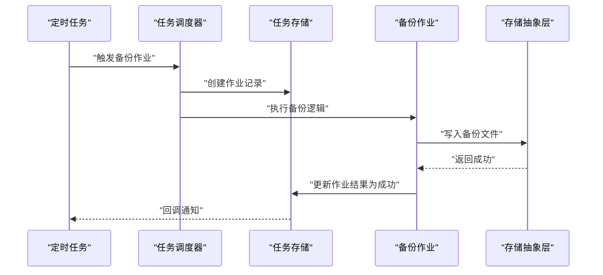
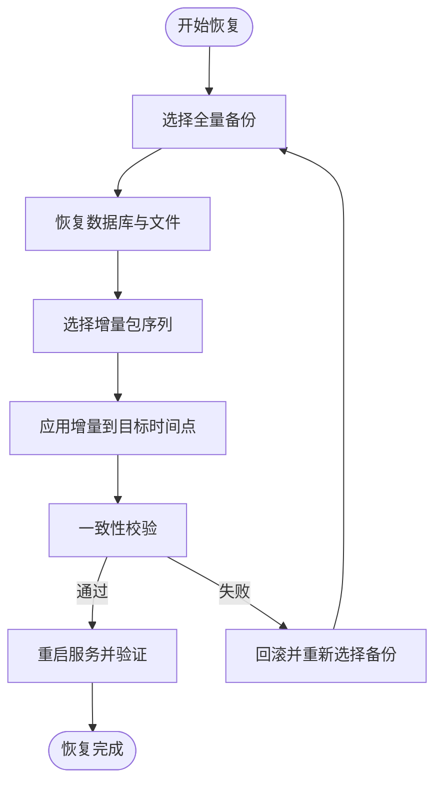
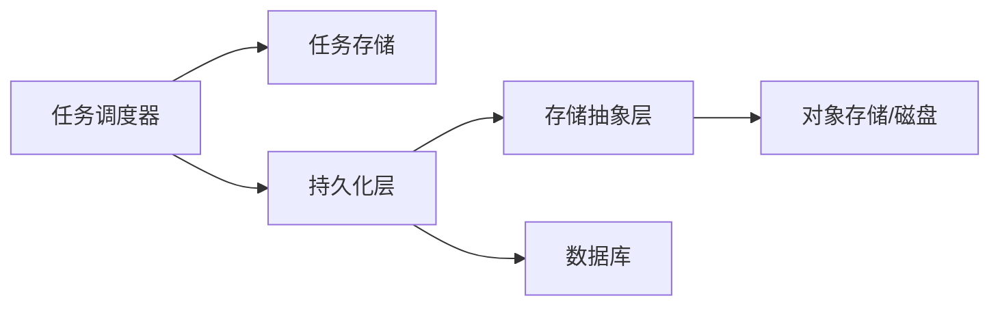

# 备份与恢复

<cite>
**本文引用的文件**   
- [scripts/migration/sqlite-backup.ts](file://scripts/migration/sqlite-backup.ts)
- [scripts/setup/postgres-init.sql](file://scripts/setup/postgres-init.sql)
- [drizzle.config.ts](file://drizzle.config.ts)
- [deploy/compose.yaml](file://deploy/compose.yaml)
- [server/src/server/job-runner.ts](file://server/src/server/job-runner.ts)
- [server/src/server/job-store.ts](file://server/src/server/job-store.ts)
- [src/features/render/persistence.ts](file://src/features/render/persistence.ts)
- [src/lib/storage/index.ts](file://src/lib/storage/index.ts)
- [src/app/api/render/route.ts](file://src/app/api/render/route.ts)
- [src/app/api/projects/route.ts](file://src/app/api/projects/route.ts)
- [src/features/artifacts/commit.ts](file://src/features/artifacts/commit.ts)
- [src/features/director/runtime-repository.ts](file://src/features/director/runtime-repository.ts)
- [src/features/audio/runtime-repository.ts](file://src/features/audio/runtime-repository.ts)
- [src/features/canvas/export-settings.ts](file://src/features/canvas/export-settings.ts)
- [src/features/routing/media-route-repository.ts](file://src/features/routing/media-route-repository.ts)
- [src/features/routing/model-route-repository.ts](file://src/features/routing/model-route-repository.ts)
- [config/tts.env.example](file://config/tts.env.example)
- [deploy/env.example](file://deploy/env.example)
- [deploy/worker.env.example](file://deploy/worker.env.example)
</cite>

## 目录
1. [简介](#简介)
2. [项目结构](#项目结构)
3. [核心组件](#核心组件)
4. [架构总览](#架构总览)
5. [详细组件分析](#详细组件分析)
6. [依赖关系分析](#依赖关系分析)
7. [性能考量](#性能考量)
8. [故障排查指南](#故障排查指南)
9. [结论](#结论)
10. [附录](#附录)

## 简介
本方案为 PurpleInk 提供端到端的备份与恢复策略，覆盖数据库、媒体资源、用户数据与配置文件的备份自动化、保留周期管理、灾难恢复流程、一致性校验与演练方法。同时给出异地容灾、多云备份与成本优化建议，确保业务连续性与数据安全。

## 项目结构
PurpleInk 的备份相关能力分布在以下位置：
- 数据库脚本与迁移：scripts/setup/postgres-init.sql、drizzle.config.ts
- SQLite 备份工具：scripts/migration/sqlite-backup.ts
- 运行时持久化与存储抽象：src/features/render/persistence.ts、src/lib/storage/index.ts
- 任务调度与执行：server/src/server/job-runner.ts、server/src/server/job-store.ts
- API 入口（渲染、项目）：src/app/api/render/route.ts、src/app/api/projects/route.ts
- 关键领域仓库：director、audio、artifacts、routing 等模块中的 repository 实现
- 部署与环境变量：deploy/compose.yaml、deploy/env.example、deploy/worker.env.example、config/tts.env.example

图表来源
- [drizzle.config.ts](file://drizzle.config.ts)
- [scripts/setup/postgres-init.sql](file://scripts/setup/postgres-init.sql)
- [scripts/migration/sqlite-backup.ts](file://scripts/migration/sqlite-backup.ts)
- [src/features/render/persistence.ts](file://src/features/render/persistence.ts)
- [src/lib/storage/index.ts](file://src/lib/storage/index.ts)
- [server/src/server/job-runner.ts](file://server/src/server/job-runner.ts)
- [server/src/server/job-store.ts](file://server/src/server/job-store.ts)

章节来源
- [drizzle.config.ts](file://drizzle.config.ts)
- [scripts/setup/postgres-init.sql](file://scripts/setup/postgres-init.sql)
- [scripts/migration/sqlite-backup.ts](file://scripts/migration/sqlite-backup.ts)
- [src/features/render/persistence.ts](file://src/features/render/persistence.ts)
- [src/lib/storage/index.ts](file://src/lib/storage/index.ts)
- [server/src/server/job-runner.ts](file://server/src/server/job-runner.ts)
- [server/src/server/job-store.ts](file://server/src/server/job-store.ts)

## 核心组件
- 数据库备份
  - PostgreSQL：基于容器化部署与初始化脚本，结合外部备份工具（如 pg_dump/pg_basebackup）进行全量与增量备份。
  - SQLite：通过专用备份脚本生成快照或基于 WAL 的增量备份。
- 文件与对象存储
  - 媒体资源、渲染产物、缩略图、临时文件通过统一的存储抽象层写入，便于切换后端（本地磁盘、S3、OSS 等）。
- 任务与作业
  - 任务调度器负责触发备份作业，任务存储记录作业状态与结果，支持重试与审计。
- 领域仓库
  - director、audio、artifacts、routing 等模块的仓库负责读写业务数据，需纳入一致性备份范围。

章节来源
- [scripts/migration/sqlite-backup.ts](file://scripts/migration/sqlite-backup.ts)
- [scripts/setup/postgres-init.sql](file://scripts/setup/postgres-init.sql)
- [src/features/render/persistence.ts](file://src/features/render/persistence.ts)
- [src/lib/storage/index.ts](file://src/lib/storage/index.ts)
- [server/src/server/job-runner.ts](file://server/src/server/job-runner.ts)
- [server/src/server/job-store.ts](file://server/src/server/job-store.ts)
- [src/features/director/runtime-repository.ts](file://src/features/director/runtime-repository.ts)
- [src/features/audio/runtime-repository.ts](file://src/features/audio/runtime-repository.ts)
- [src/features/artifacts/commit.ts](file://src/features/artifacts/commit.ts)
- [src/features/routing/media-route-repository.ts](file://src/features/routing/media-route-repository.ts)
- [src/features/routing/model-route-repository.ts](file://src/features/routing/model-route-repository.ts)

## 架构总览
下图展示备份与恢复在 PurpleInk 中的整体交互：API 触发备份任务，调度器执行备份作业，持久化层与存储抽象层协同完成数据落盘，任务存储记录状态，最终由恢复流程读取备份并重建系统。

图表来源
- [server/src/server/job-runner.ts](file://server/src/server/job-runner.ts)
- [server/src/server/job-store.ts](file://server/src/server/job-store.ts)
- [src/features/render/persistence.ts](file://src/features/render/persistence.ts)
- [src/lib/storage/index.ts](file://src/lib/storage/index.ts)
- [scripts/migration/sqlite-backup.ts](file://scripts/migration/sqlite-backup.ts)
- [scripts/setup/postgres-init.sql](file://scripts/setup/postgres-init.sql)

## 详细组件分析

### 数据库备份策略
- 全量备份
  - PostgreSQL：使用 pg_dump 或物理备份工具定期生成完整快照；配合事务日志可实现时间点恢复。
  - SQLite：通过专用备份脚本生成快照文件，适用于轻量场景。
- 增量备份
  - PostgreSQL：启用 WAL 归档，按时间窗口滚动保留，缩短恢复窗口。
  - SQLite：基于 WAL 模式，定时将 WAL 文件与主库文件打包为增量包。
- 实时同步
  - PostgreSQL：可借助流复制（Primary/Replica）实现近实时同步，用于异地容灾。
  - SQLite：WAL 持续写入，配合监控与告警保障同步连续性。

章节来源
- [scripts/migration/sqlite-backup.ts](file://scripts/migration/sqlite-backup.ts)
- [scripts/setup/postgres-init.sql](file://scripts/setup/postgres-init.sql)
- [drizzle.config.ts](file://drizzle.config.ts)

### 文件与对象存储备份
- 备份范围
  - 媒体资源（图片、视频、音频）、渲染产物、缩略图、临时文件、用户上传数据。
- 存储抽象层
  - 通过统一接口写入不同后端（本地磁盘、S3、OSS），便于多端备份与迁移。
- 一致性保证
  - 对大文件采用分片与校验和（如 MD5/SHA）记录，恢复时逐块验证。

图表来源
- [src/lib/storage/index.ts](file://src/lib/storage/index.ts)
- [src/features/render/persistence.ts](file://src/features/render/persistence.ts)
- [src/features/routing/media-route-repository.ts](file://src/features/routing/media-route-repository.ts)
- [src/features/routing/model-route-repository.ts](file://src/features/routing/model-route-repository.ts)

章节来源
- [src/lib/storage/index.ts](file://src/lib/storage/index.ts)
- [src/features/render/persistence.ts](file://src/features/render/persistence.ts)
- [src/features/routing/media-route-repository.ts](file://src/features/routing/media-route-repository.ts)
- [src/features/routing/model-route-repository.ts](file://src/features/routing/model-route-repository.ts)

### 备份自动化与保留周期
- 自动化脚本
  - 任务调度器负责周期性触发备份作业，记录执行日志与结果。
  - 可通过环境变量配置备份频率、目标路径、加密选项等。
- 保留策略
  - 全量备份保留 N 天（例如 30 天），增量备份保留 M 天（例如 7 天），过期自动清理。
  - 异地/多云副本独立保留策略，满足合规要求。

图表来源
- [server/src/server/job-runner.ts](file://server/src/server/job-runner.ts)
- [server/src/server/job-store.ts](file://server/src/server/job-store.ts)
- [src/lib/storage/index.ts](file://src/lib/storage/index.ts)

章节来源
- [server/src/server/job-runner.ts](file://server/src/server/job-runner.ts)
- [server/src/server/job-store.ts](file://server/src/server/job-store.ts)
- [deploy/env.example](file://deploy/env.example)
- [deploy/worker.env.example](file://deploy/worker.env.example)

### 灾难恢复流程
- 恢复步骤
  - 选择目标时间点的全量备份与对应增量包。
  - 先恢复数据库（PostgreSQL/SQLite），再恢复对象存储文件。
  - 校验一致性后重启服务，验证关键业务流程。
- 一致性验证
  - 数据库层面：检查表结构与关键计数是否匹配。
  - 文件层面：校验校验和与目录结构完整性。
- 恢复演练
  - 定期在隔离环境执行恢复演练，记录耗时与问题点，持续优化流程。

章节来源
- [scripts/migration/sqlite-backup.ts](file://scripts/migration/sqlite-backup.ts)
- [scripts/setup/postgres-init.sql](file://scripts/setup/postgres-init.sql)
- [src/features/render/persistence.ts](file://src/features/render/persistence.ts)
- [src/lib/storage/index.ts](file://src/lib/storage/index.ts)

### 备份验证方法与完整性检查
- 数据库验证
  - 对比关键表行数、索引与约束；抽样查询热点数据。
- 文件验证
  - 校验和比对、目录树遍历、随机抽样打开测试。
- 性能影响评估
  - 监控备份期间的 CPU、I/O、网络占用；调整并发与限流参数。

章节来源
- [src/lib/storage/index.ts](file://src/lib/storage/index.ts)
- [src/features/render/persistence.ts](file://src/features/render/persistence.ts)

### 异地容灾与多云备份
- 异地容灾
  - 利用数据库流复制与对象存储跨区域复制，降低单点故障风险。
- 多云备份
  - 同一份备份同时写入多个云厂商的对象存储，提升可用性。
- 成本优化
  - 冷热分层：热数据高频备份，冷数据低频归档；生命周期策略自动降频。

章节来源
- [deploy/compose.yaml](file://deploy/compose.yaml)
- [deploy/env.example](file://deploy/env.example)
- [deploy/worker.env.example](file://deploy/worker.env.example)

## 依赖关系分析
- 组件耦合
  - 任务调度器依赖任务存储与持久化层；持久化层依赖存储抽象层。
- 外部依赖
  - PostgreSQL、SQLite、对象存储服务（S3/OSS/本地磁盘）。
- 潜在循环依赖
  - 通过接口解耦避免循环引用；仓储与持久化层保持单向依赖。

图表来源
- [server/src/server/job-runner.ts](file://server/src/server/job-runner.ts)
- [server/src/server/job-store.ts](file://server/src/server/job-store.ts)
- [src/features/render/persistence.ts](file://src/features/render/persistence.ts)
- [src/lib/storage/index.ts](file://src/lib/storage/index.ts)

章节来源
- [server/src/server/job-runner.ts](file://server/src/server/job-runner.ts)
- [server/src/server/job-store.ts](file://server/src/server/job-store.ts)
- [src/features/render/persistence.ts](file://src/features/render/persistence.ts)
- [src/lib/storage/index.ts](file://src/lib/storage/index.ts)

## 性能考量
- 备份窗口
  - 合理设置全量与增量频率，避开业务高峰时段。
- I/O 与网络
  - 限制并发度，启用压缩与传输加速；对象存储使用分片上传。
- 资源隔离
  - 备份作业运行在独立进程/容器，避免影响主服务。

[本节为通用指导，不直接分析具体文件]

## 故障排查指南
- 常见问题
  - 备份失败：检查权限、存储空间、网络连通性。
  - 恢复不一致：核对校验和与数据库约束，定位缺失文件。
  - 性能退化：监控指标，调整并发与限流。
- 诊断要点
  - 查看任务存储中的作业状态与错误信息。
  - 检查持久化层日志与存储抽象层访问日志。

章节来源
- [server/src/server/job-store.ts](file://server/src/server/job-store.ts)
- [src/features/render/persistence.ts](file://src/features/render/persistence.ts)
- [src/lib/storage/index.ts](file://src/lib/storage/index.ts)

## 结论
本方案为 PurpleInk 提供了完整的备份与恢复体系，涵盖数据库、文件与对象存储、自动化与保留策略、一致性校验与演练、异地容灾与多云备份以及成本优化。通过模块化设计与清晰的职责边界，确保系统在灾难场景下快速恢复并保持数据一致性。

[本节为总结性内容，不直接分析具体文件]

## 附录
- 环境变量参考
  - 数据库连接、对象存储凭证、备份路径与策略等。
- 部署配置
  - Docker Compose 与服务编排，确保备份作业与主服务隔离。

章节来源
- [deploy/env.example](file://deploy/env.example)
- [deploy/worker.env.example](file://deploy/worker.env.example)
- [config/tts.env.example](file://config/tts.env.example)
- [deploy/compose.yaml](file://deploy/compose.yaml)