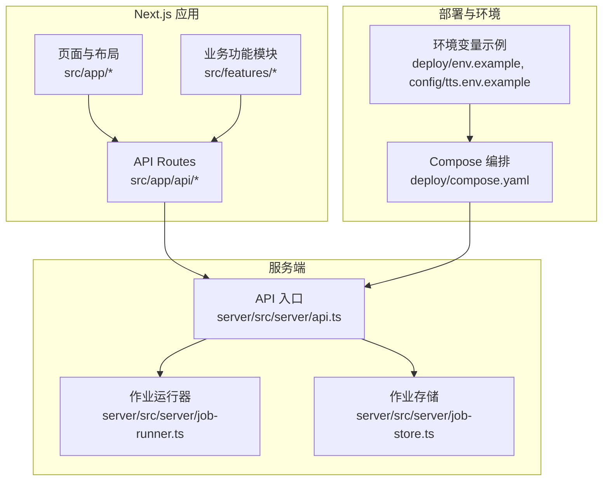
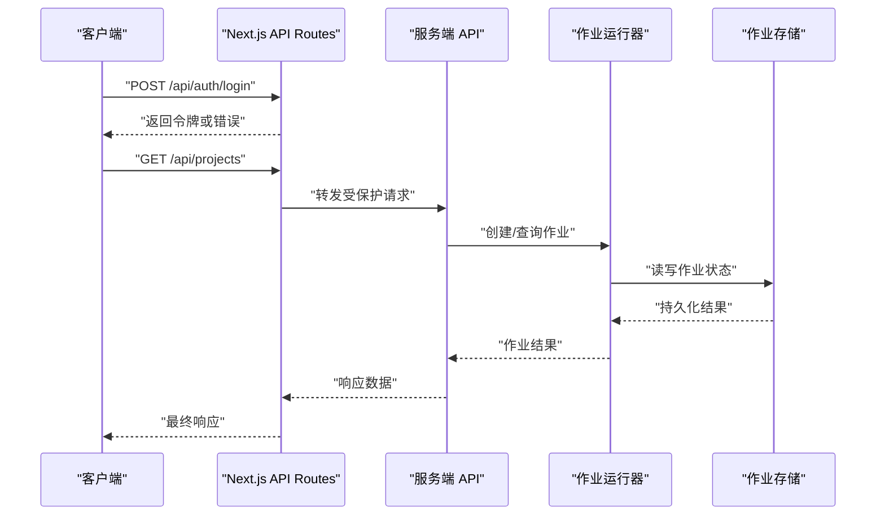
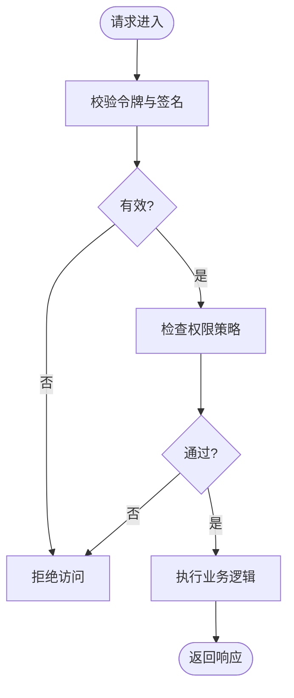
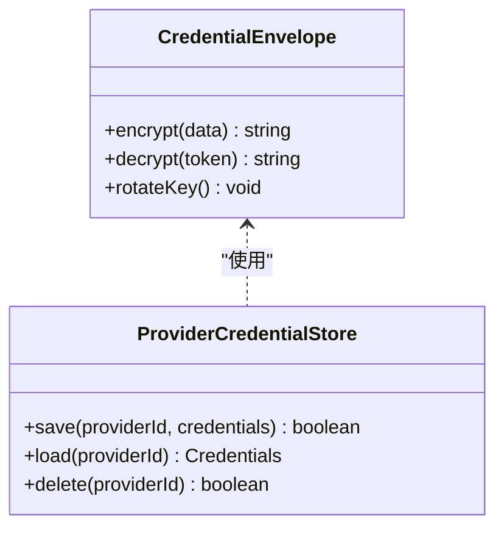
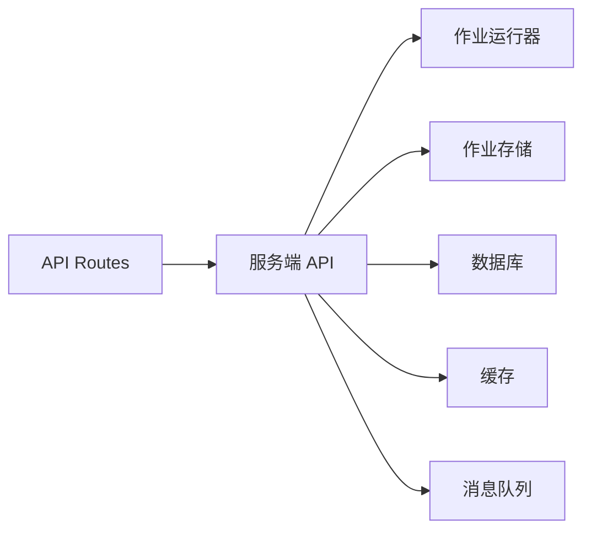

# 安全加固

<cite>
**本文引用的文件**   
- [server/src/index.ts](file://server/src/index.ts)
- [server/src/server/api.ts](file://server/src/server/api.ts)
- [server/src/server/job-runner.ts](file://server/src/server/job-runner.ts)
- [server/src/server/job-store.ts](file://server/src/server/job-store.ts)
- [src/app/(auth)/layout.tsx](file://src/app/(auth)/layout.tsx)
- [src/app/(auth)/login/page.tsx](file://src/app/(auth)/login/page.tsx)
- [src/app/(auth)/signup/page.tsx](file://src/app/(auth)/signup/page.tsx)
- [src/app/_components/route-shell-page.tsx](file://src/app/_components/route-shell-page.tsx)
- [src/app/api/artifacts/[id]/route.ts](file://src/app/api/artifacts/[id]/route.ts)
- [src/app/api/director/pipeline/route.ts](file://src/app/api/director/pipeline/route.ts)
- [src/app/api/director/stage/route.ts](file://src/app/api/director/stage/route.ts)
- [src/app/api/jobs/[id]/route.ts](file://src/app/api/jobs/[id]/route.ts)
- [src/app/api/projects/route.ts](file://src/app/api/projects/route.ts)
- [src/app/api/render/route.ts](file://src/app/api/render/route.ts)
- [src/app/api/settings/route.ts](file://src/app/api/settings/route.ts)
- [src/features/credentials/provider-credential-store.pg.test.ts](file://src/features/credentials/provider-credential-store.pg.test.ts)
- [src/features/credentials/provider-credential-store.ts](file://src/features/credentials/provider-credential-store.ts)
- [src/features/credentials/credential-envelope.ts](file://src/features/credentials/credential-envelope.ts)
- [scripts/migration/provision-master-key.ts](file://scripts/migration/provision-master-key.ts)
- [scripts/setup/bootstrap-credentials.ts](file://scripts/setup/bootstrap-credentials.ts)
- [deploy/compose.yaml](file://deploy/compose.yaml)
- [deploy/env.example](file://deploy/env.example)
- [config/tts.env.example](file://config/tts.env.example)
- [next.config.ts](file://next.config.ts)
- [server/package.json](file://server/package.json)
- [package.json](file://package.json)
</cite>

## 目录
1. [简介](#简介)
2. [项目结构](#项目结构)
3. [核心组件](#核心组件)
4. [架构总览](#架构总览)
5. [详细组件分析](#详细组件分析)
6. [依赖关系分析](#依赖关系分析)
7. [性能与安全权衡](#性能与安全权衡)
8. [故障排查指南](#故障排查指南)
9. [结论](#结论)
10. [附录](#附录)

## 简介
本指南面向 PurpleInk 的安全加固，覆盖输入验证、输出编码与 SQL 注入防护；身份认证与授权（含 JWT、会话与权限）；网络安全（HTTPS、CORS、防火墙）；数据加密存储、密钥管理与敏感信息保护；漏洞扫描、安全审计与合规检查；以及 DDoS 防护、速率限制与异常行为检测。文档基于仓库现有实现进行梳理，并给出可落地的加固建议与流程。

## 项目结构
PurpleInk 采用 Next.js 应用与独立服务端（server）双进程模式：
- Next.js 前端与 API Routes 位于 src/app 与 src/app/api
- 服务端逻辑位于 server/src，包含 API、作业调度与持久化
- 部署配置在 deploy，环境变量模板在 deploy/env.example 与 config/tts.env.example
- 脚本集中在 scripts，包括迁移、凭证初始化等

图表来源 
- [server/src/server/api.ts](file://server/src/server/api.ts)
- [server/src/server/job-runner.ts](file://server/src/server/job-runner.ts)
- [server/src/server/job-store.ts](file://server/src/server/job-store.ts)
- [deploy/compose.yaml](file://deploy/compose.yaml)
- [deploy/env.example](file://deploy/env.example)
- [config/tts.env.example](file://config/tts.env.example)

章节来源
- [server/src/index.ts](file://server/src/index.ts)
- [server/src/server/api.ts](file://server/src/server/api.ts)
- [server/src/server/job-runner.ts](file://server/src/server/job-runner.ts)
- [server/src/server/job-store.ts](file://server/src/server/job-store.ts)
- [deploy/compose.yaml](file://deploy/compose.yaml)
- [deploy/env.example](file://deploy/env.example)
- [config/tts.env.example](file://config/tts.env.example)

## 核心组件
- 认证与授权
  - 登录/注册页面与布局：用于用户交互与路由壳层
  - API 路由：承载鉴权校验、权限控制与请求处理
- 作业与流水线
  - 作业运行器与存储：负责任务执行与状态持久化
- 凭证与密钥
  - 凭证信封与提供者存储：封装敏感凭据的存取
  - 主密钥准备与凭证引导脚本：保障密钥生命周期管理
- 网络与部署
  - Compose 编排与环境变量：统一服务启动与配置注入
  - Next.js 配置：影响运行时安全相关设置

章节来源
- [src/app/(auth)/layout.tsx](file://src/app/(auth)/layout.tsx)
- [src/app/(auth)/login/page.tsx](file://src/app/(auth)/login/page.tsx)
- [src/app/(auth)/signup/page.tsx](file://src/app/(auth)/signup/page.tsx)
- [src/app/api/artifacts/[id]/route.ts](file://src/app/api/artifacts/[id]/route.ts)
- [src/app/api/director/pipeline/route.ts](file://src/app/api/director/pipeline/route.ts)
- [src/app/api/director/stage/route.ts](file://src/app/api/director/stage/route.ts)
- [src/app/api/jobs/[id]/route.ts](file://src/app/api/jobs/[id]/route.ts)
- [src/app/api/projects/route.ts](file://src/app/api/projects/route.ts)
- [src/app/api/render/route.ts](file://src/app/api/render/route.ts)
- [src/app/api/settings/route.ts](file://src/app/api/settings/route.ts)
- [src/features/credentials/provider-credential-store.ts](file://src/features/credentials/provider-credential-store.ts)
- [src/features/credentials/credential-envelope.ts](file://src/features/credentials/credential-envelope.ts)
- [scripts/migration/provision-master-key.ts](file://scripts/migration/provision-master-key.ts)
- [scripts/setup/bootstrap-credentials.ts](file://scripts/setup/bootstrap-credentials.ts)
- [deploy/compose.yaml](file://deploy/compose.yaml)
- [deploy/env.example](file://deploy/env.example)
- [config/tts.env.example](file://config/tts.env.example)
- [next.config.ts](file://next.config.ts)

## 架构总览
下图展示从客户端到服务端的关键调用路径，涵盖认证、作业调度与资源访问。

图表来源 
- [src/app/api/artifacts/[id]/route.ts](file://src/app/api/artifacts/[id]/route.ts)
- [src/app/api/director/pipeline/route.ts](file://src/app/api/director/pipeline/route.ts)
- [src/app/api/director/stage/route.ts](file://src/app/api/director/stage/route.ts)
- [src/app/api/jobs/[id]/route.ts](file://src/app/api/jobs/[id]/route.ts)
- [src/app/api/projects/route.ts](file://src/app/api/projects/route.ts)
- [src/app/api/render/route.ts](file://src/app/api/render/route.ts)
- [src/app/api/settings/route.ts](file://src/app/api/settings/route.ts)
- [server/src/server/api.ts](file://server/src/server/api.ts)
- [server/src/server/job-runner.ts](file://server/src/server/job-runner.ts)
- [server/src/server/job-store.ts](file://server/src/server/job-store.ts)

## 详细组件分析

### 输入验证与输出编码
- 输入验证
  - 所有 API 路由应在入口处对参数、查询字符串与请求体进行严格校验，拒绝非法类型与越界值
  - 对动态路由段（如 [id]）进行格式与存在性校验，避免 ID 伪造与越权访问
- 输出编码
  - 对外输出的 HTML、JSON、CSV 等需按上下文进行编码，防止 XSS 与注入
  - 对富文本渲染路径增加白名单过滤与长度限制
- SQL 注入防护
  - 使用参数化查询与 ORM 抽象，禁止拼接 SQL
  - 对数据库连接启用最小权限账户与只读角色（按需）

章节来源
- [src/app/api/artifacts/[id]/route.ts](file://src/app/api/artifacts/[id]/route.ts)
- [src/app/api/director/pipeline/route.ts](file://src/app/api/director/pipeline/route.ts)
- [src/app/api/director/stage/route.ts](file://src/app/api/director/stage/route.ts)
- [src/app/api/jobs/[id]/route.ts](file://src/app/api/jobs/[id]/route.ts)
- [src/app/api/projects/route.ts](file://src/app/api/projects/route.ts)
- [src/app/api/render/route.ts](file://src/app/api/render/route.ts)
- [src/app/api/settings/route.ts](file://src/app/api/settings/route.ts)

### 身份认证与授权
- 认证机制
  - 登录/注册流程应返回短期有效的访问令牌与刷新令牌，支持令牌轮换与撤销
  - 令牌签名与加密需使用强算法，避免弱密钥与硬编码
- 会话安全
  - 若使用会话 Cookie，需设置 HttpOnly、Secure、SameSite，并限制作用域与过期时间
- 权限控制
  - 基于资源的细粒度授权（RBAC/ABAC），确保用户仅能访问其拥有的项目与工件
  - 在服务端集中校验权限，避免前端绕过

章节来源
- [src/app/(auth)/layout.tsx](file://src/app/(auth)/layout.tsx)
- [src/app/(auth)/login/page.tsx](file://src/app/(auth)/login/page.tsx)
- [src/app/(auth)/signup/page.tsx](file://src/app/(auth)/signup/page.tsx)
- [src/app/_components/route-shell-page.tsx](file://src/app/_components/route-shell-page.tsx)
- [src/app/api/artifacts/[id]/route.ts](file://src/app/api/artifacts/[id]/route.ts)
- [src/app/api/director/pipeline/route.ts](file://src/app/api/director/pipeline/route.ts)
- [src/app/api/director/stage/route.ts](file://src/app/api/director/stage/route.ts)
- [src/app/api/jobs/[id]/route.ts](file://src/app/api/jobs/[id]/route.ts)
- [src/app/api/projects/route.ts](file://src/app/api/projects/route.ts)
- [src/app/api/render/route.ts](file://src/app/api/render/route.ts)
- [src/app/api/settings/route.ts](file://src/app/api/settings/route.ts)

### 网络安全配置
- HTTPS 强制
  - 在反向代理或网关层强制 TLS，禁用不安全协议与弱密码套件
  - 启用 HSTS 与证书自动续期
- CORS 策略
  - 明确允许的源、方法与头，避免通配符与过度开放
- 防火墙规则
  - 仅暴露必要端口，限制内网互访与外部访问范围
  - 对敏感服务（数据库、消息队列）实施网络隔离

章节来源
- [deploy/compose.yaml](file://deploy/compose.yaml)
- [deploy/env.example](file://deploy/env.example)
- [config/tts.env.example](file://config/tts.env.example)
- [next.config.ts](file://next.config.ts)

### 数据加密存储与密钥管理
- 数据加密
  - 对敏感字段（如凭据、用户隐私）进行字段级加密，使用强随机 IV 与 AEAD 模式
- 密钥管理
  - 主密钥由专用脚本生成与导入，禁止硬编码与版本库提交
  - 使用环境变量或密钥管理服务注入，限制读取权限
- 凭证封装
  - 凭证信封提供统一的加解密接口，屏蔽底层实现差异

图表来源 
- [src/features/credentials/credential-envelope.ts](file://src/features/credentials/credential-envelope.ts)
- [src/features/credentials/provider-credential-store.ts](file://src/features/credentials/provider-credential-store.ts)

章节来源
- [src/features/credentials/credential-envelope.ts](file://src/features/credentials/credential-envelope.ts)
- [src/features/credentials/provider-credential-store.ts](file://src/features/credentials/provider-credential-store.ts)
- [scripts/migration/provision-master-key.ts](file://scripts/migration/provision-master-key.ts)
- [scripts/setup/bootstrap-credentials.ts](file://scripts/setup/bootstrap-credentials.ts)

### 作业与流水线安全
- 作业运行器
  - 对作业输入进行白名单校验与大小限制，防止资源耗尽
  - 隔离执行环境，限制文件系统与网络访问
- 作业存储
  - 持久化状态需防篡改，记录审计日志与操作者
- 流水线阶段
  - 每阶段执行前后进行完整性校验与回滚策略

章节来源
- [server/src/server/job-runner.ts](file://server/src/server/job-runner.ts)
- [server/src/server/job-store.ts](file://server/src/server/job-store.ts)
- [server/src/server/api.ts](file://server/src/server/api.ts)

### 依赖与第三方集成安全
- 依赖治理
  - 定期更新依赖，启用依赖锁定与漏洞扫描
  - 最小化依赖面，移除未使用包
- 第三方服务
  - 对 AI、TTS 等外部服务调用进行超时、重试与熔断配置
  - 限制调用频率与配额，避免滥用

章节来源
- [server/package.json](file://server/package.json)
- [package.json](file://package.json)

## 依赖关系分析
- 组件耦合
  - API 路由与服务端 API 解耦，通过明确的接口契约通信
  - 作业运行器与存储通过持久化接口协作，降低直接依赖
- 外部依赖
  - 数据库、对象存储、消息队列等应通过环境变量与配置中心注入
  - 第三方 SDK 需进行沙箱化与权限最小化

图表来源 
- [server/src/server/api.ts](file://server/src/server/api.ts)
- [server/src/server/job-runner.ts](file://server/src/server/job-runner.ts)
- [server/src/server/job-store.ts](file://server/src/server/job-store.ts)

章节来源
- [server/src/server/api.ts](file://server/src/server/api.ts)
- [server/src/server/job-runner.ts](file://server/src/server/job-runner.ts)
- [server/src/server/job-store.ts](file://server/src/server/job-store.ts)

## 性能与安全权衡
- 速率限制
  - 在网关层实施全局与用户维度的速率限制，平衡可用性与安全性
- 缓存策略
  - 对只读数据启用缓存，但需考虑缓存污染与失效策略
- 并发控制
  - 作业队列设置最大并发与优先级，避免资源争用与饥饿

[本节为通用指导，不直接分析具体文件]

## 故障排查指南
- 常见问题
  - 认证失败：检查令牌签发与校验逻辑、Cookie 属性与跨域设置
  - 权限不足：确认资源归属与权限策略是否一致
  - 作业失败：查看运行器日志与存储状态，定位输入校验与资源限制
- 调试工具
  - 启用结构化日志与追踪 ID，便于链路追踪
  - 对关键路径添加断点与指标采集

章节来源
- [server/src/server/job-runner.ts](file://server/src/server/job-runner.ts)
- [server/src/server/job-store.ts](file://server/src/server/job-store.ts)
- [server/src/server/api.ts](file://server/src/server/api.ts)

## 结论
PurpleInk 的安全加固应从输入验证、输出编码、SQL 注入防护入手，完善认证授权与权限控制，强化网络安全与密钥管理，建立完善的漏洞扫描与审计流程，并通过速率限制与异常检测提升抗攻击能力。建议在 CI/CD 中集成安全门禁，持续评估与改进。

[本节为总结，不直接分析具体文件]

## 附录
- 合规性检查清单
  - 数据最小化与隐私保护
  - 审计日志与可追溯性
  - 密钥轮换与备份恢复
- 安全基线
  - 强制 HTTPS、禁用弱加密
  - 最小权限原则与网络隔离
  - 依赖治理与漏洞修复 SLA

[本节为补充信息，不直接分析具体文件]