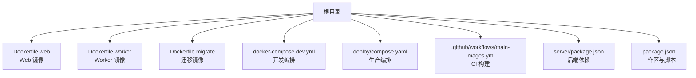
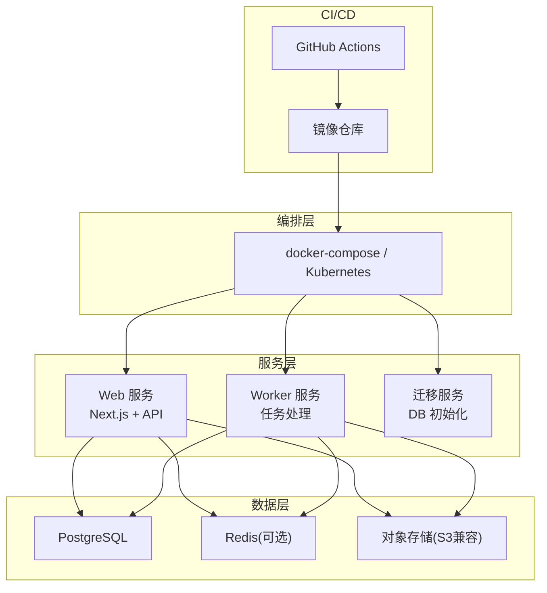
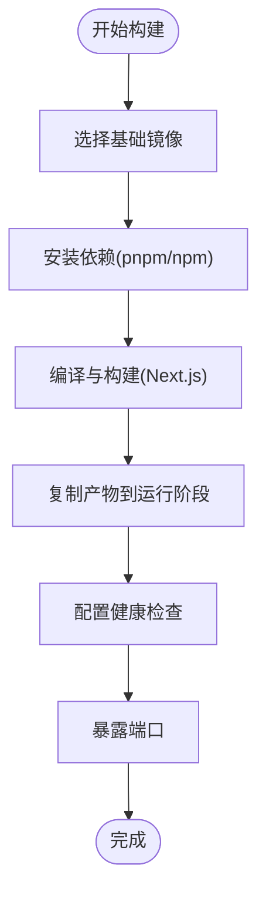
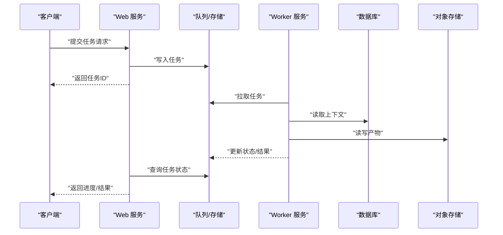
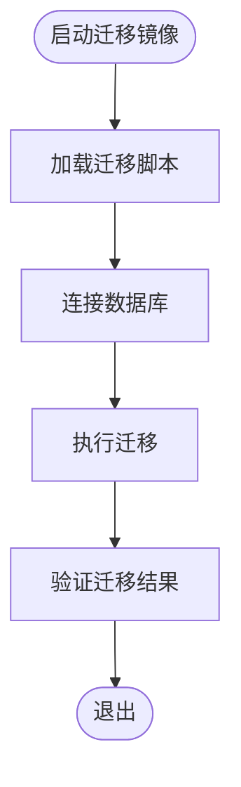
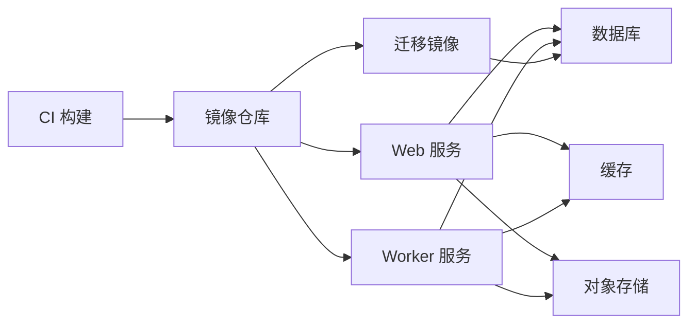

# 容器化部署

<cite>
**本文引用的文件**   
- [Dockerfile.web](file://Dockerfile.web)
- [Dockerfile.worker](file://Dockerfile.worker)
- [Dockerfile.migrate](file://Dockerfile.migrate)
- [docker-compose.dev.yml](file://docker-compose.dev.yml)
- [deploy/compose.yaml](file://deploy/compose.yaml)
- [deploy/env.example](file://deploy/env.example)
- [deploy/worker.env.example](file://deploy/worker.env.example)
- [config/tts.env.example](file://config/tts.env.example)
- [.github/workflows/main-images.yml](file://.github/workflows/main-images.yml)
- [server/package.json](file://server/package.json)
- [package.json](file://package.json)
</cite>

## 目录
1. [简介](#简介)
2. [项目结构](#项目结构)
3. [核心组件](#核心组件)
4. [架构总览](#架构总览)
5. [详细组件分析](#详细组件分析)
6. [依赖关系分析](#依赖关系分析)
7. [性能与优化](#性能与优化)
8. [故障排查指南](#故障排查指南)
9. [结论](#结论)
10. [附录](#附录)

## 简介
本文件面向 PurpleInk 的容器化部署，系统阐述 Web 应用与 Worker 服务的独立镜像构建、多阶段构建优化、镜像分层策略与依赖管理；详细说明 docker-compose 在开发环境与生产环境的编排差异；覆盖环境变量配置、卷挂载、网络设置、健康检查、日志收集与监控集成；并给出资源限制、安全最佳实践与故障恢复机制建议。

## 项目结构
仓库采用“前后端分离 + 任务处理”的架构：Web 服务提供 Next.js 前端与 API，Worker 服务负责后台任务（渲染、导出、TTS 等），迁移脚本用于数据库初始化与升级。容器化相关的关键文件分布如下：
- 根级 Dockerfile：分别定义 Web、Worker、迁移镜像
- deploy 目录：生产编排与示例环境文件
- docker-compose.dev.yml：本地开发编排
- .github/workflows/main-images.yml：CI 构建镜像流水线
- server/package.json：后端依赖入口
- package.json：项目根依赖与工作区配置

**图表来源** 
- [Dockerfile.web](file://Dockerfile.web)
- [Dockerfile.worker](file://Dockerfile.worker)
- [Dockerfile.migrate](file://Dockerfile.migrate)
- [docker-compose.dev.yml](file://docker-compose.dev.yml)
- [deploy/compose.yaml](file://deploy/compose.yaml)
- [.github/workflows/main-images.yml](file://.github/workflows/main-images.yml)
- [server/package.json](file://server/package.json)
- [package.json](file://package.json)

**章节来源**
- [Dockerfile.web](file://Dockerfile.web)
- [Dockerfile.worker](file://Dockerfile.worker)
- [Dockerfile.migrate](file://Dockerfile.migrate)
- [docker-compose.dev.yml](file://docker-compose.dev.yml)
- [deploy/compose.yaml](file://deploy/compose.yaml)
- [.github/workflows/main-images.yml](file://.github/workflows/main-images.yml)
- [server/package.json](file://server/package.json)
- [package.json](file://package.json)

## 核心组件
- Web 镜像：基于 Node.js 运行 Next.js 应用，暴露 HTTP 端口，支持热重载（开发）或静态产物（生产）。
- Worker 镜像：基于 Node.js 运行后台任务处理器，连接队列与存储，执行渲染、导出、TTS 等任务。
- 迁移镜像：仅包含数据库迁移工具，用于首次初始化与版本升级。
- 编排文件：
  - 开发编排：启用源码热更新、调试端口、本地卷挂载、最小依赖。
  - 生产编排：固定镜像版本、只读根文件系统、资源限制、健康检查、外部依赖（数据库、缓存、对象存储等）。

**章节来源**
- [Dockerfile.web](file://Dockerfile.web)
- [Dockerfile.worker](file://Dockerfile.worker)
- [Dockerfile.migrate](file://Dockerfile.migrate)
- [docker-compose.dev.yml](file://docker-compose.dev.yml)
- [deploy/compose.yaml](file://deploy/compose.yaml)

## 架构总览
PurpleInk 容器化架构由以下组件构成：
- Web 服务：对外提供 HTTP API 与页面渲染，内部调用 Worker 任务。
- Worker 服务：消费任务队列，执行耗时任务（渲染、导出、TTS）。
- 数据库：PostgreSQL（通过迁移镜像初始化）。
- 缓存/队列：Redis（可选，视实现而定）。
- 对象存储：S3 兼容存储（用于产物与媒体文件）。
- CI：GitHub Actions 构建并推送镜像到镜像仓库。

**图表来源** 
- [docker-compose.dev.yml](file://docker-compose.dev.yml)
- [deploy/compose.yaml](file://deploy/compose.yaml)
- [.github/workflows/main-images.yml](file://.github/workflows/main-images.yml)

## 详细组件分析

### Web 镜像构建与运行
- 基础镜像：选择轻量 Node.js 运行时。
- 多阶段构建：
  - 构建阶段：安装依赖、编译 Next.js、生成静态产物。
  - 运行阶段：仅拷贝必要产物，减小镜像体积。
- 环境变量：通过环境变量注入运行时配置（如数据库连接、第三方密钥）。
- 健康检查：HTTP 探针检测 /ping 或首页可用性。
- 端口：默认暴露 3000（可配置）。

**图表来源** 
- [Dockerfile.web](file://Dockerfile.web)

**章节来源**
- [Dockerfile.web](file://Dockerfile.web)

### Worker 镜像构建与运行
- 基础镜像：Node.js 运行时。
- 多阶段构建：安装依赖、打包 Worker 代码、仅拷贝产物。
- 任务类型：渲染、导出、TTS 等，读取环境变量与配置文件。
- 健康检查：进程存活与关键依赖可达性检查。
- 资源限制：CPU/内存限制，避免单实例占用过多资源。

**图表来源** 
- [Dockerfile.worker](file://Dockerfile.worker)

**章节来源**
- [Dockerfile.worker](file://Dockerfile.worker)

### 迁移镜像
- 用途：数据库初始化、版本升级、数据校验。
- 运行方式：一次性任务，完成后退出。
- 依赖：数据库连接字符串、迁移脚本路径。

**图表来源** 
- [Dockerfile.migrate](file://Dockerfile.migrate)

**章节来源**
- [Dockerfile.migrate](file://Dockerfile.migrate)

### 开发编排（docker-compose.dev.yml）
- 特点：
  - 使用源码卷挂载，支持热重载。
  - 暴露调试端口，便于远程调试。
  - 简化依赖（本地数据库或容器化数据库）。
  - 环境变量从本地 env 文件加载。
- 网络：自定义桥接网络，服务间通过服务名通信。
- 卷：源码、依赖缓存、临时文件挂载。

**章节来源**
- [docker-compose.dev.yml](file://docker-compose.dev.yml)

### 生产编排（deploy/compose.yaml）
- 特点：
  - 固定镜像标签，确保可重复部署。
  - 只读根文件系统，提升安全性。
  - 资源限制（CPU/内存）、健康检查、重启策略。
  - 环境变量集中管理，敏感信息通过 Secret 注入。
  - 持久化卷：数据库、缓存、对象存储访问凭证。
- 网络：隔离的网络命名空间，限制外部访问。
- 日志：统一输出到 stdout/stderr，供日志采集器收集。

**章节来源**
- [deploy/compose.yaml](file://deploy/compose.yaml)

### CI 镜像构建（.github/workflows/main-images.yml）
- 触发条件：推送至主分支或创建标签。
- 步骤：
  - 检出代码。
  - 登录镜像仓库。
  - 构建 Web、Worker、迁移镜像。
  - 推送镜像到仓库。
- 缓存：依赖缓存加速构建。
- 安全：最小权限原则，密钥通过 Secrets 管理。

**章节来源**
- [.github/workflows/main-images.yml](file://.github/workflows/main-images.yml)

## 依赖关系分析
- 服务依赖：
  - Web 依赖数据库、缓存、对象存储。
  - Worker 依赖数据库、缓存、对象存储。
  - 迁移镜像仅依赖数据库。
- 构建依赖：
  - 前端与后端共享工作区配置。
  - 依赖包管理器（pnpm）缓存加速。
- 外部依赖：
  - 第三方 API（AI、TTS、邮件等）通过环境变量注入密钥。

**图表来源** 
- [docker-compose.dev.yml](file://docker-compose.dev.yml)
- [deploy/compose.yaml](file://deploy/compose.yaml)
- [.github/workflows/main-images.yml](file://.github/workflows/main-images.yml)

**章节来源**
- [server/package.json](file://server/package.json)
- [package.json](file://package.json)

## 性能与优化
- 多阶段构建：减少镜像体积，加快拉取速度。
- 依赖缓存：利用 pnpm 缓存层，加速构建。
- 镜像分层：将易变层（源码）放在底部，稳定层（依赖）在上部。
- 资源限制：为 Worker 设置 CPU/内存上限，避免争用。
- 健康检查：快速失败，自动重启异常实例。
- 日志优化：结构化日志，便于采集与分析。

[本节为通用指导，不直接分析具体文件]

## 故障排查指南
- 常见问题：
  - 环境变量缺失：检查 env 文件与 Secret 注入。
  - 端口冲突：确认端口映射与防火墙规则。
  - 依赖安装失败：检查网络代理与镜像源。
  - 数据库连接失败：检查连接字符串与权限。
  - 对象存储访问失败：检查凭证与桶策略。
- 诊断步骤：
  - 查看容器日志：docker logs 或日志采集系统。
  - 进入容器调试：docker exec 交互式命令。
  - 健康检查失败：检查探针端点与依赖可达性。
  - 资源不足：调整资源限制或扩容实例。

**章节来源**
- [deploy/env.example](file://deploy/env.example)
- [deploy/worker.env.example](file://deploy/worker.env.example)
- [config/tts.env.example](file://config/tts.env.example)

## 结论
PurpleInk 的容器化方案通过独立的 Web 与 Worker 镜像、多阶段构建、严格的编排配置与 CI/CD 集成，实现了高可用、可扩展、易维护的部署架构。遵循本文的最佳实践，可显著提升部署效率与系统稳定性。

[本节为总结，不直接分析具体文件]

## 附录
- 环境变量参考：
  - 通用配置：数据库连接、缓存地址、对象存储凭证。
  - Worker 专用：任务并发数、超时时间、重试策略。
  - TTS 配置：语音提供商密钥与参数。
- 安全建议：
  - 最小权限原则：容器以非 root 用户运行。
  - 镜像扫描：定期扫描漏洞并更新基础镜像。
  - 网络隔离：限制外部访问，仅开放必要端口。
- 监控集成：
  - 指标暴露：Prometheus 格式指标端点。
  - 日志采集：Fluentd/Logstash 收集 stdout/stderr。
  - 告警规则：基于错误率、延迟、资源使用率设置阈值。

[本节为补充信息，不直接分析具体文件]