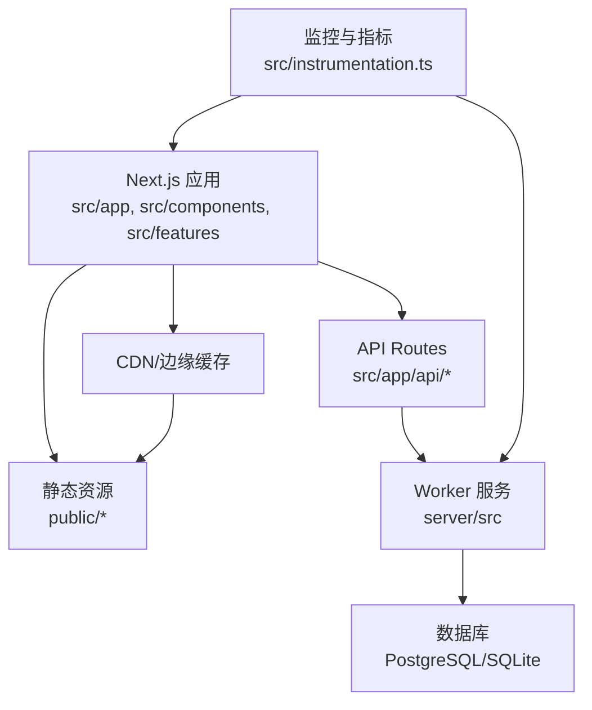
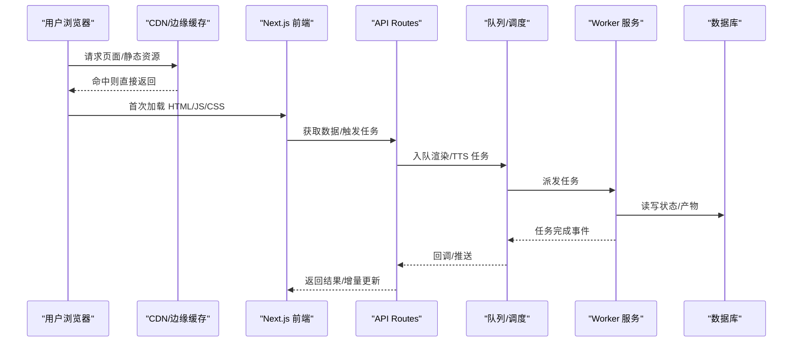
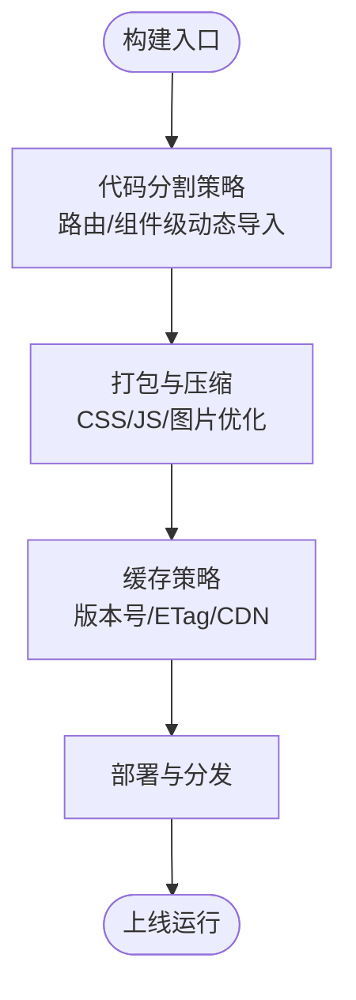
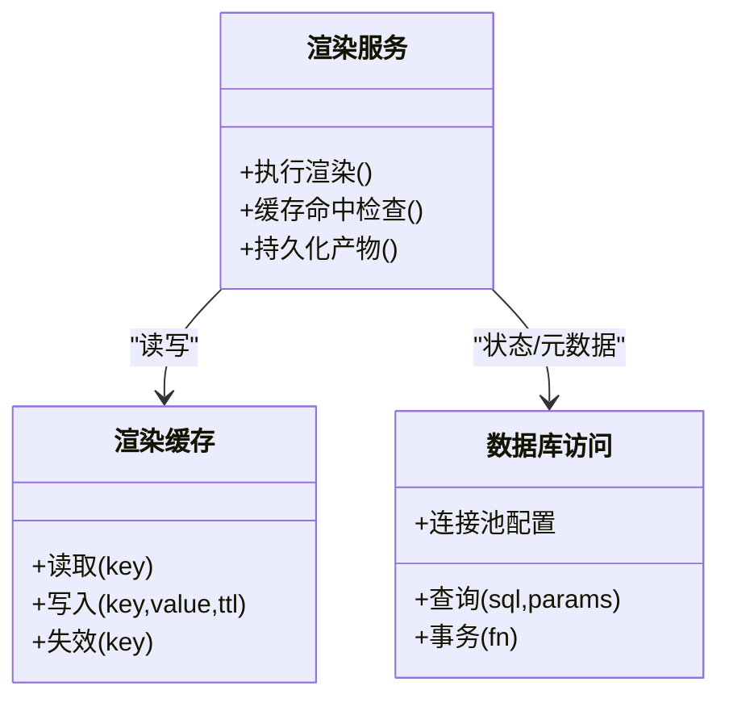
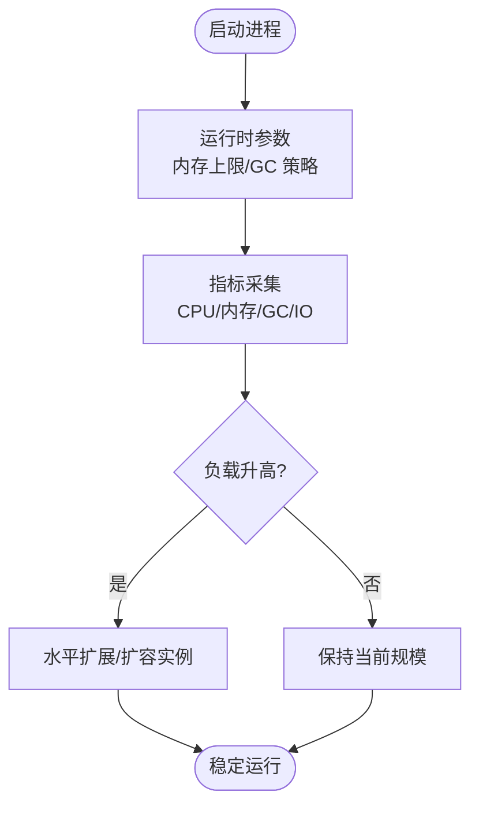
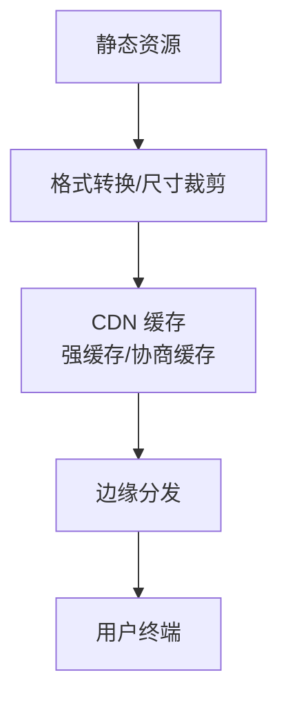
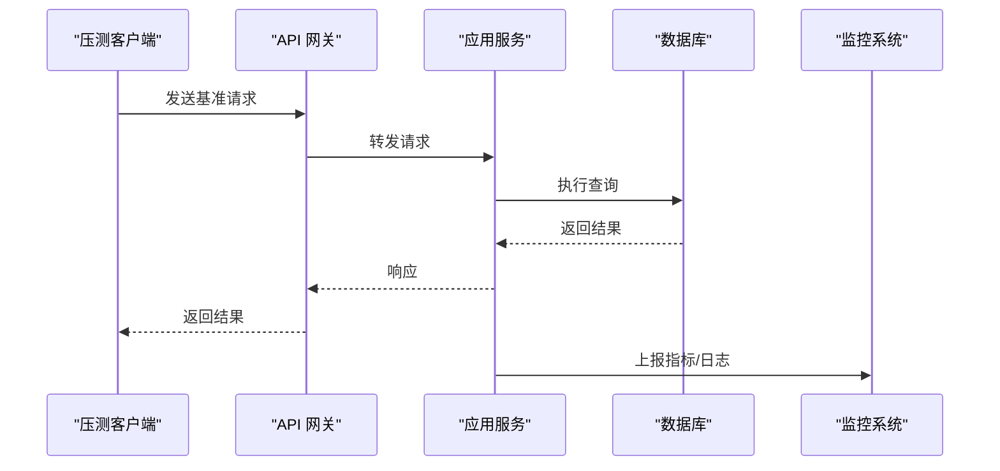
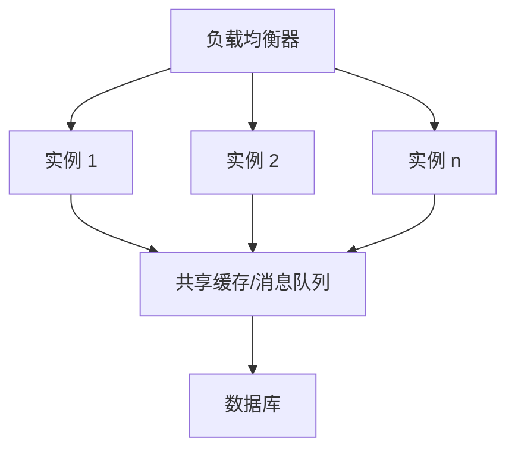
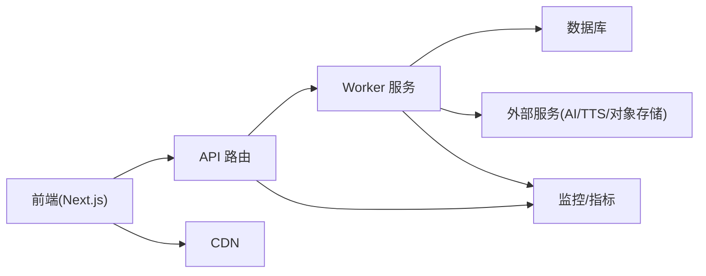

# 性能调优

<cite>
**本文引用的文件**   
- [next.config.ts](file://next.config.ts)
- [package.json](file://package.json)
- [Dockerfile.web](file://Dockerfile.web)
- [Dockerfile.worker](file://Dockerfile.worker)
- [docker-compose.dev.yml](file://docker-compose.dev.yml)
- [compose.yaml](file://deploy/compose.yaml)
- [env.example](file://deploy/env.example)
- [worker.env.example](file://deploy/worker.env.example)
- [drizzle.config.ts](file://drizzle.config.ts)
- [server/package.json](file://server/package.json)
- [server/tsconfig.json](file://server/tsconfig.json)
- [src/instrumentation.ts](file://src/instrumentation.ts)
- [src/app/layout.tsx](file://src/app/layout.tsx)
- [src/app/providers.tsx](file://src/app/providers.tsx)
- [src/lib/site-config.ts](file://src/lib/site-config.ts)
- [src/features/render/cache.ts](file://src/features/render/cache.ts)
- [src/features/render/renderer.ts](file://src/features/render/renderer.ts)
- [src/features/director/queue-handler.ts](file://src/features/director/queue-handler.ts)
- [src/features/audio/runtime-repository.ts](file://src/features/audio/runtime-repository.ts)
- [src/features/artifacts/service.ts](file://src/features/artifacts/service.ts)
- [scripts/setup/db-migrate.ts](file://scripts/setup/db-migrate.ts)
- [scripts/verify/capture-v3-baseline.ts](file://scripts/verify/capture-v3-baseline.ts)
</cite>

## 目录
1. [简介](#简介)
2. [项目结构](#项目结构)
3. [核心组件](#核心组件)
4. [架构总览](#架构总览)
5. [详细组件分析](#详细组件分析)
6. [依赖关系分析](#依赖关系分析)
7. [性能考量](#性能考量)
8. [故障排查指南](#故障排查指南)
9. [结论](#结论)
10. [附录](#附录)

## 简介
本文件面向 PurpleInk 的性能调优，覆盖前端、后端、Node.js 运行时、CDN 与静态资源优化、浏览器缓存策略、监控与基准测试、水平扩展与弹性伸缩等主题。内容基于仓库中的配置与实现进行提炼，帮助读者在不深入源码细节的前提下快速定位优化点并落地实践。

## 项目结构
PurpleInk 采用 Next.js 作为前端与 API 层，配合独立的 worker 服务处理渲染、TTS、队列任务；数据库使用 Drizzle ORM 管理迁移与连接；部署通过 Docker Compose 编排。关键路径：
- 前端与 API：src/app、src/components、src/features、src/lib
- 服务端与 Worker：server/src（采集、编排、渲染、TTS）
- 构建与运行：next.config.ts、Dockerfile.*、docker-compose.*
- 数据与迁移：drizzle.config.ts、scripts/setup/db-migrate.ts
- 监控与指标：src/instrumentation.ts

**图表来源** 
- [next.config.ts:1-200](file://next.config.ts#L1-L200)
- [src/app/layout.tsx:1-200](file://src/app/layout.tsx#L1-L200)
- [src/instrumentation.ts:1-200](file://src/instrumentation.ts#L1-L200)
- [server/package.json:1-200](file://server/package.json#L1-L200)

**章节来源**
- [next.config.ts:1-200](file://next.config.ts#L1-L200)
- [package.json:1-200](file://package.json#L1-L200)
- [docker-compose.dev.yml:1-200](file://docker-compose.dev.yml#L1-L200)
- [compose.yaml:1-200](file://deploy/compose.yaml#L1-L200)

## 核心组件
- 前端构建与打包：Next.js 构建管线、代码分割、资源压缩、图片优化
- 运行时与监控：OpenTelemetry/自定义指标上报
- 渲染与导出：渲染流水线、帧捕获、缩略图生成、缓存
- 队列与并发：Director 队列处理器、阶段执行器、并发控制
- 数据访问：Drizzle ORM、连接池、查询优化
- 部署与容器：Docker 镜像分层、环境变量、Compose 编排

**章节来源**
- [next.config.ts:1-200](file://next.config.ts#L1-L200)
- [src/instrumentation.ts:1-200](file://src/instrumentation.ts#L1-L200)
- [src/features/render/renderer.ts:1-200](file://src/features/render/renderer.ts#L1-L200)
- [src/features/director/queue-handler.ts:1-200](file://src/features/director/queue-handler.ts#L1-L200)
- [drizzle.config.ts:1-200](file://drizzle.config.ts#L1-L200)

## 架构总览
系统由“前端 + API + Worker + 数据库”构成，请求经 CDN 进入 Next.js，API 路由将耗时任务下沉到 Worker，结果落库并通过流式或轮询返回给前端。监控贯穿全链路。

**图表来源** 
- [src/app/api/*/route.ts:1-200](file://src/app/api/*/route.ts#L1-L200)
- [src/features/director/queue-handler.ts:1-200](file://src/features/director/queue-handler.ts#L1-L200)
- [server/src/index.ts:1-200](file://server/src/index.ts#L1-L200)

## 详细组件分析

### 前端性能优化
- 代码分割与懒加载
  - 利用 Next.js 的页面级与组件级动态导入，按路由与交互拆分 JS 包
  - 对重型 UI 组件、第三方库按需加载，减少首屏体积
- 资源压缩与优化
  - 启用 CSS/JS 压缩、Tree Shaking、图片格式转换与尺寸裁剪
  - 合理设置 HTTP 缓存头与版本化文件名，提升缓存命中率
- 构建与运行时
  - 关闭不必要的调试信息，生产环境禁用 Source Map
  - 预取关键路由数据，避免阻塞渲染

**图表来源** 
- [next.config.ts:1-200](file://next.config.ts#L1-L200)
- [src/app/layout.tsx:1-200](file://src/app/layout.tsx#L1-L200)

**章节来源**
- [next.config.ts:1-200](file://next.config.ts#L1-L200)
- [src/app/layout.tsx:1-200](file://src/app/layout.tsx#L1-L200)
- [src/app/providers.tsx:1-200](file://src/app/providers.tsx#L1-L200)

### 后端性能优化
- 数据库查询优化
  - 使用 Drizzle 的索引与关联查询优化，避免 N+1 查询
  - 分页与只读副本分担压力，热点数据走缓存
- 缓存策略
  - 渲染产物与缩略图多级缓存（内存/对象存储/CDN）
  - 短 TTL 与失效策略结合，保证一致性
- 连接池配置
  - 根据 CPU/内存与并发调整连接数、超时与重试
  - 区分读写连接池，限制最大连接数

**图表来源** 
- [src/features/render/cache.ts:1-200](file://src/features/render/cache.ts#L1-L200)
- [src/features/render/renderer.ts:1-200](file://src/features/render/renderer.ts#L1-L200)
- [drizzle.config.ts:1-200](file://drizzle.config.ts#L1-L200)

**章节来源**
- [src/features/render/cache.ts:1-200](file://src/features/render/cache.ts#L1-L200)
- [src/features/render/renderer.ts:1-200](file://src/features/render/renderer.ts#L1-L200)
- [drizzle.config.ts:1-200](file://drizzle.config.ts#L1-L200)

### Node.js 运行时调优
- 内存管理与垃圾回收
  - 监控堆大小与 GC 停顿，调整 MaxOldGenerationSize
  - 避免大对象频繁分配，复用缓冲区与连接
- 进程模型
  - 多进程/集群模式提升吞吐，注意共享状态与锁
  - 优雅重启与零停机发布
- 日志与指标
  - 结构化日志，采样与分级输出
  - 暴露关键指标（延迟、吞吐、错误率、GC 时间）

**图表来源** 
- [Dockerfile.web:1-200](file://Dockerfile.web#L1-L200)
- [Dockerfile.worker:1-200](file://Dockerfile.worker#L1-L200)
- [src/instrumentation.ts:1-200](file://src/instrumentation.ts#L1-L200)

**章节来源**
- [Dockerfile.web:1-200](file://Dockerfile.web#L1-L200)
- [Dockerfile.worker:1-200](file://Dockerfile.worker#L1-L200)
- [src/instrumentation.ts:1-200](file://src/instrumentation.ts#L1-L200)

### CDN 与静态资源优化
- 静态资源
  - 图片 WebP/AVIF、按需尺寸、懒加载
  - 字体子集化与预加载关键字体
- 缓存策略
  - 长缓存 + 版本化文件名，HTML 短缓存
  - 使用 ETag/Last-Modified 与协商缓存
- 边缘计算
  - 在边缘做 A/B 与路由重写，降低回源

**图表来源** 
- [next.config.ts:1-200](file://next.config.ts#L1-L200)
- [src/lib/site-config.ts:1-200](file://src/lib/site-config.ts#L1-L200)

**章节来源**
- [next.config.ts:1-200](file://next.config.ts#L1-L200)
- [src/lib/site-config.ts:1-200](file://src/lib/site-config.ts#L1-L200)

### 监控、基准测试与瓶颈分析
- 监控工具
  - OpenTelemetry/自定义指标，集中式日志与告警
  - 前端性能指标（FCP/LCP/CLS/TTFB）
- 基准测试
  - 接口压测、渲染流水线端到端基准
  - 数据库慢查询分析与索引优化
- 瓶颈分析
  - 火焰图与调用链追踪，识别热点函数与 I/O 等待
  - 容量规划与弹性阈值设定

**图表来源** 
- [scripts/verify/capture-v3-baseline.ts:1-200](file://scripts/verify/capture-v3-baseline.ts#L1-L200)
- [src/instrumentation.ts:1-200](file://src/instrumentation.ts#L1-L200)

**章节来源**
- [scripts/verify/capture-v3-baseline.ts:1-200](file://scripts/verify/capture-v3-baseline.ts#L1-L200)
- [src/instrumentation.ts:1-200](file://src/instrumentation.ts#L1-L200)

### 水平扩展、负载均衡与弹性伸缩
- 无状态设计
  - 会话外置、任务可重放、幂等性保障
- 负载均衡
  - 反向代理/网关分发，健康检查与熔断
- 弹性伸缩
  - 基于 CPU/内存/队列长度自动扩缩容
  - 预热与冷启动优化

**图表来源** 
- [docker-compose.dev.yml:1-200](file://docker-compose.dev.yml#L1-L200)
- [compose.yaml:1-200](file://deploy/compose.yaml#L1-L200)

**章节来源**
- [docker-compose.dev.yml:1-200](file://docker-compose.dev.yml#L1-L200)
- [compose.yaml:1-200](file://deploy/compose.yaml#L1-L200)

## 依赖关系分析
- 前端依赖 Next.js 生态，强调构建优化与运行时轻量
- 后端依赖 Drizzle ORM 与外部服务（对象存储、AI/TTS 供应商）
- Worker 独立部署，专注高吞吐任务处理
- 监控与日志贯穿各层，便于问题定位

**图表来源** 
- [package.json:1-200](file://package.json#L1-L200)
- [server/package.json:1-200](file://server/package.json#L1-L200)
- [drizzle.config.ts:1-200](file://drizzle.config.ts#L1-L200)

**章节来源**
- [package.json:1-200](file://package.json#L1-L200)
- [server/package.json:1-200](file://server/package.json#L1-L200)
- [drizzle.config.ts:1-200](file://drizzle.config.ts#L1-L200)

## 性能考量
- 前端
  - 首屏体积与解析时间优先，关键路径最小化
  - 组件懒加载与数据预取平衡用户体验
- 后端
  - 数据库查询与缓存命中率决定整体吞吐
  - 队列消费速率与 Worker 并发需匹配峰值
- 运行时
  - 内存上限与 GC 策略影响延迟稳定性
  - 进程模型与热重载策略影响发布效率
- 网络与缓存
  - CDN 命中率与边缘规则直接影响 TTFB
  - 浏览器缓存与协商缓存减少重复传输

[本节为通用指导，不直接分析具体文件]

## 故障排查指南
- 常见问题
  - 首屏卡顿：检查 JS 包大小、未使用的依赖、图片未优化
  - 渲染超时：查看 Worker 日志、队列积压、数据库慢查询
  - 内存泄漏：关注堆快照、对象引用链、定时器未清理
- 诊断步骤
  - 开启详细日志与指标，定位热点与异常
  - 使用压测复现问题，逐步缩小范围
  - 结合火焰图与调用链分析瓶颈

**章节来源**
- [src/instrumentation.ts:1-200](file://src/instrumentation.ts#L1-L200)
- [scripts/setup/db-migrate.ts:1-200](file://scripts/setup/db-migrate.ts#L1-L200)

## 结论
PurpleInk 的性能调优需要前后端协同：前端聚焦构建与加载优化，后端强化缓存与数据库效率，运行时关注内存与 GC，网络侧利用 CDN 与缓存策略。通过完善的监控与基准测试，持续发现并消除瓶颈，最终实现稳定高效的交付体验。

[本节为总结性内容，不直接分析具体文件]

## 附录
- 环境变量参考
  - 应用与环境变量：deploy/env.example
  - Worker 环境变量：deploy/worker.env.example
- 部署与运行
  - 开发编排：docker-compose.dev.yml
  - 生产编排：deploy/compose.yaml
  - 镜像构建：Dockerfile.web、Dockerfile.worker
- 数据与迁移
  - Drizzle 配置：drizzle.config.ts
  - 迁移脚本：scripts/setup/db-migrate.ts

**章节来源**
- [deploy/env.example:1-200](file://deploy/env.example#L1-L200)
- [deploy/worker.env.example:1-200](file://deploy/worker.env.example#L1-L200)
- [docker-compose.dev.yml:1-200](file://docker-compose.dev.yml#L1-L200)
- [compose.yaml:1-200](file://deploy/compose.yaml#L1-L200)
- [Dockerfile.web:1-200](file://Dockerfile.web#L1-L200)
- [Dockerfile.worker:1-200](file://Dockerfile.worker#L1-L200)
- [drizzle.config.ts:1-200](file://drizzle.config.ts#L1-L200)
- [scripts/setup/db-migrate.ts:1-200](file://scripts/setup/db-migrate.ts#L1-L200)