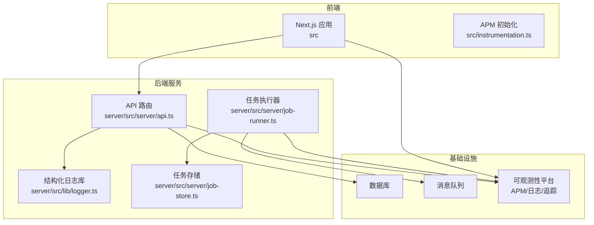
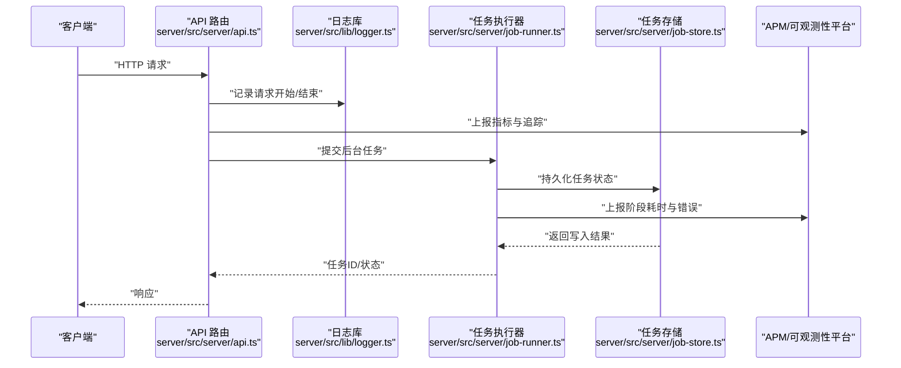
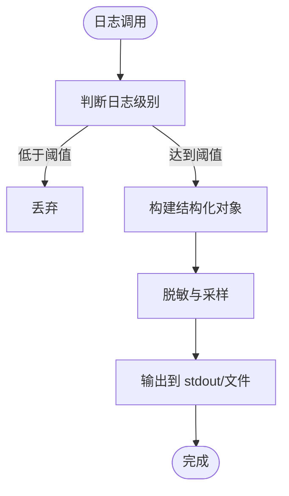
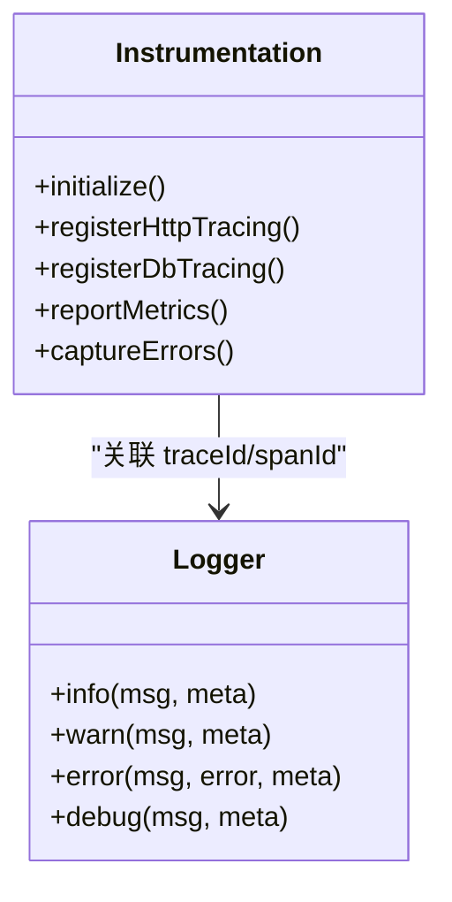
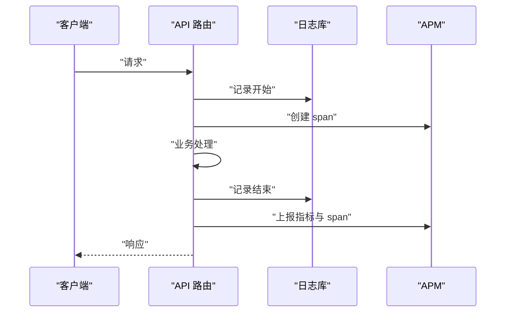
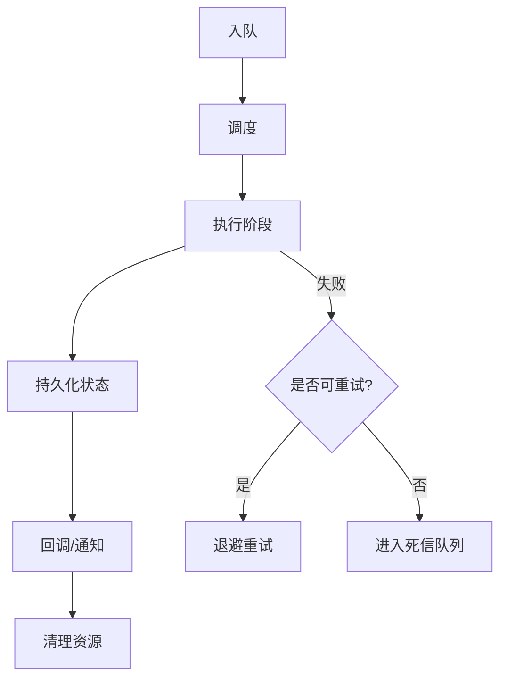
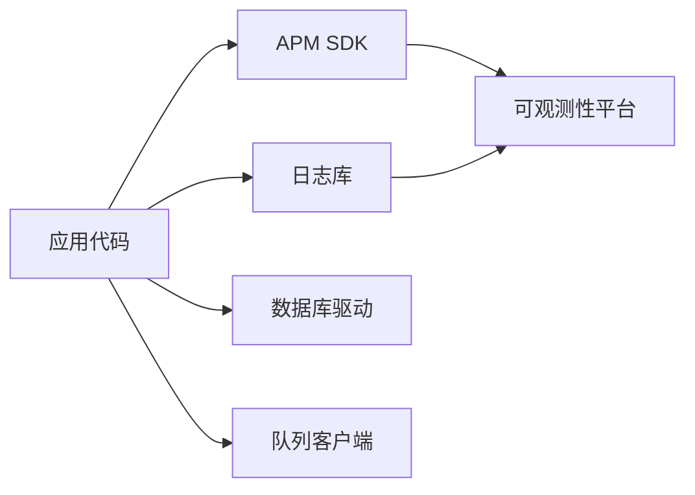

# 监控与日志

<cite>
**本文引用的文件**   
- [server/src/lib/logger.ts](file://server/src/lib/logger.ts)
- [src/instrumentation.ts](file://src/instrumentation.ts)
- [server/src/server/api.ts](file://server/src/server/api.ts)
- [server/src/server/job-runner.ts](file://server/src/server/job-runner.ts)
- [server/src/server/job-store.ts](file://server/src/server/job-store.ts)
- [server/package.json](file://server/package.json)
- [server/tsconfig.json](file://server/tsconfig.json)
- [docker-compose.dev.yml](file://docker-compose.dev.yml)
- [deploy/compose.yaml](file://deploy/compose.yaml)
- [deploy/env.example](file://deploy/env.example)
- [deploy/worker.env.example](file://deploy/worker.env.example)
- [scripts/setup/db-migrate.ts](file://scripts/setup/db-migrate.ts)
- [scripts/verify/capture-v3-baseline.ts](file://scripts/verify/capture-v3-baseline.ts)
- [tests/worker-error-hygiene.test.ts](file://tests/worker-error-hygiene.test.ts)
</cite>

## 目录
1. [简介](#简介)
2. [项目结构](#项目结构)
3. [核心组件](#核心组件)
4. [架构总览](#架构总览)
5. [详细组件分析](#详细组件分析)
6. [依赖关系分析](#依赖关系分析)
7. [性能考量](#性能考量)
8. [故障排查指南](#故障排查指南)
9. [结论](#结论)
10. [附录](#附录)

## 简介
本文件为 PurpleInK 的监控与日志系统提供全面说明，覆盖应用性能监控（APM）配置、结构化日志格式、日志级别管理、日志聚合方案、关键业务指标定义、性能基准与容量规划、告警规则与通知渠道、故障响应流程、日志分析工具与查询语法、可视化仪表板、分布式追踪、慢查询分析与内存泄漏检测等。文档面向不同技术背景的读者，既提供高层概览，也给出代码级映射与实践建议。

## 项目结构
PurpleInK 采用前后端分离与多进程部署：前端 Next.js 应用位于 src，服务端逻辑位于 server/src，脚本与测试位于 scripts 与 tests，容器编排与部署配置位于 deploy 与 docker-compose.*。监控与日志相关的关键位置包括：
- 服务端日志库：server/src/lib/logger.ts
- APM 初始化入口：src/instrumentation.ts
- API 路由与服务：server/src/server/api.ts
- 任务执行器与存储：server/src/server/job-runner.ts、server/src/server/job-store.ts
- 服务包依赖与构建：server/package.json、server/tsconfig.json
- 容器化与运行环境：docker-compose.dev.yml、deploy/compose.yaml、deploy/env.example、deploy/worker.env.example
- 数据库迁移与验证脚本：scripts/setup/db-migrate.ts、scripts/verify/capture-v3-baseline.ts
- 错误处理测试用例：tests/worker-error-hygiene.test.ts

**图表来源** 
- [src/instrumentation.ts](file://src/instrumentation.ts)
- [server/src/server/api.ts](file://server/src/server/api.ts)
- [server/src/lib/logger.ts](file://server/src/lib/logger.ts)
- [server/src/server/job-runner.ts](file://server/src/server/job-runner.ts)
- [server/src/server/job-store.ts](file://server/src/server/job-store.ts)

**章节来源**
- [server/src/lib/logger.ts](file://server/src/lib/logger.ts)
- [src/instrumentation.ts](file://src/instrumentation.ts)
- [server/src/server/api.ts](file://server/src/server/api.ts)
- [server/src/server/job-runner.ts](file://server/src/server/job-runner.ts)
- [server/src/server/job-store.ts](file://server/src/server/job-store.ts)
- [server/package.json](file://server/package.json)
- [server/tsconfig.json](file://server/tsconfig.json)
- [docker-compose.dev.yml](file://docker-compose.dev.yml)
- [deploy/compose.yaml](file://deploy/compose.yaml)
- [deploy/env.example](file://deploy/env.example)
- [deploy/worker.env.example](file://deploy/worker.env.example)
- [scripts/setup/db-migrate.ts](file://scripts/setup/db-migrate.ts)
- [scripts/verify/capture-v3-baseline.ts](file://scripts/verify/capture-v3-baseline.ts)
- [tests/worker-error-hygiene.test.ts](file://tests/worker-error-hygiene.test.ts)

## 核心组件
- 结构化日志库（logger.ts）：统一输出 JSON 结构化日志，包含时间戳、级别、模块、请求上下文、耗时与错误堆栈；支持按级别过滤与采样。
- APM 初始化（instrumentation.ts）：在应用启动时注册 APM SDK，启用 HTTP 链路追踪、数据库与外部调用埋点、错误上报与自定义指标。
- API 路由（api.ts）：对每个请求注入 traceId/spanId，记录入参出参摘要、状态码、耗时，并上报到 APM。
- 任务执行器（job-runner.ts）：对后台任务进行分片与重试，记录阶段耗时、失败原因与恢复信息，便于慢任务定位。
- 任务存储（job-store.ts）：持久化任务状态与结果，记录写入延迟与一致性事件，支撑审计与回溯。

**章节来源**
- [server/src/lib/logger.ts](file://server/src/lib/logger.ts)
- [src/instrumentation.ts](file://src/instrumentation.ts)
- [server/src/server/api.ts](file://server/src/server/api.ts)
- [server/src/server/job-runner.ts](file://server/src/server/job-runner.ts)
- [server/src/server/job-store.ts](file://server/src/server/job-store.ts)

## 架构总览
PurpleInK 的可观测性架构由“采集—传输—存储—分析—告警”组成：
- 采集层：Node.js 进程内通过 instrumentation.ts 启用 APM SDK，使用 logger.ts 输出结构化日志；HTTP 中间件自动注入追踪上下文。
- 传输层：APM SDK 将指标、追踪与日志批量上报至可观测性平台（如 OpenTelemetry Collector + 后端）。
- 存储层：指标与追踪数据进入时序数据库与追踪存储；结构化日志进入日志聚合系统。
- 分析层：基于 SQL-like 或 DSL 查询语言进行日志检索与指标分析；仪表盘展示关键业务指标与系统健康度。
- 告警层：基于阈值与异常模式触发告警，通过邮件、IM、电话等多渠道通知，并联动工单与自动化修复。

**图表来源** 
- [server/src/server/api.ts](file://server/src/server/api.ts)
- [server/src/lib/logger.ts](file://server/src/lib/logger.ts)
- [server/src/server/job-runner.ts](file://server/src/server/job-runner.ts)
- [server/src/server/job-store.ts](file://server/src/server/job-store.ts)

## 详细组件分析

### 结构化日志规范与级别管理
- 字段约定：timestamp、level、module、traceId、spanId、msg、durationMs、error、meta。
- 级别策略：DEBUG（开发）、INFO（生产默认）、WARN（潜在问题）、ERROR（失败路径）、FATAL（不可恢复）。
- 采样与脱敏：对高频 DEBUG 进行采样；敏感字段（密钥、用户标识）必须脱敏。
- 输出目标：stdout 供容器收集；可选文件落盘用于本地调试。

**图表来源** 
- [server/src/lib/logger.ts](file://server/src/lib/logger.ts)

**章节来源**
- [server/src/lib/logger.ts](file://server/src/lib/logger.ts)

### APM 初始化与链路追踪
- 初始化时机：应用启动早期加载 instrumentation.ts，注册 HTTP、数据库、外部调用埋点。
- 上下文传播：traceId/spanId 随请求与任务传递，确保跨服务链路完整。
- 自定义指标：QPS、P95/P99 延迟、错误率、队列长度、任务成功率。
- 错误追踪：捕获未处理异常与 Promise 拒绝，附带堆栈与上下文。

**图表来源** 
- [src/instrumentation.ts](file://src/instrumentation.ts)
- [server/src/lib/logger.ts](file://server/src/lib/logger.ts)

**章节来源**
- [src/instrumentation.ts](file://src/instrumentation.ts)
- [server/src/lib/logger.ts](file://server/src/lib/logger.ts)

### API 请求处理与指标上报
- 请求生命周期：解析入参→鉴权→业务处理→响应→记录日志→上报指标。
- 指标维度：方法、路径、状态码、耗时、错误类型、租户/项目 ID。
- 追踪注入：中间件生成 span，记录子步骤耗时。

**图表来源** 
- [server/src/server/api.ts](file://server/src/server/api.ts)
- [server/src/lib/logger.ts](file://server/src/lib/logger.ts)

**章节来源**
- [server/src/server/api.ts](file://server/src/server/api.ts)
- [server/src/lib/logger.ts](file://server/src/lib/logger.ts)

### 任务执行器与存储的可观测性
- 任务生命周期：入队→调度→执行→持久化→回调→清理。
- 指标：入队速率、消费速率、重试次数、失败率、阶段耗时分布。
- 错误处理：幂等重试、死信队列、失败告警与人工介入。

**图表来源** 
- [server/src/server/job-runner.ts](file://server/src/server/job-runner.ts)
- [server/src/server/job-store.ts](file://server/src/server/job-store.ts)

**章节来源**
- [server/src/server/job-runner.ts](file://server/src/server/job-runner.ts)
- [server/src/server/job-store.ts](file://server/src/server/job-store.ts)

### 容器化与环境配置
- 环境变量：日志级别、APM 上报地址、数据库连接、队列配置。
- 容器编排：服务间依赖、健康检查、资源限制、滚动更新。
- 安全：最小权限、密钥注入、网络隔离。

**章节来源**
- [docker-compose.dev.yml](file://docker-compose.dev.yml)
- [deploy/compose.yaml](file://deploy/compose.yaml)
- [deploy/env.example](file://deploy/env.example)
- [deploy/worker.env.example](file://deploy/worker.env.example)

### 数据库迁移与验证
- 迁移脚本：版本化迁移、回滚策略、幂等执行。
- 基线验证：性能基线与回归测试，确保变更不引入退化。

**章节来源**
- [scripts/setup/db-migrate.ts](file://scripts/setup/db-migrate.ts)
- [scripts/verify/capture-v3-baseline.ts](file://scripts/verify/capture-v3-baseline.ts)

### 错误处理与测试
- 错误分类：输入校验、业务异常、外部依赖失败、系统错误。
- 测试策略：错误路径覆盖、超时与重试模拟、断言日志与指标。

**章节来源**
- [tests/worker-error-hygiene.test.ts](file://tests/worker-error-hygiene.test.ts)

## 依赖关系分析
- 运行时依赖：APM SDK、日志库、HTTP 框架、数据库驱动、队列客户端。
- 构建依赖：TypeScript、打包工具、测试框架。
- 外部依赖：可观测性平台、消息队列、对象存储。

**图表来源** 
- [server/package.json](file://server/package.json)
- [server/tsconfig.json](file://server/tsconfig.json)

**章节来源**
- [server/package.json](file://server/package.json)
- [server/tsconfig.json](file://server/tsconfig.json)

## 性能考量
- 指标采集开销：采样与批量化上报，避免热点路径频繁 IO。
- 日志体积控制：按需 DEBUG、字段裁剪、压缩与轮转。
- 追踪采样：高吞吐下降低全量采样比例，保留关键链路。
- 资源限制：CPU/内存配额、GC 调优、连接池大小。
- 容量规划：根据 QPS、延迟目标与错误率预算计算实例数与扩缩容策略。

[本节为通用指导，无需特定文件引用]

## 故障排查指南
- 快速定位：通过 traceId 串联请求与任务日志，查看错误堆栈与上下文。
- 指标诊断：观察 P95/P99 延迟突增、错误率上升、队列积压。
- 日志检索：按级别、模块、traceId、错误类型筛选；使用正则与字段匹配。
- 慢查询分析：数据库慢查询日志与索引命中情况；SQL 计划分析。
- 内存泄漏检测：堆快照对比、对象增长趋势、GC 频率与停顿时间。
- 告警闭环：确认告警→复现→定位→修复→验证→复盘。

**章节来源**
- [server/src/lib/logger.ts](file://server/src/lib/logger.ts)
- [src/instrumentation.ts](file://src/instrumentation.ts)
- [server/src/server/job-runner.ts](file://server/src/server/job-runner.ts)
- [server/src/server/job-store.ts](file://server/src/server/job-store.ts)

## 结论
PurpleInK 的监控与日志体系以结构化日志与 APM 为核心，贯穿请求、任务与存储链路，形成完整的可观测性闭环。通过合理的指标定义、告警策略与分析工具，能够快速定位问题、保障稳定性并支撑容量规划与性能优化。

[本节为总结，无需特定文件引用]

## 附录

### 关键业务指标定义
- 请求类：QPS、平均/分位延迟、错误率、成功响应比。
- 任务类：入队/消费速率、重试率、失败率、阶段耗时分布。
- 资源类：CPU/内存使用率、GC 停顿、连接池占用、磁盘 I/O。
- 质量类：可用性、SLI/SLO 达成率、变更失败率。

[本节为概念性内容，无需特定文件引用]

### 性能基准与容量规划
- 基准场景：典型请求路径、峰值负载、长尾延迟。
- 容量模型：实例数=QPS×单实例吞吐×安全系数；按延迟与错误率约束调整。
- 弹性策略：水平扩展、自动缩放、降级与熔断。

[本节为概念性内容，无需特定文件引用]

### 告警规则与通知渠道
- 规则类型：阈值告警、异常模式、复合条件。
- 通知渠道：邮件、IM、电话、工单系统。
- 响应流程：分级响应、值班排班、演练与复盘。

[本节为概念性内容，无需特定文件引用]

### 日志分析工具与查询语法
- 工具：日志聚合平台、APM 控制台、CLI 工具。
- 语法：字段过滤、范围查询、正则匹配、聚合统计。
- 可视化：折线图、柱状图、热力图、拓扑图。

[本节为概念性内容，无需特定文件引用]

### 分布式追踪与慢查询分析
- 追踪：跨服务链路、子跨度拆分、外部调用标记。
- 慢查询：SQL 计划、索引优化、缓存策略。
- 内存泄漏：堆快照、对象引用链、GC 调优。

[本节为概念性内容，无需特定文件引用]