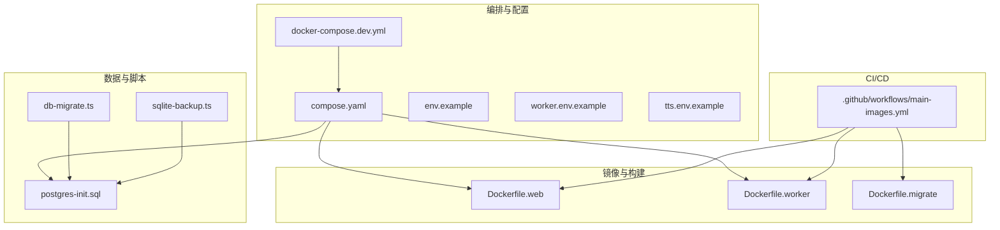
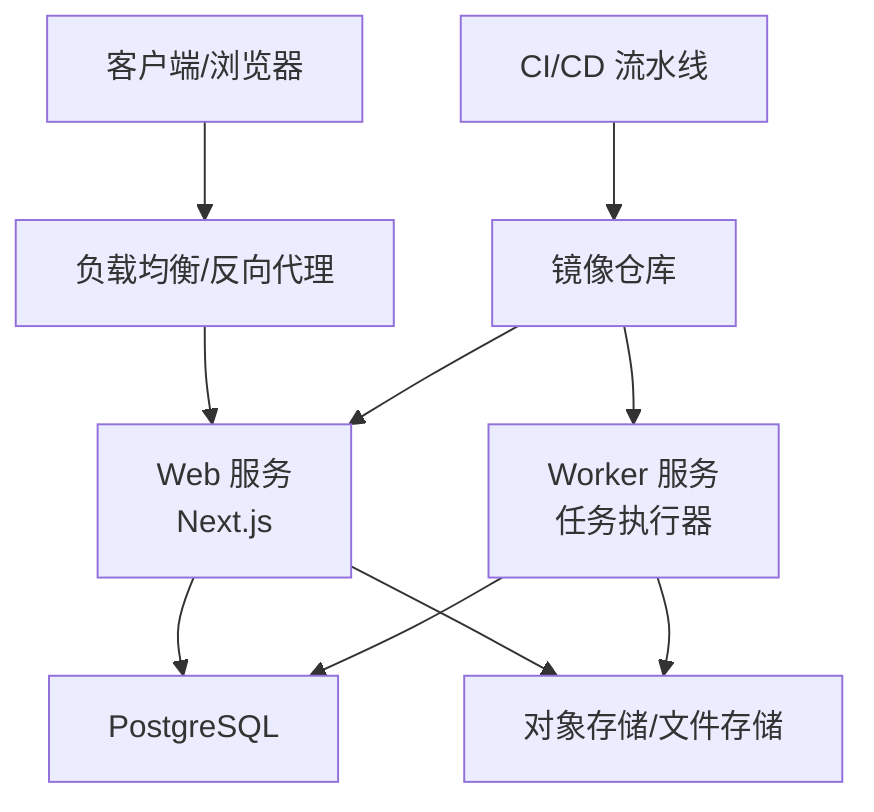
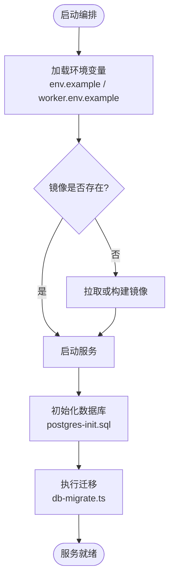
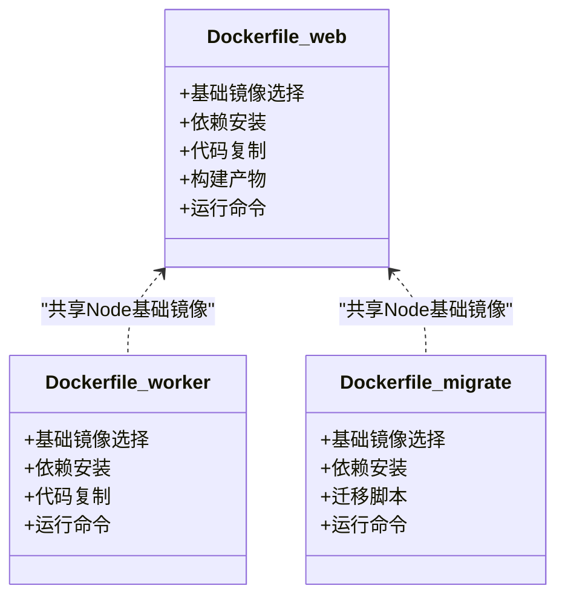
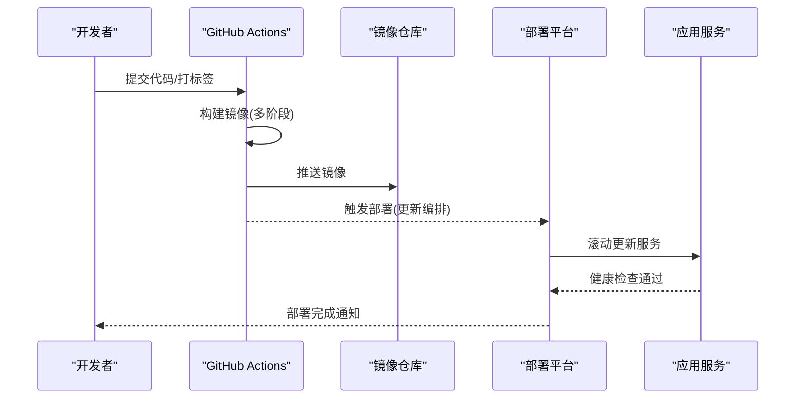
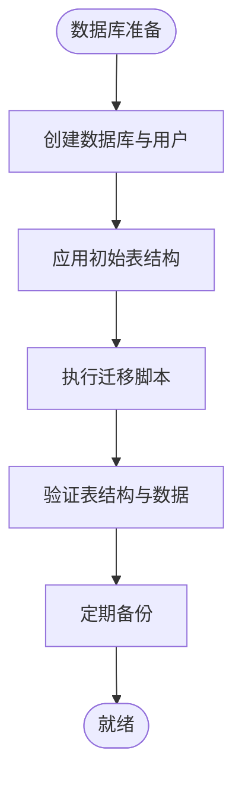
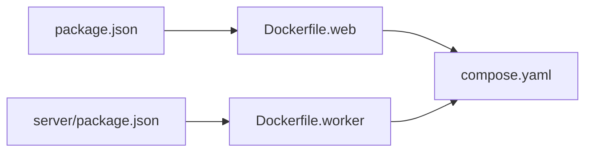

# 部署运维

<cite>
**本文引用的文件**   
- [deploy/compose.yaml](file://deploy/compose.yaml)
- [deploy/README.md](file://deploy/README.md)
- [deploy/env.example](file://deploy/env.example)
- [deploy/worker.env.example](file://deploy/worker.env.example)
- [.github/workflows/main-images.yml](file://.github/workflows/main-images.yml)
- [Dockerfile.web](file://Dockerfile.web)
- [Dockerfile.worker](file://Dockerfile.worker)
- [Dockerfile.migrate](file://Dockerfile.migrate)
- [docker-compose.dev.yml](file://docker-compose.dev.yml)
- [config/tts.env.example](file://config/tts.env.example)
- [scripts/setup/db-migrate.ts](file://scripts/setup/db-migrate.ts)
- [scripts/setup/postgres-init.sql](file://scripts/setup/postgres-init.sql)
- [scripts/migration/sqlite-backup.ts](file://scripts/migration/sqlite-backup.ts)
- [server/package.json](file://server/package.json)
- [package.json](file://package.json)
</cite>

## 目录
1. [简介](#简介)
2. [项目结构](#项目结构)
3. [核心组件](#核心组件)
4. [架构总览](#架构总览)
5. [详细组件分析](#详细组件分析)
6. [依赖分析](#依赖分析)
7. [性能考虑](#性能考虑)
8. [故障排查指南](#故障排查指南)
9. [结论](#结论)
10. [附录](#附录)

## 简介
本文件面向 PurpleInk 的运维与平台工程团队，提供端到端的部署与运维文档。内容涵盖容器化镜像构建、编排配置、CI/CD 流水线设计、自动化部署流程、版本发布策略、生产环境配置、监控告警与日志收集、性能调优与扩容策略、故障排查、备份恢复与灾难恢复、安全加固与合规检查等。读者可据此在本地开发、测试与生产环境中稳定地部署和运行 PurpleInk。

## 项目结构
PurpleInk 采用多容器架构：Web 服务（Next.js）、Worker 任务执行器、数据库（PostgreSQL）以及迁移工具。关键部署相关文件如下：
- 编排与示例配置：deploy/compose.yaml、deploy/env.example、deploy/worker.env.example、docker-compose.dev.yml
- CI/CD 流水线：.github/workflows/main-images.yml
- 镜像定义：Dockerfile.web、Dockerfile.worker、Dockerfile.migrate
- 脚本与初始化：scripts/setup/db-migrate.ts、scripts/setup/postgres-init.sql、scripts/migration/sqlite-backup.ts
- 运行时配置示例：config/tts.env.example
- 包管理与依赖：package.json、server/package.json

图表来源
- [deploy/compose.yaml](file://deploy/compose.yaml)
- [docker-compose.dev.yml](file://docker-compose.dev.yml)
- [.github/workflows/main-images.yml](file://.github/workflows/main-images.yml)
- [Dockerfile.web](file://Dockerfile.web)
- [Dockerfile.worker](file://Dockerfile.worker)
- [Dockerfile.migrate](file://Dockerfile.migrate)
- [scripts/setup/postgres-init.sql](file://scripts/setup/postgres-init.sql)
- [scripts/setup/db-migrate.ts](file://scripts/setup/db-migrate.ts)
- [scripts/migration/sqlite-backup.ts](file://scripts/migration/sqlite-backup.ts)

章节来源
- [deploy/compose.yaml](file://deploy/compose.yaml)
- [docker-compose.dev.yml](file://docker-compose.dev.yml)
- [.github/workflows/main-images.yml](file://.github/workflows/main-images.yml)
- [Dockerfile.web](file://Dockerfile.web)
- [Dockerfile.worker](file://Dockerfile.worker)
- [Dockerfile.migrate](file://Dockerfile.migrate)
- [scripts/setup/postgres-init.sql](file://scripts/setup/postgres-init.sql)
- [scripts/setup/db-migrate.ts](file://scripts/setup/db-migrate.ts)
- [scripts/migration/sqlite-backup.ts](file://scripts/migration/sqlite-backup.ts)

## 核心组件
- Web 服务（Next.js）：对外暴露 HTTP API 与前端页面，负责渲染、路由与业务接口。
- Worker 服务：异步任务执行器，处理队列中的渲染、导出、TTS 等耗时任务。
- 数据库（PostgreSQL）：持久化存储项目、作业、产物与配置信息。
- 迁移工具：用于数据库结构变更与数据迁移。
- TTS 配置：语音合成相关的环境变量与凭据管理。

章节来源
- [server/package.json](file://server/package.json)
- [package.json](file://package.json)
- [config/tts.env.example](file://config/tts.env.example)

## 架构总览
PurpleInk 的生产架构由以下组件构成：
- 入口层：反向代理或负载均衡（如 Nginx/Traefik），将请求分发到 Web 服务。
- 应用层：Web 服务与 Worker 服务水平扩展，共享数据库与对象存储（可选）。
- 数据层：PostgreSQL 主从或托管数据库，配合备份与快照。
- 基础设施：容器编排（Compose/Kubernetes）、镜像仓库、CI/CD 流水线。

[此图为概念性架构图，不直接映射具体源码文件]

## 详细组件分析

### 容器编排与运行环境
- Compose 编排：通过 deploy/compose.yaml 定义 Web、Worker、数据库等服务的启动参数、网络、卷挂载与环境变量注入。
- 开发编排：docker-compose.dev.yml 提供开发环境的快速启动与热重载能力。
- 环境变量：deploy/env.example 与 deploy/worker.env.example 提供生产与 Worker 所需的关键配置项模板；config/tts.env.example 提供 TTS 凭据示例。

图表来源
- [deploy/compose.yaml](file://deploy/compose.yaml)
- [deploy/env.example](file://deploy/env.example)
- [deploy/worker.env.example](file://deploy/worker.env.example)
- [docker-compose.dev.yml](file://docker-compose.dev.yml)
- [scripts/setup/postgres-init.sql](file://scripts/setup/postgres-init.sql)
- [scripts/setup/db-migrate.ts](file://scripts/setup/db-migrate.ts)

章节来源
- [deploy/compose.yaml](file://deploy/compose.yaml)
- [deploy/env.example](file://deploy/env.example)
- [deploy/worker.env.example](file://deploy/worker.env.example)
- [docker-compose.dev.yml](file://docker-compose.dev.yml)
- [scripts/setup/postgres-init.sql](file://scripts/setup/postgres-init.sql)
- [scripts/setup/db-migrate.ts](file://scripts/setup/db-migrate.ts)

### 镜像构建与分层优化
- Web 镜像（Dockerfile.web）：基于 Node 基础镜像，安装依赖并构建 Next.js 应用，最终生成最小化运行镜像。
- Worker 镜像（Dockerfile.worker）：包含任务执行器所需的运行时与依赖，支持并发与资源限制。
- 迁移镜像（Dockerfile.migrate）：仅包含数据库迁移工具与驱动，用于独立执行迁移任务。

图表来源
- [Dockerfile.web](file://Dockerfile.web)
- [Dockerfile.worker](file://Dockerfile.worker)
- [Dockerfile.migrate](file://Dockerfile.migrate)

章节来源
- [Dockerfile.web](file://Dockerfile.web)
- [Dockerfile.worker](file://Dockerfile.worker)
- [Dockerfile.migrate](file://Dockerfile.migrate)

### CI/CD 流水线与自动化部署
- 流水线触发：.github/workflows/main-images.yml 定义镜像构建与推送流程，支持分支与标签触发。
- 构建阶段：并行构建 Web、Worker、Migrate 镜像，进行单元测试与静态检查。
- 推送阶段：将镜像推送到镜像仓库，并更新编排配置以引用新镜像。
- 部署阶段：通过编排工具（Compose/Kubernetes）滚动更新服务，确保零停机部署。

图表来源
- [.github/workflows/main-images.yml](file://.github/workflows/main-images.yml)

章节来源
- [.github/workflows/main-images.yml](file://.github/workflows/main-images.yml)

### 数据库初始化与迁移
- 初始化脚本：scripts/setup/postgres-init.sql 创建数据库、用户与初始表结构。
- 迁移脚本：scripts/setup/db-migrate.ts 执行 Drizzle ORM 迁移，确保数据结构与应用一致。
- 备份脚本：scripts/migration/sqlite-backup.ts 提供 SQLite 备份能力（适用于开发或过渡场景）。

图表来源
- [scripts/setup/postgres-init.sql](file://scripts/setup/postgres-init.sql)
- [scripts/setup/db-migrate.ts](file://scripts/setup/db-migrate.ts)
- [scripts/migration/sqlite-backup.ts](file://scripts/migration/sqlite-backup.ts)

章节来源
- [scripts/setup/postgres-init.sql](file://scripts/setup/postgres-init.sql)
- [scripts/setup/db-migrate.ts](file://scripts/setup/db-migrate.ts)
- [scripts/migration/sqlite-backup.ts](file://scripts/migration/sqlite-backup.ts)

### 环境变量与配置管理
- 通用配置：deploy/env.example 提供 Web 服务所需的环境变量模板，包括数据库连接、外部服务凭据等。
- Worker 配置：deploy/worker.env.example 提供 Worker 专用配置，如队列后端、并发度、超时设置。
- TTS 配置：config/tts.env.example 提供语音合成服务凭据与模型选择。

章节来源
- [deploy/env.example](file://deploy/env.example)
- [deploy/worker.env.example](file://deploy/worker.env.example)
- [config/tts.env.example](file://config/tts.env.example)

## 依赖分析
- 应用依赖：package.json 与 server/package.json 定义了前端与后端的依赖关系，确保构建一致性。
- 容器依赖：Dockerfile.* 指定基础镜像与系统依赖，保证运行环境隔离。
- 编排依赖：compose.yaml 定义服务间依赖关系与启动顺序。

图表来源
- [package.json](file://package.json)
- [server/package.json](file://server/package.json)
- [Dockerfile.web](file://Dockerfile.web)
- [Dockerfile.worker](file://Dockerfile.worker)
- [deploy/compose.yaml](file://deploy/compose.yaml)

章节来源
- [package.json](file://package.json)
- [server/package.json](file://server/package.json)
- [deploy/compose.yaml](file://deploy/compose.yaml)

## 性能考虑
- 镜像优化：使用多阶段构建减少镜像体积，缓存依赖层加速构建。
- 资源限制：为 Web 与 Worker 设置 CPU 与内存限制，避免资源争用。
- 并发控制：调整 Worker 并发度与队列大小，匹配硬件与负载。
- 缓存策略：启用 Next.js 增量静态再生成与 API 缓存，减少数据库压力。
- 数据库优化：合理索引、连接池与查询优化，避免慢查询。

[本节为通用指导，不直接分析具体文件]

## 故障排查指南
- 服务启动失败：检查环境变量与依赖是否完整，查看容器日志定位错误。
- 数据库连接问题：验证数据库地址、端口、用户名与密码，确认防火墙规则。
- 迁移失败：检查迁移脚本与数据库状态，回滚或修复数据。
- 任务执行异常：查看 Worker 日志与队列状态，重试或重新调度任务。
- 性能瓶颈：监控 CPU、内存、I/O 与网络，识别热点与优化点。

章节来源
- [deploy/compose.yaml](file://deploy/compose.yaml)
- [scripts/setup/db-migrate.ts](file://scripts/setup/db-migrate.ts)

## 结论
PurpleInk 的部署运维体系以容器化为核心，结合 CI/CD 流水线与编排工具，实现了自动化构建、测试与部署。通过合理的资源配置、监控告警与备份恢复策略，确保了系统的稳定性与可扩展性。建议在生产环境中持续优化性能与安全，遵循最佳实践进行运维操作。

[本节为总结性内容，不直接分析具体文件]

## 附录
- 快速启动：参考 deploy/README.md 进行本地或生产环境部署。
- 配置参考：根据 env.example 与 worker.env.example 填写必要的环境变量。
- 监控与日志：集成 Prometheus、Grafana、ELK 等工具进行监控与日志收集。
- 安全加固：定期扫描镜像漏洞，启用 TLS 加密与访问控制。

章节来源
- [deploy/README.md](file://deploy/README.md)
- [deploy/env.example](file://deploy/env.example)
- [deploy/worker.env.example](file://deploy/worker.env.example)