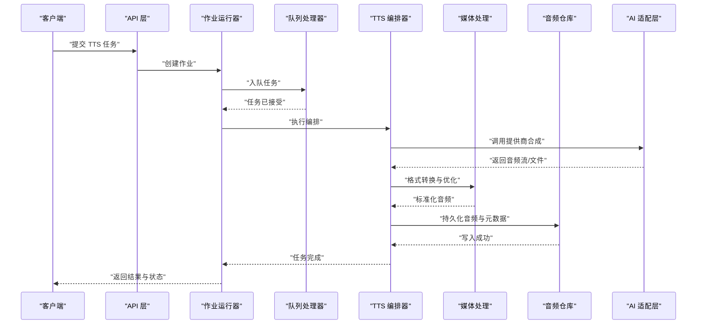
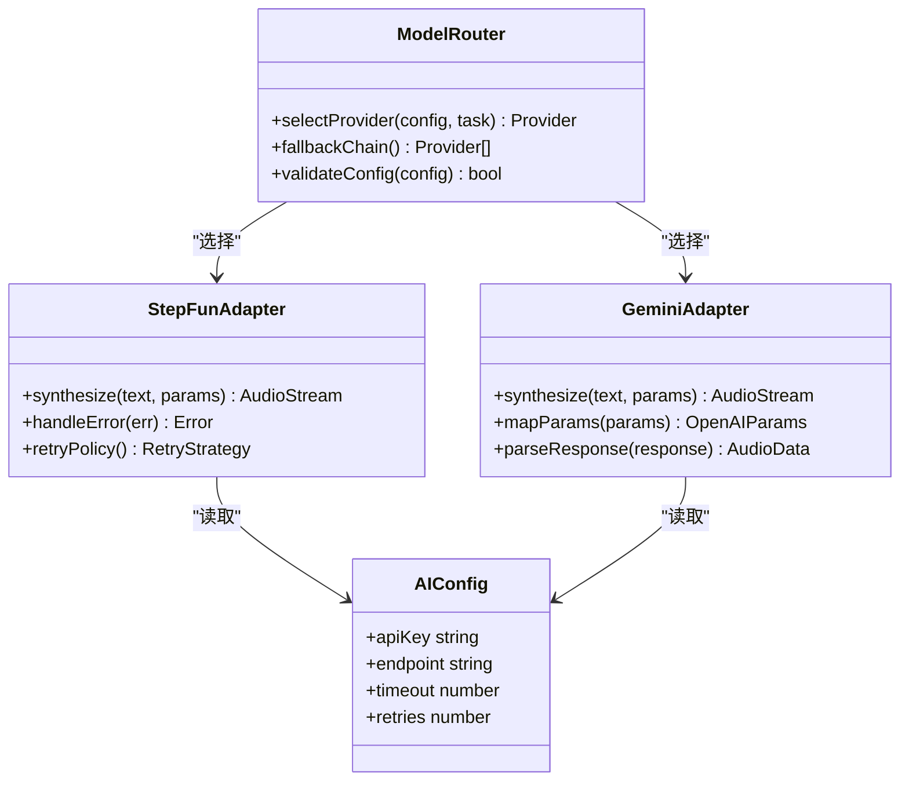
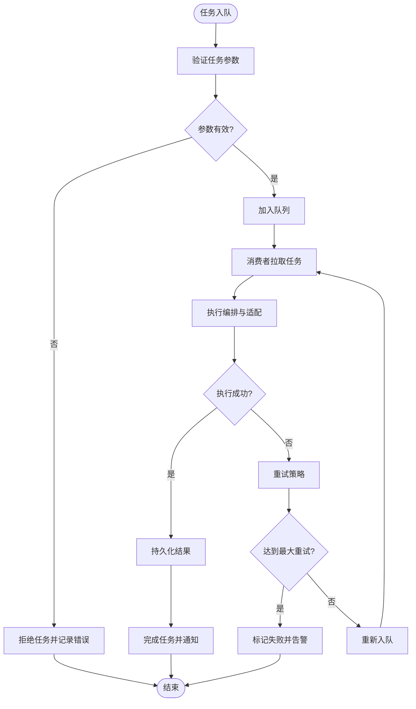
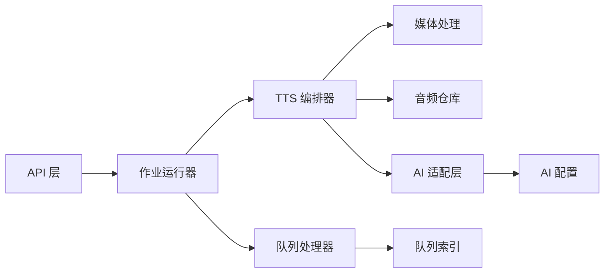

# TTS 语音合成集成

<cite>
**本文引用的文件**   
- [tts.env.example](file://config/tts.env.example)
- [compose.yaml](file://deploy/compose.yaml)
- [env.example](file://deploy/env.example)
- [worker.env.example](file://deploy/worker.env.example)
- [credentials.md](file://docs/configuration/credentials.md)
- [tts.md](file://docs/configuration/tts.md)
- [routing.md](file://docs/conventions/routing.md)
- [ISSUE-013-settings-placeholders.md](file://docs/designs/issues/issue-013/settings-placeholders.md)
- [ISSUE-004-queue-concurrency-lanes.md](file://docs/designs/issues/ISSUE-004-queue-concurrency-lanes.md)
- [ISSUE-005-audio-timing-truth.md](file://docs/designs/issues/ISSUE-005-audio-timing-truth.md)
- [ISSUE-010-oversized-files.md](file://docs/designs/issues/ISSUE-010-oversized-files.md)
- [ISSUE-014-e2e-verification.md](file://docs/designs/issues/ISSUE-014-e2e-verification.md)
- [index.ts](file://server/src/index.ts)
- [job-runner.ts](file://server/src/server/job-runner.ts)
- [job-store.ts](file://server/src/server/job-store.ts)
- [api.ts](file://server/src/server/api.ts)
- [listenhub.ts](file://server/src/tts/listenhub.ts)
- [media.ts](file://server/src/tts/media.ts)
- [narration.ts](file://server/src/tts/narration.ts)
- [orchestrate.ts](file://server/src/tts/orchestrate.ts)
- [stepfun-audio-client.ts](file://src/features/audio/stepfun-audio-client.ts)
- [narration-repository.ts](file://src/features/audio/narration-repository.ts)
- [repository.ts](file://src/features/audio/repository.ts)
- [runtime-repository.ts](file://src/features/audio/runtime-repository.ts)
- [subtitle.ts](file://src/features/audio/subtitle.ts)
- [measure.ts](file://src/features/audio/measure.ts)
- [score.ts](file://src/features/audio/score.ts)
- [sfx.ts](file://src/features/audio/sfx.ts)
- [types.ts](file://src/features/audio/types.ts)
- [index.ts](file://src/lib/queue/index.ts)
- [export-queue-handler.ts](file://src/features/render/export-queue-handler.ts)
- [queue-handler.ts](file://src/features/render/queue-handler.ts)
- [model-routing.ts](file://src/features/ai/model-routing.ts)
- [stepfun-adapter.ts](file://src/features/ai/stepfun-adapter.ts)
- [gemini-adapter.ts](file://src/features/ai/gemini-adapter.ts)
- [config.ts](file://src/features/ai/config.ts)
- [schemas.ts](file://src/features/ai/schemas.ts)
- [route.ts](file://src/app/api/jobs/[id]/route.ts)
- [route.ts](file://src/app/api/director/pipeline/route.ts)
- [route.ts](file://src/app/api/render/route.ts)
- [queue-status-bar.tsx](file://src/components/ui/queue-status-bar.tsx)
- [tts-config.test.ts](file://tests/tts-config.test.ts)
- [tts-narration.test.ts](file://tests/tts-narration.test.ts)
- [tts-orchestration.test.ts](file://tests/tts-orchestration.test.ts)
- [tts-pipeline-integration.test.ts](file://tests/tts-pipeline-integration.test.ts)
- [tts-runtime.test.ts](file://tests/tts-runtime.test.ts)
</cite>

## 目录
1. [简介](#简介)
2. [项目结构](#项目结构)
3. [核心组件](#核心组件)
4. [架构总览](#架构总览)
5. [详细组件分析](#详细组件分析)
6. [依赖关系分析](#依赖关系分析)
7. [性能考量](#性能考量)
8. [故障排查指南](#故障排查指南)
9. [结论](#结论)
10. [附录](#附录)

## 简介
本技术文档面向 PurpleInk TTS 语音合成系统，聚焦多提供商集成架构（Mimo、OpenAI Compatible、StepFun 等适配层）、队列与异步任务调度、错误重试策略、语音参数配置（语速、音调、情感化语音）、音频文件管理与格式转换、质量优化、服务监控与指标采集、以及多语言与方言支持。文档以代码级分析与架构图示为主，辅以可操作的排障建议与最佳实践，帮助开发者快速理解并扩展系统能力。

## 项目结构
TTS 相关能力分布在服务端与前端两个层面：
- 服务端（server/src）：提供 TTS 编排、媒体处理、任务执行与存储接口，以及与外部 TTS 服务的交互。
- 功能模块（src/features）：包含音频仓库、字幕生成、时长测量、评分、音效、运行时持久化等。
- AI 适配层（src/features/ai）：模型路由与第三方适配器（如 StepFun、Gemini），为 TTS 提供统一调用契约。
- 队列与渲染（src/features/render）：通用队列处理器与导出流水线，TTS 任务通过统一队列接入。
- 应用 API（src/app/api）：暴露作业查询、导演管线、渲染入口等 HTTP 接口。
- 部署与配置（deploy、config、docs）：环境变量、Compose 编排、配置说明与问题设计文档。

```mermaid
graph TB
subgraph "服务端"
A["API 层<br/>server/src/server/api.ts"]
B["作业运行器<br/>server/src/server/job-runner.ts"]
C["作业存储<br/>server/src/server/job-store.ts"]
D["TTS 编排<br/>server/src/tts/orchestrate.ts"]
E["媒体处理<br/>server/src/tts/media.ts"]
F["听播中心<br/>server/src/tts/listenhub.ts"]
G["旁白管理<br/>server/src/tts/narration.ts"]
end
subgraph "功能模块"
H["音频仓库<br/>src/features/audio/repository.ts"]
I["运行时仓库<br/>src/features/audio/runtime-repository.ts"]
J["旁白仓库<br/>src/features/audio/narration-repository.ts"]
K["字幕<br/>src/features/audio/subtitle.ts"]
L["时长测量<br/>src/features/audio/measure.ts"]
M["评分<br/>src/features/audio/score.ts"]
N["音效<br/>src/features/audio/sfx.ts"]
O["类型定义<br/>src/features/audio/types.ts"]
end
subgraph "AI 适配层"
P["模型路由<br/>src/features/ai/model-routing.ts"]
Q["StepFun 适配器<br/>src/features/ai/stepfun-adapter.ts"]
R["Gemini 适配器<br/>src/features/ai/gemini-adapter.ts"]
S["AI 配置<br/>src/features/ai/config.ts"]
T["AI 模式<br/>src/features/ai/schemas.ts"]
end
subgraph "队列与渲染"
U["导出队列处理器<br/>src/features/render/export-queue-handler.ts"]
V["通用队列处理器<br/>src/features/render/queue-handler.ts"]
W["队列索引<br/>src/lib/queue/index.ts"]
end
subgraph "应用 API"
X["作业查询<br/>src/app/api/jobs/[id]/route.ts"]
Y["导演管线<br/>src/app/api/director/pipeline/route.ts"]
Z["渲染入口<br/>src/app/api/render/route.ts"]
end
A --> B
B --> C
B --> D
D --> E
D --> F
D --> G
D --> H
D --> I
D --> J
D --> K
D --> L
D --> M
D --> N
D --> O
D --> P
P --> Q
P --> R
P --> S
P --> T
B --> U
B --> V
W --> U
W --> V
X --> B
Y --> B
Z --> B
```

图表来源
- [api.ts](file://server/src/server/api.ts)
- [job-runner.ts](file://server/src/server/job-runner.ts)
- [job-store.ts](file://server/src/server/job-store.ts)
- [orchestrate.ts](file://server/src/tts/orchestrate.ts)
- [media.ts](file://server/src/tts/media.ts)
- [listenhub.ts](file://server/src/tts/listenhub.ts)
- [narration.ts](file://server/src/tts/narration.ts)
- [repository.ts](file://src/features/audio/repository.ts)
- [runtime-repository.ts](file://src/features/audio/runtime-repository.ts)
- [narration-repository.ts](file://src/features/audio/narration-repository.ts)
- [subtitle.ts](file://src/features/audio/subtitle.ts)
- [measure.ts](file://src/features/audio/measure.ts)
- [score.ts](file://src/features/audio/score.ts)
- [sfx.ts](file://src/features/audio/sfx.ts)
- [types.ts](file://src/features/audio/types.ts)
- [model-routing.ts](file://src/features/ai/model-routing.ts)
- [stepfun-adapter.ts](file://src/features/ai/stepfun-adapter.ts)
- [gemini-adapter.ts](file://src/features/ai/gemini-adapter.ts)
- [config.ts](file://src/features/ai/config.ts)
- [schemas.ts](file://src/features/ai/schemas.ts)
- [export-queue-handler.ts](file://src/features/render/export-queue-handler.ts)
- [queue-handler.ts](file://src/features/render/queue-handler.ts)
- [index.ts](file://src/lib/queue/index.ts)
- [route.ts](file://src/app/api/jobs/[id]/route.ts)
- [route.ts](file://src/app/api/director/pipeline/route.ts)
- [route.ts](file://src/app/api/render/route.ts)

章节来源
- [compose.yaml](file://deploy/compose.yaml)
- [env.example](file://deploy/env.example)
- [worker.env.example](file://deploy/worker.env.example)
- [tts.env.example](file://config/tts.env.example)
- [credentials.md](file://docs/configuration/credentials.md)
- [tts.md](file://docs/configuration/tts.md)

## 核心组件
- TTS 编排器（orchestrate.ts）：负责将文本输入转换为语音输出，协调媒体处理、字幕生成、时长测量与评分，并驱动队列任务。
- 媒体处理（media.ts）：封装音频格式转换、采样率调整、音量均衡与质量优化。
- 听播中心（listenhub.ts）：提供流式或事件驱动的播放状态监听与回调机制。
- 旁白管理（narration.ts）：管理旁白片段、段落切分、时间轴对齐与多语言切换。
- 音频仓库（repository.ts、runtime-repository.ts、narration-repository.ts）：持久化音频元数据、运行时状态与旁白记录。
- 字幕（subtitle.ts）：生成与校验字幕，确保与语音时长一致。
- 时长测量（measure.ts）：精确测量音频时长，用于对齐与评分。
- 评分（score.ts）：对合成结果进行质量评估（清晰度、连贯性、情感匹配）。
- 音效（sfx.ts）：叠加背景音乐或音效，增强表现力。
- 类型定义（types.ts）：统一定义 TTS 任务、音频对象、配置项等数据结构。

章节来源
- [orchestrate.ts](file://server/src/tts/orchestrate.ts)
- [media.ts](file://server/src/tts/media.ts)
- [listenhub.ts](file://server/src/tts/listenhub.ts)
- [narration.ts](file://server/src/tts/narration.ts)
- [repository.ts](file://src/features/audio/repository.ts)
- [runtime-repository.ts](file://src/features/audio/runtime-repository.ts)
- [narration-repository.ts](file://src/features/audio/narration-repository.ts)
- [subtitle.ts](file://src/features/audio/subtitle.ts)
- [measure.ts](file://src/features/audio/measure.ts)
- [score.ts](file://src/features/audio/score.ts)
- [sfx.ts](file://src/features/audio/sfx.ts)
- [types.ts](file://src/features/audio/types.ts)

## 架构总览
TTS 系统采用“编排 + 适配 + 队列”的分层架构：
- 编排层：orchestrate.ts 作为中枢，接收任务、拆分步骤、协调各子模块。
- 适配层：通过 model-routing.ts 选择具体提供商（Mimo、OpenAI Compatible、StepFun），由 stepfun-adapter.ts、gemini-adapter.ts 等实现统一接口。
- 队列层：通过 export-queue-handler.ts 与 queue-handler.ts 将任务入队、消费、重试与完成通知。
- 存储层：audio 仓库与 runtime 仓库分别持久化音频资产与运行时状态。
- 监控层：listenhub.ts 提供事件流，结合指标收集与日志，支撑可观测性。

图表来源
- [api.ts](file://server/src/server/api.ts)
- [job-runner.ts](file://server/src/server/job-runner.ts)
- [export-queue-handler.ts](file://src/features/render/export-queue-handler.ts)
- [queue-handler.ts](file://src/features/render/queue-handler.ts)
- [orchestrate.ts](file://server/src/tts/orchestrate.ts)
- [media.ts](file://server/src/tts/media.ts)
- [repository.ts](file://src/features/audio/repository.ts)
- [model-routing.ts](file://src/features/ai/model-routing.ts)
- [stepfun-adapter.ts](file://src/features/ai/stepfun-adapter.ts)
- [gemini-adapter.ts](file://src/features/ai/gemini-adapter.ts)

## 详细组件分析

### 多提供商适配层（Mimo、OpenAI Compatible、StepFun）
- 模型路由（model-routing.ts）：根据配置与负载情况选择最优提供商，支持热切换与降级。
- StepFun 适配器（stepfun-adapter.ts）：封装 StepFun TTS 的认证、请求构造、流式响应处理与错误映射。
- Gemini 适配器（gemini-adapter.ts）：兼容 OpenAI 协议的 TTS 接口，统一参数映射与响应解析。
- AI 配置（config.ts）与模式（schemas.ts）：集中管理密钥、端点、超时、重试策略与参数校验。

图表来源
- [model-routing.ts](file://src/features/ai/model-routing.ts)
- [stepfun-adapter.ts](file://src/features/ai/stepfun-adapter.ts)
- [gemini-adapter.ts](file://src/features/ai/gemini-adapter.ts)
- [config.ts](file://src/features/ai/config.ts)
- [schemas.ts](file://src/features/ai/schemas.ts)

章节来源
- [model-routing.ts](file://src/features/ai/model-routing.ts)
- [stepfun-adapter.ts](file://src/features/ai/stepfun-adapter.ts)
- [gemini-adapter.ts](file://src/features/ai/gemini-adapter.ts)
- [config.ts](file://src/features/ai/config.ts)
- [schemas.ts](file://src/features/ai/schemas.ts)

### 队列处理与异步任务调度
- 导出队列处理器（export-queue-handler.ts）：处理 TTS 导出任务，包括优先级、并发控制与失败重试。
- 通用队列处理器（queue-handler.ts）：抽象任务生命周期，支持延迟执行、取消与幂等性。
- 队列索引（index.ts）：提供队列注册、任务分发与状态同步。

图表来源
- [export-queue-handler.ts](file://src/features/render/export-queue-handler.ts)
- [queue-handler.ts](file://src/features/render/queue-handler.ts)
- [index.ts](file://src/lib/queue/index.ts)

章节来源
- [export-queue-handler.ts](file://src/features/render/export-queue-handler.ts)
- [queue-handler.ts](file://src/features/render/queue-handler.ts)
- [index.ts](file://src/lib/queue/index.ts)

### 语音参数配置与情感化语音
- 语速控制：通过配置项调节合成速度，影响语音时长与节奏。
- 音调调节：支持音高偏移与音色选择，适配不同角色与风格。
- 情感化语音：基于情感标签与上下文提示，驱动提供商的情感合成能力。
- 多语言与方言：在 narration.ts 中维护语言包与方言映射，动态切换。

章节来源
- [narration.ts](file://server/src/tts/narration.ts)
- [tts.md](file://docs/configuration/tts.md)
- [credentials.md](file://docs/configuration/credentials.md)

### 音频文件管理与格式转换
- 格式转换：media.ts 统一处理 MP3、WAV、FLAC 等格式的转码与采样率对齐。
- 质量优化：压缩、降噪、响度标准化，确保跨平台兼容性。
- 大文件处理：遵循 ISSUE-010 的设计约束，限制文件大小与分段处理。

章节来源
- [media.ts](file://server/src/tts/media.ts)
- [ISSUE-010-oversized-files.md](file://docs/designs/issues/ISSUE-010-oversized-files.md)

### 监控、指标与故障诊断
- 听播中心（listenhub.ts）：提供播放状态事件流，便于前端展示与后端审计。
- 指标采集：结合 measure.ts 与 score.ts，统计时长、清晰度、情感匹配度等关键指标。
- 故障诊断：通过 job-store.ts 与 job-runner.ts 的作业状态追踪，定位失败原因。

章节来源
- [listenhub.ts](file://server/src/tts/listenhub.ts)
- [measure.ts](file://src/features/audio/measure.ts)
- [score.ts](file://src/features/audio/score.ts)
- [job-store.ts](file://server/src/server/job-store.ts)
- [job-runner.ts](file://server/src/server/job-runner.ts)

## 依赖关系分析
TTS 系统的依赖关系清晰分层：
- API 层依赖作业运行器与队列处理器。
- 编排器依赖媒体处理、音频仓库与 AI 适配层。
- 适配层依赖配置与模式校验。
- 队列处理器依赖通用队列索引与任务存储。

图表来源
- [api.ts](file://server/src/server/api.ts)
- [job-runner.ts](file://server/src/server/job-runner.ts)
- [export-queue-handler.ts](file://src/features/render/export-queue-handler.ts)
- [orchestrate.ts](file://server/src/tts/orchestrate.ts)
- [media.ts](file://server/src/tts/media.ts)
- [repository.ts](file://src/features/audio/repository.ts)
- [model-routing.ts](file://src/features/ai/model-routing.ts)
- [config.ts](file://src/features/ai/config.ts)
- [index.ts](file://src/lib/queue/index.ts)

章节来源
- [api.ts](file://server/src/server/api.ts)
- [job-runner.ts](file://server/src/server/job-runner.ts)
- [export-queue-handler.ts](file://src/features/render/export-queue-handler.ts)
- [orchestrate.ts](file://server/src/tts/orcheststrate.ts)
- [media.ts](file://server/src/tts/media.ts)
- [repository.ts](file://src/features/audio/repository.ts)
- [model-routing.ts](file://src/features/ai/model-routing.ts)
- [config.ts](file://src/features/ai/config.ts)
- [index.ts](file://src/lib/queue/index.ts)

## 性能考量
- 并发控制：依据 ISSUE-004 的队列并发通道设计，合理设置并行度以避免资源争用。
- 时长对齐：遵循 ISSUE-005 的音频时序真相，确保字幕与语音严格同步。
- 大文件优化：按 ISSUE-010 的分段与限流策略，避免内存溢出与超时。
- 指标监控：通过 measure.ts 与 score.ts 持续采集性能指标，指导调优。

章节来源
- [ISSUE-004-queue-concurrency-lanes.md](file://docs/designs/issues/ISSUE-004-queue-concurrency-lanes.md)
- [ISSUE-005-audio-timing-truth.md](file://docs/designs/issues/ISSUE-005-audio-timing-truth.md)
- [ISSUE-010-oversized-files.md](file://docs/designs/issues/ISSUE-010-oversized-files.md)
- [measure.ts](file://src/features/audio/measure.ts)
- [score.ts](file://src/features/audio/score.ts)

## 故障排查指南
- 配置问题：检查 credentials.md 与 tts.md 中的密钥、端点与超时设置。
- 队列阻塞：查看 queue-handler.ts 与 export-queue-handler.ts 的任务状态与重试计数。
- 提供商错误：通过 stepfun-adapter.ts 与 gemini-adapter.ts 的错误映射定位上游异常。
- 音频质量问题：使用 measure.ts 与 score.ts 分析时长与评分，结合 media.ts 的转换参数。
- 端到端验证：参考 ISSUE-014 的验证脚本与基线数据，复现与对比问题。

章节来源
- [credentials.md](file://docs/configuration/credentials.md)
- [tts.md](file://docs/configuration/tts.md)
- [queue-handler.ts](file://src/features/render/queue-handler.ts)
- [export-queue-handler.ts](file://src/features/render/export-queue-handler.ts)
- [stepfun-adapter.ts](file://src/features/ai/stepfun-adapter.ts)
- [gemini-adapter.ts](file://src/features/ai/gemini-adapter.ts)
- [measure.ts](file://src/features/audio/measure.ts)
- [score.ts](file://src/features/audio/score.ts)
- [media.ts](file://server/src/tts/media.ts)
- [ISSUE-014-e2e-verification.md](file://docs/designs/issues/ISSUE-014-e2e-verification.md)

## 结论
PurpleInk TTS 系统通过清晰的编排与适配层设计，实现了多提供商的统一接入与灵活切换；借助队列与重试机制保障高可用与可扩展性；结合音频处理与质量评估提升用户体验。未来可进一步扩展更多提供商适配、增强情感化语音能力，并完善监控与自动化测试体系。

## 附录
- 环境变量示例：[tts.env.example](file://config/tts.env.example)、[env.example](file://deploy/env.example)、[worker.env.example](file://deploy/worker.env.example)
- 部署编排：[compose.yaml](file://deploy/compose.yaml)
- 路由约定：[routing.md](file://docs/conventions/routing.md)
- 设置占位符设计：[ISSUE-013-settings-placeholders.md](file://docs/designs/issues/issue-013/settings-placeholders.md)
- 前端队列状态组件：[queue-status-bar.tsx](file://src/components/ui/queue-status-bar.tsx)
- 测试用例：[tts-config.test.ts](file://tests/tts-config.test.ts)、[tts-narration.test.ts](file://tests/tts-narration.test.ts)、[tts-orchestration.test.ts](file://tests/tts-orchestration.test.ts)、[tts-pipeline-integration.test.ts](file://tests/tts-pipeline-integration.test.ts)、[tts-runtime.test.ts](file://tests/tts-runtime.test.ts)