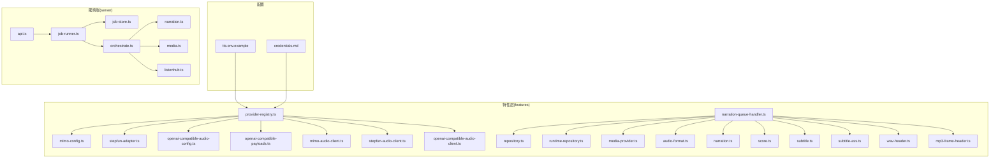
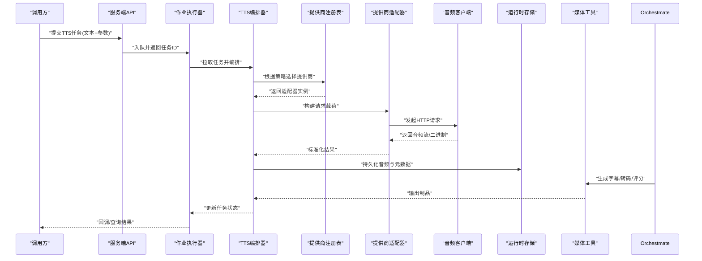
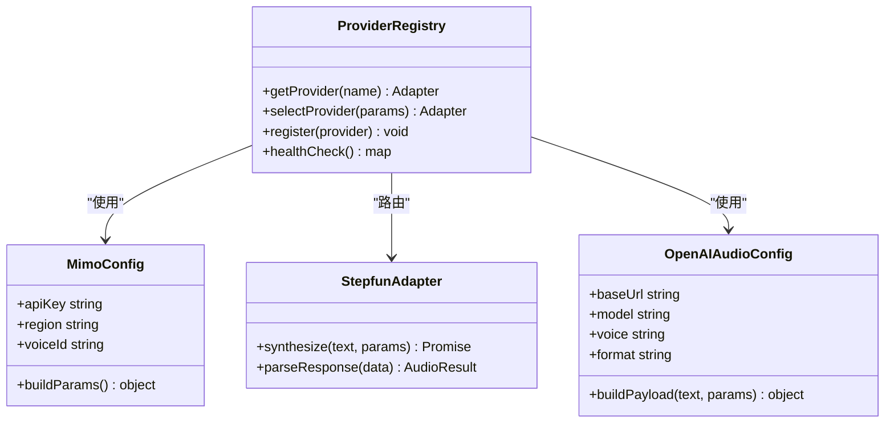
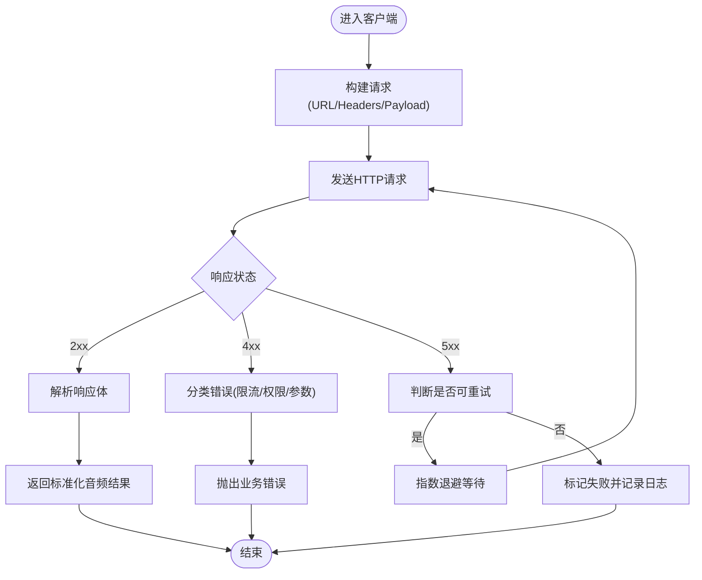
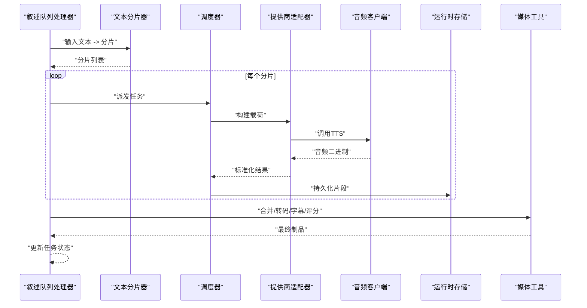
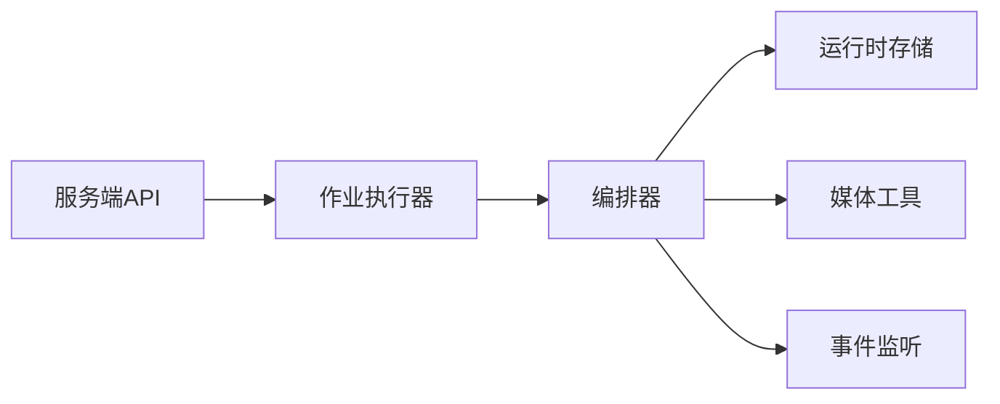
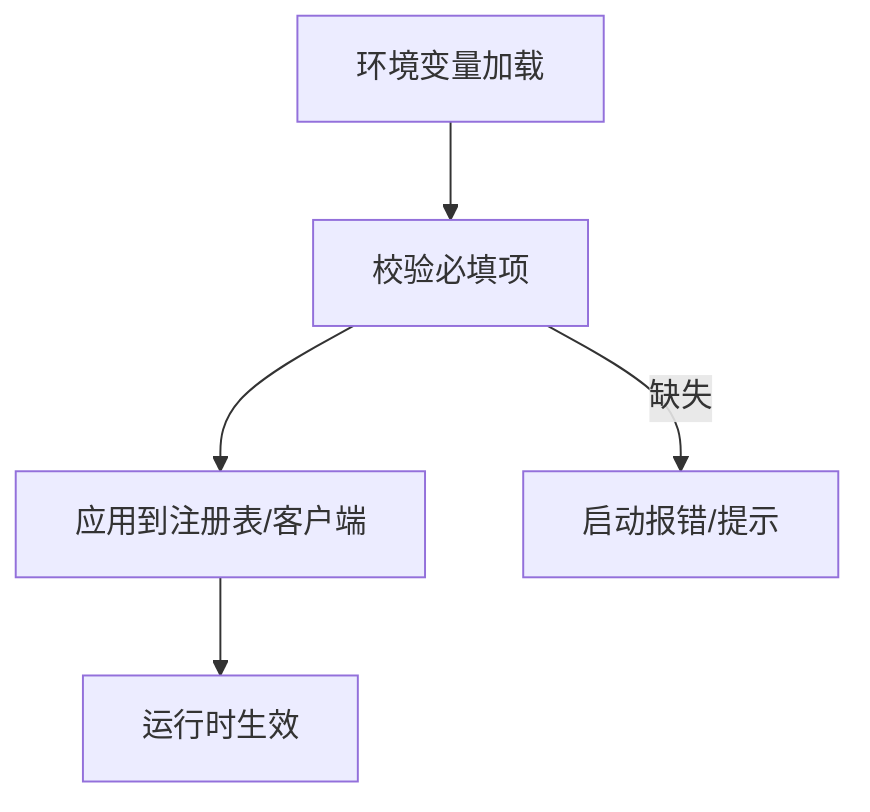
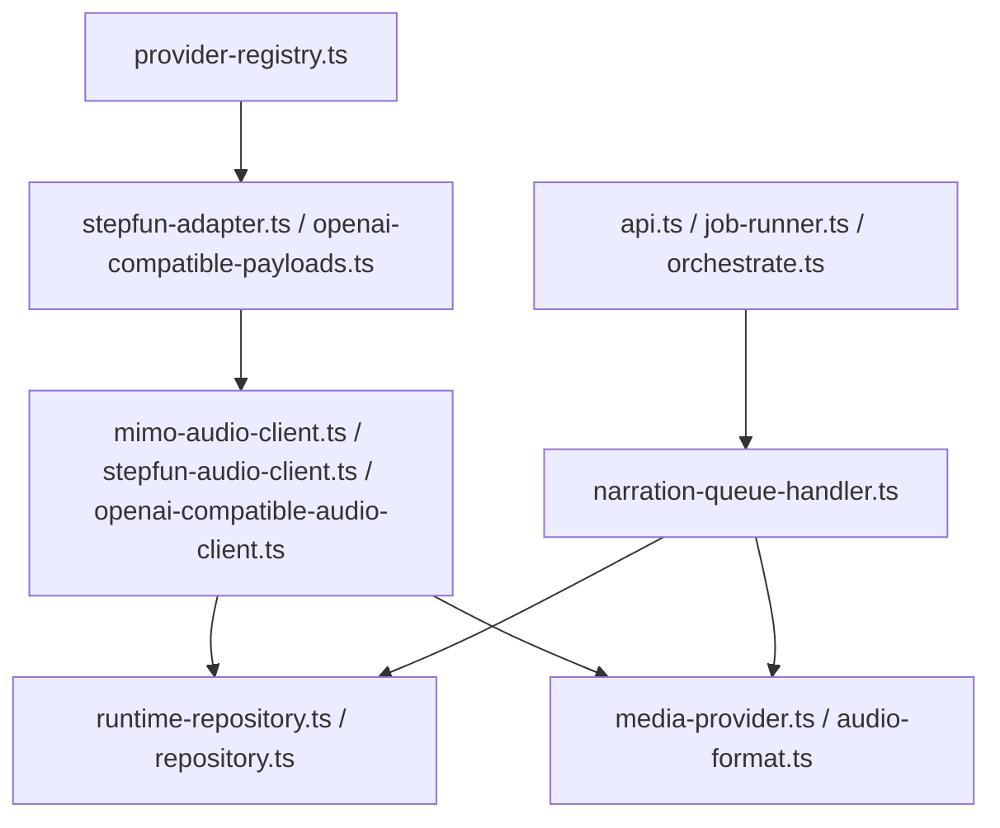

# TTS集成

<cite>
**本文档引用的文件**   
- [tts.env.example](file://config/tts.env.example)
- [credentials.md](file://docs/configuration/credentials.md)
- [runbook.md](file://docs/deployment/runbook.md)
- [2026-07-26-custom-openai-provider-and-tts-recovery.md](file://docs/superpowers/plans/2026-07-26-custom-openai-provider-and-tts-recovery.md)
- [2026-07-26-mimo-provider-media-resilience.md](file://docs/superpowers/plans/2026-07-26-mimo-provider-media-resilience.md)
- [index.ts](file://src/lib/tts/index.ts)
- [provider-registry.ts](file://src/features/ai/provider-registry.ts)
- [mimo-config.ts](file://src/features/ai/mimo-config.ts)
- [stepfun-adapter.ts](file://src/features/ai/stepfun-adapter.ts)
- [openai-compatible-audio-config.ts](file://src/features/ai/openai-compatible-audio-config.ts)
- [openai-compatible-payloads.ts](file://src/features/ai/openai-compatible-payloads.ts)
- [mimo-audio-client.ts](file://src/features/audio/mimo-audio-client.ts)
- [stepfun-audio-client.ts](file://src/features/audio/stepfun-audio-client.ts)
- [openai-compatible-audio-client.ts](file://src/features/audio/openai-compatible-audio-client.ts)
- [narration-queue-handler.ts](file://src/features/audio/narration-queue-handler.ts)
- [repository.ts](file://src/features/audio/repository.ts)
- [runtime-repository.ts](file://src/features/audio/runtime-repository.ts)
- [media-provider.ts](file://src/features/audio/media-provider.ts)
- [audio-format.ts](file://src/features/audio/audio-format.ts)
- [narration.ts](file://src/features/audio/narration.ts)
- [score.ts](file://src/features/audio/score.ts)
- [subtitle.ts](file://src/features/audio/subtitle.ts)
- [subtitle-ass.ts](file://src/features/audio/subtitle-ass.ts)
- [wav-header.ts](file://src/features/audio/wav-header.ts)
- [mp3-frame-header.ts](file://src/features/audio/mp3-frame-header.ts)
- [load-env.ts](file://server/src/lib/load-env.ts)
- [api.ts](file://server/src/server/api.ts)
- [job-runner.ts](file://server/src/server/job-runner.ts)
- [job-store.ts](file://server/src/server/job-store.ts)
- [orchestrate.ts](file://server/src/tts/orchestrate.ts)
- [narration.ts](file://server/src/tts/narration.ts)
- [media.ts](file://server/src/tts/media.ts)
- [listenhub.ts](file://server/src/tts/listenhub.ts)
</cite>

## 目录
1. [简介](#简介)
2. [项目结构](#项目结构)
3. [核心组件](#核心组件)
4. [架构总览](#架构总览)
5. [详细组件分析](#详细组件分析)
6. [依赖关系分析](#依赖关系分析)
7. [性能考量](#性能考量)
8. [故障排除指南](#故障排除指南)
9. [结论](#结论)
10. [附录](#附录)

## 简介
本文件为 PurpleInk TTS（文本转语音）集成的权威技术文档，覆盖多提供商TTS服务（Mimo、Stepfun、OpenAI兼容API等）的统一接入与编排。文档重点阐述：
- 统一接口抽象与客户端设计（错误处理、重试机制、降级策略）
- 从文本输入到音频输出的完整合成链路
- 配置管理（API密钥、参数调优、服务选择策略）
- 各提供商配置示例与最佳实践
- 故障排除与性能优化建议

## 项目结构
TTS相关能力横跨前端特性层、服务端运行期与部署配置：
- 配置与环境变量：提供TTS环境变量模板与凭证说明
- 特性层（features）：实现各TTS提供商的适配器、配置、负载构造与通用音频客户端
- 服务端（server）：TTS编排、队列处理、媒体持久化与运行时存储
- 工具与类型：音频格式、字幕、评分、头信息解析等

**图示来源** 
- [tts.env.example](file://config/tts.env.example)
- [credentials.md](file://docs/configuration/credentials.md)
- [provider-registry.ts](file://src/features/ai/provider-registry.ts)
- [mimo-config.ts](file://src/features/ai/mimo-config.ts)
- [stepfun-adapter.ts](file://src/features/ai/stepfun-adapter.ts)
- [openai-compatible-audio-config.ts](file://src/features/ai/openai-compatible-audio-config.ts)
- [openai-compatible-payloads.ts](file://src/features/ai/openai-compatible-payloads.ts)
- [mimo-audio-client.ts](file://src/features/audio/mimo-audio-client.ts)
- [stepfun-audio-client.ts](file://src/features/audio/stepfun-audio-client.ts)
- [openai-compatible-audio-client.ts](file://src/features/audio/openai-compatible-audio-client.ts)
- [narration-queue-handler.ts](file://src/features/audio/narration-queue-handler.ts)
- [repository.ts](file://src/features/audio/repository.ts)
- [runtime-repository.ts](file://src/features/audio/runtime-repository.ts)
- [media-provider.ts](file://src/features/audio/media-provider.ts)
- [audio-format.ts](file://src/features/audio/audio-format.ts)
- [narration.ts](file://src/features/audio/narration.ts)
- [score.ts](file://src/features/audio/score.ts)
- [subtitle.ts](file://src/features/audio/subtitle.ts)
- [subtitle-ass.ts](file://src/features/audio/subtitle-ass.ts)
- [wav-header.ts](file://src/features/audio/wav-header.ts)
- [mp3-frame-header.ts](file://src/features/audio/mp3-frame-header.ts)
- [api.ts](file://server/src/server/api.ts)
- [job-runner.ts](file://server/src/server/job-runner.ts)
- [job-store.ts](file://server/src/server/job-store.ts)
- [orchestrate.ts](file://server/src/tts/orchestrate.ts)
- [narration.ts](file://server/src/tts/narration.ts)
- [media.ts](file://server/src/tts/media.ts)
- [listenhub.ts](file://server/src/tts/listenhub.ts)

**章节来源**
- [tts.env.example](file://config/tts.env.example)
- [credentials.md](file://docs/configuration/credentials.md)

## 核心组件
- 提供商注册表：集中管理不同TTS提供商的能力、默认参数与路由策略
- 提供商适配与配置：针对Mimo、Stepfun、OpenAI兼容API的差异化配置与载荷构造
- 音频客户端：统一的HTTP调用封装，包含鉴权、重试、超时、错误分类与降级
- 叙述队列处理器：将文本分片、调度任务、并发控制、结果落库与媒体生成
- 运行时存储与仓库：任务状态、中间产物、最终音频与字幕的持久化
- 媒体提供者与格式工具：音频格式转换、头部解析、字幕生成与质量评分

**章节来源**
- [provider-registry.ts](file://src/features/ai/provider-registry.ts)
- [mimo-config.ts](file://src/features/ai/mimo-config.ts)
- [stepfun-adapter.ts](file://src/features/ai/stepfun-adapter.ts)
- [openai-compatible-audio-config.ts](file://src/features/ai/openai-compatible-audio-config.ts)
- [openai-compatible-payloads.ts](file://src/features/ai/openai-compatible-payloads.ts)
- [mimo-audio-client.ts](file://src/features/audio/mimo-audio-client.ts)
- [stepfun-audio-client.ts](file://src/features/audio/stepfun-audio-client.ts)
- [openai-compatible-audio-client.ts](file://src/features/audio/openai-compatible-audio-client.ts)
- [narration-queue-handler.ts](file://src/features/audio/narration-queue-handler.ts)
- [repository.ts](file://src/features/audio/repository.ts)
- [runtime-repository.ts](file://src/features/audio/runtime-repository.ts)
- [media-provider.ts](file://src/features/audio/media-provider.ts)
- [audio-format.ts](file://src/features/audio/audio-format.ts)
- [narration.ts](file://src/features/audio/narration.ts)
- [score.ts](file://src/features/audio/score.ts)
- [subtitle.ts](file://src/features/audio/subtitle.ts)
- [subtitle-ass.ts](file://src/features/audio/subtitle-ass.ts)
- [wav-header.ts](file://src/features/audio/wav-header.ts)
- [mp3-frame-header.ts](file://src/features/audio/mp3-frame-header.ts)

## 架构总览
TTS系统采用“统一接口 + 多提供商适配 + 队列编排”的分层架构：
- 上层通过统一接口提交文本与参数，由注册表选择具体提供商
- 提供商适配器负责构建请求载荷与响应解析
- 音频客户端封装网络交互，内置重试与错误处理
- 队列处理器负责分片、并发、失败重试与结果聚合
- 运行时存储与媒体工具完成持久化、格式转换与字幕生成

**图示来源** 
- [api.ts](file://server/src/server/api.ts)
- [job-runner.ts](file://server/src/server/job-runner.ts)
- [orchestrate.ts](file://server/src/tts/orchestrate.ts)
- [provider-registry.ts](file://src/features/ai/provider-registry.ts)
- [stepfun-adapter.ts](file://src/features/ai/stepfun-adapter.ts)
- [mimo-audio-client.ts](file://src/features/audio/mimo-audio-client.ts)
- [stepfun-audio-client.ts](file://src/features/audio/stepfun-audio-client.ts)
- [openai-compatible-audio-client.ts](file://src/features/audio/openai-compatible-audio-client.ts)
- [runtime-repository.ts](file://src/features/audio/runtime-repository.ts)
- [media-provider.ts](file://src/features/audio/media-provider.ts)

## 详细组件分析

### 提供商注册表与路由策略
- 职责：维护可用提供商清单、默认参数、健康检查与动态路由
- 关键点：支持按成本、延迟、可用性进行策略选择；可配置回退链

**图示来源** 
- [provider-registry.ts](file://src/features/ai/provider-registry.ts)
- [mimo-config.ts](file://src/features/ai/mimo-config.ts)
- [stepfun-adapter.ts](file://src/features/ai/stepfun-adapter.ts)
- [openai-compatible-audio-config.ts](file://src/features/ai/openai-compatible-audio-config.ts)

**章节来源**
- [provider-registry.ts](file://src/features/ai/provider-registry.ts)
- [mimo-config.ts](file://src/features/ai/mimo-config.ts)
- [stepfun-adapter.ts](file://src/features/ai/stepfun-adapter.ts)
- [openai-compatible-audio-config.ts](file://src/features/ai/openai-compatible-audio-config.ts)

### 音频客户端（Mimo、Stepfun、OpenAI兼容）
- 统一封装：鉴权头、超时、重试、错误分类（网络、业务、限流）
- 重试策略：指数退避、最大重试次数、幂等键
- 错误处理：区分可重试与不可重试错误，触发降级或告警

**图示来源** 
- [mimo-audio-client.ts](file://src/features/audio/mimo-audio-client.ts)
- [stepfun-audio-client.ts](file://src/features/audio/stepfun-audio-client.ts)
- [openai-compatible-audio-client.ts](file://src/features/audio/openai-compatible-audio-client.ts)

**章节来源**
- [mimo-audio-client.ts](file://src/features/audio/mimo-audio-client.ts)
- [stepfun-audio-client.ts](file://src/features/audio/stepfun-audio-client.ts)
- [openai-compatible-audio-client.ts](file://src/features/audio/openai-compatible-audio-client.ts)

### 叙述队列处理器与合成流程
- 文本分片：按长度/标点切分，避免超限与提升并行度
- 并发控制：限制并发数，避免供应商限流
- 失败重试：对单个分片重试，整体失败时回滚或补偿
- 结果聚合：合并音频片段、对齐字幕、生成摘要评分

**图示来源** 
- [narration-queue-handler.ts](file://src/features/audio/narration-queue-handler.ts)
- [repository.ts](file://src/features/audio/repository.ts)
- [runtime-repository.ts](file://src/features/audio/runtime-repository.ts)
- [media-provider.ts](file://src/features/audio/media-provider.ts)
- [audio-format.ts](file://src/features/audio/audio-format.ts)
- [narration.ts](file://src/features/audio/narration.ts)
- [score.ts](file://src/features/audio/score.ts)
- [subtitle.ts](file://src/features/audio/subtitle.ts)
- [subtitle-ass.ts](file://src/features/audio/subtitle-ass.ts)

**章节来源**
- [narration-queue-handler.ts](file://src/features/audio/narration-queue-handler.ts)
- [repository.ts](file://src/features/audio/repository.ts)
- [runtime-repository.ts](file://src/features/audio/runtime-repository.ts)
- [media-provider.ts](file://src/features/audio/media-provider.ts)
- [audio-format.ts](file://src/features/audio/audio-format.ts)
- [narration.ts](file://src/features/audio/narration.ts)
- [score.ts](file://src/features/audio/score.ts)
- [subtitle.ts](file://src/features/audio/subtitle.ts)
- [subtitle-ass.ts](file://src/features/audio/subtitle-ass.ts)

### 服务端编排与持久化
- 编排器：协调任务生命周期、状态机、事件广播
- 存储：任务、片段、成品、字幕、评分的持久化
- 监听：实时事件推送与进度反馈

**图示来源** 
- [api.ts](file://server/src/server/api.ts)
- [job-runner.ts](file://server/src/server/job-runner.ts)
- [job-store.ts](file://server/src/server/job-store.ts)
- [orchestrate.ts](file://server/src/tts/orchestrate.ts)
- [narration.ts](file://server/src/tts/narration.ts)
- [media.ts](file://server/src/tts/media.ts)
- [listenhub.ts](file://server/src/tts/listenhub.ts)

**章节来源**
- [api.ts](file://server/src/server/api.ts)
- [job-runner.ts](file://server/src/server/job-runner.ts)
- [job-store.ts](file://server/src/server/job-store.ts)
- [orchestrate.ts](file://server/src/tts/orchestrate.ts)
- [narration.ts](file://server/src/tts/narration.ts)
- [media.ts](file://server/src/tts/media.ts)
- [listenhub.ts](file://server/src/tts/listenhub.ts)

### 配置管理与环境设置
- 环境变量：TTS提供商密钥、基础URL、模型/声音选择、超时与重试上限
- 凭证管理：安全存储与注入，避免硬编码
- 参数调优：并发、分片大小、重试策略、降级开关

**图示来源** 
- [tts.env.example](file://config/tts.env.example)
- [credentials.md](file://docs/configuration/credentials.md)
- [load-env.ts](file://server/src/lib/load-env.ts)

**章节来源**
- [tts.env.example](file://config/tts.env.example)
- [credentials.md](file://docs/configuration/credentials.md)
- [load-env.ts](file://server/src/lib/load-env.ts)

## 依赖关系分析
- 组件内聚性：音频客户端与适配器高内聚，注册表低耦合
- 外部依赖：HTTP客户端、数据库/对象存储、消息队列
- 潜在循环依赖：通过接口与分层避免
- 集成点：API入口、作业执行器、存储服务、媒体工具

**图示来源** 
- [provider-registry.ts](file://src/features/ai/provider-registry.ts)
- [stepfun-adapter.ts](file://src/features/ai/stepfun-adapter.ts)
- [openai-compatible-payloads.ts](file://src/features/ai/openai-compatible-payloads.ts)
- [mimo-audio-client.ts](file://src/features/audio/mimo-audio-client.ts)
- [stepfun-audio-client.ts](file://src/features/audio/stepfun-audio-client.ts)
- [openai-compatible-audio-client.ts](file://src/features/audio/openai-compatible-audio-client.ts)
- [runtime-repository.ts](file://src/features/audio/runtime-repository.ts)
- [repository.ts](file://src/features/audio/repository.ts)
- [media-provider.ts](file://src/features/audio/media-provider.ts)
- [audio-format.ts](file://src/features/audio/audio-format.ts)
- [narration-queue-handler.ts](file://src/features/audio/narration-queue-handler.ts)
- [api.ts](file://server/src/server/api.ts)
- [job-runner.ts](file://server/src/server/job-runner.ts)
- [orchestrate.ts](file://server/src/tts/orchestrate.ts)

**章节来源**
- [provider-registry.ts](file://src/features/ai/provider-registry.ts)
- [stepfun-adapter.ts](file://src/features/ai/stepfun-adapter.ts)
- [openai-compatible-payloads.ts](file://src/features/ai/openai-compatible-payloads.ts)
- [mimo-audio-client.ts](file://src/features/audio/mimo-audio-client.ts)
- [stepfun-audio-client.ts](file://src/features/audio/stepfun-audio-client.ts)
- [openai-compatible-audio-client.ts](file://src/features/audio/openai-compatible-audio-client.ts)
- [runtime-repository.ts](file://src/features/audio/runtime-repository.ts)
- [repository.ts](file://src/features/audio/repository.ts)
- [media-provider.ts](file://src/features/audio/media-provider.ts)
- [audio-format.ts](file://src/features/audio/audio-format.ts)
- [narration-queue-handler.ts](file://src/features/audio/narration-queue-handler.ts)
- [api.ts](file://server/src/server/api.ts)
- [job-runner.ts](file://server/src/server/job-runner.ts)
- [orchestrate.ts](file://server/src/tts/orchestrate.ts)

## 性能考量
- 并发与限流：合理设置并发度，避免触发供应商限流；对关键路径做速率限制
- 分片策略：平衡分片大小与并行度，减少网络往返与内存占用
- 重试与退避：指数退避与最大重试次数，避免雪崩
- 缓存与复用：相同文本与参数的结果缓存，减少重复合成
- 资源清理：及时释放流与临时文件，防止内存泄漏
- 监控与指标：QPS、延迟分布、错误率、重试率、成功率

[本节为通用指导，不直接分析具体文件]

## 故障排除指南
- 常见错误分类
  - 网络错误：超时、连接失败，检查网络与代理
  - 认证错误：密钥无效或过期，核对环境变量与权限
  - 业务错误：参数非法、文本过长、不支持的声音/模型
  - 限流错误：降低并发或增加退避时间
- 诊断步骤
  - 查看任务状态与分片进度
  - 检查提供商健康状态与配额
  - 启用调试日志与请求追踪
  - 验证配置项与默认值
- 恢复策略
  - 自动重试与降级到备用提供商
  - 断点续传与分片重放
  - 人工介入与告警通知

**章节来源**
- [2026-07-26-custom-openai-provider-and-tts-recovery.md](file://docs/superpowers/plans/2026-07-26-custom-openai-provider-and-tts-recovery.md)
- [2026-07-26-mimo-provider-media-resilience.md](file://docs/superpowers/plans/2026-07-26-mimo-provider-media-resilience.md)
- [runbook.md](file://docs/deployment/runbook.md)

## 结论
PurpleInk TTS集成通过统一接口、多提供商适配与稳健的队列编排，实现了可扩展、高可用的文本转语音能力。合理的配置管理、错误处理与重试机制保障了稳定性，媒体工具与持久化支撑了完整的合成链路。建议在生产环境中结合监控与指标持续优化性能与可靠性。

[本节为总结，不直接分析具体文件]

## 附录
- 各提供商配置示例与最佳实践
  - Mimo：设置API密钥、区域、声音ID；建议开启媒体弹性与重试
  - Stepfun：配置基础URL与模型；注意文本长度与并发限制
  - OpenAI兼容API：配置Base URL、模型、声音与输出格式；遵循标准载荷结构
- 环境变量参考
  - 密钥类：各提供商API Key
  - 网络类：Base URL、超时、重试上限
  - 行为类：并发、分片大小、降级开关
- 运维建议
  - 定期轮换密钥与审计访问
  - 监控配额与用量，设置阈值告警
  - 灰度发布新提供商或参数变更

**章节来源**
- [tts.env.example](file://config/tts.env.example)
- [credentials.md](file://docs/configuration/credentials.md)
- [runbook.md](file://docs/deployment/runbook.md)