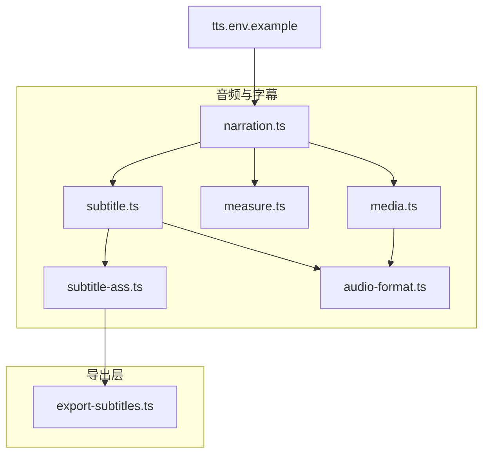
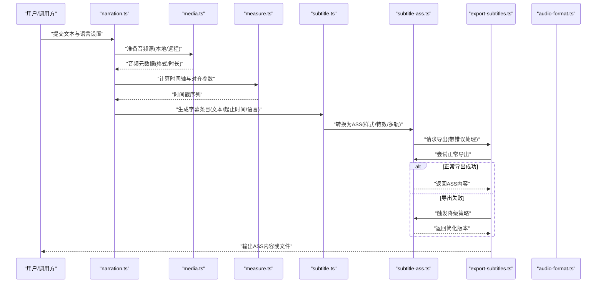
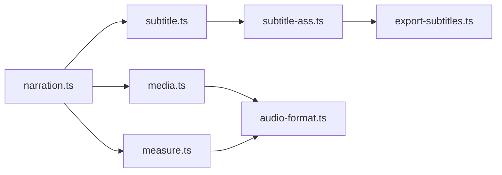

# 字幕生成

<cite>
**本文引用的文件**   
- [subtitle.ts](file://src/features/audio/subtitle.ts)
- [subtitle-ass.ts](file://src/features/audio/subtitle-ass.ts)
- [export-subtitles.ts](file://src/features/render/export-subtitles.ts)
- [subtitle.test.ts](file://src/features/audio/subtitle.test.ts)
- [subtitle-ass.test.ts](file://src/features/audio/subtitle-ass.test.ts)
- [narration.ts](file://src/features/audio/narration.ts)
- [media.ts](file://src/features/audio/media.ts)
- [measure.ts](file://src/features/audio/measure.ts)
- [audio-format.ts](file://src/features/audio/audio-format.ts)
- [tts.env.example](file://config/tts.env.example)
</cite>

## 更新摘要
**所做更改**   
- 新增专用字幕导出模块 export-subtitles.ts，支持正常和降级导出场景的统一处理
- 更新 subtitle-ass.ts 以适配新的导出架构
- 增强字幕生成的容错性和可靠性机制
- 优化导出流程的错误处理和降级策略

## 目录
1. [简介](#简介)
2. [项目结构](#项目结构)
3. [核心组件](#核心组件)
4. [架构总览](#架构总览)
5. [详细组件分析](#详细组件分析)
6. [依赖关系分析](#依赖关系分析)
7. [性能考虑](#性能考虑)
8. [故障排查指南](#故障排查指南)
9. [结论](#结论)
10. [附录](#附录)

## 简介
本文件面向PurpleInk项目的"字幕生成与管理"能力，系统性说明从音频到字幕的完整流程：时间轴对齐、文本分割、格式转换（含ASS）、样式与特效、多语言支持、与音频同步机制、编辑工具能力（手动调整、批量修改、预览），以及质量检查与验证方法。文档同时给出最佳实践建议，帮助在复杂场景下稳定产出高质量字幕。

**更新** 新增了专用的字幕导出模块，提供统一的正常和降级导出处理机制，增强了系统的稳定性和容错能力。

## 项目结构
与字幕相关的能力集中在 src/features/audio 模块中，围绕"叙事（narration）—媒体处理（media）—度量（measure）—字幕（subtitle）—ASS导出（subtitle-ass）"形成清晰分层。新增的 export-subtitles.ts 模块位于渲染层，负责统一处理字幕导出逻辑。配置项通过环境变量注入，便于不同环境切换TTS与媒体后端。

图表来源
- [narration.ts](file://src/features/audio/narration.ts)
- [media.ts](file://src/features/audio/media.ts)
- [measure.ts](file://src/features/audio/measure.ts)
- [subtitle.ts](file://src/features/audio/subtitle.ts)
- [subtitle-ass.ts](file://src/features/audio/subtitle-ass.ts)
- [export-subtitles.ts](file://src/features/render/export-subtitles.ts)
- [audio-format.ts](file://src/features/audio/audio-format.ts)
- [tts.env.example](file://config/tts.env.example)

章节来源
- [narration.ts](file://src/features/audio/narration.ts)
- [media.ts](file://src/features/audio/media.ts)
- [measure.ts](file://src/features/audio/measure.ts)
- [subtitle.ts](file://src/features/audio/subtitle.ts)
- [subtitle-ass.ts](file://src/features/audio/subtitle-ass.ts)
- [export-subtitles.ts](file://src/features/render/export-subtitles.ts)
- [audio-format.ts](file://src/features/audio/audio-format.ts)
- [tts.env.example](file://config/tts.env.example)

## 核心组件
- 叙事编排（narration）：负责将文本切分为可朗读的片段，驱动TTS合成并维护时间线。
- 媒体处理（media）：封装音频读取、格式识别、时长测量等通用能力。
- 度量（measure）：提供精确的时间戳与时长计算，支撑时间轴对齐。
- 字幕（subtitle）：抽象字幕条目模型、时间轴对齐、文本分割策略、多语言标注。
- ASS导出（subtitle-ass）：将内部字幕模型转换为ASS格式，支持样式定义、特效应用与多语言轨道。
- **新增** 字幕导出器（export-subtitles）：统一处理正常和降级导出场景，提供容错和重试机制。
- 音频格式（audio-format）：统一音频格式识别与兼容性处理。

章节来源
- [narration.ts](file://src/features/audio/narration.ts)
- [media.ts](file://src/features/audio/media.ts)
- [measure.ts](file://src/features/audio/measure.ts)
- [subtitle.ts](file://src/features/audio/subtitle.ts)
- [subtitle-ass.ts](file://src/features/audio/subtitle-ass.ts)
- [export-subtitles.ts](file://src/features/render/export-subtitles.ts)
- [audio-format.ts](file://src/features/audio/audio-format.ts)

## 架构总览
下图展示从"文本→TTS→音频→时间轴→字幕→ASS导出"的主流程，强调新增的导出层对异常处理和降级策略的支持。

图表来源
- [narration.ts](file://src/features/audio/narration.ts)
- [media.ts](file://src/features/audio/media.ts)
- [measure.ts](file://src/features/audio/measure.ts)
- [subtitle.ts](file://src/features/audio/subtitle.ts)
- [subtitle-ass.ts](file://src/features/audio/subtitle-ass.ts)
- [export-subtitles.ts](file://src/features/render/export-subtitles.ts)
- [audio-format.ts](file://src/features/audio/audio-format.ts)

## 详细组件分析

### 字幕模型与时间轴对齐（subtitle.ts）
- 职责
  - 定义字幕条目数据结构（文本、开始时间、结束时间、语言标签、样式引用）。
  - 实现文本分割策略（按语义/长度/停顿点），确保可读性与屏幕显示限制。
  - 基于音频时长与语音节奏进行时间轴对齐，保证文字与语音播放精确对应。
  - 提供多语言标注与切换能力。
- 关键流程
  - 输入：原始文本、目标语言、显示约束（行宽/行数）。
  - 处理：分句/分段→预估时长→对齐时间戳→合并相邻短段→去重与校验。
  - 输出：结构化字幕条目列表，供ASS导出使用。
- 复杂度与优化
  - 文本分割采用线性扫描+启发式规则，时间复杂度近似O(n)。
  - 时间轴对齐采用二分/插值策略，避免累积误差。
  - 对超长段落自动换行与截断，减少渲染压力。
- 错误处理
  - 非法字符过滤、空段落剔除、时间戳回退与边界保护。

章节来源
- [subtitle.ts](file://src/features/audio/subtitle.ts)
- [subtitle.test.ts](file://src/features/audio/subtitle.test.ts)

### ASS格式支持与样式/特效（subtitle-ass.ts）
- 职责
  - 将内部字幕模型映射为ASS标准语法，包括样式表、对话行、特效标记。
  - 支持多语言轨道（不同语言独立样式与位置）。
  - 提供常用特效（淡入淡出、滚动、阴影、描边）的配置入口。
- **更新** 新增与导出器的集成接口，支持错误捕获和降级处理。
- 关键流程
  - 构建ASS头部（字体、字号、颜色、对齐方式）。
  - 遍历字幕条目，写入对话行（起始/结束时间、说话人、样式名、文本）。
  - 根据样式与特效配置注入ASS特效命令。
- 兼容性与扩展
  - 遵循ASS规范，兼容主流播放器；对不支持的特效做降级处理。
  - 可扩展自定义样式模板与特效插件。
- 错误处理
  - 非法样式名、冲突样式、无效特效参数均会记录并跳过该条目。
  - **新增** 与导出器协作，支持异常时的降级策略。

章节来源
- [subtitle-ass.ts](file://src/features/audio/subtitle-ass.ts)
- [subtitle-ass.test.ts](file://src/features/audio/subtitle-ass.test.ts)

### 字幕导出器（export-subtitles.ts）
- **新增** 职责
  - 统一管理字幕导出的正常流程和降级策略。
  - 处理导出过程中的异常情况，确保系统稳定性。
  - 提供重试机制和错误恢复功能。
  - 协调ASS生成器与其他依赖服务。
- 关键流程
  - 接收ASS生成器输出的字幕数据。
  - 尝试正常导出流程（完整样式、特效、多语言支持）。
  - 如果失败，自动切换到降级模式（简化样式、移除特效）。
  - 记录导出状态和错误信息，便于问题追踪。
- 容错机制
  - 超时保护：防止长时间阻塞的导出操作。
  - 内存管理：大文件流式处理，避免内存溢出。
  - 资源清理：确保临时文件和资源正确释放。
- 监控与日志
  - 详细的导出过程日志，包含成功/失败状态。
  - 性能指标收集，用于优化和容量规划。

章节来源
- [export-subtitles.ts](file://src/features/render/export-subtitles.ts)

### 音频与时间轴（media.ts + measure.ts + audio-format.ts）
- media.ts
  - 封装音频读取、流式处理、格式探测、基础元数据获取。
- measure.ts
  - 提供高精度时长测量、帧级时间戳计算、静音段检测。
- audio-format.ts
  - 统一音频格式识别与转码策略，确保跨平台一致性。
- 协同工作
  - narration 调用 media 获取音频信息，measure 计算时间轴，subtitle 生成条目，最终由 subtitle-ass 输出ASS，并通过 export-subtitles 进行统一导出。

章节来源
- [media.ts](file://src/features/audio/media.ts)
- [measure.ts](file://src/features/audio/measure.ts)
- [audio-format.ts](file://src/features/audio/audio-format.ts)

### 叙事编排（narration.ts）
- 职责
  - 将长文本拆分为适合TTS朗读的片段，控制语速、停顿与情感提示。
  - 管理TTS任务队列，收集每段音频的开始/结束时间戳。
  - 与 subtitle 协作，生成带时间轴的字幕条目。
- 关键点
  - 动态调整分片粒度以匹配语音停顿。
  - 失败重试与降级策略（如切换TTS提供商或降低采样率）。
  - 日志与指标上报，便于问题定位。

章节来源
- [narration.ts](file://src/features/audio/narration.ts)

### 配置与环境（tts.env.example）
- 作用
  - 定义TTS服务、媒体后端、存储路径等环境变量。
  - 支持多环境切换（开发/测试/生产）。
- 建议
  - 严格区分敏感信息（密钥）与非敏感配置。
  - 使用最小权限原则配置访问凭证。

章节来源
- [tts.env.example](file://config/tts.env.example)

## 依赖关系分析
- 内聚性
  - subtitle 与 subtitle-ass 高内聚，专注字幕模型与ASS转换。
  - **新增** export-subtitles 作为独立的导出管理层，解耦具体的导出逻辑。
  - media/measure/audio-format 组成底层媒体能力层，被上层复用。
- 耦合度
  - narration 作为编排层，依赖媒体与字幕能力，但不直接操作ASS细节。
  - export-subtitles 作为导出层，屏蔽具体的导出实现差异。
- 外部依赖
  - TTS服务、媒体解码器、文件系统/对象存储。
- 循环依赖
  - 无循环依赖；层级清晰（编排→媒体→字幕→导出→导出器）。

图表来源
- [narration.ts](file://src/features/audio/narration.ts)
- [media.ts](file://src/features/audio/media.ts)
- [measure.ts](file://src/features/audio/measure.ts)
- [subtitle.ts](file://src/features/audio/subtitle.ts)
- [subtitle-ass.ts](file://src/features/audio/subtitle-ass.ts)
- [export-subtitles.ts](file://src/features/render/export-subtitles.ts)
- [audio-format.ts](file://src/features/audio/audio-format.ts)

## 性能考虑
- 文本分割
  - 优先使用轻量规则引擎，避免重型NLP解析；必要时缓存结果。
- 时间轴对齐
  - 使用增量计算与滑动窗口，减少重复计算；对长音频分段处理。
- 并发与批处理
  - 对多语言/多轨道并行生成；限制并发数避免资源争用。
- I/O与内存
  - 流式读写大文件；及时释放中间缓冲区；避免一次性加载全部音频。
- 渲染优化
  - ASS样式预编译，减少运行时开销；按需启用特效。
- **新增** 导出优化
  - 异步导出处理，避免阻塞主流程。
  - 增量导出，只处理变更的字幕部分。
  - 缓存已生成的ASS内容，避免重复计算。

## 故障排查指南
- 常见问题
  - 时间轴漂移：检查 measure 的静音检测阈值与对齐算法。
  - 文本溢出：调整 subtitle 的分段策略与显示约束。
  - ASS渲染异常：核对样式名、特效命令合法性与播放器兼容性。
  - TTS失败：确认 tts.env 配置、网络连通性与配额限制。
  - **新增** 导出失败：检查 export-subtitles 的错误日志和降级状态。
- 诊断步骤
  - 查看各阶段日志与指标；回放关键时间戳区间。
  - 使用单元测试覆盖边界用例（空文本、超长段落、特殊字符）。
  - 逐步隔离问题域（媒体→度量→字幕→导出→导出器）。
  - **新增** 检查导出器的降级策略是否被触发。
- 恢复策略
  - 失败重试与降级（切换TTS、简化特效、缩短分片）。
  - 保留中间产物以便复现与对比。
  - **新增** 利用导出器的自动重试和恢复机制。

章节来源
- [subtitle.test.ts](file://src/features/audio/subtitle.test.ts)
- [subtitle-ass.test.ts](file://src/features/audio/subtitle-ass.test.ts)
- [export-subtitles.ts](file://src/features/render/export-subtitles.ts)

## 结论
PurpleInk的字幕子系统以清晰的层次与职责划分，实现了从文本到ASS字幕的高质量生成。通过精确的时间轴对齐、灵活的文本分割、完善的ASS样式与特效支持，以及健壮的错误处理与性能优化策略，能够在多语言与复杂场景下稳定输出可用字幕。**更新** 新增的专用导出模块进一步增强了系统的稳定性和容错能力，确保在各种环境下都能可靠地生成字幕。建议在生产环境中结合监控与自动化测试，持续保障质量与稳定性。

## 附录
- 最佳实践
  - 文本预处理：去除多余空白、规范化标点、统一全半角。
  - 时间轴校准：以静音段为锚点，结合语音停顿微调起止时间。
  - ASS样式模板化：建立团队共享样式库，统一视觉风格。
  - 多语言策略：按语言拆分轨道，避免混排导致的渲染问题。
  - 质量检查：自动化校验时间戳顺序、重叠、越界与字符集。
  - **新增** 导出策略：合理配置降级阈值，平衡质量和可用性。
- 兼容性处理
  - 对不支持的ASS特性做降级（如移除特效或简化样式）。
  - 输出前进行播放器白名单测试，确保广泛兼容。
  - **新增** 利用导出器的兼容性检测和自动适配功能。
- **新增** 导出器配置
  - 超时设置：根据文件大小和服务响应时间合理配置。
  - 重试策略：指数退避算法，避免雪崩效应。
  - 监控指标：关注导出成功率、平均耗时和资源使用情况。