# 字幕生成与同步

<cite>
**本文引用的文件**   
- [src/features/audio/subtitle.ts](file://src/features/audio/subtitle.ts)
- [src/features/audio/narration.ts](file://src/features/audio/narration.ts)
- [src/features/audio/measure.ts](file://src/features/audio/measure.ts)
- [src/features/director/audio-timing.ts](file://src/features/director/audio-timing.ts)
- [src/features/render/renderer.ts](file://src/features/render/renderer.ts)
- [src/features/render/frame-sequence.ts](file://src/features/render/frame-sequence.ts)
- [src/features/render/cache.ts](file://src/features/render/cache.ts)
- [src/features/render/qa-check.ts](file://src/features/render/qa-check.ts)
- [server/src/tts/orchestrate.ts](file://server/src/tts/orchestrate.ts)
- [server/src/tts/narration.ts](file://server/src/tts/narration.ts)
- [server/src/capture/run-capture.ts](file://server/src/capture/run-capture.ts)
- [server/src/server/job-runner.ts](file://server/src/server/job-runner.ts)
- [server/src/server/api.ts](file://server/src/server/api.ts)
- [src/app/api/render/route.ts](file://src/app/api/render/route.ts)
- [src/app/api/render/export/route.ts](file://src/app/api/render/export/route.ts)
- [src/app/products/(app)/canvas/[projectId]/page.tsx](file://src/app/products/(app)/canvas/[projectId]/page.tsx)
- [src/app/products/(app)/export/[projectId]/page.tsx](file://src/app/products/(app)/export/[projectId]/page.tsx)
- [src/components/ui/timeline-track.tsx](file://src/components/ui/timeline-track.tsx)
- [src/lib/tts/index.ts](file://src/lib/tts/index.ts)
</cite>

## 目录
1. [简介](#简介)
2. [项目结构](#项目结构)
3. [核心组件](#核心组件)
4. [架构总览](#架构总览)
5. [详细组件分析](#详细组件分析)
6. [依赖关系分析](#依赖关系分析)
7. [性能考量](#性能考量)
8. [故障排查指南](#故障排查指南)
9. [结论](#结论)
10. [附录](#附录)

## 简介
本技术文档面向 PurpleInK 字幕生成系统，围绕语音转文本、时间戳对齐、字幕格式化（含 ASS 支持）、时间轴同步、帧率转换与时间基准统一、编辑界面与实时预览、版本管理、多语言与本地化、质量检查与兼容性测试、渲染优化与缓存策略等主题进行系统化说明。文档以仓库现有实现为依据，提供代码级架构图与时序图，帮助读者快速理解并高效使用该系统。

## 项目结构
PurpleInK 采用前后端分离与模块化设计：
- 前端 Next.js 应用负责用户交互、画布编辑、时间轴与导出流程。
- 服务端包含 TTS 编排、采集、渲染与任务调度等能力。
- 功能域按 features 划分，如 audio、director、render、routing 等。

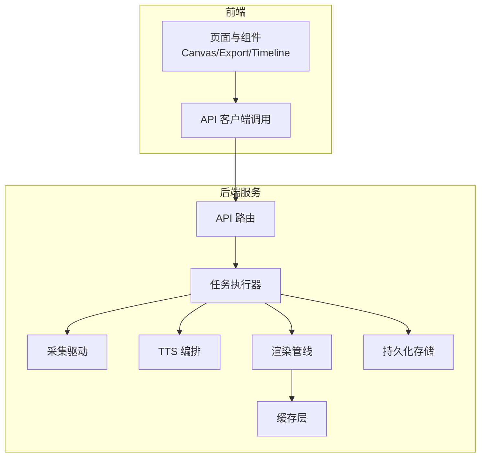

**图示来源** 
- [server/src/server/api.ts](file://server/src/server/api.ts)
- [server/src/server/job-runner.ts](file://server/src/server/job-runner.ts)
- [server/src/capture/run-capture.ts](file://server/src/capture/run-capture.ts)
- [server/src/tts/orchestrate.ts](file://server/src/tts/orchestrate.ts)
- [src/features/render/renderer.ts](file://src/features/render/renderer.ts)
- [src/features/render/cache.ts](file://src/features/render/cache.ts)

**章节来源**
- [server/src/server/api.ts](file://server/src/server/api.ts)
- [server/src/server/job-runner.ts](file://server/src/server/job-runner.ts)
- [src/app/api/render/route.ts](file://src/app/api/render/route.ts)
- [src/app/api/render/export/route.ts](file://src/app/api/render/export/route.ts)

## 核心组件
- 音频测量与时长估算：用于获取媒体时长、采样率、帧率等关键元数据，为时间轴对齐提供基础。
- 语音转文本与叙事编排：将音频流转换为文本片段，并与时间戳关联，形成可编辑的字幕单元。
- 字幕格式与样式：支持 ASS 字幕格式，定义样式、动画与排版规则。
- 时间轴同步与帧率转换：统一时间基准，处理不同帧率与时间单位之间的转换。
- 渲染与导出：基于画布与模板生成视频帧序列，输出最终媒体或字幕文件。
- 质量检查与验证：对字幕语法、时序一致性、格式兼容性进行检查。
- 缓存与性能优化：减少重复计算与 I/O 开销，提升渲染与导出效率。

**章节来源**
- [src/features/audio/measure.ts](file://src/features/audio/measure.ts)
- [src/features/audio/narration.ts](file://src/features/audio/narration.ts)
- [src/features/audio/subtitle.ts](file://src/features/audio/subtitle.ts)
- [src/features/director/audio-timing.ts](file://src/features/director/audio-timing.ts)
- [src/features/render/renderer.ts](file://src/features/render/renderer.ts)
- [src/features/render/frame-sequence.ts](file://src/features/render/frame-sequence.ts)
- [src/features/render/cache.ts](file://src/features/render/cache.ts)
- [src/features/render/qa-check.ts](file://src/features/render/qa-check.ts)

## 架构总览
系统整体流程如下：
- 前端发起渲染或导出请求。
- 后端通过 API 接收请求，交由任务执行器调度。
- 任务执行器协调采集、TTS 编排、字幕生成、时间轴对齐与渲染。
- 渲染阶段利用缓存与帧序列生成，最终输出结果。

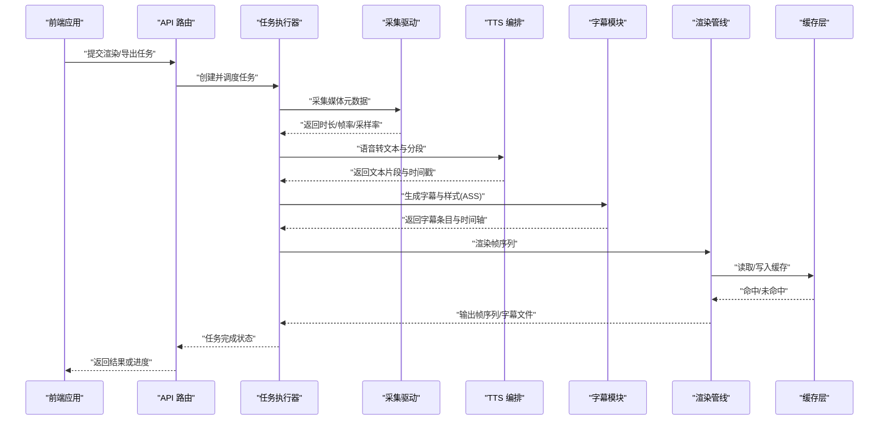

**图示来源** 
- [server/src/server/api.ts](file://server/src/server/api.ts)
- [server/src/server/job-runner.ts](file://server/src/server/job-runner.ts)
- [server/src/capture/run-capture.ts](file://server/src/capture/run-capture.ts)
- [server/src/tts/orchestrate.ts](file://server/src/tts/orchestrate.ts)
- [src/features/audio/subtitle.ts](file://src/features/audio/subtitle.ts)
- [src/features/render/renderer.ts](file://src/features/render/renderer.ts)
- [src/features/render/cache.ts](file://src/features/render/cache.ts)

## 详细组件分析

### 音频测量与时间基准
- 职责：解析媒体元数据，提取时长、帧率、采样率；统一时间基准（秒/毫秒/帧）。
- 关键点：
  - 帧率转换需考虑源与目标帧率差异，避免累积误差。
  - 时间戳对齐时采用四舍五入或截断策略，保证视觉与听觉一致。
- 复杂度：O(n) 扫描关键帧或元数据块；空间 O(1)。

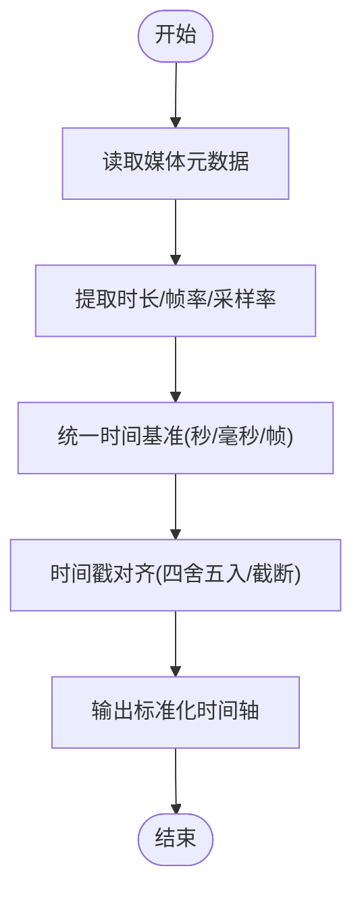

**图示来源** 
- [src/features/audio/measure.ts](file://src/features/audio/measure.ts)
- [src/features/director/audio-timing.ts](file://src/features/director/audio-timing.ts)

**章节来源**
- [src/features/audio/measure.ts](file://src/features/audio/measure.ts)
- [src/features/director/audio-timing.ts](file://src/features/director/audio-timing.ts)

### 语音转文本与时间戳对齐
- 职责：将音频流切分为片段，识别文本内容，并为每个片段分配起止时间戳。
- 关键点：
  - 切片策略：基于静音检测、能量阈值或模型置信度。
  - 对齐算法：将文本片段映射到时间轴，处理重叠与间隙。
  - 容错机制：失败重试、降级策略（短片段合并）。
- 复杂度：切片 O(n)，对齐 O(m log m)（m 为片段数）。

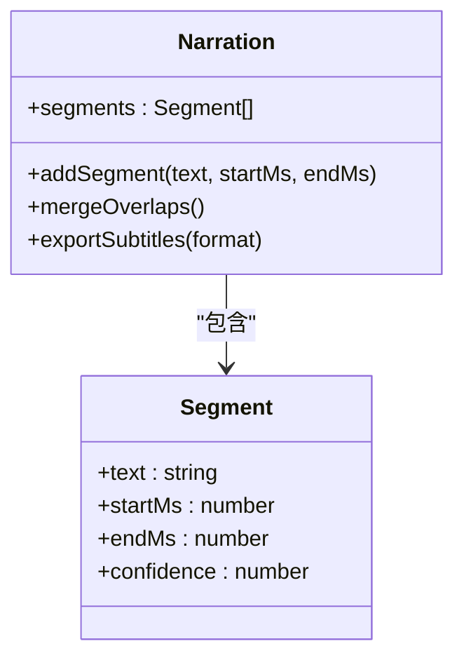

**图示来源** 
- [src/features/audio/narration.ts](file://src/features/audio/narration.ts)

**章节来源**
- [src/features/audio/narration.ts](file://src/features/audio/narration.ts)

### 字幕格式与样式（ASS）
- 职责：生成 ASS 字幕文件，定义样式（字体、颜色、阴影、描边）、动画（淡入淡出、滚动、缩放）与排版（位置、对齐）。
- 关键点：
  - 样式表与事件段分离，便于复用与维护。
  - 动画标签与时间轴严格对应，确保播放效果一致。
  - 兼容性与回退：当播放器不支持某些特性时自动降级。
- 复杂度：生成 O(k)（k 为字幕条目），样式解析 O(s)（s 为样式数量）。

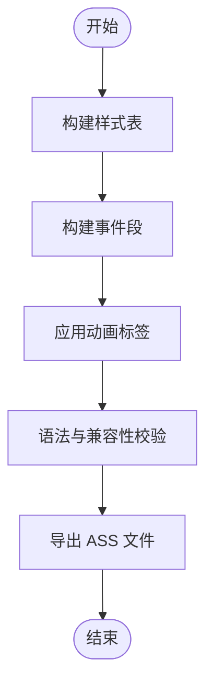

**图示来源** 
- [src/features/audio/subtitle.ts](file://src/features/audio/subtitle.ts)

**章节来源**
- [src/features/audio/subtitle.ts](file://src/features/audio/subtitle.ts)

### 时间轴同步与帧率转换
- 职责：统一时间基准，处理不同帧率之间的转换，确保字幕与画面同步。
- 关键点：
  - 帧率转换公式：targetFrame = round(sourceFrame * (targetFPS / sourceFPS))
  - 时间基准统一：毫秒→秒→帧的多次转换需保持精度。
  - 同步策略：关键帧对齐、插值填充、丢帧控制。
- 复杂度：O(f)（f 为帧数），空间 O(f)。

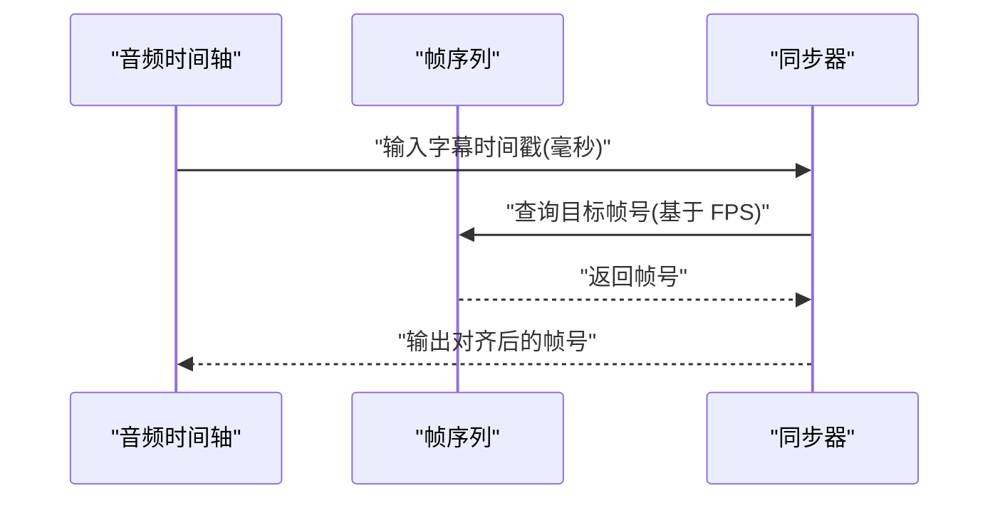

**图示来源** 
- [src/features/director/audio-timing.ts](file://src/features/director/audio-timing.ts)
- [src/features/render/frame-sequence.ts](file://src/features/render/frame-sequence.ts)

**章节来源**
- [src/features/director/audio-timing.ts](file://src/features/director/audio-timing.ts)
- [src/features/render/frame-sequence.ts](file://src/features/render/frame-sequence.ts)

### 渲染管线与缓存策略
- 职责：根据画布与模板生成视频帧序列，支持增量渲染与缓存命中。
- 关键点：
  - 缓存键：基于输入参数哈希，避免重复计算。
  - 缓存策略：LRU 或 TTL，平衡内存与命中率。
  - 增量渲染：仅重算变更帧，提升效率。
- 复杂度：缓存查找 O(1)，渲染 O(n)（n 为帧数）。

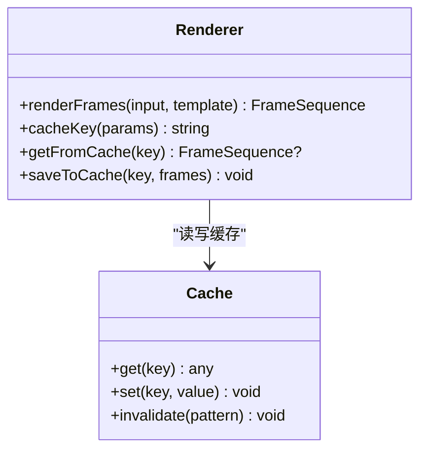

**图示来源** 
- [src/features/render/renderer.ts](file://src/features/render/renderer.ts)
- [src/features/render/cache.ts](file://src/features/render/cache.ts)

**章节来源**
- [src/features/render/renderer.ts](file://src/features/render/renderer.ts)
- [src/features/render/cache.ts](file://src/features/render/cache.ts)

### 质量检查与格式兼容性
- 职责：对字幕语法、时间轴连续性、格式兼容性进行检查与修复。
- 关键点：
  - 语法校验：检查标签闭合、样式引用有效性。
  - 时间轴校验：无负时长、无重叠冲突。
  - 兼容性测试：在不同播放器上验证显示效果。
- 复杂度：校验 O(k)（k 为条目数），修复 O(k)。

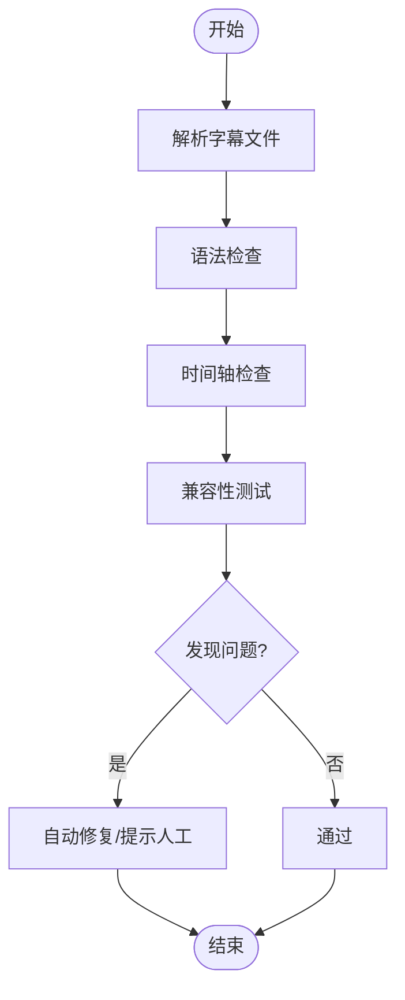

**图示来源** 
- [src/features/render/qa-check.ts](file://src/features/render/qa-check.ts)

**章节来源**
- [src/features/render/qa-check.ts](file://src/features/render/qa-check.ts)

### 编辑界面、实时预览与版本管理
- 职责：提供字幕编辑界面，支持实时预览与版本管理。
- 关键点：
  - 时间轴组件：可视化编辑起止时间与文本。
  - 实时预览：基于当前时间轴即时渲染字幕效果。
  - 版本管理：保存历史版本，支持回滚与对比。
- 复杂度：UI 更新 O(1) per change，版本存储 O(v)（v 为版本数）。

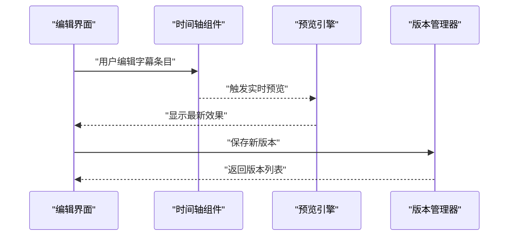

**图示来源** 
- [src/components/ui/timeline-track.tsx](file://src/components/ui/timeline-track.tsx)
- [src/app/products/(app)/canvas/[projectId]/page.tsx](file://src/app/products/(app)/canvas/[projectId]/page.tsx)
- [src/app/products/(app)/export/[projectId]/page.tsx](file://src/app/products/(app)/export/[projectId]/page.tsx)

**章节来源**
- [src/components/ui/timeline-track.tsx](file://src/components/ui/timeline-track.tsx)
- [src/app/products/(app)/canvas/[projectId]/page.tsx](file://src/app/products/(app)/canvas/[projectId]/page.tsx)
- [src/app/products/(app)/export/[projectId]/page.tsx](file://src/app/products/(app)/export/[projectId]/page.tsx)

### 多语言字幕支持与翻译集成
- 职责：支持多语言字幕生成与翻译，提供本地化资源管理。
- 关键点：
  - 多语言素材：按语言维度组织字幕与样式。
  - 翻译集成：调用外部翻译服务，保持术语一致性。
  - 本地化：日期、数字、方向等区域设置适配。
- 复杂度：翻译 O(t)（t 为词条数），本地化 O(l)（l 为资源数）。

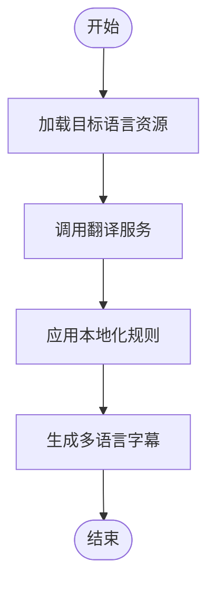

**图示来源** 
- [src/lib/tts/index.ts](file://src/lib/tts/index.ts)

**章节来源**
- [src/lib/tts/index.ts](file://src/lib/tts/index.ts)

## 依赖关系分析
组件间依赖清晰，低耦合高内聚：
- 前端依赖 API 路由与组件库。
- 后端任务执行器依赖采集、TTS、渲染与缓存。
- 字幕模块依赖音频测量与时间轴对齐。

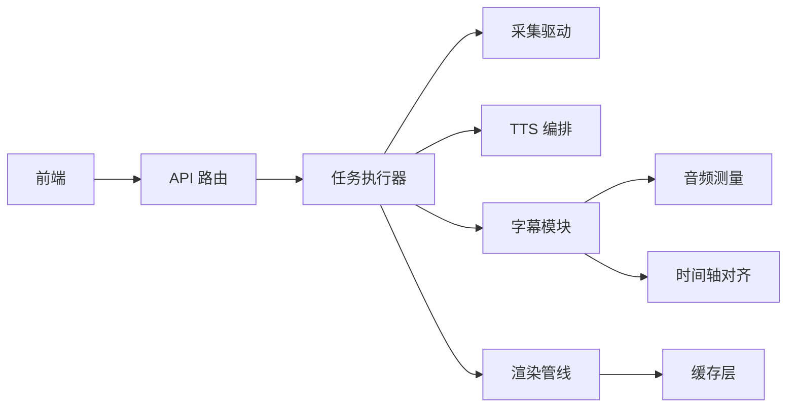

**图示来源** 
- [server/src/server/api.ts](file://server/src/server/api.ts)
- [server/src/server/job-runner.ts](file://server/src/server/job-runner.ts)
- [src/features/audio/subtitle.ts](file://src/features/audio/subtitle.ts)
- [src/features/render/renderer.ts](file://src/features/render/renderer.ts)

**章节来源**
- [server/src/server/api.ts](file://server/src/server/api.ts)
- [server/src/server/job-runner.ts](file://server/src/server/job-runner.ts)
- [src/features/audio/subtitle.ts](file://src/features/audio/subtitle.ts)
- [src/features/render/renderer.ts](file://src/features/render/renderer.ts)

## 性能考量
- 缓存策略：使用 LRU 或 TTL 提高命中率，减少重复计算。
- 增量渲染：仅重算变更帧，降低 CPU 与 I/O 压力。
- 并发控制：限制并行任务数，避免资源争用。
- 内存管理：及时释放大对象，防止内存泄漏。
- 网络优化：压缩传输数据，减少延迟。

[本节为通用指导，无需特定文件来源]

## 故障排查指南
- 常见问题：
  - 时间戳错位：检查帧率转换与时间基准统一逻辑。
  - 字幕不同步：确认对齐算法与关键帧选择。
  - 渲染卡顿：查看缓存命中率与并发配置。
  - 语法错误：运行质量检查工具定位问题。
- 调试步骤：
  - 启用详细日志，记录关键节点输入输出。
  - 使用最小复现用例隔离问题。
  - 逐步验证各模块边界条件。

**章节来源**
- [src/features/render/qa-check.ts](file://src/features/render/qa-check.ts)
- [src/features/director/audio-timing.ts](file://src/features/director/audio-timing.ts)

## 结论
PurpleInK 字幕生成系统通过模块化设计与清晰的依赖关系，实现了从语音转文本到字幕渲染的全流程自动化。系统在时间轴同步、ASS 格式支持、缓存优化与质量检查方面具备完善能力。建议在生产环境中结合监控与日志，持续优化性能与稳定性。

[本节为总结性内容，无需特定文件来源]

## 附录
- 术语表：ASS、TTS、FPS、LRU、TTL 等。
- 参考链接：仓库 README、部署文档、配置示例。

[本节为补充信息，无需特定文件来源]