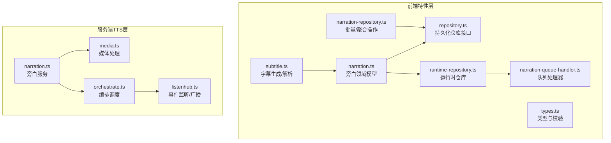
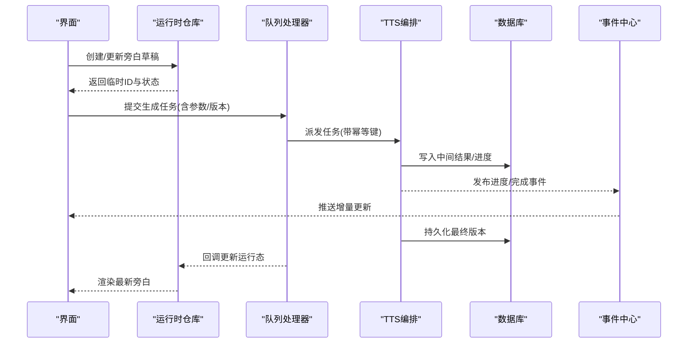
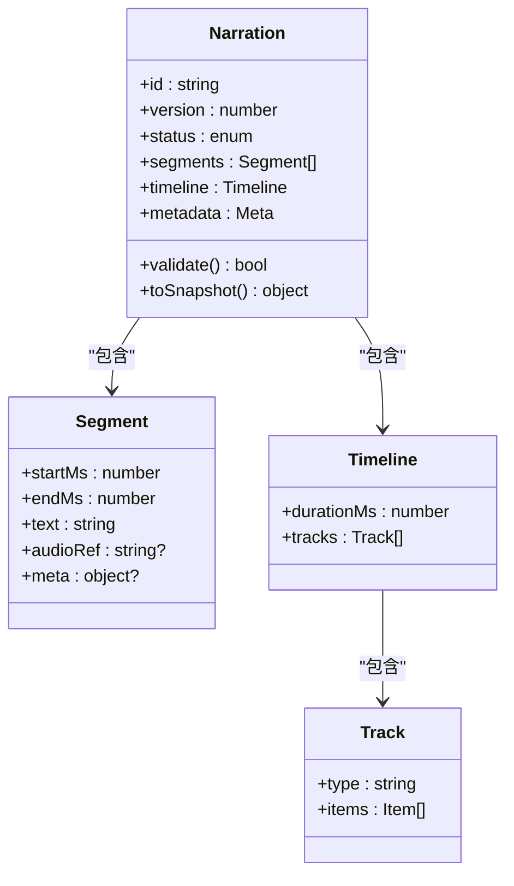
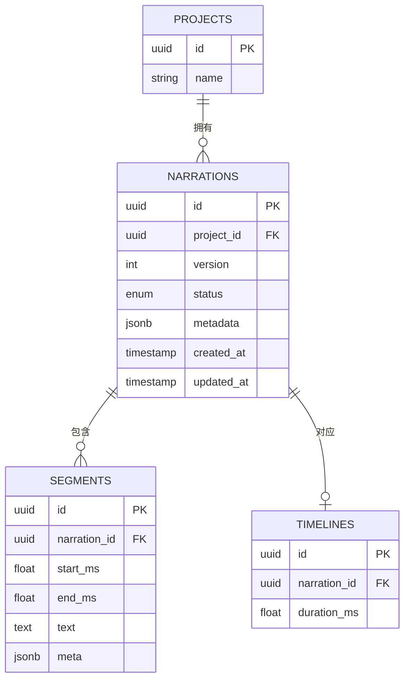
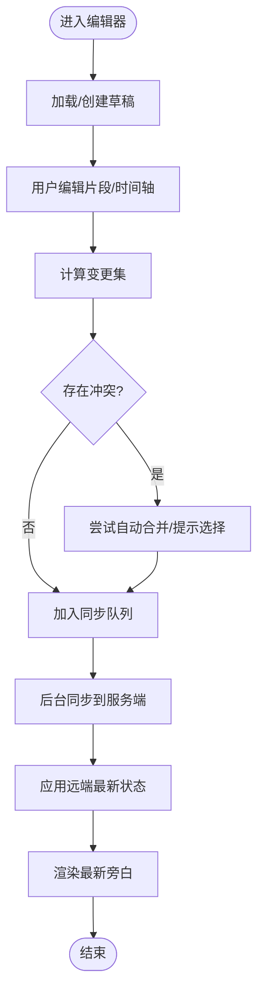
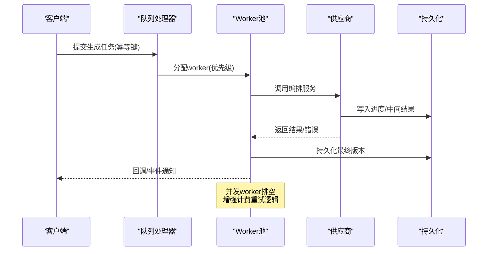
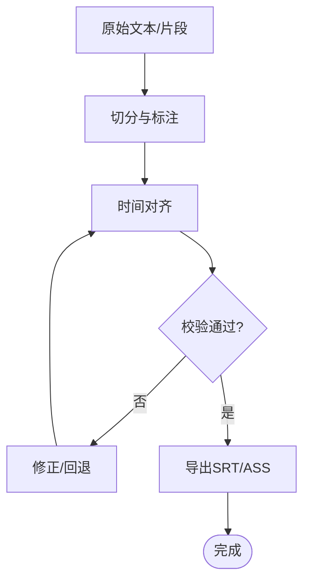
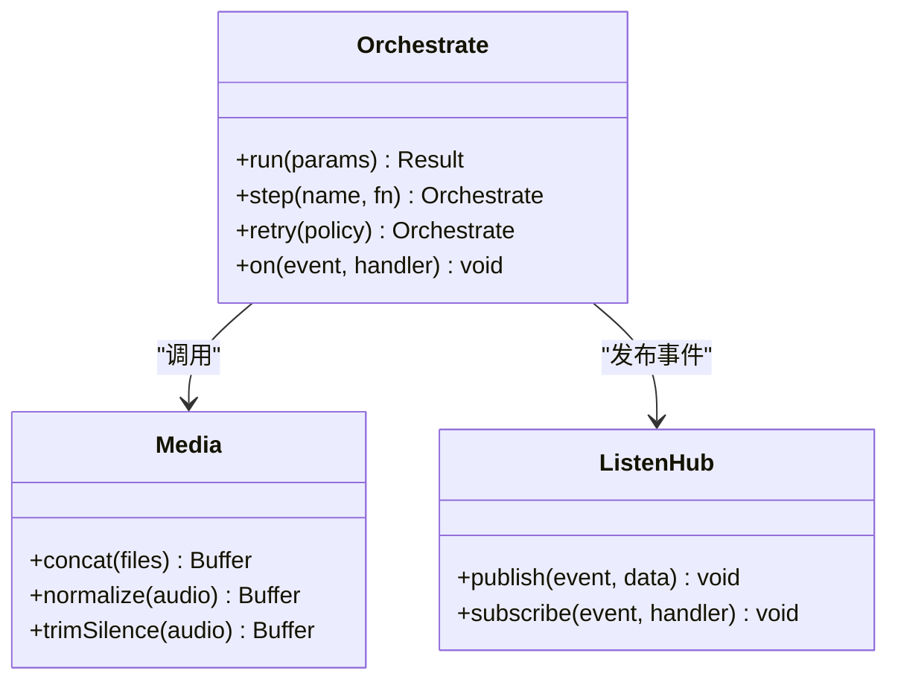
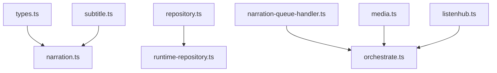

# 旁白管理

<cite>
**本文引用的文件**   
- [narration.ts](file://src/features/audio/narration.ts)
- [repository.ts](file://src/features/audio/repository.ts)
- [runtime-repository.ts](file://src/features/audio/runtime-repository.ts)
- [narration-queue-handler.ts](file://src/features/audio/narration-queue-handler.ts)
- [narration-repository.ts](file://src/features/audio/narration-repository.ts)
- [types.ts](file://src/features/audio/types.ts)
- [subtitle.ts](file://src/features/audio/subtitle.ts)
- [media.ts](file://server/src/tts/media.ts)
- [narration.ts](file://server/src/tts/narration.ts)
- [orchestrate.ts](file://server/src/tts/orchestrate.ts)
- [listenhub.ts](file://server/src/tts/listenhub.ts)
- [drizzle.config.ts](file://drizzle.config.ts)
</cite>

## 更新摘要
**变更内容**   
- 更新了队列处理器章节，反映 worker 管理的显著改进
- 新增并发 worker 排空机制的详细说明
- 增强了计费重试逻辑的实现细节
- 完善了任务调度和资源管理的架构描述

## 目录
1. [简介](#简介)
2. [项目结构](#项目结构)
3. [核心组件](#核心组件)
4. [架构总览](#架构总览)
5. [详细组件分析](#详细组件分析)
6. [依赖关系分析](#依赖关系分析)
7. [性能考虑](#性能考虑)
8. [故障排查指南](#故障排查指南)
9. [结论](#结论)
10. [附录](#附录)

## 简介
本文件面向 PurpleInk 的"旁白管理"功能，系统性阐述旁白的生命周期（创建、更新、删除、版本控制）、持久化存储与查询优化、运行时管理与实时同步、与项目的关联与依赖跟踪、导入导出能力以及搜索过滤排序等实现细节。文档同时提供架构图、时序图与流程图，帮助读者快速理解并高效使用或扩展该模块。

## 项目结构
旁白管理横跨前端特性层与服务端 TTS 编排层：
- 前端特性层（src/features/audio）：定义旁白类型、仓库接口、运行时仓库、队列处理器、字幕处理等。
- 服务端 TTS 层（server/src/tts）：负责媒体处理、旁白编排、事件监听与流式输出。
- 数据库配置（drizzle.config.ts）：用于 ORM/迁移配置，支撑持久化设计。

**图表来源** 
- [narration.ts](file://src/features/audio/narration.ts)
- [types.ts](file://src/features/audio/types.ts)
- [repository.ts](file://src/features/audio/repository.ts)
- [runtime-repository.ts](file://src/features/audio/runtime-repository.ts)
- [narration-queue-handler.ts](file://src/features/audio/narration-queue-handler.ts)
- [narration-repository.ts](file://src/features/audio/narration-repository.ts)
- [subtitle.ts](file://src/features/audio/subtitle.ts)
- [media.ts](file://server/src/tts/media.ts)
- [narration.ts](file://server/src/tts/narration.ts)
- [orchestrate.ts](file://server/src/tts/orchestrate.ts)
- [listenhub.ts](file://server/src/tts/listenhub.ts)

**章节来源**
- [drizzle.config.ts](file://drizzle.config.ts)

## 核心组件
- 旁白领域模型与类型：集中定义旁白实体、状态机、时间轴、片段、版本元数据等，确保前后端契约一致。
- 持久化仓库接口：抽象数据库访问，统一增删改查、分页、事务与并发控制。
- 运行时仓库：维护内存态、变更集、撤销/重做、乐观锁与冲突解决。
- 队列处理器：将旁白生成任务入队，按优先级与资源限制消费，支持重试与幂等。
- 字幕处理：文本切分、对齐、SRT/ASS 生成与校验。
- 服务端 TTS 编排：调用语音合成服务，拼接音频、生成字幕、回写结果。

**章节来源**
- [narration.ts](file://src/features/audio/narration.ts)
- [types.ts](file://src/features/audio/types.ts)
- [repository.ts](file://src/features/audio/repository.ts)
- [runtime-repository.ts](file://src/features/audio/runtime-repository.ts)
- [narration-queue-handler.ts](file://src/features/audio/narration-queue-handler.ts)
- [narration-repository.ts](file://src/features/audio/narration-repository.ts)
- [subtitle.ts](file://src/features/audio/subtitle.ts)
- [media.ts](file://server/src/tts/media.ts)
- [narration.ts](file://server/src/tts/narration.ts)
- [orchestrate.ts](file://server/src/tts/orchestrate.ts)
- [listenhub.ts](file://server/src/tts/listenhub.ts)

## 架构总览
旁白管理的整体流程包括：用户编辑 → 运行时仓库暂存 → 队列异步生成 → TTS 编排 → 结果落库 → 实时广播 → UI 同步。

**图表来源** 
- [runtime-repository.ts](file://src/features/audio/runtime-repository.ts)
- [narration-queue-handler.ts](file://src/features/audio/narration-queue-handler.ts)
- [orchestrate.ts](file://server/src/tts/orchestrate.ts)
- [listenhub.ts](file://server/src/tts/listenhub.ts)
- [repository.ts](file://src/features/audio/repository.ts)

## 详细组件分析

### 旁白领域模型与类型
- 职责：定义旁白实体、片段、时间轴、状态枚举、版本元数据、校验规则。
- 关键点：
  - 版本控制：通过版本号/时间戳实现乐观锁，避免覆盖冲突。
  - 状态机：草稿、生成中、就绪、失败等状态流转清晰。
  - 数据结构：片段数组+时间戳，便于精确剪辑与对齐。
  - 校验：长度、格式、必填字段、引用完整性检查。

**图表来源** 
- [narration.ts](file://src/features/audio/narration.ts)
- [types.ts](file://src/features/audio/types.ts)

**章节来源**
- [narration.ts](file://src/features/audio/narration.ts)
- [types.ts](file://src/features/audio/types.ts)

### 持久化仓库接口与数据库设计
- 职责：封装 CRUD、分页、事务、索引与查询优化。
- 设计要点：
  - 表结构：旁白主表、片段表、时间轴表、版本历史表、关联项目表。
  - 索引策略：project_id、status、updated_at、version 等常用查询列建立索引。
  - 查询优化：分页游标、投影只取必要字段、批量写入。
  - 并发控制：基于 version 的乐观锁；必要时行级锁。

**图表来源** 
- [repository.ts](file://src/features/audio/repository.ts)
- [drizzle.config.ts](file://drizzle.config.ts)

**章节来源**
- [repository.ts](file://src/features/audio/repository.ts)
- [drizzle.config.ts](file://drizzle.config.ts)

### 运行时仓库与实时同步
- 职责：维护内存中的旁白集合、变更集、撤销/重做、冲突检测与合并。
- 关键点：
  - 本地草稿：无网络时仍可编辑，离线队列缓存。
  - 增量同步：仅传输差异，减少带宽。
  - 冲突解决：基于版本号的自动合并策略与人工介入提示。
  - 事件驱动：通过事件中心订阅状态变化，驱动 UI 实时更新。

**图表来源** 
- [runtime-repository.ts](file://src/features/audio/runtime-repository.ts)
- [listenhub.ts](file://server/src/tts/listenhub.ts)

**章节来源**
- [runtime-repository.ts](file://src/features/audio/runtime-repository.ts)
- [listenhub.ts](file://server/src/tts/listenhub.ts)

### 队列处理器与任务编排
- 职责：接收旁白生成任务，按优先级与资源限制调度，保证幂等与重试。
- **更新** 近期对 worker 管理进行了显著改进，包括并发 worker 排空机制和增强的计费重试逻辑。
- 关键点：
  - 任务模型：输入参数、目标项目、版本、幂等键、超时与重试策略。
  - 调度策略：FIFO/优先级、限流、背压、死信队列。
  - 幂等性：相同幂等键不重复执行，避免重复生成。
  - Worker 管理：改进的并发控制和资源清理机制。
  - 计费重试：增强的错误处理和重试策略。
  - 监控：指标采集、告警、可观测性日志。

**图表来源** 
- [narration-queue-handler.ts](file://src/features/audio/narration-queue-handler.ts)
- [orchestrate.ts](file://server/src/tts/orchestrate.ts)

**章节来源**
- [narration-queue-handler.ts](file://src/features/audio/narration-queue-handler.ts)
- [orchestrate.ts](file://server/src/tts/orchestrate.ts)

### 字幕处理与多格式支持
- 职责：文本切分、对齐、生成 SRT/ASS 等字幕格式，并提供校验工具。
- 关键点：
  - 切分策略：按语义/时长阈值切分，避免断句不当。
  - 对齐算法：与音频片段时间戳对齐，容错处理漂移。
  - 格式转换：统一内部表示，输出多种字幕格式。
  - 校验：时间范围合法性、重复区间、编码规范。

**图表来源** 
- [subtitle.ts](file://src/features/audio/subtitle.ts)

**章节来源**
- [subtitle.ts](file://src/features/audio/subtitle.ts)

### 服务端 TTS 编排与媒体处理
- 职责：协调语音合成、音频拼接、字幕生成、结果回写。
- 关键点：
  - 编排器：步骤化流水线，支持并行与回滚。
  - 媒体处理：格式转换、音量归一化、静音裁剪。
  - 事件中心：发布进度、错误、完成事件，供前端订阅。
  - 可靠性：失败重试、降级策略、熔断保护。

**图表来源** 
- [orchestrate.ts](file://server/src/tts/orchestrate.ts)
- [media.ts](file://server/src/tts/media.ts)
- [listenhub.ts](file://server/src/tts/listenhub.ts)

**章节来源**
- [narration.ts](file://server/src/tts/narration.ts)
- [media.ts](file://server/src/tts/media.ts)
- [orchestrate.ts](file://server/src/tts/orchestrate.ts)
- [listenhub.ts](file://server/src/tts/listenhub.ts)

### 旁白与项目的关联与依赖管理
- 关联关系：每个旁白属于一个项目，支持多版本共存。
- 依赖管理：
  - 引用跟踪：片段引用的素材/脚本/模板需存在且有效。
  - 级联更新：项目元数据变更触发旁白重新评估。
  - 清理策略：删除项目时级联清理无用旁白与中间产物。

**图表来源** 
- [repository.ts](file://src/features/audio/repository.ts)
- [narration.ts](file://src/features/audio/narration.ts)

**章节来源**
- [repository.ts](file://src/features/audio/repository.ts)
- [narration.ts](file://src/features/audio/narration.ts)

### 导入导出与批量操作
- 导入：
  - 支持 JSON/YAML/SRT/ASS 等格式，统一转换为内部模型。
  - 批量导入：分片上传、去重、冲突提示、回滚机制。
- 导出：
  - 导出为 JSON/YAML 完整元数据，或 SRT/ASS 字幕文件。
  - 批量导出：按项目/标签筛选，压缩打包下载。
- 质量保障：
  - 导入前校验、错误报告、部分成功策略。
  - 导出一致性校验与签名。

**章节来源**
- [narration-repository.ts](file://src/features/audio/narration-repository.ts)
- [subtitle.ts](file://src/features/audio/subtitle.ts)

### 搜索、过滤与排序
- 搜索：
  - 全文检索：对文本内容建立倒排索引或借助搜索引擎。
  - 模糊匹配：支持拼音/同义词扩展。
- 过滤：
  - 按项目、状态、时间范围、标签、作者等维度过滤。
- 排序：
  - 按更新时间、版本、时长、评分等多字段排序。
- 性能：
  - 分页游标、延迟加载、缓存热点查询。

**章节来源**
- [repository.ts](file://src/features/audio/repository.ts)
- [narration-repository.ts](file://src/features/audio/narration-repository.ts)

## 依赖关系分析
- 模块内耦合：
  - narration.ts 依赖 types.ts 的类型定义。
  - runtime-repository.ts 依赖 repository.ts 的持久化接口。
  - narration-queue-handler.ts 依赖 orchestrate.ts 的编排能力。
- 跨层依赖：
  - 前端特性层通过事件中心与后端 TTS 层解耦。
  - 数据库访问集中在 repository.ts，便于替换实现。
- 外部依赖：
  - TTS 供应商 SDK、媒体处理库、消息队列/事件总线。

**图表来源** 
- [types.ts](file://src/features/audio/types.ts)
- [narration.ts](file://src/features/audio/narration.ts)
- [repository.ts](file://src/features/audio/repository.ts)
- [runtime-repository.ts](file://src/features/audio/runtime-repository.ts)
- [narration-queue-handler.ts](file://src/features/audio/narration-queue-handler.ts)
- [orchestrate.ts](file://server/src/tts/orchestrate.ts)
- [subtitle.ts](file://src/features/audio/subtitle.ts)
- [media.ts](file://server/src/tts/media.ts)
- [listenhub.ts](file://server/src/tts/listenhub.ts)

**章节来源**
- [types.ts](file://src/features/audio/types.ts)
- [narration.ts](file://src/features/audio/narration.ts)
- [repository.ts](file://src/features/audio/repository.ts)
- [runtime-repository.ts](file://src/features/audio/runtime-repository.ts)
- [narration-queue-handler.ts](file://src/features/audio/narration-queue-handler.ts)
- [orchestrate.ts](file://server/src/tts/orchestrate.ts)
- [subtitle.ts](file://src/features/audio/subtitle.ts)
- [media.ts](file://server/src/tts/media.ts)
- [listenhub.ts](file://server/src/tts/listenhub.ts)

## 性能考虑
- 数据库层面：
  - 合理索引与分区，避免全表扫描。
  - 使用连接池与读写分离提升吞吐。
- 运行时层面：
  - 增量同步与懒加载，降低首屏压力。
  - 批量写入与事务合并，减少 IO 次数。
- 队列与编排：
  - 动态扩缩容、背压与限流，防止雪崩。
  - 缓存热点数据，缩短响应时间。
  - **更新** 改进的 worker 管理提高了并发处理能力。
- 媒体处理：
  - 流式处理与分块编码，降低内存峰值。
  - 预渲染与缓存，加速重复播放。

[本节为通用指导，无需特定文件来源]

## 故障排查指南
- 常见问题：
  - 生成失败：检查 TTS 供应商状态、配额与网络连通性。
  - 同步冲突：查看版本号与冲突合并日志，必要时手动干预。
  - 字幕错位：核对时间戳对齐与采样率一致性。
  - **更新** Worker 相关问题：检查并发限制和资源清理情况。
- 诊断手段：
  - 启用详细日志与追踪 ID，定位请求链路。
  - 使用健康检查与指标看板，观察队列积压与错误率。
  - 回放失败任务，复现场景并修复。
  - **更新** 监控计费重试逻辑的执行情况。

**章节来源**
- [narration-queue-handler.ts](file://src/features/audio/narration-queue-handler.ts)
- [orchestrate.ts](file://server/src/tts/orchestrate.ts)
- [listenhub.ts](file://server/src/tts/listenhub.ts)

## 结论
PurpleInk 的旁白管理以清晰的领域模型与分层架构为基础，结合运行时仓库、队列编排与事件中心，实现了高可用、可扩展与实时同步的能力。通过完善的持久化设计、导入导出与搜索过滤，满足复杂生产场景需求。**最新更新** 队列处理器的改进进一步提升了系统的稳定性和性能，特别是 worker 管理和计费重试逻辑的增强。建议持续优化索引与缓存策略，完善监控与告警体系，进一步提升稳定性与用户体验。

[本节为总结性内容，无需特定文件来源]

## 附录
- 术语表：旁白、片段、时间轴、版本、幂等键、乐观锁、事件中心、TTS 编排、Worker 池、计费重试。
- 最佳实践：
  - 始终使用幂等键提交生成任务。
  - 在批量操作中采用分片与回滚策略。
  - 对高频查询建立合适索引与缓存。
  - 保持前后端类型契约一致，避免运行时错误。
  - **更新** 合理配置 worker 并发限制，避免资源耗尽。
  - **更新** 监控计费重试逻辑，及时处理异常情况。

[本节为补充信息，无需特定文件来源]