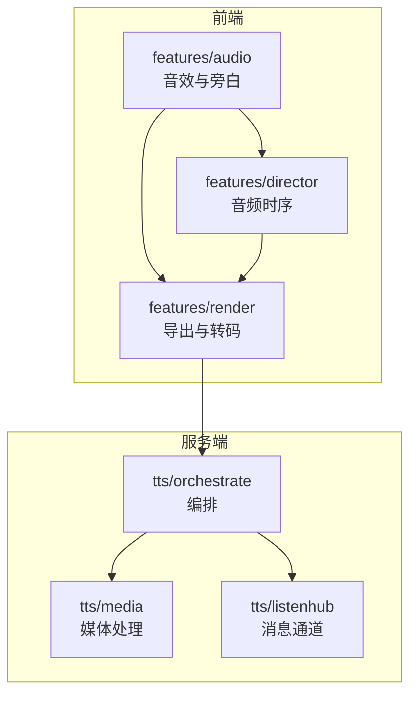
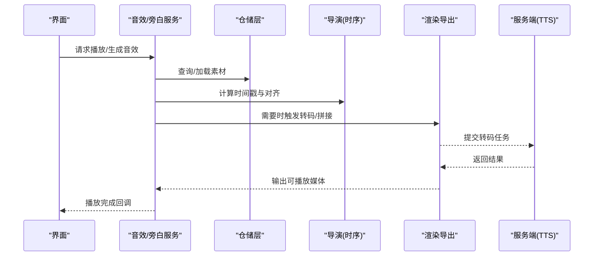
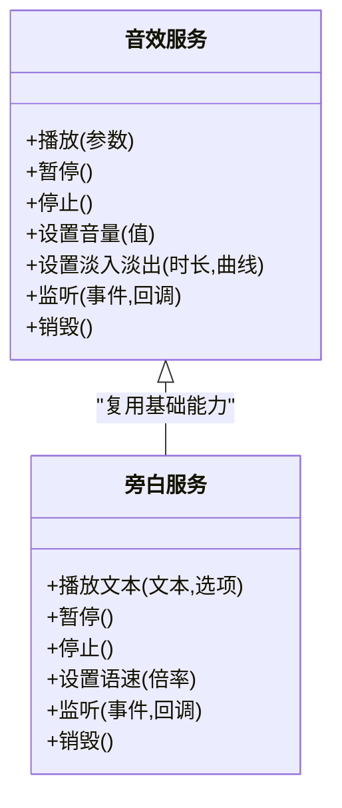
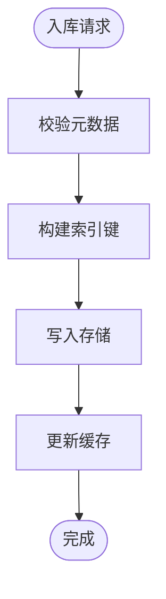
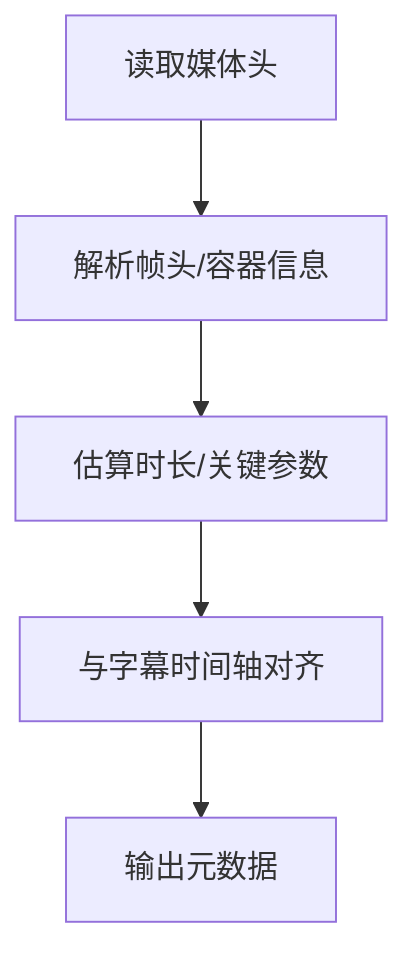
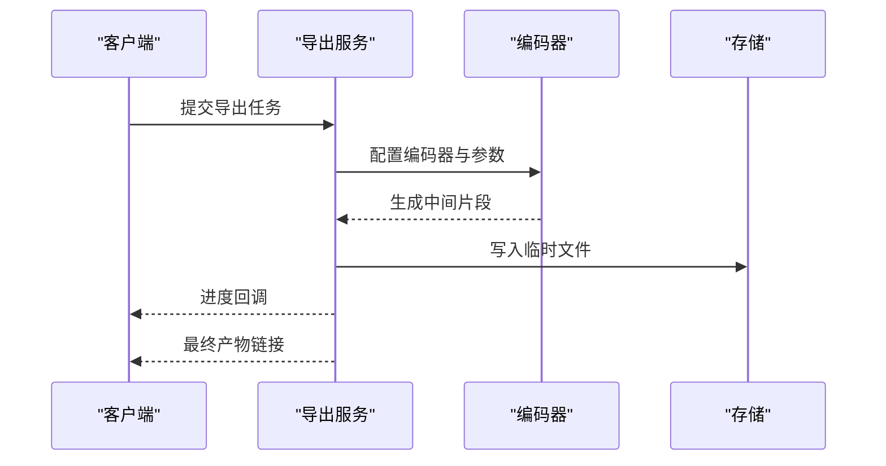
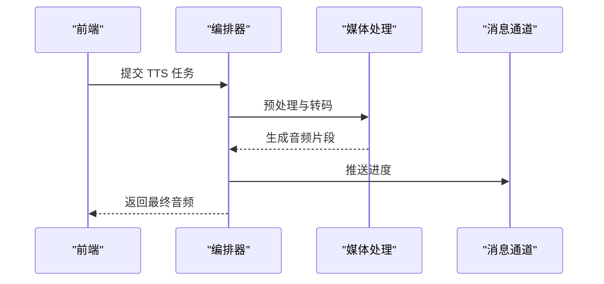
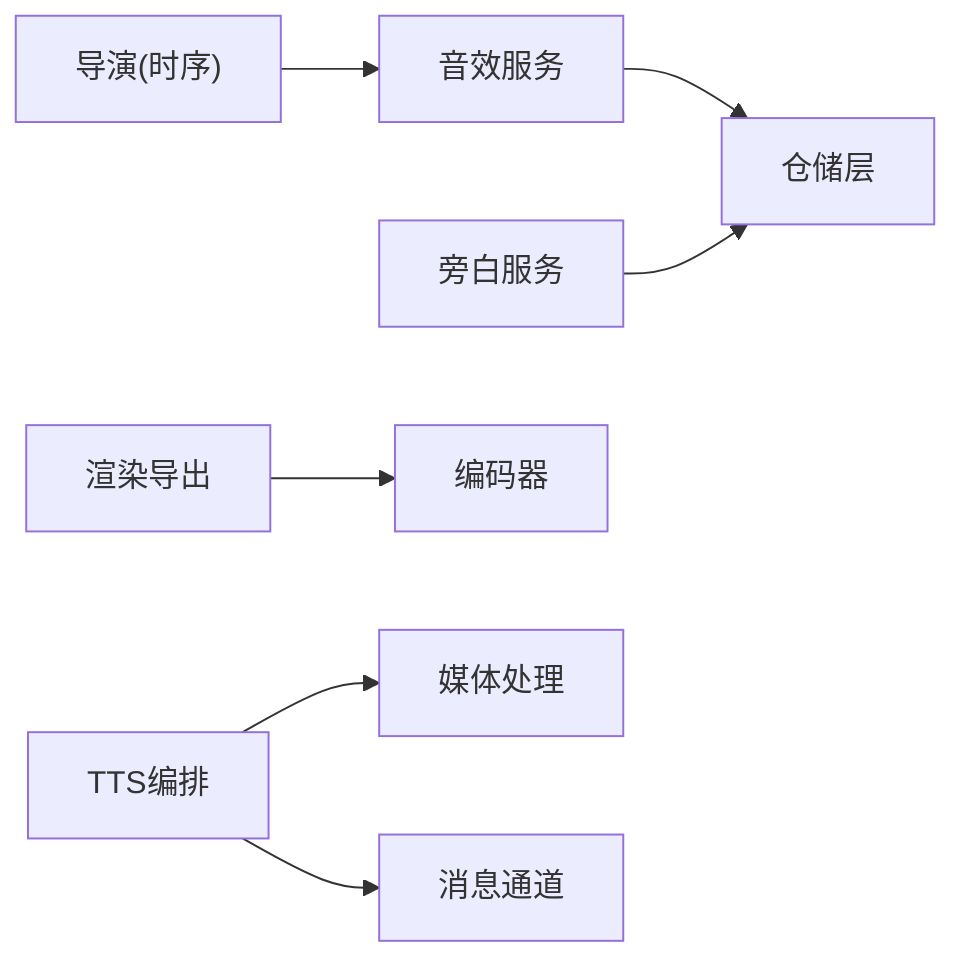

# 音效管理与合成

<cite>
**本文引用的文件**   
- [src/features/audio/index.ts](file://src/features/audio/index.ts)
- [src/features/audio/sfx.ts](file://src/features/audio/sfx.ts)
- [src/features/audio/narration.ts](file://src/features/audio/narration.ts)
- [src/features/audio/repository.ts](file://src/features/audio/repository.ts)
- [src/features/audio/runtime-repository.ts](file://src/features/audio/runtime-repository.ts)
- [src/features/audio/measure.ts](file://src/features/audio/measure.ts)
- [src/features/audio/mp3-frame-header.ts](file://src/features/audio/mp3-frame-header.ts)
- [src/features/audio/subtitle.ts](file://src/features/audio/subtitle.ts)
- [src/features/audio/types.ts](file://src/features/audio/types.ts)
- [src/features/director/audio-timing.ts](file://src/features/director/audio-timing.ts)
- [src/features/render/encode.ts](file://src/features/render/encode.ts)
- [src/features/render/export-service.ts](file://src/features/render/export-service.ts)
- [server/src/tts/orchestrate.ts](file://server/src/tts/orchestrate.ts)
- [server/src/tts/media.ts](file://server/src/tts/media.ts)
- [server/src/tts/listenhub.ts](file://server/src/tts/listenhub.ts)
</cite>

## 目录
1. [简介](#简介)
2. [项目结构](#项目结构)
3. [核心组件](#核心组件)
4. [架构总览](#架构总览)
5. [详细组件分析](#详细组件分析)
6. [依赖关系分析](#依赖关系分析)
7. [性能考量](#性能考量)
8. [故障排查指南](#故障排查指南)
9. [结论](#结论)
10. [附录](#附录)

## 简介
本技术文档面向 PurpleInK 的音效管理系统，围绕程序化音效生成、波形合成与音频效果器设计展开，覆盖音效库管理、分类组织与检索优化；阐述 WAV 处理、音频编码与解码技术；说明混音、淡入淡出与空间音频效果；解释事件触发、生命周期管理与资源清理；提供质量评估、压缩优化与流式传输方案；并涵盖版权管理、使用统计与计费集成思路。文档以仓库中现有代码为依据，结合合理的工程实践进行系统化梳理，帮助读者快速理解并扩展系统能力。

## 项目结构
本项目在前后端均包含与音频相关的模块：
- 前端功能域 features/audio：封装音效（SFX）、旁白（Narration）、度量与编解码工具、类型定义与仓储接口等。
- 导演子系统 features/director：负责时间线、节奏与音频时序对齐。
- 渲染子系统 features/render：负责导出、转码与媒体处理。
- 服务端 tts 模块：负责语音合成编排、媒体处理与消息通道。

图表来源
- [src/features/audio/index.ts](file://src/features/audio/index.ts)
- [src/features/director/audio-timing.ts](file://src/features/director/audio-timing.ts)
- [src/features/render/encode.ts](file://src/features/render/encode.ts)
- [server/src/tts/orchestrate.ts](file://server/src/tts/orchestrate.ts)

章节来源
- [src/features/audio/index.ts](file://src/features/audio/index.ts)
- [src/features/director/audio-timing.ts](file://src/features/director/audio-timing.ts)
- [src/features/render/encode.ts](file://src/features/render/encode.ts)
- [server/src/tts/orchestrate.ts](file://server/src/tts/orchestrate.ts)

## 核心组件
- 音效与旁白抽象：统一 SFX 与 Narration 的播放、暂停、停止、音量控制与生命周期管理。
- 仓储层：对本地缓存、运行时状态与持久化存储进行抽象，支持查询、索引与批量操作。
- 度量与格式工具：时长测量、MP3 帧头解析、字幕时间轴对齐等。
- 渲染与导出：音频转码、拼接、缩略图生成与导出队列。
- 服务端编排：TTS 任务编排、媒体处理与消息分发。

章节来源
- [src/features/audio/sfx.ts](file://src/features/audio/sfx.ts)
- [src/features/audio/narration.ts](file://src/features/audio/narration.ts)
- [src/features/audio/repository.ts](file://src/features/audio/repository.ts)
- [src/features/audio/runtime-repository.ts](file://src/features/audio/runtime-repository.ts)
- [src/features/audio/measure.ts](file://src/features/audio/measure.ts)
- [src/features/audio/mp3-frame-header.ts](file://src/features/audio/mp3-frame-header.ts)
- [src/features/audio/subtitle.ts](file://src/features/audio/subtitle.ts)
- [src/features/render/encode.ts](file://src/features/render/encode.ts)
- [src/features/render/export-service.ts](file://src/features/render/export-service.ts)
- [server/src/tts/orchestrate.ts](file://server/src/tts/orchestrate.ts)

## 架构总览
整体采用“前端业务域 + 后端编排”的分层架构：
- 前端 features/audio 提供统一的音效与旁白 API，内部通过仓储层访问数据源。
- features/director 负责时间线与音频时序对齐，确保多轨同步。
- features/render 负责离线或在线转码、拼接与导出。
- server/tts 负责 TTS 任务编排、媒体处理与消息通道，为前端提供异步处理能力。

图表来源
- [src/features/audio/sfx.ts](file://src/features/audio/sfx.ts)
- [src/features/audio/narration.ts](file://src/features/audio/narration.ts)
- [src/features/audio/repository.ts](file://src/features/audio/repository.ts)
- [src/features/director/audio-timing.ts](file://src/features/director/audio-timing.ts)
- [src/features/render/encode.ts](file://src/features/render/encode.ts)
- [server/src/tts/orchestrate.ts](file://server/src/tts/orchestrate.ts)

## 详细组件分析

### 音效与旁白服务（SFX/Narration）
- 职责：封装播放、暂停、停止、音量控制、淡入淡出、循环与事件回调。
- 设计要点：
  - 统一接口抽象，便于替换不同后端（浏览器 Web Audio、Node 音频库）。
  - 生命周期管理：创建、预热、播放、销毁，避免内存泄漏。
  - 事件驱动：开始、结束、错误、缓冲进度等事件通知。
  - 混音与淡入淡出：基于增益节点实现线性或指数曲线过渡。
  - 空间音频：通过立体声平衡与延迟模拟方位感（可扩展 HRTF）。

图表来源
- [src/features/audio/sfx.ts](file://src/features/audio/sfx.ts)
- [src/features/audio/narration.ts](file://src/features/audio/narration.ts)

章节来源
- [src/features/audio/sfx.ts](file://src/features/audio/sfx.ts)
- [src/features/audio/narration.ts](file://src/features/audio/narration.ts)

### 仓储层（Repository/Runtime Repository）
- 职责：抽象数据访问，提供查询、分页、过滤、排序与批量操作；运行时仓储维护会话级状态。
- 设计要点：
  - 分层：内存缓存、磁盘/对象存储、数据库索引。
  - 索引策略：按标签、类别、时长、采样率、比特率建立索引，加速检索。
  - 一致性：读写分离与缓存失效策略。
  - 事务性：批量导入/导出时的原子性与回滚。

图表来源
- [src/features/audio/repository.ts](file://src/features/audio/repository.ts)
- [src/features/audio/runtime-repository.ts](file://src/features/audio/runtime-repository.ts)

章节来源
- [src/features/audio/repository.ts](file://src/features/audio/repository.ts)
- [src/features/audio/runtime-repository.ts](file://src/features/audio/runtime-repository.ts)

### 度量与格式工具（Measure/MP3 Frame Header/Subtitle）
- 时长测量：基于容器信息或解码首帧估算时长，支持渐进式读取。
- MP3 帧头解析：提取采样率、声道数、比特率、帧长度，辅助分片与对齐。
- 字幕时间轴：将字幕事件映射到音频时间轴，用于可视化与交互。

图表来源
- [src/features/audio/measure.ts](file://src/features/audio/measure.ts)
- [src/features/audio/mp3-frame-header.ts](file://src/features/audio/mp3-frame-header.ts)
- [src/features/audio/subtitle.ts](file://src/features/audio/subtitle.ts)

章节来源
- [src/features/audio/measure.ts](file://src/features/audio/measure.ts)
- [src/features/audio/mp3-frame-header.ts](file://src/features/audio/mp3-frame-header.ts)
- [src/features/audio/subtitle.ts](file://src/features/audio/subtitle.ts)

### 渲染与导出（Encode/Export Service）
- 转码：支持多种格式（WAV/MP3/OGG），按需选择编码器与参数。
- 拼接：按时间线顺序合并片段，处理边界交叉与响度归一化。
- 导出队列：任务拆分、并发控制、失败重试与进度上报。

图表来源
- [src/features/render/encode.ts](file://src/features/render/encode.ts)
- [src/features/render/export-service.ts](file://src/features/render/export-service.ts)

章节来源
- [src/features/render/encode.ts](file://src/features/render/encode.ts)
- [src/features/render/export-service.ts](file://src/features/render/export-service.ts)

### 服务端 TTS 编排（Orchestrate/Media/ListenHub）
- 编排：接收文本与参数，调度 TTS 引擎，管理任务状态与重试。
- 媒体处理：切片、降噪、响度标准化、格式转换。
- 消息通道：WebSocket/SSE 推送进度与结果。

图表来源
- [server/src/tts/orchestrate.ts](file://server/src/tts/orchestrate.ts)
- [server/src/tts/media.ts](file://server/src/tts/media.ts)
- [server/src/tts/listenhub.ts](file://server/src/tts/listenhub.ts)

章节来源
- [server/src/tts/orchestrate.ts](file://server/src/tts/orchestrate.ts)
- [server/src/tts/media.ts](file://server/src/tts/media.ts)
- [server/src/tts/listenhub.ts](file://server/src/tts/listenhub.ts)

## 依赖关系分析
- 组件耦合：
  - 音效/旁白服务依赖仓储层获取素材与元数据。
  - 导演模块依赖时间线数据与音频时长信息。
  - 渲染模块依赖编码器与存储服务。
  - 服务端编排依赖媒体处理与消息通道。
- 外部依赖：
  - 浏览器 Web Audio API / Node 音频库（根据运行环境选择）。
  - 转码库（如 ffmpeg/wav-tools）用于格式转换与处理。
  - 存储（对象存储/文件系统）与数据库（索引与元数据）。

图表来源
- [src/features/audio/sfx.ts](file://src/features/audio/sfx.ts)
- [src/features/audio/narration.ts](file://src/features/audio/narration.ts)
- [src/features/audio/repository.ts](file://src/features/audio/repository.ts)
- [src/features/director/audio-timing.ts](file://src/features/director/audio-timing.ts)
- [src/features/render/encode.ts](file://src/features/render/encode.ts)
- [server/src/tts/orchestrate.ts](file://server/src/tts/orchestrate.ts)
- [server/src/tts/media.ts](file://server/src/tts/media.ts)
- [server/src/tts/listenhub.ts](file://server/src/tts/listenhub.ts)

章节来源
- [src/features/audio/sfx.ts](file://src/features/audio/sfx.ts)
- [src/features/audio/narration.ts](file://src/features/audio/narration.ts)
- [src/features/audio/repository.ts](file://src/features/audio/repository.ts)
- [src/features/director/audio-timing.ts](file://src/features/director/audio-timing.ts)
- [src/features/render/encode.ts](file://src/features/render/encode.ts)
- [server/src/tts/orchestrate.ts](file://server/src/tts/orchestrate.ts)

## 性能考量
- 预加载与缓存：热点素材预取与内存缓存，减少首次播放延迟。
- 分块与流式：大文件分块下载与边下边播，降低内存占用。
- 并行与批处理：转码与导入任务并行执行，合理限制并发度。
- 索引优化：复合索引与倒排索引提升检索效率。
- 资源回收：及时释放音频上下文与句柄，避免内存泄漏。

[本节为通用指导，不直接分析具体文件]

## 故障排查指南
- 常见问题定位：
  - 播放失败：检查素材路径、权限与格式兼容性。
  - 时序错乱：核对时间线对齐逻辑与采样率一致性。
  - 转码失败：查看编码器日志与输入参数合法性。
  - 内存溢出：监控峰值内存与句柄数量，优化缓存策略。
- 调试建议：
  - 启用详细日志与指标采集（时长、比特率、延迟）。
  - 使用最小复现用例与断点跟踪。
  - 回放问题片段并对比预期输出。

[本节为通用指导，不直接分析具体文件]

## 结论
PurpleInK 的音效管理系统在前端与后端形成了清晰的职责划分与协作流程。通过统一的音效/旁白抽象、稳健的仓储层、精确的时序对齐与高效的渲染导出，系统能够支撑复杂的音效合成与管理工作。建议在后续迭代中持续优化索引与缓存策略，完善质量评估与版权计费模块，进一步提升用户体验与商业价值。

[本节为总结性内容，不直接分析具体文件]

## 附录
- 术语表：
  - 音效（SFX）：短促的背景声音，用于增强交互体验。
  - 旁白（Narration）：语音合成或录制的人声解说。
  - 转码：将音频从一种格式转换为另一种格式。
  - 时序对齐：将多个音频轨道按时间线精确对齐。
- 最佳实践：
  - 统一元数据模型，便于检索与分析。
  - 使用流式处理降低内存压力。
  - 引入质量评估指标（响度、失真、动态范围）。
  - 建立版权标记与使用审计机制。

[本节为补充信息，不直接分析具体文件]