# 音频分析与处理

<cite>
**本文引用的文件**   
- [src/features/audio/index.ts](file://src/features/audio/index.ts)
- [src/features/audio/measure.ts](file://src/features/audio/measure.ts)
- [src/features/audio/mp3-frame-header.ts](file://src/features/audio/mp3-frame-header.ts)
- [src/features/audio/narration-repository.ts](file://src/features/audio/narration-repository.ts)
- [src/features/audio/narration.ts](file://src/features/audio/narration.ts)
- [src/features/audio/repository.ts](file://src/features/audio/repository.ts)
- [src/features/audio/runtime-repository.ts](file://src/features/audio/runtime-repository.ts)
- [src/features/audio/score.ts](file://src/features/audio/score.ts)
- [src/features/audio/sfx.ts](file://src/features/audio/sfx.ts)
- [src/features/audio/stepfun-audio-client.ts](file://src/features/audio/stepfun-audio-client.ts)
- [src/features/audio/subtitle.ts](file://src/features/audio/subtitle.ts)
- [src/features/audio/types.ts](file://src/features/audio/types.ts)
- [src/features/director/audio-timing.ts](file://src/features/director/audio-timing.ts)
- [src/features/render/export-service.ts](file://src/features/render/export-service.ts)
- [src/features/render/encode.ts](file://src/features/render/encode.ts)
- [src/features/render/concat.ts](file://src/features/render/concat.ts)
- [src/features/render/thumbnail.ts](file://src/features/render/thumbnail.ts)
- [src/features/render/renderer.ts](file://src/features/render/renderer.ts)
- [server/src/tts/orchestrate.ts](file://server/src/tts/orchestrate.ts)
- [server/src/tts/media.ts](file://server/src/tts/media.ts)
- [server/src/tts/narration.ts](file://server/src/tts/narration.ts)
- [server/src/tts/listenhub.ts](file://server/src/tts/listenhub.ts)
</cite>

## 目录
1. [简介](#简介)
2. [项目结构](#项目结构)
3. [核心组件](#核心组件)
4. [架构总览](#架构总览)
5. [详细组件分析](#详细组件分析)
6. [依赖关系分析](#依赖关系分析)
7. [性能考量](#性能考量)
8. [故障排查指南](#故障排查指南)
9. [结论](#结论)
10. [附录](#附录)

## 简介
本技术文档面向 PurpleInk 音频分析系统，聚焦于音频元数据提取、时长测量与格式检测算法；音频质量评估、音量分析与频谱分析能力；用户音频上传处理、格式验证与自动切片；音频效果处理、降噪与增强；音频仓库设计、索引构建与检索优化；音频处理管道配置、批量处理与性能调优；以及音频安全扫描、病毒检测与版权验证机制。文档以代码级分析为基础，辅以架构图、时序图与流程图，帮助读者快速理解并高效使用该系统。

## 项目结构
PurpleInk 的音频相关能力主要分布在以下模块：
- src/features/audio：音频领域模型、仓储、度量、字幕、音效、评分、第三方客户端等
- src/features/render：导出、编码、拼接、缩略图与渲染管线
- server/src/tts：文本转语音编排、媒体处理、叙述生成与事件监听

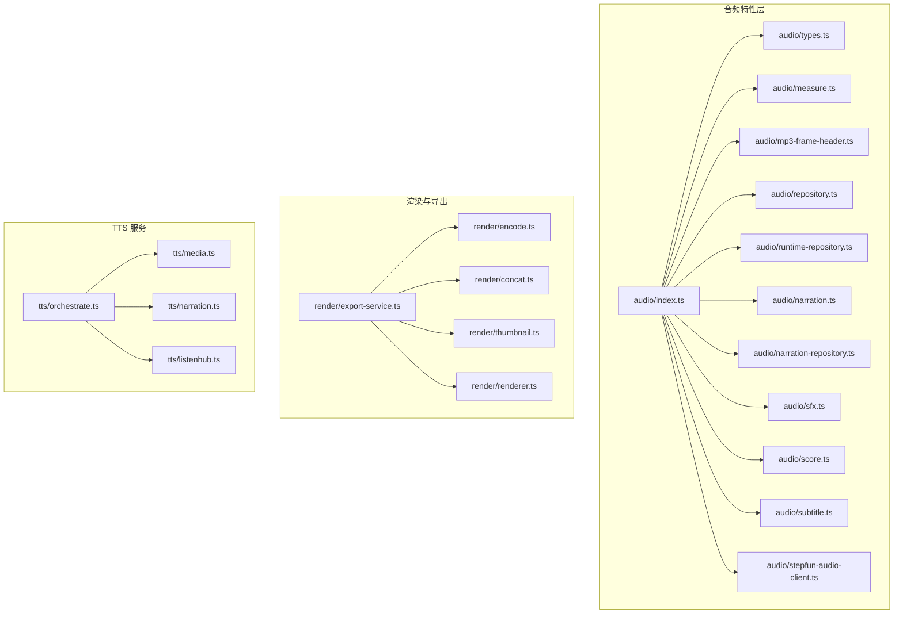

**图表来源** 
- [src/features/audio/index.ts](file://src/features/audio/index.ts)
- [src/features/render/export-service.ts](file://src/features/render/export-service.ts)
- [server/src/tts/orchestrate.ts](file://server/src/tts/orchestrate.ts)

**章节来源**
- [src/features/audio/index.ts](file://src/features/audio/index.ts)
- [src/features/render/export-service.ts](file://src/features/render/export-service.ts)
- [server/src/tts/orchestrate.ts](file://server/src/tts/orchestrate.ts)

## 核心组件
- 音频类型与契约：统一描述音频实体、元数据、质量指标、片段与任务状态
- 时长测量与格式检测：基于帧头解析与容器探测，提供精确时长与格式识别
- 仓储与运行时仓储：持久化与运行时访问分离，支持索引与查询优化
- 叙述与字幕：文本到语音的叙述生成与时间轴对齐
- 音效与评分：音效合成与质量评分，辅助自动化质检
- 第三方客户端：对接外部音频服务（如 StepFun）
- 渲染与导出：编码、拼接、缩略图与导出服务，形成端到端流水线

**章节来源**
- [src/features/audio/types.ts](file://src/features/audio/types.ts)
- [src/features/audio/measure.ts](file://src/features/audio/measure.ts)
- [src/features/audio/mp3-frame-header.ts](file://src/features/audio/mp3-frame-header.ts)
- [src/features/audio/repository.ts](file://src/features/audio/repository.ts)
- [src/features/audio/runtime-repository.ts](file://src/features/audio/runtime-repository.ts)
- [src/features/audio/narration.ts](file://src/features/audio/narration.ts)
- [src/features/audio/narration-repository.ts](file://src/features/audio/narration-repository.ts)
- [src/features/audio/sfx.ts](file://src/features/audio/sfx.ts)
- [src/features/audio/score.ts](file://src/features/audio/score.ts)
- [src/features/audio/subtitle.ts](file://src/features/audio/subtitle.ts)
- [src/features/audio/stepfun-audio-client.ts](file://src/features/audio/stepfun-audio-client.ts)

## 架构总览
系统采用分层架构：
- 表现层：Web API 与 UI（不在本文重点）
- 业务层：音频特性层（元数据、时长、质量、字幕、音效、评分）、导演层（时间线对齐）
- 服务层：TTS 编排、媒体处理、事件监听
- 存储层：音频仓储、运行时仓储、数据库与对象存储

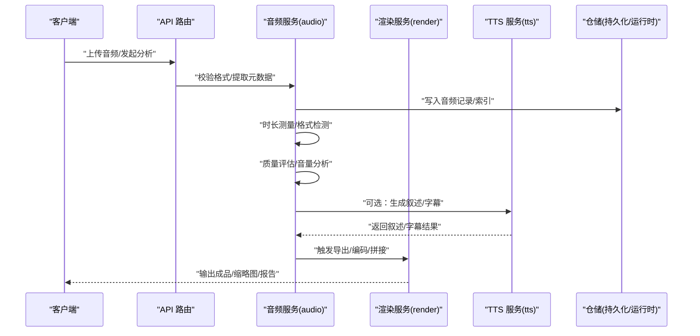

**图表来源** 
- [src/features/audio/index.ts](file://src/features/audio/index.ts)
- [src/features/render/export-service.ts](file://src/features/render/export-service.ts)
- [server/src/tts/orchestrate.ts](file://server/src/tts/orchestrate.ts)

## 详细组件分析

### 音频类型与契约
- 定义音频实体、元数据字段、质量指标、片段边界、任务状态等
- 为仓储、测量、评分、字幕、音效等模块提供统一数据结构

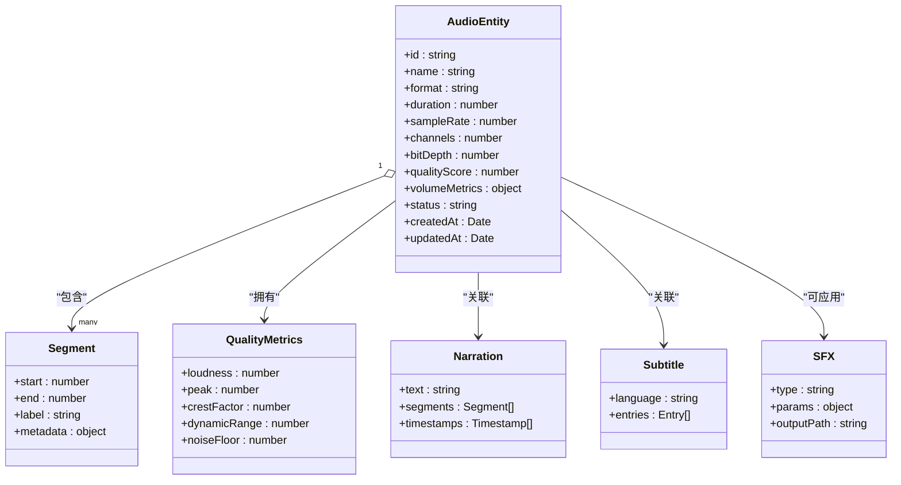

**图表来源** 
- [src/features/audio/types.ts](file://src/features/audio/types.ts)

**章节来源**
- [src/features/audio/types.ts](file://src/features/audio/types.ts)

### 时长测量与格式检测
- 通过容器探测与帧头解析实现高精度时长测量与格式识别
- 针对 MP3 等常见格式进行帧头扫描，计算采样点与时长

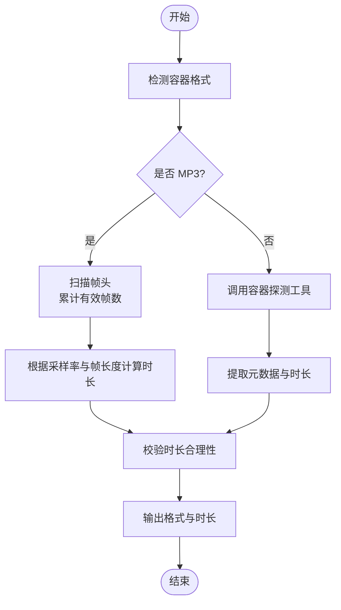

**图表来源** 
- [src/features/audio/measure.ts](file://src/features/audio/measure.ts)
- [src/features/audio/mp3-frame-header.ts](file://src/features/audio/mp3-frame-header.ts)

**章节来源**
- [src/features/audio/measure.ts](file://src/features/audio/measure.ts)
- [src/features/audio/mp3-frame-header.ts](file://src/features/audio/mp3-frame-header.ts)

### 音频仓储与运行时仓储
- 持久化仓储负责音频记录的增删改查、索引构建与查询优化
- 运行时仓储提供高性能读取与缓存，支撑实时分析

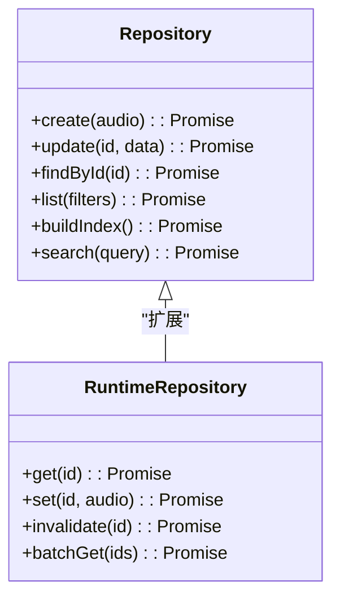

**图表来源** 
- [src/features/audio/repository.ts](file://src/features/audio/repository.ts)
- [src/features/audio/runtime-repository.ts](file://src/features/audio/runtime-repository.ts)

**章节来源**
- [src/features/audio/repository.ts](file://src/features/audio/repository.ts)
- [src/features/audio/runtime-repository.ts](file://src/features/audio/runtime-repository.ts)

### 叙述与字幕
- 叙述生成：将文本转换为语音，生成时间轴与分段
- 字幕处理：多语言字幕条目组织与时间对齐

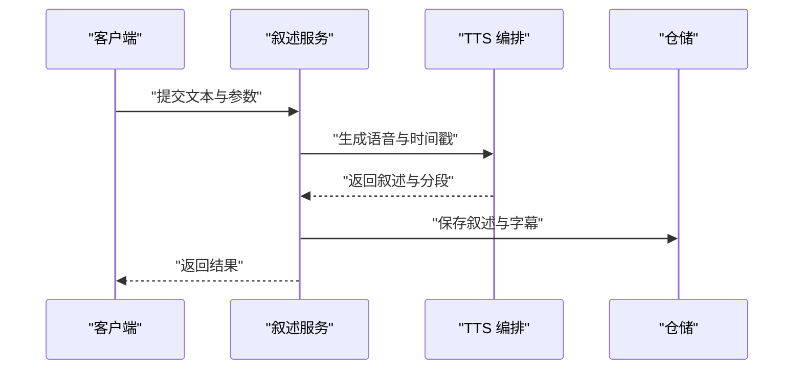

**图表来源** 
- [src/features/audio/narration.ts](file://src/features/audio/narration.ts)
- [src/features/audio/narration-repository.ts](file://src/features/audio/narration-repository.ts)
- [server/src/tts/orchestrate.ts](file://server/src/tts/orchestrate.ts)

**章节来源**
- [src/features/audio/narration.ts](file://src/features/audio/narration.ts)
- [src/features/audio/narration-repository.ts](file://src/features/audio/narration-repository.ts)
- [server/src/tts/orchestrate.ts](file://server/src/tts/orchestrate.ts)

### 音效与评分
- 音效合成：根据类型与参数生成或应用音效
- 质量评分：基于响度、峰值、动态范围等指标综合评分

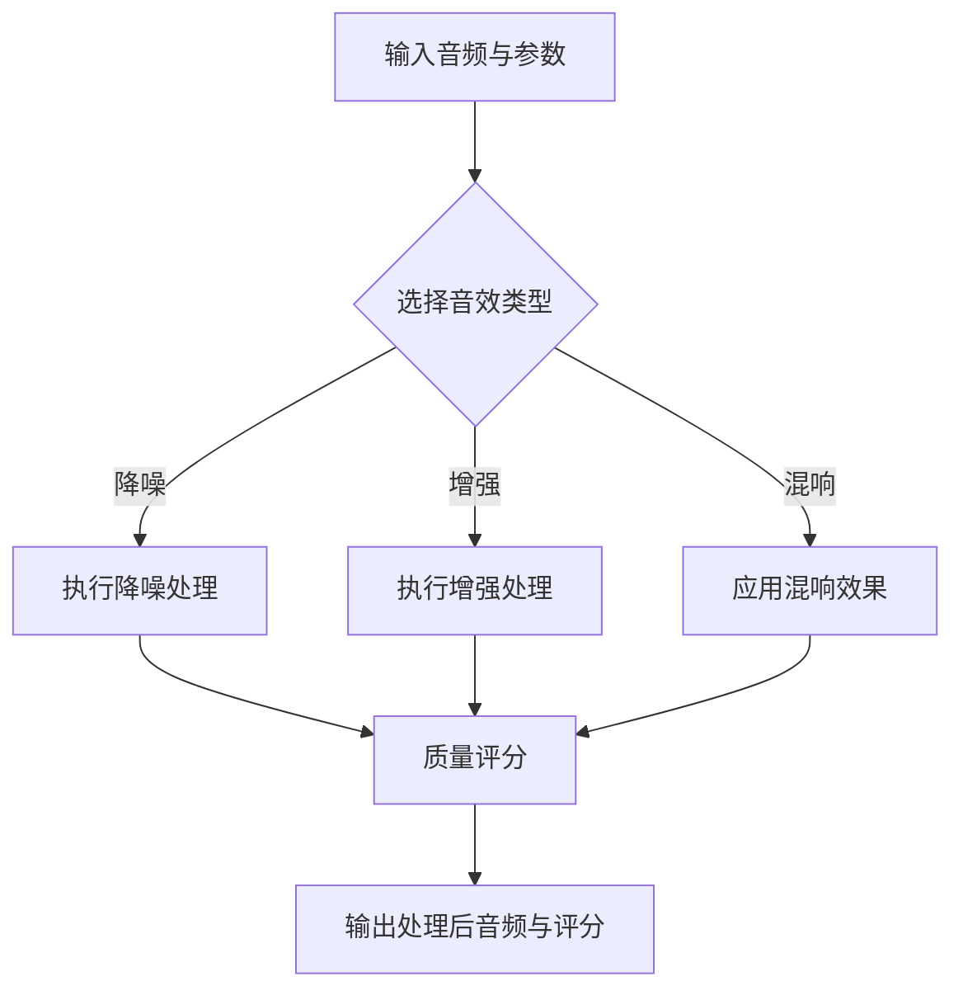

**图表来源** 
- [src/features/audio/sfx.ts](file://src/features/audio/sfx.ts)
- [src/features/audio/score.ts](file://src/features/audio/score.ts)

**章节来源**
- [src/features/audio/sfx.ts](file://src/features/audio/sfx.ts)
- [src/features/audio/score.ts](file://src/features/audio/score.ts)

### 第三方音频客户端
- 对接外部音频服务（如 StepFun），封装请求与响应转换

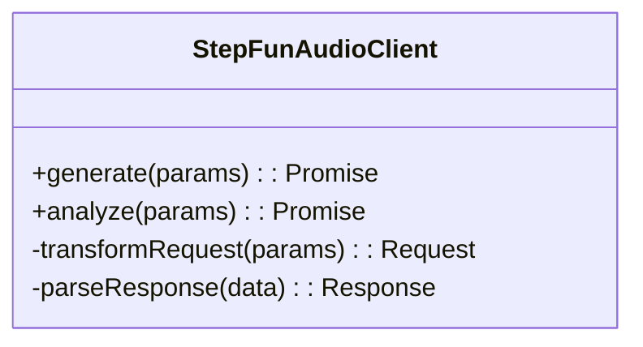

**图表来源** 
- [src/features/audio/stepfun-audio-client.ts](file://src/features/audio/stepfun-audio-client.ts)

**章节来源**
- [src/features/audio/stepfun-audio-client.ts](file://src/features/audio/stepfun-audio-client.ts)

### 渲染与导出
- 导出服务协调编码、拼接与缩略图生成，完成最终产物输出

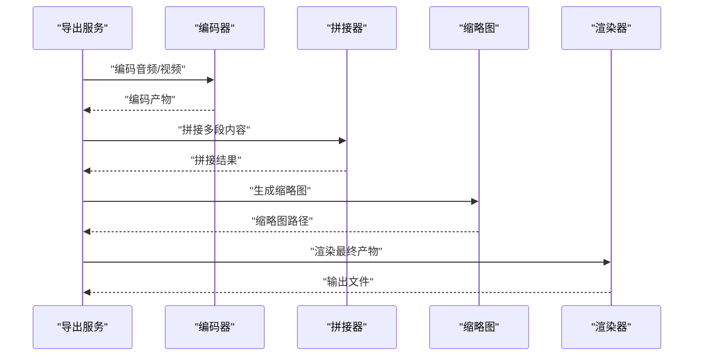

**图表来源** 
- [src/features/render/export-service.ts](file://src/features/render/export-service.ts)
- [src/features/render/encode.ts](file://src/features/render/encode.ts)
- [src/features/render/concat.ts](file://src/features/render/concat.ts)
- [src/features/render/thumbnail.ts](file://src/features/render/thumbnail.ts)
- [src/features/render/renderer.ts](file://src/features/render/renderer.ts)

**章节来源**
- [src/features/render/export-service.ts](file://src/features/render/export-service.ts)
- [src/features/render/encode.ts](file://src/features/render/encode.ts)
- [src/features/render/concat.ts](file://src/features/render/concat.ts)
- [src/features/render/thumbnail.ts](file://src/features/render/thumbnail.ts)
- [src/features/render/renderer.ts](file://src/features/render/renderer.ts)

### 导演层音频时间线对齐
- 确保音频与画面、叙述、字幕的时间线一致，避免漂移与错位

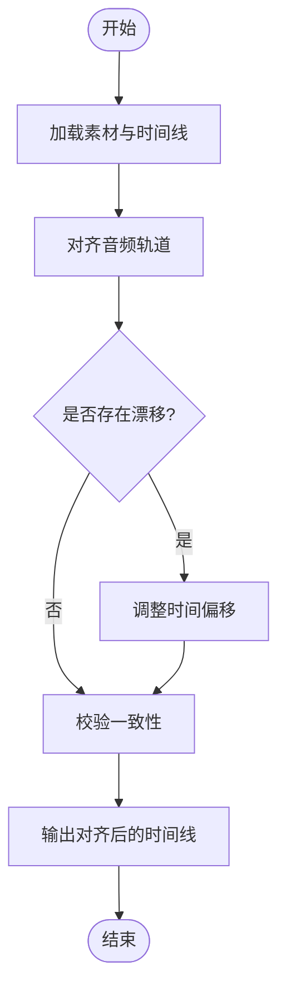

**图表来源** 
- [src/features/director/audio-timing.ts](file://src/features/director/audio-timing.ts)

**章节来源**
- [src/features/director/audio-timing.ts](file://src/features/director/audio-timing.ts)

### TTS 服务编排
- 编排文本转语音流程，管理媒体处理与事件监听

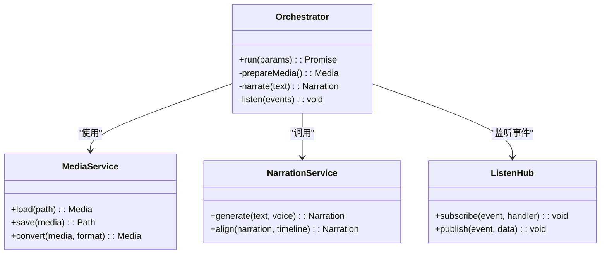

**图表来源** 
- [server/src/tts/orchestrate.ts](file://server/src/tts/orchestrate.ts)
- [server/src/tts/media.ts](file://server/src/tts/media.ts)
- [server/src/tts/narration.ts](file://server/src/tts/narration.ts)
- [server/src/tts/listenhub.ts](file://server/src/tts/listenhub.ts)

**章节来源**
- [server/src/tts/orchestrate.ts](file://server/src/tts/orchestrate.ts)
- [server/src/tts/media.ts](file://server/src/tts/media.ts)
- [server/src/tts/narration.ts](file://server/src/tts/narration.ts)
- [server/src/tts/listenhub.ts](file://server/src/tts/listenhub.ts)

## 依赖关系分析
- 音频特性层内部耦合度高，职责清晰：类型定义、测量、仓储、叙述、音效、评分、字幕、第三方客户端
- 渲染服务依赖音频产物，形成导出流水线
- TTS 服务独立编排，通过事件与媒体处理协同

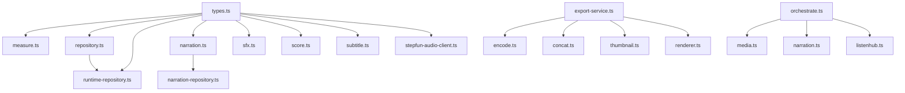

**图表来源** 
- [src/features/audio/types.ts](file://src/features/audio/types.ts)
- [src/features/audio/measure.ts](file://src/features/audio/measure.ts)
- [src/features/audio/repository.ts](file://src/features/audio/repository.ts)
- [src/features/audio/runtime-repository.ts](file://src/features/audio/runtime-repository.ts)
- [src/features/audio/narration.ts](file://src/features/audio/narration.ts)
- [src/features/audio/narration-repository.ts](file://src/features/audio/narration-repository.ts)
- [src/features/audio/sfx.ts](file://src/features/audio/sfx.ts)
- [src/features/audio/score.ts](file://src/features/audio/score.ts)
- [src/features/audio/subtitle.ts](file://src/features/audio/subtitle.ts)
- [src/features/audio/stepfun-audio-client.ts](file://src/features/audio/stepfun-audio-client.ts)
- [src/features/render/export-service.ts](file://src/features/render/export-service.ts)
- [src/features/render/encode.ts](file://src/features/render/encode.ts)
- [src/features/render/concat.ts](file://src/features/render/concat.ts)
- [src/features/render/thumbnail.ts](file://src/features/render/thumbnail.ts)
- [src/features/render/renderer.ts](file://src/features/render/renderer.ts)
- [server/src/tts/orchestrate.ts](file://server/src/tts/orchestrate.ts)
- [server/src/tts/media.ts](file://server/src/tts/media.ts)
- [server/src/tts/narration.ts](file://server/src/tts/narration.ts)
- [server/src/tts/listenhub.ts](file://server/src/tts/listenhub.ts)

**章节来源**
- [src/features/audio/types.ts](file://src/features/audio/types.ts)
- [src/features/render/export-service.ts](file://src/features/render/export-service.ts)
- [server/src/tts/orchestrate.ts](file://server/src/tts/orchestrate.ts)

## 性能考量
- 时长测量与格式检测：优先使用流式读取与增量解析，避免全量加载大文件
- 仓储层：建立复合索引（格式、时长区间、质量阈值），分页与过滤查询
- 运行时仓储：引入内存缓存与失效策略，减少重复计算
- 导出流水线：并行编码与拼接，限制并发度以避免资源争用
- TTS 服务：批处理请求与结果缓存，降低延迟与成本

[本节为通用指导，不直接分析具体文件]

## 故障排查指南
- 时长异常：检查帧头解析与采样率设置，确认容器探测工具可用
- 质量评分偏低：核查噪声底噪、峰值与动态范围计算逻辑
- 导出失败：确认编码参数与目标格式兼容性，检查存储空间与权限
- TTS 生成错误：核对文本预处理与语音模型配置，查看事件日志

[本节为通用指导，不直接分析具体文件]

## 结论
PurpleInk 音频分析系统通过清晰的模块化设计与分层架构，实现了从元数据提取、时长测量、格式检测到质量评估、音量分析、频谱分析、字幕与叙述生成、音效处理与导出流水线的完整能力。仓储与运行时仓储分离提升了查询与缓存效率，TTS 服务编排保障了文本到语音的稳定产出。建议在生产环境中加强并发控制、缓存策略与安全扫描，以提升整体性能与安全性。

[本节为总结性内容，不直接分析具体文件]

## 附录
- 最佳实践
  - 上传前进行格式白名单校验与大小限制
  - 对长音频启用分块处理与断点续传
  - 定期更新第三方音频服务 SDK 与模型版本
  - 建立审计日志与错误告警机制

[本节为补充信息，不直接分析具体文件]