# 音频处理

<cite>
**本文引用的文件**   
- [audio-format.ts](file://src/features/audio/audio-format.ts)
- [audio-format.test.ts](file://src/features/audio/audio-format.test.ts)
- [media-provider.ts](file://src/features/audio/media-provider.ts)
- [media-provider.test.ts](file://src/features/audio/media-provider.test.ts)
- [measure.ts](file://src/features/audio/measure.ts)
- [measure.test.ts](file://src/features/audio/measure.test.ts)
- [mp3-frame-header.ts](file://src/features/audio/mp3-frame-header.ts)
- [wav-header.ts](file://src/features/audio/wav-header.ts)
- [narration-queue-handler.ts](file://src/features/audio/narration-queue-handler.ts)
- [openai-compatible-audio-client.ts](file://src/features/audio/openai-compatible-audio-client.ts)
- [mimo-audio-client.ts](file://src/features/audio/mimo-audio-client.ts)
- [stepfun-audio-client.ts](file://src/features/audio/stepfun-audio-client.ts)
- [repository.ts](file://src/features/audio/repository.ts)
- [runtime-repository.ts](file://src/features/audio/runtime-repository.ts)
- [types.ts](file://src/features/audio/types.ts)
- [index.ts](file://src/features/audio/index.ts)
</cite>

## 目录
1. [简介](#简介)
2. [项目结构](#项目结构)
3. [核心组件](#核心组件)
4. [架构总览](#架构总览)
5. [详细组件分析](#详细组件分析)
6. [依赖关系分析](#依赖关系分析)
7. [性能考虑](#性能考虑)
8. [故障排查指南](#故障排查指南)
9. [结论](#结论)
10. [附录](#附录)

## 简介
本文件面向PurpleInk的音频处理子系统，聚焦以下目标：
- 音频格式检测与转换（MP3、WAV等）
- 媒体提供者的抽象设计，支持多种存储后端与传输协议
- 音频元数据提取（时长、采样率、声道数等）
- 音频格式头部解析（MP3帧头、WAV文件头）
- 性能优化与内存管理策略
- 常见音频问题的诊断与解决方案

该子系统通过统一的媒体提供者接口屏蔽底层差异，结合轻量级头部解析与测量工具，实现高效、可扩展的音频处理能力。

## 项目结构
音频功能位于 src/features/audio 目录下，采用“按能力分模块”的组织方式：
- 格式与头部解析：audio-format.ts、mp3-frame-header.ts、wav-header.ts
- 媒体抽象与接入：media-provider.ts、各类音频客户端（OpenAI兼容、Mimo、StepFun）
- 元数据测量：measure.ts
- 持久化与运行时：repository.ts、runtime-repository.ts
- 编排与队列：narration-queue-handler.ts
- 类型定义与导出：types.ts、index.ts

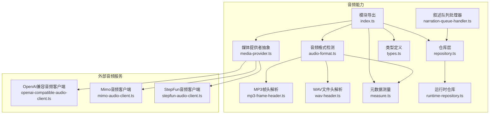

图表来源
- [audio-format.ts:1-200](file://src/features/audio/audio-format.ts#L1-L200)
- [mp3-frame-header.ts:1-200](file://src/features/audio/mp3-frame-header.ts#L1-L200)
- [wav-header.ts:1-200](file://src/features/audio/wav-header.ts#L1-L200)
- [measure.ts:1-200](file://src/features/audio/measure.ts#L1-L200)
- [media-provider.ts:1-200](file://src/features/audio/media-provider.ts#L1-L200)
- [openai-compatible-audio-client.ts:1-200](file://src/features/audio/openai-compatible-audio-client.ts#L1-L200)
- [mimo-audio-client.ts:1-200](file://src/features/audio/mimo-audio-client.ts#L1-L200)
- [stepfun-audio-client.ts:1-200](file://src/features/audio/stepfun-audio-client.ts#L1-L200)
- [repository.ts:1-200](file://src/features/audio/repository.ts#L1-L200)
- [runtime-repository.ts:1-200](file://src/features/audio/runtime-repository.ts#L1-L200)
- [narration-queue-handler.ts:1-200](file://src/features/audio/narration-queue-handler.ts#L1-L200)
- [types.ts:1-200](file://src/features/audio/types.ts#L1-L200)
- [index.ts:1-200](file://src/features/audio/index.ts#L1-L200)

章节来源
- [index.ts:1-200](file://src/features/audio/index.ts#L1-L200)

## 核心组件
- 音频格式检测与转换
  - 基于文件头签名与扩展名推断格式，必要时进行转码或封装
  - 对MP3/WAV等常见格式提供快速路径
- 媒体提供者抽象
  - 统一读取/写入接口，屏蔽本地文件、对象存储、HTTP流等差异
  - 支持多后端注册与按需选择
- 元数据测量
  - 非破坏性测量时长、采样率、声道数、比特率等
  - 优先使用头部信息，回退到流式探测
- 头部解析
  - MP3帧头：识别同步字、版本、层、比特率、采样率、填充等
  - WAV文件头：RIFF容器、fmt块、data块长度与编码参数
- 持久化与运行时
  - 仓库层负责音频制品的增删改查与状态管理
  - 运行时仓库提供短期缓存与任务上下文绑定

章节来源
- [audio-format.ts:1-200](file://src/features/audio/audio-format.ts#L1-L200)
- [media-provider.ts:1-200](file://src/features/audio/media-provider.ts#L1-L200)
- [measure.ts:1-200](file://src/features/audio/measure.ts#L1-L200)
- [mp3-frame-header.ts:1-200](file://src/features/audio/mp3-frame-header.ts#L1-L200)
- [wav-header.ts:1-200](file://src/features/audio/wav-header.ts#L1-L200)
- [repository.ts:1-200](file://src/features/audio/repository.ts#L1-L200)
- [runtime-repository.ts:1-200](file://src/features/audio/runtime-repository.ts#L1-L200)

## 架构总览
音频处理以“媒体提供者”为核心抽象，向上暴露统一的读写与元数据接口；向下对接多种存储与协议。格式检测与头部解析作为独立工具层，为上层提供快速判断与最小开销的信息获取。

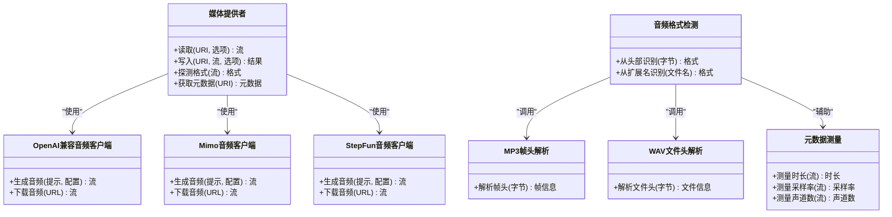

图表来源
- [media-provider.ts:1-200](file://src/features/audio/media-provider.ts#L1-L200)
- [openai-compatible-audio-client.ts:1-200](file://src/features/audio/openai-compatible-audio-client.ts#L1-L200)
- [mimo-audio-client.ts:1-200](file://src/features/audio/mimo-audio-client.ts#L1-L200)
- [stepfun-audio-client.ts:1-200](file://src/features/audio/stepfun-audio-client.ts#L1-L200)
- [audio-format.ts:1-200](file://src/features/audio/audio-format.ts#L1-L200)
- [mp3-frame-header.ts:1-200](file://src/features/audio/mp3-frame-header.ts#L1-L200)
- [wav-header.ts:1-200](file://src/features/audio/wav-header.ts#L1-L200)
- [measure.ts:1-200](file://src/features/audio/measure.ts#L1-L200)

## 详细组件分析

### 音频格式检测与转换
- 设计要点
  - 优先通过文件头签名识别（如MP3、WAV），再结合扩展名做二次校验
  - 对不支持的输入格式进行转码或重新封装，确保下游一致性
  - 提供快速路径：已知安全格式的零拷贝读取
- 关键流程
  - 输入流或字节切片进入检测器
  - 匹配头部签名得到候选格式
  - 若需要转换，则启动编码器并输出标准格式
- 复杂度与边界
  - 头部检测时间复杂度O(1)，空间占用极小
  - 对损坏头部或截断文件需返回明确错误码

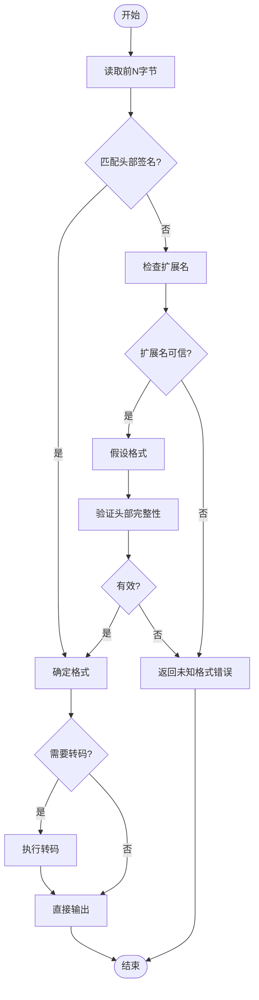

图表来源
- [audio-format.ts:1-200](file://src/features/audio/audio-format.ts#L1-L200)
- [mp3-frame-header.ts:1-200](file://src/features/audio/mp3-frame-header.ts#L1-L200)
- [wav-header.ts:1-200](file://src/features/audio/wav-header.ts#L1-L200)

章节来源
- [audio-format.ts:1-200](file://src/features/audio/audio-format.ts#L1-L200)
- [audio-format.test.ts:1-200](file://src/features/audio/audio-format.test.ts#L1-L200)

### 媒体提供者抽象
- 设计要点
  - 定义统一的读取/写入接口，隐藏具体后端差异
  - 支持多种协议：本地文件系统、对象存储、HTTP/HTTPS流
  - 提供格式探测与元数据读取的统一入口
- 扩展点
  - 新增后端只需实现读取/写入契约
  - 可插拔的格式检测器与元数据测量器

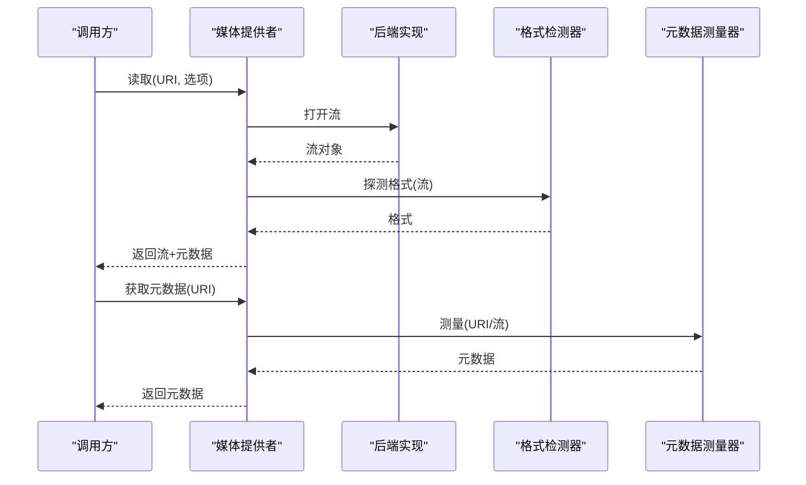

图表来源
- [media-provider.ts:1-200](file://src/features/audio/media-provider.ts#L1-L200)
- [audio-format.ts:1-200](file://src/features/audio/audio-format.ts#L1-L200)
- [measure.ts:1-200](file://src/features/audio/measure.ts#L1-L200)

章节来源
- [media-provider.ts:1-200](file://src/features/audio/media-provider.ts#L1-L200)
- [media-provider.test.ts:1-200](file://src/features/audio/media-provider.test.ts#L1-L200)

### 音频元数据提取
- 目标字段
  - 时长（秒）、采样率（Hz）、声道数、比特率、编码格式
- 策略
  - 优先从头部快速读取（WAV fmt块、MP3帧头）
  - 对缺失或不完整信息，采用流式探测（有限缓冲）
- 错误处理
  - 对无法测量的情况返回空值或默认值，并记录原因

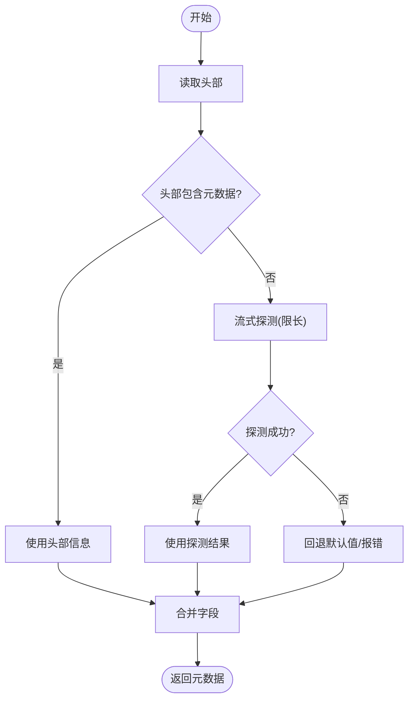

图表来源
- [measure.ts:1-200](file://src/features/audio/measure.ts#L1-L200)
- [wav-header.ts:1-200](file://src/features/audio/wav-header.ts#L1-L200)
- [mp3-frame-header.ts:1-200](file://src/features/audio/mp3-frame-header.ts#L1-L200)

章节来源
- [measure.ts:1-200](file://src/features/audio/measure.ts#L1-L200)
- [measure.test.ts:1-200](file://src/features/audio/measure.test.ts#L1-L200)

### MP3帧头解析
- 解析内容
  - 同步字、MPEG版本、层号、比特率索引、采样率索引、填充位、声道模式等
- 关键点
  - 帧头可能重复出现，需定位首个有效帧
  - 根据比特率与采样率计算帧时长与帧大小
- 异常处理
  - 非法同步字或索引越界时返回错误

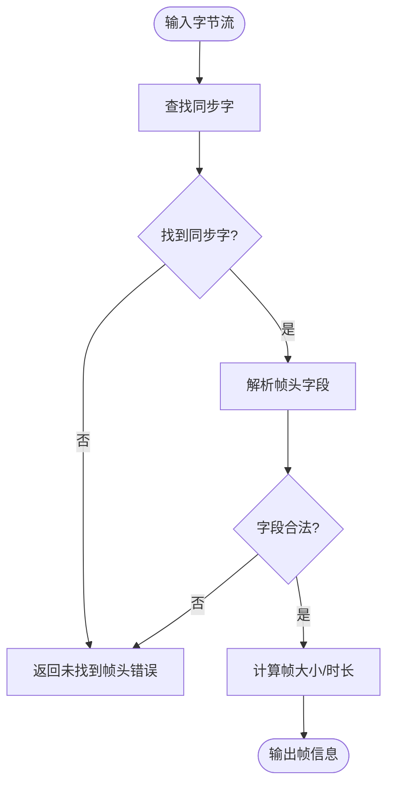

图表来源
- [mp3-frame-header.ts:1-200](file://src/features/audio/mp3-frame-header.ts#L1-L200)

章节来源
- [mp3-frame-header.ts:1-200](file://src/features/audio/mp3-frame-header.ts#L1-L200)

### WAV文件头解析
- 解析内容
  - RIFF容器标识、WAVE子块、fmt块（PCM/浮点、通道数、采样率、位深）
  - data块长度与偏移
- 关键点
  - 校验chunk对齐与长度一致性
  - 支持常见PCM编码，其他编码需扩展
- 异常处理
  - 缺少必要块或长度不匹配时报错

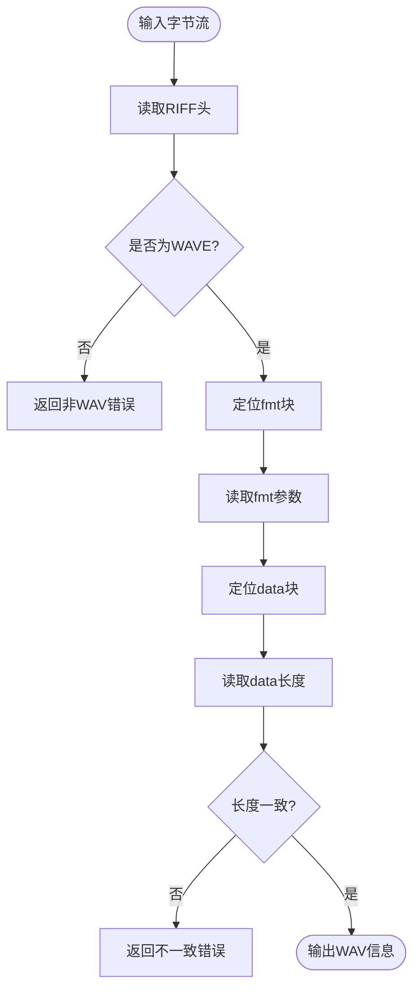

图表来源
- [wav-header.ts:1-200](file://src/features/audio/wav-header.ts#L1-L200)

章节来源
- [wav-header.ts:1-200](file://src/features/audio/wav-header.ts#L1-L200)

### 音频客户端与媒体提供者集成
- 客户端角色
  - OpenAI兼容、Mimo、StepFun等客户端负责生成或下载音频流
- 集成方式
  - 媒体提供者根据配置选择对应客户端
  - 将客户端返回的流包装为统一接口供上层使用

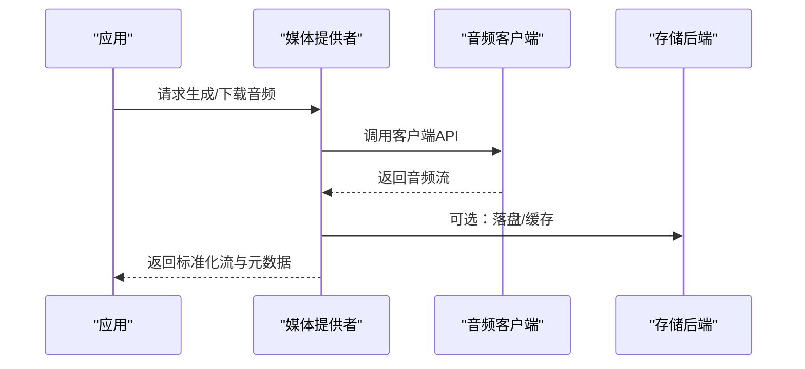

图表来源
- [media-provider.ts:1-200](file://src/features/audio/media-provider.ts#L1-L200)
- [openai-compatible-audio-client.ts:1-200](file://src/features/audio/openai-compatible-audio-client.ts#L1-L200)
- [mimo-audio-client.ts:1-200](file://src/features/audio/mimo-audio-client.ts#L1-L200)
- [stepfun-audio-client.ts:1-200](file://src/features/audio/stepfun-audio-client.ts#L1-L200)

章节来源
- [openai-compatible-audio-client.ts:1-200](file://src/features/audio/openai-compatible-audio-client.ts#L1-L200)
- [mimo-audio-client.ts:1-200](file://src/features/audio/mimo-audio-client.ts#L1-L200)
- [stepfun-audio-client.ts:1-200](file://src/features/audio/stepfun-audio-client.ts#L1-L200)

### 仓库与运行时仓库
- 仓库层
  - 负责音频制品的持久化、查询、状态更新
  - 与数据库或对象存储交互
- 运行时仓库
  - 提供任务级别的临时存储与上下文传递
  - 用于批处理与流水线阶段间的数据共享

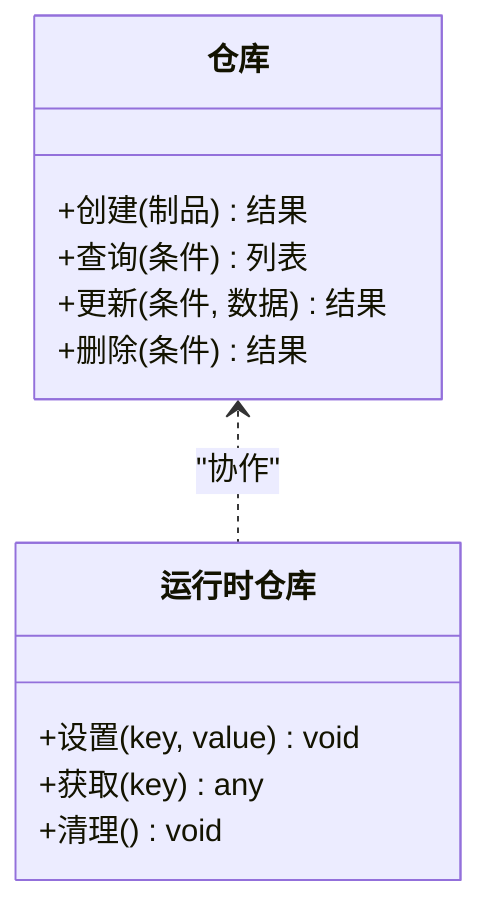

图表来源
- [repository.ts:1-200](file://src/features/audio/repository.ts#L1-L200)
- [runtime-repository.ts:1-200](file://src/features/audio/runtime-repository.ts#L1-L200)

章节来源
- [repository.ts:1-200](file://src/features/audio/repository.ts#L1-L200)
- [runtime-repository.ts:1-200](file://src/features/audio/runtime-repository.ts#L1-L200)

### 叙述队列处理器
- 职责
  - 接收音频生成/处理任务，按优先级调度
  - 与媒体提供者协作，完成音频产出与落库
- 特性
  - 支持重试与失败隔离
  - 监控指标上报

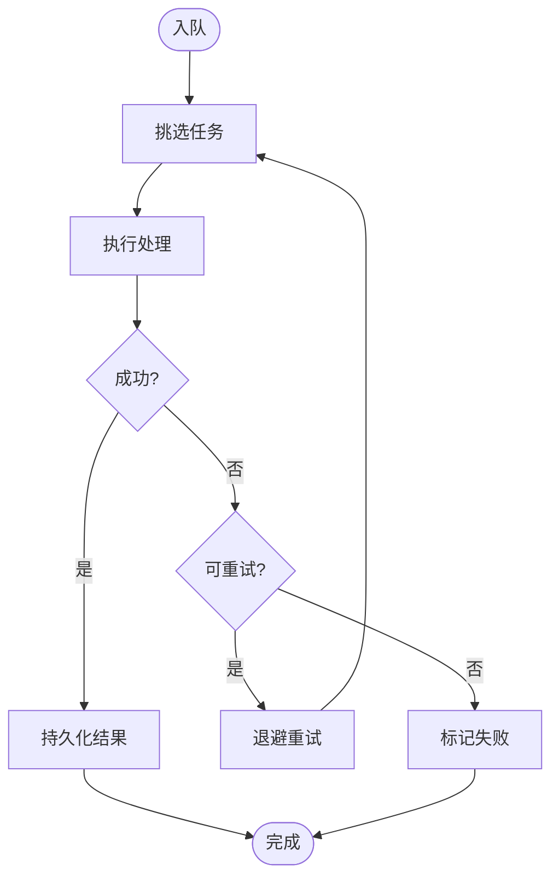

图表来源
- [narration-queue-handler.ts:1-200](file://src/features/audio/narration-queue-handler.ts#L1-L200)

章节来源
- [narration-queue-handler.ts:1-200](file://src/features/audio/narration-queue-handler.ts#L1-L200)

## 依赖关系分析
- 内聚与耦合
  - 媒体提供者高内聚于接口定义，低耦合于具体客户端实现
  - 格式检测与头部解析为纯函数式工具，无副作用
- 外部依赖
  - 音频客户端依赖第三方API（OpenAI兼容、Mimo、StepFun）
  - 仓库层依赖持久化存储（数据库/对象存储）

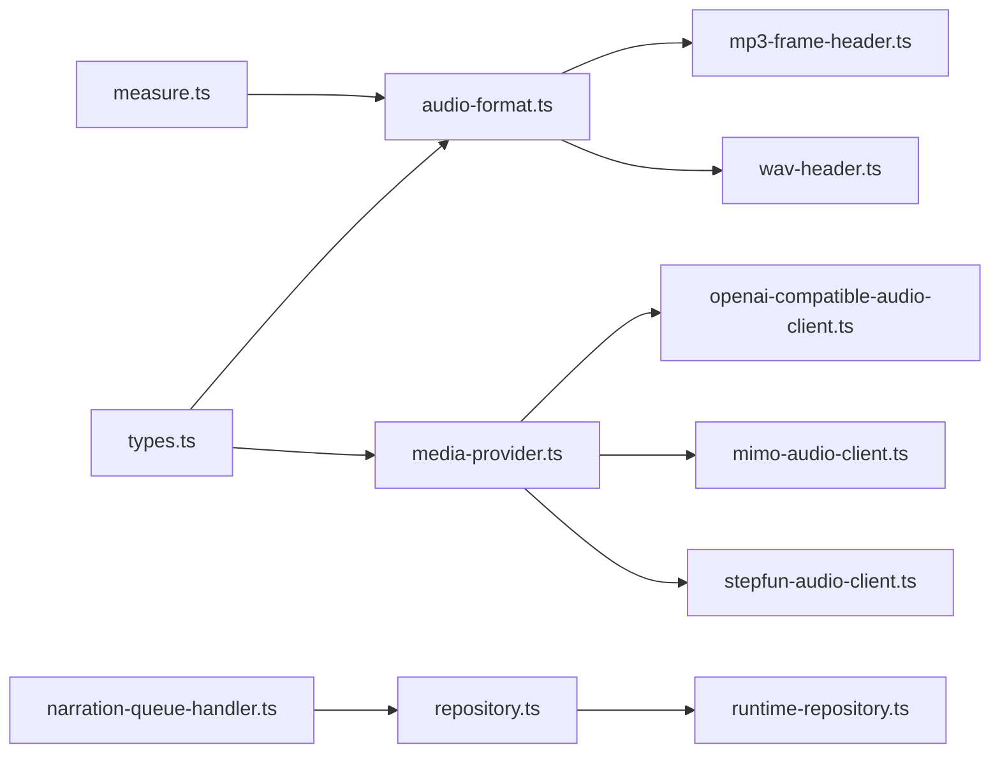

图表来源
- [types.ts:1-200](file://src/features/audio/types.ts#L1-L200)
- [audio-format.ts:1-200](file://src/features/audio/audio-format.ts#L1-L200)
- [media-provider.ts:1-200](file://src/features/audio/media-provider.ts#L1-L200)
- [mp3-frame-header.ts:1-200](file://src/features/audio/mp3-frame-header.ts#L1-L200)
- [wav-header.ts:1-200](file://src/features/audio/wav-header.ts#L1-L200)
- [measure.ts:1-200](file://src/features/audio/measure.ts#L1-L200)
- [repository.ts:1-200](file://src/features/audio/repository.ts#L1-L200)
- [runtime-repository.ts:1-200](file://src/features/audio/runtime-repository.ts#L1-L200)
- [narration-queue-handler.ts:1-200](file://src/features/audio/narration-queue-handler.ts#L1-L200)

章节来源
- [index.ts:1-200](file://src/features/audio/index.ts#L1-L200)

## 性能考虑
- 头部优先策略
  - 尽可能从文件头获取元数据，避免全量扫描
- 流式处理
  - 大文件处理采用流式读取/写入，减少内存峰值
- 缓存与复用
  - 对频繁访问的元数据进行短生命周期缓存
- 并发控制
  - 队列处理器限制并发度，防止资源争用
- 内存管理
  - 及时释放缓冲区与句柄，避免泄漏
  - 对网络流设置超时与最大长度保护

[本节为通用指导，无需引用具体文件]

## 故障排查指南
- 常见问题
  - 格式识别失败：检查头部签名与扩展名一致性
  - 时长为0或NaN：确认WAV data长度或MP3帧计数是否有效
  - 采样率异常：核对fmt块与帧头采样率索引映射
  - 流中断：检查网络超时、后端限流与重试策略
- 诊断步骤
  - 启用详细日志，记录头部字节与解析中间结果
  - 使用最小可复现样本进行单测回归
  - 对比不同后端的元数据一致性

章节来源
- [audio-format.test.ts:1-200](file://src/features/audio/audio-format.test.ts#L1-L200)
- [media-provider.test.ts:1-200](file://src/features/audio/media-provider.test.ts#L1-L200)
- [measure.test.ts:1-200](file://src/features/audio/measure.test.ts#L1-L200)

## 结论
PurpleInk的音频处理子系统通过清晰的抽象与模块化设计，实现了高效的格式检测、头部解析与元数据提取，并以媒体提供者统一了多后端与多协议的接入。配合流式处理与合理的缓存策略，能够在保证正确性的同时获得良好的性能表现。建议持续完善对更多编码的支持，并加强异常场景的覆盖与监控。

[本节为总结，无需引用具体文件]

## 附录
- 术语
  - 媒体提供者：统一读写与探测接口的抽象层
  - 头部解析：基于文件/帧开头的二进制结构解析
  - 元数据：描述音频属性的结构化信息
- 参考实现路径
  - 音频格式检测：[audio-format.ts](file://src/features/audio/audio-format.ts)
  - 媒体提供者：[media-provider.ts](file://src/features/audio/media-provider.ts)
  - 元数据测量：[measure.ts](file://src/features/audio/measure.ts)
  - MP3帧头：[mp3-frame-header.ts](file://src/features/audio/mp3-frame-header.ts)
  - WAV文件头：[wav-header.ts](file://src/features/audio/wav-header.ts)
  - 仓库与运行时：[repository.ts](file://src/features/audio/repository.ts)、[runtime-repository.ts](file://src/features/audio/runtime-repository.ts)
  - 队列处理器：[narration-queue-handler.ts](file://src/features/audio/narration-queue-handler.ts)
  - 类型定义：[types.ts](file://src/features/audio/types.ts)
  - 模块导出：[index.ts](file://src/features/audio/index.ts)