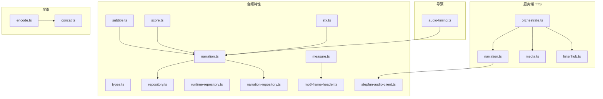
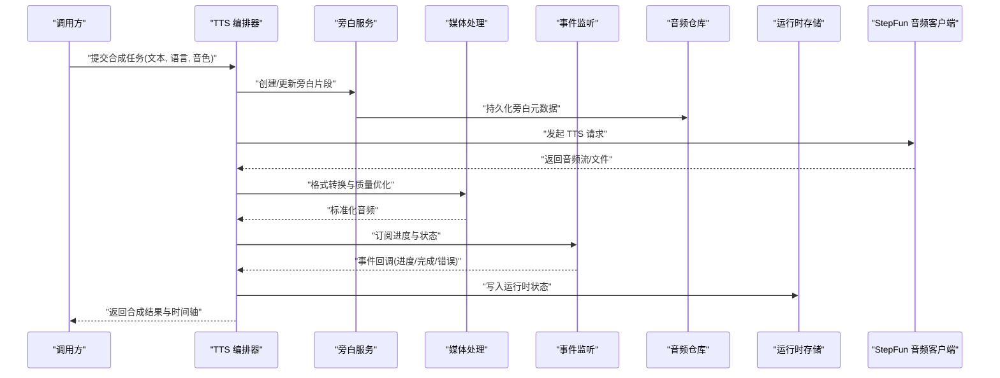
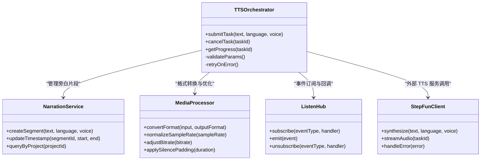
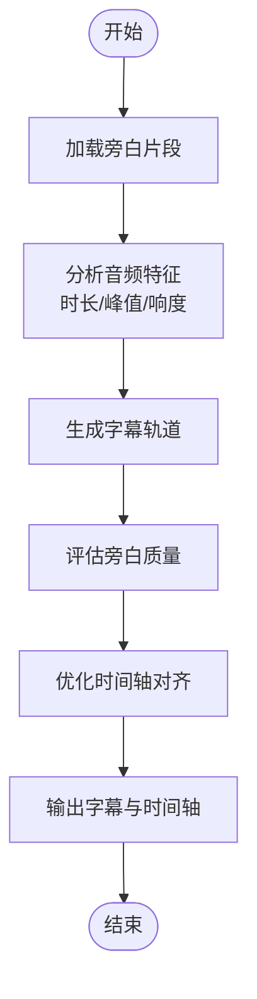
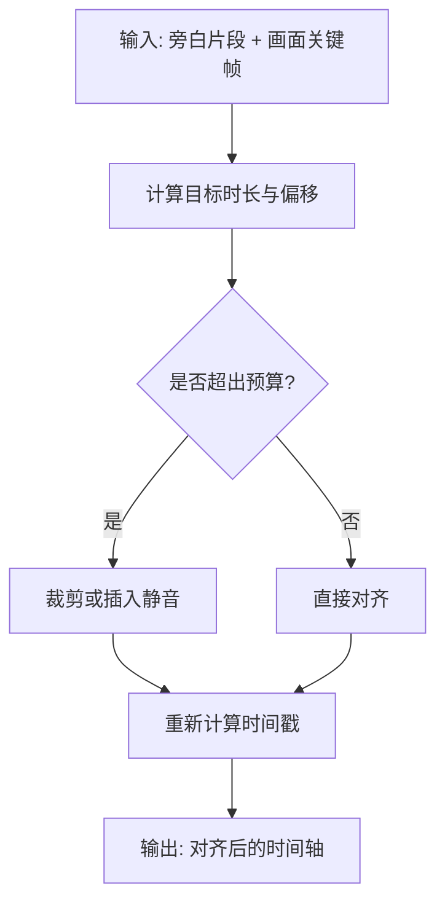
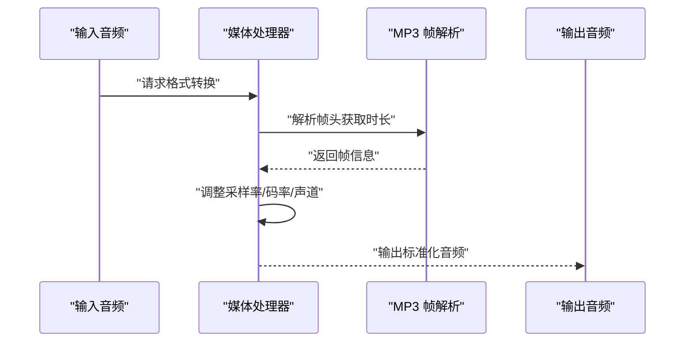
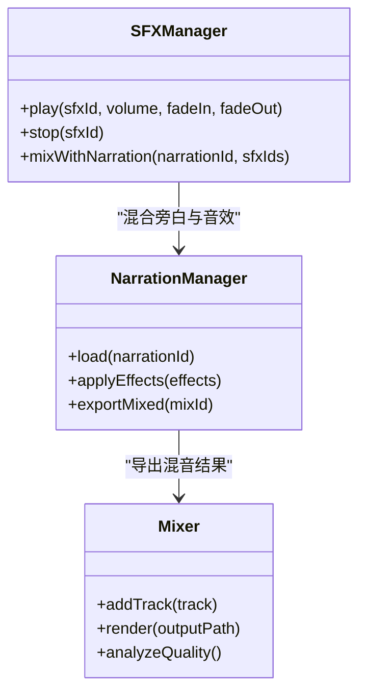
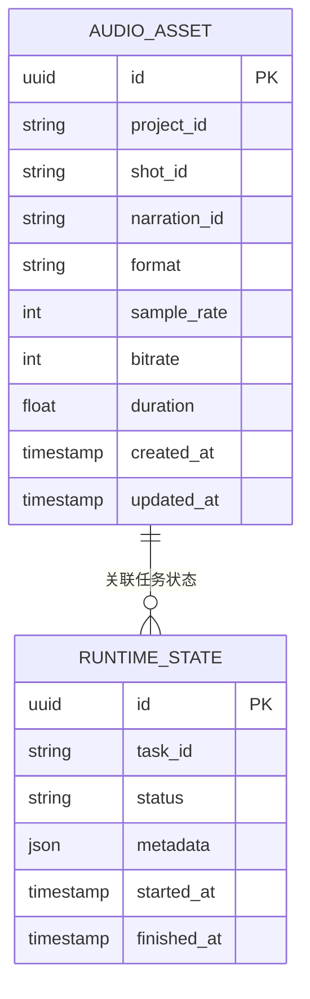
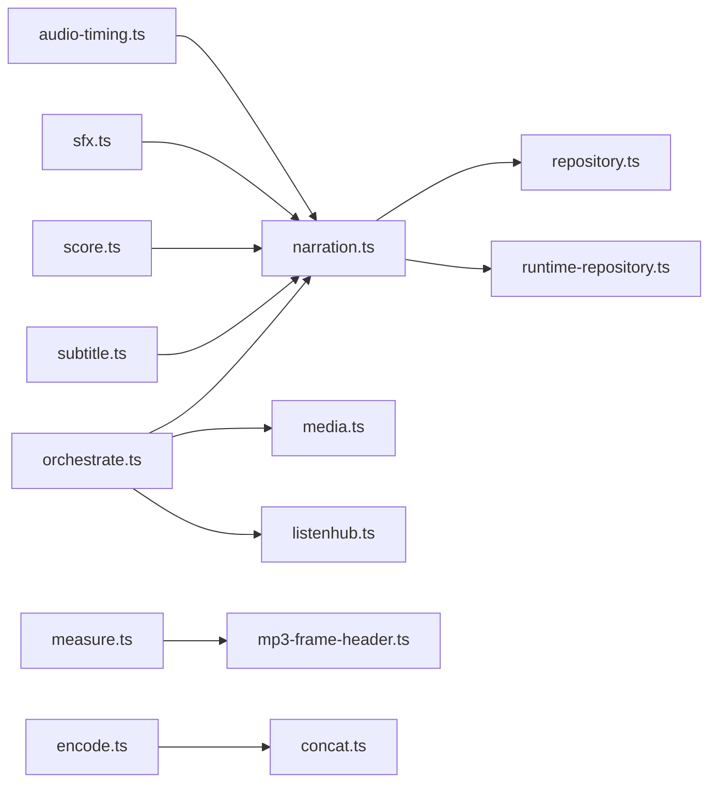

# 音频处理

<cite>
**本文引用的文件**   
- [server/src/tts/orchestrate.ts](file://server/src/tts/orchestrate.ts)
- [server/src/tts/narration.ts](file://server/src/tts/narration.ts)
- [server/src/tts/media.ts](file://server/src/tts/media.ts)
- [server/src/tts/listenhub.ts](file://server/src/tts/listenhub.ts)
- [src/features/audio/types.ts](file://src/features/audio/types.ts)
- [src/features/audio/repository.ts](file://src/features/audio/repository.ts)
- [src/features/audio/runtime-repository.ts](file://src/features/audio/runtime-repository.ts)
- [src/features/audio/narration.ts](file://src/features/audio/narration.ts)
- [src/features/audio/narration-repository.ts](file://src/features/audio/narration-repository.ts)
- [src/features/audio/subtitle.ts](file://src/features/audio/subtitle.ts)
- [src/features/audio/score.ts](file://src/features/audio/score.ts)
- [src/features/audio/sfx.ts](file://src/features/audio/sfx.ts)
- [src/features/audio/measure.ts](file://src/features/audio/measure.ts)
- [src/features/audio/mp3-frame-header.ts](file://src/features/audio/mp3-frame-header.ts)
- [src/features/audio/stepfun-audio-client.ts](file://src/features/audio/stepfun-audio-client.ts)
- [src/features/director/audio-timing.ts](file://src/features/director/audio-timing.ts)
- [src/features/render/encode.ts](file://src/features/render/encode.ts)
- [src/features/render/concat.ts](file://src/features/render/concat.ts)
- [config/tts.env.example](file://config/tts.env.example)
- [docs/configuration/tts.md](file://docs/configuration/tts.md)
</cite>

## 目录
1. [简介](#简介)
2. [项目结构](#项目结构)
3. [核心组件](#核心组件)
4. [架构总览](#架构总览)
5. [详细组件分析](#详细组件分析)
6. [依赖关系分析](#依赖关系分析)
7. [性能考虑](#性能考虑)
8. [故障诊断指南](#故障诊断指南)
9. [结论](#结论)
10. [附录](#附录)

## 简介
本技术文档面向 PurpleInk 音频处理系统，覆盖 TTS 语音合成集成、音频分析与字幕生成机制、时间轴同步算法、音频格式转换与质量优化、音频效果处理与混音、音频仓库设计与持久化检索策略，以及管道配置、性能调优与故障诊断方法。同时说明多语言支持与语音定制化的实现细节，帮助开发者快速理解并高效扩展系统能力。

## 项目结构
PurpleInk 的音频相关能力分布在服务端 TTS 编排层与前端特性模块中：
- 服务端 TTS 编排：负责与外部 TTS 服务交互、媒体处理与事件监听。
- 音频特性模块：封装音频类型定义、仓库持久化、运行时存储、旁白管理、字幕生成、评分、音效管理与测量工具等。
- 导演模块：提供时间轴同步算法，确保旁白与画面节奏对齐。
- 渲染模块：提供编码与拼接能力，用于最终输出。

图表来源
- [server/src/tts/orchestrate.ts](file://server/src/tts/orchestrate.ts)
- [server/src/tts/narration.ts](file://server/src/tts/narration.ts)
- [server/src/tts/media.ts](file://server/src/tts/media.ts)
- [server/src/tts/listenhub.ts](file://server/src/tts/listenhub.ts)
- [src/features/audio/types.ts](file://src/features/audio/types.ts)
- [src/features/audio/repository.ts](file://src/features/audio/repository.ts)
- [src/features/audio/runtime-repository.ts](file://src/features/audio/runtime-repository.ts)
- [src/features/audio/narration.ts](file://src/features/audio/narration.ts)
- [src/features/audio/narration-repository.ts](file://src/features/audio/narration-repository.ts)
- [src/features/audio/subtitle.ts](file://src/features/audio/subtitle.ts)
- [src/features/audio/score.ts](file://src/features/audio/score.ts)
- [src/features/audio/sfx.ts](file://src/features/audio/sfx.ts)
- [src/features/audio/measure.ts](file://src/features/audio/measure.ts)
- [src/features/audio/mp3-frame-header.ts](file://src/features/audio/mp3-frame-header.ts)
- [src/features/audio/stepfun-audio-client.ts](file://src/features/audio/stepfun-audio-client.ts)
- [src/features/director/audio-timing.ts](file://src/features/director/audio-timing.ts)
- [src/features/render/encode.ts](file://src/features/render/encode.ts)
- [src/features/render/concat.ts](file://src/features/render/concat.ts)

章节来源
- [server/src/tts/orchestrate.ts](file://server/src/tts/orchestrate.ts)
- [server/src/tts/narration.ts](file://server/src/tts/narration.ts)
- [server/src/tts/media.ts](file://server/src/tts/media.ts)
- [server/src/tts/listenhub.ts](file://server/src/tts/listenhub.ts)
- [src/features/audio/types.ts](file://src/features/audio/types.ts)
- [src/features/audio/repository.ts](file://src/features/audio/repository.ts)
- [src/features/audio/runtime-repository.ts](file://src/features/audio/runtime-repository.ts)
- [src/features/audio/narration.ts](file://src/features/audio/narration.ts)
- [src/features/audio/narration-repository.ts](file://src/features/audio/narration-repository.ts)
- [src/features/audio/subtitle.ts](file://src/features/audio/subtitle.ts)
- [src/features/audio/score.ts](file://src/features/audio/score.ts)
- [src/features/audio/sfx.ts](file://src/features/audio/sfx.ts)
- [src/features/audio/measure.ts](file://src/features/audio/measure.ts)
- [src/features/audio/mp3-frame-header.ts](file://src/features/audio/mp3-frame-header.ts)
- [src/features/audio/stepfun-audio-client.ts](file://src/features/audio/stepfun-audio-client.ts)
- [src/features/director/audio-timing.ts](file://src/features/director/audio-timing.ts)
- [src/features/render/encode.ts](file://src/features/render/encode.ts)
- [src/features/render/concat.ts](file://src/features/render/concat.ts)

## 核心组件
- TTS 编排（Orchestration）：协调文本到语音的合成流程，管理请求生命周期与结果回传。
- 旁白（Narration）：封装旁白片段、时长、时间戳与元数据，提供查询与更新能力。
- 媒体处理（Media）：统一音频格式转换、采样率与码率控制、声道与编解码参数设置。
- 事件监听（ListenHub）：订阅 TTS 服务事件流，驱动进度与状态更新。
- 音频仓库（Repository/Runtime Repository）：持久化音频资产与运行时状态，支持按项目、镜头、时间轴维度检索。
- 字幕（Subtitle）：基于旁白与时间戳生成字幕轨道，支持多语言与样式映射。
- 评分（Score）：对旁白质量进行量化评估，辅助选择最佳合成结果。
- 音效（SFX）：管理背景音、提示音等短音效，支持音量、淡入淡出与混音叠加。
- 测量（Measure）：音频时长、峰值、响度等指标测量，支撑时间轴对齐与质量保障。
- MP3 帧头解析（MP3 Frame Header）：精准读取 MP3 帧信息，辅助时长与边界计算。
- StepFun 音频客户端（StepFun Audio Client）：对接外部 TTS/音频服务，封装鉴权、重试与限流。
- 时间轴同步（Audio Timing）：将旁白与画面关键帧对齐，保证口型与节奏一致。
- 编码与拼接（Encode/Concat）：将多段音频与视频素材编码为最终输出，支持批量与并发。

章节来源
- [server/src/tts/orchestrate.ts](file://server/src/tts/orchestrate.ts)
- [server/src/tts/narration.ts](file://server/src/tts/narration.ts)
- [server/src/tts/media.ts](file://server/src/tts/media.ts)
- [server/src/tts/listenhub.ts](file://server/src/tts/listenhub.ts)
- [src/features/audio/types.ts](file://src/features/audio/types.ts)
- [src/features/audio/repository.ts](file://src/features/audio/repository.ts)
- [src/features/audio/runtime-repository.ts](file://src/features/audio/runtime-repository.ts)
- [src/features/audio/narration.ts](file://src/features/audio/narration.ts)
- [src/features/audio/narration-repository.ts](file://src/features/audio/narration-repository.ts)
- [src/features/audio/subtitle.ts](file://src/features/audio/subtitle.ts)
- [src/features/audio/score.ts](file://src/features/audio/score.ts)
- [src/features/audio/sfx.ts](file://src/features/audio/sfx.ts)
- [src/features/audio/measure.ts](file://src/features/audio/measure.ts)
- [src/features/audio/mp3-frame-header.ts](file://src/features/audio/mp3-frame-header.ts)
- [src/features/audio/stepfun-audio-client.ts](file://src/features/audio/stepfun-audio-client.ts)
- [src/features/director/audio-timing.ts](file://src/features/director/audio-timing.ts)
- [src/features/render/encode.ts](file://src/features/render/encode.ts)
- [src/features/render/concat.ts](file://src/features/render/concat.ts)

## 架构总览
PurpleInk 音频处理采用分层架构：
- 编排层：TTS 编排器作为入口，调度合成任务、监听事件、管理媒体资源。
- 领域层：旁白、字幕、音效、评分、测量等模块构成音频业务核心。
- 基础设施层：仓库与运行时存储负责持久化；StepFun 客户端对接外部服务；媒体处理模块统一编解码。
- 导演与渲染层：时间轴同步确保音视频对齐；编码与拼接完成最终输出。

图表来源
- [server/src/tts/orchestrate.ts](file://server/src/tts/orchestrate.ts)
- [server/src/tts/narration.ts](file://server/src/tts/narration.ts)
- [server/src/tts/media.ts](file://server/src/tts/media.ts)
- [server/src/tts/listenhub.ts](file://server/src/tts/listenhub.ts)
- [src/features/audio/repository.ts](file://src/features/audio/repository.ts)
- [src/features/audio/runtime-repository.ts](file://src/features/audio/runtime-repository.ts)
- [src/features/audio/stepfun-audio-client.ts](file://src/features/audio/stepfun-audio-client.ts)

## 详细组件分析

### TTS 语音合成集成
- 编排器负责任务生命周期管理，包括参数校验、队列调度、重试与超时控制。
- 旁白服务维护片段元数据（文本、语言、音色、时间戳、时长），并与仓库交互以持久化。
- 媒体处理模块统一音频格式转换（如 WAV/MP3/AAC）、采样率与码率调整、声道数与静音填充。
- 事件监听器订阅 TTS 服务的事件流，实时更新进度与状态，支持断点续传与失败恢复。

图表来源
- [server/src/tts/orchestrate.ts](file://server/src/tts/orchestrate.ts)
- [server/src/tts/narration.ts](file://server/src/tts/narration.ts)
- [server/src/tts/media.ts](file://server/src/tts/media.ts)
- [server/src/tts/listenhub.ts](file://server/src/tts/listenhub.ts)
- [src/features/audio/stepfun-audio-client.ts](file://src/features/audio/stepfun-audio-client.ts)

章节来源
- [server/src/tts/orchestrate.ts](file://server/src/tts/orchestrate.ts)
- [server/src/tts/narration.ts](file://server/src/tts/narration.ts)
- [server/src/tts/media.ts](file://server/src/tts/media.ts)
- [server/src/tts/listenhub.ts](file://server/src/tts/listenhub.ts)
- [src/features/audio/stepfun-audio-client.ts](file://src/features/audio/stepfun-audio-client.ts)

### 音频分析与字幕生成机制
- 旁白模块提供片段查询、时间戳更新与关联字幕的能力。
- 字幕模块基于旁白时间戳生成字幕轨道，支持多语言映射与样式配置。
- 评分模块对旁白质量进行评估（如清晰度、停顿合理性），辅助选择最优合成结果。
- 测量模块计算时长、峰值、响度等指标，支撑时间轴对齐与质量保障。

图表来源
- [src/features/audio/narration.ts](file://src/features/audio/narration.ts)
- [src/features/audio/subtitle.ts](file://src/features/audio/subtitle.ts)
- [src/features/audio/score.ts](file://src/features/audio/score.ts)
- [src/features/audio/measure.ts](file://src/features/audio/measure.ts)

章节来源
- [src/features/audio/narration.ts](file://src/features/audio/narration.ts)
- [src/features/audio/subtitle.ts](file://src/features/audio/subtitle.ts)
- [src/features/audio/score.ts](file://src/features/audio/score.ts)
- [src/features/audio/measure.ts](file://src/features/audio/measure.ts)

### 时间轴同步算法
- 导演模块的时间轴同步算法将旁白与画面关键帧对齐，确保口型与节奏一致。
- 通过测量模块提供的时长与峰值信息，动态调整旁白起止时间。
- 支持多语言切换时的时间轴重算，保持字幕与语音同步。

图表来源
- [src/features/director/audio-timing.ts](file://src/features/director/audio-timing.ts)
- [src/features/audio/measure.ts](file://src/features/audio/measure.ts)

章节来源
- [src/features/director/audio-timing.ts](file://src/features/director/audio-timing.ts)
- [src/features/audio/measure.ts](file://src/features/audio/measure.ts)

### 音频格式转换与质量优化
- 媒体处理模块统一音频格式转换（WAV/MP3/AAC），支持采样率与码率调整。
- 通过 MP3 帧头解析精确计算时长与边界，避免截断或溢出。
- 应用静音填充与响度归一化，提升播放体验一致性。

图表来源
- [server/src/tts/media.ts](file://server/src/tts/media.ts)
- [src/features/audio/mp3-frame-header.ts](file://src/features/audio/mp3-frame-header.ts)

章节来源
- [server/src/tts/media.ts](file://server/src/tts/media.ts)
- [src/features/audio/mp3-frame-header.ts](file://src/features/audio/mp3-frame-header.ts)

### 音频效果处理、音效管理与混音功能
- 音效模块管理背景音与提示音，支持音量调节、淡入淡出与混音叠加。
- 旁白与音效在混音阶段合并，确保主次分明且无失真。
- 评分模块可评估混音效果，辅助自动调整参数。

图表来源
- [src/features/audio/sfx.ts](file://src/features/audio/sfx.ts)
- [src/features/audio/narration.ts](file://src/features/audio/narration.ts)
- [src/features/audio/score.ts](file://src/features/audio/score.ts)

章节来源
- [src/features/audio/sfx.ts](file://src/features/audio/sfx.ts)
- [src/features/audio/narration.ts](file://src/features/audio/narration.ts)
- [src/features/audio/score.ts](file://src/features/audio/score.ts)

### 音频仓库设计、持久化策略与检索机制
- 仓库模块定义音频资产的元数据结构，支持按项目、镜头、时间轴维度查询。
- 运行时存储记录合成任务的状态、进度与临时文件路径，便于断点续传。
- 提供索引与缓存机制，加速高频查询与回放。

图表来源
- [src/features/audio/types.ts](file://src/features/audio/types.ts)
- [src/features/audio/repository.ts](file://src/features/audio/repository.ts)
- [src/features/audio/runtime-repository.ts](file://src/features/audio/runtime-repository.ts)

章节来源
- [src/features/audio/types.ts](file://src/features/audio/types.ts)
- [src/features/audio/repository.ts](file://src/features/audio/repository.ts)
- [src/features/audio/runtime-repository.ts](file://src/features/audio/runtime-repository.ts)

### 多语言支持与语音定制化
- TTS 客户端支持多语言参数传递，包括语言代码、区域与方言。
- 语音定制化通过音色 ID、语速、音调等参数实现，适配不同角色与风格。
- 旁白模块维护语言与音色映射表，确保一致性。

章节来源
- [src/features/audio/stepfun-audio-client.ts](file://src/features/audio/stepfun-audio-client.ts)
- [server/src/tts/narration.ts](file://server/src/tts/narration.ts)

### 音频处理管道的配置选项、性能调优与故障诊断
- 配置项包括 TTS 服务地址、鉴权信息、并发限制、重试策略与超时设置。
- 性能调优建议：合理设置并发数、启用缓存、使用异步 I/O、监控队列长度。
- 故障诊断方法：查看事件日志、检查网络连通性、验证音频格式与元数据完整性。

章节来源
- [config/tts.env.example](file://config/tts.env.example)
- [docs/configuration/tts.md](file://docs/configuration/tts.md)

## 依赖关系分析
音频处理模块间存在清晰的依赖层次：
- 编排器依赖旁白、媒体、事件监听与外部客户端。
- 旁白依赖仓库与运行时存储。
- 字幕、评分、音效与测量模块依赖旁白与媒体处理。
- 导演与渲染模块依赖旁白与测量结果。

图表来源
- [server/src/tts/orchestrate.ts](file://server/src/tts/orchestrate.ts)
- [server/src/tts/narration.ts](file://server/src/tts/narration.ts)
- [server/src/tts/media.ts](file://server/src/tts/media.ts)
- [server/src/tts/listenhub.ts](file://server/src/tts/listenhub.ts)
- [src/features/audio/repository.ts](file://src/features/audio/repository.ts)
- [src/features/audio/runtime-repository.ts](file://src/features/audio/runtime-repository.ts)
- [src/features/audio/subtitle.ts](file://src/features/audio/subtitle.ts)
- [src/features/audio/score.ts](file://src/features/audio/score.ts)
- [src/features/audio/sfx.ts](file://src/features/audio/sfx.ts)
- [src/features/audio/measure.ts](file://src/features/audio/measure.ts)
- [src/features/audio/mp3-frame-header.ts](file://src/features/audio/mp3-frame-header.ts)
- [src/features/director/audio-timing.ts](file://src/features/director/audio-timing.ts)
- [src/features/render/encode.ts](file://src/features/render/encode.ts)
- [src/features/render/concat.ts](file://src/features/render/concat.ts)

章节来源
- [server/src/tts/orchestrate.ts](file://server/src/tts/orchestrate.ts)
- [server/src/tts/narration.ts](file://server/src/tts/narration.ts)
- [server/src/tts/media.ts](file://server/src/tts/media.ts)
- [server/src/tts/listenhub.ts](file://server/src/tts/listenhub.ts)
- [src/features/audio/repository.ts](file://src/features/audio/repository.ts)
- [src/features/audio/runtime-repository.ts](file://src/features/audio/runtime-repository.ts)
- [src/features/audio/subtitle.ts](file://src/features/audio/subtitle.ts)
- [src/features/audio/score.ts](file://src/features/audio/score.ts)
- [src/features/audio/sfx.ts](file://src/features/audio/sfx.ts)
- [src/features/audio/measure.ts](file://src/features/audio/measure.ts)
- [src/features/audio/mp3-frame-header.ts](file://src/features/audio/mp3-frame-header.ts)
- [src/features/director/audio-timing.ts](file://src/features/director/audio-timing.ts)
- [src/features/render/encode.ts](file://src/features/render/encode.ts)
- [src/features/render/concat.ts](file://src/features/render/concat.ts)

## 性能考虑
- 并发控制：合理设置 TTS 请求并发数，避免服务过载。
- 缓存策略：对常用音色与模板进行缓存，减少重复合成。
- 异步 I/O：使用非阻塞 I/O 处理音频流，提升吞吐。
- 内存管理：及时释放临时文件与缓冲区，防止内存泄漏。
- 监控告警：监控队列长度、错误率与延迟，及时预警。

[本节为通用指导，不直接分析具体文件]

## 故障诊断指南
- 查看事件日志：通过事件监听器输出的日志定位问题阶段。
- 检查网络连通性：验证 TTS 服务地址与鉴权信息。
- 验证音频格式：确认输入输出格式与元数据完整性。
- 重试与恢复：利用运行时存储实现断点续传与失败恢复。
- 性能瓶颈：监控 CPU、内存与 I/O 使用率，识别热点模块。

章节来源
- [server/src/tts/listenhub.ts](file://server/src/tts/listenhub.ts)
- [src/features/audio/runtime-repository.ts](file://src/features/audio/runtime-repository.ts)

## 结论
PurpleInk 音频处理系统通过分层架构与模块化设计，实现了高效的 TTS 集成、音频分析与字幕生成、时间轴同步、格式转换与质量优化、音效管理与混音、以及完善的持久化与检索机制。通过合理的配置与性能调优，系统能够稳定支持多语言与语音定制化需求，满足复杂音视频制作场景。

[本节为总结，不直接分析具体文件]

## 附录
- 配置示例与环境变量参考见 tts.env.example 与 tts.md。
- 测试用例与基准数据位于 tests 与 docs/issues 目录下，可用于回归验证与性能对比。

章节来源
- [config/tts.env.example](file://config/tts.env.example)
- [docs/configuration/tts.md](file://docs/configuration/tts.md)