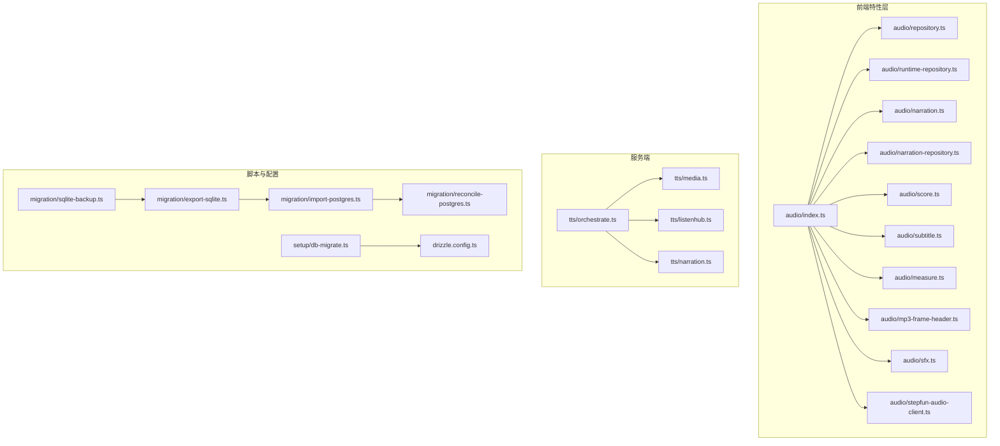
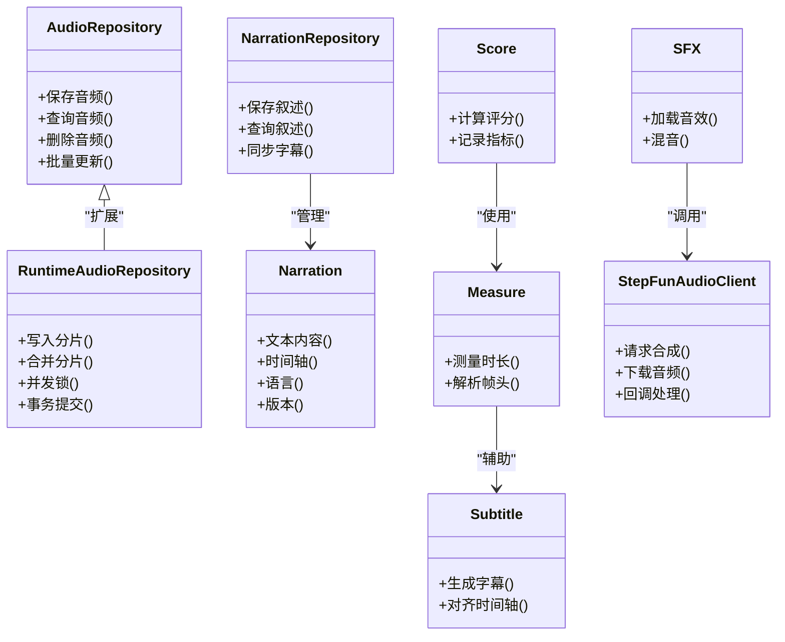
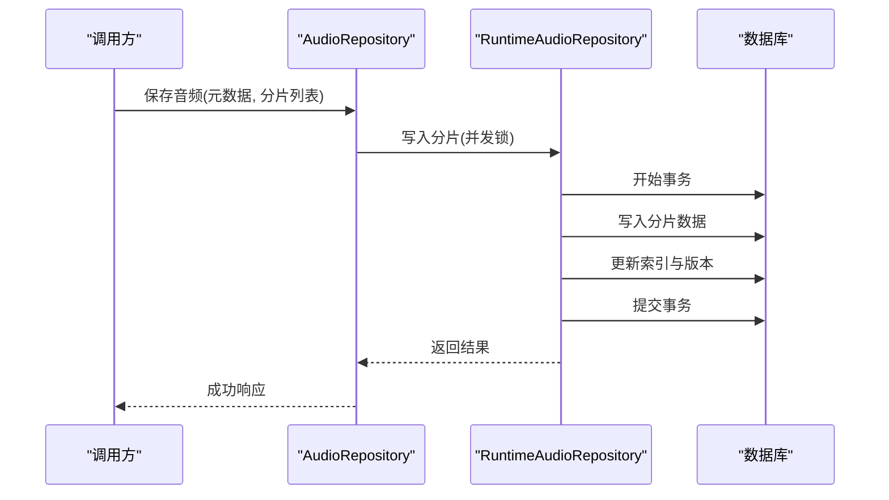
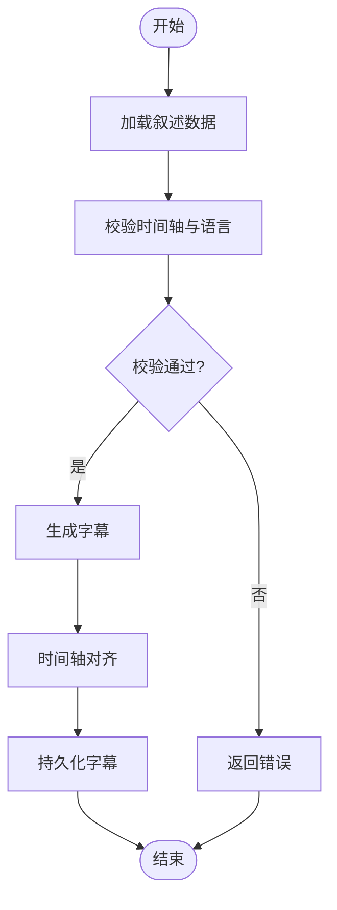
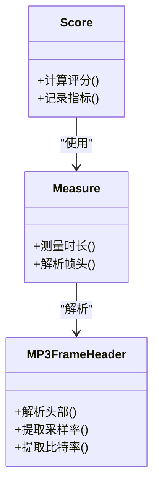
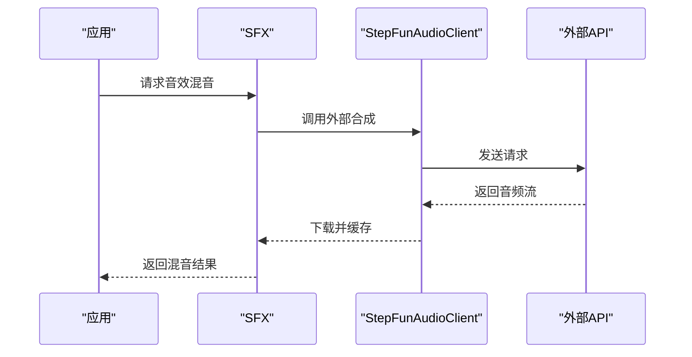
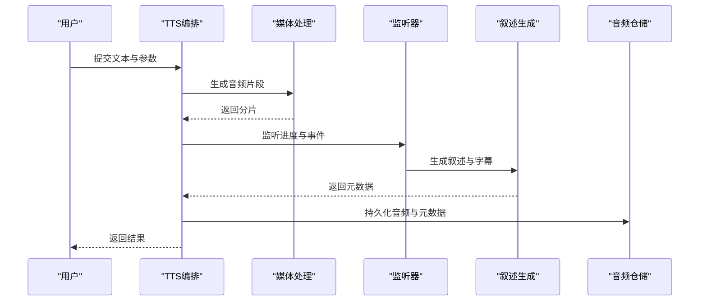
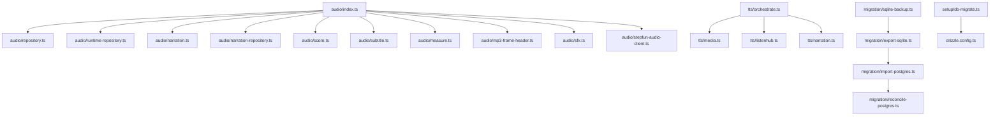

# 音频数据持久化

<cite>
**本文引用的文件**   
- [src/features/audio/index.ts](file://src/features/audio/index.ts)
- [src/features/audio/repository.ts](file://src/features/audio/repository.ts)
- [src/features/audio/runtime-repository.ts](file://src/features/audio/runtime-repository.ts)
- [src/features/audio/narration.ts](file://src/features/audio/narration.ts)
- [src/features/audio/narration-repository.ts](file://src/features/audio/narration-repository.ts)
- [src/features/audio/score.ts](file://src/features/audio/score.ts)
- [src/features/audio/subtitle.ts](file://src/features/audio/subtitle.ts)
- [src/features/audio/measure.ts](file://src/features/audio/measure.ts)
- [src/features/audio/mp3-frame-header.ts](file://src/features/audio/mp3-frame-header.ts)
- [src/features/audio/sfx.ts](file://src/features/audio/sfx.ts)
- [src/features/audio/stepfun-audio-client.ts](file://src/features/audio/stepfun-audio-client.ts)
- [server/src/tts/orchestrate.ts](file://server/src/tts/orchestrate.ts)
- [server/src/tts/media.ts](file://server/src/tts/media.ts)
- [server/src/tts/listenhub.ts](file://server/src/tts/listenhub.ts)
- [server/src/tts/narration.ts](file://server/src/tts/narration.ts)
- [scripts/migration/sqlite-backup.ts](file://scripts/migration/sqlite-backup.ts)
- [scripts/migration/export-sqlite.ts](file://scripts/migration/export-sqlite.ts)
- [scripts/migration/import-postgres.ts](file://scripts/migration/import-postgres.ts)
- [scripts/migration/reconcile-postgres.ts](file://scripts/migration/reconcile-postgres.ts)
- [scripts/setup/db-migrate.ts](file://scripts/setup/db-migrate.ts)
- [drizzle.config.ts](file://drizzle.config.ts)
</cite>

## 目录
1. [简介](#简介)
2. [项目结构](#项目结构)
3. [核心组件](#核心组件)
4. [架构总览](#架构总览)
5. [详细组件分析](#详细组件分析)
6. [依赖关系分析](#依赖关系分析)
7. [性能考量](#性能考量)
8. [故障排查指南](#故障排查指南)
9. [结论](#结论)
10. [附录](#附录)

## 简介
本技术文档围绕 PurpleInK 的音频数据持久化系统，系统性阐述其存储架构、文件组织与索引设计，覆盖元数据管理、版本控制与状态跟踪；说明分片存储、增量更新与并发访问控制；给出备份恢复、数据迁移与一致性保证方案；解释访问权限、安全加密与审计日志；并提供存储优化策略、缓存机制、查询性能调优以及分布式存储、负载均衡与故障转移建议。文档面向不同技术背景的读者，既提供高层概览，也深入到代码级实现细节与可操作建议。

## 项目结构
本项目采用前后端分离与模块化特征组织：
- 前端特性层（src/features）按领域划分，其中 audio 子模块负责音频数据的建模、仓库接口、运行时仓储、度量与字幕等能力。
- 服务端（server/src）包含 TTS 编排、媒体处理、监听与叙述生成等能力，与前端 audio 模块协作完成端到端的音频生产与持久化。
- 脚本（scripts）提供数据库迁移、备份导出导入与一致性校验工具链。
- 配置（drizzle.config.ts）集中管理数据库连接与迁移配置。

图表来源
- [src/features/audio/index.ts](file://src/features/audio/index.ts)
- [src/features/audio/repository.ts](file://src/features/audio/repository.ts)
- [src/features/audio/runtime-repository.ts](file://src/features/audio/runtime-repository.ts)
- [server/src/tts/orchestrate.ts](file://server/src/tts/orchestrate.ts)
- [scripts/migration/sqlite-backup.ts](file://scripts/migration/sqlite-backup.ts)
- [scripts/migration/export-sqlite.ts](file://scripts/migration/export-sqlite.ts)
- [scripts/migration/import-postgres.ts](file://scripts/migration/import-postgres.ts)
- [scripts/migration/reconcile-postgres.ts](file://scripts/migration/reconcile-postgres.ts)
- [scripts/setup/db-migrate.ts](file://scripts/setup/db-migrate.ts)
- [drizzle.config.ts](file://drizzle.config.ts)

章节来源
- [src/features/audio/index.ts](file://src/features/audio/index.ts)
- [server/src/tts/orchestrate.ts](file://server/src/tts/orchestrate.ts)
- [scripts/migration/sqlite-backup.ts](file://scripts/migration/sqlite-backup.ts)
- [drizzle.config.ts](file://drizzle.config.ts)

## 核心组件
- 音频仓库接口与实现：定义统一的音频数据读写契约，屏蔽底层存储差异，支持 SQLite 与 Postgres 切换。
- 运行时仓储：面向运行期的高吞吐写入与读取，提供事务与并发控制。
- 叙述与字幕：管理语音文本、时间轴与字幕映射，支撑多语言与多轨合成。
- 评分与度量：对音频质量、时长、帧头信息进行测量与评估。
- 音效与外部客户端：封装音效资源管理与第三方音频服务调用（如 StepFun）。
- TTS 编排与服务：协调文本到语音流程，产出音频片段并落盘持久化。

章节来源
- [src/features/audio/repository.ts](file://src/features/audio/repository.ts)
- [src/features/audio/runtime-repository.ts](file://src/features/audio/runtime-repository.ts)
- [src/features/audio/narration.ts](file://src/features/audio/narration.ts)
- [src/features/audio/narration-repository.ts](file://src/features/audio/narration-repository.ts)
- [src/features/audio/score.ts](file://src/features/audio/score.ts)
- [src/features/audio/subtitle.ts](file://src/features/audio/subtitle.ts)
- [src/features/audio/measure.ts](file://src/features/audio/measure.ts)
- [src/features/audio/mp3-frame-header.ts](file://src/features/audio/mp3-frame-header.ts)
- [src/features/audio/sfx.ts](file://src/features/audio/sfx.ts)
- [src/features/audio/stepfun-audio-client.ts](file://src/features/audio/stepfun-audio-client.ts)
- [server/src/tts/orchestrate.ts](file://server/src/tts/orchestrate.ts)

## 架构总览
整体架构遵循“领域模型 + 仓储抽象 + 运行时高吞吐 + 外部服务适配”的分层模式：
- 领域层：音频实体、叙述、字幕、评分与音效等模型。
- 仓储层：统一接口隔离存储实现，便于在 SQLite/Postgres 间切换。
- 运行时层：面向批处理与流式处理的仓储，保障并发与一致性。
- 服务层：TTS 编排、媒体处理、监听与叙述生成。
- 脚本层：迁移、备份、导入导出与一致性校验。

图表来源
- [src/features/audio/repository.ts](file://src/features/audio/repository.ts)
- [src/features/audio/runtime-repository.ts](file://src/features/audio/runtime-repository.ts)
- [src/features/audio/narration.ts](file://src/features/audio/narration.ts)
- [src/features/audio/narration-repository.ts](file://src/features/audio/narration-repository.ts)
- [src/features/audio/score.ts](file://src/features/audio/score.ts)
- [src/features/audio/subtitle.ts](file://src/features/audio/subtitle.ts)
- [src/features/audio/measure.ts](file://src/features/audio/measure.ts)
- [src/features/audio/sfx.ts](file://src/features/audio/sfx.ts)
- [src/features/audio/stepfun-audio-client.ts](file://src/features/audio/stepfun-audio-client.ts)

## 详细组件分析

### 音频仓储与运行时仓储
- 仓储接口：定义统一的增删改查与批量操作契约，屏蔽底层存储差异。
- 运行时仓储：针对高吞吐场景提供分片写入、合并、并发锁与事务提交能力，确保一致性与性能。
- 并发控制：通过行级锁或队列串行化避免竞态条件，支持幂等写入。
- 增量更新：基于版本号或时间戳进行增量合并，减少全量重写开销。

图表来源
- [src/features/audio/repository.ts](file://src/features/audio/repository.ts)
- [src/features/audio/runtime-repository.ts](file://src/features/audio/runtime-repository.ts)

章节来源
- [src/features/audio/repository.ts](file://src/features/audio/repository.ts)
- [src/features/audio/runtime-repository.ts](file://src/features/audio/runtime-repository.ts)

### 叙述与字幕管理
- 叙述模型：包含文本内容、时间轴、语言与版本信息，支持多语言与多轨。
- 叙述仓储：负责叙述的持久化与检索，支持与字幕同步。
- 字幕生成：基于叙述时间轴生成字幕，并进行时间对齐与格式转换。

图表来源
- [src/features/audio/narration.ts](file://src/features/audio/narration.ts)
- [src/features/audio/narration-repository.ts](file://src/features/audio/narration-repository.ts)
- [src/features/audio/subtitle.ts](file://src/features/audio/subtitle.ts)

章节来源
- [src/features/audio/narration.ts](file://src/features/audio/narration.ts)
- [src/features/audio/narration-repository.ts](file://src/features/audio/narration-repository.ts)
- [src/features/audio/subtitle.ts](file://src/features/audio/subtitle.ts)

### 评分与度量
- 评分：对音频质量、时长、帧头信息进行测量与评估，输出结构化指标。
- 度量：解析 MP3 帧头、测量时长、统计关键指标，为后续优化提供依据。

图表来源
- [src/features/audio/score.ts](file://src/features/audio/score.ts)
- [src/features/audio/measure.ts](file://src/features/audio/measure.ts)
- [src/features/audio/mp3-frame-header.ts](file://src/features/audio/mp3-frame-header.ts)

章节来源
- [src/features/audio/score.ts](file://src/features/audio/score.ts)
- [src/features/audio/measure.ts](file://src/features/audio/measure.ts)
- [src/features/audio/mp3-frame-header.ts](file://src/features/audio/mp3-frame-header.ts)

### 音效与外部客户端
- 音效：管理音效资源加载与混音，支持多轨叠加。
- 外部客户端：封装第三方音频服务调用（如 StepFun），处理请求、下载与回调。

图表来源
- [src/features/audio/sfx.ts](file://src/features/audio/sfx.ts)
- [src/features/audio/stepfun-audio-client.ts](file://src/features/audio/stepfun-audio-client.ts)

章节来源
- [src/features/audio/sfx.ts](file://src/features/audio/sfx.ts)
- [src/features/audio/stepfun-audio-client.ts](file://src/features/audio/stepfun-audio-client.ts)

### TTS 编排与服务
- 编排：协调文本到语音流程，包括输入校验、任务调度、结果聚合与持久化。
- 媒体处理：音频编码、转码与切片，支持分片存储与增量更新。
- 监听与叙述：监听事件流，生成叙述并同步到仓储。

图表来源
- [server/src/tts/orchestrate.ts](file://server/src/tts/orchestrate.ts)
- [server/src/tts/media.ts](file://server/src/tts/media.ts)
- [server/src/tts/listenhub.ts](file://server/src/tts/listenhub.ts)
- [server/src/tts/narration.ts](file://server/src/tts/narration.ts)

章节来源
- [server/src/tts/orchestrate.ts](file://server/src/tts/orchestrate.ts)
- [server/src/tts/media.ts](file://server/src/tts/media.ts)
- [server/src/tts/listenhub.ts](file://server/src/tts/listenhub.ts)
- [server/src/tts/narration.ts](file://server/src/tts/narration.ts)

## 依赖关系分析
- 模块内聚性：audio 特性层内各模块职责清晰，仓储抽象降低耦合。
- 跨层依赖：TTS 编排依赖媒体处理与监听器，最终通过仓储持久化。
- 外部依赖：StepFun 音频客户端作为外部服务适配器，需关注超时与重试。
- 迁移与配置：脚本与 drizzle 配置统一管理数据库迁移与连接。

图表来源
- [src/features/audio/index.ts](file://src/features/audio/index.ts)
- [server/src/tts/orchestrate.ts](file://server/src/tts/orchestrate.ts)
- [scripts/migration/sqlite-backup.ts](file://scripts/migration/sqlite-backup.ts)
- [scripts/migration/export-sqlite.ts](file://scripts/migration/export-sqlite.ts)
- [scripts/migration/import-postgres.ts](file://scripts/migration/import-postgres.ts)
- [scripts/migration/reconcile-postgres.ts](file://scripts/migration/reconcile-postgres.ts)
- [scripts/setup/db-migrate.ts](file://scripts/setup/db-migrate.ts)
- [drizzle.config.ts](file://drizzle.config.ts)

章节来源
- [src/features/audio/index.ts](file://src/features/audio/index.ts)
- [server/src/tts/orchestrate.ts](file://server/src/tts/orchestrate.ts)
- [scripts/migration/sqlite-backup.ts](file://scripts/migration/sqlite-backup.ts)
- [drizzle.config.ts](file://drizzle.config.ts)

## 性能考量
- 分片存储：将大音频拆分为小分片，提升并行写入与读取效率，降低单次 IO 压力。
- 增量更新：基于版本或时间戳进行增量合并，避免全量重写，减少磁盘与 CPU 消耗。
- 并发控制：通过行级锁或队列串行化避免竞态，提高吞吐同时保证一致性。
- 缓存机制：对热点元数据与字幕进行内存缓存，缩短查询延迟。
- 查询优化：建立合适的索引（如项目 ID、时间戳、版本），减少扫描范围。
- 分布式扩展：引入对象存储与分片路由，结合负载均衡与故障转移提升可用性。

[本节为通用指导，不直接分析具体文件]

## 故障排查指南
- 常见错误：
  - 分片写入失败：检查仓储并发锁与事务提交逻辑。
  - 字幕时间轴错位：验证叙述时间轴与字幕对齐算法。
  - 外部服务超时：调整 StepFun 客户端超时与重试策略。
  - 迁移失败：核对 drizzle 配置与 SQL 脚本兼容性。
- 调试建议：
  - 启用仓储层日志，记录分片写入与合并过程。
  - 使用度量模块输出音频指标，定位质量问题。
  - 通过迁移脚本进行一致性校验与回滚。

章节来源
- [src/features/audio/runtime-repository.ts](file://src/features/audio/runtime-repository.ts)
- [src/features/audio/subtitle.ts](file://src/features/audio/subtitle.ts)
- [src/features/audio/stepfun-audio-client.ts](file://src/features/audio/stepfun-audio-client.ts)
- [drizzle.config.ts](file://drizzle.config.ts)

## 结论
PurpleInK 音频数据持久化系统以清晰的领域分层与仓储抽象为核心，结合运行时高吞吐与外部服务适配，实现了可扩展、高性能且一致的音频存储方案。通过分片存储、增量更新与并发控制，系统在大规模场景下保持稳定与高效。配合完善的迁移、备份与一致性校验工具链，为生产环境提供了可靠保障。未来可在分布式存储、缓存与查询优化方面进一步演进，以满足更高可用与性能需求。

[本节为总结性内容，不直接分析具体文件]

## 附录
- 备份与恢复：使用 sqlite-backup 与 export/import 脚本进行数据备份与恢复。
- 数据迁移：通过 db-migrate 与 reconcile 脚本进行数据库迁移与一致性修复。
- 配置管理：drizzle.config.ts 集中管理数据库连接与迁移配置。

章节来源
- [scripts/migration/sqlite-backup.ts](file://scripts/migration/sqlite-backup.ts)
- [scripts/migration/export-sqlite.ts](file://scripts/migration/export-sqlite.ts)
- [scripts/migration/import-postgres.ts](file://scripts/migration/import-postgres.ts)
- [scripts/migration/reconcile-postgres.ts](file://scripts/migration/reconcile-postgres.ts)
- [scripts/setup/db-migrate.ts](file://scripts/setup/db-migrate.ts)
- [drizzle.config.ts](file://drizzle.config.ts)