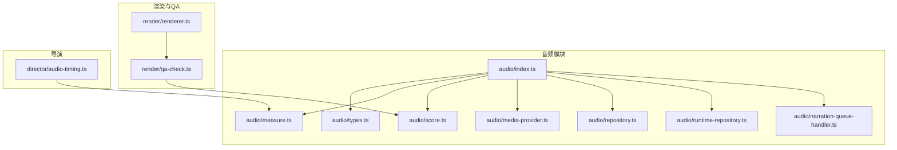
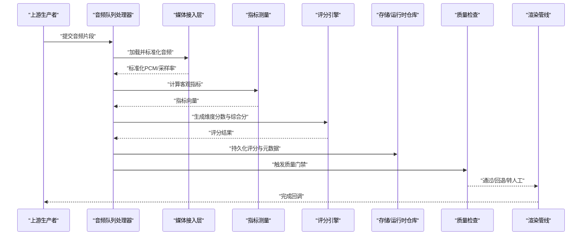
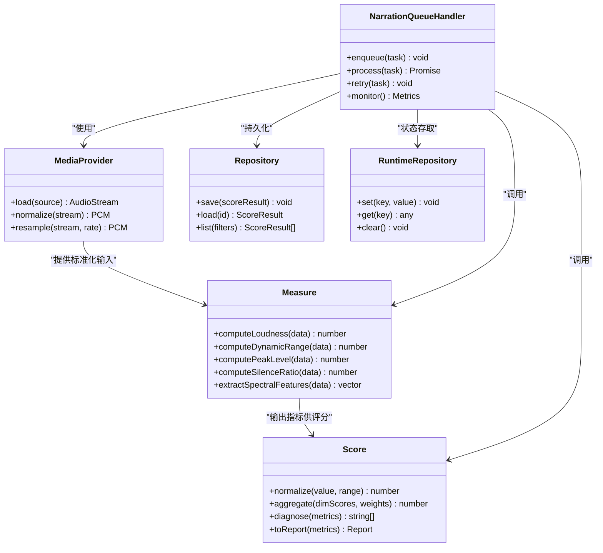
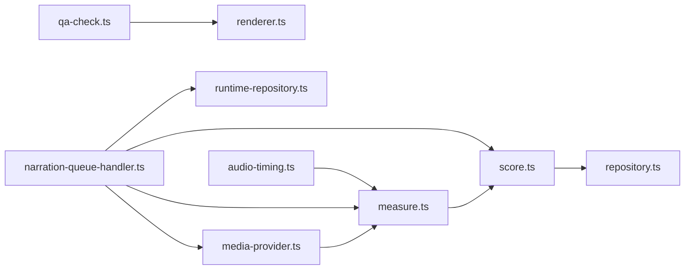

# 音频质量评估

<cite>
**本文档引用的文件**   
- [src/features/audio/score.ts](file://src/features/audio/score.ts)
- [src/features/audio/measure.ts](file://src/features/audio/measure.ts)
- [src/features/audio/narration-queue-handler.ts](file://src/features/audio/narration-queue-handler.ts)
- [src/features/audio/media-provider.ts](file://src/features/audio/media-provider.ts)
- [src/features/audio/repository.ts](file://src/features/audio/repository.ts)
- [src/features/audio/runtime-repository.ts](file://src/features/audio/runtime-repository.ts)
- [src/features/audio/types.ts](file://src/features/audio/types.ts)
- [src/features/audio/index.ts](file://src/features/audio/index.ts)
- [src/features/render/qa-check.ts](file://src/features/render/qa-check.ts)
- [src/features/render/renderer.ts](file://src/features/render/renderer.ts)
- [src/features/director/audio-timing.ts](file://src/features/director/audio-timing.ts)
</cite>

## 目录
1. [简介](#简介)
2. [项目结构](#项目结构)
3. [核心组件](#核心组件)
4. [架构总览](#架构总览)
5. [详细组件分析](#详细组件分析)
6. [依赖关系分析](#依赖关系分析)
7. [性能考量](#性能考量)
8. [故障排查指南](#故障排查指南)
9. [结论](#结论)
10. [附录](#附录)

## 简介
本文件面向PurpleInk的音频质量评估功能，系统性说明评分算法、指标定义与计算方法、队列处理机制、质量检查流程（自动检测、人工审核、反馈收集），以及常见问题的识别与修复建议。文档以仓库中的音频模块与渲染/导演模块为依据，确保内容与实际实现一致。

## 项目结构
音频质量评估相关代码主要位于以下路径：
- 音频能力与评分：src/features/audio/*
- 渲染与质量检查：src/features/render/*
- 导演与音频时序：src/features/director/*

图表来源 
- [src/features/audio/index.ts](file://src/features/audio/index.ts)
- [src/features/audio/types.ts](file://src/features/audio/types.ts)
- [src/features/audio/measure.ts](file://src/features/audio/measure.ts)
- [src/features/audio/score.ts](file://src/features/audio/score.ts)
- [src/features/audio/media-provider.ts](file://src/features/audio/media-provider.ts)
- [src/features/audio/repository.ts](file://src/features/audio/repository.ts)
- [src/features/audio/runtime-repository.ts](file://src/features/audio/runtime-repository.ts)
- [src/features/audio/narration-queue-handler.ts](file://src/features/audio/narration-queue-handler.ts)
- [src/features/render/qa-check.ts](file://src/features/render/qa-check.ts)
- [src/features/render/renderer.ts](file://src/features/render/renderer.ts)
- [src/features/director/audio-timing.ts](file://src/features/director/audio-timing.ts)

章节来源
- [src/features/audio/index.ts](file://src/features/audio/index.ts)
- [src/features/audio/types.ts](file://src/features/audio/types.ts)

## 核心组件
- 指标测量层（measure）：负责从音频数据中计算客观指标，如响度、动态范围、峰值、静音段比例等。
- 评分层（score）：基于测量结果进行加权或规则化计算，输出清晰度、响度、动态范围等维度的分数及综合分。
- 媒体接入层（media-provider）：统一读取音频源（本地文件、流、外部服务），提供标准化PCM/采样率/声道数。
- 存储与运行时（repository/runtime-repository）：持久化评分结果、元数据与中间产物；运行时仓库用于任务执行上下文。
- 队列处理器（narration-queue-handler）：批量消费待处理的音频片段，保证稳定性与吞吐。
- 质量检查（qa-check）：在渲染管线中集成质量门禁，结合自动检测与人工审核策略。
- 导演时序（audio-timing）：对齐音频与画面时序，避免音画不同步影响主观质量。

章节来源
- [src/features/audio/measure.ts](file://src/features/audio/measure.ts)
- [src/features/audio/score.ts](file://src/features/audio/score.ts)
- [src/features/audio/media-provider.ts](file://src/features/audio/media-provider.ts)
- [src/features/audio/repository.ts](file://src/features/audio/repository.ts)
- [src/features/audio/runtime-repository.ts](file://src/features/audio/runtime-repository.ts)
- [src/features/audio/narration-queue-handler.ts](file://src/features/audio/narration-queue-handler.ts)
- [src/features/render/qa-check.ts](file://src/features/render/qa-check.ts)
- [src/features/director/audio-timing.ts](file://src/features/director/audio-timing.ts)

## 架构总览
下图展示了从音频输入到评分输出的端到端流程，包括测量、评分、存储与质检门控。

图表来源 
- [src/features/audio/narration-queue-handler.ts](file://src/features/audio/narration-queue-handler.ts)
- [src/features/audio/media-provider.ts](file://src/features/audio/media-provider.ts)
- [src/features/audio/measure.ts](file://src/features/audio/measure.ts)
- [src/features/audio/score.ts](file://src/features/audio/score.ts)
- [src/features/audio/repository.ts](file://src/features/audio/repository.ts)
- [src/features/render/qa-check.ts](file://src/features/render/qa-check.ts)
- [src/features/render/renderer.ts](file://src/features/render/renderer.ts)

## 详细组件分析

### 指标测量（measure）
- 目标：将原始音频转换为可计算的指标集合，支撑后续评分。
- 关键指标：
  - 响度：衡量整体感知音量，通常基于短时能量与频率加权。
  - 动态范围：峰值与底噪之间的差值，反映声音变化幅度。
  - 峰值电平：最大瞬时幅值，用于判断削波风险。
  - 静音段比例：连续低能量区间占比，辅助噪声与停顿检测。
  - 频谱特征：频带能量分布，用于音色与清晰度推断。
- 复杂度：对每帧进行FFT/能量统计，时间复杂度近似O(N log N)，N为样本数。
- 优化点：分块处理、并行化、缓存中间结果。

章节来源
- [src/features/audio/measure.ts](file://src/features/audio/measure.ts)

### 评分引擎（score）
- 目标：将指标映射为多维分数（清晰度、响度、动态范围等）与综合分。
- 方法：
  - 归一化：将各指标映射到统一量纲（如0-100）。
  - 权重聚合：按业务需求分配维度权重，计算加权总分。
  - 阈值门控：对异常指标（如严重削波、极低响度）进行惩罚或否决。
- 输出：维度分数、综合分、诊断标签（如“过响”、“偏静”、“动态不足”）。

章节来源
- [src/features/audio/score.ts](file://src/features/audio/score.ts)

### 媒体接入层（media-provider）
- 目标：统一音频源接入，提供标准化PCM、采样率、声道配置。
- 能力：
  - 多格式解码与重采样。
  - 缓冲与流式读取，降低内存占用。
  - 错误恢复（损坏头、截断数据）。
- 与评测的关系：标准化输入是指标稳定性的前提。

章节来源
- [src/features/audio/media-provider.ts](file://src/features/audio/media-provider.ts)

### 存储与运行时（repository / runtime-repository）
- repository：持久化评分结果、指标快照、元数据与版本信息。
- runtime-repository：任务执行期间的状态存取（如进度、重试计数、临时产物路径）。
- 设计要点：读写分离、事务性更新、幂等写入。

章节来源
- [src/features/audio/repository.ts](file://src/features/audio/repository.ts)
- [src/features/audio/runtime-repository.ts](file://src/features/audio/runtime-repository.ts)

### 队列处理器（narration-queue-handler）
- 目标：批量处理音频片段，保证高吞吐与稳定性。
- 机制：
  - 入队校验：格式、大小、时长限制。
  - 并发控制：限流与背压，防止过载。
  - 失败重试：指数退避与死信队列。
  - 监控上报：延迟、吞吐、错误率。
- 与评分集成：每个任务完成后调用measure→score→store→qa-check。

章节来源
- [src/features/audio/narration-queue-handler.ts](file://src/features/audio/narration-queue-handler.ts)

### 质量检查（qa-check）
- 目标：在渲染前进行质量门禁，决定直通、回退或转人工。
- 流程：
  - 自动检测：依据评分阈值与规则集判定。
  - 人工审核：不达标或高风险项进入审核队列。
  - 反馈收集：审核结果回流至评分模型与阈值调优。
- 与渲染集成：通过renderer协调，未通过则阻断或降级。

章节来源
- [src/features/render/qa-check.ts](file://src/features/render/qa-check.ts)
- [src/features/render/renderer.ts](file://src/features/render/renderer.ts)

### 导演时序（audio-timing）
- 目标：对齐音频与画面时序，避免音画不同步影响主观质量。
- 能力：
  - 时间戳对齐与漂移补偿。
  - 静音段裁剪与衔接平滑。
  - 与字幕/特效的时间轴同步。

章节来源
- [src/features/director/audio-timing.ts](file://src/features/director/audio-timing.ts)

### 类图（评分与测量）

图表来源 
- [src/features/audio/measure.ts](file://src/features/audio/measure.ts)
- [src/features/audio/score.ts](file://src/features/audio/score.ts)
- [src/features/audio/media-provider.ts](file://src/features/audio/media-provider.ts)
- [src/features/audio/repository.ts](file://src/features/audio/repository.ts)
- [src/features/audio/runtime-repository.ts](file://src/features/audio/runtime-repository.ts)
- [src/features/audio/narration-queue-handler.ts](file://src/features/audio/narration-queue-handler.ts)

## 依赖关系分析
- 模块内聚：measure与score强耦合于音频信号处理；media-provider独立于业务逻辑；repository与runtime-repository解耦存储与运行时状态。
- 外部依赖：媒体解码器、重采样库、序列化/反序列化库。
- 潜在循环：应避免score直接依赖media-provider，通过队列处理器编排调用。

图表来源 
- [src/features/audio/media-provider.ts](file://src/features/audio/media-provider.ts)
- [src/features/audio/measure.ts](file://src/features/audio/measure.ts)
- [src/features/audio/score.ts](file://src/features/audio/score.ts)
- [src/features/audio/narration-queue-handler.ts](file://src/features/audio/narration-queue-handler.ts)
- [src/features/audio/repository.ts](file://src/features/audio/repository.ts)
- [src/features/audio/runtime-repository.ts](file://src/features/audio/runtime-repository.ts)
- [src/features/render/qa-check.ts](file://src/features/render/qa-check.ts)
- [src/features/render/renderer.ts](file://src/features/render/renderer.ts)
- [src/features/director/audio-timing.ts](file://src/features/director/audio-timing.ts)

章节来源
- [src/features/audio/index.ts](file://src/features/audio/index.ts)

## 性能考量
- 批处理与流水线：队列处理器采用分片与并行，减少单次任务开销。
- 内存管理：媒体接入层流式读取，避免大文件一次性载入。
- 指标计算优化：分帧FFT、增量统计、缓存中间结果。
- 存储I/O：批量写入、异步落盘、幂等键避免重复。
- 监控与告警：延迟、吞吐、错误率、重试次数、死信数量。

[本节为通用指导，不直接分析具体文件]

## 故障排查指南
- 常见问题定位：
  - 指标异常：检查媒体接入层的采样率/声道一致性，确认重采样参数。
  - 评分不稳定：核对归一化范围与权重配置，验证阈值门控条件。
  - 队列积压：查看并发上限、背压策略、重试退避是否合理。
  - 质量门禁误判：复核自动检测规则与人工审核反馈，调整阈值。
- 调试手段：
  - 启用详细日志（指标快照、中间产物路径）。
  - 回放问题片段，对比预期指标与得分。
  - 使用最小复现用例隔离问题。
- 修复建议：
  - 修正输入格式（位深、采样率、声道数）。
  - 调整评分权重与阈值，结合人工标注校准。
  - 优化队列并发与超时策略，增加死信队列与告警。

章节来源
- [src/features/audio/narration-queue-handler.ts](file://src/features/audio/narration-queue-handler.ts)
- [src/features/audio/score.ts](file://src/features/audio/score.ts)
- [src/features/audio/measure.ts](file://src/features/audio/measure.ts)
- [src/features/render/qa-check.ts](file://src/features/render/qa-check.ts)

## 结论
PurpleInk的音频质量评估体系以“测量-评分-存储-质检”为主线，配合队列处理器实现稳定高效的批量处理。通过清晰的职责划分与模块化设计，系统具备良好的可扩展性与可维护性。持续引入人工反馈与阈值调优，可进一步提升评分准确性与用户体验。

[本节为总结，不直接分析具体文件]

## 附录

### 评分指标定义与计算方法
- 清晰度：基于频谱平坦度、高频能量占比与失真指标的综合评估。
- 响度：短时能量加权后的感知响度，单位通常为LUFS或相对分贝。
- 动态范围：峰值与底噪之差，反映声音的动态变化能力。
- 其他辅助指标：峰值电平、静音段比例、频谱重心、谐波失真估计。

章节来源
- [src/features/audio/measure.ts](file://src/features/audio/measure.ts)
- [src/features/audio/score.ts](file://src/features/audio/score.ts)

### 音频队列处理机制
- 入队：校验格式、大小、时长，分配任务ID与优先级。
- 处理：媒体接入→指标测量→评分→存储→质检。
- 失败处理：重试、降级、死信队列与告警。
- 监控：延迟、吞吐、错误率、资源使用。

章节来源
- [src/features/audio/narration-queue-handler.ts](file://src/features/audio/narration-queue-handler.ts)

### 质量检查流程
- 自动检测：基于评分阈值与规则集判定通过/回退/转人工。
- 人工审核：审核队列、标注界面、反馈采集。
- 反馈闭环：审核结果回流至评分模型与阈值优化。

章节来源
- [src/features/render/qa-check.ts](file://src/features/render/qa-check.ts)
- [src/features/render/renderer.ts](file://src/features/render/renderer.ts)

### 音频优化建议与工具
- 音量标准化：使用响度归一化（如LUFS目标）提升一致性。
- 噪声抑制：频谱降噪与自适应滤波，避免过度处理导致失真。
- 动态压缩：控制动态范围，提升听感稳定性。
- 工具推荐：专业音频编辑软件、命令行工具（FFmpeg）、开源库（libsndfile、sox）。

[本节为通用指导，不直接分析具体文件]

### 常见问题识别与修复
- 过响/削波：降低增益、启用限幅器，检查峰值电平。
- 偏静/底噪高：提升增益、降噪处理，检查录音环境。
- 动态不足：启用动态压缩，调整阈值与比率。
- 音画不同步：校正时间戳，插入静音或裁剪多余段落。

章节来源
- [src/features/director/audio-timing.ts](file://src/features/director/audio-timing.ts)
- [src/features/audio/measure.ts](file://src/features/audio/measure.ts)
- [src/features/audio/score.ts](file://src/features/audio/score.ts)