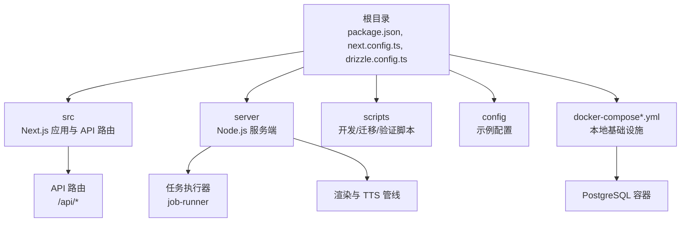
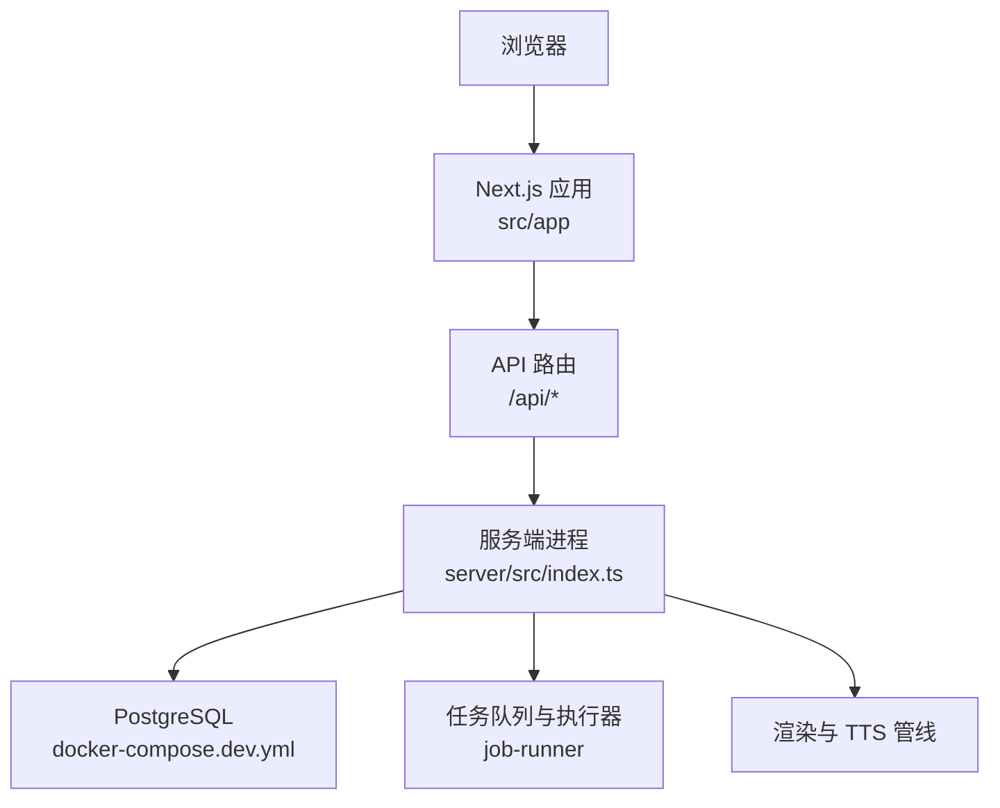
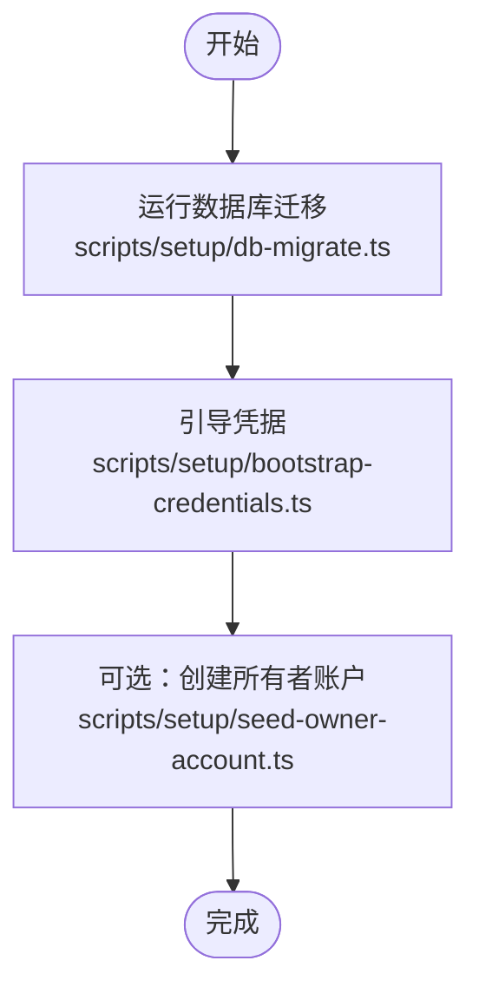
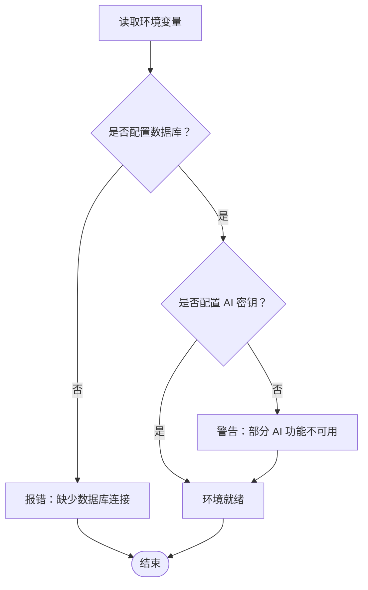
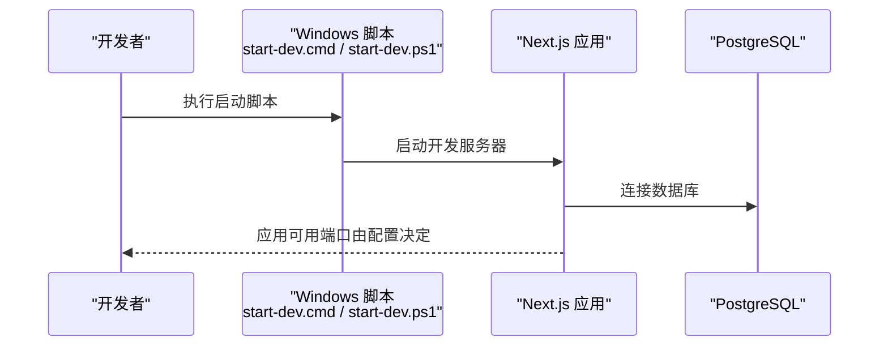
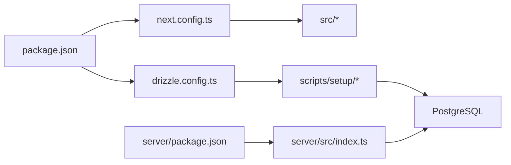

# 快速开始

<cite>
**本文引用的文件**   
- [package.json](file://package.json)
- [docker-compose.dev.yml](file://docker-compose.dev.yml)
- [docker-compose.prod.yml](file://docker-compose.prod.yml)
- [Dockerfile](file://Dockerfile)
- [next.config.ts](file://next.config.ts)
- [drizzle.config.ts](file://drizzle.config.ts)
- [scripts/dev/start-dev.cmd](file://scripts/dev/start-dev.cmd)
- [scripts/dev/start-dev.ps1](file://scripts/dev/start-dev.ps1)
- [scripts/setup/README.md](file://scripts/setup/README.md)
- [scripts/setup/db-migrate.ts](file://scripts/setup/db-migrate.ts)
- [scripts/setup/postgres-init.sql](file://scripts/setup/postgres-init.sql)
- [scripts/setup/bootstrap-credentials.ts](file://scripts/setup/bootstrap-credentials.ts)
- [scripts/setup/seed-owner-account.ts](file://scripts/setup/seed-owner-account.ts)
- [config/tts.env.example](file://config/tts.env.example)
- [docs/configuration/credentials.md](file://docs/configuration/credentials.md)
- [server/package.json](file://server/package.json)
- [server/src/index.ts](file://server/src/index.ts)
- [src/app/api/ping/route.ts](file://src/app/api/ping/route.ts)
- [src/features/auth/session.ts](file://src/features/auth/session.ts)
- [src/lib/config/site-config.ts](file://src/lib/config/site-config.ts)
</cite>

## 目录
1. [简介](#简介)
2. [项目结构](#项目结构)
3. [核心组件](#核心组件)
4. [架构总览](#架构总览)
5. [详细组件分析](#详细组件分析)
6. [依赖关系分析](#依赖关系分析)
7. [性能注意事项](#性能注意事项)
8. [故障排除指南](#故障排除指南)
9. [结论](#结论)
10. [附录](#附录)

## 简介
本快速开始指南面向首次接触 PurpleInk 的新用户，目标是在 30 分钟内完成环境搭建、配置与运行，并创建第一个视频项目。你将了解：
- 如何安装 Node.js、PostgreSQL、Docker 等依赖
- 如何克隆仓库、安装依赖、初始化数据库与凭据
- 如何在 Windows 与 Linux/macOS 上启动开发环境
- 如何配置环境变量（数据库连接、AI 服务 API 密钥等）
- 如何创建第一个项目并体验核心功能
- 常见问题的排查方法

## 项目结构
PurpleInk 采用前后端一体化工程组织方式，前端基于 Next.js，后端服务位于 server 目录，数据库使用 PostgreSQL，并通过 Docker Compose 提供本地开发基础设施。关键目录说明：
- 根目录：包含应用入口、Next 配置、工作区脚本、Docker 相关配置
- src：前端页面、API 路由、业务特性模块与共享库
- server：Node.js 服务端代码，包含任务调度、渲染管线、TTS 编排等
- scripts：开发、迁移、验证与部署辅助脚本
- config：示例与环境模板
- docs：文档与设计说明

图表来源
- [package.json](file://package.json)
- [next.config.ts](file://next.config.ts)
- [drizzle.config.ts](file://drizzle.config.ts)
- [docker-compose.dev.yml](file://docker-compose.dev.yml)
- [server/package.json](file://server/package.json)
- [server/src/index.ts](file://server/src/index.ts)

章节来源
- [package.json](file://package.json)
- [next.config.ts](file://next.config.ts)
- [drizzle.config.ts](file://drizzle.config.ts)
- [docker-compose.dev.yml](file://docker-compose.dev.yml)
- [docker-compose.prod.yml](file://docker-compose.prod.yml)
- [Dockerfile](file://Dockerfile)

## 核心组件
- 前端应用（Next.js）：提供页面、UI 组件与 API 路由，负责用户交互与数据展示
- 服务端（server）：处理任务队列、渲染管线、TTS 编排、媒体处理等
- 数据库（PostgreSQL）：持久化用户、项目、任务、渲染产物等数据
- 配置与环境：通过环境变量注入数据库连接、AI 提供商密钥等敏感信息
- 脚本工具：提供一键初始化、迁移、种子数据与验证能力

章节来源
- [src/app/api/ping/route.ts](file://src/app/api/ping/route.ts)
- [server/src/index.ts](file://server/src/index.ts)
- [scripts/setup/README.md](file://scripts/setup/README.md)
- [scripts/setup/db-migrate.ts](file://scripts/setup/db-migrate.ts)
- [scripts/setup/bootstrap-credentials.ts](file://scripts/setup/bootstrap-credentials.ts)
- [scripts/setup/seed-owner-account.ts](file://scripts/setup/seed-owner-account.ts)

## 架构总览
下图展示了本地开发环境的整体交互：浏览器访问 Next.js 应用，调用 /api 路由；后端服务处理任务与渲染；PostgreSQL 作为数据源；Docker Compose 管理数据库容器。

图表来源
- [src/app/api/ping/route.ts](file://src/app/api/ping/route.ts)
- [server/src/index.ts](file://server/src/index.ts)
- [docker-compose.dev.yml](file://docker-compose.dev.yml)

## 详细组件分析

### 环境与依赖准备
- Node.js：建议使用 LTS 版本（参考 package.json 的 engines 或 pnpm 要求）
- PostgreSQL：可通过 Docker 启动或使用本地实例
- Docker：用于运行数据库与反向代理等基础设施
- pnpm：推荐使用 pnpm 进行依赖安装与工作区管理

章节来源
- [package.json](file://package.json)
- [docker-compose.dev.yml](file://docker-compose.dev.yml)

### 克隆与安装依赖
- 克隆仓库后，在工作区根目录执行依赖安装命令（pnpm install）
- 如需构建或预览生产镜像，可参考 Dockerfile 与 docker-compose 配置

章节来源
- [package.json](file://package.json)
- [Dockerfile](file://Dockerfile)

### 初始化数据库与凭据
- 使用脚本初始化数据库结构与表
- 生成或导入凭据（如 AI 提供商密钥）
- 可选：为演示目的创建所有者账户

图表来源
- [scripts/setup/db-migrate.ts](file://scripts/setup/db-migrate.ts)
- [scripts/setup/bootstrap-credentials.ts](file://scripts/setup/bootstrap-credentials.ts)
- [scripts/setup/seed-owner-account.ts](file://scripts/setup/seed-owner-account.ts)

章节来源
- [scripts/setup/README.md](file://scripts/setup/README.md)
- [scripts/setup/db-migrate.ts](file://scripts/setup/db-migrate.ts)
- [scripts/setup/postgres-init.sql](file://scripts/setup/postgres-init.sql)
- [scripts/setup/bootstrap-credentials.ts](file://scripts/setup/bootstrap-credentials.ts)
- [scripts/setup/seed-owner-account.ts](file://scripts/setup/seed-owner-account.ts)

### 环境变量配置
- 数据库连接：在环境变量中设置 PostgreSQL 连接字符串（如 DATABASE_URL）
- AI 服务提供商：根据需求配置 OpenAI、Gemini、StepFun、Mimo 等服务的 API 密钥
- TTS 配置：参考 tts.env.example 中的键值说明
- 站点配置：可在 site-config 中调整基础站点行为

图表来源
- [config/tts.env.example](file://config/tts.env.example)
- [docs/configuration/credentials.md](file://docs/configuration/credentials.md)
- [src/lib/config/site-config.ts](file://src/lib/config/site-config.ts)

章节来源
- [config/tts.env.example](file://config/tts.env.example)
- [docs/configuration/credentials.md](file://docs/configuration/credentials.md)
- [src/lib/config/site-config.ts](file://src/lib/config/site-config.ts)

### 启动开发环境
- Windows：使用提供的批处理或 PowerShell 脚本启动开发服务器
- Linux/macOS：可直接运行 pnpm dev 或通过脚本启动

图表来源
- [scripts/dev/start-dev.cmd](file://scripts/dev/start-dev.cmd)
- [scripts/dev/start-dev.ps1](file://scripts/dev/start-dev.ps1)
- [next.config.ts](file://next.config.ts)

章节来源
- [scripts/dev/start-dev.cmd](file://scripts/dev/start-dev.cmd)
- [scripts/dev/start-dev.ps1](file://scripts/dev/start-dev.ps1)
- [next.config.ts](file://next.config.ts)

### 第一个项目创建与使用
- 登录系统后，进入“新建项目”流程
- 填写项目基本信息，选择需要的 AI 服务与 TTS 配置
- 提交后，系统将创建任务并在渲染管线中处理
- 可在项目详情查看进度与结果

章节来源
- [src/app/_components/new-project-dialog.tsx](file://src/app/_components/new-project-dialog.tsx)
- [src/app/api/projects/route.ts](file://src/app/api/projects/route.ts)

## 依赖关系分析
- 前端依赖 Next.js 生态，API 路由与页面组件共同构成应用入口
- 服务端依赖 Node.js 运行时，负责任务调度、渲染与 TTS 编排
- 数据库依赖 PostgreSQL，通过 Drizzle ORM 进行迁移与查询
- Docker Compose 统一编排数据库与服务，便于本地开发

图表来源
- [package.json](file://package.json)
- [next.config.ts](file://next.config.ts)
- [drizzle.config.ts](file://drizzle.config.ts)
- [server/package.json](file://server/package.json)
- [server/src/index.ts](file://server/src/index.ts)

章节来源
- [package.json](file://package.json)
- [next.config.ts](file://next.config.ts)
- [drizzle.config.ts](file://drizzle.config.ts)
- [server/package.json](file://server/package.json)
- [server/src/index.ts](file://server/src/index.ts)

## 性能注意事项
- 数据库连接池：确保合理配置连接数与超时时间
- 任务队列：避免并发过高导致资源争用，必要时调整并行度
- 渲染管线：大文件或高分辨率素材可能影响渲染速度，建议分批处理
- 缓存策略：对静态资源与常用结果启用缓存，减少重复计算

[本节为通用指导，不直接分析具体文件]

## 故障排除指南
- 无法连接数据库
  - 检查 PostgreSQL 容器是否启动
  - 确认环境变量中的数据库连接字符串正确
  - 查看迁移脚本是否成功执行
- AI 服务不可用
  - 检查 API 密钥是否正确配置
  - 确认网络可达且服务未限流
- 启动失败
  - 检查端口占用情况
  - 查看控制台错误日志定位问题
- 权限与凭据
  - 重新运行凭据引导脚本
  - 确保配置文件权限正确

章节来源
- [scripts/setup/db-migrate.ts](file://scripts/setup/db-migrate.ts)
- [scripts/setup/bootstrap-credentials.ts](file://scripts/setup/bootstrap-credentials.ts)
- [src/features/auth/session.ts](file://src/features/auth/session.ts)

## 结论
通过以上步骤，你可以在 30 分钟内完成 PurpleInk 的环境搭建与基本使用。建议后续阅读文档以深入了解配置项、AI 服务集成与高级功能。

[本节为总结性内容，不直接分析具体文件]

## 附录
- 推荐工具链：Node.js LTS、pnpm、Docker、VS Code
- 常用命令：
  - 安装依赖：pnpm install
  - 启动开发：scripts/dev/start-dev.cmd（Windows）或 pnpm dev（Linux/macOS）
  - 数据库迁移：scripts/setup/db-migrate.ts
  - 凭据引导：scripts/setup/bootstrap-credentials.ts
  - 创建演示账户：scripts/setup/seed-owner-account.ts

[本节为补充信息，不直接分析具体文件]