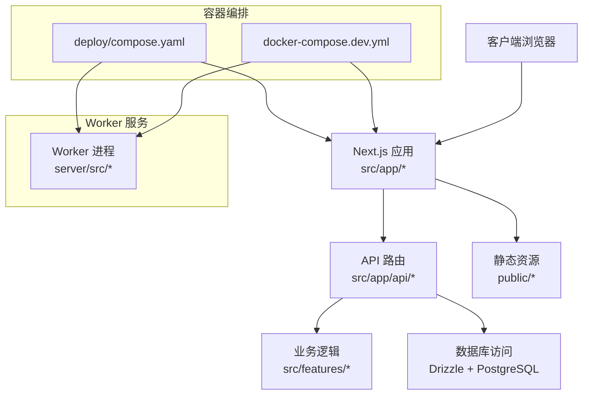
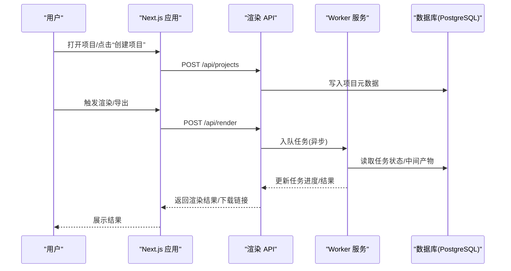
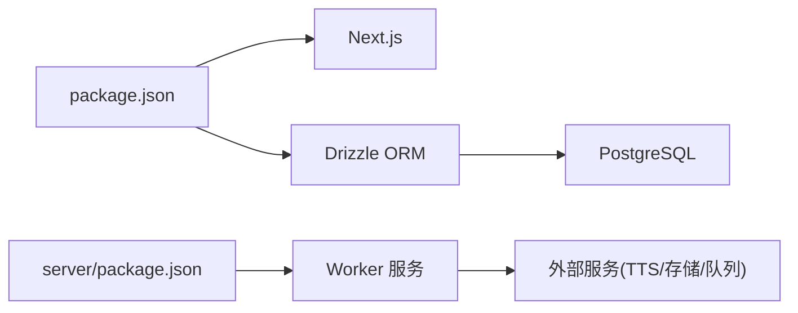

# 快速开始指南

<cite>
**本文档引用的文件**   
- [package.json](file://package.json)
- [docker-compose.dev.yml](file://docker-compose.dev.yml)
- [Dockerfile.web](file://Dockerfile.web)
- [Dockerfile.worker](file://Dockerfile.worker)
- [Dockerfile.migrate](file://Dockerfile.migrate)
- [deploy/compose.yaml](file://deploy/compose.yaml)
- [deploy/env.example](file://deploy/env.example)
- [deploy/worker.env.example](file://deploy/worker.env.example)
- [config/tts.env.example](file://config/tts.env.example)
- [drizzle.config.ts](file://drizzle.config.ts)
- [scripts/setup/db-migrate.ts](file://scripts/setup/db-migrate.ts)
- [scripts/setup/bootstrap-credentials.ts](file://scripts/setup/bootstrap-credentials.ts)
- [server/package.json](file://server/package.json)
- [next.config.ts](file://next.config.ts)
- [src/app/api/projects/route.ts](file://src/app/api/projects/route.ts)
- [src/app/api/render/route.ts](file://src/app/api/render/route.ts)
- [src/features/director/pipeline.ts](file://src/features/director/pipeline.ts)
- [src/lib/config/index.ts](file://src/lib/config/index.ts)
</cite>

## 目录
1. [简介](#简介)
2. [项目结构](#项目结构)
3. [核心组件](#核心组件)
4. [架构总览](#架构总览)
5. [详细组件分析](#详细组件分析)
6. [依赖关系分析](#依赖关系分析)
7. [性能注意事项](#性能注意事项)
8. [故障排除指南](#故障排除指南)
9. [结论](#结论)
10. [附录](#附录)

## 简介
本指南面向首次接触 PurpleInk 平台的开发者与用户，目标是帮助你在最短时间内完成环境搭建、配置数据库与环境变量、启动本地开发或 Docker 部署，并创建第一个项目体验平台的核心能力（项目创建、渲染管线、导出等）。文档同时提供常见问题排查建议与最佳实践。

## 项目结构
PurpleInk 采用前后端一体化 Next.js 应用，配合独立的 Worker 服务与迁移脚本，使用 Drizzle ORM 管理数据库。关键目录说明：
- src：前端页面、API 路由、业务功能模块与共享库
- server：服务端工具与独立运行逻辑（如采集、TTS 编排等）
- scripts：数据库迁移、凭证初始化、验证脚本
- deploy：生产/开发容器编排与示例环境变量
- config：TTS 相关环境变量示例
- 根级配置文件：包管理、Next.js 配置、Drizzle 配置、Docker 构建文件

图表来源
- [docker-compose.dev.yml](file://docker-compose.dev.yml)
- [deploy/compose.yaml](file://deploy/compose.yaml)
- [next.config.ts](file://next.config.ts)
- [drizzle.config.ts](file://drizzle.config.ts)

章节来源
- [package.json](file://package.json)
- [next.config.ts](file://next.config.ts)
- [drizzle.config.ts](file://drizzle.config.ts)

## 核心组件
- 前端与 API：基于 Next.js App Router，API 路由位于 src/app/api，业务逻辑集中在 src/features
- 数据库与迁移：Drizzle ORM，迁移脚本在 scripts/setup，配置在 drizzle.config.ts
- 工作进程：独立 Worker 服务用于异步任务（渲染、导出、TTS 等），入口在 server/src
- 容器化：提供开发/生产两种 compose 文件与多阶段 Dockerfile

章节来源
- [src/app/api/projects/route.ts](file://src/app/api/projects/route.ts)
- [src/app/api/render/route.ts](file://src/app/api/render/route.ts)
- [src/features/director/pipeline.ts](file://src/features/director/pipeline.ts)
- [scripts/setup/db-migrate.ts](file://scripts/setup/db-migrate.ts)
- [scripts/setup/bootstrap-credentials.ts](file://scripts/setup/bootstrap-credentials.ts)
- [server/package.json](file://server/package.json)

## 架构总览
PurpleInk 的运行时由三部分组成：
- Web 应用：处理 HTTP 请求、渲染页面、调用 API
- Worker 服务：执行耗时任务（渲染、导出、TTS、采集等）
- 数据层：PostgreSQL 数据库，通过 Drizzle 进行类型安全的查询与迁移

图表来源
- [src/app/api/projects/route.ts](file://src/app/api/projects/route.ts)
- [src/app/api/render/route.ts](file://src/app/api/render/route.ts)
- [src/features/director/pipeline.ts](file://src/features/director/pipeline.ts)
- [scripts/setup/db-migrate.ts](file://scripts/setup/db-migrate.ts)

## 详细组件分析

### 环境准备与依赖安装
- Node.js 版本要求与包管理器：参考根 package.json 中的 engines 与脚本命令
- 安装依赖：使用 pnpm 或 npm/yarn 安装依赖
- 可选：若使用 server 子项目，需进入 server 目录安装其依赖

章节来源
- [package.json](file://package.json)
- [server/package.json](file://server/package.json)

### 数据库配置与初始化
- 数据库类型：PostgreSQL（推荐）
- 连接信息：通过环境变量注入（如 DATABASE_URL）
- 初始化步骤：
  - 运行数据库迁移脚本
  - 可选：初始化系统凭证（bootstrap-credentials）
- 配置文件：drizzle.config.ts 指定数据库连接与迁移路径

章节来源
- [drizzle.config.ts](file://drizzle.config.ts)
- [scripts/setup/db-migrate.ts](file://scripts/setup/db-migrate.ts)
- [scripts/setup/bootstrap-credentials.ts](file://scripts/setup/bootstrap-credentials.ts)

### 环境变量设置
- 应用环境变量：参考 deploy/env.example，包含数据库、存储、第三方服务等配置项
- Worker 环境变量：参考 deploy/worker.env.example，包含队列、并发、日志级别等
- TTS 环境变量：参考 config/tts.env.example，包含语音合成提供商密钥与参数

章节来源
- [deploy/env.example](file://deploy/env.example)
- [deploy/worker.env.example](file://deploy/worker.env.example)
- [config/tts.env.example](file://config/tts.env.example)

### 本地开发环境启动
- 方式一：直接运行 Next.js 开发服务器（需先完成数据库迁移与环境变量配置）
- 方式二：使用 docker-compose.dev.yml 一键拉起 Web、Worker 与数据库

章节来源
- [docker-compose.dev.yml](file://docker-compose.dev.yml)
- [package.json](file://package.json)

### Docker 部署
- 镜像构建：Web、Worker、Migrate 分别对应不同 Dockerfile
- 编排文件：deploy/compose.yaml 提供生产/预发环境的完整编排
- 环境变量：通过 env 文件或容器环境变量注入

章节来源
- [Dockerfile.web](file://Dockerfile.web)
- [Dockerfile.worker](file://Dockerfile.worker)
- [Dockerfile.migrate](file://Dockerfile.migrate)
- [deploy/compose.yaml](file://deploy/compose.yaml)

### 第一个项目创建与运行示例
- 创建项目：调用 /api/projects 接口或通过 UI 操作
- 运行渲染：调用 /api/render 接口或通过 UI 触发
- 查看进度与结果：通过 API 或 UI 获取任务状态与产物

章节来源
- [src/app/api/projects/route.ts](file://src/app/api/projects/route.ts)
- [src/app/api/render/route.ts](file://src/app/api/render/route.ts)
- [src/features/director/pipeline.ts](file://src/features/director/pipeline.ts)

## 依赖关系分析
- 前端依赖 Next.js 生态（App Router、React、样式与工具库）
- 后端依赖 Drizzle ORM、PostgreSQL 驱动与队列/存储实现
- Worker 依赖外部服务（如对象存储、TTS 提供商、媒体处理工具）

图表来源
- [package.json](file://package.json)
- [server/package.json](file://server/package.json)
- [drizzle.config.ts](file://drizzle.config.ts)

章节来源
- [package.json](file://package.json)
- [server/package.json](file://server/package.json)
- [drizzle.config.ts](file://drizzle.config.ts)

## 性能注意事项
- 数据库连接池：合理配置连接数与超时，避免连接耗尽
- 任务队列：Worker 并发度与重试策略需根据负载调优
- 缓存与中间产物：合理使用缓存减少重复计算与 IO
- 资源限制：为 Worker 设置内存/CPU 上限，防止单任务占用过多资源

[本节为通用指导，不直接引用具体文件]

## 故障排除指南
- 无法连接数据库
  - 检查 DATABASE_URL 是否正确，网络可达性与权限
  - 确认已执行数据库迁移
- 环境变量未生效
  - 确认 .env 文件位置与命名规范
  - 检查容器环境变量注入顺序
- Worker 无任务消费
  - 检查队列服务连通性
  - 查看 Worker 日志与错误输出
- 渲染失败或超时
  - 检查外部服务密钥与配额
  - 调整并发与超时配置

章节来源
- [scripts/setup/db-migrate.ts](file://scripts/setup/db-migrate.ts)
- [deploy/env.example](file://deploy/env.example)
- [deploy/worker.env.example](file://deploy/worker.env.example)

## 结论
通过本指南，你应能完成 PurpleInk 的环境搭建、配置数据库与环境变量、启动本地或容器化部署，并成功创建并运行第一个项目。建议在正式部署前充分测试数据库连接、外部服务集成与 Worker 稳定性，并根据实际负载进行性能调优。

[本节为总结性内容，不直接引用具体文件]

## 附录
- 常用命令
  - 安装依赖：pnpm install
  - 数据库迁移：运行迁移脚本
  - 启动开发：运行 Next.js 开发服务器或使用 docker-compose
- 参考文件
  - 环境变量示例：deploy/env.example、deploy/worker.env.example、config/tts.env.example
  - 编排与构建：docker-compose.dev.yml、deploy/compose.yaml、Dockerfile.*

[本节为补充信息，不直接引用具体文件]