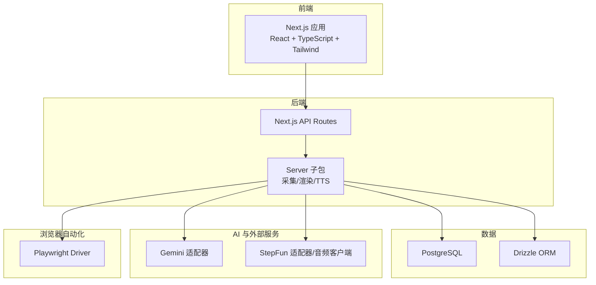
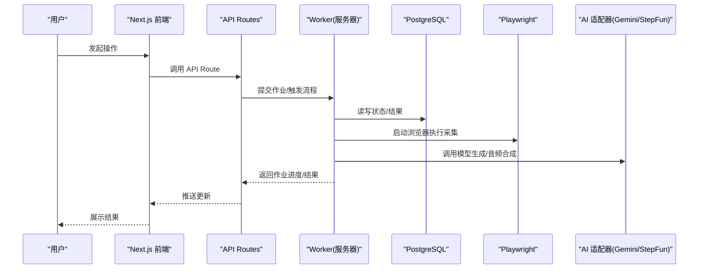
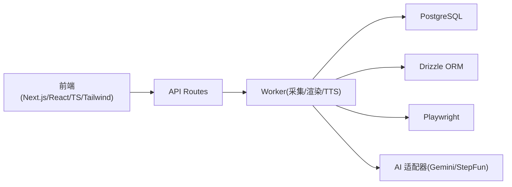

# 技术栈概览

<cite>
**本文引用的文件**   
- [package.json](file://package.json)
- [next.config.ts](file://next.config.ts)
- [tsconfig.json](file://tsconfig.json)
- [drizzle.config.ts](file://drizzle.config.ts)
- [server/package.json](file://server/package.json)
- [src/app/api/director/pipeline/route.ts](file://src/app/api/director/pipeline/route.ts)
- [src/features/ai/gemini-adapter.ts](file://src/features/ai/gemini-adapter.ts)
- [src/features/ai/stepfun-adapter.ts](file://src/features/ai/stepfun-adapter.ts)
- [src/features/audio/stepfun-audio-client.ts](file://src/features/audio/stepfun-audio-client.ts)
- [server/src/capture/playwright-driver.ts](file://server/src/capture/playwright-driver.ts)
- [server/src/capture/run-capture.ts](file://server/src/capture/run-capture.ts)
- [deploy/compose.yaml](file://deploy/compose.yaml)
- [Dockerfile.web](file://Dockerfile.web)
- [Dockerfile.worker](file://Dockerfile.worker)
</cite>

## 目录
1. [简介](#简介)
2. [项目结构](#项目结构)
3. [核心组件](#核心组件)
4. [架构总览](#架构总览)
5. [详细组件分析](#详细组件分析)
6. [依赖关系分析](#依赖关系分析)
7. [性能考量](#性能考量)
8. [故障排查指南](#故障排查指南)
9. [结论](#结论)
10. [附录](#附录)

## 简介
本文件为 PurpleInk 项目的技术栈概览，聚焦前端、后端、数据库与 AI 服务集成、浏览器自动化等核心技术选型，解释选择原因与优势，并说明各层如何协同工作。文档同时给出版本要求与兼容性信息，帮助开发者快速理解系统边界与扩展点。

## 项目结构
PurpleInk 采用前后端同仓（monorepo）组织：
- 前端应用位于 src/app，基于 Next.js App Router，使用 React + TypeScript + Tailwind CSS。
- 服务端能力通过 Next.js API Routes 暴露，并在 server 子包中承载重任务（采集、渲染、TTS 编排等）。
- 数据库使用 PostgreSQL，ORM 使用 Drizzle ORM，迁移与配置集中在 drizzle.config.ts。
- AI 能力通过适配器模式接入 Gemini 与 StepFun，音频合成由 StepFun 提供。
- 浏览器自动化由 Playwright 驱动，用于页面截图与内容抓取。
- 部署以 Docker Compose 编排 Web、Worker 与数据库容器。

图表来源
- [next.config.ts](file://next.config.ts)
- [server/package.json](file://server/package.json)
- [drizzle.config.ts](file://drizzle.config.ts)

章节来源
- [package.json](file://package.json)
- [next.config.ts](file://next.config.ts)
- [tsconfig.json](file://tsconfig.json)

## 核心组件
- 前端技术栈
  - Next.js（App Router）：统一路由、服务端渲染与 API 路由，提升首屏性能与 SEO。
  - React + TypeScript：组件化 UI 与类型安全，降低运行时错误。
  - Tailwind CSS：原子化样式，提高开发效率与一致性。
- 后端技术栈
  - Node.js + Next.js API Routes：轻量 API 网关，便于与前端共享类型与工具。
  - Server 子包：承载耗时任务（采集、渲染、TTS），通过队列与作业调度解耦。
- 数据库技术
  - PostgreSQL：强一致、可扩展的关系型数据库。
  - Drizzle ORM：类型安全的 SQL 构建器，迁移与查询体验优秀。
- AI 服务集成
  - Gemini 适配器：文本/多模态生成，适配统一接口。
  - StepFun 适配器与音频客户端：语音合成与音频处理。
- 浏览器自动化
  - Playwright：稳定可靠的浏览器控制，支持截图、录制与交互。

章节来源
- [package.json](file://package.json)
- [server/package.json](file://server/package.json)
- [drizzle.config.ts](file://drizzle.config.ts)

## 架构总览
系统分层清晰：前端通过 Next.js API 路由调用后端；后端将重任务委派给 Worker（server 子包）；Worker 使用 Drizzle 访问 PostgreSQL，并通过 Playwright 驱动浏览器执行采集；AI 能力通过适配器抽象，屏蔽不同厂商差异。

图表来源
- [src/app/api/director/pipeline/route.ts](file://src/app/api/director/pipeline/route.ts)
- [server/src/capture/run-capture.ts](file://server/src/capture/run-capture.ts)
- [server/src/capture/playwright-driver.ts](file://server/src/capture/playwright-driver.ts)
- [src/features/ai/gemini-adapter.ts](file://src/features/ai/gemini-adapter.ts)
- [src/features/ai/stepfun-adapter.ts](file://src/features/ai/stepfun-adapter.ts)
- [src/features/audio/stepfun-audio-client.ts](file://src/features/audio/stepfun-audio-client.ts)

## 详细组件分析

### 前端技术栈（Next.js、React、TypeScript、Tailwind CSS）
- Next.js App Router 提供文件系统路由、服务端组件与 API 路由的统一体验，适合复杂产品形态。
- React + TypeScript 保证组件可维护性与类型安全，配合测试用例提升稳定性。
- Tailwind CSS 提供一致的样式体系，减少样式冲突与冗余。

章节来源
- [package.json](file://package.json)
- [next.config.ts](file://next.config.ts)
- [tsconfig.json](file://tsconfig.json)

### 后端技术栈（Node.js、API Routes、Server 子包）
- API Routes 作为入口，负责鉴权、参数校验与任务派发。
- Server 子包实现采集、渲染、TTS 等重任务，通过作业队列与状态机推进流水线。
- 与数据库的交互通过 Drizzle ORM 完成，确保类型安全与迁移可追溯。

章节来源
- [server/package.json](file://server/package.json)
- [src/app/api/director/pipeline/route.ts](file://src/app/api/director/pipeline/route.ts)

### 数据库技术（PostgreSQL、Drizzle ORM）
- PostgreSQL 提供事务、索引与并发能力，满足生产级需求。
- Drizzle ORM 定义 schema、生成迁移，并提供类型化的查询 API。

章节来源
- [drizzle.config.ts](file://drizzle.config.ts)

### AI 服务集成（Gemini、StepFun）
- 适配器模式统一对外接口，内部按厂商实现细节隔离。
- Gemini 适配器用于文本/多模态生成；StepFun 适配器与音频客户端用于语音合成与音频处理。

章节来源
- [src/features/ai/gemini-adapter.ts](file://src/features/ai/gemini-adapter.ts)
- [src/features/ai/stepfun-adapter.ts](file://src/features/ai/stepfun-adapter.ts)
- [src/features/audio/stepfun-audio-client.ts](file://src/features/audio/stepfun-audio-client.ts)

### 浏览器自动化（Playwright）
- Playwright Driver 封装页面导航、等待与截图逻辑，保障采集稳定性。
- 运行器协调采集流程，结合 AI 与渲染管线产出最终产物。

章节来源
- [server/src/capture/playwright-driver.ts](file://server/src/capture/playwright-driver.ts)
- [server/src/capture/run-capture.ts](file://server/src/capture/run-capture.ts)

### 部署与容器化（Docker Compose）
- 通过 compose.yaml 编排 Web、Worker 与数据库服务，环境变量集中管理。
- Dockerfile.web 与 Dockerfile.worker 分别构建前端与后端镜像，确保环境一致性。

章节来源
- [deploy/compose.yaml](file://deploy/compose.yaml)
- [Dockerfile.web](file://Dockerfile.web)
- [Dockerfile.worker](file://Dockerfile.worker)

## 依赖关系分析
- 前端依赖 Next.js、React、TypeScript、Tailwind CSS，通过 API Routes 与后端通信。
- 后端依赖 Node.js、Drizzle ORM、Playwright、AI SDK（Gemini/StepFun）。
- 数据库依赖 PostgreSQL，迁移与 schema 由 Drizzle 管理。
- 部署依赖 Docker 与 Compose，统一环境与生命周期管理。

图表来源
- [package.json](file://package.json)
- [server/package.json](file://server/package.json)
- [drizzle.config.ts](file://drizzle.config.ts)

章节来源
- [package.json](file://package.json)
- [server/package.json](file://server/package.json)
- [drizzle.config.ts](file://drizzle.config.ts)

## 性能考量
- 前端：利用 Next.js 服务端渲染与静态资源优化，减少首屏时间。
- 后端：将重任务下沉至 Worker，避免阻塞请求；合理设置并发与队列长度。
- 数据库：使用索引与分页，避免全表扫描；批量写入提升吞吐。
- 浏览器自动化：复用浏览器实例、限制并发、缓存中间结果，降低开销。
- AI 调用：合并请求、重试与超时策略，避免抖动影响整体时延。

## 故障排查指南
- API 路由异常：检查入参校验、鉴权与日志输出，确认作业是否进入队列。
- Worker 失败：查看采集/渲染/TTS 阶段日志，确认 Playwright 与外部服务可用性。
- 数据库连接：验证连接串、权限与迁移状态，必要时回滚或修复 schema。
- AI 服务：核对密钥与配额，增加重试与降级策略，记录响应码与错误体。
- 浏览器自动化：检查无头模式、网络与资源加载，必要时启用调试端口。

## 结论
PurpleInk 以 Next.js 为核心，串联前端、API、Worker 与数据库，借助 Drizzle ORM 与 Playwright 构建稳健的数据与内容流水线，并通过适配器模式灵活接入多种 AI 服务。该架构在可维护性、扩展性与性能之间取得平衡，适合持续演进的产品形态。

## 附录
- 版本与兼容性建议
  - Node.js：建议使用 LTS 版本，确保与 Next.js 与依赖兼容。
  - Next.js：遵循官方推荐版本，关注与 React/TypeScript 的兼容性矩阵。
  - PostgreSQL：使用稳定版，配合 Drizzle 迁移脚本进行版本对齐。
  - Playwright：保持与浏览器内核匹配，定期升级以获得稳定性修复。
  - AI SDK：根据厂商公告更新，注意密钥格式与速率限制变化。
- 环境变量与密钥
  - 通过 deploy/env.example 与相关 .env 模板管理敏感配置。
  - 在生产环境使用密钥管理服务或容器机密注入。