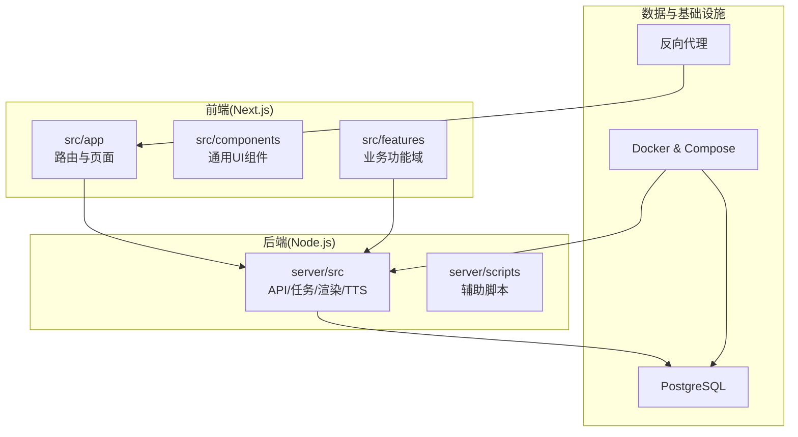
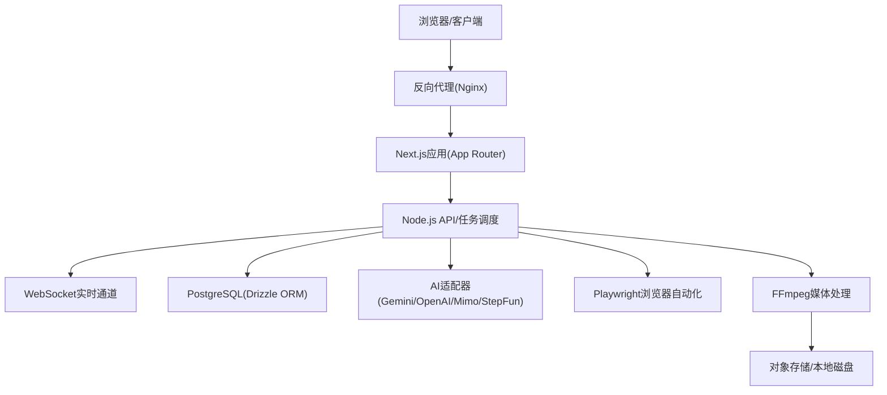
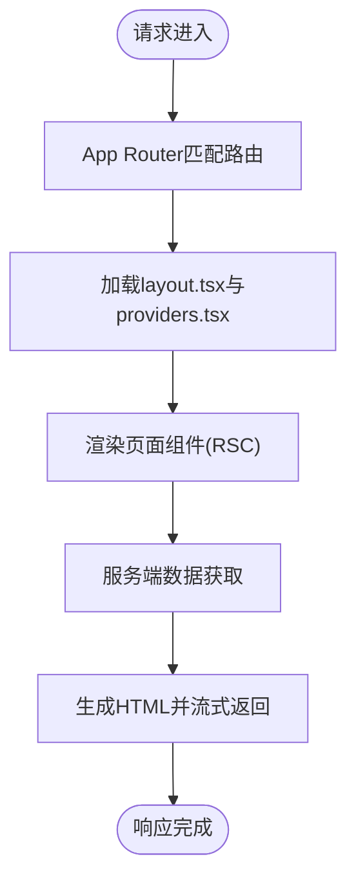
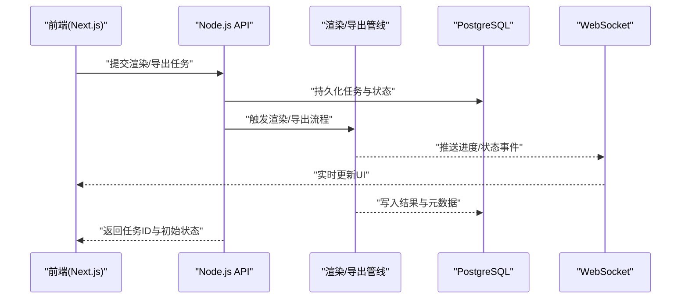
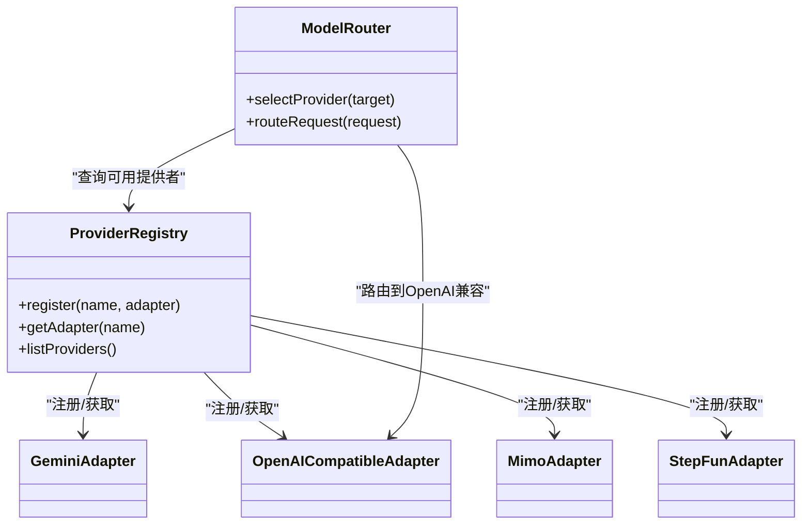
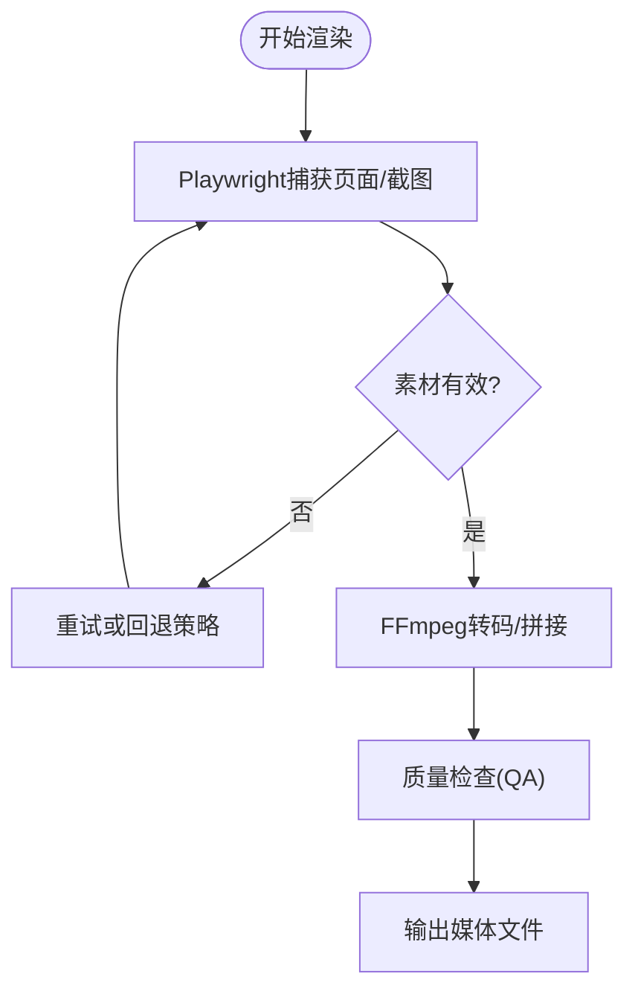
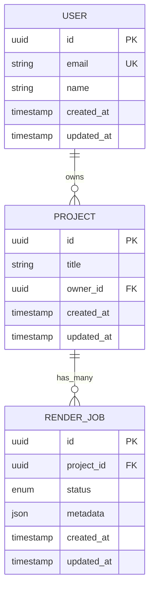
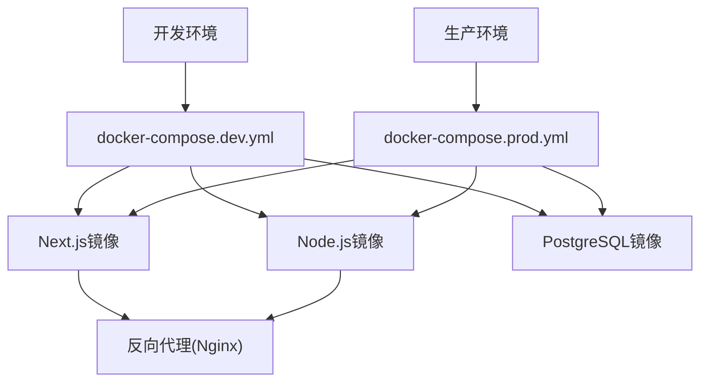
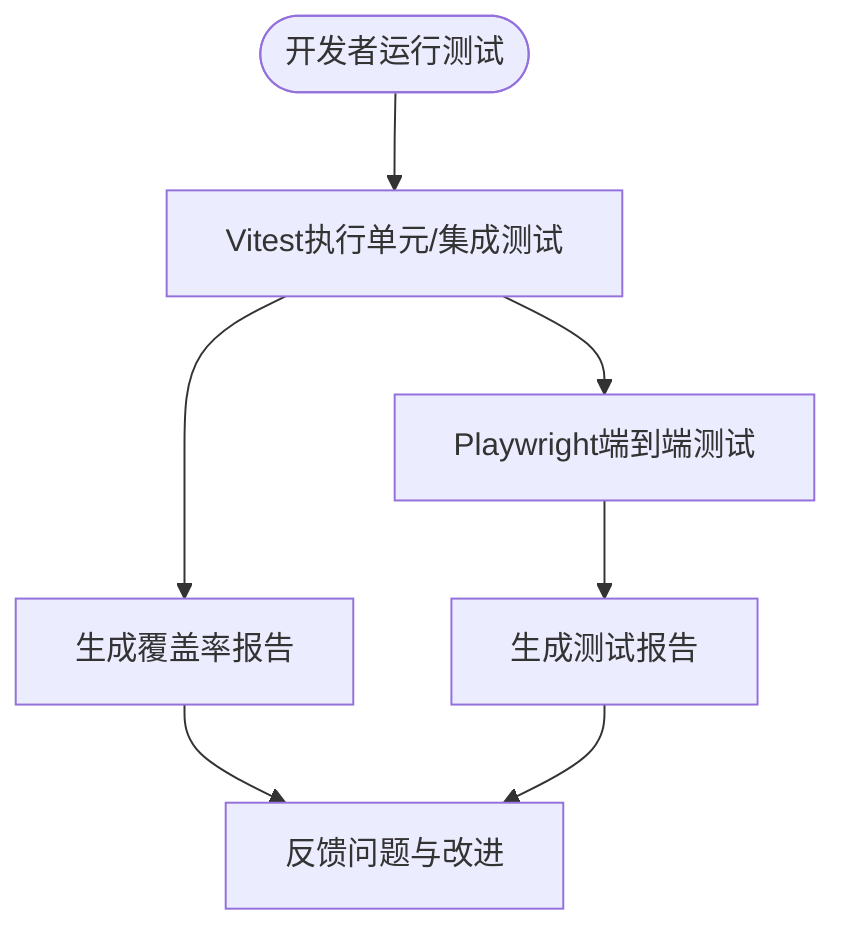
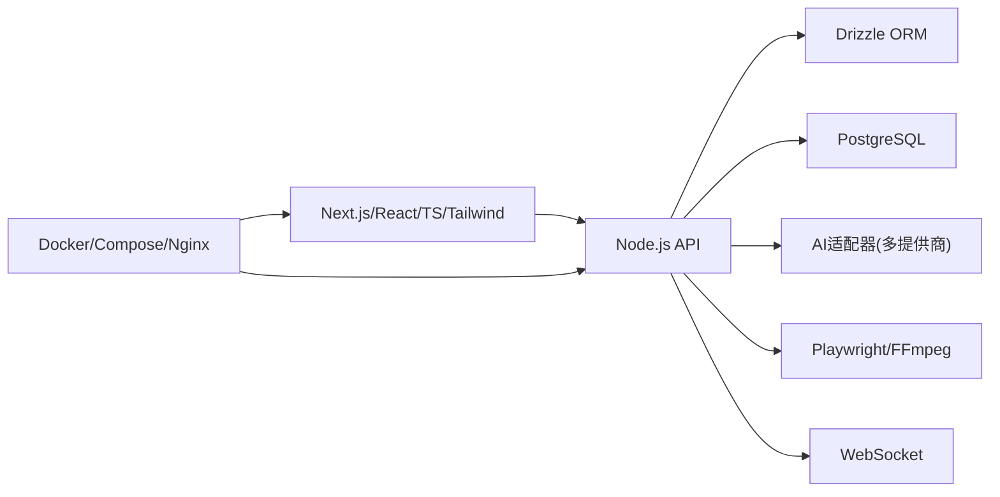

# 技术栈概览

<cite>
**本文引用的文件**   
- [package.json](file://package.json)
- [next.config.ts](file://next.config.ts)
- [tsconfig.json](file://tsconfig.json)
- [vitest.config.ts](file://vitest.config.ts)
- [drizzle.config.ts](file://drizzle.config.ts)
- [Dockerfile](file://Dockerfile)
- [docker-compose.dev.yml](file://docker-compose.dev.yml)
- [docker-compose.prod.yml](file://docker-compose.prod.yml)
- [src/app/layout.tsx](file://src/app/layout.tsx)
- [src/app/providers.tsx](file://src/app/providers.tsx)
- [src/app/globals.css](file://src/app/globals.css)
- [server/src/index.ts](file://server/src/index.ts)
- [server/package.json](file://server/package.json)
- [server/Dockerfile](file://server/Dockerfile)
- [deploy/reverse-proxy/Dockerfile](file://deploy/reverse-proxy/Dockerfile)
- [src/features/ai/provider-registry.ts](file://src/features/ai/provider-registry.ts)
- [src/features/ai/model-routing.ts](file://src/features/ai/model-routing.ts)
- [src/features/render/renderer.ts](file://src/features/render/renderer.ts)
- [src/features/audio/narration.ts](file://src/features/audio/narration.ts)
- [src/features/director/pipeline.ts](file://src/features/director/pipeline.ts)
- [src/lib/db/schema.ts](file://src/lib/db/schema.ts)
- [scripts/setup/db-migrate.ts](file://scripts/setup/db-migrate.ts)
- [scripts/setup/postgres-init.sql](file://scripts/setup/postgres-init.sql)
- [scripts/dev/start-dev.ps1](file://scripts/dev/start-dev.ps1)
</cite>

## 目录
1. [简介](#简介)
2. [项目结构](#项目结构)
3. [核心组件](#核心组件)
4. [架构总览](#架构总览)
5. [详细组件分析](#详细组件分析)
6. [依赖关系分析](#依赖关系分析)
7. [性能考量](#性能考量)
8. [故障排查指南](#故障排查指南)
9. [结论](#结论)
10. [附录](#附录)

## 简介
本技术栈概览面向PurpleInk项目的工程团队与贡献者，系统梳理前端、后端、AI集成、数据库与容器化部署等关键技术选型及其在项目中的具体用途与价值。重点包括：
- 前端：Next.js App Router、React Server Components、TypeScript、Tailwind CSS
- 后端：Node.js服务、Drizzle ORM、WebSocket实时通信
- AI集成：多提供商适配器模式、Playwright浏览器自动化、FFmpeg媒体处理
- 数据库：PostgreSQL
- 容器化：Docker与Compose编排
- 开发工具与测试：Vitest、Playwright测试

## 项目结构
仓库采用前后端分离与模块化组织方式：
- 前端应用位于 src/app（Next.js App Router）、src/components（UI组件）、src/features（按领域划分的功能模块）
- 服务端逻辑位于 server/src（Node.js服务、任务执行、渲染管线、TTS编排等）
- 配置与脚本位于根目录与 scripts（数据库迁移、初始化、开发启动等）
- 容器化配置位于 Dockerfile、docker-compose.*.yml 与 deploy/reverse-proxy

图表来源
- [Dockerfile](file://Dockerfile)
- [docker-compose.dev.yml](file://docker-compose.dev.yml)
- [docker-compose.prod.yml](file://docker-compose.prod.yml)
- [deploy/reverse-proxy/Dockerfile](file://deploy/reverse-proxy/Dockerfile)

章节来源
- [package.json](file://package.json)
- [next.config.ts](file://next.config.ts)
- [tsconfig.json](file://tsconfig.json)

## 核心组件
- 前端框架与运行时
  - Next.js App Router：基于文件系统的路由与页面组织，支持服务端渲染与流式响应，提升首屏性能与SEO。
  - React Server Components：在服务端执行数据获取与渲染，减少客户端包体，提高安全性与可维护性。
  - TypeScript：提供类型安全与更好的开发体验，贯穿前后端代码。
  - Tailwind CSS：原子化样式方案，快速构建一致且可维护的界面。
- 后端服务
  - Node.js：统一语言生态，便于前后端共享类型与工具库。
  - Drizzle ORM：轻量、类型安全的SQL ORM，结合PostgreSQL获得高性能与强类型保障。
  - WebSocket：用于导演/渲染阶段的实时状态推送与进度同步。
- AI集成
  - 多提供商适配器：通过注册表与模型路由抽象不同AI供应商能力，便于扩展与切换。
  - Playwright：浏览器自动化采集与截图，支撑内容生成与预览。
  - FFmpeg：音视频转码、拼接与质量检查，保证媒体流水线稳定输出。
- 数据库
  - PostgreSQL：关系型存储，承载用户、项目、渲染产物、队列与审计日志等结构化数据。
- 容器化与部署
  - Docker：标准化运行环境，确保开发与生产一致性。
  - Compose：一键编排前后端、数据库与反向代理。
- 测试与工具
  - Vitest：快速单元测试与集成测试，覆盖业务逻辑与组件。
  - Playwright测试：端到端场景验证，保障关键流程稳定性。

章节来源
- [package.json](file://package.json)
- [next.config.ts](file://next.config.ts)
- [tsconfig.json](file://tsconfig.json)
- [vitest.config.ts](file://vitest.config.ts)
- [drizzle.config.ts](file://drizzle.config.ts)

## 架构总览
整体架构分为四层：前端展示层、业务API与服务层、数据处理与持久化层、外部系统集成层。

图表来源
- [server/src/index.ts](file://server/src/index.ts)
- [src/features/ai/provider-registry.ts](file://src/features/ai/provider-registry.ts)
- [src/features/render/renderer.ts](file://src/features/render/renderer.ts)
- [src/features/audio/narration.ts](file://src/features/audio/narration.ts)
- [src/features/director/pipeline.ts](file://src/features/director/pipeline.ts)

## 详细组件分析

### 前端技术栈（Next.js + RSC + TypeScript + Tailwind）
- App Router与页面组织
  - 使用src/app下的路由目录结构，配合layout.tsx与providers.tsx实现全局布局与上下文注入。
  - globals.css集中管理主题与设计令牌，Tailwind负责原子化样式。
- React Server Components
  - 在服务器端完成数据获取与渲染，降低客户端体积并提升安全性。
- 类型系统与构建
  - tsconfig.json统一编译选项；package.json声明依赖与脚本。

图表来源
- [src/app/layout.tsx](file://src/app/layout.tsx)
- [src/app/providers.tsx](file://src/app/providers.tsx)
- [src/app/globals.css](file://src/app/globals.css)
- [next.config.ts](file://next.config.ts)
- [package.json](file://package.json)
- [tsconfig.json](file://tsconfig.json)

章节来源
- [src/app/layout.tsx](file://src/app/layout.tsx)
- [src/app/providers.tsx](file://src/app/providers.tsx)
- [src/app/globals.css](file://src/app/globals.css)
- [next.config.ts](file://next.config.ts)
- [package.json](file://package.json)
- [tsconfig.json](file://tsconfig.json)

### 后端服务（Node.js + Drizzle ORM + WebSocket）
- 服务入口与中间件
  - server/src/index.ts作为服务启动点，挂载HTTP与WebSocket接口。
- 任务与渲染管线
  - 渲染器与导出服务协调媒体处理、帧捕获与合成。
- 实时通信
  - WebSocket用于导演阶段节点状态、进度与结果的实时推送。

图表来源
- [server/src/index.ts](file://server/src/index.ts)
- [src/features/render/renderer.ts](file://src/features/render/renderer.ts)
- [src/features/director/pipeline.ts](file://src/features/director/pipeline.ts)
- [src/lib/db/schema.ts](file://src/lib/db/schema.ts)

章节来源
- [server/src/index.ts](file://server/src/index.ts)
- [server/package.json](file://server/package.json)
- [drizzle.config.ts](file://drizzle.config.ts)

### AI集成（多提供商适配器 + 模型路由）
- 适配器注册表与模型路由
  - provider-registry.ts统一管理各AI提供商适配器，model-routing.ts根据策略选择目标模型。
- 典型调用链
  - 导演/编排阶段通过适配器调用文本或音频生成能力，适配层屏蔽差异。

图表来源
- [src/features/ai/provider-registry.ts](file://src/features/ai/provider-registry.ts)
- [src/features/ai/model-routing.ts](file://src/features/ai/model-routing.ts)

章节来源
- [src/features/ai/provider-registry.ts](file://src/features/ai/provider-registry.ts)
- [src/features/ai/model-routing.ts](file://src/features/ai/model-routing.ts)

### 媒体处理（Playwright + FFmpeg）
- 浏览器自动化
  - Playwright驱动浏览器进行页面渲染、截图与内容采集，为后续合成提供素材。
- 媒体处理
  - FFmpeg用于音视频转码、拼接、时长测量与质量校验，确保输出符合规范。

图表来源
- [src/features/render/renderer.ts](file://src/features/render/renderer.ts)
- [src/features/audio/narration.ts](file://src/features/audio/narration.ts)

章节来源
- [src/features/render/renderer.ts](file://src/features/render/renderer.ts)
- [src/features/audio/narration.ts](file://src/features/audio/narration.ts)

### 数据库（PostgreSQL + Drizzle ORM）
- 数据建模与迁移
  - drizzle.config.ts定义迁移与连接；scripts/setup/db-migrate.ts执行迁移；postgres-init.sql初始化数据库。
- 类型安全访问
  - Drizzle ORM提供类型推断与查询构建，降低错误率并提升可维护性。

图表来源
- [drizzle.config.ts](file://drizzle.config.ts)
- [scripts/setup/db-migrate.ts](file://scripts/setup/db-migrate.ts)
- [scripts/setup/postgres-init.sql](file://scripts/setup/postgres-init.sql)
- [src/lib/db/schema.ts](file://src/lib/db/schema.ts)

章节来源
- [drizzle.config.ts](file://drizzle.config.ts)
- [scripts/setup/db-migrate.ts](file://scripts/setup/db-migrate.ts)
- [scripts/setup/postgres-init.sql](file://scripts/setup/postgres-init.sql)
- [src/lib/db/schema.ts](file://src/lib/db/schema.ts)

### 容器化与部署（Docker + Compose + 反向代理）
- 镜像与构建
  - 根Dockerfile与server/Dockerfile分别定义前端与后端的构建步骤。
- 编排与环境
  - docker-compose.dev.yml与docker-compose.prod.yml编排服务、数据库与缓存。
- 反向代理
  - deploy/reverse-proxy/Dockerfile与entrypoint.sh配置Nginx反向代理与基础认证。

图表来源
- [Dockerfile](file://Dockerfile)
- [server/Dockerfile](file://server/Dockerfile)
- [docker-compose.dev.yml](file://docker-compose.dev.yml)
- [docker-compose.prod.yml](file://docker-compose.prod.yml)
- [deploy/reverse-proxy/Dockerfile](file://deploy/reverse-proxy/Dockerfile)

章节来源
- [Dockerfile](file://Dockerfile)
- [server/Dockerfile](file://server/Dockerfile)
- [docker-compose.dev.yml](file://docker-compose.dev.yml)
- [docker-compose.prod.yml](file://docker-compose.prod.yml)
- [deploy/reverse-proxy/Dockerfile](file://deploy/reverse-proxy/Dockerfile)

### 开发工具与测试（Vitest + Playwright测试）
- 单元测试与集成测试
  - vitest.config.ts配置测试环境与匹配规则，覆盖组件、业务逻辑与数据库交互。
- 端到端测试
  - Playwright测试验证关键用户流程，如登录、渲染与导出。

图表来源
- [vitest.config.ts](file://vitest.config.ts)

章节来源
- [vitest.config.ts](file://vitest.config.ts)

## 依赖关系分析
- 前端依赖Next.js、React、TypeScript与Tailwind，强调类型安全与高效开发体验。
- 后端依赖Node.js、Drizzle ORM与WebSocket库，确保高并发与实时通信。
- AI集成通过适配器解耦供应商差异，模型路由提供灵活选择。
- 媒体处理依赖Playwright与FFmpeg，形成稳定的内容生成与合成链路。
- 数据库使用PostgreSQL，配合Drizzle实现类型安全的数据访问。
- 容器化通过Docker与Compose统一环境，反向代理提供统一入口与安全控制。

图表来源
- [package.json](file://package.json)
- [server/package.json](file://server/package.json)
- [drizzle.config.ts](file://drizzle.config.ts)

章节来源
- [package.json](file://package.json)
- [server/package.json](file://server/package.json)
- [drizzle.config.ts](file://drizzle.config.ts)

## 性能考量
- 前端
  - 使用RSC与服务端渲染减少首屏时间；按需加载与代码分割优化包体。
  - Tailwind原子化样式避免重复CSS，提升渲染效率。
- 后端
  - 任务队列与异步处理提升吞吐；WebSocket减少轮询开销。
  - Drizzle ORM减少查询冗余，结合索引与连接池优化数据库访问。
- 媒体处理
  - FFmpeg并行转码与缓存策略缩短处理时间；Playwright资源复用降低启动成本。
- 容器化
  - 分层构建与镜像瘦身减少部署时间；Compose编排简化扩容与滚动更新。

[本节为通用指导，不直接分析具体文件]

## 故障排查指南
- 常见问题定位
  - 数据库连接失败：检查环境变量与postgres-init.sql初始化脚本。
  - 渲染超时：查看渲染器日志与FFmpeg输出，确认媒体格式与参数。
  - AI调用失败：核对适配器配置与模型路由策略，检查密钥与配额。
  - WebSocket断连：检查网络与代理配置，确认心跳与重连机制。
- 调试建议
  - 使用Vitest快速验证单测与集成用例；Playwright测试复现端到端问题。
  - 启用详细日志与指标收集，结合反向代理日志定位请求路径。

章节来源
- [scripts/setup/postgres-init.sql](file://scripts/setup/postgres-init.sql)
- [src/features/render/renderer.ts](file://src/features/render/renderer.ts)
- [src/features/ai/provider-registry.ts](file://src/features/ai/provider-registry.ts)
- [vitest.config.ts](file://vitest.config.ts)

## 结论
PurpleInk通过Next.js App Router与RSC构建高性能前端，结合TypeScript与Tailwind提升开发效率与一致性；后端以Node.js为核心，利用Drizzle ORM与WebSocket实现类型安全与实时通信；AI集成通过适配器与路由抽象多供应商能力；媒体处理借助Playwright与FFmpeg保障内容生成质量；PostgreSQL与Docker/Compose提供稳定可靠的数据与部署基座；Vitest与Playwright测试确保质量与可回归性。该技术栈兼顾性能、可维护性与可扩展性，适合复杂媒体与AI工作流场景。

[本节为总结性内容，不直接分析具体文件]

## 附录
- 开发启动
  - 使用scripts/dev/start-dev.ps1启动本地开发环境，自动拉起前后端与数据库。
- 常用命令
  - 数据库迁移：scripts/setup/db-migrate.ts
  - 测试执行：Vitest与Playwright测试套件
  - 容器构建：Docker与Compose命令

章节来源
- [scripts/dev/start-dev.ps1](file://scripts/dev/start-dev.ps1)
- [scripts/setup/db-migrate.ts](file://scripts/setup/db-migrate.ts)
- [vitest.config.ts](file://vitest.config.ts)