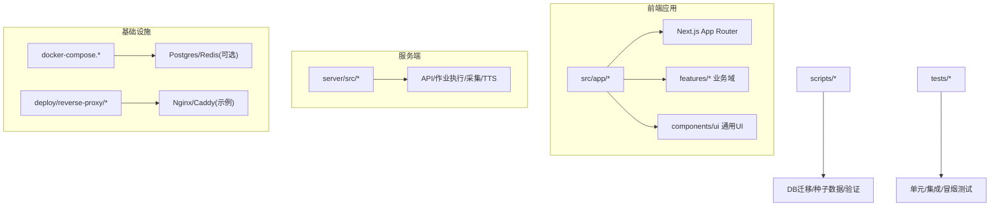
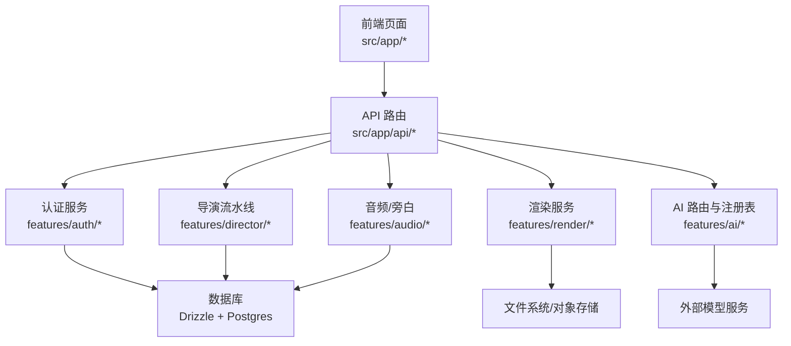
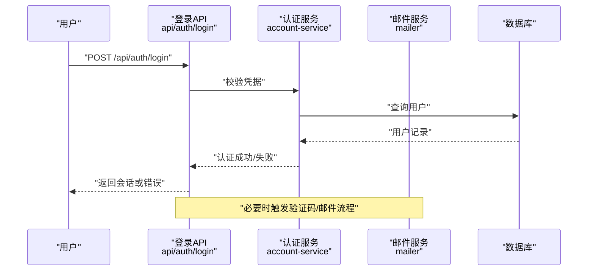
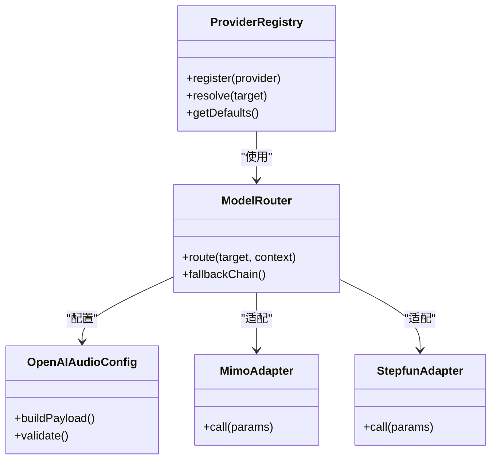
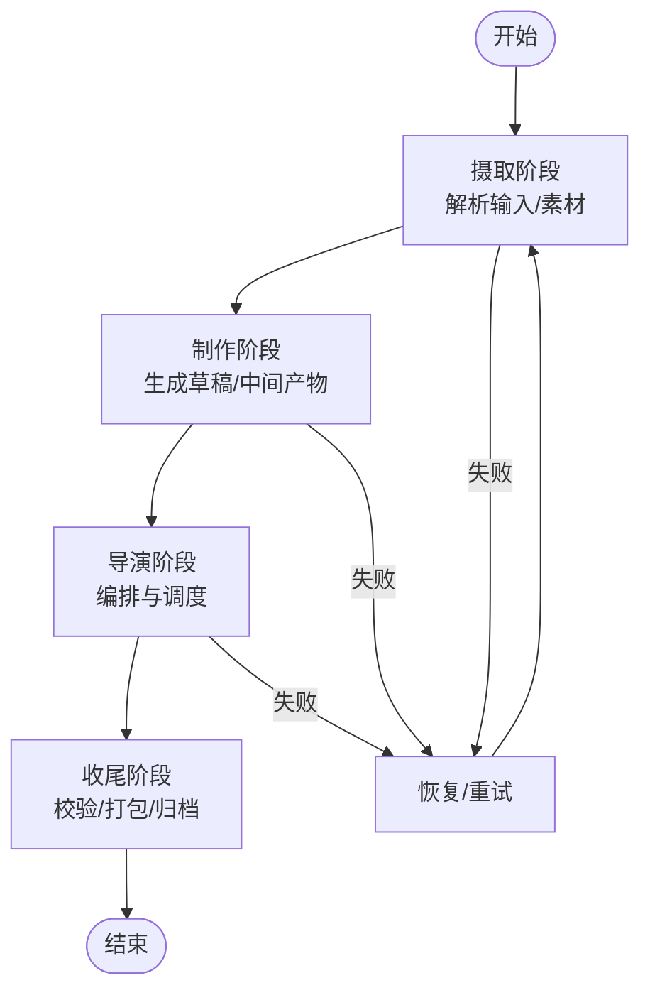
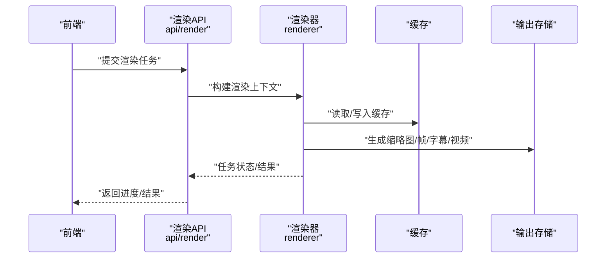
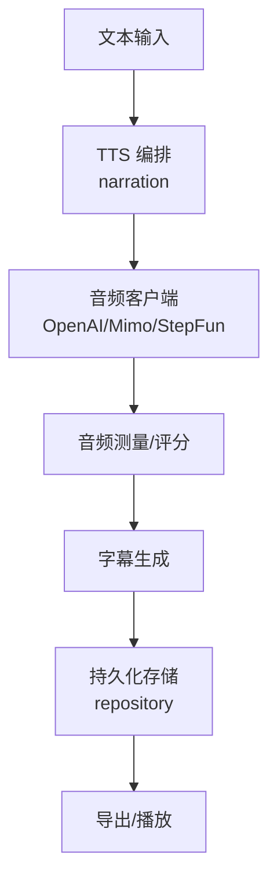
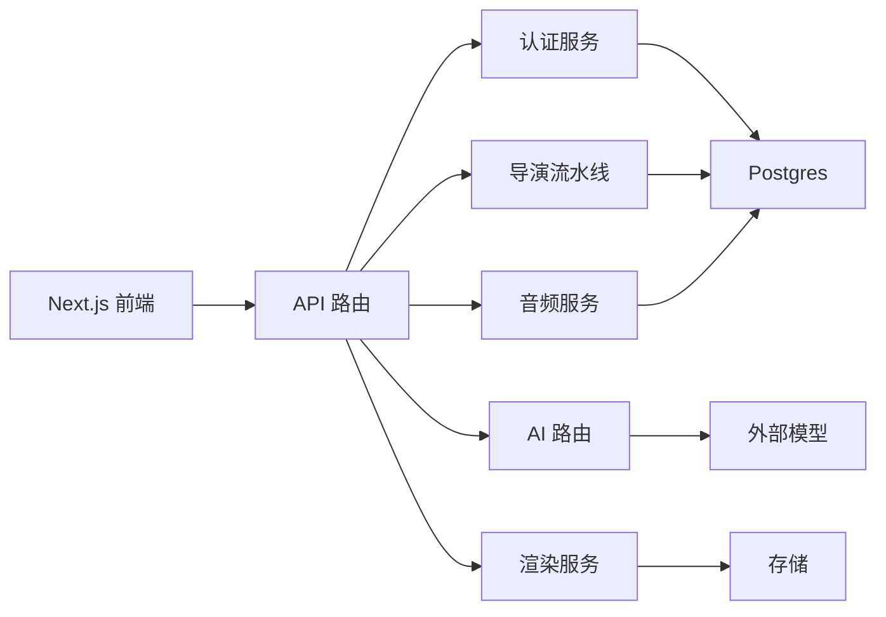

# 新功能特性

<cite>
**本文引用的文件**   
- [package.json](file://package.json)
- [next.config.ts](file://next.config.ts)
- [tsconfig.json](file://tsconfig.json)
- [vitest.config.ts](file://vitest.config.ts)
- [drizzle.config.ts](file://drizzle.config.ts)
- [docker-compose.dev.yml](file://docker-compose.dev.yml)
- [docker-compose.prod.yml](file://docker-compose.prod.yml)
- [Dockerfile](file://Dockerfile)
- [server/package.json](file://server/package.json)
- [server/tsconfig.json](file://server/tsconfig.json)
- [server/Dockerfile](file://server/Dockerfile)
- [src/app/layout.tsx](file://src/app/layout.tsx)
- [src/app/providers.tsx](file://src/app/providers.tsx)
- [src/app/(auth)/layout.tsx](file://src/app/(auth)/layout.tsx)
- [src/app/(marketing)/layout.tsx](file://src/app/(marketing)/layout.tsx)
- [src/app/(public)/layout.tsx](file://src/app/(public)/layout.tsx)
- [src/app/products/(app)/layout.tsx](file://src/app/products/(app)/layout.tsx)
- [src/app/api/auth/login/route.ts](file://src/app/api/auth/login/route.ts)
- [src/app/api/auth/signup/route.ts](file://src/app/api/auth/signup/route.ts)
- [src/app/api/auth/session/route.ts](file://src/app/api/auth/session/route.ts)
- [src/app/api/director/pipeline/route.ts](file://src/app/api/director/pipeline/route.ts)
- [src/app/api/render/route.ts](file://src/app/api/render/route.ts)
- [src/app/api/projects/route.ts](file://src/app/api/projects/route.ts)
- [src/features/auth/index.ts](file://src/features/auth/index.ts)
- [src/features/auth/account-service.ts](file://src/features/auth/account-service.ts)
- [src/features/auth/session.ts](file://src/features/auth/session.ts)
- [src/features/auth/mailer.ts](file://src/features/auth/mailer.ts)
- [src/features/ai/provider-registry.ts](file://src/features/ai/provider-registry.ts)
- [src/features/ai/model-routing.ts](file://src/features/ai/model-routing.ts)
- [src/features/audio/narration.ts](file://src/features/audio/narration.ts)
- [src/features/audio/repository.ts](file://src/features/audio/repository.ts)
- [src/features/canvas/types.ts](file://src/features/canvas/types.ts)
- [src/features/director/pipeline.ts](file://src/features/director/pipeline.ts)
- [src/features/render/renderer.ts](file://src/features/render/renderer.ts)
- [src/lib/db/index.ts](file://src/lib/db/index.ts)
- [scripts/setup/db-migrate.ts](file://scripts/setup/db-migrate.ts)
- [scripts/setup/bootstrap-credentials.ts](file://scripts/setup/bootstrap-credentials.ts)
- [deploy/reverse-proxy/Dockerfile](file://deploy/reverse-proxy/Dockerfile)
- [deploy/reverse-proxy/entrypoint.sh](file://deploy/reverse-proxy/entrypoint.sh)
</cite>

## 目录
1. [简介](#简介)
2. [项目结构](#项目结构)
3. [核心组件](#核心组件)
4. [架构总览](#架构总览)
5. [详细组件分析](#详细组件分析)
6. [依赖分析](#依赖分析)
7. [性能考量](#性能考量)
8. [故障排查指南](#故障排查指南)
9. [结论](#结论)
10. [附录](#附录)

## 简介
本文件聚焦 PurpleInk 的“新功能特性”文档，面向产品与工程读者，系统性梳理当前版本新增能力、关键流程与集成点。内容覆盖：
- 多模型 AI 提供程序注册与路由
- 导演式工作流（Director）与渲染管线
- 音频与旁白编排（TTS）
- 认证与会话管理
- 项目与制品管理
- 部署与反向代理配置

## 项目结构
仓库采用 Next.js App Router 前端与 server 子模块后端协作的双端结构，配合 Docker Compose 进行本地与生产环境编排。测试与脚本位于顶层 scripts 与 tests 目录，数据库迁移与初始化通过 Drizzle 与自定义脚本完成。

图表来源
- [docker-compose.dev.yml](file://docker-compose.dev.yml)
- [docker-compose.prod.yml](file://docker-compose.prod.yml)
- [Dockerfile](file://Dockerfile)
- [server/Dockerfile](file://server/Dockerfile)

章节来源
- [package.json](file://package.json)
- [next.config.ts](file://next.config.ts)
- [tsconfig.json](file://tsconfig.json)
- [vitest.config.ts](file://vitest.config.ts)
- [drizzle.config.ts](file://drizzle.config.ts)

## 核心组件
- 认证与会话：登录、注册、会话校验、验证码、邮件发送等能力集中封装，提供统一的鉴权中间逻辑与错误处理。
- AI 提供程序与路由：统一注册多种模型提供方，支持按目标与策略动态路由，具备回退与不可用错误处理。
- 导演式工作流：将复杂生成任务拆分为阶段（ingest/fabricate/direct/finalize），通过队列与状态机推进，保证可恢复与可观测。
- 渲染与导出：基于浏览器捕获与媒体合成，支持缩略图、帧序列、字幕与最终视频导出。
- 音频与旁白：TTS 编排、音频测量、字幕生成、队列处理与持久化存储。
- 项目与制品：项目元数据、画布状态、制品提交与预览模式。

章节来源
- [src/features/auth/index.ts](file://src/features/auth/index.ts)
- [src/features/auth/account-service.ts](file://src/features/auth/account-service.ts)
- [src/features/auth/session.ts](file://src/features/auth/session.ts)
- [src/features/auth/mailer.ts](file://src/features/auth/mailer.ts)
- [src/features/ai/provider-registry.ts](file://src/features/ai/provider-registry.ts)
- [src/features/ai/model-routing.ts](file://src/features/ai/model-routing.ts)
- [src/features/director/pipeline.ts](file://src/features/director/pipeline.ts)
- [src/features/render/renderer.ts](file://src/features/render/renderer.ts)
- [src/features/audio/narration.ts](file://src/features/audio/narration.ts)
- [src/features/audio/repository.ts](file://src/features/audio/repository.ts)
- [src/features/canvas/types.ts](file://src/features/canvas/types.ts)

## 架构总览
系统由前端页面、API 路由、业务特性层、服务端处理与基础设施组成。认证与会话贯穿所有受保护资源；AI 路由为各特性提供模型调用；导演式流水线协调多阶段任务；渲染与 TTS 作为输出侧能力。

图表来源
- [src/app/api/auth/login/route.ts](file://src/app/api/auth/login/route.ts)
- [src/app/api/auth/signup/route.ts](file://src/app/api/auth/signup/route.ts)
- [src/app/api/auth/session/route.ts](file://src/app/api/auth/session/route.ts)
- [src/app/api/director/pipeline/route.ts](file://src/app/api/director/pipeline/route.ts)
- [src/app/api/render/route.ts](file://src/app/api/render/route.ts)
- [src/app/api/projects/route.ts](file://src/app/api/projects/route.ts)
- [src/features/auth/account-service.ts](file://src/features/auth/account-service.ts)
- [src/features/ai/provider-registry.ts](file://src/features/ai/provider-registry.ts)
- [src/features/director/pipeline.ts](file://src/features/director/pipeline.ts)
- [src/features/render/renderer.ts](file://src/features/render/renderer.ts)
- [src/features/audio/narration.ts](file://src/features/audio/narration.ts)
- [src/lib/db/index.ts](file://src/lib/db/index.ts)

## 详细组件分析

### 认证与会话
- 功能要点：登录、注册、密码重置、会话校验、验证码、限流、邮件模板与失败重试。
- 关键接口：登录、注册、会话获取、登出、验证码发送与校验。
- 安全机制：密码哈希、令牌签发、限流与反爬检查。

图表来源
- [src/app/api/auth/login/route.ts](file://src/app/api/auth/login/route.ts)
- [src/features/auth/account-service.ts](file://src/features/auth/account-service.ts)
- [src/features/auth/mailer.ts](file://src/features/auth/mailer.ts)
- [src/lib/db/index.ts](file://src/lib/db/index.ts)

章节来源
- [src/app/api/auth/login/route.ts](file://src/app/api/auth/login/route.ts)
- [src/app/api/auth/signup/route.ts](file://src/app/api/auth/signup/route.ts)
- [src/app/api/auth/session/route.ts](file://src/app/api/auth/session/route.ts)
- [src/features/auth/account-service.ts](file://src/features/auth/account-service.ts)
- [src/features/auth/session.ts](file://src/features/auth/session.ts)
- [src/features/auth/mailer.ts](file://src/features/auth/mailer.ts)

### AI 提供程序与模型路由
- 功能要点：统一注册多个模型提供方（如 OpenAI 兼容、Mimo、StepFun、Gemini），按目标与策略选择提供者，支持回退与不可用错误。
- 关键能力：提供者注册表、配置校验、负载构造、路由策略、错误分类。

图表来源
- [src/features/ai/provider-registry.ts](file://src/features/ai/provider-registry.ts)
- [src/features/ai/model-routing.ts](file://src/features/ai/model-routing.ts)
- [src/features/ai/openai-compatible-audio-config.ts](file://src/features/ai/openai-compatible-audio-config.ts)
- [src/features/ai/mimo-adapter.ts](file://src/features/ai/mimo-adapter.ts)
- [src/features/ai/stepfun-adapter.ts](file://src/features/ai/stepfun-adapter.ts)

章节来源
- [src/features/ai/provider-registry.ts](file://src/features/ai/provider-registry.ts)
- [src/features/ai/model-routing.ts](file://src/features/ai/model-routing.ts)
- [src/features/ai/openai-compatible-audio-config.ts](file://src/features/ai/openai-compatible-audio-config.ts)
- [src/features/ai/mimo-adapter.ts](file://src/features/ai/mimo-adapter.ts)
- [src/features/ai/stepfun-adapter.ts](file://src/features/ai/stepfun-adapter.ts)

### 导演式工作流（Director）
- 功能要点：将复杂生成任务分解为阶段（摄取、制作、导演、收尾），每个阶段有输入/输出契约、提示词与工具集，支持跳过策略与结果合并。
- 关键能力：阶段运行器、工件读写、会话存储、恢复与回滚、进度上报。

图表来源
- [src/features/director/pipeline.ts](file://src/features/director/pipeline.ts)
- [src/app/api/director/pipeline/route.ts](file://src/app/api/director/pipeline/route.ts)

章节来源
- [src/app/api/director/pipeline/route.ts](file://src/app/api/director/pipeline/route.ts)
- [src/features/director/pipeline.ts](file://src/features/director/pipeline.ts)

### 渲染与导出
- 功能要点：基于浏览器捕获与媒体合成，支持缩略图、帧序列、字幕与最终视频导出，包含缓存与 QA 检查。
- 关键能力：渲染器、媒体装配、编码、缓存、缩略图生成、导出队列。

图表来源
- [src/app/api/render/route.ts](file://src/app/api/render/route.ts)
- [src/features/render/renderer.ts](file://src/features/render/renderer.ts)

章节来源
- [src/app/api/render/route.ts](file://src/app/api/render/route.ts)
- [src/features/render/renderer.ts](file://src/features/render/renderer.ts)

### 音频与旁白（TTS）
- 功能要点：TTS 编排、音频测量、字幕生成、队列处理与持久化存储，支持多提供商与回退。
- 关键能力：叙述队列、音频客户端、字幕格式、分数评估、运行时存储。

图表来源
- [src/features/audio/narration.ts](file://src/features/audio/narration.ts)
- [src/features/audio/repository.ts](file://src/features/audio/repository.ts)

章节来源
- [src/features/audio/narration.ts](file://src/features/audio/narration.ts)
- [src/features/audio/repository.ts](file://src/features/audio/repository.ts)

### 项目与制品
- 功能要点：项目元数据、画布状态、制品提交与预览模式，支撑创作与协作。
- 关键能力：制品提交、预览模式、画布类型定义。

章节来源
- [src/features/canvas/types.ts](file://src/features/canvas/types.ts)
- [src/app/api/projects/route.ts](file://src/app/api/projects/route.ts)

## 依赖分析
- 前端依赖：Next.js App Router、React 生态、样式与动画库。
- 后端依赖：Node.js 运行时、数据库驱动（Postgres）、消息队列（可选）。
- 外部依赖：AI 模型服务（OpenAI 兼容、Mimo、StepFun、Gemini）、邮件服务。
- 部署依赖：Docker、反向代理（Nginx/Caddy）、环境变量与密钥管理。

图表来源
- [package.json](file://package.json)
- [server/package.json](file://server/package.json)
- [drizzle.config.ts](file://drizzle.config.ts)

章节来源
- [package.json](file://package.json)
- [server/package.json](file://server/package.json)
- [drizzle.config.ts](file://drizzle.config.ts)

## 性能考量
- 渲染与导出：启用缓存、并行帧捕获、按需加载与增量更新，减少重复计算。
- 音频与 TTS：批量请求、流式响应、音频长度预估与分片处理。
- 数据库：合理索引、事务边界控制、读写分离（可选）。
- 队列与并发：限制并发度、背压与重试策略，避免雪崩。

## 故障排查指南
- 认证问题：检查会话有效性、令牌签发与过期、邮件发送失败与重试。
- AI 路由：确认提供者可用性、配置正确性与回退链是否生效。
- 导演流水线：查看阶段日志、工件状态、恢复策略与跳过策略。
- 渲染失败：检查缓存命中、媒体源合法性、编码参数与存储权限。
- 音频异常：核对 TTS 提供商配额、音频格式与字幕时间轴对齐。

章节来源
- [src/features/auth/account-service.ts](file://src/features/auth/account-service.ts)
- [src/features/ai/model-routing.ts](file://src/features/ai/model-routing.ts)
- [src/features/director/pipeline.ts](file://src/features/director/pipeline.ts)
- [src/features/render/renderer.ts](file://src/features/render/renderer.ts)
- [src/features/audio/narration.ts](file://src/features/audio/narration.ts)

## 结论
新版本在认证、AI 路由、导演式工作流、渲染与 TTS 方面形成完整闭环，具备高可扩展性与容错能力。建议在生产环境中完善监控告警、密钥管理与容量规划，持续优化缓存与队列策略以提升吞吐与稳定性。

## 附录
- 环境配置：参考 .env 示例与密钥管理脚本。
- 数据库初始化：使用迁移与种子脚本完成初始化。
- 部署说明：参考 Docker Compose 与反向代理配置。

章节来源
- [scripts/setup/db-migrate.ts](file://scripts/setup/db-migrate.ts)
- [scripts/setup/bootstrap-credentials.ts](file://scripts/setup/bootstrap-credentials.ts)
- [deploy/reverse-proxy/Dockerfile](file://deploy/reverse-proxy/Dockerfile)
- [deploy/reverse-proxy/entrypoint.sh](file://deploy/reverse-proxy/entrypoint.sh)
- [docker-compose.dev.yml](file://docker-compose.dev.yml)
- [docker-compose.prod.yml](file://docker-compose.prod.yml)