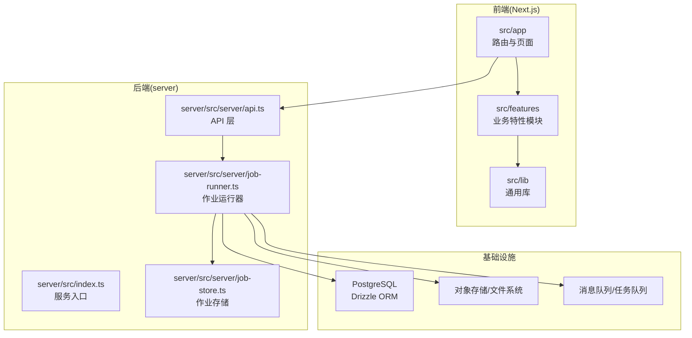
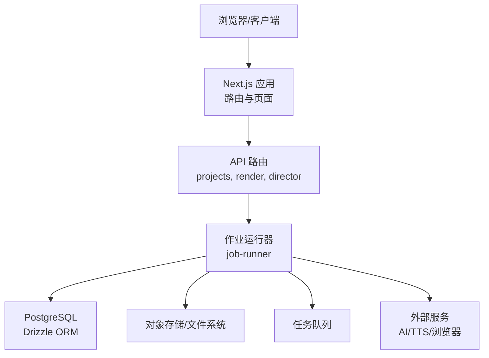
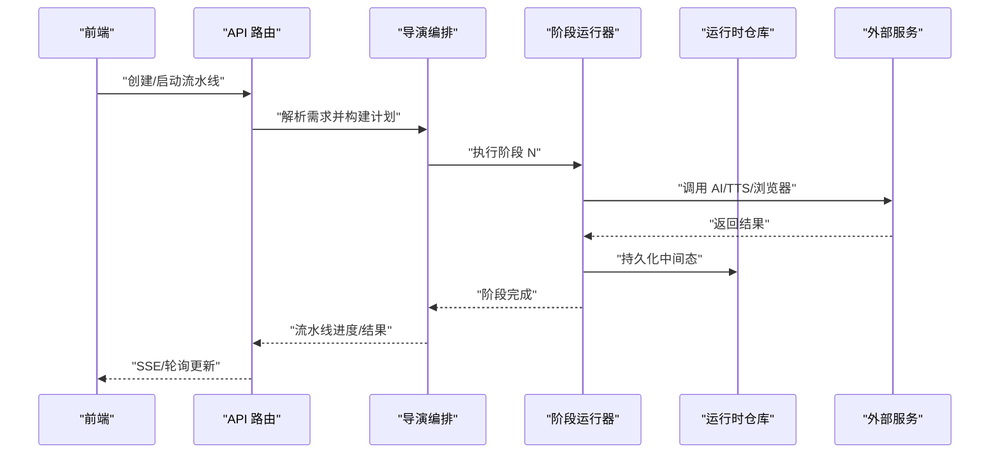
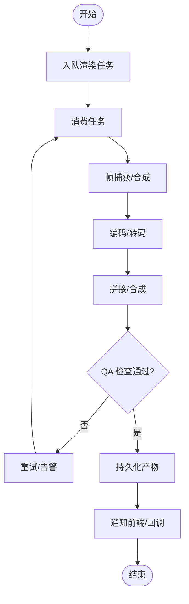
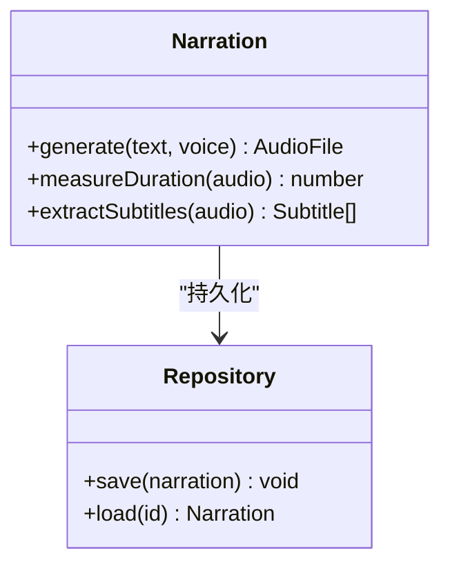
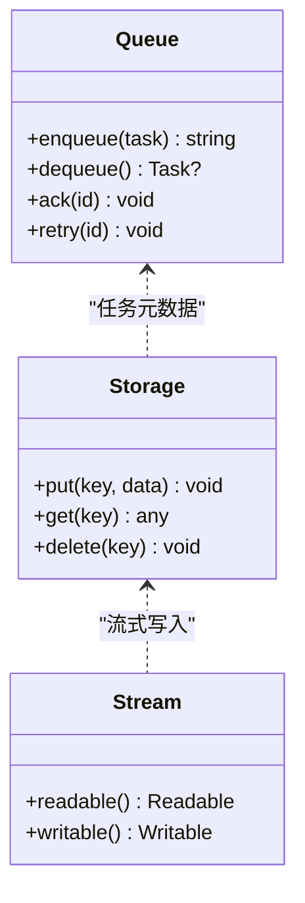
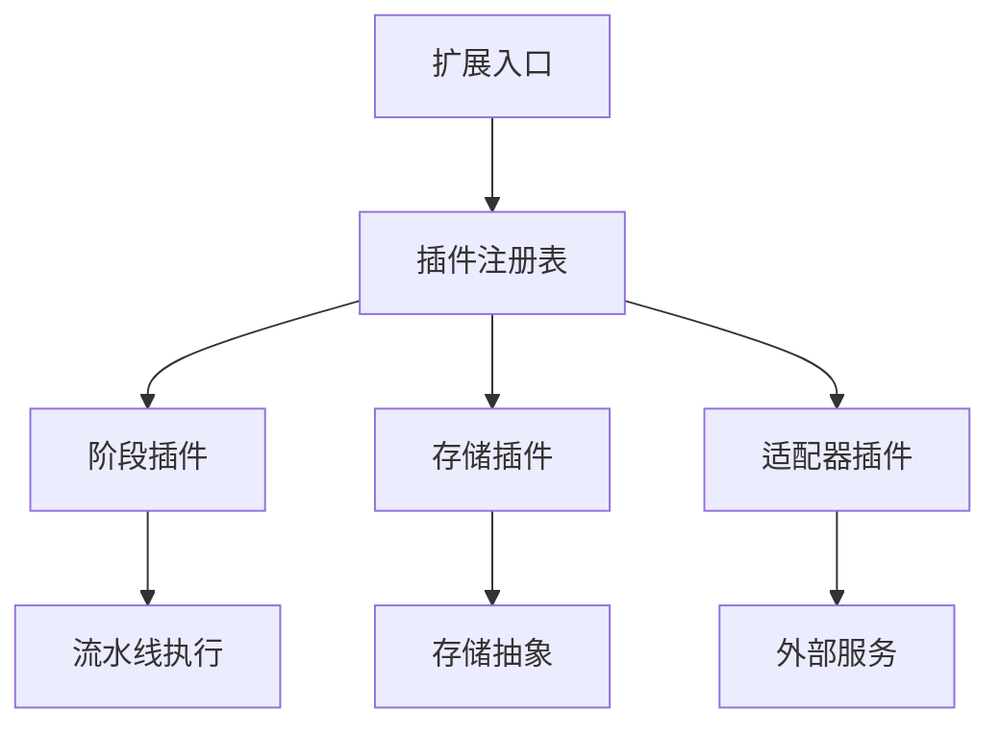
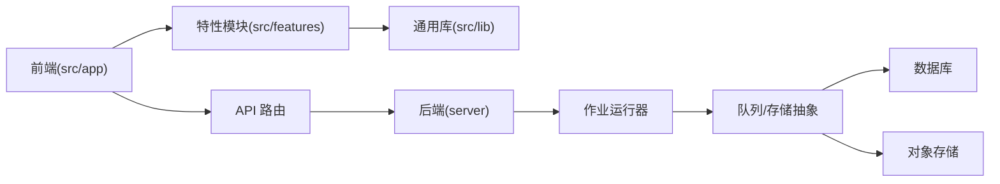

# 架构设计理念

<cite>
**本文引用的文件**   
- [package.json](file://package.json)
- [next.config.ts](file://next.config.ts)
- [tsconfig.json](file://tsconfig.json)
- [drizzle.config.ts](file://drizzle.config.ts)
- [docker-compose.dev.yml](file://docker-compose.dev.yml)
- [Dockerfile.web](file://Dockerfile.web)
- [Dockerfile.worker](file://Dockerfile.worker)
- [deploy/compose.yaml](file://deploy/compose.yaml)
- [deploy/env.example](file://deploy/env.example)
- [server/src/index.ts](file://server/src/index.ts)
- [server/src/server/api.ts](file://server/src/server/api.ts)
- [server/src/server/job-runner.ts](file://server/src/server/job-runner.ts)
- [server/src/server/job-store.ts](file://server/src/server/job-store.ts)
- [src/app/layout.tsx](file://src/app/layout.tsx)
- [src/app/providers.tsx](file://src/app/providers.tsx)
- [src/app/(auth)/layout.tsx](file://src/app/(auth)/layout.tsx)
- [src/app/(marketing)/layout.tsx](file://src/app/(marketing)/layout.tsx)
- [src/app/products/(app)/layout.tsx](file://src/app/products/(app)/layout.tsx)
- [src/app/products/(app)/canvas/[projectId]/page.tsx](file://src/app/products/(app)/canvas/[projectId]/page.tsx)
- [src/app/api/projects/route.ts](file://src/app/api/projects/route.ts)
- [src/app/api/render/route.ts](file://src/app/api/render/route.ts)
- [src/app/api/director/pipeline/route.ts](file://src/app/api/director/pipeline/route.ts)
- [src/features/director/advance.ts](file://src/features/director/advance.ts)
- [src/features/director/pipeline.ts](file://src/features/director/pipeline.ts)
- [src/features/director/stage-runner.ts](file://src/features/director/stage-runner.ts)
- [src/features/director/runtime-repository.ts](file://src/features/director/runtime-repository.ts)
- [src/features/render/renderer.ts](file://src/features/render/renderer.ts)
- [src/features/render/export-service.ts](file://src/features/render/export-service.ts)
- [src/features/render/queue-handler.ts](file://src/features/render/queue-handler.ts)
- [src/features/audio/narration.ts](file://src/features/audio/narration.ts)
- [src/features/audio/repository.ts](file://src/features/audio/repository.ts)
- [src/lib/queue/index.ts](file://src/lib/queue/index.ts)
- [src/lib/storage/index.ts](file://src/lib/storage/index.ts)
- [src/lib/stream/index.ts](file://src/lib/stream/index.ts)
- [src/instrumentation.ts](file://src/instrumentation.ts)
</cite>

## 目录
1. [简介](#简介)
2. [项目结构](#项目结构)
3. [核心组件](#核心组件)
4. [架构总览](#架构总览)
5. [详细组件分析](#详细组件分析)
6. [依赖关系分析](#依赖关系分析)
7. [性能考量](#性能考量)
8. [故障排查指南](#故障排查指南)
9. [结论](#结论)
10. [附录](#附录)

## 简介
本文件面向 PurpleInk 平台的架构设计理念，围绕分层架构、模块化设计与事件驱动模式展开，解释前后端分离与微服务化部署策略，并阐述插件化扩展能力。文档涵盖系统边界定义、组件交互模式与数据流向，说明如何通过清晰的职责划分、可插拔的运行时与队列化任务处理，支撑系统的可扩展性、可维护性与性能优化。同时提供架构图与组件关系图，帮助读者快速建立整体认知。

## 项目结构
PurpleInk 采用 Next.js 应用作为前端与 API 入口，配合独立的 server 子工程承载渲染与编排等重负载工作；通过 Docker Compose 进行本地与生产编排，使用 Drizzle ORM 管理数据库模型与迁移。关键目录职责如下：
- src/app：Next.js App Router 路由与页面组织，按功能域拆分（认证、营销、产品应用等），API 路由位于 api 目录。
- src/features：按业务域划分的特性模块（导演编排、渲染、音频、AI、凭证、导航等），体现模块化设计。
- src/lib：跨领域通用库（队列、存储、流式传输、TTS、工作流等）。
- server：独立 Node 服务，包含 API、作业运行器与作业存储，用于执行渲染、采集、TTS 等耗时任务。
- deploy：容器编排与环境配置示例。
- scripts：迁移、验证与工具脚本。

**图表来源** 
- [src/app/layout.tsx:1-50](file://src/app/layout.tsx#L1-L50)
- [src/app/providers.tsx:1-50](file://src/app/providers.tsx#L1-L50)
- [server/src/index.ts:1-50](file://server/src/index.ts#L1-L50)
- [server/src/server/api.ts:1-50](file://server/src/server/api.ts#L1-L50)
- [server/src/server/job-runner.ts:1-50](file://server/src/server/job-runner.ts#L1-L50)
- [server/src/server/job-store.ts:1-50](file://server/src/server/job-store.ts#L1-L50)
- [drizzle.config.ts:1-50](file://drizzle.config.ts#L1-L50)

**章节来源**
- [package.json:1-50](file://package.json#L1-L50)
- [next.config.ts:1-50](file://next.config.ts#L1-L50)
- [tsconfig.json:1-50](file://tsconfig.json#L1-L50)
- [drizzle.config.ts:1-50](file://drizzle.config.ts#L1-L50)
- [docker-compose.dev.yml:1-50](file://docker-compose.dev.yml#L1-L50)
- [Dockerfile.web:1-50](file://Dockerfile.web#L1-L50)
- [Dockerfile.worker:1-50](file://Dockerfile.worker#L1-L50)
- [deploy/compose.yaml:1-50](file://deploy/compose.yaml#L1-L50)
- [deploy/env.example:1-50](file://deploy/env.example#L1-L50)

## 核心组件
- 前端应用壳与提供者：负责主题、国际化、状态管理等全局上下文注入，确保 UI 一致性。
- 特性模块（features）：以业务域为边界组织代码，如导演编排、渲染、音频、AI、凭证、导航等，降低耦合度，提升可测试性。
- 后端服务：提供 API 接口，协调作业调度与执行，持久化中间态与结果。
- 队列与存储：统一的任务队列抽象与存储抽象，支持多种后端实现，便于横向扩展与替换。
- 流式传输：支持长连接与实时反馈，提升用户体验。

**章节来源**
- [src/app/layout.tsx:1-50](file://src/app/layout.tsx#L1-L50)
- [src/app/providers.tsx:1-50](file://src/app/providers.tsx#L1-L50)
- [src/features/director/pipeline.ts:1-50](file://src/features/director/pipeline.ts#L1-L50)
- [src/features/render/renderer.ts:1-50](file://src/features/render/renderer.ts#L1-L50)
- [src/features/audio/narration.ts:1-50](file://src/features/audio/narration.ts#L1-L50)
- [src/lib/queue/index.ts:1-50](file://src/lib/queue/index.ts#L1-L50)
- [src/lib/storage/index.ts:1-50](file://src/lib/storage/index.ts#L1-L50)
- [src/lib/stream/index.ts:1-50](file://src/lib/stream/index.ts#L1-L50)

## 架构总览
PurpleInk 采用“前后端分离 + 微服务化部署”的总体架构：
- 前端（Next.js）负责用户界面、路由与轻量 API 聚合，通过 REST/SSE/WebSocket 与后端交互。
- 后端（server）承担重计算与外部集成（浏览器采集、渲染、TTS、AI 调用等），通过作业队列与存储抽象解耦。
- 数据库（PostgreSQL）由 Drizzle ORM 管理，保证类型安全与迁移一致性。
- 对象存储用于媒体资源与产物持久化。
- 消息队列用于削峰填谷与异步任务处理。

**图表来源** 
- [src/app/api/projects/route.ts:1-50](file://src/app/api/projects/route.ts#L1-L50)
- [src/app/api/render/route.ts:1-50](file://src/app/api/render/route.ts#L1-L50)
- [src/app/api/director/pipeline/route.ts:1-50](file://src/app/api/director/pipeline/route.ts#L1-L50)
- [server/src/server/api.ts:1-50](file://server/src/server/api.ts#L1-L50)
- [server/src/server/job-runner.ts:1-50](file://server/src/server/job-runner.ts#L1-L50)
- [drizzle.config.ts:1-50](file://drizzle.config.ts#L1-L50)

## 详细组件分析

### 导演编排子系统（Director）
导演编排负责将用户需求转化为可执行的阶段流水线，包括需求解析、分镜计划生成、阶段执行与结果提交。其核心流程如下：
- 接收上游请求（如从 API 路由进入）。
- 构建或加载项目上下文与阶段定义。
- 依次执行各阶段（采集、生成、合成、校验等），并通过运行时仓库持久化中间状态。
- 在阶段间传递工件（artifacts），必要时触发外部服务（AI、TTS、浏览器）。

**图表来源** 
- [src/app/api/director/pipeline/route.ts:1-50](file://src/app/api/director/pipeline/route.ts#L1-L50)
- [src/features/director/advance.ts:1-50](file://src/features/director/advance.ts#L1-L50)
- [src/features/director/pipeline.ts:1-50](file://src/features/director/pipeline.ts#L1-L50)
- [src/features/director/stage-runner.ts:1-50](file://src/features/director/stage-runner.ts#L1-L50)
- [src/features/director/runtime-repository.ts:1-50](file://src/features/director/runtime-repository.ts#L1-L50)

**章节来源**
- [src/app/api/director/pipeline/route.ts:1-50](file://src/app/api/director/pipeline/route.ts#L1-L50)
- [src/features/director/advance.ts:1-50](file://src/features/director/advance.ts#L1-L50)
- [src/features/director/pipeline.ts:1-50](file://src/features/director/pipeline.ts#L1-L50)
- [src/features/director/stage-runner.ts:1-50](file://src/features/director/stage-runner.ts#L1-L50)
- [src/features/director/runtime-repository.ts:1-50](file://src/features/director/runtime-repository.ts#L1-L50)

### 渲染子系统（Render）
渲染子系统负责将项目与分镜计划转换为最终媒体产物，包括帧捕获、编码、拼接、缩略图生成与导出。其关键特点：
- 基于队列的任务处理，支持并发控制与重试。
- 与对象存储交互，读写帧序列与最终产物。
- 提供 QA 检查与视觉校验，保障输出质量。

**图表来源** 
- [src/features/render/renderer.ts:1-50](file://src/features/render/renderer.ts#L1-L50)
- [src/features/render/export-service.ts:1-50](file://src/features/render/export-service.ts#L1-L50)
- [src/features/render/queue-handler.ts:1-50](file://src/features/render/queue-handler.ts#L1-L50)

**章节来源**
- [src/app/api/render/route.ts:1-50](file://src/app/api/render/route.ts#L1-L50)
- [src/features/render/renderer.ts:1-50](file://src/features/render/renderer.ts#L1-L50)
- [src/features/render/export-service.ts:1-50](file://src/features/render/export-service.ts#L1-L50)
- [src/features/render/queue-handler.ts:1-50](file://src/features/render/queue-handler.ts#L1-L50)

### 音频与旁白（Audio & Narration）
音频模块负责旁白生成、字幕提取、音效管理与时长测量，并与 TTS 服务协作：
- 文本到语音（TTS）生成旁白音频。
- 音频片段测量与对齐，确保与画面同步。
- 字幕与时间轴信息持久化，供播放器使用。

**图表来源** 
- [src/features/audio/narration.ts:1-50](file://src/features/audio/narration.ts#L1-L50)
- [src/features/audio/repository.ts:1-50](file://src/features/audio/repository.ts#L1-L50)

**章节来源**
- [src/features/audio/narration.ts:1-50](file://src/features/audio/narration.ts#L1-L50)
- [src/features/audio/repository.ts:1-50](file://src/features/audio/repository.ts#L1-L50)

### 队列与存储抽象（Queue & Storage）
队列与存储抽象为系统提供统一的异步任务与数据持久化能力：
- 队列抽象支持多种实现（内存、Redis、数据库等），便于扩展与替换。
- 存储抽象屏蔽底层差异（本地文件、对象存储），统一读写接口。
- 结合流式传输，支持大文件与长任务的增量处理。

**图表来源** 
- [src/lib/queue/index.ts:1-50](file://src/lib/queue/index.ts#L1-L50)
- [src/lib/storage/index.ts:1-50](file://src/lib/storage/index.ts#L1-L50)
- [src/lib/stream/index.ts:1-50](file://src/lib/stream/index.ts#L1-L50)

**章节来源**
- [src/lib/queue/index.ts:1-50](file://src/lib/queue/index.ts#L1-L50)
- [src/lib/storage/index.ts:1-50](file://src/lib/storage/index.ts#L1-L50)
- [src/lib/stream/index.ts:1-50](file://src/lib/stream/index.ts#L1-L50)

### 插件系统与扩展点
PurpleInk 通过以下机制支持插件化扩展：
- 阶段插件：导演编排的阶段运行器允许注册自定义阶段逻辑，实现业务流程扩展。
- 存储/队列插件：通过抽象接口接入不同实现，适配多环境。
- 外部服务适配器：AI、TTS、浏览器驱动等均可通过适配器模式替换或扩展。

[本图为概念性流程图，不直接映射具体源码文件]

## 依赖关系分析
- 前端依赖特性模块与通用库，通过 API 路由与后端通信。
- 后端服务依赖作业运行器与存储/队列抽象，间接依赖数据库与对象存储。
- 特性模块之间通过明确的接口与契约交互，避免循环依赖。
- 外部服务通过适配器隔离，降低耦合度。

**图表来源** 
- [src/app/layout.tsx:1-50](file://src/app/layout.tsx#L1-L50)
- [src/features/director/pipeline.ts:1-50](file://src/features/director/pipeline.ts#L1-L50)
- [src/lib/queue/index.ts:1-50](file://src/lib/queue/index.ts#L1-L50)
- [src/lib/storage/index.ts:1-50](file://src/lib/storage/index.ts#L1-L50)
- [server/src/server/job-runner.ts:1-50](file://server/src/server/job-runner.ts#L1-L50)

**章节来源**
- [src/app/layout.tsx:1-50](file://src/app/layout.tsx#L1-L50)
- [src/features/director/pipeline.ts:1-50](file://src/features/director/pipeline.ts#L1-L50)
- [src/lib/queue/index.ts:1-50](file://src/lib/queue/index.ts#L1-L50)
- [src/lib/storage/index.ts:1-50](file://src/lib/storage/index.ts#L1-L50)
- [server/src/server/job-runner.ts:1-50](file://server/src/server/job-runner.ts#L1-L50)

## 性能考量
- 异步与并行：通过队列与作业运行器实现任务并行处理，提高吞吐。
- 流式处理：大文件与长任务采用流式读写，降低内存占用。
- 缓存与复用：对重复计算与外部调用结果进行缓存，减少延迟。
- 资源隔离：前后端与 worker 进程分离，避免相互影响。
- 监控与指标：通过 instrumentation 收集关键指标，辅助性能调优。

[本节为通用指导，不直接分析具体文件]

## 故障排查指南
- 日志与追踪：启用结构化日志与链路追踪，定位问题根因。
- 队列积压：检查队列消费者数量与任务耗时，调整并发与超时策略。
- 存储异常：验证存储连接与权限，检查磁盘空间与网络连通性。
- 外部服务失败：实现重试与降级策略，记录错误上下文。
- 数据库锁与慢查询：使用 Drizzle 查询分析与索引优化。

**章节来源**
- [src/instrumentation.ts:1-50](file://src/instrumentation.ts#L1-L50)
- [server/src/server/job-runner.ts:1-50](file://server/src/server/job-runner.ts#L1-L50)
- [src/lib/queue/index.ts:1-50](file://src/lib/queue/index.ts#L1-L50)
- [src/lib/storage/index.ts:1-50](file://src/lib/storage/index.ts#L1-L50)

## 结论
PurpleInk 平台通过分层架构、模块化设计与事件驱动模式，实现了清晰的前后端分离与微服务化部署。导演编排与渲染子系统解耦了复杂业务流程，队列与存储抽象提升了可扩展性与可维护性。插件系统与适配器模式为未来扩展预留了充足空间。整体架构在保证性能的同时，兼顾了可靠性与可观测性，适合持续演进与规模化部署。

[本节为总结性内容，不直接分析具体文件]

## 附录
- 部署参考：docker-compose.dev.yml 与 deploy/compose.yaml 提供本地与生产编排示例。
- 环境变量：deploy/env.example 列出关键环境变量与默认值。
- 构建与运行：Dockerfile.web 与 Dockerfile.worker 分别定义前端与 worker 镜像构建流程。

**章节来源**
- [docker-compose.dev.yml:1-50](file://docker-compose.dev.yml#L1-L50)
- [deploy/compose.yaml:1-50](file://deploy/compose.yaml#L1-L50)
- [deploy/env.example:1-50](file://deploy/env.example#L1-L50)
- [Dockerfile.web:1-50](file://Dockerfile.web#L1-L50)
- [Dockerfile.worker:1-50](file://Dockerfile.worker#L1-L50)