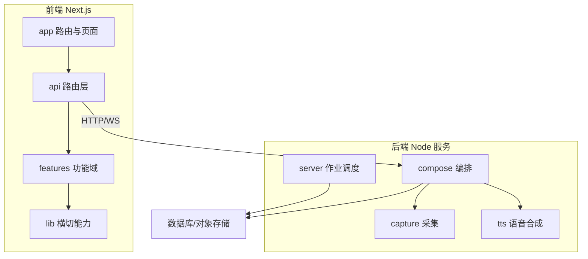
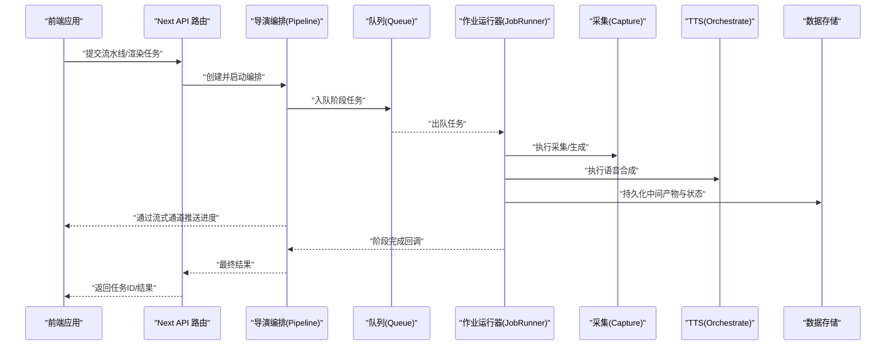
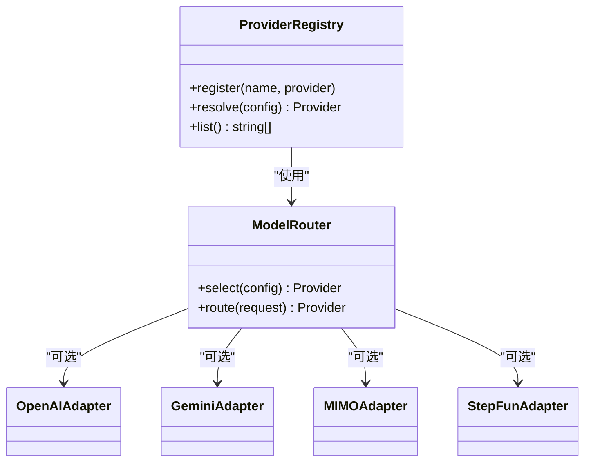
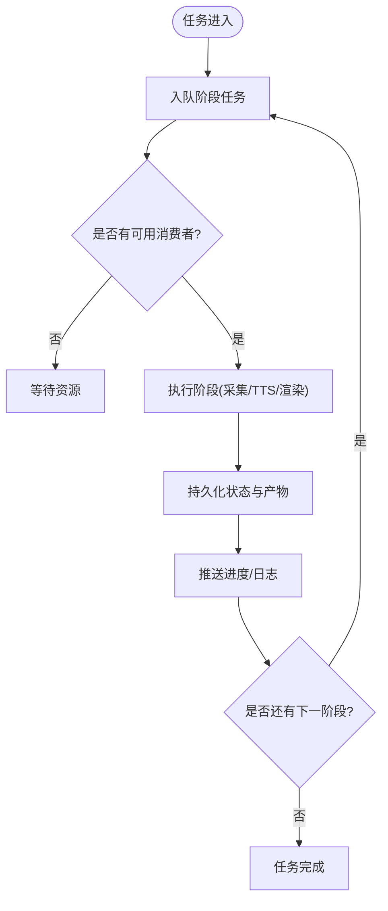
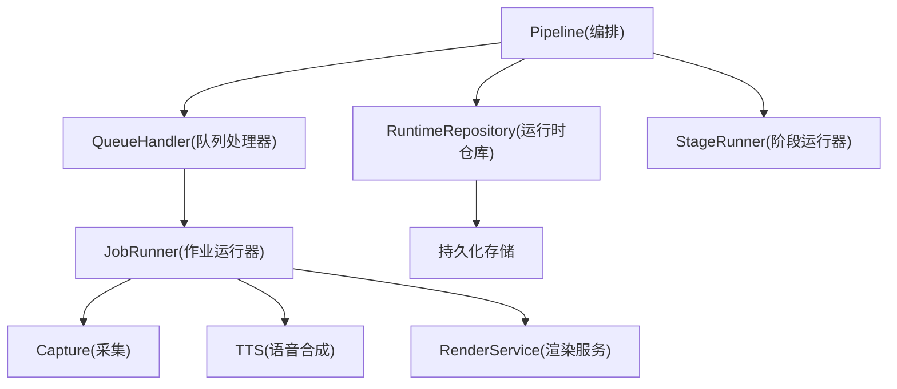

# 架构设计理念

<cite>
**本文引用的文件**   
- [src/app/providers.tsx](file://src/app/providers.tsx)
- [src/features/ai/provider-registry.ts](file://src/features/ai/provider-registry.ts)
- [src/features/ai/model-routing.ts](file://src/features/ai/model-routing.ts)
- [src/features/director/pipeline.ts](file://src/features/director/pipeline.ts)
- [src/features/director/queue-handler.ts](file://src/features/director/queue-handler.ts)
- [src/features/director/stage-runner.ts](file://src/features/director/stage-runner.ts)
- [src/features/director/runtime-repository.ts](file://src/features/director/runtime-repository.ts)
- [src/features/render/export-service.ts](file://src/features/render/export-service.ts)
- [src/features/render/queue-handler.ts](file://src/features/render/queue-handler.ts)
- [server/src/server/job-runner.ts](file://server/src/server/job-runner.ts)
- [server/src/server/job-store.ts](file://server/src/server/job-store.ts)
- [server/src/compose/run-pipeline.ts](file://server/src/compose/run-pipeline.ts)
- [server/src/capture/run-capture.ts](file://server/src/capture/run-capture.ts)
- [server/src/tts/orchestrate.ts](file://server/src/tts/orchestrate.ts)
- [src/lib/queue/index.ts](file://src/lib/queue/index.ts)
- [src/lib/stream/index.ts](file://src/lib/stream/index.ts)
- [src/app/api/director/pipeline/route.ts](file://src/app/api/director/pipeline/route.ts)
- [src/app/api/render/route.ts](file://src/app/api/render/route.ts)
- [src/app/api/jobs/[id]/route.ts](file://src/app/api/jobs/[id]/route.ts)
- [next.config.ts](file://next.config.ts)
- [docker-compose.dev.yml](file://docker-compose.dev.yml)
- [docker-compose.prod.yml](file://docker-compose.prod.yml)
</cite>

## 目录
1. [引言](#引言)
2. [项目结构](#项目结构)
3. [核心组件](#核心组件)
4. [架构总览](#架构总览)
5. [详细组件分析](#详细组件分析)
6. [依赖关系分析](#依赖关系分析)
7. [性能考量](#性能考量)
8. [故障排查指南](#故障排查指南)
9. [结论](#结论)
10. [附录](#附录)

## 引言
本设计文档面向PurpleInk项目的整体架构与理念，围绕模块化、Provider模式、事件驱动、分层架构、插件化系统与微服务边界展开。目标是为开发者提供清晰的设计思路与落地指引，帮助理解系统如何按功能域组织代码、如何通过统一接口抽象AI提供商、如何实现异步任务与状态同步、以及前后端分离与独立进程的服务划分。

## 项目结构
PurpleInk采用“前端Next.js应用 + 后端Node服务”的双端结构：
- 前端（src）：基于Next.js App Router，按路由与功能域组织页面、API路由与组件。
- 后端（server/src）：独立的Node服务，负责编排流水线、渲染导出、采集与TTS等重计算任务。
- 共享能力（src/lib）：队列、流式处理、存储、配置等横切能力。
- 部署（deploy/docker-compose.*）：开发/生产环境编排，包含反向代理与数据库等基础设施。

图表来源
- [next.config.ts](file://next.config.ts)
- [docker-compose.dev.yml](file://docker-compose.dev.yml)
- [docker-compose.prod.yml](file://docker-compose.prod.yml)

章节来源
- [next.config.ts](file://next.config.ts)
- [docker-compose.dev.yml](file://docker-compose.dev.yml)
- [docker-compose.prod.yml](file://docker-compose.prod.yml)

## 核心组件
- 模块化架构：以 features 为功能域边界，每个领域内再细分模块（如 ai、director、render、auth 等），通过清晰的接口契约降低耦合。
- Provider 模式：在 AI 领域实现统一的模型/音频提供商抽象，支持动态注册与选择，屏蔽不同厂商差异。
- 事件驱动：通过队列与流式通道解耦生产者与消费者，实现异步任务处理、进度推送与状态同步。
- 分层架构：表现层（Next 页面/API）、业务逻辑层（features 中的服务与编排）、数据访问层（仓库/持久化）。
- 插件化系统：工具集与模板通过注册表扩展，新增能力无需改动核心流程。
- 微服务考虑：前后端分离、独立进程运行、可水平扩展的无状态服务与有状态的数据层。

章节来源
- [src/features/ai/provider-registry.ts](file://src/features/ai/provider-registry.ts)
- [src/features/director/pipeline.ts](file://src/features/director/pipeline.ts)
- [src/lib/queue/index.ts](file://src/lib/queue/index.ts)
- [src/lib/stream/index.ts](file://src/lib/stream/index.ts)

## 架构总览
下图展示从前端请求到后端流水线执行、再到结果回传的端到端流程，体现分层与事件驱动的核心思想。

图表来源
- [src/app/api/director/pipeline/route.ts](file://src/app/api/director/pipeline/route.ts)
- [src/features/director/pipeline.ts](file://src/features/director/pipeline.ts)
- [src/lib/queue/index.ts](file://src/lib/queue/index.ts)
- [server/src/server/job-runner.ts](file://server/src/server/job-runner.ts)
- [server/src/capture/run-capture.ts](file://server/src/capture/run-capture.ts)
- [server/src/tts/orchestrate.ts](file://server/src/tts/orchestrate.ts)
- [server/src/server/job-store.ts](file://server/src/server/job-store.ts)

## 详细组件分析

### 模块化架构与功能域组织
- 原则：以 features 为边界，每个功能域自包含类型、服务、测试与用例；跨域通过 lib 提供的通用能力协作。
- 好处：高内聚低耦合、易于定位问题、便于并行开发与回归测试。
- 典型域：ai（模型与提供商）、director（导演编排与阶段）、render（渲染与导出）、auth（认证与会话）、audio（音频处理）、routing（媒体路由）。

章节来源
- [src/features/ai/provider-registry.ts](file://src/features/ai/provider-registry.ts)
- [src/features/director/pipeline.ts](file://src/features/director/pipeline.ts)
- [src/features/render/export-service.ts](file://src/features/render/export-service.ts)

### Provider 模式：AI 提供商统一接口与动态加载
- 统一接口：定义模型调用、音频合成、配置校验等契约，屏蔽不同厂商差异。
- 动态加载：通过注册表集中管理提供商实例，运行时根据配置或路由策略选择具体实现。
- 路由策略：依据模型名称、质量、成本等维度进行决策，支持热插拔新提供商。

图表来源
- [src/features/ai/provider-registry.ts](file://src/features/ai/provider-registry.ts)
- [src/features/ai/model-routing.ts](file://src/features/ai/model-routing.ts)

章节来源
- [src/features/ai/provider-registry.ts](file://src/features/ai/provider-registry.ts)
- [src/features/ai/model-routing.ts](file://src/features/ai/model-routing.ts)

### 事件驱动架构：异步任务、状态同步与消息传递
- 队列机制：将阶段任务入队，由作业运行器消费执行，解耦请求与处理。
- 状态同步：通过持久化的运行时仓库记录阶段状态与产物，供前端轮询或流式推送。
- 消息传递：使用流式通道实时推送进度与日志，提升交互体验。

图表来源
- [src/lib/queue/index.ts](file://src/lib/queue/index.ts)
- [src/lib/stream/index.ts](file://src/lib/stream/index.ts)
- [src/features/director/queue-handler.ts](file://src/features/director/queue-handler.ts)
- [src/features/director/runtime-repository.ts](file://src/features/director/runtime-repository.ts)

章节来源
- [src/lib/queue/index.ts](file://src/lib/queue/index.ts)
- [src/lib/stream/index.ts](file://src/lib/stream/index.ts)
- [src/features/director/queue-handler.ts](file://src/features/director/queue-handler.ts)
- [src/features/director/runtime-repository.ts](file://src/features/director/runtime-repository.ts)

### 分层架构：表现层、业务逻辑层、数据访问层
- 表现层：Next 页面与 API 路由，负责请求解析、鉴权、响应封装与错误映射。
- 业务逻辑层：features 下的服务与编排（如 Pipeline、ExportService），实现领域规则与工作流。
- 数据访问层：仓库与持久化（如 RuntimeRepository、JobStore），屏蔽底层存储细节。

图表来源
- [src/app/api/director/pipeline/route.ts](file://src/app/api/director/pipeline/route.ts)
- [src/features/director/pipeline.ts](file://src/features/director/pipeline.ts)
- [src/features/director/runtime-repository.ts](file://src/features/director/runtime-repository.ts)
- [server/src/server/job-store.ts](file://server/src/server/job-store.ts)

章节来源
- [src/app/api/director/pipeline/route.ts](file://src/app/api/director/pipeline/route.ts)
- [src/features/director/pipeline.ts](file://src/features/director/pipeline.ts)
- [src/features/director/runtime-repository.ts](file://src/features/director/runtime-repository.ts)
- [server/src/server/job-store.ts](file://server/src/server/job-store.ts)

### 插件化系统：可扩展工具集与模板系统
- 工具集：通过注册表扩展导演阶段的工具能力，新增工具不影响既有流程。
- 模板系统：渲染与编排阶段支持模板注入，便于快速适配不同输出格式与风格。
- 扩展点：在关键阶段暴露钩子，允许外部插件介入数据处理与结果组装。

章节来源
- [src/features/director/stage-runner.ts](file://src/features/director/stage-runner.ts)
- [server/src/compose/run-pipeline.ts](file://server/src/compose/run-pipeline.ts)

### 微服务架构考虑：前后端分离与独立进程
- 前后端分离：前端为静态站点+API路由，后端为独立Node服务，职责清晰、可独立部署。
- 独立进程：后端服务承载重计算任务（采集、渲染、TTS），可通过容器化横向扩展。
- 通信协议：HTTP/REST用于常规请求，WebSocket/Server-Sent Events用于实时推送。
- 部署编排：通过 docker-compose 管理多服务与依赖，支持开发与生产环境一致性。

章节来源
- [next.config.ts](file://next.config.ts)
- [docker-compose.dev.yml](file://docker-compose.dev.yml)
- [docker-compose.prod.yml](file://docker-compose.prod.yml)

## 依赖关系分析
- 低耦合：features 之间通过 lib 能力与明确接口协作，避免直接依赖。
- 可替换性：Provider 与工具集通过注册表注入，便于替换与升级。
- 可扩展性：队列与流式通道使新增消费者与处理器成为可能，不影响现有链路。

图表来源
- [src/features/director/pipeline.ts](file://src/features/director/pipeline.ts)
- [src/features/director/runtime-repository.ts](file://src/features/director/runtime-repository.ts)
- [src/features/director/queue-handler.ts](file://src/features/director/queue-handler.ts)
- [server/src/server/job-runner.ts](file://server/src/server/job-runner.ts)
- [server/src/capture/run-capture.ts](file://server/src/capture/run-capture.ts)
- [server/src/tts/orchestrate.ts](file://server/src/tts/orchestrate.ts)
- [src/features/render/export-service.ts](file://src/features/render/export-service.ts)

章节来源
- [src/features/director/pipeline.ts](file://src/features/director/pipeline.ts)
- [src/features/director/runtime-repository.ts](file://src/features/director/runtime-repository.ts)
- [src/features/director/queue-handler.ts](file://src/features/director/queue-handler.ts)
- [server/src/server/job-runner.ts](file://server/src/server/job-runner.ts)
- [server/src/capture/run-capture.ts](file://server/src/capture/run-capture.ts)
- [server/src/tts/orchestrate.ts](file://server/src/tts/orchestrate.ts)
- [src/features/render/export-service.ts](file://src/features/render/export-service.ts)

## 性能考量
- 异步与并发：队列与作业运行器支持并发消费，合理设置并发度以避免资源争用。
- 缓存与复用：中间产物与结果持久化，减少重复计算与网络开销。
- 流式传输：大文件或长任务通过流式推送，降低内存峰值与首屏延迟。
- 资源隔离：重计算任务在后端独立进程执行，避免阻塞前端请求线程。

[本节为通用指导，不直接分析具体文件]

## 故障排查指南
- 任务失败定位：查看队列处理器与作业运行器的日志，确认阶段异常与重试策略。
- 状态不一致：检查运行时仓库与持久化存储的一致性，必要时进行补偿与恢复。
- 提供商异常：验证配置与凭据，观察路由策略是否正确选择提供商。
- 性能瓶颈：监控队列积压、作业耗时与资源利用率，调整并发与批大小。

章节来源
- [src/features/director/queue-handler.ts](file://src/features/director/queue-handler.ts)
- [server/src/server/job-runner.ts](file://server/src/server/job-runner.ts)
- [src/features/director/runtime-repository.ts](file://src/features/director/runtime-repository.ts)
- [src/features/ai/model-routing.ts](file://src/features/ai/model-routing.ts)

## 结论
PurpleInk通过模块化、Provider模式、事件驱动与分层架构，构建了可扩展、可维护且高性能的系统。前后端分离与独立进程进一步提升了部署灵活性与弹性伸缩能力。未来可在插件化与微服务边界上继续演进，以满足更复杂的业务需求。

[本节为总结性内容，不直接分析具体文件]

## 附录
- 关键入口与集成点：
  - 前端API路由：[src/app/api/director/pipeline/route.ts](file://src/app/api/director/pipeline/route.ts)、[src/app/api/render/route.ts](file://src/app/api/render/route.ts)、[src/app/api/jobs/[id]/route.ts](file://src/app/api/jobs/[id]/route.ts)
  - 后端作业调度：[server/src/server/job-runner.ts](file://server/src/server/job-runner.ts)、[server/src/server/job-store.ts](file://server/src/server/job-store.ts)
  - 编排与执行：[server/src/compose/run-pipeline.ts](file://server/src/compose/run-pipeline.ts)、[server/src/capture/run-capture.ts](file://server/src/capture/run-capture.ts)、[server/src/tts/orchestrate.ts](file://server/src/tts/orchestrate.ts)
  - 前端提供者与上下文：[src/app/providers.tsx](file://src/app/providers.tsx)

章节来源
- [src/app/api/director/pipeline/route.ts](file://src/app/api/director/pipeline/route.ts)
- [src/app/api/render/route.ts](file://src/app/api/render/route.ts)
- [src/app/api/jobs/[id]/route.ts](file://src/app/api/jobs/[id]/route.ts)
- [server/src/server/job-runner.ts](file://server/src/server/job-runner.ts)
- [server/src/server/job-store.ts](file://server/src/server/job-store.ts)
- [server/src/compose/run-pipeline.ts](file://server/src/compose/run-pipeline.ts)
- [server/src/capture/run-capture.ts](file://server/src/capture/run-capture.ts)
- [server/src/tts/orchestrate.ts](file://server/src/tts/orchestrate.ts)
- [src/app/providers.tsx](file://src/app/providers.tsx)