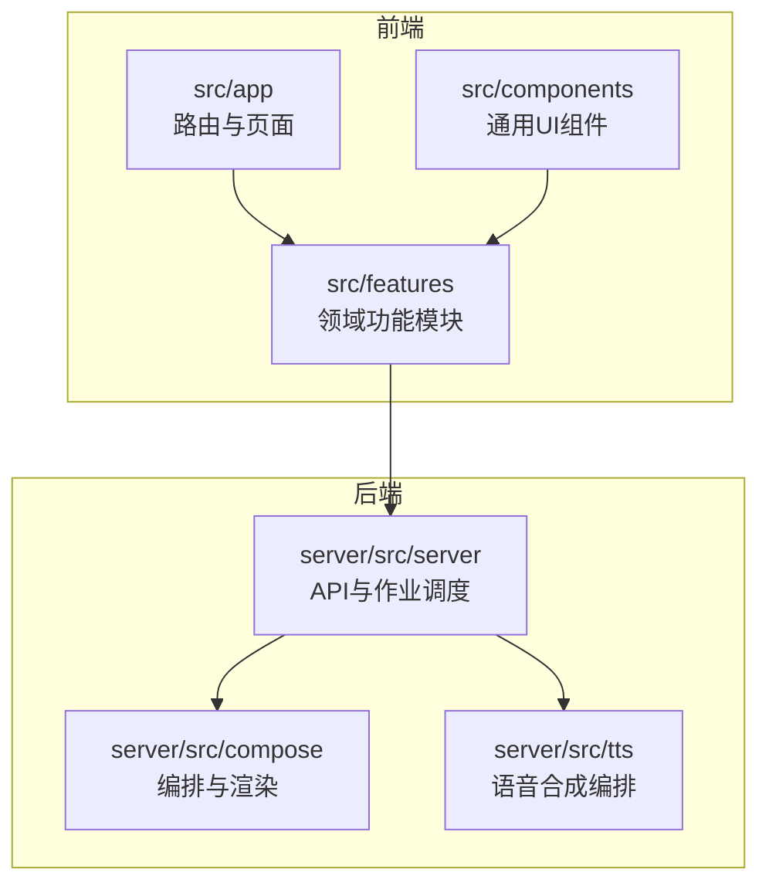
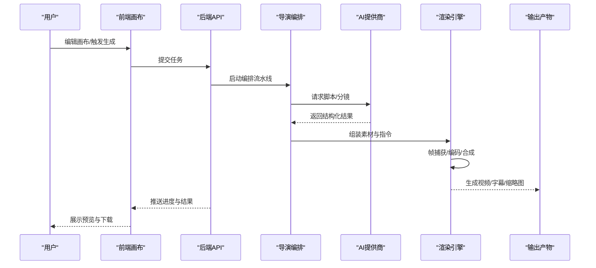
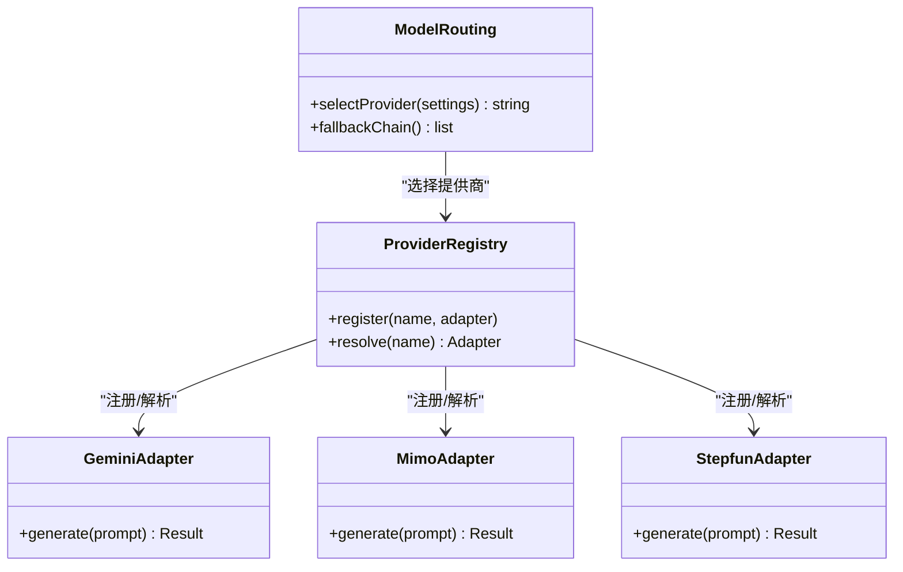
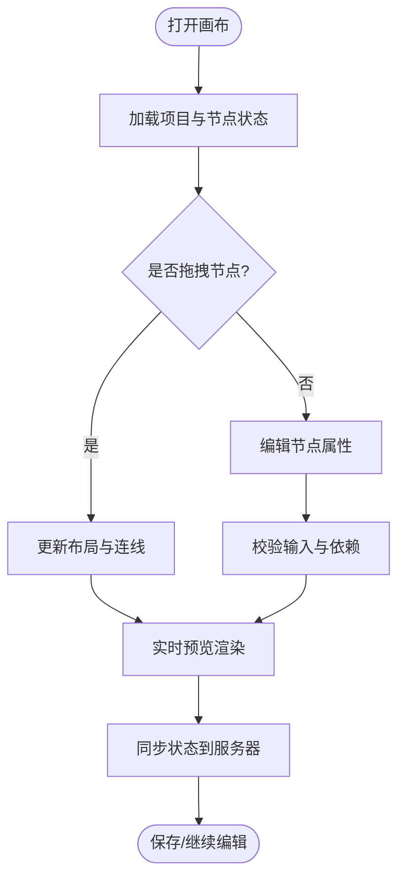
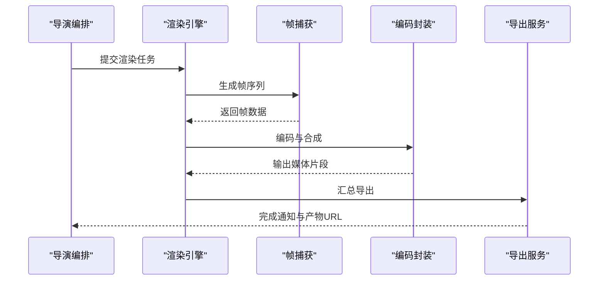
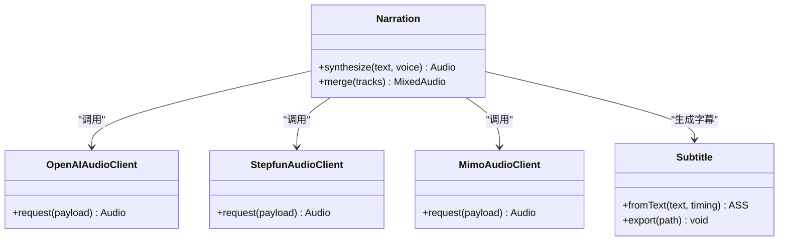
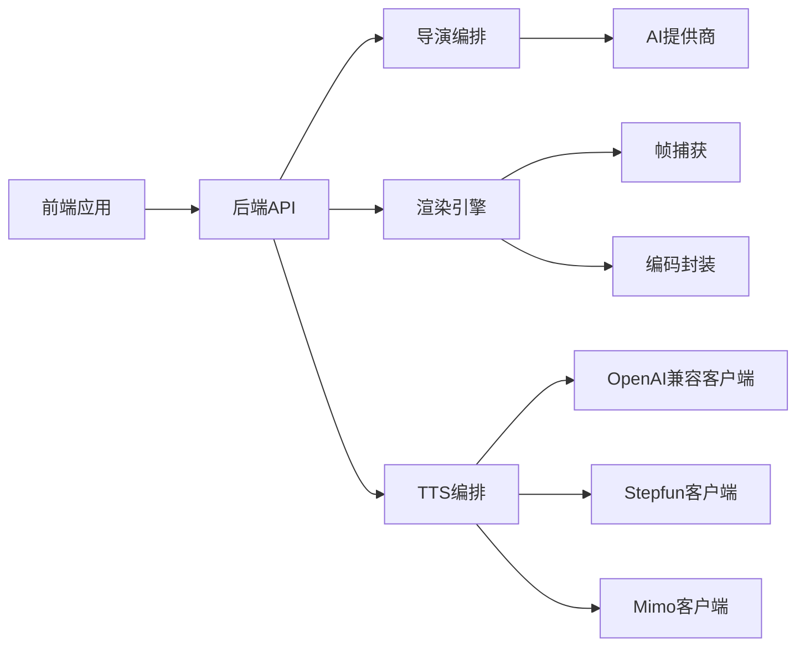

# 核心功能特性

<cite>
**本文引用的文件**   
- [src/features/ai/index.ts](file://src/features/ai/index.ts)
- [src/features/ai/gemini-adapter.ts](file://src/features/ai/gemini-adapter.ts)
- [src/features/ai/mimo-adapter.ts](file://src/features/ai/mimo-adapter.ts)
- [src/features/ai/stepfun-adapter.ts](file://src/features/ai/stepfun-adapter.ts)
- [src/features/ai/provider-registry.ts](file://src/features/ai/provider-registry.ts)
- [src/features/ai/model-routing.ts](file://src/features/ai/model-routing.ts)
- [src/features/director/pipeline.ts](file://src/features/director/pipeline.ts)
- [src/features/director/stage-runner.ts](file://src/features/director/stage-runner.ts)
- [src/features/director/pi-provider.ts](file://src/features/director/pi-provider.ts)
- [src/features/director/fabricate.ts](file://src/features/director/fabricate.ts)
- [src/features/canvas/types.ts](file://src/features/canvas/types.ts)
- [src/features/canvas/layout.ts](file://src/features/canvas/layout.ts)
- [src/features/canvas/actions.ts](file://src/features/canvas/actions.ts)
- [src/app/products/(app)/canvas/[projectId]/canvas-view.tsx](file://src/app/products/(app)/canvas/[projectId]/canvas-view.tsx)
- [src/app/products/(app)/canvas/[projectId]/canvas-action-api.ts](file://src/app/products/(app)/canvas/[projectId]/canvas-action-api.ts)
- [src/features/render/renderer.ts](file://src/features/render/renderer.ts)
- [src/features/render/export-service.ts](file://src/features/render/export-service.ts)
- [src/features/render/media-assembly.ts](file://src/features/render/media-assembly.ts)
- [src/features/render/frame-capture.ts](file://src/features/render/frame-capture.ts)
- [src/features/audio/narration.ts](file://src/features/audio/narration.ts)
- [src/features/audio/subtitle.ts](file://src/features/audio/subtitle.ts)
- [src/features/audio/openai-compatible-audio-client.ts](file://src/features/audio/openai-compatible-audio-client.ts)
- [src/features/audio/stepfun-audio-client.ts](file://src/features/audio/stepfun-audio-client.ts)
- [src/features/audio/mimo-audio-client.ts](file://src/features/audio/mimo-audio-client.ts)
- [server/src/compose/run-pipeline.ts](file://server/src/compose/run-pipeline.ts)
- [server/src/compose/render.ts](file://server/src/compose/render.ts)
- [server/src/tts/orchestrate.ts](file://server/src/tts/orchestrate.ts)
- [server/src/server/job-runner.ts](file://server/src/server/job-runner.ts)
- [server/src/server/api.ts](file://server/src/server/api.ts)
</cite>

## 目录
1. [简介](#简介)
2. [项目结构](#项目结构)
3. [核心组件](#核心组件)
4. [架构总览](#架构总览)
5. [详细组件分析](#详细组件分析)
6. [依赖关系分析](#依赖关系分析)
7. [性能考量](#性能考量)
8. [故障排查指南](#故障排查指南)
9. [结论](#结论)
10. [附录](#附录)

## 简介
PurpleInk 是一个面向AI内容创作与视频生产的平台，提供多AI提供商集成、可视化画布编辑、自动化渲染管道、音频处理（TTS、字幕、多音轨）以及项目管理等能力。本文件聚焦核心功能特性，从使用场景、操作流程到技术实现亮点进行系统化说明，帮助开发者与用户快速理解并高效使用平台。

## 项目结构
PurpleInk 采用前后端分离与模块化设计：
- 前端应用位于 src/app 与 src/components，产品功能集中在 src/features，按领域划分模块（ai、director、canvas、render、audio、auth、projects 等）。
- 服务端逻辑位于 server/src，包含编排、渲染、TTS、作业调度与API网关。
- 配置与部署脚本位于 config、deploy、scripts 等目录。

**图表来源** 
- [src/app/products/(app)/canvas/[projectId]/canvas-view.tsx](file://src/app/products/(app)/canvas/[projectId]/canvas-view.tsx)
- [server/src/server/api.ts](file://server/src/server/api.ts)
- [server/src/compose/run-pipeline.ts](file://server/src/compose/run-pipeline.ts)

**章节来源**
- [src/app/products/(app)/canvas/[projectId]/canvas-view.tsx](file://src/app/products/(app)/canvas/[projectId]/canvas-view.tsx)
- [server/src/server/api.ts](file://server/src/server/api.ts)

## 核心组件
- AI内容创作：多提供商适配器（Gemini、Mimo、Stepfun）、模型路由与统一配置管理、智能脚本生成与分镜设计。
- 可视化画布编辑器：拖拽式节点编辑、实时预览、协作编辑与状态同步。
- 自动化渲染管道：素材装配、帧捕获、编码封装与导出服务。
- 音频处理：TTS语音合成、多音轨管理与字幕生成。
- 项目管理：版本控制、团队协作与资源管理。

**章节来源**
- [src/features/ai/provider-registry.ts](file://src/features/ai/provider-registry.ts)
- [src/features/director/pipeline.ts](file://src/features/director/pipeline.ts)
- [src/features/canvas/types.ts](file://src/features/canvas/types.ts)
- [src/features/render/renderer.ts](file://src/features/render/renderer.ts)
- [src/features/audio/narration.ts](file://src/features/audio/narration.ts)

## 架构总览
PurpleInk 的端到端流程如下：用户在画布中编排镜头与媒体，触发导演编排后，系统调用AI提供商生成脚本与分镜，随后进入渲染阶段完成音视频合成与导出。

**图表来源** 
- [server/src/compose/run-pipeline.ts](file://server/src/compose/run-pipeline.ts)
- [server/src/compose/render.ts](file://server/src/compose/render.ts)
- [src/features/director/pipeline.ts](file://src/features/director/pipeline.ts)
- [src/features/render/renderer.ts](file://src/features/render/renderer.ts)

## 详细组件分析

### AI内容创作（多提供商集成、智能脚本与分镜）
- 多提供商适配层：通过适配器模式统一接入 Gemini、Mimo、Stepfun 等，屏蔽差异，提供一致的调用契约。
- 模型路由与配置：集中管理提供商配置、默认选择与错误回退策略，支持OpenAI兼容接口扩展。
- 智能脚本与分镜：导演编排根据提示词与上下文生成剧本、分镜描述与视觉主题，驱动后续渲染。

**图表来源** 
- [src/features/ai/provider-registry.ts](file://src/features/ai/provider-registry.ts)
- [src/features/ai/gemini-adapter.ts](file://src/features/ai/gemini-adapter.ts)
- [src/features/ai/mimo-adapter.ts](file://src/features/ai/mimo-adapter.ts)
- [src/features/ai/stepfun-adapter.ts](file://src/features/ai/stepfun-adapter.ts)
- [src/features/ai/model-routing.ts](file://src/features/ai/model-routing.ts)

使用场景与操作要点：
- 在设置页配置各提供商密钥与参数，选择默认提供商。
- 在画布或项目中点击“生成脚本/分镜”，系统自动路由至选定提供商并返回结构化数据。
- 失败时自动回退至备选提供商，保障稳定性。

技术亮点：
- 适配器抽象与统一契约，便于新增提供商。
- 模型路由支持优先级与回退链，提升鲁棒性。
- 配置校验与投影，确保参数安全与一致性。

**章节来源**
- [src/features/ai/index.ts](file://src/features/ai/index.ts)
- [src/features/ai/provider-registry.ts](file://src/features/ai/provider-registry.ts)
- [src/features/ai/model-routing.ts](file://src/features/ai/model-routing.ts)
- [src/features/director/fabricate.ts](file://src/features/director/fabricate.ts)

### 可视化画布编辑器（拖拽界面、实时预览、协作编辑）
- 节点类型：镜头、音频、导出等节点构成工作流，支持拖拽连接与属性编辑。
- 布局与状态：统一的类型定义与布局算法，保证节点位置与连线关系的正确性。
- 实时预览与协作：前端基于画布视图与动作API，实现即时反馈与多人协作。

**图表来源** 
- [src/features/canvas/types.ts](file://src/features/canvas/types.ts)
- [src/features/canvas/layout.ts](file://src/features/canvas/layout.ts)
- [src/app/products/(app)/canvas/[projectId]/canvas-view.tsx](file://src/app/products/(app)/canvas/[projectId]/canvas-view.tsx)
- [src/app/products/(app)/canvas/[projectId]/canvas-action-api.ts](file://src/app/products/(app)/canvas/[projectId]/canvas-action-api.ts)

使用场景与操作要点：
- 拖拽镜头节点到时间轴，调整时长与转场。
- 添加音频节点并绑定TTS或外部音轨。
- 实时预览画面变化，确认无误后导出。

技术亮点：
- 类型安全的节点模型与布局计算。
- 动作API聚合变更，减少网络往返。
- 预览与渲染解耦，提升交互流畅度。

**章节来源**
- [src/features/canvas/types.ts](file://src/features/canvas/types.ts)
- [src/features/canvas/layout.ts](file://src/features/canvas/layout.ts)
- [src/features/canvas/actions.ts](file://src/features/canvas/actions.ts)
- [src/app/products/(app)/canvas/[projectId]/canvas-view.tsx](file://src/app/products/(app)/canvas/[projectId]/canvas-view.tsx)
- [src/app/products/(app)/canvas/[projectId]/canvas-action-api.ts](file://src/app/products/(app)/canvas/[projectId]/canvas-action-api.ts)

### 自动化渲染管道（素材处理到最终视频输出）
- 编排与执行：导演编排将AI产出与画布指令转化为渲染任务，交由渲染引擎执行。
- 素材装配：根据镜头与媒体清单组装素材序列，处理分辨率、帧率与码率。
- 帧捕获与编码：浏览器驱动或无头浏览器捕获帧，FFmpeg进行编码与封装。
- 导出服务：队列化导出任务，支持并发与重试，输出视频、字幕与缩略图。

**图表来源** 
- [server/src/compose/run-pipeline.ts](file://server/src/compose/run-pipeline.ts)
- [server/src/compose/render.ts](file://server/src/compose/render.ts)
- [src/features/render/renderer.ts](file://src/features/render/renderer.ts)
- [src/features/render/media-assembly.ts](file://src/features/render/media-assembly.ts)
- [src/features/render/frame-capture.ts](file://src/features/render/frame-capture.ts)
- [src/features/render/export-service.ts](file://src/features/render/export-service.ts)

使用场景与操作要点：
- 在画布中完成镜头与媒体编排后，点击“开始渲染”。
- 监控渲染进度与日志，必要时调整参数重新渲染。
- 完成后下载视频、字幕文件或查看缩略图。

技术亮点：
- 可插拔的帧捕获与编码器，支持多种格式。
- 导出队列与任务持久化，保障高并发与容错。
- 中间产物缓存与增量渲染，缩短迭代周期。

**章节来源**
- [src/features/render/renderer.ts](file://src/features/render/renderer.ts)
- [src/features/render/media-assembly.ts](file://src/features/render/media-assembly.ts)
- [src/features/render/frame-capture.ts](file://src/features/render/frame-capture.ts)
- [src/features/render/export-service.ts](file://src/features/render/export-service.ts)
- [server/src/compose/run-pipeline.ts](file://server/src/compose/run-pipeline.ts)
- [server/src/compose/render.ts](file://server/src/compose/render.ts)

### 音频处理（TTS、多音轨、字幕）
- TTS语音合成：通过OpenAI兼容接口与特定提供商（Stepfun、Mimo）客户端生成语音，支持音色与语速配置。
- 多音轨管理：合并旁白、音效与背景音乐，精确对齐时间轴。
- 字幕生成：基于文本与时间戳生成ASS/SRT字幕，支持样式与定位。

**图表来源** 
- [src/features/audio/narration.ts](file://src/features/audio/narration.ts)
- [src/features/audio/openai-compatible-audio-client.ts](file://src/features/audio/openai-compatible-audio-client.ts)
- [src/features/audio/stepfun-audio-client.ts](file://src/features/audio/stepfun-audio-client.ts)
- [src/features/audio/mimo-audio-client.ts](file://src/features/audio/mimo-audio-client.ts)
- [src/features/audio/subtitle.ts](file://src/features/audio/subtitle.ts)

使用场景与操作要点：
- 在镜头节点中填写旁白文本，选择音色与语速。
- 导入背景音与音效，调整音量与淡入淡出。
- 自动生成字幕并校对时间轴，导出SRT/ASS文件。

技术亮点：
- 多客户端抽象，统一请求与响应处理。
- 时间轴对齐与混音算法，保证音画同步。
- 字幕样式模板与批量导出，提升制作效率。

**章节来源**
- [src/features/audio/narration.ts](file://src/features/audio/narration.ts)
- [src/features/audio/subtitle.ts](file://src/features/audio/subtitle.ts)
- [src/features/audio/openai-compatible-audio-client.ts](file://src/features/audio/openai-compatible-audio-client.ts)
- [src/features/audio/stepfun-audio-client.ts](file://src/features/audio/stepfun-audio-client.ts)
- [src/features/audio/mimo-audio-client.ts](file://src/features/audio/mimo-audio-client.ts)
- [server/src/tts/orchestrate.ts](file://server/src/tts/orchestrate.ts)

### 项目管理（版本控制、团队协作、资源管理）
- 版本控制：项目快照与变更追踪，支持回滚与对比。
- 团队协作：权限控制、评论与任务分配，提升协同效率。
- 资源管理：媒体资产库与引用关系，避免重复上传与丢失。

使用场景与操作要点：
- 创建项目并邀请团队成员，设定角色与权限。
- 每次重大修改生成版本快照，便于回溯。
- 统一管理媒体资源，按需复用与清理。

技术亮点：
- 基于数据库的事务与锁机制，保障数据一致性。
- 资源索引与去重，降低存储成本。
- 审计日志与操作回放，满足合规需求。

**章节来源**
- [src/features/projects/project-list.tsx](file://src/features/projects/project-list.tsx)
- [src/features/artifacts/service.ts](file://src/features/artifacts/service.ts)
- [src/features/artifacts/commit.ts](file://src/features/artifacts/commit.ts)

## 依赖关系分析
- 前端依赖领域模块（ai、canvas、render、audio），通过API与服务端交互。
- 服务端API作为入口，协调导演编排、渲染与TTS服务。
- 渲染与TTS服务依赖外部工具（浏览器驱动、FFmpeg）与第三方提供商API。

**图表来源** 
- [server/src/server/api.ts](file://server/src/server/api.ts)
- [server/src/compose/run-pipeline.ts](file://server/src/compose/run-pipeline.ts)
- [server/src/tts/orchestrate.ts](file://server/src/tts/orchestrate.ts)
- [src/features/ai/provider-registry.ts](file://src/features/ai/provider-registry.ts)

**章节来源**
- [server/src/server/api.ts](file://server/src/server/api.ts)
- [server/src/server/job-runner.ts](file://server/src/server/job-runner.ts)
- [src/features/ai/provider-registry.ts](file://src/features/ai/provider-registry.ts)

## 性能考量
- 渲染并行与队列：通过作业调度器与导出队列提高吞吐，避免阻塞。
- 缓存与增量：中间产物缓存与增量渲染减少重复计算。
- 资源限制：对大文件与高并发进行限流与降级，保障稳定性。
- 网络优化：批量动作与WebSocket推送，降低延迟与抖动。

[本节为通用指导，不直接分析具体文件]

## 故障排查指南
- 常见问题：
  - AI提供商调用失败：检查密钥、配额与网络连通性，启用回退提供商。
  - 渲染超时或内存不足：调整并发与资源上限，检查素材尺寸与格式。
  - TTS合成异常：验证文本长度与音色可用性，查看错误日志。
- 调试建议：
  - 启用详细日志与指标采集，定位瓶颈与异常。
  - 使用本地模拟与最小用例复现问题。
  - 利用版本快照与对比工具快速回归。

**章节来源**
- [server/src/server/job-runner.ts](file://server/src/server/job-runner.ts)
- [src/features/render/export-service.ts](file://src/features/render/export-service.ts)
- [src/features/ai/model-routing.ts](file://src/features/ai/model-routing.ts)

## 结论
PurpleInk 以模块化与可扩展的架构，将AI内容创作、可视化编辑、自动化渲染与音频处理深度融合，提供端到端的视频生产解决方案。通过多提供商集成、健壮的任务调度与丰富的UI能力，平台能够满足从个人创作者到团队协作的多样化需求。

[本节为总结性内容，不直接分析具体文件]

## 附录
- 术语表：
  - 镜头：时间轴上的一个片段，包含媒体与效果。
  - 分镜：AI生成的视觉描述与构图建议。
  - 帧捕获：从渲染目标提取图像帧的过程。
  - TTS：文本转语音的合成技术。
- 参考路径：
  - 画布视图与动作API：[src/app/products/(app)/canvas/[projectId]/canvas-view.tsx](file://src/app/products/(app)/canvas/[projectId]/canvas-view.tsx)、[src/app/products/(app)/canvas/[projectId]/canvas-action-api.ts](file://src/app/products/(app)/canvas/[projectId]/canvas-action-api.ts)
  - 渲染与导出：[src/features/render/renderer.ts](file://src/features/render/renderer.ts)、[src/features/render/export-service.ts](file://src/features/render/export-service.ts)
  - TTS编排：[server/src/tts/orchestrate.ts](file://server/src/tts/orchestrate.ts)

[本节为补充信息，不直接分析具体文件]