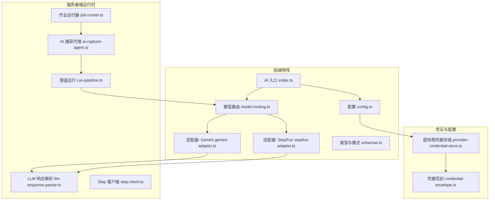
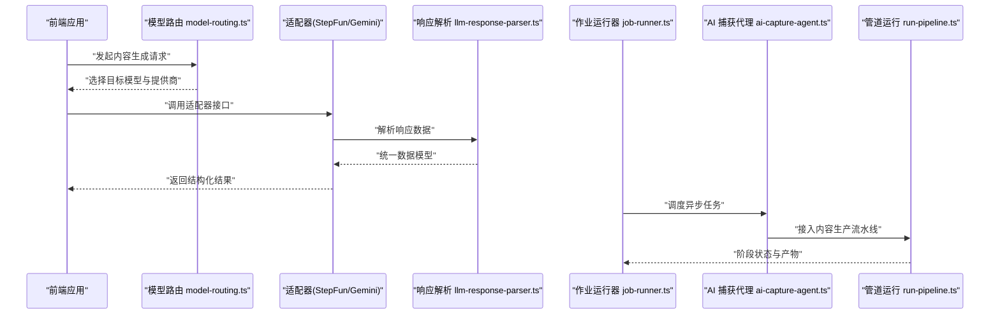
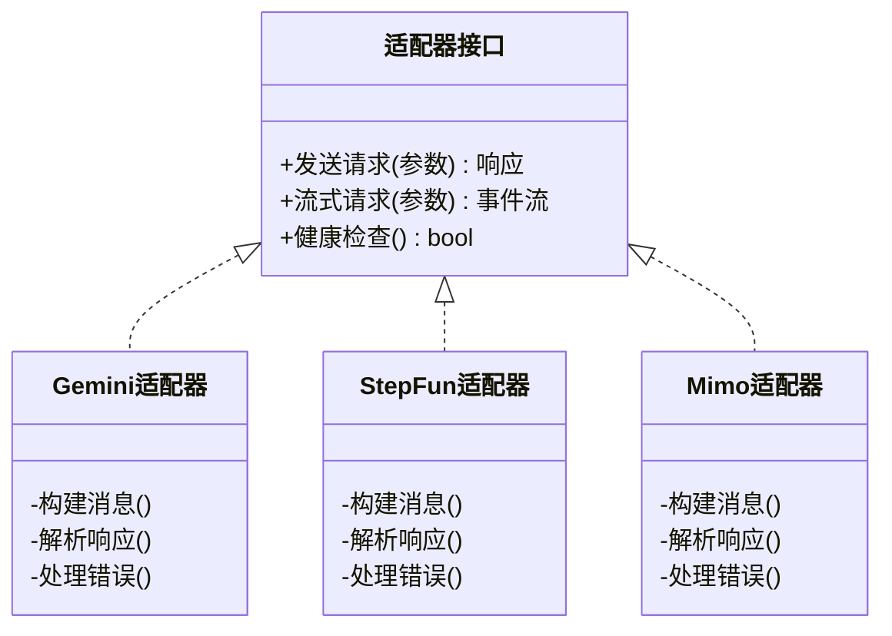
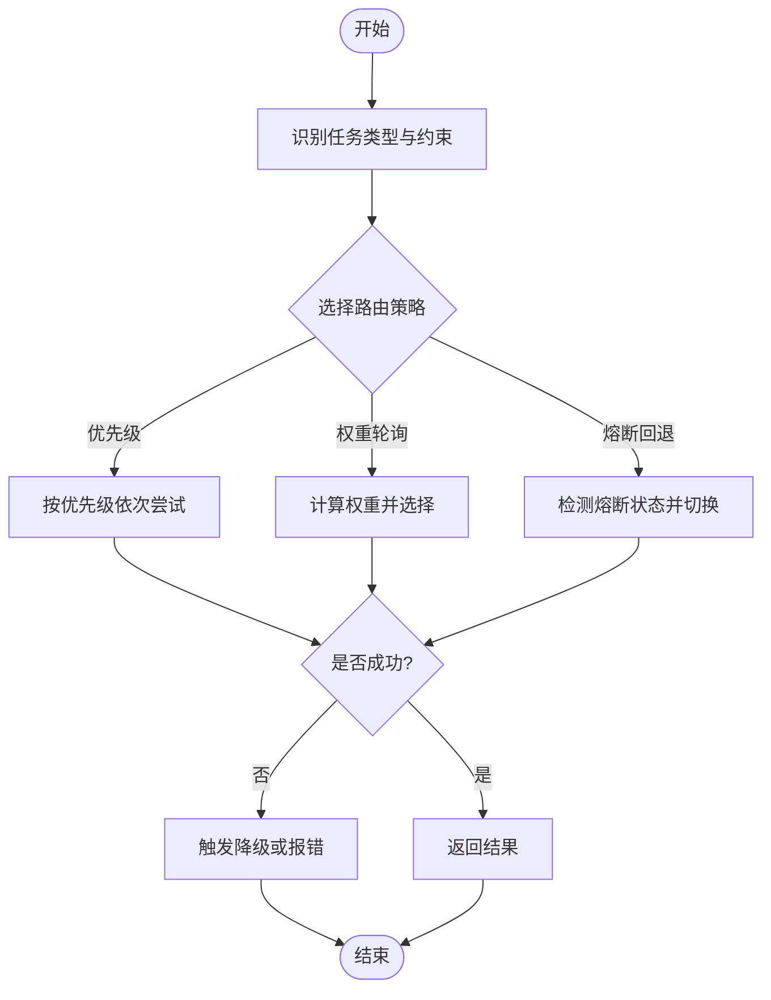
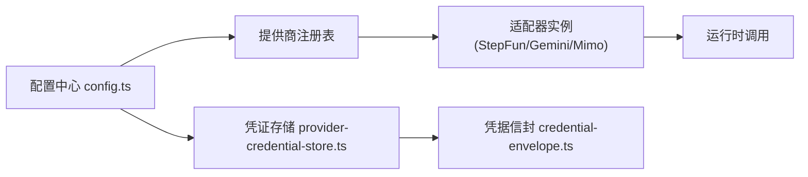
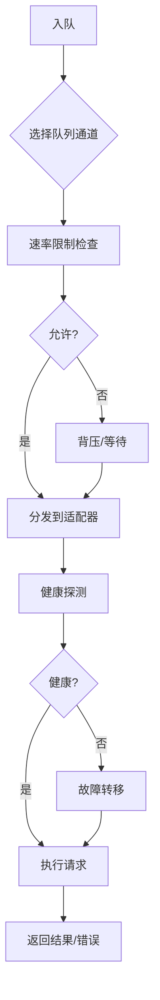
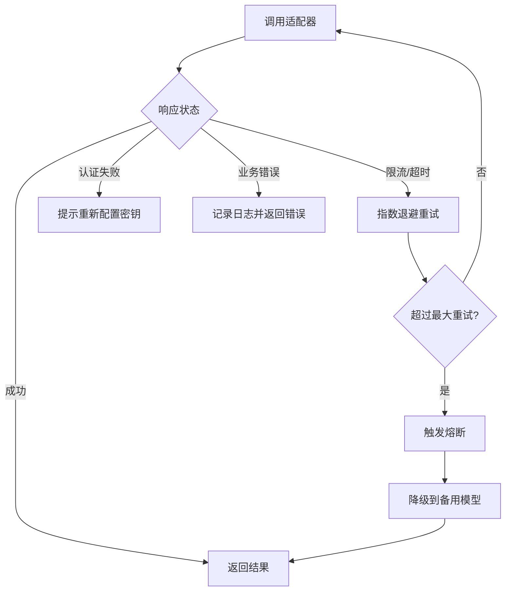
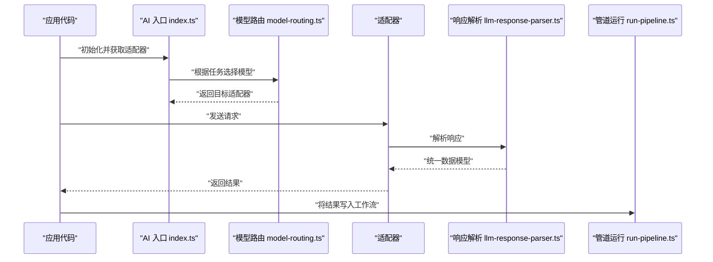
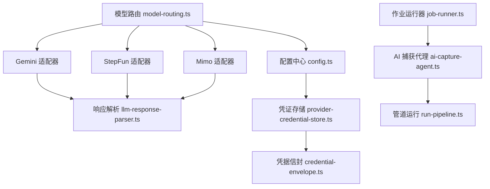

# AI 内容生成

<cite>
**本文引用的文件**   
- [src/features/ai/index.ts](file://src/features/ai/index.ts)
- [src/features/ai/config.ts](file://src/features/ai/config.ts)
- [src/features/ai/model-routing.ts](file://src/features/ai/model-routing.ts)
- [src/features/ai/gemini-adapter.ts](file://src/features/ai/gemini-adapter.ts)
- [src/features/ai/gemini-config.ts](file://src/features/ai/gemini-config.ts)
- [src/features/ai/stepfun-adapter.ts](file://src/features/ai/stepfun-adapter.ts)
- [src/features/ai/schemas.ts](file://src/features/ai/schemas.ts)
- [src/features/credentials/provider-credential-store.ts](file://src/features/credentials/provider-credential-store.ts)
- [src/features/credentials/credential-envelope.ts](file://src/features/credentials/credential-envelope.ts)
- [src/lib/queue/index.ts](file://src/lib/queue/index.ts)
- [server/src/lib/llm-response-parser.ts](file://server/src/lib/llm-response-parser.ts)
- [server/src/lib/step-client.ts](file://server/src/lib/step-client.ts)
- [server/src/server/job-runner.ts](file://server/src/server/job-runner.ts)
- [server/src/capture/ai-capture-agent.ts](file://server/src/capture/ai-capture-agent.ts)
- [server/src/compose/run-pipeline.ts](file://server/src/compose/run-pipeline.ts)
</cite>

## 目录
1. [简介](#简介)
2. [项目结构](#项目结构)
3. [核心组件](#核心组件)
4. [架构总览](#架构总览)
5. [详细组件分析](#详细组件分析)
6. [依赖关系分析](#依赖关系分析)
7. [性能考量](#性能考量)
8. [故障排除指南](#故障排除指南)
9. [结论](#结论)
10. [附录](#附录)

## 简介
本文件面向 PurpleInk 平台的 AI 内容生成功能，系统性阐述多模型适配器架构（Gemini、StepFun、Mimo 等）、模型路由机制、提供商注册表、并发控制与负载均衡策略。文档同时覆盖配置与使用方式（API 密钥管理、请求限流、错误处理与重试），并提供调用示例、响应数据处理与工作流集成要点，以及性能优化建议与常见问题排查方法。

## 项目结构
AI 能力主要位于前端特性模块与服务器端运行时之间：
- 前端特性层：提供统一的 AI 配置、模型路由、适配器接口与类型定义，屏蔽不同模型的差异。
- 凭证与配置：集中管理各提供商的凭据与配置项，支持占位符与加密存储。
- 服务器端运行时：负责任务编排、队列消费、LLM 响应解析与外部客户端封装。
- 工作流集成：通过管道运行器与捕获代理将 AI 能力嵌入到内容生产流水线中。

图表来源
- [src/features/ai/index.ts](file://src/features/ai/index.ts)
- [src/features/ai/config.ts](file://src/features/ai/config.ts)
- [src/features/ai/model-routing.ts](file://src/features/ai/model-routing.ts)
- [src/features/ai/gemini-adapter.ts](file://src/features/ai/gemini-adapter.ts)
- [src/features/ai/stepfun-adapter.ts](file://src/features/ai/stepfun-adapter.ts)
- [src/features/ai/schemas.ts](file://src/features/ai/schemas.ts)
- [src/features/credentials/provider-credential-store.ts](file://src/features/credentials/provider-credential-store.ts)
- [src/features/credentials/credential-envelope.ts](file://src/features/credentials/credential-envelope.ts)
- [server/src/lib/llm-response-parser.ts](file://server/src/lib/llm-response-parser.ts)
- [server/src/lib/step-client.ts](file://server/src/lib/step-client.ts)
- [server/src/server/job-runner.ts](file://server/src/server/job-runner.ts)
- [server/src/capture/ai-capture-agent.ts](file://server/src/capture/ai-capture-agent.ts)
- [server/src/compose/run-pipeline.ts](file://server/src/compose/run-pipeline.ts)

章节来源
- [src/features/ai/index.ts](file://src/features/ai/index.ts)
- [src/features/ai/config.ts](file://src/features/ai/config.ts)
- [src/features/ai/model-routing.ts](file://src/features/ai/model-routing.ts)
- [src/features/ai/gemini-adapter.ts](file://src/features/ai/gemini-adapter.ts)
- [src/features/ai/stepfun-adapter.ts](file://src/features/ai/stepfun-adapter.ts)
- [src/features/ai/schemas.ts](file://src/features/ai/schemas.ts)
- [src/features/credentials/provider-credential-store.ts](file://src/features/credentials/provider-credential-store.ts)
- [src/features/credentials/credential-envelope.ts](file://src/features/credentials/credential-envelope.ts)
- [server/src/lib/llm-response-parser.ts](file://server/src/lib/llm-response-parser.ts)
- [server/src/lib/step-client.ts](file://server/src/lib/step-client.ts)
- [server/src/server/job-runner.ts](file://server/src/server/job-runner.ts)
- [server/src/capture/ai-capture-agent.ts](file://server/src/capture/ai-capture-agent.ts)
- [server/src/compose/run-pipeline.ts](file://server/src/compose/run-pipeline.ts)

## 核心组件
- 统一入口与导出：对外暴露 AI 能力（配置、路由、适配器）的统一访问点，便于上层模块按需引入。
- 配置中心：集中加载与校验 AI 相关环境变量与用户设置，支持占位符替换与默认值回退。
- 模型路由：根据任务类型、质量要求、成本预算与可用性动态选择具体模型或提供商。
- 适配器层：为每个模型提供商实现标准化接口，屏蔽协议差异（如消息格式、流式输出、错误码）。
- 凭证管理：以“信封”形式安全存储与传递 API Key，按提供商隔离并支持轮换。
- 响应解析：统一解析不同提供商返回的结构化数据，转换为平台内部一致的数据模型。
- 作业与队列：在服务器端通过作业运行器与队列消费者协调并发与重试，保障稳定性与吞吐。

章节来源
- [src/features/ai/index.ts](file://src/features/ai/index.ts)
- [src/features/ai/config.ts](file://src/features/ai/config.ts)
- [src/features/ai/model-routing.ts](file://src/features/ai/model-routing.ts)
- [src/features/ai/gemini-adapter.ts](file://src/features/ai/gemini-adapter.ts)
- [src/features/ai/stepfun-adapter.ts](file://src/features/ai/stepfun-adapter.ts)
- [src/features/ai/schemas.ts](file://src/features/ai/schemas.ts)
- [src/features/credentials/provider-credential-store.ts](file://src/features/credentials/provider-credential-store.ts)
- [src/features/credentials/credential-envelope.ts](file://src/features/credentials/credential-envelope.ts)
- [server/src/lib/llm-response-parser.ts](file://server/src/lib/llm-response-parser.ts)
- [server/src/server/job-runner.ts](file://server/src/server/job-runner.ts)

## 架构总览
下图展示从前端调用到服务器端执行的关键路径，包括模型路由、适配器调用、响应解析与作业编排。

图表来源
- [src/features/ai/model-routing.ts](file://src/features/ai/model-routing.ts)
- [src/features/ai/gemini-adapter.ts](file://src/features/ai/gemini-adapter.ts)
- [src/features/ai/stepfun-adapter.ts](file://src/features/ai/stepfun-adapter.ts)
- [server/src/lib/llm-response-parser.ts](file://server/src/lib/llm-response-parser.ts)
- [server/src/server/job-runner.ts](file://server/src/server/job-runner.ts)
- [server/src/capture/ai-capture-agent.ts](file://server/src/capture/ai-capture-agent.ts)
- [server/src/compose/run-pipeline.ts](file://server/src/compose/run-pipeline.ts)

## 详细组件分析

### 多模型适配器架构（Gemini、StepFun、Mimo 等）
- 适配器职责：封装各提供商的 HTTP/SDK 调用细节，统一输入输出契约，处理鉴权、重试、超时与错误映射。
- 适配器设计要点：
  - 输入规范化：将平台消息体转换为提供商要求的格式。
  - 输出归一化：将响应解析为内部一致的文本、结构化数据或流式片段。
  - 错误映射：将提供商错误码映射为平台错误类型，便于上层统一处理。
  - 可插拔扩展：新增提供商只需实现标准接口并注册到路由。

图表来源
- [src/features/ai/gemini-adapter.ts](file://src/features/ai/gemini-adapter.ts)
- [src/features/ai/stepfun-adapter.ts](file://src/features/ai/stepfun-adapter.ts)

章节来源
- [src/features/ai/gemini-adapter.ts](file://src/features/ai/gemini-adapter.ts)
- [src/features/ai/stepfun-adapter.ts](file://src/features/ai/stepfun-adapter.ts)

### 模型路由机制
- 路由决策依据：任务类型（文本/图像/音频）、质量等级、延迟容忍度、成本上限、可用性与配额。
- 路由策略：
  - 优先级列表：按预设顺序尝试多个模型，失败自动降级。
  - 权重轮询：对高可用模型进行加权随机选择，提升负载均衡。
  - 熔断与回退：当某提供商持续失败时临时禁用，切换到备用提供商。
- 路由配置：通过配置文件或运行时设置动态调整，支持热更新。

图表来源
- [src/features/ai/model-routing.ts](file://src/features/ai/model-routing.ts)

章节来源
- [src/features/ai/model-routing.ts](file://src/features/ai/model-routing.ts)

### 提供商注册表与配置中心
- 注册表：维护所有已注册的适配器实例及其元信息（名称、版本、能力标签、配额限制）。
- 配置中心：
  - 环境变量加载：读取并校验必需的配置项（如 API Key、Base URL、超时时间）。
  - 占位符替换：支持模板变量注入，便于多环境部署。
  - 默认值与回退：未配置时使用合理默认值，确保系统健壮性。
- 凭证管理：
  - 凭据信封：对敏感信息进行封装与加密，避免明文泄露。
  - 提供商隔离：按提供商维度隔离凭据，支持独立轮换与审计。

图表来源
- [src/features/ai/config.ts](file://src/features/ai/config.ts)
- [src/features/credentials/provider-credential-store.ts](file://src/features/credentials/provider-credential-store.ts)
- [src/features/credentials/credential-envelope.ts](file://src/features/credentials/credential-envelope.ts)

章节来源
- [src/features/ai/config.ts](file://src/features/ai/config.ts)
- [src/features/credentials/provider-credential-store.ts](file://src/features/credentials/provider-credential-store.ts)
- [src/features/credentials/credential-envelope.ts](file://src/features/credentials/credential-envelope.ts)

### 并发控制与负载均衡
- 并发控制：
  - 队列分道：按任务类型划分队列通道，避免热点任务阻塞其他任务。
  - 速率限制：对每个提供商实施令牌桶或滑动窗口限流，防止超限。
  - 背压与缓冲：在高负载下通过缓冲与丢弃策略保护系统稳定。
- 负载均衡：
  - 多副本与地域亲和：将请求路由到最近的可用副本，降低延迟。
  - 健康探测：定期探测提供商健康状态，剔除异常节点。
  - 动态扩缩容：根据队列长度与错误率动态调整并发度。

图表来源
- [src/lib/queue/index.ts](file://src/lib/queue/index.ts)
- [server/src/server/job-runner.ts](file://server/src/server/job-runner.ts)

章节来源
- [src/lib/queue/index.ts](file://src/lib/queue/index.ts)
- [server/src/server/job-runner.ts](file://server/src/server/job-runner.ts)

### 错误处理与重试机制
- 错误分类：网络错误、认证失败、限流、业务校验失败、超时等。
- 重试策略：
  - 指数退避：对瞬态错误采用指数退避重试，避免雪崩。
  - 最大重试次数：限制重试上限，防止无限循环。
  - 幂等性保证：对可重试操作确保幂等，避免重复副作用。
- 熔断与降级：
  - 熔断阈值：连续失败达到阈值后快速失败，减少资源消耗。
  - 降级策略：切换到备用模型或返回缓存结果。

图表来源
- [server/src/lib/llm-response-parser.ts](file://server/src/lib/llm-response-parser.ts)
- [server/src/lib/step-client.ts](file://server/src/lib/step-client.ts)

章节来源
- [server/src/lib/llm-response-parser.ts](file://server/src/lib/llm-response-parser.ts)
- [server/src/lib/step-client.ts](file://server/src/lib/step-client.ts)

### 配置与使用指南（API 密钥、请求限流、错误处理、重试）
- API 密钥管理：
  - 在凭证存储中为每个提供商创建凭据信封，包含密钥、有效期与权限范围。
  - 支持环境变量注入与运行时更新，避免重启服务。
- 请求限流：
  - 在队列层配置每提供商的速率限制参数（QPS、突发容量）。
  - 监控限流命中情况，动态调整阈值。
- 错误处理：
  - 统一错误类型与消息，便于前端展示与日志聚合。
  - 对关键错误进行告警与自动恢复。
- 重试机制：
  - 在适配器层配置重试策略（次数、间隔、条件）。
  - 结合熔断与降级，提高整体可用性。

章节来源
- [src/features/credentials/provider-credential-store.ts](file://src/features/credentials/provider-credential-store.ts)
- [src/features/credentials/credential-envelope.ts](file://src/features/credentials/credential-envelope.ts)
- [src/lib/queue/index.ts](file://src/lib/queue/index.ts)
- [server/src/lib/llm-response-parser.ts](file://server/src/lib/llm-response-parser.ts)

### 调用示例与工作流集成
- 调用 AI 服务：
  - 通过统一入口获取适配器实例，传入标准化请求参数。
  - 处理响应数据，提取所需字段并进行后续处理。
- 响应数据处理：
  - 使用响应解析器将不同格式的响应转换为内部模型。
  - 对结构化数据进行校验与转换，确保一致性。
- 工作流集成：
  - 将 AI 步骤嵌入到管道运行器中，作为可配置的阶段。
  - 通过捕获代理收集中间状态与产物，供下游阶段使用。

图表来源
- [src/features/ai/index.ts](file://src/features/ai/index.ts)
- [src/features/ai/model-routing.ts](file://src/features/ai/model-routing.ts)
- [server/src/lib/llm-response-parser.ts](file://server/src/lib/llm-response-parser.ts)
- [server/src/compose/run-pipeline.ts](file://server/src/compose/run-pipeline.ts)

章节来源
- [src/features/ai/index.ts](file://src/features/ai/index.ts)
- [src/features/ai/model-routing.ts](file://src/features/ai/model-routing.ts)
- [server/src/lib/llm-response-parser.ts](file://server/src/lib/llm-response-parser.ts)
- [server/src/compose/run-pipeline.ts](file://server/src/compose/run-pipeline.ts)

## 依赖关系分析
- 组件耦合：
  - 路由层依赖适配器与配置中心，低耦合高内聚。
  - 适配器依赖凭证管理与响应解析，职责清晰。
  - 作业运行器依赖队列与捕获代理，解耦业务逻辑。
- 外部依赖：
  - 各提供商 SDK/HTTP 客户端，需适配错误与超时。
  - 数据库与缓存用于持久化配置与状态。
- 潜在风险：
  - 循环依赖：通过接口抽象避免。
  - 单点故障：通过多副本与健康探测缓解。

图表来源
- [src/features/ai/model-routing.ts](file://src/features/ai/model-routing.ts)
- [src/features/ai/gemini-adapter.ts](file://src/features/ai/gemini-adapter.ts)
- [src/features/ai/stepfun-adapter.ts](file://src/features/ai/stepfun-adapter.ts)
- [server/src/lib/llm-response-parser.ts](file://server/src/lib/llm-response-parser.ts)
- [src/features/ai/config.ts](file://src/features/ai/config.ts)
- [src/features/credentials/provider-credential-store.ts](file://src/features/credentials/provider-credential-store.ts)
- [src/features/credentials/credential-envelope.ts](file://src/features/credentials/credential-envelope.ts)
- [server/src/server/job-runner.ts](file://server/src/server/job-runner.ts)
- [server/src/capture/ai-capture-agent.ts](file://server/src/capture/ai-capture-agent.ts)
- [server/src/compose/run-pipeline.ts](file://server/src/compose/run-pipeline.ts)

章节来源
- [src/features/ai/model-routing.ts](file://src/features/ai/model-routing.ts)
- [src/features/ai/gemini-adapter.ts](file://src/features/ai/gemini-adapter.ts)
- [src/features/ai/stepfun-adapter.ts](file://src/features/ai/stepfun-adapter.ts)
- [server/src/lib/llm-response-parser.ts](file://server/src/lib/llm-response-parser.ts)
- [src/features/ai/config.ts](file://src/features/ai/config.ts)
- [src/features/credentials/provider-credential-store.ts](file://src/features/credentials/provider-credential-store.ts)
- [src/features/credentials/credential-envelope.ts](file://src/features/credentials/credential-envelope.ts)
- [server/src/server/job-runner.ts](file://server/src/server/job-runner.ts)
- [server/src/capture/ai-capture-agent.ts](file://server/src/capture/ai-capture-agent.ts)
- [server/src/compose/run-pipeline.ts](file://server/src/compose/run-pipeline.ts)

## 性能考量
- 连接复用与池化：复用 HTTP 连接，减少握手开销。
- 流式处理：对长文本或大响应启用流式传输，降低内存占用。
- 缓存策略：对相似请求进行结果缓存，提升命中率。
- 批处理：合并小请求为批量，提高吞吐。
- 监控与指标：采集延迟、错误率、吞吐量等指标，指导调优。

[本节为通用性能建议，不直接分析具体文件]

## 故障排除指南
- 常见问题定位：
  - 认证失败：检查凭据信封中的密钥是否正确且未过期。
  - 限流错误：查看速率限制配置与当前 QPS，适当放宽或扩容。
  - 超时错误：调整超时阈值或优化上游依赖。
  - 熔断触发：检查连续失败原因，修复后手动复位熔断。
- 调试技巧：
  - 启用详细日志，记录请求与响应摘要。
  - 使用健康探测接口验证提供商可用性。
  - 通过队列监控观察任务堆积与处理时长。

章节来源
- [server/src/lib/llm-response-parser.ts](file://server/src/lib/llm-response-parser.ts)
- [server/src/lib/step-client.ts](file://server/src/lib/step-client.ts)
- [server/src/server/job-runner.ts](file://server/src/server/job-runner.ts)

## 结论
PurpleInk 的 AI 内容生成功能通过多模型适配器架构实现了灵活、可扩展与高可用的模型调用能力。模型路由、凭证管理、并发控制与错误处理共同保障了系统的稳定性与性能。通过合理的配置与监控，可以高效集成多种 AI 提供商，满足多样化的内容生产需求。

[本节为总结性内容，不直接分析具体文件]

## 附录
- 术语表：
  - 适配器：封装特定模型提供商接口的组件。
  - 路由：根据规则选择合适模型或提供商的逻辑。
  - 凭据信封：对敏感信息进行封装与加密的载体。
  - 熔断：在持续失败时快速失败的机制。
- 最佳实践：
  - 始终使用最小权限原则配置 API 密钥。
  - 对关键路径添加重试与降级策略。
  - 定期审查与更新提供商配置与限额。

[本节为补充信息，不直接分析具体文件]