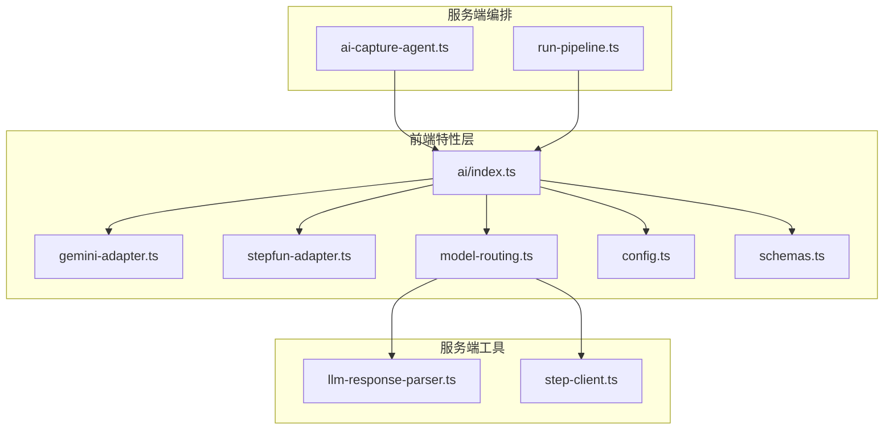
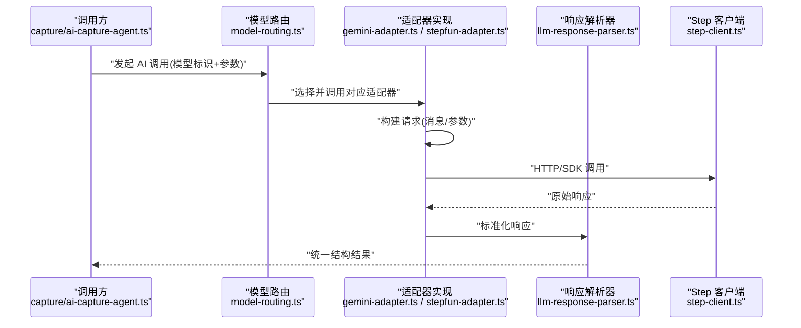
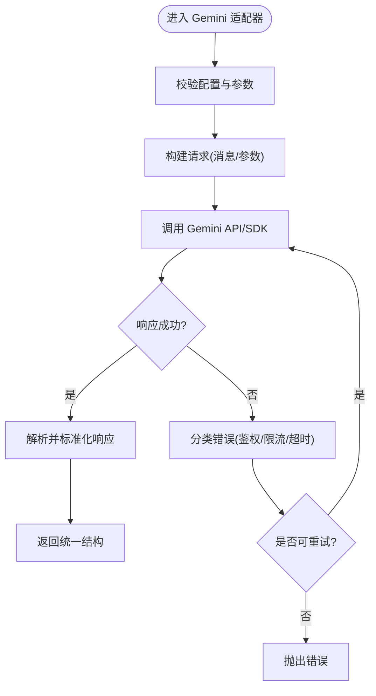
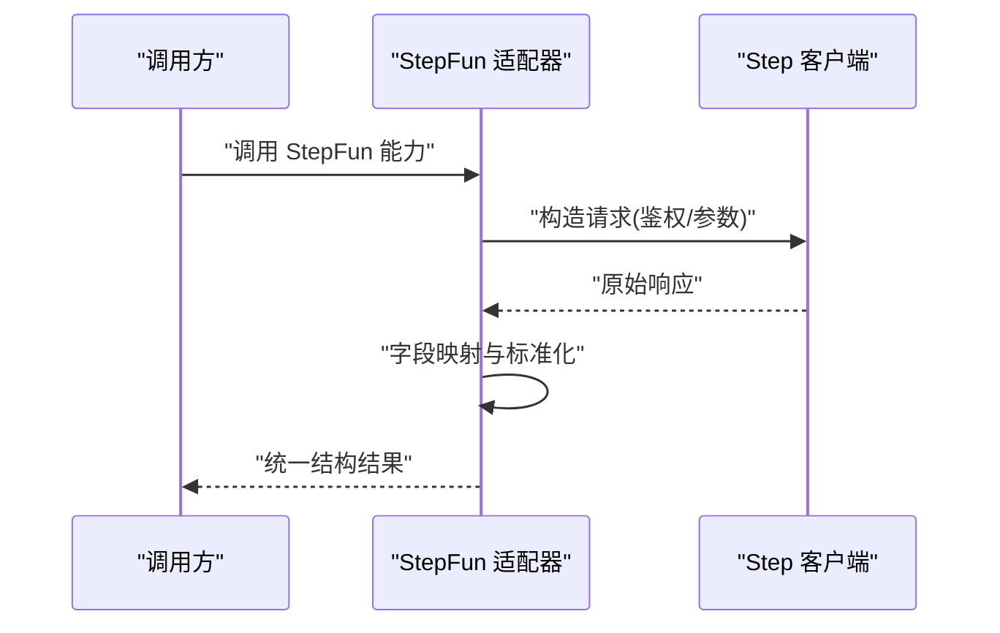
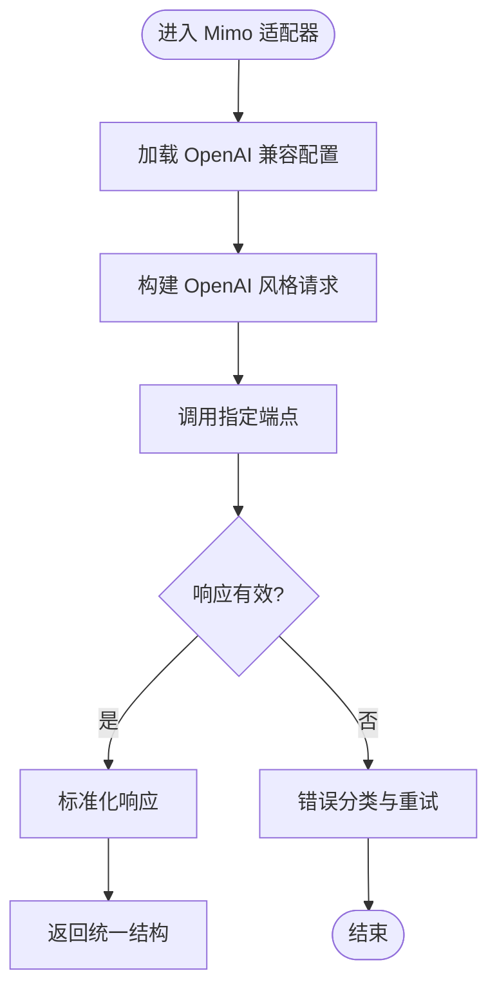
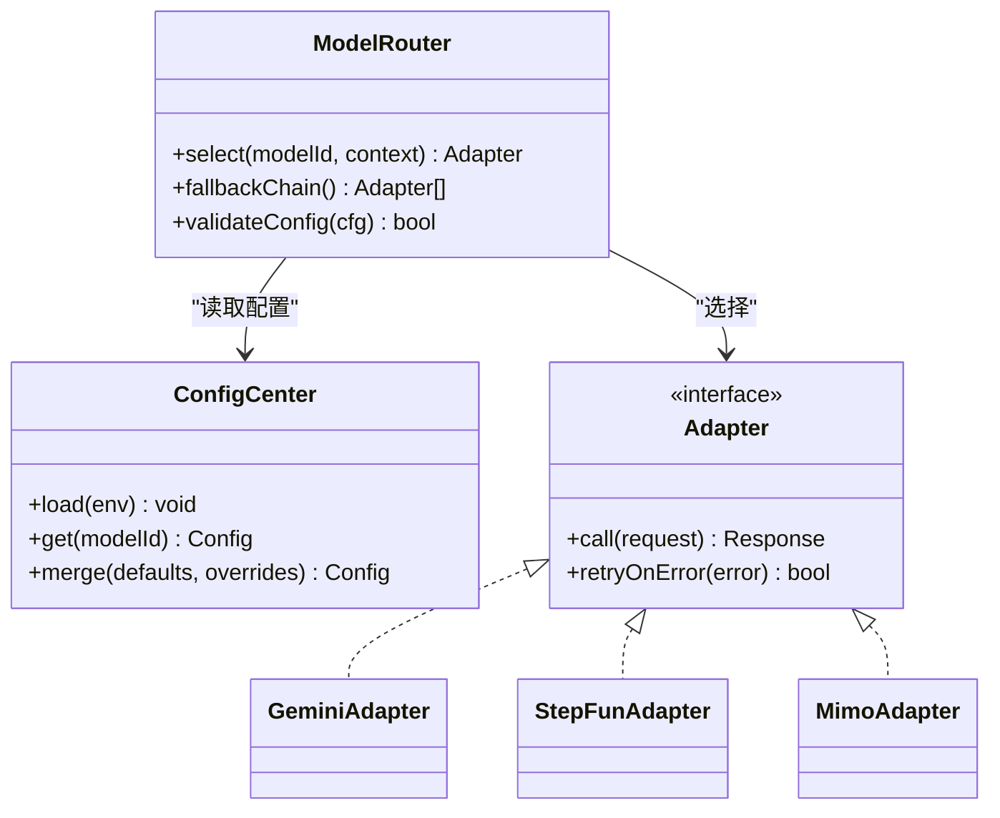
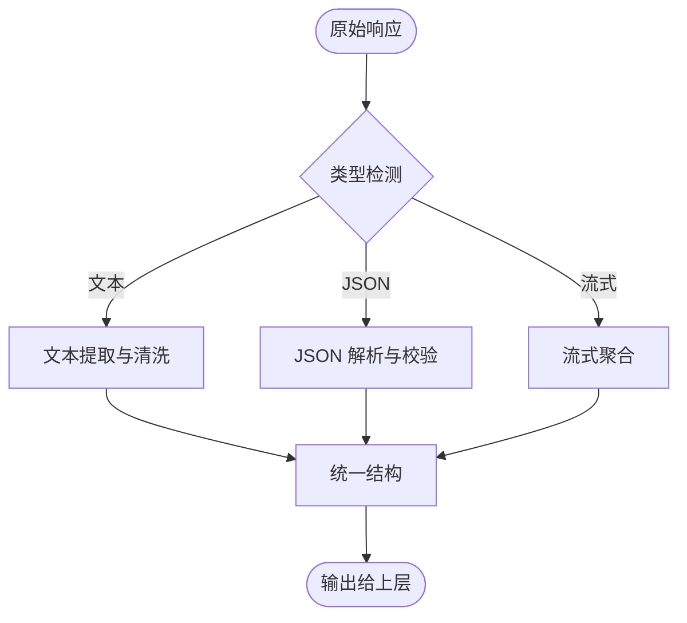
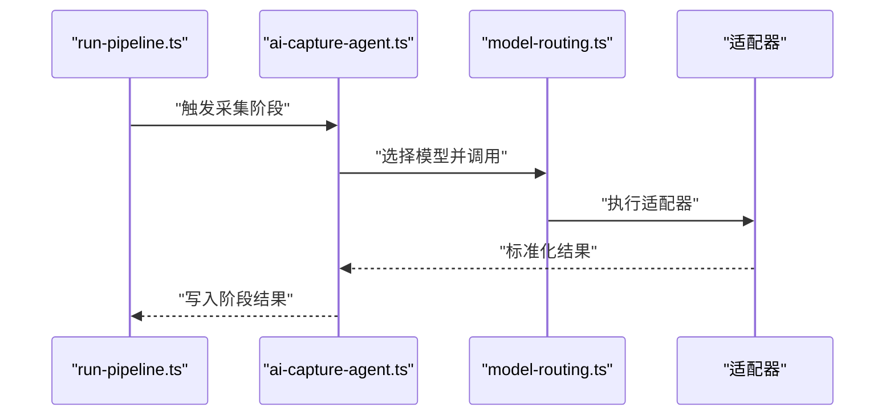
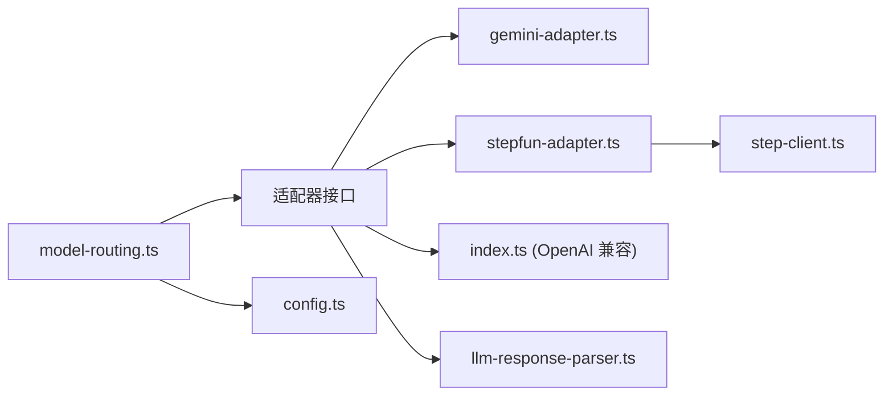

# AI 适配器架构

<cite>
**本文引用的文件**   
- [src/features/ai/index.ts](file://src/features/ai/index.ts)
- [src/features/ai/gemini-adapter.ts](file://src/features/ai/gemini-adapter.ts)
- [src/features/ai/gemini-config.ts](file://src/features/ai/gemini-config.ts)
- [src/features/ai/stepfun-adapter.ts](file://src/features/ai/stepfun-adapter.ts)
- [src/features/ai/model-routing.ts](file://src/features/ai/model-routing.ts)
- [src/features/ai/config.ts](file://src/features/ai/config.ts)
- [src/features/ai/schemas.ts](file://src/features/ai/schemas.ts)
- [server/src/lib/llm-response-parser.ts](file://server/src/lib/llm-response-parser.ts)
- [server/src/lib/step-client.ts](file://server/src/lib/step-client.ts)
- [server/src/capture/ai-capture-agent.ts](file://server/src/capture/ai-capture-agent.ts)
- [server/src/compose/run-pipeline.ts](file://server/src/compose/run-pipeline.ts)
</cite>

## 目录
1. [简介](#简介)
2. [项目结构](#项目结构)
3. [核心组件](#核心组件)
4. [架构总览](#架构总览)
5. [详细组件分析](#详细组件分析)
6. [依赖关系分析](#依赖关系分析)
7. [性能考量](#性能考量)
8. [故障排查指南](#故障排查指南)
9. [结论](#结论)
10. [附录](#附录)

## 简介
本文件面向 PurpleInk 的 AI 适配器架构，系统性阐述多模型适配器的设计模式与实现要点。重点覆盖 Gemini、StepFun、Mimo 以及 OpenAI 兼容适配器的接口规范、请求转换机制、响应解析流程与错误处理策略。文档同时提供创建新适配器的步骤、配置不同模型参数的方法、处理多样化响应格式的实践，并给出性能对比、选择建议与最佳实践，帮助开发者快速扩展与稳定运行多模型调用链路。

## 项目结构
AI 相关能力主要分布在以下位置：
- 前端特性层（features/ai）：定义适配器接口、路由与配置、具体适配器实现（Gemini、StepFun 等）。
- 服务端工具（server/src/lib）：LLM 响应解析器、Step 客户端封装等通用能力。
- 服务端编排（server/src/compose、server/src/capture）：将 AI 能力集成到采集与流水线执行中。

**图表来源** 
- [src/features/ai/index.ts](file://src/features/ai/index.ts)
- [src/features/ai/gemini-adapter.ts](file://src/features/ai/gemini-adapter.ts)
- [src/features/ai/stepfun-adapter.ts](file://src/features/ai/stepfun-adapter.ts)
- [src/features/ai/model-routing.ts](file://src/features/ai/model-routing.ts)
- [src/features/ai/config.ts](file://src/features/ai/config.ts)
- [src/features/ai/schemas.ts](file://src/features/ai/schemas.ts)
- [server/src/lib/llm-response-parser.ts](file://server/src/lib/llm-response-parser.ts)
- [server/src/lib/step-client.ts](file://server/src/lib/step-client.ts)
- [server/src/capture/ai-capture-agent.ts](file://server/src/capture/ai-capture-agent.ts)
- [server/src/compose/run-pipeline.ts](file://server/src/compose/run-pipeline.ts)

**章节来源**
- [src/features/ai/index.ts](file://src/features/ai/index.ts)
- [src/features/ai/gemini-adapter.ts](file://src/features/ai/gemini-adapter.ts)
- [src/features/ai/stepfun-adapter.ts](file://src/features/ai/stepfun-adapter.ts)
- [src/features/ai/model-routing.ts](file://src/features/ai/model-routing.ts)
- [src/features/ai/config.ts](file://src/features/ai/config.ts)
- [src/features/ai/schemas.ts](file://src/features/ai/schemas.ts)
- [server/src/lib/llm-response-parser.ts](file://server/src/lib/llm-response-parser.ts)
- [server/src/lib/step-client.ts](file://server/src/lib/step-client.ts)
- [server/src/capture/ai-capture-agent.ts](file://server/src/capture/ai-capture-agent.ts)
- [server/src/compose/run-pipeline.ts](file://server/src/compose/run-pipeline.ts)

## 核心组件
- 适配器接口规范：统一抽象出“发送请求-接收响应”的能力，屏蔽底层模型差异。
- 请求转换机制：将内部消息/上下文转换为各模型的期望格式（如系统提示、用户消息、参数）。
- 响应解析流程：将不同模型的返回体标准化为统一的内部结构，便于上层消费。
- 错误处理策略：对网络异常、鉴权失败、限流、超时等进行分类捕获与重试/降级。
- 路由与配置：根据模型标识或条件动态选择适配器，集中管理密钥、端点与参数。

**章节来源**
- [src/features/ai/schemas.ts](file://src/features/ai/schemas.ts)
- [src/features/ai/config.ts](file://src/features/ai/config.ts)
- [src/features/ai/model-routing.ts](file://src/features/ai/model-routing.ts)
- [server/src/lib/llm-response-parser.ts](file://server/src/lib/llm-response-parser.ts)

## 架构总览
下图展示了从业务编排到具体模型适配器的端到端调用链路与数据流转。

**图表来源** 
- [server/src/capture/ai-capture-agent.ts](file://server/src/capture/ai-capture-agent.ts)
- [src/features/ai/model-routing.ts](file://src/features/ai/model-routing.ts)
- [src/features/ai/gemini-adapter.ts](file://src/features/ai/gemini-adapter.ts)
- [src/features/ai/stepfun-adapter.ts](file://src/features/ai/stepfun-adapter.ts)
- [server/src/lib/llm-response-parser.ts](file://server/src/lib/llm-response-parser.ts)
- [server/src/lib/step-client.ts](file://server/src/lib/step-client.ts)

## 详细组件分析

### 适配器接口与通用契约
- 目标：所有适配器需实现一致的请求/响应契约，确保路由与解析器可无缝协作。
- 关键职责：
  - 输入校验与默认值填充（基于 schemas）。
  - 请求构造（按模型要求组织消息、工具、参数）。
  - 响应标准化（文本、结构化输出、元数据）。
  - 错误分类与重试策略（鉴权、限流、超时、网络）。
- 建议：
  - 使用类型约束与运行时校验结合，保证契约一致性。
  - 将模型特定细节封装在适配器内，避免污染上层逻辑。

**章节来源**
- [src/features/ai/schemas.ts](file://src/features/ai/schemas.ts)
- [src/features/ai/config.ts](file://src/features/ai/config.ts)

### Gemini 适配器
- 设计要点：
  - 将内部消息序列转换为 Gemini 期望的消息结构与参数。
  - 支持流式与非流式两种响应模式（视模型能力而定）。
  - 针对 Gemini 的错误码进行专门处理（如配额不足、内容安全拦截）。
- 典型流程：
  - 校验配置与参数 -> 构建请求 -> 调用 SDK/HTTP -> 解析响应 -> 标准化输出。
- 注意事项：
  - 注意温度、最大令牌数、安全阈值等参数对稳定性与质量的影响。
  - 对长上下文进行分段或摘要，避免超出限制。

**图表来源** 
- [src/features/ai/gemini-adapter.ts](file://src/features/ai/gemini-adapter.ts)
- [src/features/ai/gemini-config.ts](file://src/features/ai/gemini-config.ts)
- [server/src/lib/llm-response-parser.ts](file://server/src/lib/llm-response-parser.ts)

**章节来源**
- [src/features/ai/gemini-adapter.ts](file://src/features/ai/gemini-adapter.ts)
- [src/features/ai/gemini-config.ts](file://src/features/ai/gemini-config.ts)

### StepFun 适配器
- 设计要点：
  - 适配 StepFun 的 HTTP/SDK 协议，包括鉴权头、请求体结构与响应字段映射。
  - 支持音频/文本等多模态能力时，对媒体字段进行规范化。
- 典型流程：
  - 组装凭证与参数 -> 发送请求 -> 解析响应 -> 统一输出。
- 注意事项：
  - 关注速率限制与并发控制，必要时引入队列或退避策略。
  - 对大对象（如音频）进行分块或异步处理，避免阻塞主流程。

**图表来源** 
- [src/features/ai/stepfun-adapter.ts](file://src/features/ai/stepfun-adapter.ts)
- [server/src/lib/step-client.ts](file://server/src/lib/step-client.ts)

**章节来源**
- [src/features/ai/stepfun-adapter.ts](file://src/features/ai/stepfun-adapter.ts)
- [server/src/lib/step-client.ts](file://server/src/lib/step-client.ts)

### Mimo 适配器（OpenAI 兼容）
- 设计要点：
  - 遵循 OpenAI 兼容接口约定（消息格式、参数命名），以最小改动接入。
  - 通过配置切换端点与密钥，保持与 OpenAI 生态一致。
- 典型流程：
  - 读取配置 -> 构建 OpenAI 风格请求 -> 调用端点 -> 解析响应 -> 标准化。
- 注意事项：
  - 严格校验模型名称与参数范围，避免不兼容选项导致失败。
  - 对非标准响应做容错解析，提升鲁棒性。

**图表来源** 
- [src/features/ai/index.ts](file://src/features/ai/index.ts)
- [src/features/ai/config.ts](file://src/features/ai/config.ts)

**章节来源**
- [src/features/ai/index.ts](file://src/features/ai/index.ts)
- [src/features/ai/config.ts](file://src/features/ai/config.ts)

### 模型路由与配置中心
- 路由策略：
  - 基于模型标识、任务类型或成本/延迟偏好选择适配器。
  - 支持热切换与回退（例如主模型不可用时切换到备用模型）。
- 配置管理：
  - 集中管理密钥、端点、超时、重试次数等。
  - 提供运行时校验与默认值合并。
- 典型流程：
  - 解析请求中的模型标识 -> 查找适配器 -> 注入配置 -> 调用 -> 统一返回。

**图表来源** 
- [src/features/ai/model-routing.ts](file://src/features/ai/model-routing.ts)
- [src/features/ai/config.ts](file://src/features/ai/config.ts)
- [src/features/ai/gemini-adapter.ts](file://src/features/ai/gemini-adapter.ts)
- [src/features/ai/stepfun-adapter.ts](file://src/features/ai/stepfun-adapter.ts)
- [src/features/ai/index.ts](file://src/features/ai/index.ts)

**章节来源**
- [src/features/ai/model-routing.ts](file://src/features/ai/model-routing.ts)
- [src/features/ai/config.ts](file://src/features/ai/config.ts)

### 响应解析与标准化
- 目标：将不同模型的返回体统一为内部结构，包含文本、结构化数据、元数据与错误信息。
- 关键点：
  - 字段映射与缺失值处理。
  - 流式响应的聚合与断点续传。
  - 错误信息的归一化（区分网络、鉴权、限流、业务错误）。
- 工具：
  - 使用解析器模块集中处理，避免在各适配器重复实现。

**图表来源** 
- [server/src/lib/llm-response-parser.ts](file://server/src/lib/llm-response-parser.ts)

**章节来源**
- [server/src/lib/llm-response-parser.ts](file://server/src/lib/llm-response-parser.ts)

### 与编排系统的集成
- 采集代理（ai-capture-agent）：
  - 负责调度 AI 能力，传入上下文与任务描述，获取结果后继续后续步骤。
- 流水线（run-pipeline）：
  - 将 AI 调用作为阶段之一，串联前后节点，保障状态一致性与错误恢复。

**图表来源** 
- [server/src/compose/run-pipeline.ts](file://server/src/compose/run-pipeline.ts)
- [server/src/capture/ai-capture-agent.ts](file://server/src/capture/ai-capture-agent.ts)
- [src/features/ai/model-routing.ts](file://src/features/ai/model-routing.ts)

**章节来源**
- [server/src/compose/run-pipeline.ts](file://server/src/compose/run-pipeline.ts)
- [server/src/capture/ai-capture-agent.ts](file://server/src/capture/ai-capture-agent.ts)

## 依赖关系分析
- 低耦合高内聚：适配器仅依赖自身配置与通用解析器，避免与上层编排强耦合。
- 外部依赖：
  - Step 客户端用于 StepFun 调用。
  - LLM 响应解析器用于统一输出。
- 潜在循环依赖：
  - 路由不应直接依赖具体适配器实现细节，应通过接口解耦。
  - 配置中心独立于适配器，由路由按需读取。

**图表来源** 
- [src/features/ai/model-routing.ts](file://src/features/ai/model-routing.ts)
- [src/features/ai/gemini-adapter.ts](file://src/features/ai/gemini-adapter.ts)
- [src/features/ai/stepfun-adapter.ts](file://src/features/ai/stepfun-adapter.ts)
- [src/features/ai/index.ts](file://src/features/ai/index.ts)
- [src/features/ai/config.ts](file://src/features/ai/config.ts)
- [server/src/lib/llm-response-parser.ts](file://server/src/lib/llm-response-parser.ts)
- [server/src/lib/step-client.ts](file://server/src/lib/step-client.ts)

**章节来源**
- [src/features/ai/model-routing.ts](file://src/features/ai/model-routing.ts)
- [src/features/ai/config.ts](file://src/features/ai/config.ts)
- [server/src/lib/llm-response-parser.ts](file://server/src/lib/llm-response-parser.ts)
- [server/src/lib/step-client.ts](file://server/src/lib/step-client.ts)

## 性能考量
- 并发与限流：
  - 为每个适配器设置合理的并发上限与退避策略，避免触发上游限流。
- 缓存与复用：
  - 对相同请求进行去重或缓存，减少重复调用。
- 流式处理：
  - 优先使用流式响应降低首字节延迟，提升用户体验。
- 资源优化：
  - 对大对象（音频、图片）采用分块传输与异步处理。
- 监控与度量：
  - 记录延迟、成功率、错误分布，辅助容量规划与模型选择。

[本节为通用指导，无需代码引用]

## 故障排查指南
- 常见问题定位：
  - 鉴权失败：检查密钥与端点配置，确认权限范围。
  - 限流/配额不足：观察错误码，调整并发与重试间隔。
  - 超时：评估模型负载与网络状况，适当增加超时时间。
  - 响应格式异常：查看解析器日志，补充字段映射规则。
- 调试建议：
  - 启用详细日志，记录请求与响应摘要。
  - 使用沙箱环境验证新适配器的兼容性。
  - 逐步缩小问题范围（先验证网络连通性，再验证鉴权，最后验证业务逻辑）。

**章节来源**
- [server/src/lib/llm-response-parser.ts](file://server/src/lib/llm-response-parser.ts)
- [src/features/ai/config.ts](file://src/features/ai/config.ts)

## 结论
PurpleInk 的 AI 适配器架构通过统一的接口规范、清晰的请求转换与响应解析流程，以及稳健的错误处理策略，实现了多模型能力的灵活接入与稳定运行。借助路由与配置中心，系统能够动态选择最优适配器，满足多样化的业务需求。建议在扩展新适配器时遵循契约、完善测试与监控，持续提升整体可靠性与性能。

[本节为总结性内容，无需代码引用]

## 附录

### 如何创建新的适配器（步骤清单）
- 定义适配器接口契约（参考现有适配器）。
- 实现请求构造与响应标准化。
- 注册到路由与配置中心。
- 编写单元测试与集成测试。
- 添加监控与日志埋点。

**章节来源**
- [src/features/ai/schemas.ts](file://src/features/ai/schemas.ts)
- [src/features/ai/model-routing.ts](file://src/features/ai/model-routing.ts)
- [src/features/ai/config.ts](file://src/features/ai/config.ts)

### 模型参数配置示例（路径指引）
- 配置项定义与默认值合并：参见配置文件。
- 运行时校验与覆盖：参见配置中心。
- 适配器参数映射：参见各适配器实现。

**章节来源**
- [src/features/ai/config.ts](file://src/features/ai/config.ts)
- [src/features/ai/gemini-config.ts](file://src/features/ai/gemini-config.ts)

### 性能对比与选择建议
- 延迟与吞吐：优先选择流式响应与高并发支持的模型。
- 成本与质量：根据任务复杂度权衡价格与效果。
- 稳定性与可用性：关注历史错误率与 SLA。
- 推荐策略：主模型 + 备用模型的回退机制，结合路由策略动态切换。

[本节为通用指导，无需代码引用]