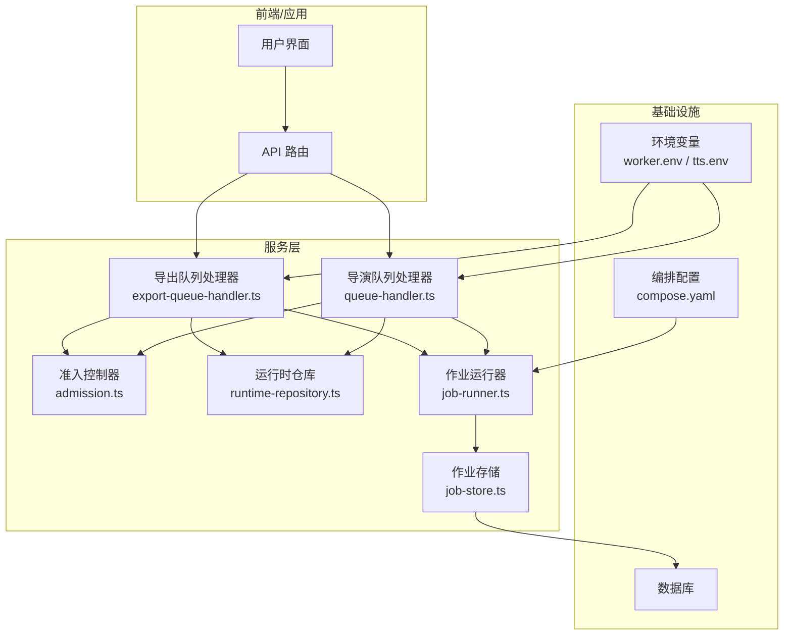
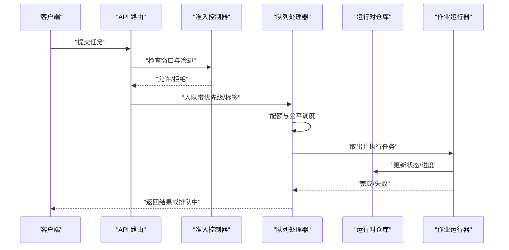
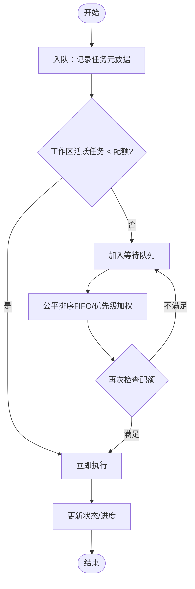
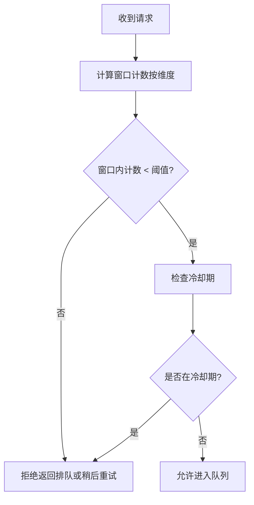
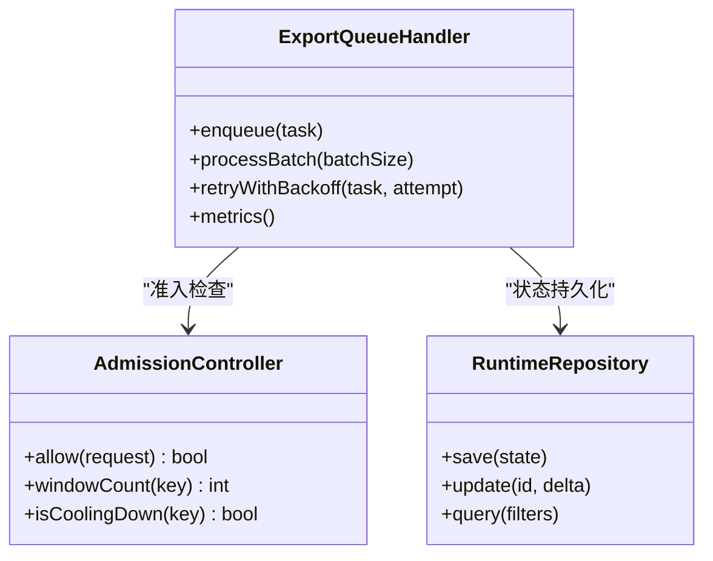
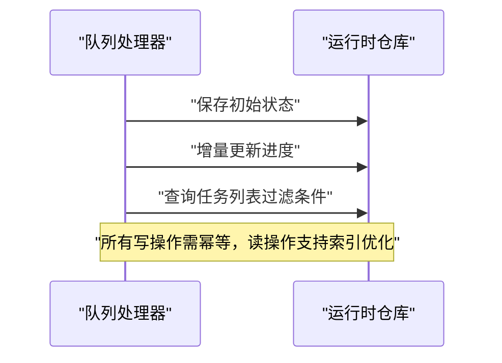
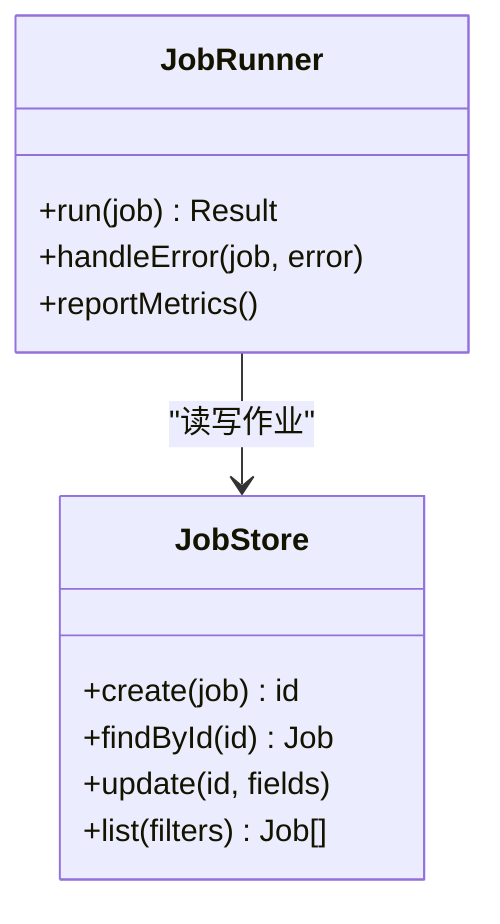
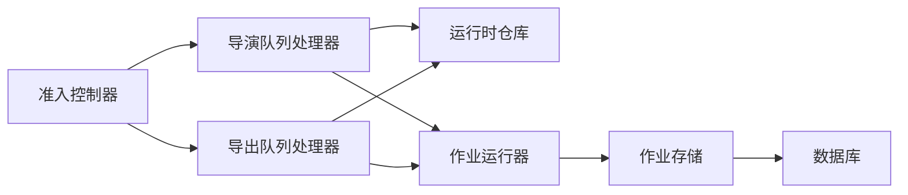

# 并发控制

<cite>
**本文引用的文件**   
- [ISSUE-004-queue-concurrency-lanes.md](file://docs/issues/ISSUE-004-queue-concurrency-lanes.md)
- [queue-handler.ts](file://src/features/director/queue-handler.ts)
- [queue-handler.test.ts](file://src/features/director/queue-handler.test.ts)
- [export-queue-handler.ts](file://src/features/render/export-queue-handler.ts)
- [export-queue-handler.test.ts](file://src/features/render/export-queue-handler.test.ts)
- [admission.ts](file://src/features/render/admission.ts)
- [admission.test.ts](file://src/features/render/admission.test.ts)
- [runtime-repository.ts](file://src/features/director/runtime-repository.ts)
- [runtime-repository.pg.test.ts](file://src/features/director/runtime-repository.pg.test.ts)
- [job-runner.ts](file://server/src/server/job-runner.ts)
- [job-store.ts](file://server/src/server/job-store.ts)
- [compose.yaml](file://deploy/compose.yaml)
- [worker.env.example](file://deploy/worker.env.example)
- [tts.env.example](file://config/tts.env.example)
</cite>

## 目录
1. [简介](#简介)
2. [项目结构](#项目结构)
3. [核心组件](#核心组件)
4. [架构总览](#架构总览)
5. [详细组件分析](#详细组件分析)
6. [依赖关系分析](#依赖关系分析)
7. [性能考量](#性能考量)
8. [故障排查指南](#故障排查指南)
9. [结论](#结论)
10. [附录](#附录)

## 简介
本文件面向 PurpleInk 的 AI 并发控制系统，聚焦工作区级并发限制、请求窗口控制与冷却机制的实现原理与配置方法。文档涵盖：
- 并发配额与限流策略的配置方式
- 请求排队与公平调度机制
- 不同用户级别、任务类型与资源可用性的动态调整
- 并发监控指标与可观测性
- 性能优化建议与常见问题排查

## 项目结构
与并发控制相关的代码主要分布在以下模块：
- 导演（Director）队列处理器：负责任务入队、出队、执行与状态管理
- 渲染导出队列处理器：针对导出任务的专用队列与限流
- 准入控制器：基于窗口与冷却策略的请求准入控制
- 运行时仓库：持久化任务状态与进度，支撑跨进程恢复
- 服务端作业运行器与存储：后台作业的执行与存储抽象
- 部署与环境配置：容器编排与并发相关环境变量

**图示来源** 
- [queue-handler.ts](file://src/features/director/queue-handler.ts)
- [export-queue-handler.ts](file://src/features/render/export-queue-handler.ts)
- [admission.ts](file://src/features/render/admission.ts)
- [runtime-repository.ts](file://src/features/director/runtime-repository.ts)
- [job-runner.ts](file://server/src/server/job-runner.ts)
- [job-store.ts](file://server/src/server/job-store.ts)
- [compose.yaml](file://deploy/compose.yaml)
- [worker.env.example](file://deploy/worker.env.example)
- [tts.env.example](file://config/tts.env.example)

**章节来源**
- [ISSUE-004-queue-concurrency-lanes.md](file://docs/issues/ISSUE-004-queue-concurrency-lanes.md)

## 核心组件
- 工作区队列处理器（Director Queue Handler）
  - 职责：维护工作区级并发槽位、处理任务入队/出队、协调执行与重试
  - 关键能力：按工作区分片、公平调度、窗口与冷却控制集成
- 导出队列处理器（Export Queue Handler）
  - 职责：针对导出任务的专用队列，支持独立配额与限流策略
  - 关键能力：批量导出时的吞吐控制、失败重试与退避
- 准入控制器（Admission Controller）
  - 职责：基于时间窗口与冷却期的请求准入判定
  - 关键能力：滑动窗口计数、冷却期检查、优先级与配额校验
- 运行时仓库（Runtime Repository）
  - 职责：持久化任务状态、进度与元数据，支撑崩溃恢复
  - 关键能力：幂等写入、乐观锁、查询索引优化
- 作业运行器与存储（Job Runner & Store）
  - 职责：执行具体任务逻辑、与外部系统交互；提供统一存储接口
  - 关键能力：任务生命周期管理、错误分类与上报

**章节来源**
- [queue-handler.ts](file://src/features/director/queue-handler.ts)
- [export-queue-handler.ts](file://src/features/render/export-queue-handler.ts)
- [admission.ts](file://src/features/render/admission.ts)
- [runtime-repository.ts](file://src/features/director/runtime-repository.ts)
- [job-runner.ts](file://server/src/server/job-runner.ts)
- [job-store.ts](file://server/src/server/job-store.ts)

## 架构总览
并发控制的整体流程如下：
- 请求进入后由准入控制器进行窗口与冷却检查
- 通过准入的任务进入对应工作区的队列处理器
- 队列处理器根据配额与公平策略选择下一个任务执行
- 执行过程中通过运行时仓库更新状态，失败时触发重试或降级
- 导出任务走专用队列，遵循独立的限流与批处理策略

**图示来源** 
- [admission.ts](file://src/features/render/admission.ts)
- [queue-handler.ts](file://src/features/director/queue-handler.ts)
- [export-queue-handler.ts](file://src/features/render/export-queue-handler.ts)
- [runtime-repository.ts](file://src/features/director/runtime-repository.ts)
- [job-runner.ts](file://server/src/server/job-runner.ts)

## 详细组件分析

### 工作区级并发限制与公平调度
- 设计要点
  - 按工作区隔离并发槽位，避免跨租户干扰
  - 使用公平队列保证同工作区内任务顺序与等待时间均衡
  - 结合优先级标签实现高优任务抢占或插队（可选）
- 实现思路
  - 入队时记录任务元数据（工作区ID、优先级、超时、重试次数）
  - 出队时检查当前工作区活跃任务数是否低于配额
  - 若未达配额则立即执行；否则进入等待队列并按公平策略排序
- 公平调度策略
  - 先进先出（FIFO）为主，支持按优先级加权
  - 防止饥饿：对长时间等待任务提升优先级或强制执行

**图示来源** 
- [queue-handler.ts](file://src/features/director/queue-handler.ts)
- [queue-handler.test.ts](file://src/features/director/queue-handler.test.ts)

**章节来源**
- [queue-handler.ts](file://src/features/director/queue-handler.ts)
- [queue-handler.test.ts](file://src/features/director/queue-handler.test.ts)

### 请求窗口控制与冷却机制
- 窗口控制
  - 基于时间窗口的滑动计数，限制单位时间内最大请求数
  - 支持按用户级别、任务类型、工作区维度统计
- 冷却机制
  - 对失败或慢响应任务设置冷却期，期间拒绝新请求
  - 冷却期结束后自动解除限制，允许重试或新请求
- 组合策略
  - 窗口与冷却共同作用：窗口限制整体吞吐，冷却保护后端稳定性

**图示来源** 
- [admission.ts](file://src/features/render/admission.ts)
- [admission.test.ts](file://src/features/render/admission.test.ts)

**章节来源**
- [admission.ts](file://src/features/render/admission.ts)
- [admission.test.ts](file://src/features/render/admission.test.ts)

### 导出队列与批处理限流
- 专用队列
  - 导出任务独立队列，避免与生成类任务争抢资源
- 批处理与吞吐控制
  - 支持批量导出，限制每批次大小与并发度
  - 失败重试采用指数退避，避免雪崩
- 监控与告警
  - 暴露队列长度、平均处理时长、失败率等指标

**图示来源** 
- [export-queue-handler.ts](file://src/features/render/export-queue-handler.ts)
- [export-queue-handler.test.ts](file://src/features/render/export-queue-handler.test.ts)
- [admission.ts](file://src/features/render/admission.ts)
- [runtime-repository.ts](file://src/features/director/runtime-repository.ts)

**章节来源**
- [export-queue-handler.ts](file://src/features/render/export-queue-handler.ts)
- [export-queue-handler.test.ts](file://src/features/render/export-queue-handler.test.ts)

### 运行时仓库与状态持久化
- 设计目标
  - 确保任务状态在进程重启后可恢复
  - 支持并发写入与幂等更新
- 关键操作
  - 保存初始状态、增量更新进度、查询过滤
  - 使用事务与乐观锁保障一致性

**图示来源** 
- [runtime-repository.ts](file://src/features/director/runtime-repository.ts)
- [runtime-repository.pg.test.ts](file://src/features/director/runtime-repository.pg.test.ts)

**章节来源**
- [runtime-repository.ts](file://src/features/director/runtime-repository.ts)
- [runtime-repository.pg.test.ts](file://src/features/director/runtime-repository.pg.test.ts)

### 作业运行器与存储抽象
- 运行器职责
  - 执行具体任务逻辑（如调用模型、渲染、导出）
  - 捕获异常并分类（网络、业务、资源不足）
- 存储抽象
  - 统一作业创建、查询、更新接口
  - 支持多后端（内存、数据库）

**图示来源** 
- [job-runner.ts](file://server/src/server/job-runner.ts)
- [job-store.ts](file://server/src/server/job-store.ts)

**章节来源**
- [job-runner.ts](file://server/src/server/job-runner.ts)
- [job-store.ts](file://server/src/server/job-store.ts)

## 依赖关系分析
- 组件耦合
  - 队列处理器依赖准入控制器与运行时仓库
  - 导出队列处理器复用准入控制器，但拥有独立配额与批处理逻辑
  - 作业运行器通过存储抽象解耦底层实现
- 外部依赖
  - 数据库用于持久化任务状态
  - 环境变量控制并发配额、窗口大小、冷却时长等参数
  - 容器编排影响实例数量与资源分配

**图示来源** 
- [admission.ts](file://src/features/render/admission.ts)
- [queue-handler.ts](file://src/features/director/queue-handler.ts)
- [export-queue-handler.ts](file://src/features/render/export-queue-handler.ts)
- [runtime-repository.ts](file://src/features/director/runtime-repository.ts)
- [job-runner.ts](file://server/src/server/job-runner.ts)
- [job-store.ts](file://server/src/server/job-store.ts)

**章节来源**
- [compose.yaml](file://deploy/compose.yaml)
- [worker.env.example](file://deploy/worker.env.example)
- [tts.env.example](file://config/tts.env.example)

## 性能考量
- 并发配额调优
  - 根据 CPU、内存、I/O 瓶颈调整工作区配额
  - 对不同任务类型设置差异化配额（如生成类 vs 导出类）
- 窗口与冷却参数
  - 窗口大小应匹配下游服务的稳定吞吐
  - 冷却时长依据错误类型与恢复时间设定
- 队列长度与背压
  - 监控队列长度，超过阈值时触发背压（拒绝新请求或延迟入队）
- 批处理与合并
  - 导出任务采用批处理减少上下文切换开销
- 缓存与去重
  - 对重复请求进行去重，降低重复计算

[本节为通用指导，无需特定文件引用]

## 故障排查指南
- 常见症状
  - 请求被频繁拒绝：检查窗口计数与冷却期配置
  - 队列堆积：检查工作区配额是否过低、任务执行是否阻塞
  - 任务失败率高：查看错误分类与重试策略
- 排查步骤
  - 确认环境变量中的并发限制与窗口参数
  - 检查运行时仓库中任务状态是否一致
  - 查看作业运行器的错误日志与指标
  - 验证容器资源分配与实例数量
- 定位工具
  - 暴露队列长度、平均处理时长、失败率等指标
  - 使用数据库查询快速定位卡住的任务

**章节来源**
- [queue-handler.ts](file://src/features/director/queue-handler.ts)
- [export-queue-handler.ts](file://src/features/render/export-queue-handler.ts)
- [admission.ts](file://src/features/render/admission.ts)
- [runtime-repository.ts](file://src/features/director/runtime-repository.ts)
- [job-runner.ts](file://server/src/server/job-runner.ts)
- [job-store.ts](file://server/src/server/job-store.ts)

## 结论
PurpleInk 的并发控制系统通过工作区隔离、窗口与冷却机制、专用队列与批处理策略，实现了高可用、可扩展且公平的 AI 任务调度。合理配置并发配额与限流策略，结合监控与故障排查手段，可有效应对不同负载场景与资源约束。

[本节为总结，无需特定文件引用]

## 附录
- 配置示例（概念性说明）
  - 工作区并发配额：按用户级别与工作区 ID 设置上限
  - 窗口大小：按分钟或秒为单位限制请求数
  - 冷却时长：根据错误类型设置不同冷却期
  - 导出批大小：限制每批次任务数量与并发度
- 监控指标建议
  - 队列长度、活跃任务数、平均处理时长、失败率、冷却命中率
- 最佳实践
  - 渐进式扩容：逐步提高配额并观察指标变化
  - 灰度发布：对新策略在小范围工作区验证
  - 自动化回滚：指标异常时自动恢复默认配置

[本节为补充信息，无需特定文件引用]