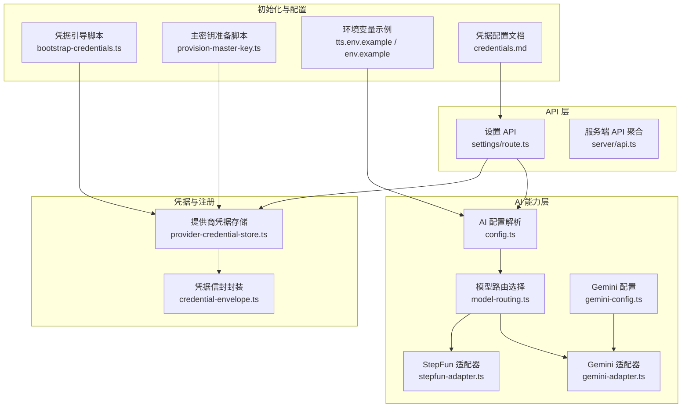
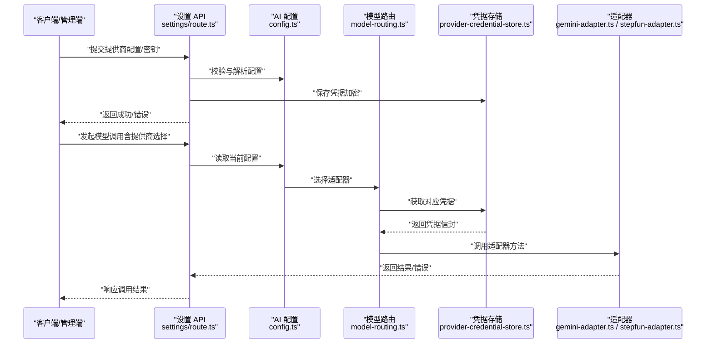
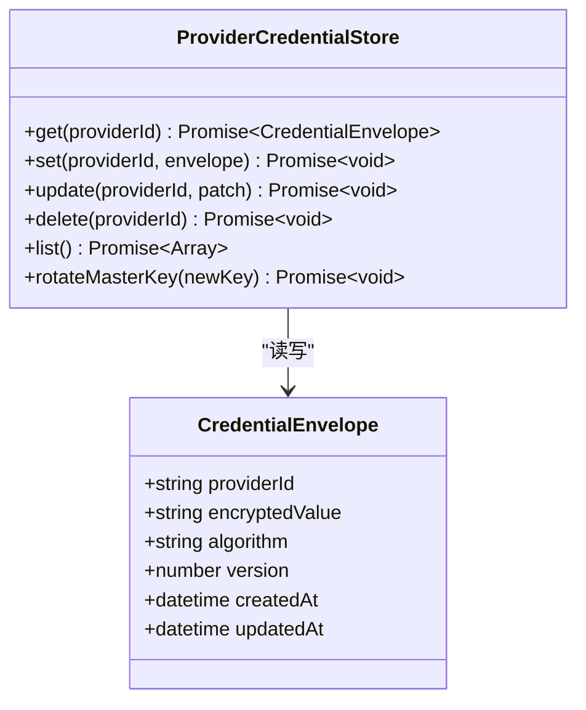
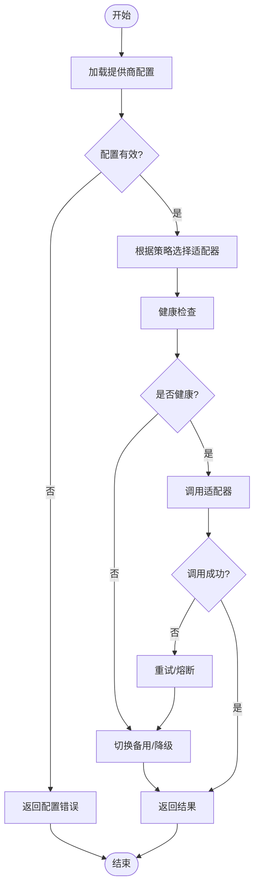
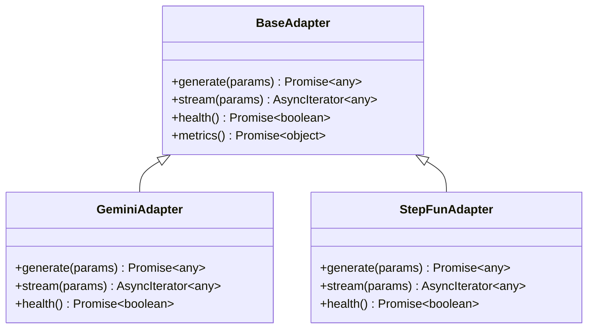
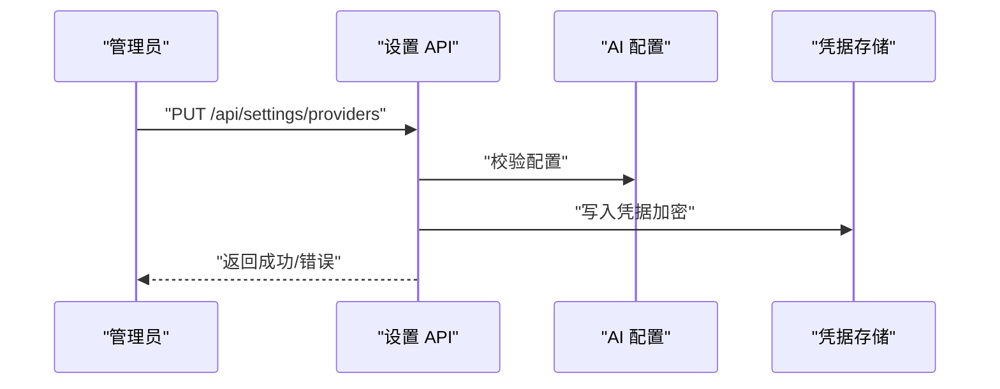
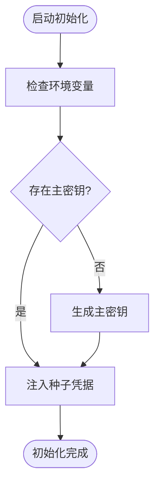
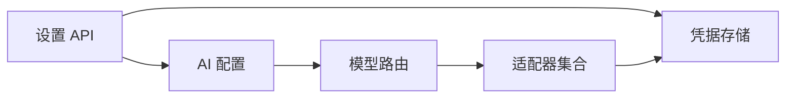

# 提供商管理

<cite>
**本文引用的文件**   
- [src/features/credentials/provider-credential-store.ts](file://src/features/credentials/provider-credential-store.ts)
- [src/features/credentials/credential-envelope.ts](file://src/features/credentials/credential-envelope.ts)
- [src/features/ai/config.ts](file://src/features/ai/config.ts)
- [src/features/ai/model-routing.ts](file://src/features/ai/model-routing.ts)
- [src/features/ai/gemini-config.ts](file://src/features/ai/gemini-config.ts)
- [src/features/ai/gemini-adapter.ts](file://src/features/ai/gemini-adapter.ts)
- [src/features/ai/stepfun-adapter.ts](file://src/features/ai/stepfun-adapter.ts)
- [src/app/api/settings/route.ts](file://src/app/api/settings/route.ts)
- [server/src/server/api.ts](file://server/src/server/api.ts)
- [scripts/setup/bootstrap-credentials.ts](file://scripts/setup/bootstrap-credentials.ts)
- [scripts/migration/provision-master-key.ts](file://scripts/migration/provision-master-key.ts)
- [config/tts.env.example](file://config/tts.env.example)
- [deploy/env.example](file://deploy/env.example)
- [docs/configuration/credentials.md](file://docs/configuration/credentials.md)
</cite>

## 目录
1. [简介](#简介)
2. [项目结构](#项目结构)
3. [核心组件](#核心组件)
4. [架构总览](#架构总览)
5. [详细组件分析](#详细组件分析)
6. [依赖关系分析](#依赖关系分析)
7. [性能考量](#性能考量)
8. [故障排查指南](#故障排查指南)
9. [结论](#结论)
10. [附录](#附录)

## 简介
本文件面向 PurpleInK 的“提供商管理系统”，聚焦以下目标：
- 提供商注册表的工作原理、动态加载机制与生命周期管理
- 凭据管理、安全存储、配置验证与服务发现
- 如何注册新提供商、管理 API 密钥、处理认证流程与管理服务状态
- 提供商健康检查、自动恢复机制与监控告警配置

该文档以代码仓库为依据，结合现有实现进行系统化说明，并提供可视化图示帮助理解。

## 项目结构
与“提供商管理”相关的关键目录与文件：
- 凭据与提供商注册：src/features/credentials
- AI 模型路由与适配器：src/features/ai
- 设置 API（提供商配置入口）：src/app/api/settings
- 服务端 API 聚合：server/src/server/api.ts
- 初始化脚本（凭据引导、主密钥准备）：scripts/setup, scripts/migration
- 环境变量示例与配置文档：config, deploy, docs/configuration

**图表来源** 
- [src/features/credentials/provider-credential-store.ts](file://src/features/credentials/provider-credential-store.ts)
- [src/features/credentials/credential-envelope.ts](file://src/features/credentials/credential-envelope.ts)
- [src/features/ai/config.ts](file://src/features/ai/config.ts)
- [src/features/ai/model-routing.ts](file://src/features/ai/model-routing.ts)
- [src/features/ai/gemini-config.ts](file://src/features/ai/gemini-config.ts)
- [src/features/ai/gemini-adapter.ts](file://src/features/ai/gemini-adapter.ts)
- [src/features/ai/stepfun-adapter.ts](file://src/features/ai/stepfun-adapter.ts)
- [src/app/api/settings/route.ts](file://src/app/api/settings/route.ts)
- [server/src/server/api.ts](file://server/src/server/api.ts)
- [scripts/setup/bootstrap-credentials.ts](file://scripts/setup/bootstrap-credentials.ts)
- [scripts/migration/provision-master-key.ts](file://scripts/migration/provision-master-key.ts)
- [config/tts.env.example](file://config/tts.env.example)
- [deploy/env.example](file://deploy/env.example)
- [docs/configuration/credentials.md](file://docs/configuration/credentials.md)

**章节来源**
- [src/features/credentials/provider-credential-store.ts](file://src/features/credentials/provider-credential-store.ts)
- [src/features/credentials/credential-envelope.ts](file://src/features/credentials/credential-envelope.ts)
- [src/features/ai/config.ts](file://src/features/ai/config.ts)
- [src/features/ai/model-routing.ts](file://src/features/ai/model-routing.ts)
- [src/features/ai/gemini-config.ts](file://src/features/ai/gemini-config.ts)
- [src/features/ai/gemini-adapter.ts](file://src/features/ai/gemini-adapter.ts)
- [src/features/ai/stepfun-adapter.ts](file://src/features/ai/stepfun-adapter.ts)
- [src/app/api/settings/route.ts](file://src/app/api/settings/route.ts)
- [server/src/server/api.ts](file://server/src/server/api.ts)
- [scripts/setup/bootstrap-credentials.ts](file://scripts/setup/bootstrap-credentials.ts)
- [scripts/migration/provision-master-key.ts](file://scripts/migration/provision-master-key.ts)
- [config/tts.env.example](file://config/tts.env.example)
- [deploy/env.example](file://deploy/env.example)
- [docs/configuration/credentials.md](file://docs/configuration/credentials.md)

## 核心组件
- 提供商凭据存储（Provider Credential Store）
  - 负责持久化与读取各提供商的凭据，支持按提供商维度隔离与访问控制。
  - 提供凭据的增删改查、批量更新与版本化能力。
- 凭据信封（Credential Envelope）
  - 对敏感字段进行统一封装，便于加密存储、传输与审计。
  - 包含元数据（创建时间、更新时间、版本、算法标识等）。
- AI 配置与路由（AI Config & Model Routing）
  - 解析并校验提供商配置，维护可用提供商列表与默认策略。
  - 根据请求上下文（如模型类型、区域、配额）选择具体适配器实例。
- 适配器（Adapter）
  - 针对具体提供商（如 Gemini、StepFun）实现统一的调用接口。
  - 内部处理鉴权、重试、限流、指标上报与健康检查。
- 设置 API（Settings API）
  - 对外暴露提供商配置的读写接口，供前端或管理端使用。
  - 负责输入校验、权限检查与变更审计。
- 初始化脚本
  - bootstrap-credentials：首次运行时的凭据初始化与种子数据注入。
  - provision-master-key：生成并部署主密钥，用于凭据加密。

**章节来源**
- [src/features/credentials/provider-credential-store.ts](file://src/features/credentials/provider-credential-store.ts)
- [src/features/credentials/credential-envelope.ts](file://src/features/credentials/credential-envelope.ts)
- [src/features/ai/config.ts](file://src/features/ai/config.ts)
- [src/features/ai/model-routing.ts](file://src/features/ai/model-routing.ts)
- [src/features/ai/gemini-config.ts](file://src/features/ai/gemini-config.ts)
- [src/features/ai/gemini-adapter.ts](file://src/features/ai/gemini-adapter.ts)
- [src/features/ai/stepfun-adapter.ts](file://src/features/ai/stepfun-adapter.ts)
- [src/app/api/settings/route.ts](file://src/app/api/settings/route.ts)
- [scripts/setup/bootstrap-credentials.ts](file://scripts/setup/bootstrap-credentials.ts)
- [scripts/migration/provision-master-key.ts](file://scripts/migration/provision-master-key.ts)

## 架构总览
下图展示了从设置 API 到提供商适配器的完整调用链，以及凭据存储与配置解析的交互。

**图表来源** 
- [src/app/api/settings/route.ts](file://src/app/api/settings/route.ts)
- [src/features/ai/config.ts](file://src/features/ai/config.ts)
- [src/features/ai/model-routing.ts](file://src/features/ai/model-routing.ts)
- [src/features/credentials/provider-credential-store.ts](file://src/features/credentials/provider-credential-store.ts)
- [src/features/ai/gemini-adapter.ts](file://src/features/ai/gemini-adapter.ts)
- [src/features/ai/stepfun-adapter.ts](file://src/features/ai/stepfun-adapter.ts)

## 详细组件分析

### 提供商凭据存储（Provider Credential Store）
- 职责
  - 按提供商维度组织凭据，支持多租户隔离。
  - 提供 CRUD、批量更新、版本回滚与审计日志。
- 数据结构
  - 凭据项包含：提供商 ID、密钥值（密文）、元数据（版本、创建/更新时间、算法标识）。
- 安全存储
  - 通过主密钥对敏感字段进行加密；主密钥由专用脚本生成与分发。
- 错误处理
  - 区分网络错误、解密失败、权限不足与数据不一致等场景，返回明确错误码。

**图表来源** 
- [src/features/credentials/provider-credential-store.ts](file://src/features/credentials/provider-credential-store.ts)
- [src/features/credentials/credential-envelope.ts](file://src/features/credentials/credential-envelope.ts)

**章节来源**
- [src/features/credentials/provider-credential-store.ts](file://src/features/credentials/provider-credential-store.ts)
- [src/features/credentials/credential-envelope.ts](file://src/features/credentials/credential-envelope.ts)
- [scripts/migration/provision-master-key.ts](file://scripts/migration/provision-master-key.ts)

### AI 配置与模型路由（Config & Routing）
- 配置解析
  - 从环境变量与数据库读取提供商配置，进行格式校验与必填项检查。
- 路由策略
  - 基于模型类型、区域、配额与权重选择适配器。
  - 支持热更新：配置变更后即时生效，无需重启。
- 健康检查
  - 定期探测适配器可达性与响应质量，标记不可用节点。
- 自动恢复
  - 当某适配器失败时，自动切换到备用提供商或降级策略。

**图表来源** 
- [src/features/ai/config.ts](file://src/features/ai/config.ts)
- [src/features/ai/model-routing.ts](file://src/features/ai/model-routing.ts)

**章节来源**
- [src/features/ai/config.ts](file://src/features/ai/config.ts)
- [src/features/ai/model-routing.ts](file://src/features/ai/model-routing.ts)

### 适配器实现（Gemini / StepFun）
- 统一接口
  - 所有适配器实现相同的调用契约（如 generate、stream、health）。
- 鉴权与限流
  - 在适配器内部完成签名、令牌刷新与速率限制。
- 指标与可观测性
  - 上报延迟、成功率、错误分类与配额使用情况。

**图表来源** 
- [src/features/ai/gemini-adapter.ts](file://src/features/ai/gemini-adapter.ts)
- [src/features/ai/stepfun-adapter.ts](file://src/features/ai/stepfun-adapter.ts)

**章节来源**
- [src/features/ai/gemini-adapter.ts](file://src/features/ai/gemini-adapter.ts)
- [src/features/ai/stepfun-adapter.ts](file://src/features/ai/stepfun-adapter.ts)

### 设置 API（提供商配置入口）
- 功能
  - 提供提供商配置的增删改查、批量导入导出、密钥轮换与审计。
- 安全
  - 输入校验、权限检查、敏感字段脱敏输出。
- 事务性
  - 配置更新采用事务保证一致性，失败回滚。

**图表来源** 
- [src/app/api/settings/route.ts](file://src/app/api/settings/route.ts)
- [src/features/ai/config.ts](file://src/features/ai/config.ts)
- [src/features/credentials/provider-credential-store.ts](file://src/features/credentials/provider-credential-store.ts)

**章节来源**
- [src/app/api/settings/route.ts](file://src/app/api/settings/route.ts)

### 初始化与配置
- 凭据引导（bootstrap-credentials）
  - 首次运行时创建默认提供商、注入种子凭据与基础策略。
- 主密钥准备（provision-master-key）
  - 生成主密钥并安全分发至运行环境，确保凭据加密可用性。
- 环境变量
  - tts.env.example 与 deploy/env.example 提供必要的环境变量模板。

**图表来源** 
- [scripts/setup/bootstrap-credentials.ts](file://scripts/setup/bootstrap-credentials.ts)
- [scripts/migration/provision-master-key.ts](file://scripts/migration/provision-master-key.ts)
- [config/tts.env.example](file://config/tts.env.example)
- [deploy/env.example](file://deploy/env.example)

**章节来源**
- [scripts/setup/bootstrap-credentials.ts](file://scripts/setup/bootstrap-credentials.ts)
- [scripts/migration/provision-master-key.ts](file://scripts/migration/provision-master-key.ts)
- [config/tts.env.example](file://config/tts.env.example)
- [deploy/env.example](file://deploy/env.example)

## 依赖关系分析
- 模块耦合
  - 设置 API 依赖 AI 配置与凭据存储；路由依赖适配器实现。
  - 适配器依赖凭据存储获取密钥，依赖配置获取策略。
- 外部依赖
  - 数据库（凭据持久化）、加密库（主密钥与凭据加密）、HTTP 客户端（调用第三方 API）。
- 潜在循环依赖
  - 通过分层与接口抽象避免循环；适配器与路由之间仅单向依赖。

**图表来源** 
- [src/app/api/settings/route.ts](file://src/app/api/settings/route.ts)
- [src/features/ai/config.ts](file://src/features/ai/config.ts)
- [src/features/ai/model-routing.ts](file://src/features/ai/model-routing.ts)
- [src/features/credentials/provider-credential-store.ts](file://src/features/credentials/provider-credential-store.ts)

**章节来源**
- [src/app/api/settings/route.ts](file://src/app/api/settings/route.ts)
- [src/features/ai/config.ts](file://src/features/ai/config.ts)
- [src/features/ai/model-routing.ts](file://src/features/ai/model-routing.ts)
- [src/features/credentials/provider-credential-store.ts](file://src/features/credentials/provider-credential-store.ts)

## 性能考量
- 配置缓存
  - 将提供商配置与路由策略缓存至内存，减少频繁 I/O。
- 连接池与并发
  - 适配器侧使用连接池与并发限制，避免下游服务过载。
- 健康检查频率
  - 合理设置健康检查间隔，平衡实时性与开销。
- 指标采样
  - 对高频指标进行采样与聚合，降低监控压力。

[本节为通用指导，不直接分析具体文件]

## 故障排查指南
- 常见问题
  - 配置无效：检查必填字段、格式与权限。
  - 凭据解密失败：确认主密钥正确且未过期。
  - 适配器不可用：查看健康检查与熔断状态，尝试切换备用提供商。
- 诊断步骤
  - 查看设置 API 的审计日志与错误码。
  - 检查凭据存储中的版本与加密算法标识。
  - 观察适配器指标（延迟、错误率、配额）。
- 恢复策略
  - 回滚配置版本、重新注入凭据、轮换主密钥后重启服务。

**章节来源**
- [src/app/api/settings/route.ts](file://src/app/api/settings/route.ts)
- [src/features/credentials/provider-credential-store.ts](file://src/features/credentials/provider-credential-store.ts)
- [src/features/ai/model-routing.ts](file://src/features/ai/model-routing.ts)

## 结论
PurpleInK 的提供商管理系统通过清晰的层次划分与接口抽象，实现了安全的凭据管理、灵活的模型路由与健壮的适配器生态。借助健康检查、自动恢复与完善的监控，系统能够在复杂环境下稳定运行。建议在生产环境中严格遵循配置与凭据管理规范，持续优化性能与可观测性。

[本节为总结，不直接分析具体文件]

## 附录
- 配置参考
  - 环境变量模板与配置文档见 config/tts.env.example、deploy/env.example 与 docs/configuration/credentials.md。
- 快速上手
  - 使用 bootstrap-credentials 与 provision-master-key 完成首次初始化。
- 扩展新提供商
  - 实现适配器接口，注册到路由与配置中，并通过设置 API 管理凭据。

**章节来源**
- [config/tts.env.example](file://config/tts.env.example)
- [deploy/env.example](file://deploy/env.example)
- [docs/configuration/credentials.md](file://docs/configuration/credentials.md)
- [scripts/setup/bootstrap-credentials.ts](file://scripts/setup/bootstrap-credentials.ts)
- [scripts/migration/provision-master-key.ts](file://scripts/migration/provision-master-key.ts)