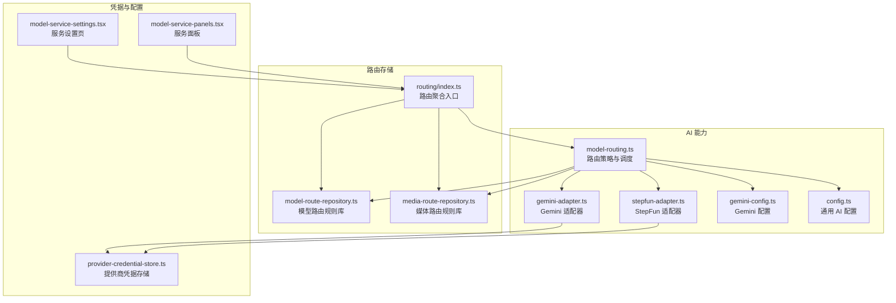
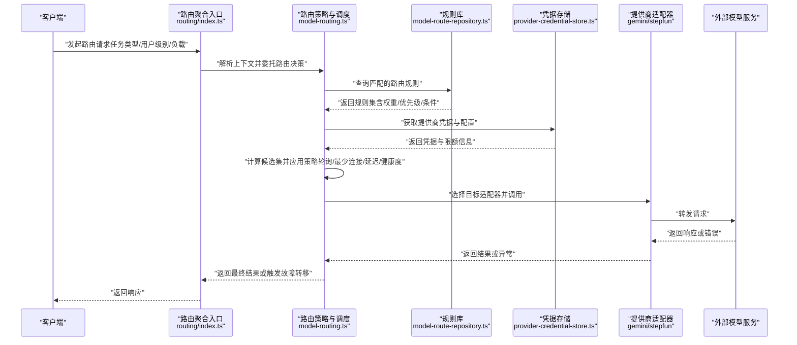
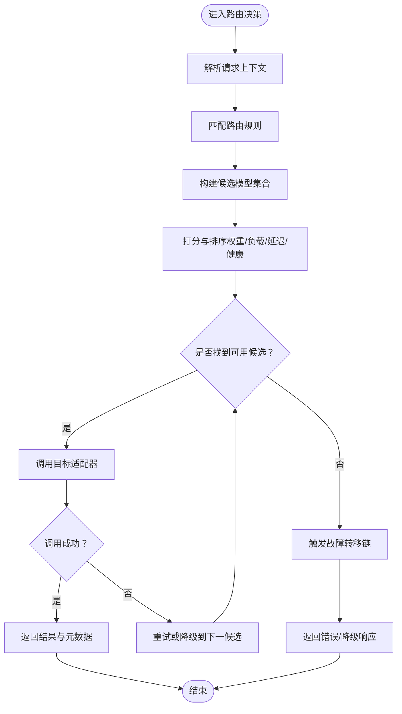
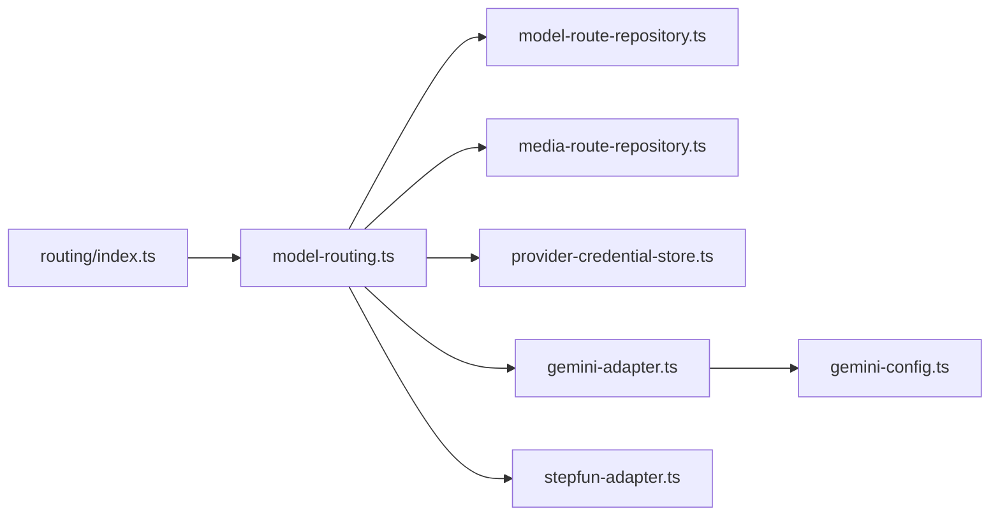

# 模型路由系统

<cite>
**本文引用的文件**   
- [src/features/ai/model-routing.ts](file://src/features/ai/model-routing.ts)
- [src/features/ai/model-routing.test.ts](file://src/features/ai/model-routing.test.ts)
- [src/features/routing/model-route-repository.ts](file://src/features/routing/model-route-repository.ts)
- [src/features/routing/media-route-repository.ts](file://src/features/routing/media-route-repository.ts)
- [src/features/routing/index.ts](file://src/features/routing/index.ts)
- [src/features/ai/config.ts](file://src/features/ai/config.ts)
- [src/features/ai/gemini-config.ts](file://src/features/ai/gemini-config.ts)
- [src/features/ai/gemini-adapter.ts](file://src/features/ai/gemini-adapter.ts)
- [src/features/ai/stepfun-adapter.ts](file://src/features/ai/stepfun-adapter.ts)
- [src/features/credentials/provider-credential-store.ts](file://src/features/credentials/provider-credential-store.ts)
- [src/app/products/(app)/settings/model-service-settings.tsx](file://src/app/products/(app)/settings/model-service-settings.tsx)
- [src/app/products/(app)/settings/model-service-panels.tsx](file://src/app/products/(app)/settings/model-service-panels.tsx)
- [docs/conventions/routing.md](file://docs/conventions/routing.md)
</cite>

## 目录
1. [简介](#简介)
2. [项目结构](#项目结构)
3. [核心组件](#核心组件)
4. [架构总览](#架构总览)
5. [详细组件分析](#详细组件分析)
6. [依赖关系分析](#依赖关系分析)
7. [性能考量](#性能考量)
8. [故障排查指南](#故障排查指南)
9. [结论](#结论)
10. [附录](#附录)

## 简介
本文件面向 PurpleInk 的“模型路由系统”，系统性阐述智能路由算法、负载均衡策略与提供商池管理机制，并给出可操作的配置方法：如何设置路由规则、优先级权重、故障转移与流量控制。文档同时提供路由决策流程图、关键监控指标与调优建议，帮助读者根据任务类型、用户级别与负载情况动态选择最优模型。

## 项目结构
围绕模型路由的核心代码主要分布在以下模块：
- 路由策略与调度：src/features/ai/model-routing.ts
- 路由规则持久化：src/features/routing/model-route-repository.ts、media-route-repository.ts
- 路由入口与聚合：src/features/routing/index.ts
- 提供商适配层与配置：src/features/ai/gemini-adapter.ts、gemini-config.ts、stepfun-adapter.ts、config.ts
- 凭据管理：src/features/credentials/provider-credential-store.ts
- 前端配置界面：src/app/products/(app)/settings/model-service-settings.tsx、model-service-panels.tsx
- 规范与设计约定：docs/conventions/routing.md

图表来源
- [src/features/ai/model-routing.ts](file://src/features/ai/model-routing.ts)
- [src/features/routing/model-route-repository.ts](file://src/features/routing/model-route-repository.ts)
- [src/features/routing/media-route-repository.ts](file://src/features/routing/media-route-repository.ts)
- [src/features/routing/index.ts](file://src/features/routing/index.ts)
- [src/features/ai/gemini-adapter.ts](file://src/features/ai/gemini-adapter.ts)
- [src/features/ai/stepfun-adapter.ts](file://src/features/ai/stepfun-adapter.ts)
- [src/features/ai/gemini-config.ts](file://src/features/ai/gemini-config.ts)
- [src/features/ai/config.ts](file://src/features/ai/config.ts)
- [src/features/credentials/provider-credential-store.ts](file://src/features/credentials/provider-credential-store.ts)
- [src/app/products/(app)/settings/model-service-settings.tsx](file://src/app/products/(app)/settings/model-service-settings.tsx)
- [src/app/products/(app)/settings/model-service-panels.tsx](file://src/app/products/(app)/settings/model-service-panels.tsx)

章节来源
- [docs/conventions/routing.md](file://docs/conventions/routing.md)

## 核心组件
- 路由策略与调度器（model-routing.ts）
  - 负责依据请求上下文（任务类型、用户级别、负载等）计算候选模型集合，应用权重与策略（轮询、最少连接、延迟感知、健康度等），并返回最终目标提供商与模型。
  - 支持失败重试与故障转移，结合健康检查与熔断阈值进行快速降级。
- 路由规则库（model-route-repository.ts、media-route-repository.ts）
  - 持久化模型路由规则与媒体路由规则，提供查询、更新与版本化管理能力。
  - 支持按维度（任务类型、用户级别、地域、配额等）匹配规则。
- 路由聚合入口（routing/index.ts）
  - 统一暴露路由查询接口，协调策略计算、规则检索与结果缓存。
- 提供商适配层（gemini-adapter.ts、stepfun-adapter.ts）
  - 封装不同 LLM/TTS 提供商的调用契约，屏蔽差异，向上提供统一接口。
- 配置与凭据（config.ts、gemini-config.ts、provider-credential-store.ts）
  - 集中管理提供商密钥、端点、超时、并发限制等参数；提供凭据的安全存取。
- 前端配置界面（model-service-settings.tsx、model-service-panels.tsx）
  - 可视化编辑路由规则、权重、优先级、健康阈值与限流策略，实时生效。

章节来源
- [src/features/ai/model-routing.ts](file://src/features/ai/model-routing.ts)
- [src/features/routing/model-route-repository.ts](file://src/features/routing/model-route-repository.ts)
- [src/features/routing/media-route-repository.ts](file://src/features/routing/media-route-repository.ts)
- [src/features/routing/index.ts](file://src/features/routing/index.ts)
- [src/features/ai/gemini-adapter.ts](file://src/features/ai/gemini-adapter.ts)
- [src/features/ai/stepfun-adapter.ts](file://src/features/ai/stepfun-adapter.ts)
- [src/features/ai/config.ts](file://src/features/ai/config.ts)
- [src/features/ai/gemini-config.ts](file://src/features/ai/gemini-config.ts)
- [src/features/credentials/provider-credential-store.ts](file://src/features/credentials/provider-credential-store.ts)
- [src/app/products/(app)/settings/model-service-settings.tsx](file://src/app/products/(app)/settings/model-service-settings.tsx)
- [src/app/products/(app)/settings/model-service-panels.tsx](file://src/app/products/(app)/settings/model-service-panels.tsx)

## 架构总览
下图展示从请求进入至模型调用的完整链路，包括规则匹配、策略计算、提供商选择与执行、以及错误回退路径。

图表来源
- [src/features/routing/index.ts](file://src/features/routing/index.ts)
- [src/features/ai/model-routing.ts](file://src/features/ai/model-routing.ts)
- [src/features/routing/model-route-repository.ts](file://src/features/routing/model-route-repository.ts)
- [src/features/credentials/provider-credential-store.ts](file://src/features/credentials/provider-credential-store.ts)
- [src/features/ai/gemini-adapter.ts](file://src/features/ai/gemini-adapter.ts)
- [src/features/ai/stepfun-adapter.ts](file://src/features/ai/stepfun-adapter.ts)

## 详细组件分析

### 路由策略与调度器（model-routing.ts）
- 职责
  - 接收请求上下文（任务类型、用户级别、地域、预算等）。
  - 基于规则库返回的规则集，计算候选模型集合。
  - 应用负载均衡策略（轮询、加权轮询、最少连接、延迟感知、健康度评分）。
  - 处理失败重试与故障转移（按优先级顺序切换提供商/模型）。
  - 输出最终路由决策与执行元数据（用于监控与审计）。
- 关键流程
  - 规则匹配：按任务类型、用户级别、地域等维度筛选规则。
  - 候选生成：将规则映射为可用提供商与模型列表。
  - 策略计算：综合权重、当前负载、延迟与健康状态排序。
  - 执行与回退：优先尝试高优先级节点，失败则按降级链回退。
- 复杂度与优化
  - 规则匹配通常为 O(n) 线性扫描，可通过索引与缓存优化。
  - 策略计算涉及排序与打分，注意批量计算与增量更新。
  - 健康检查与熔断阈值需异步刷新，避免阻塞主路径。

图表来源
- [src/features/ai/model-routing.ts](file://src/features/ai/model-routing.ts)

章节来源
- [src/features/ai/model-routing.ts](file://src/features/ai/model-routing.ts)
- [src/features/ai/model-routing.test.ts](file://src/features/ai/model-routing.test.ts)

### 路由规则库（model-route-repository.ts、media-route-repository.ts）
- 职责
  - 存储与查询模型路由规则（任务类型、用户级别、地域、配额、权重、优先级、健康阈值等）。
  - 维护媒体路由规则（音频/视频/图像等），与模型路由协同工作。
  - 提供规则版本管理与灰度发布能力。
- 数据结构要点
  - 规则项包含：匹配条件、目标提供商/模型、权重、优先级、健康阈值、限流参数。
  - 媒体规则包含：媒体类型、编码格式、转码策略、质量等级。
- 性能与一致性
  - 高频查询应配合本地缓存与失效策略。
  - 写入路径需保证幂等性与事务性，避免规则冲突。

章节来源
- [src/features/routing/model-route-repository.ts](file://src/features/routing/model-route-repository.ts)
- [src/features/routing/media-route-repository.ts](file://src/features/routing/media-route-repository.ts)

### 路由聚合入口（routing/index.ts）
- 职责
  - 统一对外暴露路由查询接口。
  - 协调规则库、策略计算与结果缓存。
  - 提供监控埋点与审计日志。
- 集成点
  - 与前端设置页面交互，实现规则热更新。
  - 与凭据存储对接，确保调用安全。

章节来源
- [src/features/routing/index.ts](file://src/features/routing/index.ts)

### 提供商适配层（gemini-adapter.ts、stepfun-adapter.ts）
- 职责
  - 封装各提供商的调用契约（认证、超时、重试、流式响应等）。
  - 统一错误码与异常类型，便于上层故障转移。
- 配置与凭据
  - 通过 gemini-config.ts 与 provider-credential-store.ts 管理密钥与端点。
  - 支持多租户与隔离调用。

章节来源
- [src/features/ai/gemini-adapter.ts](file://src/features/ai/gemini-adapter.ts)
- [src/features/ai/stepfun-adapter.ts](file://src/features/ai/stepfun-adapter.ts)
- [src/features/ai/gemini-config.ts](file://src/features/ai/gemini-config.ts)
- [src/features/credentials/provider-credential-store.ts](file://src/features/credentials/provider-credential-store.ts)

### 前端配置界面（model-service-settings.tsx、model-service-panels.tsx）
- 职责
  - 可视化编辑路由规则、权重、优先级、健康阈值与限流策略。
  - 实时预览规则匹配结果与模拟路由决策。
  - 提交变更至后端，触发规则热更新。
- 用户体验
  - 提供模板与示例规则，降低配置门槛。
  - 显示健康状态与告警提示。

章节来源
- [src/app/products/(app)/settings/model-service-settings.tsx](file://src/app/products/(app)/settings/model-service-settings.tsx)
- [src/app/products/(app)/settings/model-service-panels.tsx](file://src/app/products/(app)/settings/model-service-panels.tsx)

## 依赖关系分析
- 耦合与内聚
  - model-routing.ts 与规则库、凭据存储、适配器之间松耦合，通过接口抽象降低依赖强度。
  - routing/index.ts 作为聚合层，提高内聚性并简化外部调用。
- 外部依赖
  - 提供商 SDK/API 通过适配器隔离，便于替换与扩展。
  - 数据库与缓存用于规则持久化与高性能查询。
- 潜在循环依赖
  - 通过分层与接口解耦，避免直接循环引用。

图表来源
- [src/features/routing/index.ts](file://src/features/routing/index.ts)
- [src/features/ai/model-routing.ts](file://src/features/ai/model-routing.ts)
- [src/features/routing/model-route-repository.ts](file://src/features/routing/model-route-repository.ts)
- [src/features/routing/media-route-repository.ts](file://src/features/routing/media-route-repository.ts)
- [src/features/credentials/provider-credential-store.ts](file://src/features/credentials/provider-credential-store.ts)
- [src/features/ai/gemini-adapter.ts](file://src/features/ai/gemini-adapter.ts)
- [src/features/ai/stepfun-adapter.ts](file://src/features/ai/stepfun-adapter.ts)
- [src/features/ai/gemini-config.ts](file://src/features/ai/gemini-config.ts)

章节来源
- [src/features/routing/index.ts](file://src/features/routing/index.ts)
- [src/features/ai/model-routing.ts](file://src/features/ai/model-routing.ts)

## 性能考量
- 规则匹配优化
  - 使用索引与预过滤减少扫描范围。
  - 热点规则缓存，设置合理 TTL 与失效策略。
- 策略计算优化
  - 批量打分与排序，避免频繁 GC。
  - 增量更新候选集，减少重复计算。
- 健康检查与熔断
  - 异步刷新健康状态，避免阻塞主路径。
  - 设置合理的熔断阈值与恢复窗口。
- 监控与可观测性
  - 记录关键指标：QPS、延迟分布、错误率、熔断次数、回退次数、规则命中率。
  - 提供仪表盘与告警规则。

[本节为通用指导，不直接分析具体文件]

## 故障排查指南
- 常见问题定位
  - 规则未命中：检查匹配条件与优先级，确认规则版本已生效。
  - 提供商不可用：查看健康状态与凭据有效性，检查网络与配额。
  - 频繁回退：评估负载与健康阈值，调整权重与优先级。
- 诊断步骤
  - 启用详细日志与追踪 ID，定位调用链。
  - 检查规则库与缓存一致性。
  - 验证适配器错误码与异常类型。
- 恢复策略
  - 临时关闭问题提供商，启用降级模型。
  - 扩容或限流，缓解瞬时压力。
  - 回滚规则变更，恢复稳定状态。

章节来源
- [src/features/ai/model-routing.ts](file://src/features/ai/model-routing.ts)
- [src/features/routing/model-route-repository.ts](file://src/features/routing/model-route-repository.ts)
- [src/features/credentials/provider-credential-store.ts](file://src/features/credentials/provider-credential-store.ts)

## 结论
PurpleInk 的模型路由系统通过清晰的分层与模块化设计，实现了灵活、可扩展的智能路由与负载均衡能力。借助规则库、适配器与凭据管理，系统能够根据任务类型、用户级别与负载情况动态选择最优模型，并提供完善的故障转移与流量控制机制。配合监控指标与调优建议，可在复杂生产环境中保持高可用与高性能。

[本节为总结性内容，不直接分析具体文件]

## 附录
- 配置示例（概念性说明）
  - 按任务类型路由：文本生成走 Gemini，语音合成走 StepFun。
  - 按用户级别路由：VIP 用户优先高质量模型，普通用户走性价比模型。
  - 按负载路由：低延迟优先，超过阈值自动切换到备用提供商。
  - 权重与优先级：为不同模型设置权重，结合健康度动态调整。
  - 故障转移：主提供商失败时自动切换到次级提供商，直至恢复。
  - 流量控制：设置 QPS 上限与并发限制，防止过载。
- 监控指标建议
  - 路由命中率、平均延迟、P95/P99 延迟、错误率、熔断次数、回退次数、提供商可用性。
- 调优建议
  - 定期评估规则命中率与延迟分布，调整权重与优先级。
  - 根据业务峰值扩容提供商实例或增加配额。
  - 引入更细粒度的健康检查与熔断策略。

[本节为概念性内容，不直接分析具体文件]