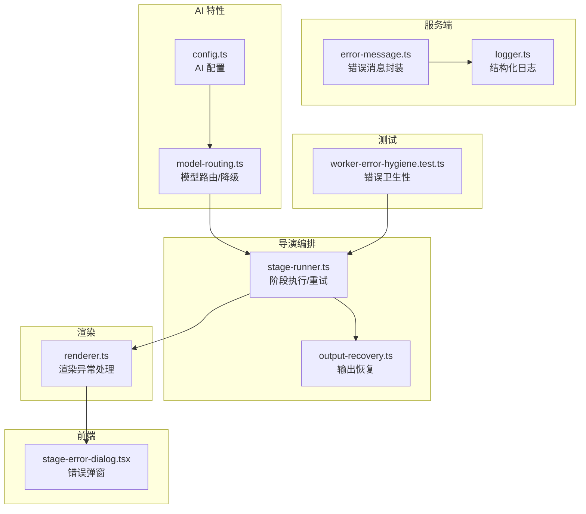
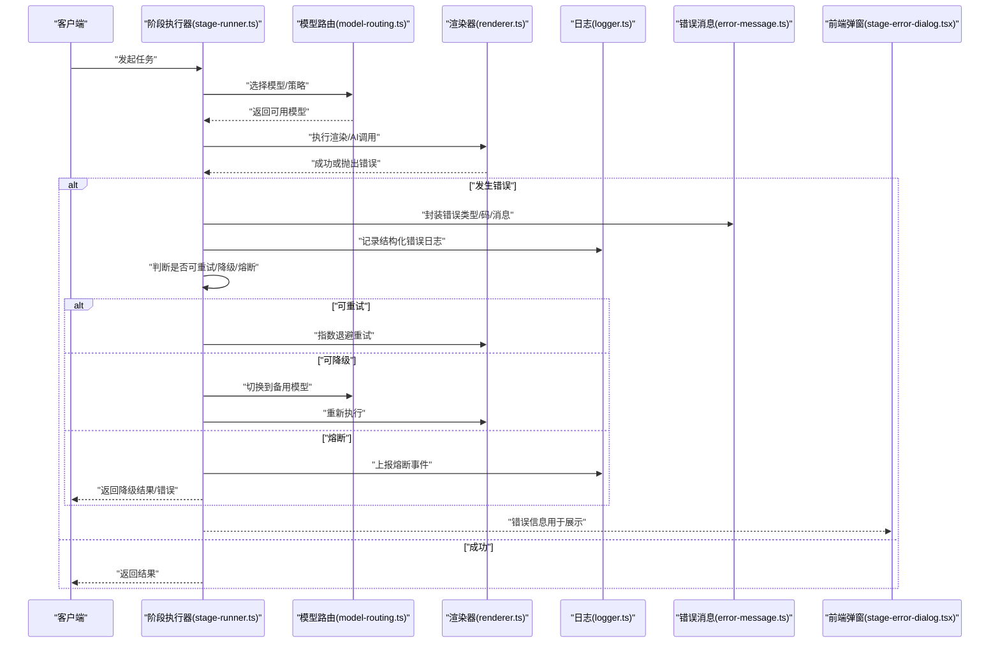
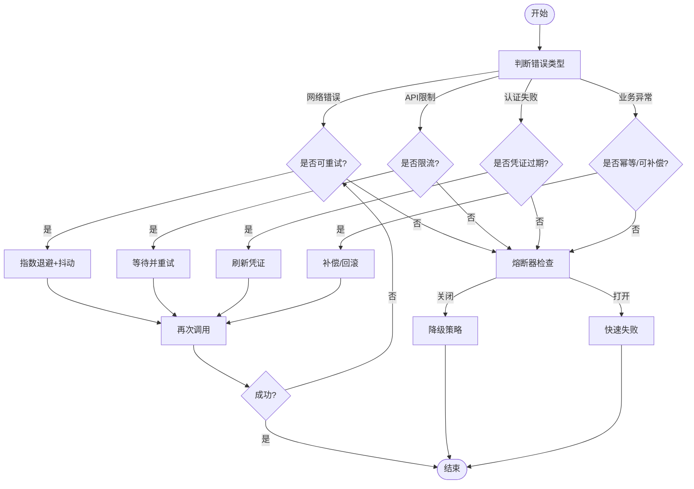
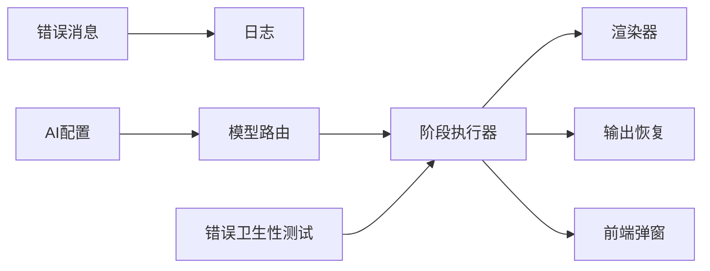

# 错误处理与恢复

<cite>
**本文引用的文件**   
- [server/src/lib/error-message.ts](file://server/src/lib/error-message.ts)
- [server/src/lib/logger.ts](file://server/src/lib/logger.ts)
- [src/features/ai/config.ts](file://src/features/ai/config.ts)
- [src/features/ai/model-routing.ts](file://src/features/ai/model-routing.ts)
- [src/features/director/output-recovery.ts](file://src/features/director/output-recovery.ts)
- [src/features/director/stage-runner.ts](file://src/features/director/stage-runner.ts)
- [src/features/render/renderer.ts](file://src/features/render/renderer.ts)
- [src/app/products/(app)/canvas/[projectId]/stage-error-dialog.tsx](file://src/app/products/(app)/canvas/[projectId]/stage-error-dialog.tsx)
- [tests/worker-error-hygiene.test.ts](file://tests/worker-error-hygiene.test.ts)
</cite>

## 目录
1. [简介](#简介)
2. [项目结构](#项目结构)
3. [核心组件](#核心组件)
4. [架构总览](#架构总览)
5. [详细组件分析](#详细组件分析)
6. [依赖关系分析](#依赖关系分析)
7. [性能考量](#性能考量)
8. [故障排查指南](#故障排查指南)
9. [结论](#结论)
10. [附录](#附录)

## 简介
本文件面向 PurpleInk 的 AI 错误处理与恢复机制，系统性阐述错误分类、处理策略与恢复方案。重点覆盖：
- 网络错误、API 限制（限流/配额）、认证失败、业务异常的识别与处理
- 重试机制、降级策略与熔断保护的具体实现思路
- 错误日志记录、监控告警配置与故障诊断工具使用指南

目标是帮助开发者快速定位问题、设计健壮的容错流程，并在生产环境中稳定运行。

## 项目结构
围绕错误处理与恢复的关键代码主要分布在以下位置：
- 服务端通用错误与日志能力：server/src/lib
- AI 模型路由与配置：src/features/ai
- 导演编排与输出恢复：src/features/director
- 渲染服务与异常边界：src/features/render
- 前端错误展示：src/app/products/(app)/canvas/[projectId]
- 测试用例验证错误卫生性：tests

图表来源
- [server/src/lib/error-message.ts](file://server/src/lib/error-message.ts)
- [server/src/lib/logger.ts](file://server/src/lib/logger.ts)
- [src/features/ai/config.ts](file://src/features/ai/config.ts)
- [src/features/ai/model-routing.ts](file://src/features/ai/model-routing.ts)
- [src/features/director/output-recovery.ts](file://src/features/director/output-recovery.ts)
- [src/features/director/stage-runner.ts](file://src/features/director/stage-runner.ts)
- [src/features/render/renderer.ts](file://src/features/render/renderer.ts)
- [src/app/products/(app)/canvas/[projectId]/stage-error-dialog.tsx](file://src/app/products/(app)/canvas/[projectId]/stage-error-dialog.tsx)
- [tests/worker-error-hygiene.test.ts](file://tests/worker-error-hygiene.test.ts)

章节来源
- [server/src/lib/error-message.ts](file://server/src/lib/error-message.ts)
- [server/src/lib/logger.ts](file://server/src/lib/logger.ts)
- [src/features/ai/config.ts](file://src/features/ai/config.ts)
- [src/features/ai/model-routing.ts](file://src/features/ai/model-routing.ts)
- [src/features/director/output-recovery.ts](file://src/features/director/output-recovery.ts)
- [src/features/director/stage-runner.ts](file://src/features/director/stage-runner.ts)
- [src/features/render/renderer.ts](file://src/features/render/renderer.ts)
- [src/app/products/(app)/canvas/[projectId]/stage-error-dialog.tsx](file://src/app/products/(app)/canvas/[projectId]/stage-error-dialog.tsx)
- [tests/worker-error-hygiene.test.ts](file://tests/worker-error-hygiene.test.ts)

## 核心组件
- 错误消息封装：统一错误类型、错误码与用户可读消息，便于前端展示与后端追踪。
- 结构化日志：为每次错误请求附带上下文（请求ID、阶段、模型、耗时等），支撑可观测性。
- AI 配置与路由：集中管理模型凭据、超时、并发与路由策略；支持按错误类型切换模型或回退。
- 阶段执行器：负责调用 AI/渲染管线，内置重试、退避与熔断逻辑。
- 输出恢复：在部分失败时尝试从中间状态恢复，保证最终一致性。
- 渲染器：捕获渲染过程中的异常并上报，避免级联失败。
- 前端错误弹窗：将错误信息以友好方式呈现给用户，并提供重试入口。
- 错误卫生性测试：确保错误传播路径清晰、无泄露敏感信息。

章节来源
- [server/src/lib/error-message.ts](file://server/src/lib/error-message.ts)
- [server/src/lib/logger.ts](file://server/src/lib/logger.ts)
- [src/features/ai/config.ts](file://src/features/ai/config.ts)
- [src/features/ai/model-routing.ts](file://src/features/ai/model-routing.ts)
- [src/features/director/stage-runner.ts](file://src/features/director/stage-runner.ts)
- [src/features/director/output-recovery.ts](file://src/features/director/output-recovery.ts)
- [src/features/render/renderer.ts](file://src/features/render/renderer.ts)
- [src/app/products/(app)/canvas/[projectId]/stage-error-dialog.tsx](file://src/app/products/(app)/canvas/[projectId]/stage-error-dialog.tsx)
- [tests/worker-error-hygiene.test.ts](file://tests/worker-error-hygiene.test.ts)

## 架构总览
下图展示了错误处理与恢复的整体流程：请求进入后由阶段执行器调度，遇到错误时通过错误消息封装与日志记录，随后根据错误类型触发重试、降级或熔断；必要时进行输出恢复，最终向前端返回友好的错误提示。

图表来源
- [src/features/director/stage-runner.ts](file://src/features/director/stage-runner.ts)
- [src/features/ai/model-routing.ts](file://src/features/ai/model-routing.ts)
- [src/features/render/renderer.ts](file://src/features/render/renderer.ts)
- [server/src/lib/logger.ts](file://server/src/lib/logger.ts)
- [server/src/lib/error-message.ts](file://server/src/lib/error-message.ts)
- [src/app/products/(app)/canvas/[projectId]/stage-error-dialog.tsx](file://src/app/products/(app)/canvas/[projectId]/stage-error-dialog.tsx)

## 详细组件分析

### 错误消息封装与分类
- 目标：统一错误类型、错误码与用户可读消息，确保前后端一致。
- 关键点：
  - 区分网络错误、API 限制、认证失败、业务异常等类别
  - 提供错误码映射与扩展点
  - 屏蔽敏感信息，仅暴露必要字段给前端

章节来源
- [server/src/lib/error-message.ts](file://server/src/lib/error-message.ts)

### 结构化日志与可观测性
- 目标：为每次错误请求记录完整上下文，便于追踪与告警。
- 关键点：
  - 包含请求ID、阶段、模型、耗时、错误码、堆栈摘要
  - 分级日志（info/warn/error）与采样策略
  - 对接外部监控系统（指标、链路追踪）

章节来源
- [server/src/lib/logger.ts](file://server/src/lib/logger.ts)

### AI 配置与模型路由（含降级）
- 目标：集中管理模型配置与路由策略，支持按错误类型切换模型或回退。
- 关键点：
  - 配置项：超时、并发、重试次数、退避策略
  - 路由规则：健康检查、权重分配、错误率阈值
  - 降级策略：当主模型不可用时自动切换到备用模型

章节来源
- [src/features/ai/config.ts](file://src/features/ai/config.ts)
- [src/features/ai/model-routing.ts](file://src/features/ai/model-routing.ts)

### 阶段执行器（重试、退避、熔断）
- 目标：在执行 AI/渲染任务时，内置健壮的重试、退避与熔断逻辑。
- 关键点：
  - 重试条件：仅对可重试错误（如网络抖动、临时限流）生效
  - 退避策略：指数退避 + 抖动，避免雪崩
  - 熔断：连续失败达到阈值后快速失败，降低负载

图表来源
- [src/features/director/stage-runner.ts](file://src/features/director/stage-runner.ts)

章节来源
- [src/features/director/stage-runner.ts](file://src/features/director/stage-runner.ts)

### 输出恢复（部分失败时的恢复）
- 目标：在流水线部分节点失败时，尝试从中间状态恢复，保证最终一致性。
- 关键点：
  - 检查已完成的中间产物
  - 选择性重放失败的步骤
  - 合并增量更新，避免重复计算

章节来源
- [src/features/director/output-recovery.ts](file://src/features/director/output-recovery.ts)

### 渲染器异常处理
- 目标：捕获渲染过程中的异常并上报，避免级联失败。
- 关键点：
  - 区分资源不足、格式不支持、超时等错误
  - 清理临时文件与锁
  - 上报指标与日志

章节来源
- [src/features/render/renderer.ts](file://src/features/render/renderer.ts)

### 前端错误弹窗与用户引导
- 目标：将错误信息以友好方式呈现给用户，并提供重试入口。
- 关键点：
  - 根据错误码显示不同文案
  - 提供“重试”、“切换模型”、“联系客服”等操作
  - 隐藏敏感细节，仅展示必要信息

章节来源
- [src/app/products/(app)/canvas/[projectId]/stage-error-dialog.tsx](file://src/app/products/(app)/canvas/[projectId]/stage-error-dialog.tsx)

### 错误卫生性测试
- 目标：确保错误传播路径清晰、无泄露敏感信息、符合契约。
- 关键点：
  - 断言错误类型与消息格式
  - 验证日志中不包含密钥
  - 模拟各种失败场景

章节来源
- [tests/worker-error-hygiene.test.ts](file://tests/worker-error-hygiene.test.ts)

## 依赖关系分析
- 低耦合：错误消息与日志模块被上层广泛复用，职责单一。
- 高内聚：阶段执行器集中处理重试、退避、熔断逻辑。
- 外部依赖：AI 模型提供方、渲染引擎、存储与队列。
- 潜在循环：应避免 stage-runner 与 model-routing 之间的直接循环引用，通过接口解耦。

图表来源
- [server/src/lib/error-message.ts](file://server/src/lib/error-message.ts)
- [server/src/lib/logger.ts](file://server/src/lib/logger.ts)
- [src/features/ai/config.ts](file://src/features/ai/config.ts)
- [src/features/ai/model-routing.ts](file://src/features/ai/model-routing.ts)
- [src/features/director/stage-runner.ts](file://src/features/director/stage-runner.ts)
- [src/features/director/output-recovery.ts](file://src/features/director/output-recovery.ts)
- [src/features/render/renderer.ts](file://src/features/render/renderer.ts)
- [src/app/products/(app)/canvas/[projectId]/stage-error-dialog.tsx](file://src/app/products/(app)/canvas/[projectId]/stage-error-dialog.tsx)
- [tests/worker-error-hygiene.test.ts](file://tests/worker-error-hygiene.test.ts)

章节来源
- [server/src/lib/error-message.ts](file://server/src/lib/error-message.ts)
- [server/src/lib/logger.ts](file://server/src/lib/logger.ts)
- [src/features/ai/config.ts](file://src/features/ai/config.ts)
- [src/features/ai/model-routing.ts](file://src/features/ai/model-routing.ts)
- [src/features/director/stage-runner.ts](file://src/features/director/stage-runner.ts)
- [src/features/director/output-recovery.ts](file://src/features/director/output-recovery.ts)
- [src/features/render/renderer.ts](file://src/features/render/renderer.ts)
- [src/app/products/(app)/canvas/[projectId]/stage-error-dialog.tsx](file://src/app/products/(app)/canvas/[projectId]/stage-error-dialog.tsx)
- [tests/worker-error-hygiene.test.ts](file://tests/worker-error-hygiene.test.ts)

## 性能考量
- 重试与退避：合理设置最大重试次数与退避上限，避免放大延迟。
- 熔断阈值：基于错误率与慢调用比例动态调整，防止雪崩。
- 日志采样：在高吞吐下启用采样，减少 IO 压力。
- 资源清理：及时释放临时文件、连接与锁，避免泄漏。
- 并行度控制：限制并发调用，避免下游过载。

## 故障排查指南
- 快速定位：
  - 查看结构化日志中的错误码与请求ID
  - 确认是否触发熔断或降级
  - 检查上游依赖的健康状态
- 常见错误与对策：
  - 网络错误：检查网络连通性与 DNS，增加重试与退避
  - API 限制：观察限流响应，降低并发或申请配额
  - 认证失败：刷新凭证或检查密钥有效期
  - 业务异常：核对输入数据与业务规则，必要时补偿
- 监控告警：
  - 错误率突增、熔断开启、重试次数过高、慢调用比例上升
  - 关键依赖不可用或响应时间超过阈值
- 诊断工具：
  - 使用请求ID追踪全链路日志
  - 导出错误样本进行分析
  - 回放失败请求复现问题

## 结论
PurpleInk 的错误处理与恢复机制通过统一的错误消息、结构化日志、智能路由与恢复策略，构建了健壮的容错体系。建议在生产环境中持续优化重试与熔断参数，完善监控告警，并结合测试用例保障错误处理的稳定性与正确性。

## 附录
- 最佳实践清单：
  - 明确错误分类与处理策略
  - 使用指数退避与抖动
  - 实施熔断与快速失败
  - 记录结构化日志与指标
  - 前端友好提示与操作引导
  - 定期演练与回归测试