# 交互设计

<cite>
**本文档引用的文件**   
- [src/app/products/(app)/canvas/[projectId]/page.tsx](file://src/app/products/(app)/canvas/[projectId]/page.tsx)
- [src/app/products/(app)/canvas/[projectId]/canvas-view.tsx](file://src/app/products/(app)/canvas/[projectId]/canvas-view.tsx)
- [src/app/products/(app)/canvas/[projectId]/flow-elements.tsx](file://src/app/products/(app)/canvas/[projectId]/flow-elements.tsx)
- [src/app/products/(app)/canvas/[projectId]/canvas-inspector.tsx](file://src/app/products/(app)/canvas/[projectId]/canvas-inspector.tsx)
- [src/app/products/(app)/canvas/[projectId]/canvas-action-api.ts](file://src/app/products/(app)/canvas/[projectId]/canvas-action-api.ts)
- [src/features/canvas/index.ts](file://src/features/canvas/index.ts)
- [src/features/canvas/types.ts](file://src/features/canvas/types.ts)
- [src/features/canvas/actions.ts](file://src/features/canvas/actions.ts)
- [src/features/canvas/layout.ts](file://src/features/canvas/layout.ts)
- [src/features/canvas/queries.ts](file://src/features/canvas/queries.ts)
- [src/features/canvas/status.ts](file://src/features/canvas/status.ts)
- [src/features/canvas/export-settings.ts](file://src/features/canvas/export-settings.ts)
- [src/lib/motion/index.ts](file://src/lib/motion/index.ts)
- [src/components/ui/top-bar.tsx](file://src/components/ui/top-bar.tsx)
- [src/components/ui/sidebar.tsx](file://src/components/ui/sidebar.tsx)
- [src/components/ui/dialog.tsx](file://src/components/ui/dialog.tsx)
- [src/components/ui/toast.tsx](file://src/components/ui/toast.tsx)
- [src/components/ui/tooltip.tsx](file://src/components/ui/tooltip.tsx)
</cite>

## 目录
1. [简介](#简介)
2. [项目结构](#项目结构)
3. [核心组件](#核心组件)
4. [架构总览](#架构总览)
5. [详细组件分析](#详细组件分析)
6. [依赖关系分析](#依赖关系分析)
7. [性能考虑](#性能考虑)
8. [故障排查指南](#故障排查指南)
9. [结论](#结论)
10. [附录](#附录)

## 简介
本文件面向 PurpleInk 编辑器交互设计，聚焦画布与节点编辑的核心体验：拖拽操作、选择框、右键菜单、快捷键支持；并阐述撤销重做机制、批量操作、协作编辑能力；详细说明动画效果与过渡动画的实现方式；覆盖无障碍访问支持与移动端适配策略；最后提供具体交互模式示例与用户体验优化建议。文档以仓库中的实际代码为依据，确保可追溯性与落地性。

## 项目结构
与编辑器交互相关的前端代码主要位于 src/app/products/(app)/canvas 与 src/features/canvas，UI 组件集中在 src/components/ui，动效库在 src/lib/motion。整体采用“页面容器 + 视图层 + 特性域（features）+ UI 组件”的分层组织：
- 页面容器：负责路由挂载、状态初始化与全局事件绑定
- 视图层：渲染画布、工具栏、侧边检查器与反馈面板
- 特性域：封装画布数据模型、布局算法、查询与动作编排
- UI 组件：通用对话框、提示、工具栏等交互控件

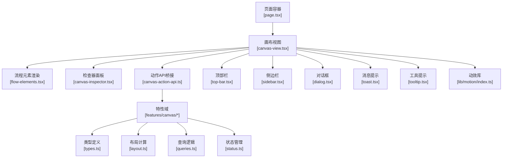

图表来源
- [src/app/products/(app)/canvas/[projectId]/page.tsx](file://src/app/products/(app)/canvas/[projectId]/page.tsx)
- [src/app/products/(app)/canvas/[projectId]/canvas-view.tsx](file://src/app/products/(app)/canvas/[projectId]/canvas-view.tsx)
- [src/app/products/(app)/canvas/[projectId]/flow-elements.tsx](file://src/app/products/(app)/canvas/[projectId]/flow-elements.tsx)
- [src/app/products/(app)/canvas/[projectId]/canvas-inspector.tsx](file://src/app/products/(app)/canvas/[projectId]/canvas-inspector.tsx)
- [src/app/products/(app)/canvas/[projectId]/canvas-action-api.ts](file://src/app/products/(app)/canvas/[projectId]/canvas-action-api.ts)
- [src/features/canvas/index.ts](file://src/features/canvas/index.ts)
- [src/features/canvas/types.ts](file://src/features/canvas/types.ts)
- [src/features/canvas/layout.ts](file://src/features/canvas/layout.ts)
- [src/features/canvas/queries.ts](file://src/features/canvas/queries.ts)
- [src/features/canvas/status.ts](file://src/features/canvas/status.ts)
- [src/components/ui/top-bar.tsx](file://src/components/ui/top-bar.tsx)
- [src/components/ui/sidebar.tsx](file://src/components/ui/sidebar.tsx)
- [src/components/ui/dialog.tsx](file://src/components/ui/dialog.tsx)
- [src/components/ui/toast.tsx](file://src/components/ui/toast.tsx)
- [src/components/ui/tooltip.tsx](file://src/components/ui/tooltip.tsx)
- [src/lib/motion/index.ts](file://src/lib/motion/index.ts)

章节来源
- [src/app/products/(app)/canvas/[projectId]/page.tsx](file://src/app/products/(app)/canvas/[projectId]/page.tsx)
- [src/app/products/(app)/canvas/[projectId]/canvas-view.tsx](file://src/app/products/(app)/canvas/[projectId]/canvas-view.tsx)
- [src/features/canvas/index.ts](file://src/features/canvas/index.ts)

## 核心组件
- 画布视图（Canvas View）：承载节点渲染、交互事件分发、缩放平移、选择框绘制与选中态更新
- 流程元素（Flow Elements）：节点与连线的可视化呈现，响应拖拽、调整大小、连接点命中检测
- 检查器面板（Inspector）：展示选中节点的属性与元信息，支持实时编辑与同步回写
- 动作API（Action API）：将用户操作转换为可撤销重做的命令对象，协调状态变更与副作用
- 特性域（Canvas Features）：类型定义、布局算法、查询接口、状态机与导出设置

章节来源
- [src/app/products/(app)/canvas/[projectId]/canvas-view.tsx](file://src/app/products/(app)/canvas/[projectId]/canvas-view.tsx)
- [src/app/products/(app)/canvas/[projectId]/flow-elements.tsx](file://src/app/products/(app)/canvas/[projectId]/flow-elements.tsx)
- [src/app/products/(app)/canvas/[projectId]/canvas-inspector.tsx](file://src/app/products/(app)/canvas/[projectId]/canvas-inspector.tsx)
- [src/app/products/(app)/canvas/[projectId]/canvas-action-api.ts](file://src/app/products/(app)/canvas/[projectId]/canvas-action-api.ts)
- [src/features/canvas/types.ts](file://src/features/canvas/types.ts)
- [src/features/canvas/layout.ts](file://src/features/canvas/layout.ts)
- [src/features/canvas/queries.ts](file://src/features/canvas/queries.ts)
- [src/features/canvas/status.ts](file://src/features/canvas/status.ts)
- [src/features/canvas/export-settings.ts](file://src/features/canvas/export-settings.ts)

## 架构总览
交互系统遵循“事件驱动 + 命令模式 + 状态隔离”的架构：
- 输入层：鼠标/触摸/键盘事件统一收集，归一化为交互指令
- 命令层：将指令封装为可撤销/重做的命令对象，支持批量提交
- 状态层：基于不可变快照或增量补丁的状态管理，保证一致性
- 渲染层：按需重绘与增量更新，结合动效库实现平滑过渡
- 协作层：通过事件流与冲突解决策略，支持多用户并发编辑

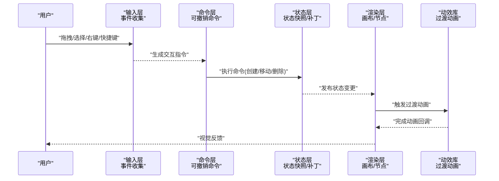

图表来源
- [src/app/products/(app)/canvas/[projectId]/canvas-view.tsx](file://src/app/products/(app)/canvas/[projectId]/canvas-view.tsx)
- [src/app/products/(app)/canvas/[projectId]/canvas-action-api.ts](file://src/app/products/(app)/canvas/[projectId]/canvas-action-api.ts)
- [src/features/canvas/status.ts](file://src/features/canvas/status.ts)
- [src/lib/motion/index.ts](file://src/lib/motion/index.ts)

## 详细组件分析

### 拖拽操作
- 支持节点拖拽、连线拖拽、画布区域拖拽平移
- 命中检测：节点边界、连接点半径、选择框矩形
- 拖拽过程：实时预览位置、吸附网格、约束边界
- 拖拽结束：落位校验、碰撞检测、自动布局修正

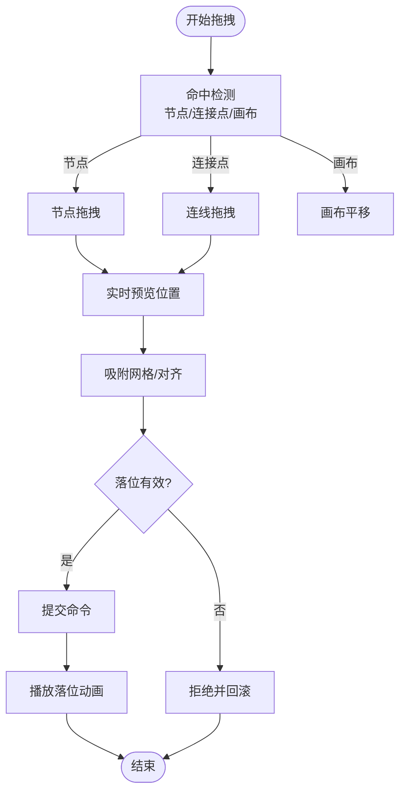

图表来源
- [src/app/products/(app)/canvas/[projectId]/flow-elements.tsx](file://src/app/products/(app)/canvas/[projectId]/flow-elements.tsx)
- [src/app/products/(app)/canvas/[projectId]/canvas-view.tsx](file://src/app/products/(app)/canvas/[projectId]/canvas-view.tsx)
- [src/features/canvas/layout.ts](file://src/features/canvas/layout.ts)

章节来源
- [src/app/products/(app)/canvas/[projectId]/flow-elements.tsx](file://src/app/products/(app)/canvas/[projectId]/flow-elements.tsx)
- [src/app/products/(app)/canvas/[projectId]/canvas-view.tsx](file://src/app/products/(app)/canvas/[projectId]/canvas-view.tsx)
- [src/features/canvas/layout.ts](file://src/features/canvas/layout.ts)

### 选择框
- 支持矩形选择框，多选节点与连线
- 选择框绘制：跟随鼠标拖动，实时高亮被选中的元素
- 选择结果：合并到当前选择集，支持 Shift/Ctrl 修饰键行为
- 选择联动：检查器面板同步显示选中项的属性

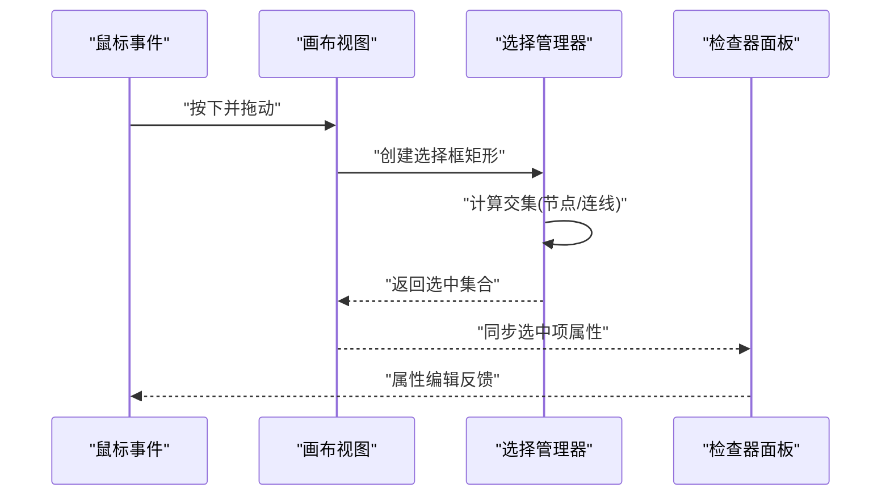

图表来源
- [src/app/products/(app)/canvas/[projectId]/canvas-view.tsx](file://src/app/products/(app)/canvas/[projectId]/canvas-view.tsx)
- [src/app/products/(app)/canvas/[projectId]/canvas-inspector.tsx](file://src/app/products/(app)/canvas/[projectId]/canvas-inspector.tsx)

章节来源
- [src/app/products/(app)/canvas/[projectId]/canvas-view.tsx](file://src/app/products/(app)/canvas/[projectId]/canvas-view.tsx)
- [src/app/products/(app)/canvas/[projectId]/canvas-inspector.tsx](file://src/app/products/(app)/canvas/[projectId]/canvas-inspector.tsx)

### 右键菜单
- 上下文菜单：根据选中元素类型动态生成菜单项
- 菜单项：打开属性面板、复制、删除、设为默认等
- 定位策略：靠近光标且不溢出视口，支持键盘导航
- 无障碍：ARIA 角色与焦点管理，屏幕阅读器友好

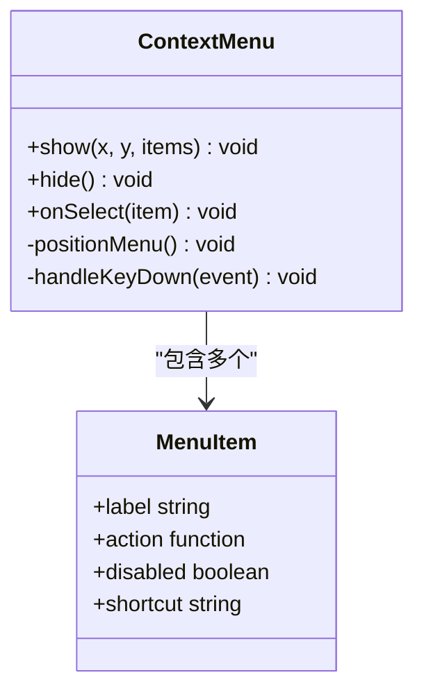

图表来源
- [src/components/ui/dialog.tsx](file://src/components/ui/dialog.tsx)
- [src/components/ui/tooltip.tsx](file://src/components/ui/tooltip.tsx)

章节来源
- [src/components/ui/dialog.tsx](file://src/components/ui/dialog.tsx)
- [src/components/ui/tooltip.tsx](file://src/components/ui/tooltip.tsx)

### 快捷键支持
- 全局快捷键：Ctrl/Cmd + Z/Y 撤销重做，Delete 删除，A 全选，Space 播放/暂停
- 局部快捷键：Enter 编辑文本，Esc 取消选择，Shift 多选
- 冲突处理：按作用域优先级解析，避免与浏览器默认行为冲突
- 可配置：允许用户自定义快捷键映射

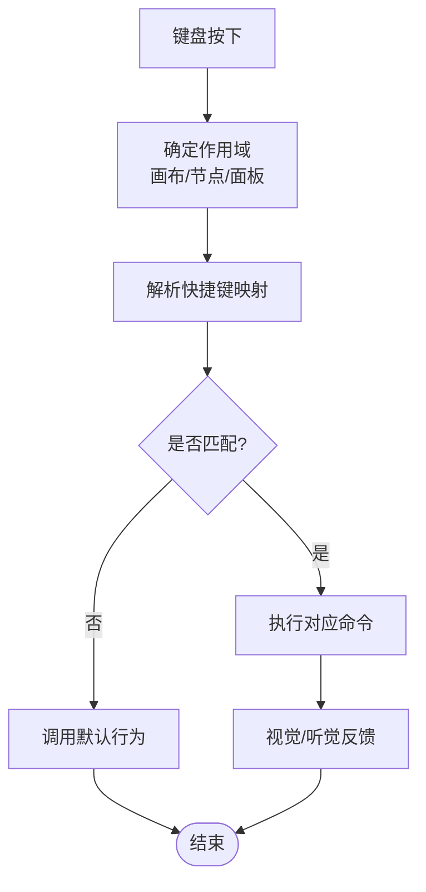

图表来源
- [src/app/products/(app)/canvas/[projectId]/canvas-view.tsx](file://src/app/products/(app)/canvas/[projectId]/canvas-view.tsx)
- [src/components/ui/top-bar.tsx](file://src/components/ui/top-bar.tsx)

章节来源
- [src/app/products/(app)/canvas/[projectId]/canvas-view.tsx](file://src/app/products/(app)/canvas/[projectId]/canvas-view.tsx)
- [src/components/ui/top-bar.tsx](file://src/components/ui/top-bar.tsx)

### 撤销重做机制
- 命令模式：每个用户操作封装为 Command，包含 undo/redo 方法
- 历史栈：维护撤销栈与重做栈，支持跨会话持久化
- 批量操作：组合多个命令为一个事务，原子提交
- 冲突解决：协作场景下基于操作转换（OT）或 CRDT 策略

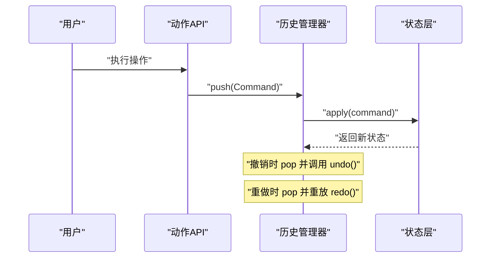

图表来源
- [src/app/products/(app)/canvas/[projectId]/canvas-action-api.ts](file://src/app/products/(app)/canvas/[projectId]/canvas-action-api.ts)
- [src/features/canvas/actions.ts](file://src/features/canvas/actions.ts)
- [src/features/canvas/status.ts](file://src/features/canvas/status.ts)

章节来源
- [src/app/products/(app)/canvas/[projectId]/canvas-action-api.ts](file://src/app/products/(app)/canvas/[projectId]/canvas-action-api.ts)
- [src/features/canvas/actions.ts](file://src/features/canvas/actions.ts)
- [src/features/canvas/status.ts](file://src/features/canvas/status.ts)

### 批量操作
- 支持框选后批量移动、复制、删除、应用样式
- 批量命令：将多个子命令包装为复合命令，统一撤销重做
- 性能优化：延迟渲染、批处理状态更新、减少重排重绘
- 进度反馈：长耗时操作显示进度条与取消按钮

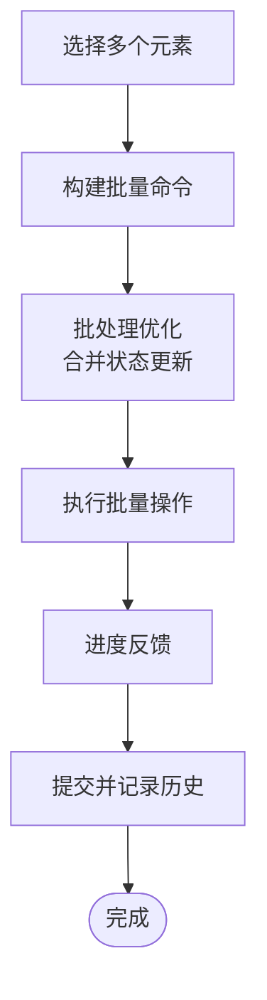

图表来源
- [src/app/products/(app)/canvas/[projectId]/canvas-view.tsx](file://src/app/products/(app)/canvas/[projectId]/canvas-view.tsx)
- [src/features/canvas/actions.ts](file://src/features/canvas/actions.ts)

章节来源
- [src/app/products/(app)/canvas/[projectId]/canvas-view.tsx](file://src/app/products/(app)/canvas/[projectId]/canvas-view.tsx)
- [src/features/canvas/actions.ts](file://src/features/canvas/actions.ts)

### 协作编辑
- 实时同步：WebSocket/SSE 推送状态变更，客户端合并更新
- 冲突解决：基于操作转换（OT）或 CRDT，保证最终一致性
- 本地优先：离线编辑缓存，网络恢复后自动同步
- 权限控制：读写权限、可见范围、锁定机制

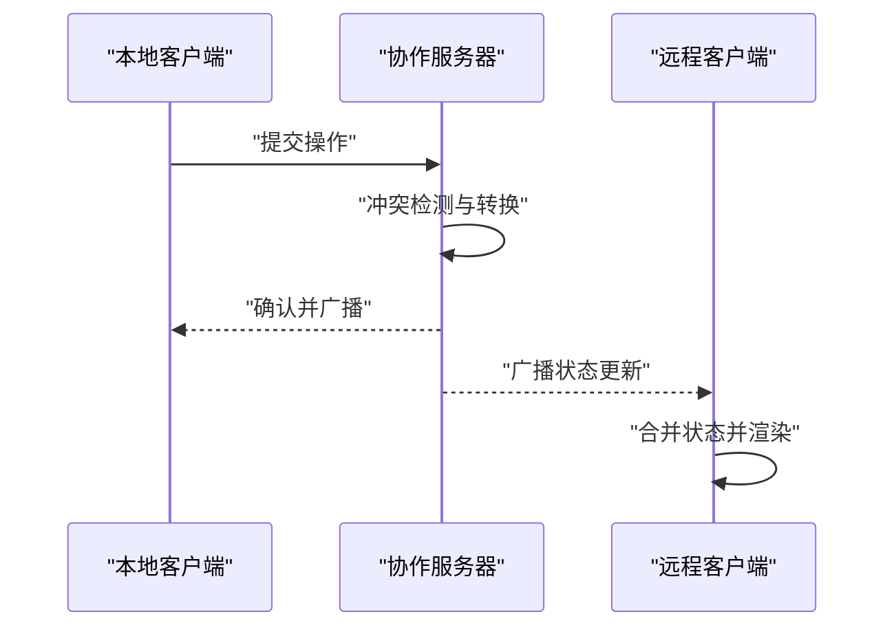

图表来源
- [src/features/canvas/status.ts](file://src/features/canvas/status.ts)
- [src/features/canvas/queries.ts](file://src/features/canvas/queries.ts)

章节来源
- [src/features/canvas/status.ts](file://src/features/canvas/status.ts)
- [src/features/canvas/queries.ts](file://src/features/canvas/queries.ts)

### 动画效果与过渡动画
- 入场动画：节点出现、连线绘制、面板滑入
- 交互反馈：悬停高亮、点击涟漪、拖拽弹性
- 状态过渡：选中态切换、面板展开收起、错误抖动
- 性能控制：requestAnimationFrame、GPU 加速、节流防抖

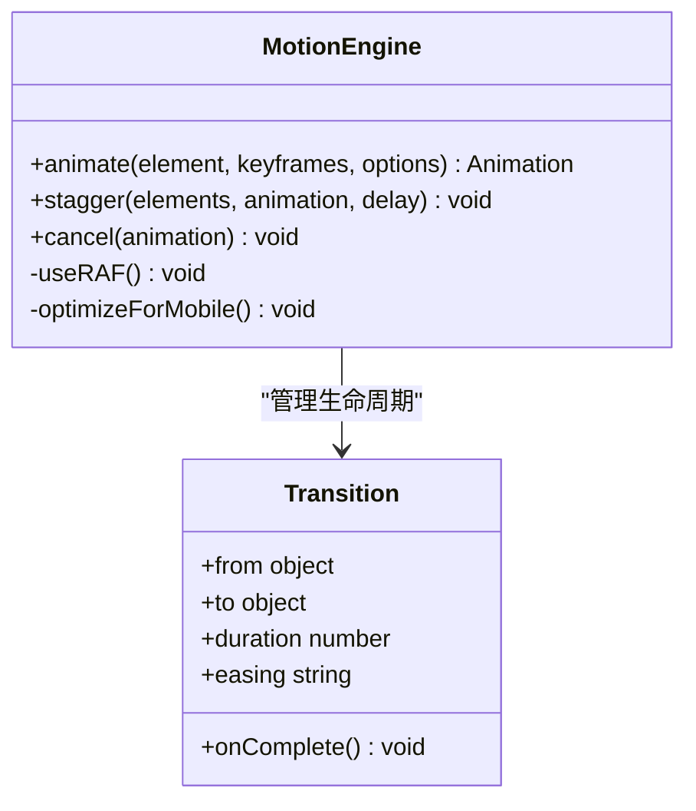

图表来源
- [src/lib/motion/index.ts](file://src/lib/motion/index.ts)
- [src/app/products/(app)/canvas/[projectId]/canvas-view.tsx](file://src/app/products/(app)/canvas/[projectId]/canvas-view.tsx)

章节来源
- [src/lib/motion/index.ts](file://src/lib/motion/index.ts)
- [src/app/products/(app)/canvas/[projectId]/canvas-view.tsx](file://src/app/products/(app)/canvas/[projectId]/canvas-view.tsx)

### 无障碍访问支持
- ARIA 标签：为交互元素添加语义化描述
- 键盘导航：Tab 顺序、焦点管理、快捷键提示
- 屏幕阅读器：朗读选中项、操作反馈、错误提示
- 对比度与缩放：符合 WCAG 标准，支持高对比度主题

章节来源
- [src/components/ui/dialog.tsx](file://src/components/ui/dialog.tsx)
- [src/components/ui/tooltip.tsx](file://src/components/ui/tooltip.tsx)
- [src/components/ui/top-bar.tsx](file://src/components/ui/top-bar.tsx)

### 移动端适配考虑
- 触控手势：单指拖拽、双指缩放、长按弹出菜单
- 响应式布局：自适应画布尺寸、工具栏折叠、面板抽屉式
- 性能优化：减少 DOM 操作、虚拟滚动、懒加载资源
- 输入兼容：虚拟键盘避让、软键盘遮挡处理

章节来源
- [src/app/products/(app)/canvas/[projectId]/canvas-view.tsx](file://src/app/products/(app)/canvas/[projectId]/canvas-view.tsx)
- [src/components/ui/sidebar.tsx](file://src/components/ui/sidebar.tsx)

## 依赖关系分析
- 松耦合：UI 组件与业务逻辑分离，通过 props 与事件通信
- 内聚性：特性域内聚画布相关的数据结构与算法
- 外部依赖：动效库、状态管理库、网络请求库
- 循环依赖：通过接口抽象与延迟加载避免

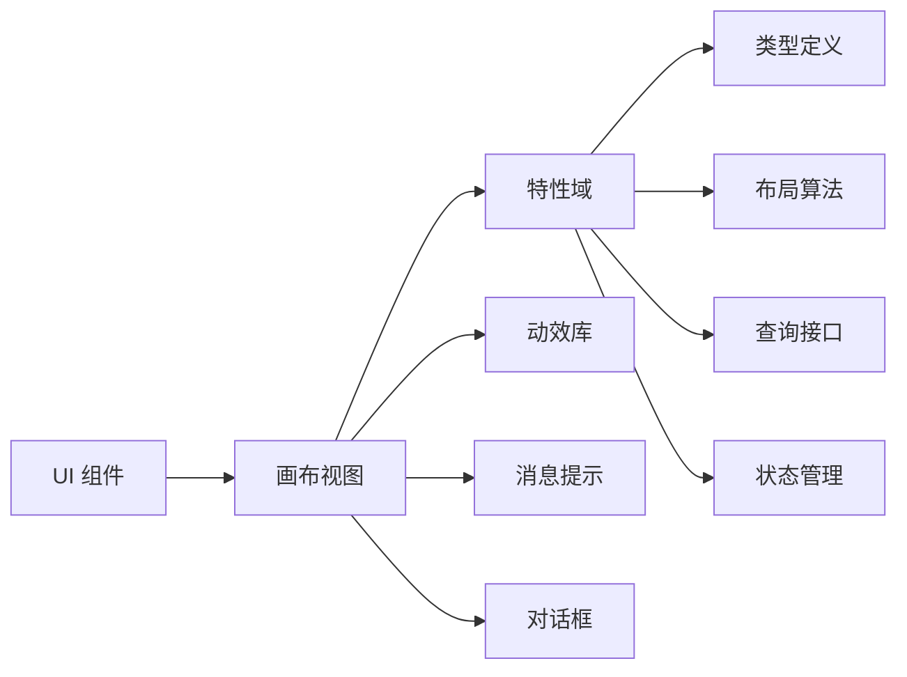

图表来源
- [src/app/products/(app)/canvas/[projectId]/canvas-view.tsx](file://src/app/products/(app)/canvas/[projectId]/canvas-view.tsx)
- [src/features/canvas/index.ts](file://src/features/canvas/index.ts)
- [src/lib/motion/index.ts](file://src/lib/motion/index.ts)

章节来源
- [src/app/products/(app)/canvas/[projectId]/canvas-view.tsx](file://src/app/products/(app)/canvas/[projectId]/canvas-view.tsx)
- [src/features/canvas/index.ts](file://src/features/canvas/index.ts)

## 性能考虑
- 渲染优化：增量更新、虚拟列表、离屏渲染
- 内存管理：及时释放监听器、清理定时器、避免闭包泄漏
- 网络优化：请求去重、缓存策略、错误重试
- 移动端优化：节流防抖、减少重排、使用 CSS Transform

## 故障排查指南
- 常见问题：拖拽卡顿、选择框错位、快捷键冲突、动画掉帧
- 调试工具：浏览器开发者工具、性能面板、网络面板
- 日志记录：关键操作日志、错误堆栈、性能指标
- 复现步骤：最小化用例、环境隔离、逐步验证

章节来源
- [src/components/ui/toast.tsx](file://src/components/ui/toast.tsx)
- [src/app/products/(app)/canvas/[projectId]/canvas-view.tsx](file://src/app/products/(app)/canvas/[projectId]/canvas-view.tsx)

## 结论
PurpleInk 编辑器交互设计以模块化、可扩展为核心，通过命令模式与状态隔离实现可靠的撤销重做与批量操作，结合动效库提供流畅的用户体验。协作编辑与无障碍支持确保多用户场景下的可用性与包容性。建议在后续迭代中持续优化性能与移动端体验，完善快捷键自定义与国际化支持。

## 附录
- 交互模式示例：节点创建、连线编辑、批量样式应用、协作评论
- 用户体验优化建议：减少认知负荷、提供即时反馈、保持一致性、支持撤销重做
- 最佳实践：命名规范、错误处理、测试覆盖、文档更新