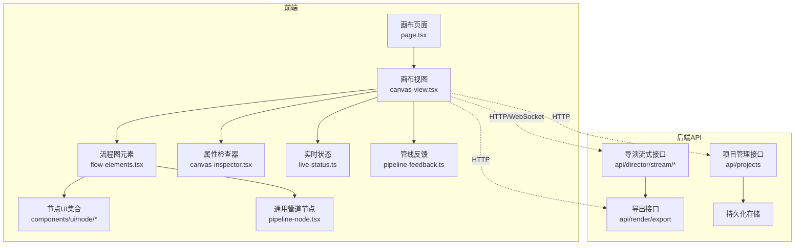
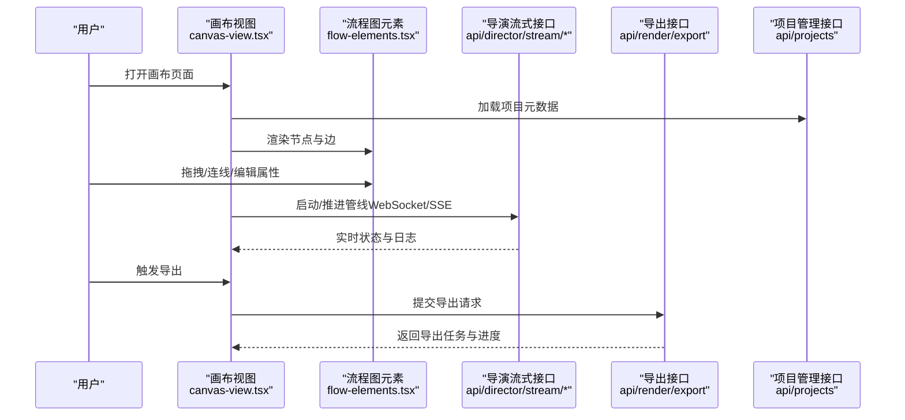
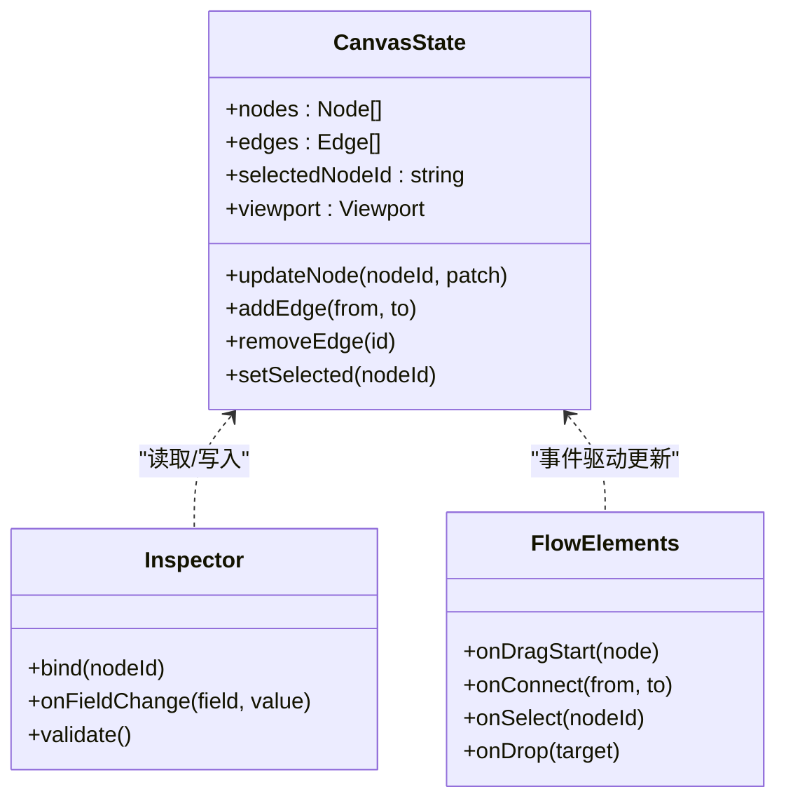
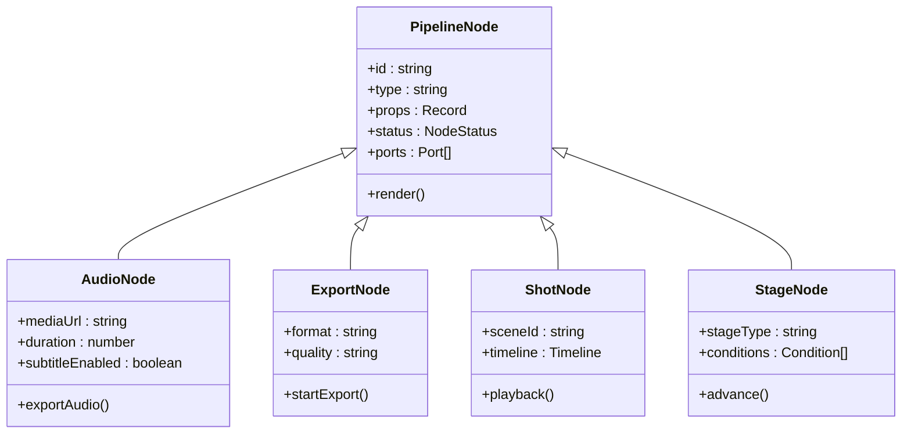
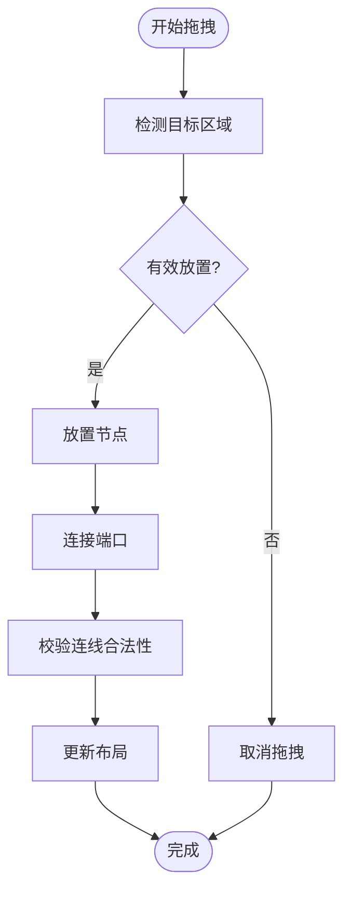
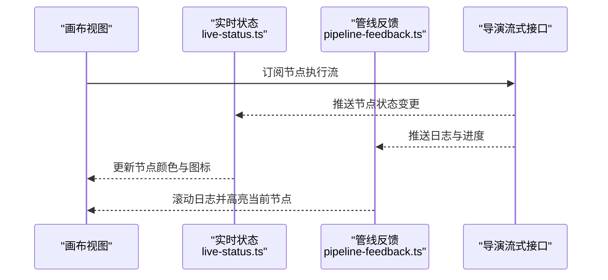
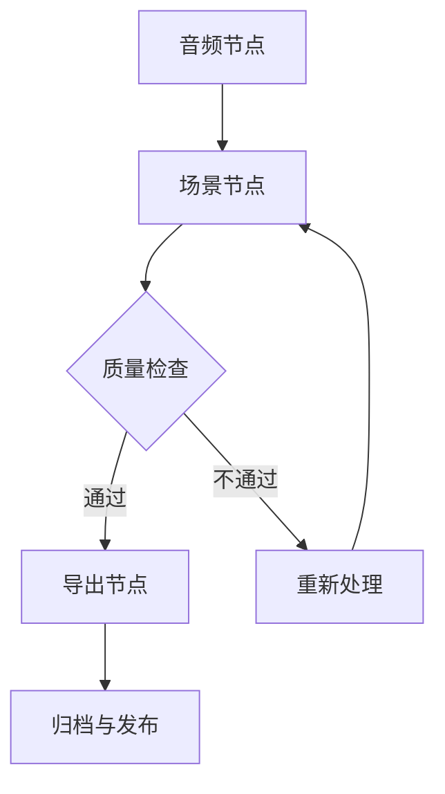
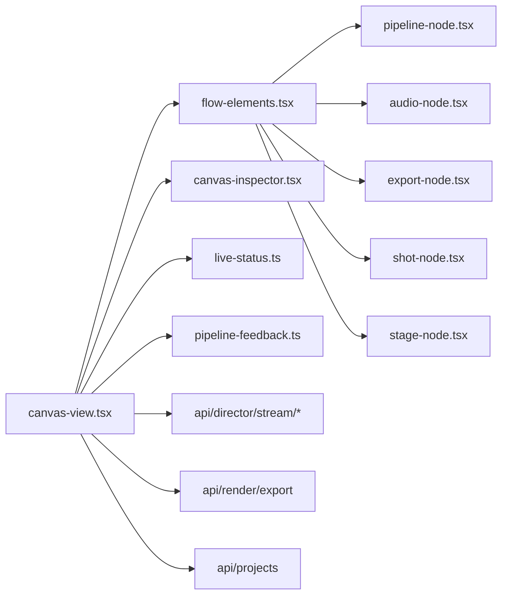

# 可视化编辑器

<cite>
**本文引用的文件**   
- [src/app/products/(app)/canvas/[projectId]/page.tsx](file://src/app/products/(app)/canvas/[projectId]/page.tsx)
- [src/app/products/(app)/canvas/[projectId]/canvas-view.tsx](file://src/app/products/(app)/canvas/[projectId]/canvas-view.tsx)
- [src/app/products/(app)/canvas/[projectId]/flow-elements.tsx](file://src/app/products/(app)/canvas/[projectId]/flow-elements.tsx)
- [src/app/products/(app)/canvas/[projectId]/canvas-inspector.tsx](file://src/app/products/(app)/canvas/[projectId]/canvas-inspector.tsx)
- [src/app/products/(app)/canvas/[projectId]/live-status.ts](file://src/app/products/(app)/canvas/[projectId]/live-status.ts)
- [src/app/products/(app)/canvas/[projectId]/pipeline-feedback.ts](file://src/app/products/(app)/canvas/[projectId]/pipeline-feedback.ts)
- [src/app/products/(app)/canvas/[projectId]/streaming-log-card.tsx](file://src/app/products/(app)/canvas/[projectId]/streaming-log-card.tsx)
- [src/app/products/(app)/canvas/[projectId]/stage-error-dialog.tsx](file://src/app/products/(app)/canvas/[projectId]/stage-error-dialog.tsx)
- [src/features/canvas/index.ts](file://src/features/canvas/index.ts)
- [src/features/canvas/types.ts](file://src/features/canvas/types.ts)
- [src/features/canvas/contracts.ts](file://src/features/canvas/contracts.ts)
- [src/features/canvas/actions.ts](file://src/features/canvas/actions.ts)
- [src/features/canvas/layout.ts](file://src/features/canvas/layout.ts)
- [src/features/canvas/status.ts](file://src/features/canvas/status.ts)
- [src/features/canvas/fan-out.ts](file://src/features/canvas/fan-out.ts)
- [src/components/ui/node/audio-node.tsx](file://src/components/ui/node/audio-node.tsx)
- [src/components/ui/node/export-node.tsx](file://src/components/ui/node/export-node.tsx)
- [src/components/ui/node/shot-node.tsx](file://src/components/ui/node/shot-node.tsx)
- [src/components/ui/node/stage-node.tsx](file://src/components/ui/node/stage-node.tsx)
- [src/components/ui/node/types.ts](file://src/components/ui/node/types.ts)
- [src/components/ui/pipeline-node.tsx](file://src/components/ui/pipeline-node.tsx)
- [src/app/api/director/stream/route.ts](file://src/app/api/director/stream/route.ts)
- [src/app/api/director/stream/[nodeId]/route.ts](file://src/app/api/director/stream/[nodeId]/route.ts)
- [src/app/api/render/export/route.ts](file://src/app/api/render/export/route.ts)
- [src/app/api/projects/route.ts](file://src/app/api/projects/route.ts)
</cite>

## 目录
1. [简介](#简介)
2. [项目结构](#项目结构)
3. [核心组件](#核心组件)
4. [架构总览](#架构总览)
5. [详细组件分析](#详细组件分析)
6. [依赖关系分析](#依赖关系分析)
7. [性能考量](#性能考量)
8. [故障排查指南](#故障排查指南)
9. [结论](#结论)
10. [附录](#附录)

## 简介
本文件为 PurpleInk 平台的可视化编辑器提供全面文档，覆盖画布架构、节点系统、拖拽交互、实时预览与版本控制等关键能力。文档同时说明音频节点、导出节点、场景节点等类型的特点与用法，解释画布状态管理、数据绑定与事件处理机制，并提供创建复杂工作流、自定义节点类型和扩展编辑器的实践示例，以及性能优化技巧与最佳实践。

## 项目结构
可视化编辑器位于产品应用模块中，前端页面与功能集中在以下路径：
- 画布页面与视图：src/app/products/(app)/canvas/[projectId]
- 画布特性（类型、布局、状态、动作）：src/features/canvas
- 节点 UI 组件：src/components/ui/node
- 管道节点通用渲染：src/components/ui/pipeline-node.tsx
- 后端 API：src/app/api/director、src/app/api/render、src/app/api/projects

图表来源
- [src/app/products/(app)/canvas/[projectId]/page.tsx](file://src/app/products/(app)/canvas/[projectId]/page.tsx)
- [src/app/products/(app)/canvas/[projectId]/canvas-view.tsx](file://src/app/products/(app)/canvas/[projectId]/canvas-view.tsx)
- [src/app/products/(app)/canvas/[projectId]/flow-elements.tsx](file://src/app/products/(app)/canvas/[projectId]/flow-elements.tsx)
- [src/app/products/(app)/canvas/[projectId]/canvas-inspector.tsx](file://src/app/products/(app)/canvas/[projectId]/canvas-inspector.tsx)
- [src/app/products/(app)/canvas/[projectId]/live-status.ts](file://src/app/products/(app)/canvas/[projectId]/live-status.ts)
- [src/app/products/(app)/canvas/[projectId]/pipeline-feedback.ts](file://src/app/products/(app)/canvas/[projectId]/pipeline-feedback.ts)
- [src/components/ui/node/audio-node.tsx](file://src/components/ui/node/audio-node.tsx)
- [src/components/ui/node/export-node.tsx](file://src/components/ui/node/export-node.tsx)
- [src/components/ui/node/shot-node.tsx](file://src/components/ui/node/shot-node.tsx)
- [src/components/ui/node/stage-node.tsx](file://src/components/ui/node/stage-node.tsx)
- [src/components/ui/pipeline-node.tsx](file://src/components/ui/pipeline-node.tsx)
- [src/app/api/director/stream/route.ts](file://src/app/api/director/stream/route.ts)
- [src/app/api/director/stream/[nodeId]/route.ts](file://src/app/api/director/stream/[nodeId]/route.ts)
- [src/app/api/render/export/route.ts](file://src/app/api/render/export/route.ts)
- [src/app/api/projects/route.ts](file://src/app/api/projects/route.ts)

章节来源
- [src/app/products/(app)/canvas/[projectId]/page.tsx](file://src/app/products/(app)/canvas/[projectId]/page.tsx)
- [src/app/products/(app)/canvas/[projectId]/canvas-view.tsx](file://src/app/products/(app)/canvas/[projectId]/canvas-view.tsx)
- [src/app/products/(app)/canvas/[projectId]/flow-elements.tsx](file://src/app/products/(app)/canvas/[projectId]/flow-elements.tsx)
- [src/app/products/(app)/canvas/[projectId]/canvas-inspector.tsx](file://src/app/products/(app)/canvas/[projectId]/canvas-inspector.tsx)
- [src/features/canvas/index.ts](file://src/features/canvas/index.ts)
- [src/features/canvas/types.ts](file://src/features/canvas/types.ts)
- [src/features/canvas/contracts.ts](file://src/features/canvas/contracts.ts)
- [src/features/canvas/actions.ts](file://src/features/canvas/actions.ts)
- [src/features/canvas/layout.ts](file://src/features/canvas/layout.ts)
- [src/features/canvas/status.ts](file://src/features/canvas/status.ts)
- [src/features/canvas/fan-out.ts](file://src/features/canvas/fan-out.ts)
- [src/components/ui/node/audio-node.tsx](file://src/components/ui/node/audio-node.tsx)
- [src/components/ui/node/export-node.tsx](file://src/components/ui/node/export-node.tsx)
- [src/components/ui/node/shot-node.tsx](file://src/components/ui/node/shot-node.tsx)
- [src/components/ui/node/stage-node.tsx](file://src/components/ui/node/stage-node.tsx)
- [src/components/ui/node/types.ts](file://src/components/ui/node/types.ts)
- [src/components/ui/pipeline-node.tsx](file://src/components/ui/pipeline-node.tsx)
- [src/app/api/director/stream/route.ts](file://src/app/api/director/stream/route.ts)
- [src/app/api/director/stream/[nodeId]/route.ts](file://src/app/api/director/stream/[nodeId]/route.ts)
- [src/app/api/render/export/route.ts](file://src/app/api/render/export/route.ts)
- [src/app/api/projects/route.ts](file://src/app/api/projects/route.ts)

## 核心组件
- 画布页面与视图
  - 画布页面负责路由挂载与上下文初始化，承载画布视图容器。
  - 画布视图负责渲染流程图、连接边、工具栏与侧边面板，并订阅实时状态与管线反馈。
- 流程图元素与节点
  - flow-elements 提供节点与边的渲染逻辑，集成拖拽、选择、缩放和平移。
  - 节点 UI 组件包括音频节点、导出节点、场景节点、阶段节点等，均基于通用管道节点进行样式与行为扩展。
- 属性检查器
  - canvas-inspector 展示选中节点的配置项，支持表单输入与校验，变更触发画布状态更新。
- 实时状态与管线反馈
  - live-status 维护节点运行状态（如空闲、运行中、成功、失败），并通过 WebSockets 或 SSE 推送增量更新。
  - pipeline-feedback 聚合来自后端的执行日志与进度信息，驱动 UI 的滚动与高亮。
- 画布特性层
  - types、contracts、actions、layout、status、fan-out 等模块定义数据结构、契约、操作、布局算法、状态机与扇出策略。

章节来源
- [src/app/products/(app)/canvas/[projectId]/page.tsx](file://src/app/products/(app)/canvas/[projectId]/page.tsx)
- [src/app/products/(app)/canvas/[projectId]/canvas-view.tsx](file://src/app/products/(app)/canvas/[projectId]/canvas-view.tsx)
- [src/app/products/(app)/canvas/[projectId]/flow-elements.tsx](file://src/app/products/(app)/canvas/[projectId]/flow-elements.tsx)
- [src/app/products/(app)/canvas/[projectId]/canvas-inspector.tsx](file://src/app/products/(app)/canvas/[projectId]/canvas-inspector.tsx)
- [src/app/products/(app)/canvas/[projectId]/live-status.ts](file://src/app/products/(app)/canvas/[projectId]/live-status.ts)
- [src/app/products/(app)/canvas/[projectId]/pipeline-feedback.ts](file://src/app/products/(app)/canvas/[projectId]/pipeline-feedback.ts)
- [src/features/canvas/index.ts](file://src/features/canvas/index.ts)
- [src/features/canvas/types.ts](file://src/features/canvas/types.ts)
- [src/features/canvas/contracts.ts](file://src/features/canvas/contracts.ts)
- [src/features/canvas/actions.ts](file://src/features/canvas/actions.ts)
- [src/features/canvas/layout.ts](file://src/features/canvas/layout.ts)
- [src/features/canvas/status.ts](file://src/features/canvas/status.ts)
- [src/features/canvas/fan-out.ts](file://src/features/canvas/fan-out.ts)

## 架构总览
可视化编辑器采用“前端画布 + 后端导演/渲染”的分层架构。前端通过 HTTP 与流式接口与后端通信，实现节点编排、执行监控与结果导出。

图表来源
- [src/app/products/(app)/canvas/[projectId]/canvas-view.tsx](file://src/app/products/(app)/canvas/[projectId]/canvas-view.tsx)
- [src/app/products/(app)/canvas/[projectId]/flow-elements.tsx](file://src/app/products/(app)/canvas/[projectId]/flow-elements.tsx)
- [src/app/api/director/stream/route.ts](file://src/app/api/director/stream/route.ts)
- [src/app/api/director/stream/[nodeId]/route.ts](file://src/app/api/director/stream/[nodeId]/route.ts)
- [src/app/api/render/export/route.ts](file://src/app/api/render/export/route.ts)
- [src/app/api/projects/route.ts](file://src/app/api/projects/route.ts)

## 详细组件分析

### 画布状态管理与数据绑定
- 状态模型
  - 使用统一的数据结构与契约定义节点、边、布局与运行时状态，确保前后端一致性。
- 数据绑定
  - 属性检查器与画布状态双向绑定，修改属性即时反映到节点配置；变更通过 actions 派发，触发重渲染与持久化。
- 事件处理
  - 拖拽、连线、选择、键盘快捷键等事件在 flow-elements 中集中处理，向上冒泡至 canvas-view 进行状态更新。

图表来源
- [src/features/canvas/types.ts](file://src/features/canvas/types.ts)
- [src/features/canvas/contracts.ts](file://src/features/canvas/contracts.ts)
- [src/features/canvas/actions.ts](file://src/features/canvas/actions.ts)
- [src/app/products/(app)/canvas/[projectId]/canvas-inspector.tsx](file://src/app/products/(app)/canvas/[projectId]/canvas-inspector.tsx)
- [src/app/products/(app)/canvas/[projectId]/flow-elements.tsx](file://src/app/products/(app)/canvas/[projectId]/flow-elements.tsx)

章节来源
- [src/features/canvas/types.ts](file://src/features/canvas/types.ts)
- [src/features/canvas/contracts.ts](file://src/features/canvas/contracts.ts)
- [src/features/canvas/actions.ts](file://src/features/canvas/actions.ts)
- [src/app/products/(app)/canvas/[projectId]/canvas-inspector.tsx](file://src/app/products/(app)/canvas/[projectId]/canvas-inspector.tsx)
- [src/app/products/(app)/canvas/[projectId]/flow-elements.tsx](file://src/app/products/(app)/canvas/[projectId]/flow-elements.tsx)

### 节点系统与节点类型
- 通用管道节点
  - pipeline-node 提供统一的节点外壳（标题、状态指示、端口、错误提示），各具体节点在此基础上扩展。
- 节点类型
  - 音频节点：用于音频素材导入、剪辑、混音与字幕生成。
  - 导出节点：用于最终产物打包、格式转换与下载。
  - 场景节点：用于场景编排、转场与时间线控制。
  - 阶段节点：用于导演流程的阶段划分与条件分支。
- 节点注册与扩展
  - 通过类型系统与合约定义节点输入输出端口与配置字段，新增节点只需实现对应 UI 与行为逻辑。

图表来源
- [src/components/ui/pipeline-node.tsx](file://src/components/ui/pipeline-node.tsx)
- [src/components/ui/node/audio-node.tsx](file://src/components/ui/node/audio-node.tsx)
- [src/components/ui/node/export-node.tsx](file://src/components/ui/node/export-node.tsx)
- [src/components/ui/node/shot-node.tsx](file://src/components/ui/node/shot-node.tsx)
- [src/components/ui/node/stage-node.tsx](file://src/components/ui/node/stage-node.tsx)
- [src/components/ui/node/types.ts](file://src/components/ui/node/types.ts)

章节来源
- [src/components/ui/pipeline-node.tsx](file://src/components/ui/pipeline-node.tsx)
- [src/components/ui/node/audio-node.tsx](file://src/components/ui/node/audio-node.tsx)
- [src/components/ui/node/export-node.tsx](file://src/components/ui/node/export-node.tsx)
- [src/components/ui/node/shot-node.tsx](file://src/components/ui/node/shot-node.tsx)
- [src/components/ui/node/stage-node.tsx](file://src/components/ui/node/stage-node.tsx)
- [src/components/ui/node/types.ts](file://src/components/ui/node/types.ts)

### 拖拽交互与布局
- 拖拽与连线
  - 在 flow-elements 中实现节点拖拽、端口连线、撤销/重做与碰撞检测。
- 布局算法
  - layout 模块提供自动布局、对齐与间距计算，支持手动调整与约束。
- 视口与缩放
  - 支持平移、缩放与网格吸附，提升复杂工作流的可视性。

图表来源
- [src/app/products/(app)/canvas/[projectId]/flow-elements.tsx](file://src/app/products/(app)/canvas/[projectId]/flow-elements.tsx)
- [src/features/canvas/layout.ts](file://src/features/canvas/layout.ts)

章节来源
- [src/app/products/(app)/canvas/[projectId]/flow-elements.tsx](file://src/app/products/(app)/canvas/[projectId]/flow-elements.tsx)
- [src/features/canvas/layout.ts](file://src/features/canvas/layout.ts)

### 实时预览与管线反馈
- 实时状态
  - live-status 维护节点运行状态，通过流式接口接收增量更新，驱动 UI 高亮与进度条。
- 管线反馈
  - pipeline-feedback 聚合执行日志、错误信息与警告，支持按节点过滤与搜索。
- 错误处理
  - stage-error-dialog 提供错误详情与重试入口，便于快速定位问题。

图表来源
- [src/app/products/(app)/canvas/[projectId]/live-status.ts](file://src/app/products/(app)/canvas/[projectId]/live-status.ts)
- [src/app/products/(app)/canvas/[projectId]/pipeline-feedback.ts](file://src/app/products/(app)/canvas/[projectId]/pipeline-feedback.ts)
- [src/app/products/(app)/canvas/[projectId]/stage-error-dialog.tsx](file://src/app/products/(app)/canvas/[projectId]/stage-error-dialog.tsx)
- [src/app/api/director/stream/route.ts](file://src/app/api/director/stream/route.ts)
- [src/app/api/director/stream/[nodeId]/route.ts](file://src/app/api/director/stream/[nodeId]/route.ts)

章节来源
- [src/app/products/(app)/canvas/[projectId]/live-status.ts](file://src/app/products/(app)/canvas/[projectId]/live-status.ts)
- [src/app/products/(app)/canvas/[projectId]/pipeline-feedback.ts](file://src/app/products/(app)/canvas/[projectId]/pipeline-feedback.ts)
- [src/app/products/(app)/canvas/[projectId]/stage-error-dialog.tsx](file://src/app/products/(app)/canvas/[projectId]/stage-error-dialog.tsx)
- [src/app/api/director/stream/route.ts](file://src/app/api/director/stream/route.ts)
- [src/app/api/director/stream/[nodeId]/route.ts](file://src/app/api/director/stream/[nodeId]/route.ts)

### 版本控制与工作流示例
- 版本控制
  - 通过项目管理接口保存画布快照，支持对比、回滚与分支合并。
- 复杂工作流示例
  - 构建多阶段导出的流水线：音频处理 -> 场景合成 -> 质量检查 -> 导出归档。
  - 使用阶段节点进行条件分支，根据输入媒体类型选择不同的处理路径。
- 自定义节点扩展
  - 新增节点类型需实现端口定义、配置表单与执行逻辑，并在 flow-elements 中注册渲染与交互。

章节来源
- [src/app/api/projects/route.ts](file://src/app/api/projects/route.ts)
- [src/app/products/(app)/canvas/[projectId]/flow-elements.tsx](file://src/app/products/(app)/canvas/[projectId]/flow-elements.tsx)
- [src/components/ui/node/audio-node.tsx](file://src/components/ui/node/audio-node.tsx)
- [src/components/ui/node/shot-node.tsx](file://src/components/ui/node/shot-node.tsx)
- [src/components/ui/node/export-node.tsx](file://src/components/ui/node/export-node.tsx)

## 依赖关系分析
- 前端内部依赖
  - canvas-view 依赖 flow-elements、inspector、live-status、pipeline-feedback。
  - flow-elements 依赖节点 UI 组件与通用管道节点。
  - features/canvas 提供类型、契约、动作、布局与状态机，被多个 UI 组件复用。
- 后端集成依赖
  - 画布视图通过 HTTP 调用项目管理与导出接口，通过流式接口获取实时状态与日志。

图表来源
- [src/app/products/(app)/canvas/[projectId]/canvas-view.tsx](file://src/app/products/(app)/canvas/[projectId]/canvas-view.tsx)
- [src/app/products/(app)/canvas/[projectId]/flow-elements.tsx](file://src/app/products/(app)/canvas/[projectId]/flow-elements.tsx)
- [src/app/products/(app)/canvas/[projectId]/canvas-inspector.tsx](file://src/app/products/(app)/canvas/[projectId]/canvas-inspector.tsx)
- [src/app/products/(app)/canvas/[projectId]/live-status.ts](file://src/app/products/(app)/canvas/[projectId]/live-status.ts)
- [src/app/products/(app)/canvas/[projectId]/pipeline-feedback.ts](file://src/app/products/(app)/canvas/[projectId]/pipeline-feedback.ts)
- [src/components/ui/pipeline-node.tsx](file://src/components/ui/pipeline-node.tsx)
- [src/components/ui/node/audio-node.tsx](file://src/components/ui/node/audio-node.tsx)
- [src/components/ui/node/export-node.tsx](file://src/components/ui/node/export-node.tsx)
- [src/components/ui/node/shot-node.tsx](file://src/components/ui/node/shot-node.tsx)
- [src/components/ui/node/stage-node.tsx](file://src/components/ui/node/stage-node.tsx)
- [src/app/api/director/stream/route.ts](file://src/app/api/director/stream/route.ts)
- [src/app/api/director/stream/[nodeId]/route.ts](file://src/app/api/director/stream/[nodeId]/route.ts)
- [src/app/api/render/export/route.ts](file://src/app/api/render/export/route.ts)
- [src/app/api/projects/route.ts](file://src/app/api/projects/route.ts)

章节来源
- [src/app/products/(app)/canvas/[projectId]/canvas-view.tsx](file://src/app/products/(app)/canvas/[projectId]/canvas-view.tsx)
- [src/app/products/(app)/canvas/[projectId]/flow-elements.tsx](file://src/app/products/(app)/canvas/[projectId]/flow-elements.tsx)
- [src/app/products/(app)/canvas/[projectId]/canvas-inspector.tsx](file://src/app/products/(app)/canvas/[projectId]/canvas-inspector.tsx)
- [src/app/products/(app)/canvas/[projectId]/live-status.ts](file://src/app/products/(app)/canvas/[projectId]/live-status.ts)
- [src/app/products/(app)/canvas/[projectId]/pipeline-feedback.ts](file://src/app/products/(app)/canvas/[projectId]/pipeline-feedback.ts)
- [src/components/ui/pipeline-node.tsx](file://src/components/ui/pipeline-node.tsx)
- [src/components/ui/node/audio-node.tsx](file://src/components/ui/node/audio-node.tsx)
- [src/components/ui/node/export-node.tsx](file://src/components/ui/node/export-node.tsx)
- [src/components/ui/node/shot-node.tsx](file://src/components/ui/node/shot-node.tsx)
- [src/components/ui/node/stage-node.tsx](file://src/components/ui/node/stage-node.tsx)
- [src/app/api/director/stream/route.ts](file://src/app/api/director/stream/route.ts)
- [src/app/api/director/stream/[nodeId]/route.ts](file://src/app/api/director/stream/[nodeId]/route.ts)
- [src/app/api/render/export/route.ts](file://src/app/api/render/export/route.ts)
- [src/app/api/projects/route.ts](file://src/app/api/projects/route.ts)

## 性能考量
- 渲染优化
  - 对节点列表进行虚拟化与懒加载，减少首屏渲染压力。
  - 使用不可变数据与浅比较，避免不必要的重渲染。
- 交互优化
  - 拖拽与连线操作防抖与节流，降低高频事件开销。
  - 布局计算异步化，避免阻塞主线程。
- 网络优化
  - 流式接口使用增量推送与批处理，减少带宽占用。
  - 导出任务分片与断点续传，提升大文件处理稳定性。
- 内存管理
  - 及时释放已完成的节点资源与缓存，防止内存泄漏。
  - 限制并发节点数量，避免过载。

[本节为通用指导，无需特定文件引用]

## 故障排查指南
- 常见问题
  - 节点状态卡住：检查流式接口连接与心跳，确认后端服务健康。
  - 连线无效：验证端口类型匹配与约束规则，查看校验日志。
  - 导出失败：检查导出参数与权限，查看错误对话框中的详细信息。
- 调试建议
  - 启用详细日志与网络抓包，定位请求与响应异常。
  - 使用浏览器开发者工具检查状态树与事件流。
  - 通过项目管理接口恢复历史快照，快速回滚到稳定版本。

章节来源
- [src/app/products/(app)/canvas/[projectId]/stage-error-dialog.tsx](file://src/app/products/(app)/canvas/[projectId]/stage-error-dialog.tsx)
- [src/app/api/director/stream/route.ts](file://src/app/api/director/stream/route.ts)
- [src/app/api/render/export/route.ts](file://src/app/api/render/export/route.ts)
- [src/app/api/projects/route.ts](file://src/app/api/projects/route.ts)

## 结论
PurpleInk 可视化编辑器以清晰的画布架构与可扩展的节点系统为核心，结合实时预览与版本控制，提供了强大的工作流编排能力。通过统一的类型与契约、完善的交互与状态管理，以及高效的性能优化策略，平台能够满足复杂多媒体生产需求。建议在实际使用中遵循最佳实践，持续扩展节点类型与功能，以提升生产力与用户体验。

[本节为总结性内容，无需特定文件引用]

## 附录
- 术语表
  - 节点：工作流中的基本处理单元，具有输入输出端口与配置。
  - 边：连接节点的数据流通道。
  - 画布：用户编辑与编排工作流的可视化界面。
  - 实时预览：通过流式接口获取的执行状态与日志。
  - 版本控制：对画布快照进行保存、对比与回滚的能力。
- 参考路径
  - 画布页面与视图：src/app/products/(app)/canvas/[projectId]
  - 节点 UI：src/components/ui/node
  - 画布特性：src/features/canvas
  - 后端 API：src/app/api/director、src/app/api/render、src/app/api/projects

[本节为补充信息，无需特定文件引用]