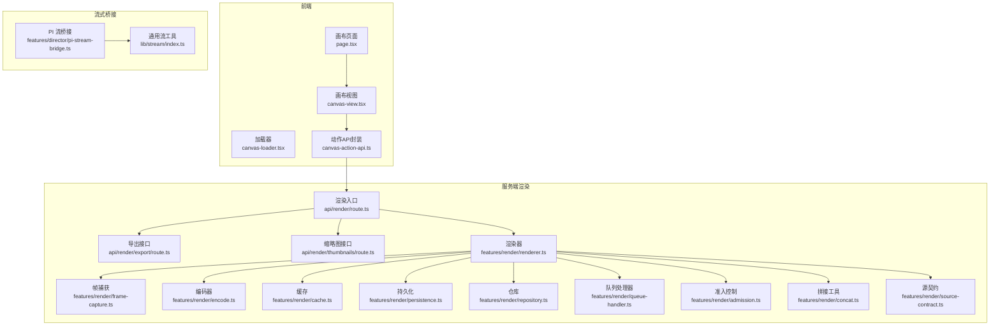
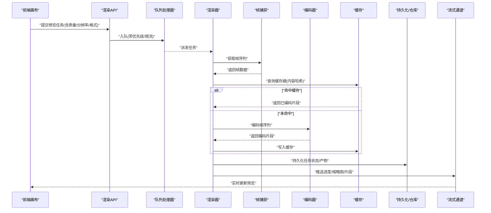
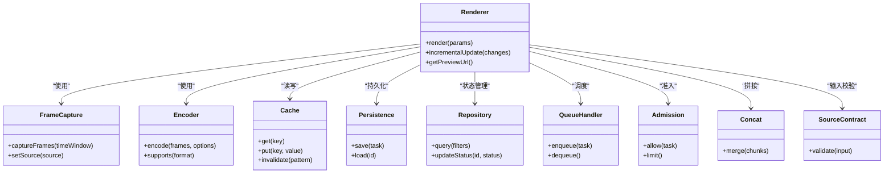

# 实时预览

<cite>
**本文引用的文件**   
- [src/app/products/(app)/canvas/[projectId]/page.tsx](file://src/app/products/(app)/canvas/[projectId]/page.tsx)
- [src/app/products/(app)/canvas/[projectId]/canvas-view.tsx](file://src/app/products/(app)/canvas/[projectId]/canvas-view.tsx)
- [src/app/products/(app)/canvas/[projectId]/canvas-loader.tsx](file://src/app/products/(app)/canvas/[projectId]/canvas-loader.tsx)
- [src/app/products/(app)/canvas/[projectId]/canvas-action-api.ts](file://src/app/products/(app)/canvas/[projectId]/canvas-action-api.ts)
- [src/app/api/render/route.ts](file://src/app/api/render/route.ts)
- [src/app/api/render/export/route.ts](file://src/app/api/render/export/route.ts)
- [src/app/api/render/thumbnails/route.ts](file://src/app/api/render/thumbnails/route.ts)
- [src/features/render/renderer.ts](file://src/features/render/renderer.ts)
- [src/features/render/cache.ts](file://src/features/render/cache.ts)
- [src/features/render/frame-capture.ts](file://src/features/render/frame-capture.ts)
- [src/features/render/encode.ts](file://src/features/render/encode.ts)
- [src/features/render/types.ts](file://src/features/render/types.ts)
- [src/features/render/persistence.ts](file://src/features/render/persistence.ts)
- [src/features/render/repository.ts](file://src/features/render/repository.ts)
- [src/features/render/queue-handler.ts](file://src/features/render/queue-handler.ts)
- [src/features/render/admission.ts](file://src/features/render/admission.ts)
- [src/features/render/concat.ts](file://src/features/render/concat.ts)
- [src/features/render/source-contract.ts](file://src/features/render/source-contract.ts)
- [src/features/director/pi-stream-bridge.ts](file://src/features/director/pi-stream-bridge.ts)
- [src/lib/stream/index.ts](file://src/lib/stream/index.ts)
</cite>

## 目录
1. [简介](#简介)
2. [项目结构](#项目结构)
3. [核心组件](#核心组件)
4. [架构总览](#架构总览)
5. [详细组件分析](#详细组件分析)
6. [依赖关系分析](#依赖关系分析)
7. [性能考量](#性能考量)
8. [故障排查指南](#故障排查指南)
9. [结论](#结论)
10. [附录](#附录)

## 简介
本文件面向 PurpleInk 的“实时预览”能力，系统性阐述渲染机制、性能优化与缓存策略，解释预览与编辑器的同步方式、增量更新与差异计算思路，并覆盖预览质量设置、分辨率适配与格式支持。同时给出错误处理与降级方案、配置示例与性能调优建议，帮助读者快速理解并高效使用实时预览功能。

## 项目结构
实时预览涉及前端画布视图、渲染服务与队列、帧捕获与编码、缓存与持久化等模块。整体由“编辑器（Canvas）—渲染管线（Render）—存储（Repository/Persistence）—客户端（Stream）”构成。

图表来源 
- [src/app/products/(app)/canvas/[projectId]/page.tsx](file://src/app/products/(app)/canvas/[projectId]/page.tsx)
- [src/app/products/(app)/canvas/[projectId]/canvas-view.tsx](file://src/app/products/(app)/canvas/[projectId]/canvas-view.tsx)
- [src/app/products/(app)/canvas/[projectId]/canvas-loader.tsx](file://src/app/products/(app)/canvas/[projectId]/canvas-loader.tsx)
- [src/app/products/(app)/canvas/[projectId]/canvas-action-api.ts](file://src/app/products/(app)/canvas/[projectId]/canvas-action-api.ts)
- [src/app/api/render/route.ts](file://src/app/api/render/route.ts)
- [src/app/api/render/export/route.ts](file://src/app/api/render/export/route.ts)
- [src/app/api/render/thumbnails/route.ts](file://src/app/api/render/thumbnails/route.ts)
- [src/features/render/renderer.ts](file://src/features/render/renderer.ts)
- [src/features/render/frame-capture.ts](file://src/features/render/frame-capture.ts)
- [src/features/render/encode.ts](file://src/features/render/encode.ts)
- [src/features/render/cache.ts](file://src/features/render/cache.ts)
- [src/features/render/persistence.ts](file://src/features/render/persistence.ts)
- [src/features/render/repository.ts](file://src/features/render/repository.ts)
- [src/features/render/queue-handler.ts](file://src/features/render/queue-handler.ts)
- [src/features/render/admission.ts](file://src/features/render/admission.ts)
- [src/features/render/concat.ts](file://src/features/render/concat.ts)
- [src/features/render/source-contract.ts](file://src/features/render/source-contract.ts)
- [src/features/director/pi-stream-bridge.ts](file://src/features/director/pi-stream-bridge.ts)
- [src/lib/stream/index.ts](file://src/lib/stream/index.ts)

章节来源
- [src/app/products/(app)/canvas/[projectId]/page.tsx](file://src/app/products/(app)/canvas/[projectId]/page.tsx)
- [src/app/products/(app)/canvas/[projectId]/canvas-view.tsx](file://src/app/products/(app)/canvas/[projectId]/canvas-view.tsx)
- [src/app/products/(app)/canvas/[projectId]/canvas-loader.tsx](file://src/app/products/(app)/canvas/[projectId]/canvas-loader.tsx)
- [src/app/products/(app)/canvas/[projectId]/canvas-action-api.ts](file://src/app/products/(app)/canvas/[projectId]/canvas-action-api.ts)
- [src/app/api/render/route.ts](file://src/app/api/render/route.ts)
- [src/app/api/render/export/route.ts](file://src/app/api/render/export/route.ts)
- [src/app/api/render/thumbnails/route.ts](file://src/app/api/render/thumbnails/route.ts)
- [src/features/render/renderer.ts](file://src/features/render/renderer.ts)
- [src/features/render/frame-capture.ts](file://src/features/render/frame-capture.ts)
- [src/features/render/encode.ts](file://src/features/render/encode.ts)
- [src/features/render/cache.ts](file://src/features/render/cache.ts)
- [src/features/render/persistence.ts](file://src/features/render/persistence.ts)
- [src/features/render/repository.ts](file://src/features/render/repository.ts)
- [src/features/render/queue-handler.ts](file://src/features/render/queue-handler.ts)
- [src/features/render/admission.ts](file://src/features/render/admission.ts)
- [src/features/render/concat.ts](file://src/features/render/concat.ts)
- [src/features/render/source-contract.ts](file://src/features/render/source-contract.ts)
- [src/features/director/pi-stream-bridge.ts](file://src/features/director/pi-stream-bridge.ts)
- [src/lib/stream/index.ts](file://src/lib/stream/index.ts)

## 核心组件
- 渲染器（renderer.ts）：协调帧捕获、编码、缓存、持久化与队列调度，是实时预览的核心引擎。
- 帧捕获（frame-capture.ts）：从运行时或浏览器环境抓取帧数据，保证时序与一致性。
- 编码器（encode.ts）：将帧序列编码为视频或图像序列，支持不同格式与质量参数。
- 缓存（cache.ts）：基于内容哈希或资源指纹的缓存层，避免重复渲染。
- 持久化（persistence.ts）与仓库（repository.ts）：管理渲染产物、任务状态与元数据。
- 队列处理器（queue-handler.ts）：控制并发、优先级与背压，保障高负载下的稳定性。
- 准入控制（admission.ts）：限制并发与资源占用，防止雪崩。
- 拼接工具（concat.ts）：合并片段或分块输出，提升大文件生成效率。
- 源契约（source-contract.ts）：统一输入数据结构，确保上游变更不影响下游。

章节来源
- [src/features/render/renderer.ts](file://src/features/render/renderer.ts)
- [src/features/render/frame-capture.ts](file://src/features/render/frame-capture.ts)
- [src/features/render/encode.ts](file://src/features/render/encode.ts)
- [src/features/render/cache.ts](file://src/features/render/cache.ts)
- [src/features/render/persistence.ts](file://src/features/render/persistence.ts)
- [src/features/render/repository.ts](file://src/features/render/repository.ts)
- [src/features/render/queue-handler.ts](file://src/features/render/queue-handler.ts)
- [src/features/render/admission.ts](file://src/features/render/admission.ts)
- [src/features/render/concat.ts](file://src/features/render/concat.ts)
- [src/features/render/source-contract.ts](file://src/features/render/source-contract.ts)

## 架构总览
实时预览采用“前端触发—服务端渲染—流式反馈”的闭环。前端通过 API 发起渲染请求，服务端经准入控制进入队列，渲染器按帧捕获、编码、缓存与持久化流程产出结果，并通过流式通道向前端推送进度与中间产物（如缩略图）。

图表来源 
- [src/app/api/render/route.ts](file://src/app/api/render/route.ts)
- [src/features/render/queue-handler.ts](file://src/features/render/queue-handler.ts)
- [src/features/render/renderer.ts](file://src/features/render/renderer.ts)
- [src/features/render/frame-capture.ts](file://src/features/render/frame-capture.ts)
- [src/features/render/encode.ts](file://src/features/render/encode.ts)
- [src/features/render/cache.ts](file://src/features/render/cache.ts)
- [src/features/render/persistence.ts](file://src/features/render/persistence.ts)
- [src/features/render/repository.ts](file://src/features/render/repository.ts)
- [src/lib/stream/index.ts](file://src/lib/stream/index.ts)

## 详细组件分析

### 渲染器（renderer.ts）
- 职责：编排帧捕获、编码、缓存、持久化与队列；提供增量更新与差异计算接口；暴露预览质量、分辨率与格式配置。
- 关键流程：
  - 接收任务参数（分辨率、质量、格式、时间窗口）。
  - 调用帧捕获获取帧序列，结合时间戳与场景快照进行差异计算。
  - 优先查缓存，命中则直接复用；未命中则进入编码阶段。
  - 将编码片段写入缓存与持久化，并向流式通道推送进度。
  - 支持分段拼接，便于大片段与实时预览的平滑衔接。
- 性能要点：
  - 帧级去重与增量更新，减少重复编码。
  - 并行编码与背压控制，避免内存峰值过高。
  - 自适应分辨率与码率，根据设备能力动态调整。

章节来源
- [src/features/render/renderer.ts](file://src/features/render/renderer.ts)
- [src/features/render/frame-capture.ts](file://src/features/render/frame-capture.ts)
- [src/features/render/encode.ts](file://src/features/render/encode.ts)
- [src/features/render/cache.ts](file://src/features/render/cache.ts)
- [src/features/render/persistence.ts](file://src/features/render/persistence.ts)
- [src/features/render/repository.ts](file://src/features/render/repository.ts)
- [src/features/render/concat.ts](file://src/features/render/concat.ts)

### 帧捕获（frame-capture.ts）
- 职责：从运行时的画布或浏览器上下文抓取帧，保证时序一致性与可回放性。
- 关键点：
  - 支持多种源（画布元素、媒体节点、外部URL），通过源契约统一输入。
  - 帧去抖与节流，避免高频更新导致抖动。
  - 时间轴对齐与帧间隔控制，满足实时预览的流畅度要求。

章节来源
- [src/features/render/frame-capture.ts](file://src/features/render/frame-capture.ts)
- [src/features/render/source-contract.ts](file://src/features/render/source-contract.ts)

### 编码器（encode.ts）
- 职责：将帧序列编码为视频或图像序列，支持多格式与质量参数。
- 关键点：
  - 支持H.264/H.265、WebM、PNG/JPEG等格式。
  - 动态码率与分辨率适配，兼顾画质与性能。
  - 切片编码与拼接，提升大文件生成效率与容错性。

章节来源
- [src/features/render/encode.ts](file://src/features/render/encode.ts)
- [src/features/render/concat.ts](file://src/features/render/concat.ts)

### 缓存（cache.ts）
- 职责：基于内容哈希或资源指纹的缓存层，避免重复渲染。
- 关键点：
  - 键生成包含分辨率、质量、格式与时间窗口。
  - 多级缓存（内存+磁盘），平衡速度与容量。
  - 失效策略（TTL、LRU、按版本失效）。

章节来源
- [src/features/render/cache.ts](file://src/features/render/cache.ts)

### 持久化与仓库（persistence.ts, repository.ts）
- 职责：管理任务状态、产物路径、元数据与查询接口。
- 关键点：
  - 任务生命周期（排队、执行、完成、失败）。
  - 产物索引与检索，支持缩略图与片段下载。
  - 事务性写入，保证一致性。

章节来源
- [src/features/render/persistence.ts](file://src/features/render/persistence.ts)
- [src/features/render/repository.ts](file://src/features/render/repository.ts)

### 队列处理器（queue-handler.ts）
- 职责：控制并发、优先级与背压，保障高负载下的稳定性。
- 关键点：
  - 任务分级（实时预览优先、批量导出延后）。
  - 限流与退避，避免过载。
  - 监控指标（队列长度、平均耗时、失败率）。

章节来源
- [src/features/render/queue-handler.ts](file://src/features/render/queue-handler.ts)

### 准入控制（admission.ts）
- 职责：限制并发与资源占用，防止雪崩。
- 关键点：
  - 令牌桶或漏桶算法，平滑突发流量。
  - 资源配额（CPU、内存、GPU）与隔离。
  - 熔断与降级开关。

章节来源
- [src/features/render/admission.ts](file://src/features/render/admission.ts)

### 流式桥接（pi-stream-bridge.ts, lib/stream/index.ts）
- 职责：将渲染进度、缩略图与片段以流式方式推送给前端。
- 关键点：
  - 事件驱动，低延迟传输。
  - 断线重连与幂等消费。
  - 兼容SSE/WebSocket等不同协议。

章节来源
- [src/features/director/pi-stream-bridge.ts](file://src/features/director/pi-stream-bridge.ts)
- [src/lib/stream/index.ts](file://src/lib/stream/index.ts)

### 前端画布与API（page.tsx, canvas-view.tsx, canvas-loader.tsx, canvas-action-api.ts）
- 职责：展示预览、触发渲染、处理加载与错误状态。
- 关键点：
  - 与后端API交互，订阅流式进度。
  - 本地占位与骨架屏，提升感知性能。
  - 错误重试与降级显示。

章节来源
- [src/app/products/(app)/canvas/[projectId]/page.tsx](file://src/app/products/(app)/canvas/[projectId]/page.tsx)
- [src/app/products/(app)/canvas/[projectId]/canvas-view.tsx](file://src/app/products/(app)/canvas/[projectId]/canvas-view.tsx)
- [src/app/products/(app)/canvas/[projectId]/canvas-loader.tsx](file://src/app/products/(app)/canvas/[projectId]/canvas-loader.tsx)
- [src/app/products/(app)/canvas/[projectId]/canvas-action-api.ts](file://src/app/products/(app)/canvas/[projectId]/canvas-action-api.ts)

### 渲染API（route.ts, export/route.ts, thumbnails/route.ts）
- 职责：暴露REST接口，接受预览/导出/缩略图请求，路由到渲染器与队列。
- 关键点：
  - 参数校验与权限检查。
  - 异步任务创建与状态查询。
  - 流式响应与分块下载。

章节来源
- [src/app/api/render/route.ts](file://src/app/api/render/route.ts)
- [src/app/api/render/export/route.ts](file://src/app/api/render/export/route.ts)
- [src/app/api/render/thumbnails/route.ts](file://src/app/api/render/thumbnails/route.ts)

## 依赖关系分析
渲染器依赖帧捕获、编码器、缓存、持久化、仓库、队列与准入控制；前端通过API与流式通道与后端交互。

图表来源 
- [src/features/render/renderer.ts](file://src/features/render/renderer.ts)
- [src/features/render/frame-capture.ts](file://src/features/render/frame-capture.ts)
- [src/features/render/encode.ts](file://src/features/render/encode.ts)
- [src/features/render/cache.ts](file://src/features/render/cache.ts)
- [src/features/render/persistence.ts](file://src/features/render/persistence.ts)
- [src/features/render/repository.ts](file://src/features/render/repository.ts)
- [src/features/render/queue-handler.ts](file://src/features/render/queue-handler.ts)
- [src/features/render/admission.ts](file://src/features/render/admission.ts)
- [src/features/render/concat.ts](file://src/features/render/concat.ts)
- [src/features/render/source-contract.ts](file://src/features/render/source-contract.ts)

章节来源
- [src/features/render/renderer.ts](file://src/features/render/renderer.ts)
- [src/features/render/frame-capture.ts](file://src/features/render/frame-capture.ts)
- [src/features/render/encode.ts](file://src/features/render/encode.ts)
- [src/features/render/cache.ts](file://src/features/render/cache.ts)
- [src/features/render/persistence.ts](file://src/features/render/persistence.ts)
- [src/features/render/repository.ts](file://src/features/render/repository.ts)
- [src/features/render/queue-handler.ts](file://src/features/render/queue-handler.ts)
- [src/features/render/admission.ts](file://src/features/render/admission.ts)
- [src/features/render/concat.ts](file://src/features/render/concat.ts)
- [src/features/render/source-contract.ts](file://src/features/render/source-contract.ts)

## 性能考量
- 增量更新与差异计算
  - 基于帧级变化检测，仅对变动区域重新捕获与编码。
  - 时间窗口滑动与帧去抖，降低无效渲染。
- 缓存策略
  - 多级缓存（内存优先、磁盘兜底），键包含分辨率、质量、格式与时间窗口。
  - TTL与LRU结合，避免缓存膨胀。
- 分辨率与质量自适应
  - 根据设备能力与网络状况动态调整分辨率与码率。
  - 首帧快速预览（低质量小尺寸），后续渐进增强。
- 并发与背压
  - 队列分级与限流，避免阻塞主线程。
  - 分片编码与拼接，提升吞吐与容错。
- 流式推送
  - SSE/WebSocket推送进度与缩略图，提升用户体验。
  - 断线重连与幂等消费，保证可靠性。

[本节为通用指导，不直接分析具体文件]

## 故障排查指南
- 常见问题
  - 预览卡顿：检查队列长度、CPU/GPU占用、帧捕获频率与编码并行度。
  - 预览失真：确认分辨率与码率设置，检查编码器格式兼容性。
  - 缓存未命中：核对缓存键生成逻辑（分辨率、质量、格式、时间窗口）。
  - 流式中断：检查网络与服务器日志，确认重连与幂等消费。
- 定位方法
  - 查看任务状态与产物索引（仓库/持久化）。
  - 启用调试日志与指标采集（队列、缓存命中率、编码耗时）。
  - 复现最小用例，逐步隔离问题（帧捕获、编码、缓存、持久化）。
- 降级方案
  - 关闭高质量预览，切换至低分辨率与静态缩略图。
  - 禁用缓存，强制全量渲染以验证链路。
  - 回退到旧版本编码器或格式。

章节来源
- [src/features/render/queue-handler.ts](file://src/features/render/queue-handler.ts)
- [src/features/render/cache.ts](file://src/features/render/cache.ts)
- [src/features/render/encode.ts](file://src/features/render/encode.ts)
- [src/features/render/repository.ts](file://src/features/render/repository.ts)
- [src/features/render/persistence.ts](file://src/features/render/persistence.ts)

## 结论
PurpleInk 的实时预览通过“帧捕获—编码—缓存—持久化—流式推送”的完整链路，实现高效、稳定且可扩展的预览体验。通过增量更新、自适应分辨率与质量、多级缓存与队列限流，系统在复杂场景下仍能保持良好性能。配合完善的错误处理与降级策略，可在不同设备与网络条件下提供一致的预览体验。

[本节为总结，不直接分析具体文件]

## 附录

### 配置示例（说明性）
- 预览质量与分辨率
  - 分辨率：自动/手动（例如 720p/1080p/4K）
  - 质量：低/中/高（影响码率与压缩级别）
  - 格式：H.264/H.265/WebM/PNG/JPEG
- 缓存策略
  - 启用/禁用缓存
  - TTL（秒）、最大条目数、是否按版本失效
- 队列与并发
  - 最大并发任务数、优先级策略、超时与重试次数
- 流式推送
  - 协议（SSE/WebSocket）、心跳间隔、断线重连策略

[本节为概念性说明，不直接分析具体文件]

### 性能调优指南（说明性）
- 首帧加速：首帧低分辨率预览，随后渐进提升。
- 帧去抖：在编辑频繁时提高去抖阈值，减少无效渲染。
- 编码并行：根据CPU核数调整并行度，避免过度竞争。
- 缓存预热：常用模板与素材预先生成缓存。
- 监控告警：队列长度、缓存命中率、编码耗时、失败率阈值告警。

[本节为概念性说明，不直接分析具体文件]