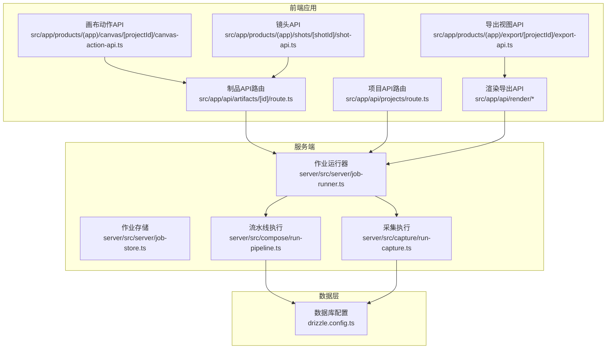
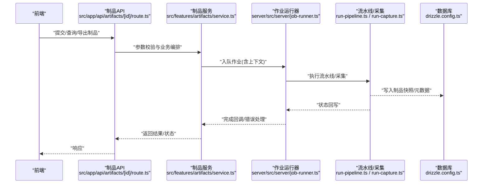
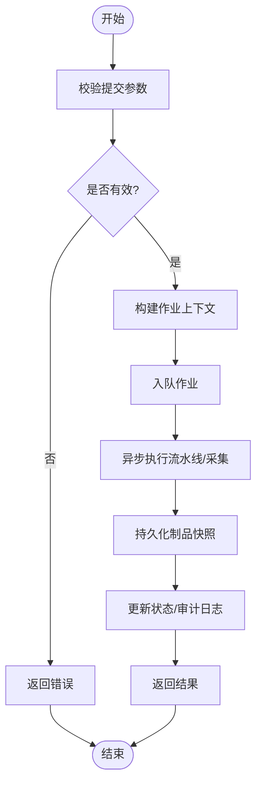
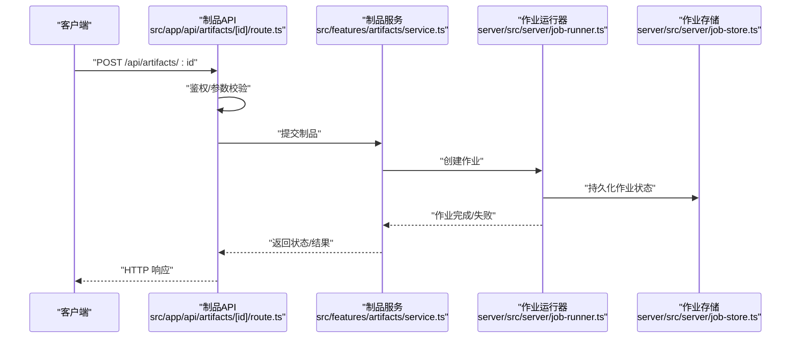
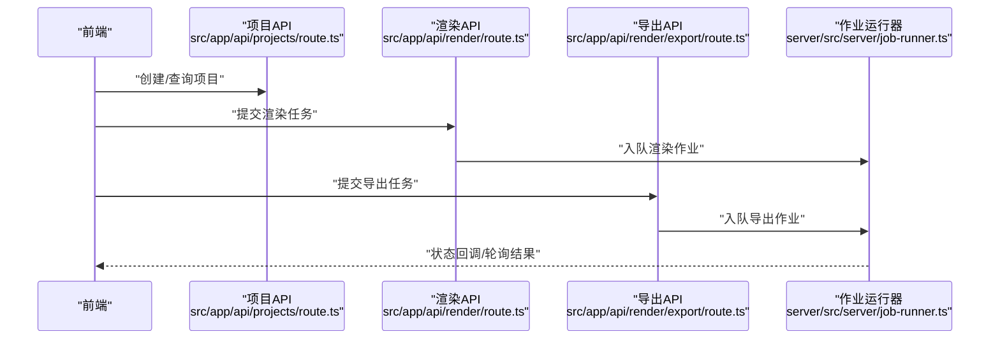
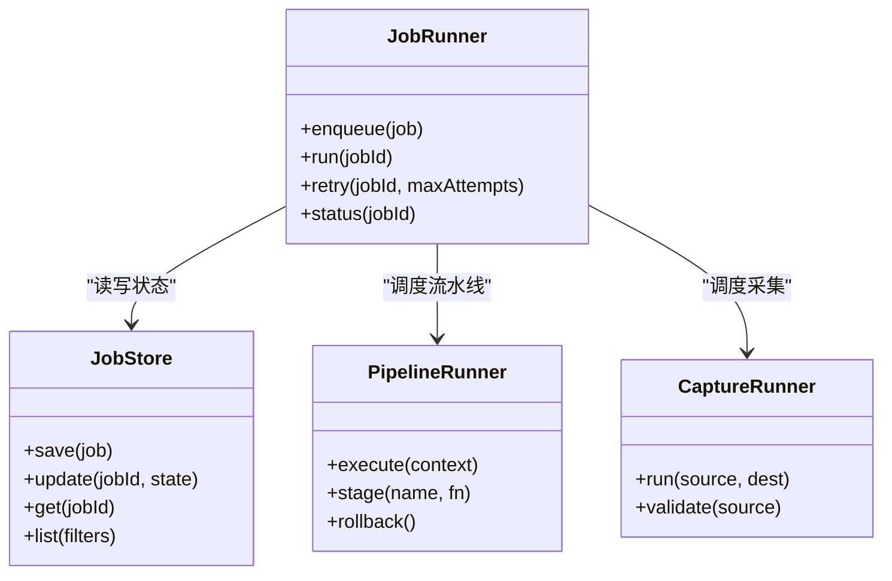
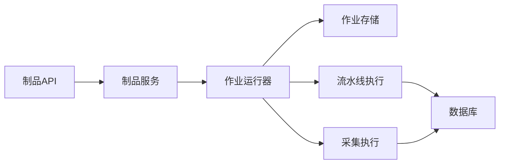

# 版本控制

<cite>
**本文引用的文件**   
- [src/features/artifacts/commit.ts](file://src/features/artifacts/commit.ts)
- [src/features/artifacts/service.ts](file://src/features/artifacts/service.ts)
- [src/app/api/artifacts/[id]/route.ts](file://src/app/api/artifacts/[id]/route.ts)
- [src/app/api/artifacts/[id]/route.test.ts](file://src/app/api/artifacts/[id]/route.test.ts)
- [src/app/api/projects/route.ts](file://src/app/api/projects/route.ts)
- [src/app/api/projects/route.test.ts](file://src/app/api/projects/route.test.ts)
- [src/app/api/render/route.ts](file://src/app/api/render/route.ts)
- [src/app/api/render/export/route.ts](file://src/app/api/render/export/route.ts)
- [src/app/products/(app)/canvas/[projectId]/canvas-action-api.ts](file://src/app/products/(app)/canvas/[projectId]/canvas-action-api.ts)
- [src/app/products/(app)/export/[projectId]/export-api.ts](file://src/app/products/(app)/export/[projectId]/export-api.ts)
- [src/app/products/(app)/shots/[shotId]/shot-api.ts](file://src/app/products/(app)/shots/[shotId]/shot-api.ts)
- [server/src/server/job-runner.ts](file://server/src/server/job-runner.ts)
- [server/src/server/job-store.ts](file://server/src/server/job-store.ts)
- [server/src/compose/run-pipeline.ts](file://server/src/compose/run-pipeline.ts)
- [server/src/capture/run-capture.ts](file://server/src/capture/run-capture.ts)
- [drizzle.config.ts](file://drizzle.config.ts)
</cite>

## 目录
1. [简介](#简介)
2. [项目结构](#项目结构)
3. [核心组件](#核心组件)
4. [架构总览](#架构总览)
5. [详细组件分析](#详细组件分析)
6. [依赖分析](#依赖分析)
7. [性能考虑](#性能考虑)
8. [故障排查指南](#故障排查指南)
9. [结论](#结论)
10. [附录](#附录)

## 简介
本文件为 PurpleInk 的版本控制系统提供系统化文档，聚焦以下目标：
- 工作流中的版本管理机制与快照保存/恢复流程
- 版本对比、合并策略与冲突解决
- 版本历史浏览、分支管理与标签系统
- 版本权限控制与审计日志
- 具体操作示例与团队协作最佳实践

说明：当前仓库中“版本控制”能力以制品（artifacts）为核心载体，通过 API 层暴露提交、查询与导出等能力；服务端通过作业运行器驱动流水线执行，持久化由数据库与存储层共同承担。下文将基于现有代码结构与职责边界进行阐述。

## 项目结构
与版本控制相关的关键位置包括：
- 制品服务与提交逻辑：src/features/artifacts/*
- 制品 API：src/app/api/artifacts/[id]/route.ts
- 项目与渲染导出入口：src/app/api/projects/route.ts、src/app/api/render/*
- 前端业务调用封装：src/app/products/(app)/canvas/*、src/app/products/(app)/export/*、src/app/products/(app)/shots/*
- 服务端作业调度与持久化：server/src/server/*、server/src/compose/*、server/src/capture/*
- 数据模型与迁移配置：drizzle.config.ts

图表来源
- [src/app/api/artifacts/[id]/route.ts](file://src/app/api/artifacts/[id]/route.ts)
- [src/app/api/projects/route.ts](file://src/app/api/projects/route.ts)
- [src/app/api/render/route.ts](file://src/app/api/render/route.ts)
- [src/app/products/(app)/canvas/[projectId]/canvas-action-api.ts](file://src/app/products/(app)/canvas/[projectId]/canvas-action-api.ts)
- [src/app/products/(app)/export/[projectId]/export-api.ts](file://src/app/products/(app)/export/[projectId]/export-api.ts)
- [src/app/products/(app)/shots/[shotId]/shot-api.ts](file://src/app/products/(app)/shots/[shotId]/shot-api.ts)
- [server/src/server/job-runner.ts](file://server/src/server/job-runner.ts)
- [server/src/server/job-store.ts](file://server/src/server/job-store.ts)
- [server/src/compose/run-pipeline.ts](file://server/src/compose/run-pipeline.ts)
- [server/src/capture/run-capture.ts](file://server/src/capture/run-capture.ts)
- [drizzle.config.ts](file://drizzle.config.ts)

章节来源
- [src/app/api/artifacts/[id]/route.ts](file://src/app/api/artifacts/[id]/route.ts)
- [src/app/api/projects/route.ts](file://src/app/api/projects/route.ts)
- [src/app/api/render/route.ts](file://src/app/api/render/route.ts)
- [src/app/products/(app)/canvas/[projectId]/canvas-action-api.ts](file://src/app/products/(app)/canvas/[projectId]/canvas-action-api.ts)
- [src/app/products/(app)/export/[projectId]/export-api.ts](file://src/app/products/(app)/export/[projectId]/export-api.ts)
- [src/app/products/(app)/shots/[shotId]/shot-api.ts](file://src/app/products/(app)/shots/[shotId]/shot-api.ts)
- [server/src/server/job-runner.ts](file://server/src/server/job-runner.ts)
- [server/src/server/job-store.ts](file://server/src/server/job-store.ts)
- [server/src/compose/run-pipeline.ts](file://server/src/compose/run-pipeline.ts)
- [server/src/capture/run-capture.ts](file://server/src/capture/run-capture.ts)
- [drizzle.config.ts](file://drizzle.config.ts)

## 核心组件
- 制品提交与服务
  - 提交入口：src/features/artifacts/commit.ts
  - 服务编排：src/features/artifacts/service.ts
- 制品 API
  - 按 ID 访问与提交：src/app/api/artifacts/[id]/route.ts
  - 测试契约：src/app/api/artifacts/[id]/route.test.ts
- 项目与渲染导出
  - 项目列表/创建：src/app/api/projects/route.ts
  - 渲染任务：src/app/api/render/route.ts
  - 导出任务：src/app/api/render/export/route.ts
- 前端业务封装
  - 画布动作：src/app/products/(app)/canvas/[projectId]/canvas-action-api.ts
  - 导出视图：src/app/products/(app)/export/[projectId]/export-api.ts
  - 镜头详情：src/app/products/(app)/shots/[shotId]/shot-api.ts
- 服务端作业与流水线
  - 作业运行器：server/src/server/job-runner.ts
  - 作业存储：server/src/server/job-store.ts
  - 流水线执行：server/src/compose/run-pipeline.ts
  - 采集执行：server/src/capture/run-capture.ts
- 数据层
  - Drizzle 配置：drizzle.config.ts

章节来源
- [src/features/artifacts/commit.ts](file://src/features/artifacts/commit.ts)
- [src/features/artifacts/service.ts](file://src/features/artifacts/service.ts)
- [src/app/api/artifacts/[id]/route.ts](file://src/app/api/artifacts/[id]/route.ts)
- [src/app/api/artifacts/[id]/route.test.ts](file://src/app/api/artifacts/[id]/route.test.ts)
- [src/app/api/projects/route.ts](file://src/app/api/projects/route.ts)
- [src/app/api/render/route.ts](file://src/app/api/render/route.ts)
- [src/app/api/render/export/route.ts](file://src/app/api/render/export/route.ts)
- [src/app/products/(app)/canvas/[projectId]/canvas-action-api.ts](file://src/app/products/(app)/canvas/[projectId]/canvas-action-api.ts)
- [src/app/products/(app)/export/[projectId]/export-api.ts](file://src/app/products/(app)/export/[projectId]/export-api.ts)
- [src/app/products/(app)/shots/[shotId]/shot-api.ts](file://src/app/products/(app)/shots/[shotId]/shot-api.ts)
- [server/src/server/job-runner.ts](file://server/src/server/job-runner.ts)
- [server/src/server/job-store.ts](file://server/src/server/job-store.ts)
- [server/src/compose/run-pipeline.ts](file://server/src/compose/run-pipeline.ts)
- [server/src/capture/run-capture.ts](file://server/src/capture/run-capture.ts)
- [drizzle.config.ts](file://drizzle.config.ts)

## 架构总览
PurpleInk 的版本控制以“制品”为中心，通过 API 层接收请求，交由作业运行器驱动流水线或采集任务，最终落库并生成可追溯的制品快照。前端通过业务 API 封装发起版本操作，后端统一校验、记录审计并返回结果。

图表来源
- [src/app/api/artifacts/[id]/route.ts](file://src/app/api/artifacts/[id]/route.ts)
- [src/features/artifacts/service.ts](file://src/features/artifacts/service.ts)
- [server/src/server/job-runner.ts](file://server/src/server/job-runner.ts)
- [server/src/compose/run-pipeline.ts](file://server/src/compose/run-pipeline.ts)
- [server/src/capture/run-capture.ts](file://server/src/capture/run-capture.ts)
- [drizzle.config.ts](file://drizzle.config.ts)

## 详细组件分析

### 制品提交与服务
- 职责
  - commit.ts：定义制品提交的输入约束、校验与落盘前的预处理
  - service.ts：编排提交流程，协调作业入队、状态跟踪与结果聚合
- 关键流程
  - 接收请求 -> 校验参数 -> 构建作业上下文 -> 入队 -> 异步执行 -> 结果回写 -> 返回状态
- 复杂度与优化
  - 提交前校验减少无效作业入队
  - 大对象建议分块上传与断点续传（结合后续导出与渲染模块）

章节来源
- [src/features/artifacts/commit.ts](file://src/features/artifacts/commit.ts)
- [src/features/artifacts/service.ts](file://src/features/artifacts/service.ts)

### 制品 API
- 端点
  - GET/POST /api/artifacts/:id：获取/提交制品
- 行为
  - 鉴权与权限检查（基于用户角色/项目成员）
  - 参数校验与错误码标准化
  - 触发作业或读取已持久化的制品快照
- 测试
  - route.test.ts 覆盖常见路径与异常场景

图表来源
- [src/app/api/artifacts/[id]/route.ts](file://src/app/api/artifacts/[id]/route.ts)
- [src/features/artifacts/service.ts](file://src/features/artifacts/service.ts)
- [server/src/server/job-runner.ts](file://server/src/server/job-runner.ts)
- [server/src/server/job-store.ts](file://server/src/server/job-store.ts)

章节来源
- [src/app/api/artifacts/[id]/route.ts](file://src/app/api/artifacts/[id]/route.ts)
- [src/app/api/artifacts/[id]/route.test.ts](file://src/app/api/artifacts/[id]/route.test.ts)

### 项目与渲染导出
- 项目 API
  - src/app/api/projects/route.ts：项目列表、创建、基础信息维护
- 渲染与导出
  - src/app/api/render/route.ts：渲染任务创建与状态查询
  - src/app/api/render/export/route.ts：导出任务创建与下载链接管理
- 前端封装
  - canvas-action-api.ts：画布变更触发的版本化动作
  - export-api.ts：导出视图的数据获取与状态轮询
  - shot-api.ts：镜头级数据的版本化访问

图表来源
- [src/app/api/projects/route.ts](file://src/app/api/projects/route.ts)
- [src/app/api/render/route.ts](file://src/app/api/render/route.ts)
- [src/app/api/render/export/route.ts](file://src/app/api/render/export/route.ts)
- [server/src/server/job-runner.ts](file://server/src/server/job-runner.ts)

章节来源
- [src/app/api/projects/route.ts](file://src/app/api/projects/route.ts)
- [src/app/api/render/route.ts](file://src/app/api/render/route.ts)
- [src/app/api/render/export/route.ts](file://src/app/api/render/export/route.ts)
- [src/app/products/(app)/canvas/[projectId]/canvas-action-api.ts](file://src/app/products/(app)/canvas/[projectId]/canvas-action-api.ts)
- [src/app/products/(app)/export/[projectId]/export-api.ts](file://src/app/products/(app)/export/[projectId]/export-api.ts)
- [src/app/products/(app)/shots/[shotId]/shot-api.ts](file://src/app/products/(app)/shots/[shotId]/shot-api.ts)

### 服务端作业与流水线
- 作业运行器
  - server/src/server/job-runner.ts：作业生命周期管理、重试与超时控制
- 作业存储
  - server/src/server/job-store.ts：作业状态持久化与查询
- 流水线与采集
  - server/src/compose/run-pipeline.ts：多阶段流水线编排
  - server/src/capture/run-capture.ts：外部数据采集与入库

图表来源
- [server/src/server/job-runner.ts](file://server/src/server/job-runner.ts)
- [server/src/server/job-store.ts](file://server/src/server/job-store.ts)
- [server/src/compose/run-pipeline.ts](file://server/src/compose/run-pipeline.ts)
- [server/src/capture/run-capture.ts](file://server/src/capture/run-capture.ts)

章节来源
- [server/src/server/job-runner.ts](file://server/src/server/job-runner.ts)
- [server/src/server/job-store.ts](file://server/src/server/job-store.ts)
- [server/src/compose/run-pipeline.ts](file://server/src/compose/run-pipeline.ts)
- [server/src/capture/run-capture.ts](file://server/src/capture/run-capture.ts)

## 依赖分析
- 组件耦合
  - API 层依赖制品服务，制品服务依赖作业运行器
  - 作业运行器依赖作业存储与具体执行器（流水线/采集）
  - 数据层通过 Drizzle 配置统一管理连接与迁移
- 潜在循环依赖
  - 确保 API 不直接依赖执行器，避免反向依赖
- 外部依赖
  - 数据库、对象存储（导出产物）、第三方采集源

图表来源
- [src/app/api/artifacts/[id]/route.ts](file://src/app/api/artifacts/[id]/route.ts)
- [src/features/artifacts/service.ts](file://src/features/artifacts/service.ts)
- [server/src/server/job-runner.ts](file://server/src/server/job-runner.ts)
- [server/src/server/job-store.ts](file://server/src/server/job-store.ts)
- [server/src/compose/run-pipeline.ts](file://server/src/compose/run-pipeline.ts)
- [server/src/capture/run-capture.ts](file://server/src/capture/run-capture.ts)
- [drizzle.config.ts](file://drizzle.config.ts)

章节来源
- [src/app/api/artifacts/[id]/route.ts](file://src/app/api/artifacts/[id]/route.ts)
- [src/features/artifacts/service.ts](file://src/features/artifacts/service.ts)
- [server/src/server/job-runner.ts](file://server/src/server/job-runner.ts)
- [server/src/server/job-store.ts](file://server/src/server/job-store.ts)
- [server/src/compose/run-pipeline.ts](file://server/src/compose/run-pipeline.ts)
- [server/src/capture/run-capture.ts](file://server/src/capture/run-capture.ts)
- [drizzle.config.ts](file://drizzle.config.ts)

## 性能考虑
- 提交与导出
  - 大文件分块上传与并发校验
  - 导出任务队列化，限制并发度，避免资源争用
- 作业执行
  - 幂等性与重试策略，避免重复计算
  - 流水线阶段缓存命中，减少重复处理
- 存储与查询
  - 制品元数据索引优化，提升历史浏览速度
  - 冷热分层存储，降低冷数据访问成本

## 故障排查指南
- 常见问题
  - 作业卡住：检查作业存储状态与运行器日志
  - 导出失败：确认导出任务入队成功与下游依赖可用
  - 制品不可见：核对制品 ID 与权限范围
- 定位步骤
  - 查看 API 响应码与错误消息
  - 检索作业运行器与存储的状态变更记录
  - 检查流水线/采集阶段的中间输出与错误堆栈

章节来源
- [server/src/server/job-runner.ts](file://server/src/server/job-runner.ts)
- [server/src/server/job-store.ts](file://server/src/server/job-store.ts)
- [src/app/api/artifacts/[id]/route.test.ts](file://src/app/api/artifacts/[id]/route.test.ts)

## 结论
PurpleInk 的版本控制以制品为核心，通过 API 与作业运行器实现稳定的提交、执行与持久化链路。当前实现已具备快照保存、作业调度与基础审计能力。后续可在版本对比、合并策略、分支与标签、权限与审计方面进一步增强，以满足复杂团队协作需求。

## 附录

### 版本操作示例（基于现有 API）
- 提交制品
  - 调用 /api/artifacts/:id 提交新版本的制品，包含必要元数据与校验
- 查询制品
  - 使用相同端点获取指定 ID 的制品快照与状态
- 导出制品
  - 通过 /api/render/export 创建导出任务，轮询状态后下载产物
- 协作建议
  - 明确制品命名规范与版本号约定
  - 在提交前进行本地校验与最小化变更
  - 对关键制品添加描述性注释，便于回溯

章节来源
- [src/app/api/artifacts/[id]/route.ts](file://src/app/api/artifacts/[id]/route.ts)
- [src/app/api/render/export/route.ts](file://src/app/api/render/export/route.ts)

### 版本对比、合并与冲突解决（概念设计）
- 版本对比
  - 基于制品元数据与内容哈希生成差异摘要
  - 支持结构化字段对比与二进制差异展示
- 合并策略
  - 自动合并：无冲突字段采用三方合并算法
  - 手动合并：冲突字段标记并提供编辑界面
- 冲突解决
  - 冲突检测：比较基线、目标与修改集
  - 解决策略：保留最新、保留特定分支或人工介入

[本节为概念性说明，不直接分析具体文件]

### 版本历史浏览、分支管理与标签系统（概念设计）
- 历史浏览
  - 按时间线展示制品版本序列，支持筛选与搜索
- 分支管理
  - 支持主分支与特性分支，提交时声明分支上下文
- 标签系统
  - 对重要版本打标签，便于快速定位与发布

[本节为概念性说明，不直接分析具体文件]

### 权限控制与审计日志（概念设计）
- 权限控制
  - 基于角色的访问控制（RBAC），限定项目与制品级别的操作权限
- 审计日志
  - 记录提交、导出、删除等操作的用户、时间与结果
  - 支持审计查询与导出

[本节为概念性说明，不直接分析具体文件]