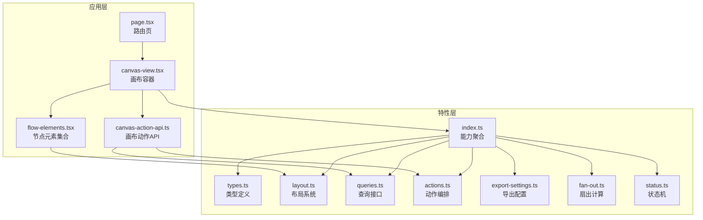
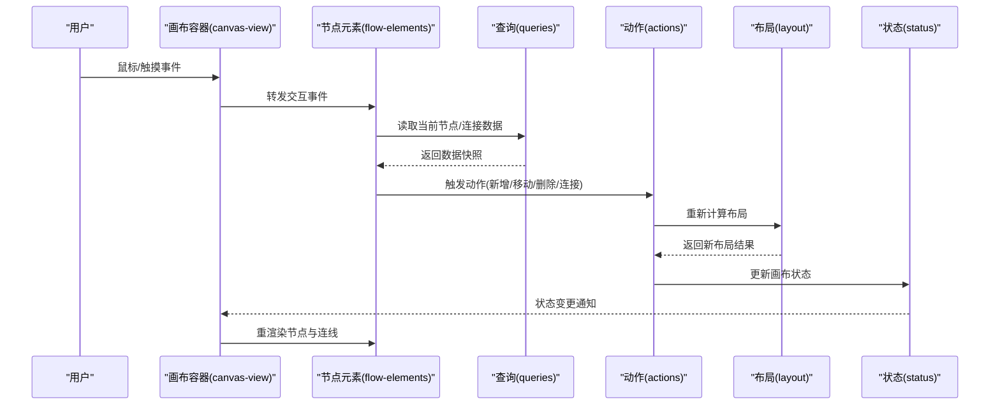
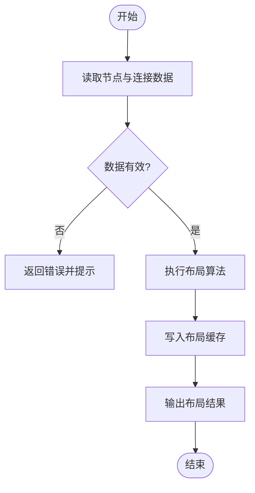
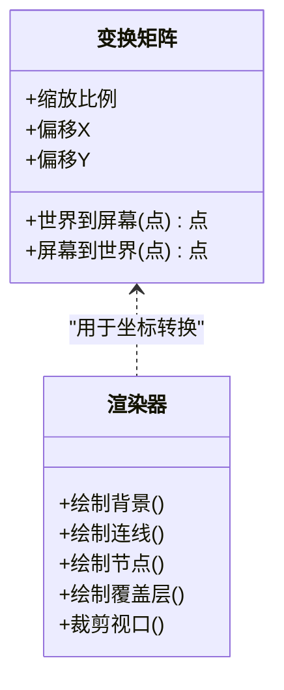
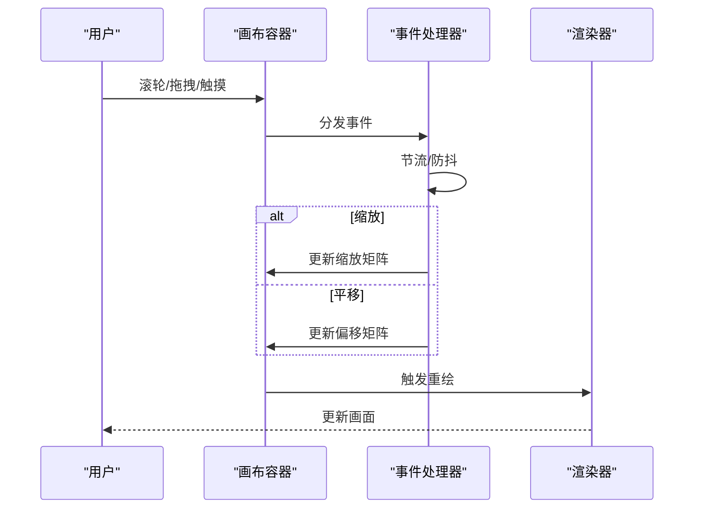
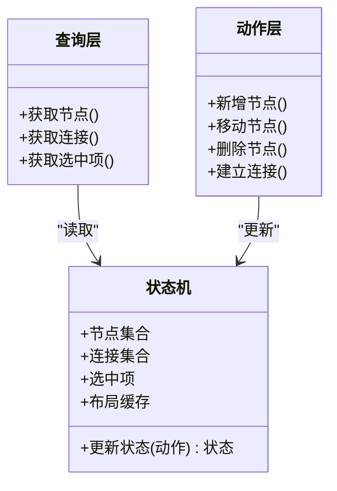
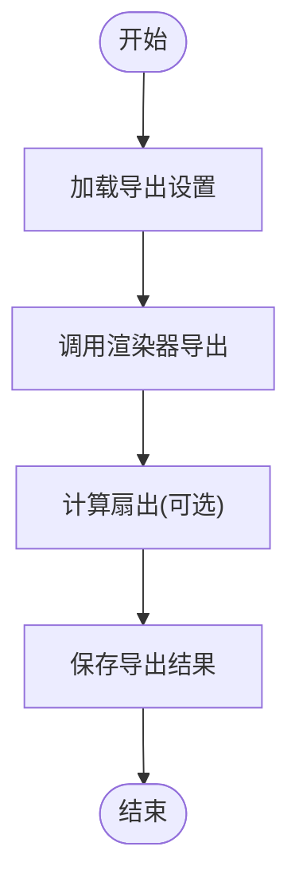
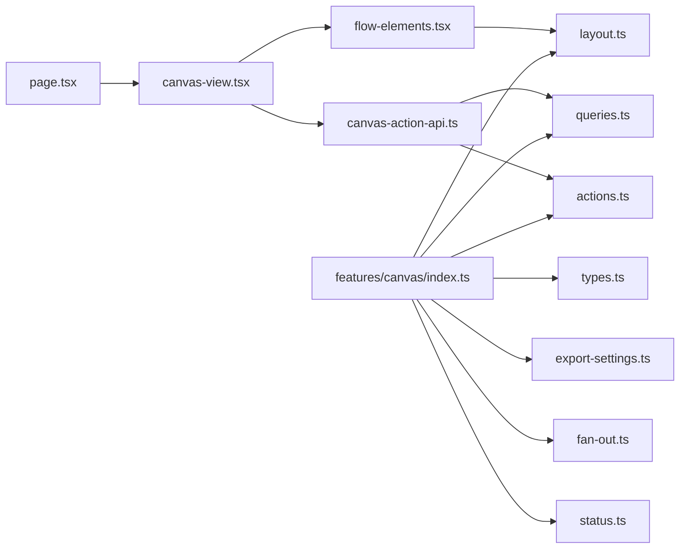

# 画布架构设计

<cite>
**本文引用的文件**   
- [src/app/products/(app)/canvas/[projectId]/page.tsx](file://src/app/products/(app)/canvas/[projectId]/page.tsx)
- [src/app/products/(app)/canvas/[projectId]/canvas-view.tsx](file://src/app/products/(app)/canvas/[projectId]/canvas-view.tsx)
- [src/app/products/(app)/canvas/[projectId]/flow-elements.tsx](file://src/app/products/(app)/canvas/[projectId]/flow-elements.tsx)
- [src/app/products/(app)/canvas/[projectId]/canvas-action-api.ts](file://src/app/products/(app)/canvas/[projectId]/canvas-action-api.ts)
- [src/features/canvas/index.ts](file://src/features/canvas/index.ts)
- [src/features/canvas/types.ts](file://src/features/canvas/types.ts)
- [src/features/canvas/layout.ts](file://src/features/canvas/layout.ts)
- [src/features/canvas/queries.ts](file://src/features/canvas/queries.ts)
- [src/features/canvas/actions.ts](file://src/features/canvas/actions.ts)
- [src/features/canvas/export-settings.ts](file://src/features/canvas/export-settings.ts)
- [src/features/canvas/fan-out.ts](file://src/features/canvas/fan-out.ts)
- [src/features/canvas/status.ts](file://src/features/canvas/status.ts)
</cite>

## 目录
1. [简介](#简介)
2. [项目结构](#项目结构)
3. [核心组件](#核心组件)
4. [架构总览](#架构总览)
5. [详细组件分析](#详细组件分析)
6. [依赖关系分析](#依赖关系分析)
7. [性能考量](#性能考量)
8. [故障排查指南](#故障排查指南)
9. [结论](#结论)
10. [附录](#附录)

## 简介
本文件为 PurpleInk 画布架构的详细技术文档，聚焦以下方面：
- 画布的布局系统、坐标系统与渲染机制
- 画布状态管理以及视图层与数据层的分离设计
- 事件处理机制、缩放与平移功能
- 性能优化策略与内存管理
- 扩展画布功能与自定义渲染逻辑的实践示例

该文档面向前端开发者与架构师，既提供高层概览，也深入到具体实现路径与关键模块的职责边界。

## 项目结构
画布相关代码主要分布在两个层次：
- 应用层（App 路由与页面）：负责挂载画布视图、承载交互入口、集成 API 与状态订阅
- 特性层（Canvas Feature）：封装画布领域模型、布局算法、查询与动作、导出设置等

图示来源
- [src/app/products/(app)/canvas/[projectId]/page.tsx](file://src/app/products/(app)/canvas/[projectId]/page.tsx)
- [src/app/products/(app)/canvas/[projectId]/canvas-view.tsx](file://src/app/products/(app)/canvas/[projectId]/canvas-view.tsx)
- [src/app/products/(app)/canvas/[projectId]/flow-elements.tsx](file://src/app/products/(app)/canvas/[projectId]/flow-elements.tsx)
- [src/app/products/(app)/canvas/[projectId]/canvas-action-api.ts](file://src/app/products/(app)/canvas/[projectId]/canvas-action-api.ts)
- [src/features/canvas/index.ts](file://src/features/canvas/index.ts)
- [src/features/canvas/types.ts](file://src/features/canvas/types.ts)
- [src/features/canvas/layout.ts](file://src/features/canvas/layout.ts)
- [src/features/canvas/queries.ts](file://src/features/canvas/queries.ts)
- [src/features/canvas/actions.ts](file://src/features/canvas/actions.ts)
- [src/features/canvas/export-settings.ts](file://src/features/canvas/export-settings.ts)
- [src/features/canvas/fan-out.ts](file://src/features/canvas/fan-out.ts)
- [src/features/canvas/status.ts](file://src/features/canvas/status.ts)

章节来源
- [src/app/products/(app)/canvas/[projectId]/page.tsx](file://src/app/products/(app)/canvas/[projectId]/page.tsx)
- [src/app/products/(app)/canvas/[projectId]/canvas-view.tsx](file://src/app/products/(app)/canvas/[projectId]/canvas-view.tsx)
- [src/app/products/(app)/canvas/[projectId]/flow-elements.tsx](file://src/app/products/(app)/canvas/[projectId]/flow-elements.tsx)
- [src/app/products/(app)/canvas/[projectId]/canvas-action-api.ts](file://src/app/products/(app)/canvas/[projectId]/canvas-action-api.ts)
- [src/features/canvas/index.ts](file://src/features/canvas/index.ts)
- [src/features/canvas/types.ts](file://src/features/canvas/types.ts)
- [src/features/canvas/layout.ts](file://src/features/canvas/layout.ts)
- [src/features/canvas/queries.ts](file://src/features/canvas/queries.ts)
- [src/features/canvas/actions.ts](file://src/features/canvas/actions.ts)
- [src/features/canvas/export-settings.ts](file://src/features/canvas/export-settings.ts)
- [src/features/canvas/fan-out.ts](file://src/features/canvas/fan-out.ts)
- [src/features/canvas/status.ts](file://src/features/canvas/status.ts)

## 核心组件
- 画布容器（Canvas View）：负责挂载画布根节点、监听窗口尺寸变化、协调缩放和平移的视图变换矩阵
- 节点元素（Flow Elements）：将画布数据模型映射为可交互的节点 UI，支持拖拽、选择、连接点展示
- 布局系统（Layout）：根据节点拓扑与约束计算节点位置、边路径、对齐与间距
- 查询与动作（Queries & Actions）：统一的数据访问与状态变更入口，保证视图与数据解耦
- 导出设置（Export Settings）：控制画布导出时的分辨率、裁剪、背景与质量等参数
- 扇出计算（Fan-out）：基于拓扑关系计算节点的入度/出度，辅助布局与可视化高亮
- 状态机（Status）：描述画布运行态（如空闲、计算中、错误），驱动 UI 反馈

章节来源
- [src/app/products/(app)/canvas/[projectId]/canvas-view.tsx](file://src/app/products/(app)/canvas/[projectId]/canvas-view.tsx)
- [src/app/products/(app)/canvas/[projectId]/flow-elements.tsx](file://src/app/products/(app)/canvas/[projectId]/flow-elements.tsx)
- [src/features/canvas/layout.ts](file://src/features/canvas/layout.ts)
- [src/features/canvas/queries.ts](file://src/features/canvas/queries.ts)
- [src/features/canvas/actions.ts](file://src/features/canvas/actions.ts)
- [src/features/canvas/export-settings.ts](file://src/features/canvas/export-settings.ts)
- [src/features/canvas/fan-out.ts](file://src/features/canvas/fan-out.ts)
- [src/features/canvas/status.ts](file://src/features/canvas/status.ts)

## 架构总览
画布采用“视图层—数据层—特性层”的分层设计：
- 视图层：React 组件负责渲染与用户交互，不直接操作业务数据
- 数据层：通过查询与动作抽象数据读写与状态更新，避免组件内联副作用
- 特性层：封装画布领域的布局、拓扑、导出、状态机等核心能力

图示来源
- [src/app/products/(app)/canvas/[projectId]/canvas-view.tsx](file://src/app/products/(app)/canvas/[projectId]/canvas-view.tsx)
- [src/app/products/(app)/canvas/[projectId]/flow-elements.tsx](file://src/app/products/(app)/canvas/[projectId]/flow-elements.tsx)
- [src/features/canvas/queries.ts](file://src/features/canvas/queries.ts)
- [src/features/canvas/actions.ts](file://src/features/canvas/actions.ts)
- [src/features/canvas/layout.ts](file://src/features/canvas/layout.ts)
- [src/features/canvas/status.ts](file://src/features/canvas/status.ts)

## 详细组件分析

### 布局系统（Layout）
- 职责：根据节点拓扑、约束与视口尺寸计算节点坐标、边路径、对齐与间距；支持增量更新与缓存
- 关键点：
  - 输入：节点集合、连接关系、约束规则、视口尺寸
  - 输出：节点布局信息（位置、尺寸）、边路径、分组与层级
  - 复杂度：典型布局算法 O(n log n) 或 O(n^2)，需结合缓存与增量更新降低重算成本
  - 可扩展性：插件化布局策略（网格、树形、力导向等）

图示来源
- [src/features/canvas/layout.ts](file://src/features/canvas/layout.ts)

章节来源
- [src/features/canvas/layout.ts](file://src/features/canvas/layout.ts)

### 坐标系统与渲染机制
- 坐标系统：
  - 世界坐标：节点在画布中的绝对位置
  - 屏幕坐标：用户在浏览器中的像素坐标
  - 变换矩阵：通过缩放与平移矩阵进行世界坐标到屏幕坐标的转换
- 渲染机制：
  - 分层渲染：背景层、连线层、节点层、覆盖层
  - 可见区域裁剪：仅渲染视口内的节点与连线
  - 增量更新：只重绘受影响的节点与边

图示来源
- [src/app/products/(app)/canvas/[projectId]/canvas-view.tsx](file://src/app/products/(app)/canvas/[projectId]/canvas-view.tsx)
- [src/app/products/(app)/canvas/[projectId]/flow-elements.tsx](file://src/app/products/(app)/canvas/[projectId]/flow-elements.tsx)

章节来源
- [src/app/products/(app)/canvas/[projectId]/canvas-view.tsx](file://src/app/products/(app)/canvas/[projectId]/canvas-view.tsx)
- [src/app/products/(app)/canvas/[projectId]/flow-elements.tsx](file://src/app/products/(app)/canvas/[projectId]/flow-elements.tsx)

### 事件处理机制、缩放与平移
- 事件处理：
  - 统一事件总线：集中捕获鼠标/触摸事件，分发给选中节点或画布容器
  - 防抖与节流：对高频事件（如拖拽、滚轮缩放）进行节流，减少重绘
- 缩放与平移：
  - 滚轮缩放：以光标为中心缩放，保持视觉锚点稳定
  - 拖拽平移：按住空白区域拖动实现画布平移
  - 手势支持：双指捏合缩放、单指拖动平移（移动端）

图示来源
- [src/app/products/(app)/canvas/[projectId]/canvas-view.tsx](file://src/app/products/(app)/canvas/[projectId]/canvas-view.tsx)
- [src/app/products/(app)/canvas/[projectId]/flow-elements.tsx](file://src/app/products/(app)/canvas/[projectId]/flow-elements.tsx)

章节来源
- [src/app/products/(app)/canvas/[projectId]/canvas-view.tsx](file://src/app/products/(app)/canvas/[projectId]/canvas-view.tsx)
- [src/app/products/(app)/canvas/[projectId]/flow-elements.tsx](file://src/app/products/(app)/canvas/[projectId]/flow-elements.tsx)

### 状态管理与数据层分离
- 状态管理：
  - 单一事实源：画布状态集中在状态机中，包含节点、连接、选中项、布局缓存等
  - 不可变更新：动作产生新的状态快照，避免共享可变数据导致的竞态
- 数据层分离：
  - 查询层：提供只读接口，返回数据快照，便于组件订阅与缓存
  - 动作层：封装写操作，确保一致性校验与副作用隔离

图示来源
- [src/features/canvas/status.ts](file://src/features/canvas/status.ts)
- [src/features/canvas/queries.ts](file://src/features/canvas/queries.ts)
- [src/features/canvas/actions.ts](file://src/features/canvas/actions.ts)

章节来源
- [src/features/canvas/status.ts](file://src/features/canvas/status.ts)
- [src/features/canvas/queries.ts](file://src/features/canvas/queries.ts)
- [src/features/canvas/actions.ts](file://src/features/canvas/actions.ts)

### 导出设置与扇出计算
- 导出设置：
  - 控制导出分辨率、裁剪区域、背景色、质量压缩等
  - 与渲染器协作生成最终图像或视频帧序列
- 扇出计算：
  - 基于连接关系计算每个节点的入度/出度
  - 用于布局优化与可视化高亮（如热点节点）

图示来源
- [src/features/canvas/export-settings.ts](file://src/features/canvas/export-settings.ts)
- [src/features/canvas/fan-out.ts](file://src/features/canvas/fan-out.ts)

章节来源
- [src/features/canvas/export-settings.ts](file://src/features/canvas/export-settings.ts)
- [src/features/canvas/fan-out.ts](file://src/features/canvas/fan-out.ts)

### 扩展画布功能与自定义渲染逻辑
- 扩展节点类型：
  - 在节点元素集合中注册新节点组件
  - 在布局系统中为新节点类型添加约束与占位规则
- 自定义渲染：
  - 在渲染器中插入自定义图层（如标注、水印、调试框）
  - 使用变换矩阵将自定义内容对齐到世界坐标
- 动作扩展：
  - 在动作层新增命令，确保状态机支持相应更新
  - 在查询层暴露新数据的只读接口

章节来源
- [src/app/products/(app)/canvas/[projectId]/flow-elements.tsx](file://src/app/products/(app)/canvas/[projectId]/flow-elements.tsx)
- [src/features/canvas/layout.ts](file://src/features/canvas/layout.ts)
- [src/features/canvas/actions.ts](file://src/features/canvas/actions.ts)
- [src/features/canvas/queries.ts](file://src/features/canvas/queries.ts)

## 依赖关系分析
画布各模块之间的依赖关系如下：
- 视图层依赖特性层的能力聚合（index.ts）
- 特性层内部按职责划分：类型定义、布局、查询、动作、导出、扇出、状态机
- 应用层通过 canvas-action-api 桥接动作与查询，避免直接耦合特性层细节

图示来源
- [src/app/products/(app)/canvas/[projectId]/page.tsx](file://src/app/products/(app)/canvas/[projectId]/page.tsx)
- [src/app/products/(app)/canvas/[projectId]/canvas-view.tsx](file://src/app/products/(app)/canvas/[projectId]/canvas-view.tsx)
- [src/app/products/(app)/canvas/[projectId]/flow-elements.tsx](file://src/app/products/(app)/canvas/[projectId]/flow-elements.tsx)
- [src/app/products/(app)/canvas/[projectId]/canvas-action-api.ts](file://src/app/products/(app)/canvas/[projectId]/canvas-action-api.ts)
- [src/features/canvas/index.ts](file://src/features/canvas/index.ts)
- [src/features/canvas/types.ts](file://src/features/canvas/types.ts)
- [src/features/canvas/layout.ts](file://src/features/canvas/layout.ts)
- [src/features/canvas/queries.ts](file://src/features/canvas/queries.ts)
- [src/features/canvas/actions.ts](file://src/features/canvas/actions.ts)
- [src/features/canvas/export-settings.ts](file://src/features/canvas/export-settings.ts)
- [src/features/canvas/fan-out.ts](file://src/features/canvas/fan-out.ts)
- [src/features/canvas/status.ts](file://src/features/canvas/status.ts)

章节来源
- [src/app/products/(app)/canvas/[projectId]/page.tsx](file://src/app/products/(app)/canvas/[projectId]/page.tsx)
- [src/app/products/(app)/canvas/[projectId]/canvas-view.tsx](file://src/app/products/(app)/canvas/[projectId]/canvas-view.tsx)
- [src/app/products/(app)/canvas/[projectId]/flow-elements.tsx](file://src/app/products/(app)/canvas/[projectId]/flow-elements.tsx)
- [src/app/products/(app)/canvas/[projectId]/canvas-action-api.ts](file://src/app/products/(app)/canvas/[projectId]/canvas-action-api.ts)
- [src/features/canvas/index.ts](file://src/features/canvas/index.ts)
- [src/features/canvas/types.ts](file://src/features/canvas/types.ts)
- [src/features/canvas/layout.ts](file://src/features/canvas/layout.ts)
- [src/features/canvas/queries.ts](file://src/features/canvas/queries.ts)
- [src/features/canvas/actions.ts](file://src/features/canvas/actions.ts)
- [src/features/canvas/export-settings.ts](file://src/features/canvas/export-settings.ts)
- [src/features/canvas/fan-out.ts](file://src/features/canvas/fan-out.ts)
- [src/features/canvas/status.ts](file://src/features/canvas/status.ts)

## 性能考量
- 布局缓存与增量更新：
  - 对布局结果进行缓存，仅在节点或连接变化时增量重算
  - 使用脏标记与最小化重绘范围
- 渲染优化：
  - 视口裁剪：仅渲染可见区域内的节点与连线
  - 分层渲染：背景与静态内容一次性绘制，动态内容独立层
  - 请求合并：批量更新状态，减少重渲染次数
- 事件优化：
  - 节流与防抖：对高频事件进行限流，避免过度计算
  - 事件委托：减少事件监听器数量
- 内存管理：
  - 及时释放不再使用的对象引用
  - 避免大对象频繁创建与销毁，使用对象池或复用缓冲区

[本节为通用指导，不直接分析具体文件]

## 故障排查指南
- 常见问题定位：
  - 布局错乱：检查节点约束与连接关系是否一致，验证布局缓存是否失效
  - 渲染卡顿：确认事件节流是否生效，查看是否存在全量重绘
  - 缩放异常：检查变换矩阵更新逻辑与中心点计算
- 调试建议：
  - 启用调试图层：显示节点边界、连接路径、视口裁剪区域
  - 日志记录：记录关键动作与状态变更，便于回溯问题
  - 性能分析：使用浏览器性能面板分析重绘与布局抖动

章节来源
- [src/features/canvas/layout.ts](file://src/features/canvas/layout.ts)
- [src/features/canvas/status.ts](file://src/features/canvas/status.ts)
- [src/app/products/(app)/canvas/[projectId]/canvas-view.tsx](file://src/app/products/(app)/canvas/[projectId]/canvas-view.tsx)

## 结论
PurpleInk 画布架构通过清晰的层次划分与职责分离，实现了可扩展、高性能且易于维护的画布系统。布局系统、坐标变换、事件处理与状态管理相互协作，为用户提供流畅的交互体验。未来可在布局算法、渲染管线与内存管理方面持续优化，进一步提升复杂场景下的表现。

[本节为总结性内容，不直接分析具体文件]

## 附录
- 术语表：
  - 世界坐标：画布中的绝对坐标
  - 屏幕坐标：浏览器中的像素坐标
  - 变换矩阵：用于坐标转换的数学矩阵
  - 扇出：节点的出度，表示连接的下游节点数量
- 参考路径：
  - 画布容器：[src/app/products/(app)/canvas/[projectId]/canvas-view.tsx](file://src/app/products/(app)/canvas/[projectId]/canvas-view.tsx)
  - 节点元素：[src/app/products/(app)/canvas/[projectId]/flow-elements.tsx](file://src/app/products/(app)/canvas/[projectId]/flow-elements.tsx)
  - 布局系统：[src/features/canvas/layout.ts](file://src/features/canvas/layout.ts)
  - 查询与动作：[src/features/canvas/queries.ts](file://src/features/canvas/queries.ts), [src/features/canvas/actions.ts](file://src/features/canvas/actions.ts)
  - 导出设置：[src/features/canvas/export-settings.ts](file://src/features/canvas/export-settings.ts)
  - 扇出计算：[src/features/canvas/fan-out.ts](file://src/features/canvas/fan-out.ts)
  - 状态机：[src/features/canvas/status.ts](file://src/features/canvas/status.ts)

[本节为附录内容，不直接分析具体文件]