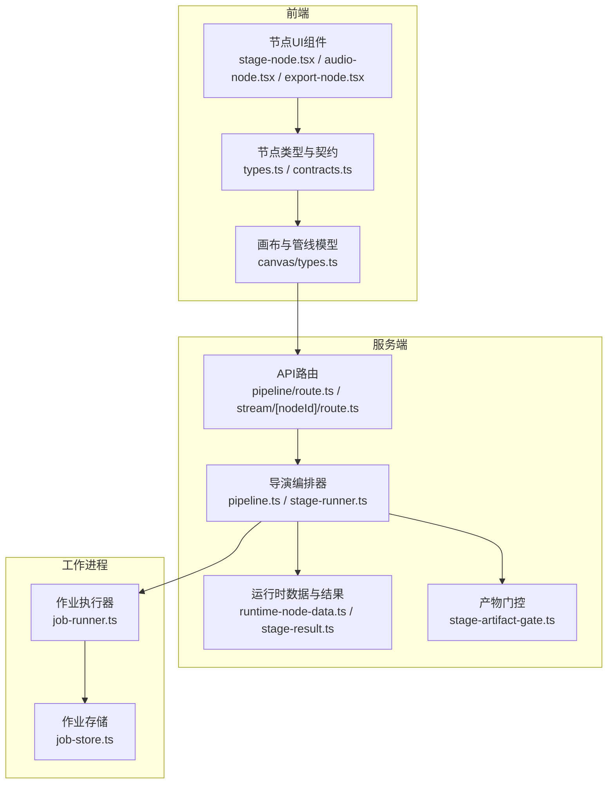
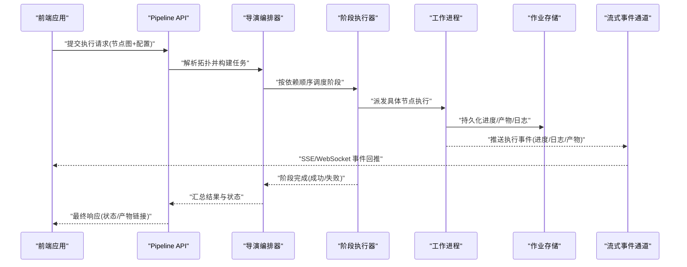
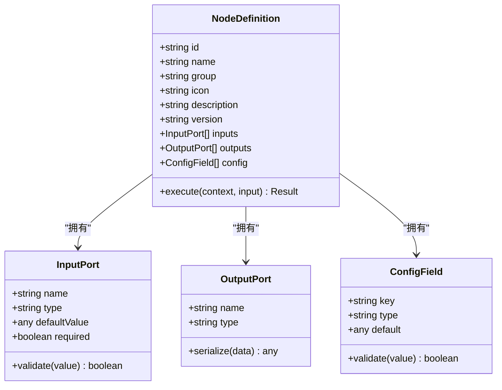
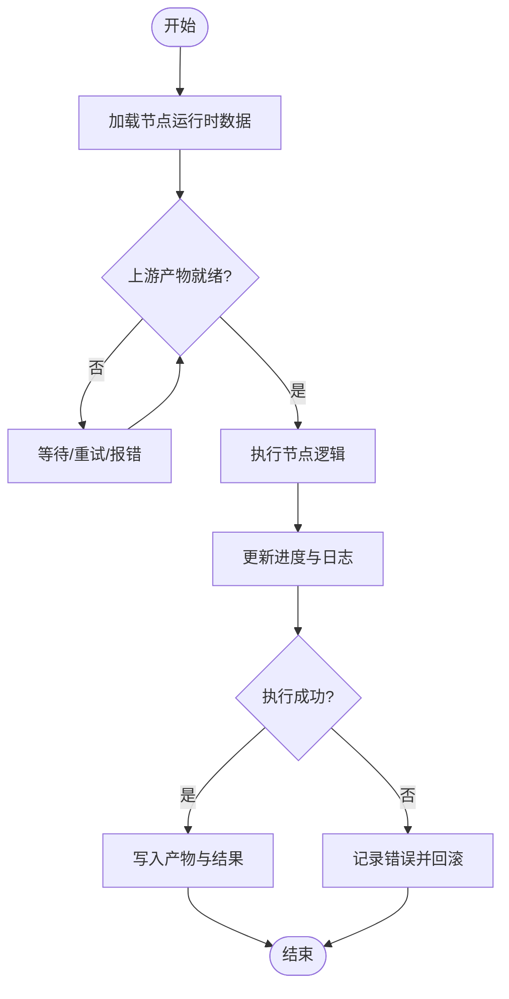
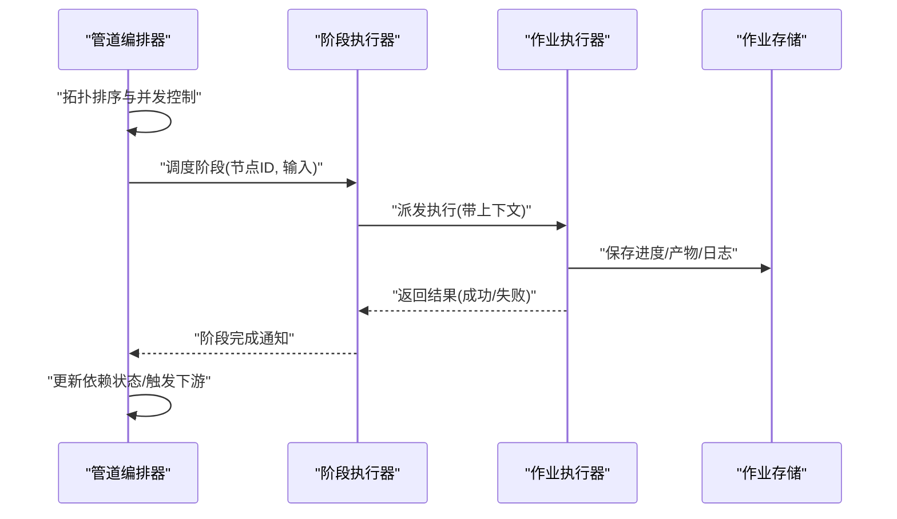
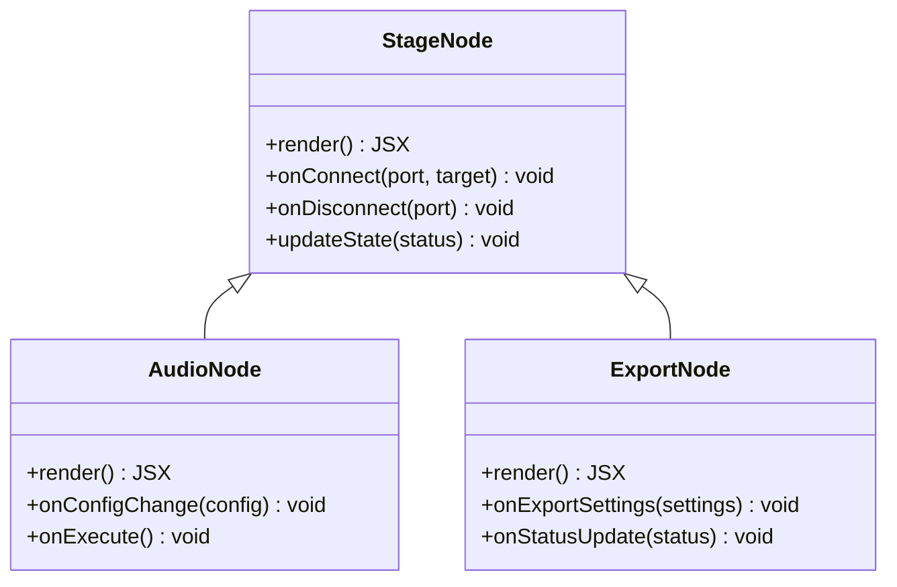
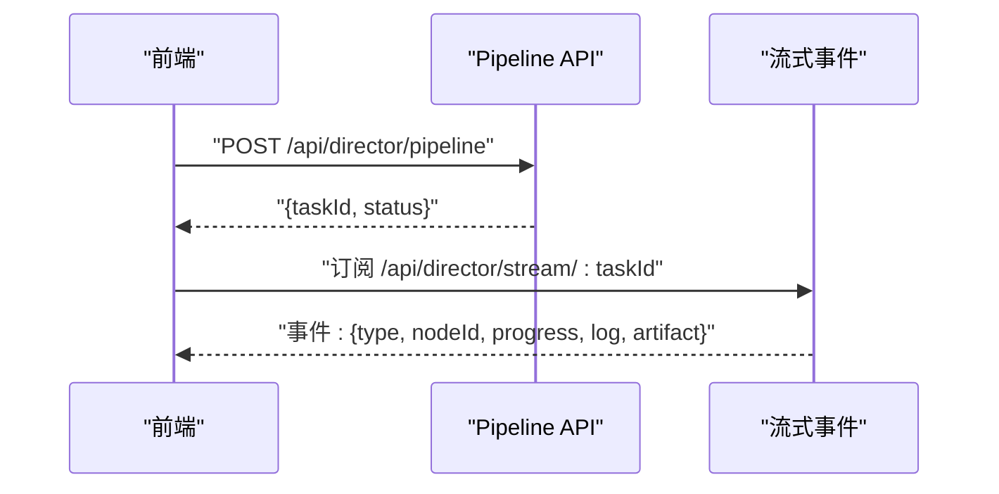
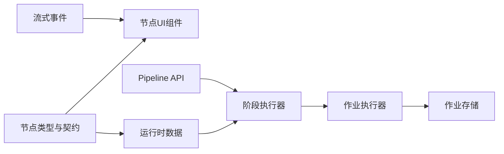

# 自定义节点开发

<cite>
**本文引用的文件**   
- [src/components/ui/node/types.ts](file://src/components/ui/node/types.ts)
- [src/components/ui/node/stage-node.tsx](file://src/components/ui/node/stage-node.tsx)
- [src/components/ui/node/audio-node.tsx](file://src/components/ui/node/audio-node.tsx)
- [src/components/ui/node/export-node.tsx](file://src/components/ui/node/export-node.tsx)
- [src/features/canvas/types.ts](file://src/features/canvas/types.ts)
- [src/features/canvas/contracts.ts](file://src/features/canvas/contracts.ts)
- [src/features/director/types.ts](file://src/features/director/types.ts)
- [src/features/director/runtime-node-data.ts](file://src/features/director/runtime-node-data.ts)
- [src/features/director/stage-runner.ts](file://src/features/director/stage-runner.ts)
- [src/features/director/stage-result.ts](file://src/features/director/stage-result.ts)
- [src/features/director/stage-artifact-gate.ts](file://src/features/director/stage-artifact-gate.ts)
- [src/features/director/pipeline.ts](file://src/features/director/pipeline.ts)
- [src/app/api/director/pipeline/route.ts](file://src/app/api/director/pipeline/route.ts)
- [src/app/api/director/stream/[nodeId]/route.ts](file://src/app/api/director/stream/[nodeId]/route.ts)
- [server/src/server/job-runner.ts](file://server/src/server/job-runner.ts)
- [server/src/server/job-store.ts](file://server/src/server/job-store.ts)
- [src/lib/workflow/index.ts](file://src/lib/workflow/index.ts)
</cite>

## 目录
1. [简介](#简介)
2. [项目结构](#项目结构)
3. [核心组件](#核心组件)
4. [架构总览](#架构总览)
5. [详细组件分析](#详细组件分析)
6. [依赖关系分析](#依赖关系分析)
7. [性能考量](#性能考量)
8. [故障排查指南](#故障排查指南)
9. [结论](#结论)
10. [附录](#附录)

## 简介
本指南面向 PurpleInk 的自定义节点开发者，系统阐述节点接口规范、类型定义与实现要求。内容涵盖：如何创建新节点类型、定义输入输出端口、实现业务逻辑、管理节点状态、处理事件与错误，以及测试、调试与部署方法。文档从基础的数据处理节点到复杂的 AI 集成节点，提供循序渐进的开发示例与实践建议。

## 项目结构
PurpleInk 的节点体系由前端可视化（Canvas）与后端执行（Director/Worker）共同构成。前端负责节点元数据、UI 渲染与交互；后端负责编排、调度、持久化与流式反馈。

图表来源
- [src/components/ui/node/stage-node.tsx](file://src/components/ui/node/stage-node.tsx)
- [src/components/ui/node/audio-node.tsx](file://src/components/ui/node/audio-node.tsx)
- [src/components/ui/node/export-node.tsx](file://src/components/ui/node/export-node.tsx)
- [src/components/ui/node/types.ts](file://src/components/ui/node/types.ts)
- [src/features/canvas/types.ts](file://src/features/canvas/types.ts)
- [src/features/canvas/contracts.ts](file://src/features/canvas/contracts.ts)
- [src/app/api/director/pipeline/route.ts](file://src/app/api/director/pipeline/route.ts)
- [src/app/api/director/stream/[nodeId]/route.ts](file://src/app/api/director/stream/[nodeId]/route.ts)
- [src/features/director/pipeline.ts](file://src/features/director/pipeline.ts)
- [src/features/director/stage-runner.ts](file://src/features/director/stage-runner.ts)
- [src/features/director/runtime-node-data.ts](file://src/features/director/runtime-node-data.ts)
- [src/features/director/stage-result.ts](file://src/features/director/stage-result.ts)
- [src/features/director/stage-artifact-gate.ts](file://src/features/director/stage-artifact-gate.ts)
- [server/src/server/job-runner.ts](file://server/src/server/job-runner.ts)
- [server/src/server/job-store.ts](file://server/src/server/job-store.ts)

章节来源
- [src/components/ui/node/types.ts](file://src/components/ui/node/types.ts)
- [src/features/canvas/types.ts](file://src/features/canvas/types.ts)
- [src/features/canvas/contracts.ts](file://src/features/canvas/contracts.ts)
- [src/app/api/director/pipeline/route.ts](file://src/app/api/director/pipeline/route.ts)
- [src/app/api/director/stream/[nodeId]/route.ts](file://src/app/api/director/stream/[nodeId]/route.ts)
- [src/features/director/pipeline.ts](file://src/features/director/pipeline.ts)
- [src/features/director/stage-runner.ts](file://src/features/director/stage-runner.ts)
- [src/features/director/runtime-node-data.ts](file://src/features/director/runtime-node-data.ts)
- [src/features/director/stage-result.ts](file://src/features/director/stage-result.ts)
- [src/features/director/stage-artifact-gate.ts](file://src/features/director/stage-artifact-gate.ts)
- [server/src/server/job-runner.ts](file://server/src/server/job-runner.ts)
- [server/src/server/job-store.ts](file://server/src/server/job-store.ts)

## 核心组件
- 节点类型与契约
  - 节点元数据：标识、名称、分组、图标、描述、版本等。
  - 端口定义：输入/输出端口的名称、类型、默认值、校验规则、是否必填。
  - 配置项：用户可编辑参数、占位符、验证器。
  - 运行契约：执行函数签名、上下文对象、返回值结构、错误约定。
- 运行时数据与结果
  - 运行时节点数据：节点实例状态、输入快照、中间产物、进度与日志。
  - 阶段结果：成功/失败状态、产物引用、错误信息、耗时与指标。
- 编排与执行
  - 管道编排：拓扑解析、依赖排序、并行度控制、重试策略。
  - 阶段执行器：加载节点实现、注入上下文、调用执行函数、收集结果。
  - 产物门控：上游产物就绪检查、条件分支、短路优化。
- 前端可视化
  - 节点UI组件：渲染节点卡片、端口连线、属性面板、实时状态。
  - 画布模型：节点集合、边集合、布局与选中态。

章节来源
- [src/components/ui/node/types.ts](file://src/components/ui/node/types.ts)
- [src/features/canvas/types.ts](file://src/features/canvas/types.ts)
- [src/features/canvas/contracts.ts](file://src/features/canvas/contracts.ts)
- [src/features/director/runtime-node-data.ts](file://src/features/director/runtime-node-data.ts)
- [src/features/director/stage-result.ts](file://src/features/director/stage-result.ts)
- [src/features/director/stage-artifact-gate.ts](file://src/features/director/stage-artifact-gate.ts)
- [src/features/director/stage-runner.ts](file://src/features/director/stage-runner.ts)
- [src/features/director/pipeline.ts](file://src/features/director/pipeline.ts)

## 架构总览
下图展示了从前端发起执行到后端编排、执行与返回结果的完整流程，包括流式事件推送。

图表来源
- [src/app/api/director/pipeline/route.ts](file://src/app/api/director/pipeline/route.ts)
- [src/app/api/director/stream/[nodeId]/route.ts](file://src/app/api/director/stream/[nodeId]/route.ts)
- [src/features/director/pipeline.ts](file://src/features/director/pipeline.ts)
- [src/features/director/stage-runner.ts](file://src/features/director/stage-runner.ts)
- [server/src/server/job-runner.ts](file://server/src/server/job-runner.ts)
- [server/src/server/job-store.ts](file://server/src/server/job-store.ts)

## 详细组件分析

### 节点类型与端口定义
- 节点类型
  - 唯一标识：用于注册与查找节点实现。
  - 元数据：显示名、分组、图标、描述、版本。
  - 端口：输入/输出端口的名称、类型、默认值、校验、是否可选。
  - 配置：表单字段、验证器、占位符支持。
- 运行契约
  - 执行函数：接收上下文与输入，返回结果或抛出错误。
  - 上下文：包含配置、凭证、外部服务客户端、日志与进度上报。
  - 结果：成功时返回产物引用或数据；失败时返回结构化错误。

图表来源
- [src/components/ui/node/types.ts](file://src/components/ui/node/types.ts)
- [src/features/canvas/contracts.ts](file://src/features/canvas/contracts.ts)

章节来源
- [src/components/ui/node/types.ts](file://src/components/ui/node/types.ts)
- [src/features/canvas/contracts.ts](file://src/features/canvas/contracts.ts)

### 运行时数据与结果
- 运行时节点数据
  - 节点实例ID、当前状态（待执行/执行中/成功/失败）、输入快照、中间产物、进度百分比、日志片段。
- 阶段结果
  - 状态码、产物引用、错误详情、耗时、指标（CPU/内存/IO）。
- 产物门控
  - 检查上游产物是否就绪，决定是否继续执行或短路跳过。

图表来源
- [src/features/director/runtime-node-data.ts](file://src/features/director/runtime-node-data.ts)
- [src/features/director/stage-result.ts](file://src/features/director/stage-result.ts)
- [src/features/director/stage-artifact-gate.ts](file://src/features/director/stage-artifact-gate.ts)

章节来源
- [src/features/director/runtime-node-data.ts](file://src/features/director/runtime-node-data.ts)
- [src/features/director/stage-result.ts](file://src/features/director/stage-result.ts)
- [src/features/director/stage-artifact-gate.ts](file://src/features/director/stage-artifact-gate.ts)

### 编排与执行
- 管道编排
  - 拓扑解析：节点依赖关系、入度计算、拓扑排序。
  - 并行度控制：限制并发阶段数，避免资源争用。
  - 重试策略：对失败阶段进行指数退避重试。
- 阶段执行器
  - 加载节点实现：根据节点ID查找注册表。
  - 注入上下文：配置、凭证、外部服务、日志与进度上报。
  - 调用执行函数：捕获异常，统一错误格式。
  - 收集结果：写入运行时数据与产物。
- 作业执行器（Worker）
  - 拉取作业队列，分配执行线程/进程。
  - 持久化进度、产物与日志。
  - 与存储层交互，保证幂等与一致性。

图表来源
- [src/features/director/pipeline.ts](file://src/features/director/pipeline.ts)
- [src/features/director/stage-runner.ts](file://src/features/director/stage-runner.ts)
- [server/src/server/job-runner.ts](file://server/src/server/job-runner.ts)
- [server/src/server/job-store.ts](file://server/src/server/job-store.ts)

章节来源
- [src/features/director/pipeline.ts](file://src/features/director/pipeline.ts)
- [src/features/director/stage-runner.ts](file://src/features/director/stage-runner.ts)
- [server/src/server/job-runner.ts](file://server/src/server/job-runner.ts)
- [server/src/server/job-store.ts](file://server/src/server/job-store.ts)

### 前端节点UI与交互
- 节点UI组件
  - 渲染节点卡片、端口连线、属性面板、实时状态指示。
  - 支持拖拽、连接、删除、批量操作。
- 画布模型
  - 节点集合与边集合、布局算法、选中态与撤销重做。
- 示例节点
  - 阶段节点：通用阶段容器，展示状态与进度。
  - 音频节点：音频处理入口，提供音频相关配置。
  - 导出节点：导出任务入口，支持格式与质量设置。

图表来源
- [src/components/ui/node/stage-node.tsx](file://src/components/ui/node/stage-node.tsx)
- [src/components/ui/node/audio-node.tsx](file://src/components/ui/node/audio-node.tsx)
- [src/components/ui/node/export-node.tsx](file://src/components/ui/node/export-node.tsx)

章节来源
- [src/components/ui/node/stage-node.tsx](file://src/components/ui/node/stage-node.tsx)
- [src/components/ui/node/audio-node.tsx](file://src/components/ui/node/audio-node.tsx)
- [src/components/ui/node/export-node.tsx](file://src/components/ui/node/export-node.tsx)

### API 与流式事件
- Pipeline API
  - 接收执行请求，校验拓扑与配置，启动编排。
  - 返回初始状态与任务ID。
- 流式事件通道
  - 基于 SSE/WebSocket 推送节点执行事件（进度、日志、产物链接）。
  - 前端订阅事件，实时更新 UI。

图表来源
- [src/app/api/director/pipeline/route.ts](file://src/app/api/director/pipeline/route.ts)
- [src/app/api/director/stream/[nodeId]/route.ts](file://src/app/api/director/stream/[nodeId]/route.ts)

章节来源
- [src/app/api/director/pipeline/route.ts](file://src/app/api/director/pipeline/route.ts)
- [src/app/api/director/stream/[nodeId]/route.ts](file://src/app/api/director/stream/[nodeId]/route.ts)

## 依赖关系分析
- 模块耦合
  - 前端节点UI依赖节点类型与契约，确保渲染与交互一致。
  - 编排器依赖运行时数据与结果模型，保证状态同步。
  - 执行器依赖作业执行器与存储，保障可靠性与可观测性。
- 外部依赖
  - 存储层：作业持久化、产物存储、日志归档。
  - 消息通道：流式事件推送、队列消费。
- 潜在循环依赖
  - 通过契约与接口隔离，避免直接循环导入。
  - 使用依赖注入与注册表模式解耦节点实现与编排器。

图表来源
- [src/components/ui/node/types.ts](file://src/components/ui/node/types.ts)
- [src/features/canvas/contracts.ts](file://src/features/canvas/contracts.ts)
- [src/features/director/runtime-node-data.ts](file://src/features/director/runtime-node-data.ts)
- [src/features/director/stage-runner.ts](file://src/features/director/stage-runner.ts)
- [server/src/server/job-runner.ts](file://server/src/server/job-runner.ts)
- [server/src/server/job-store.ts](file://server/src/server/job-store.ts)
- [src/app/api/director/pipeline/route.ts](file://src/app/api/director/pipeline/route.ts)
- [src/app/api/director/stream/[nodeId]/route.ts](file://src/app/api/director/stream/[nodeId]/route.ts)

章节来源
- [src/components/ui/node/types.ts](file://src/components/ui/node/types.ts)
- [src/features/canvas/contracts.ts](file://src/features/canvas/contracts.ts)
- [src/features/director/runtime-node-data.ts](file://src/features/director/runtime-node-data.ts)
- [src/features/director/stage-runner.ts](file://src/features/director/stage-runner.ts)
- [server/src/server/job-runner.ts](file://server/src/server/job-runner.ts)
- [server/src/server/job-store.ts](file://server/src/server/job-store.ts)
- [src/app/api/director/pipeline/route.ts](file://src/app/api/director/pipeline/route.ts)
- [src/app/api/director/stream/[nodeId]/route.ts](file://src/app/api/director/stream/[nodeId]/route.ts)

## 性能考量
- 拓扑优化
  - 预计算依赖图，减少运行时解析开销。
  - 利用短路门控跳过不必要阶段。
- 并发控制
  - 限制阶段并发度，避免资源耗尽。
  - 分片与批处理大输入数据。
- I/O 与缓存
  - 产物复用与增量更新。
  - 读写分离与异步I/O。
- 监控与指标
  - 记录阶段耗时、错误率、吞吐。
  - 告警与自动扩缩容。

[本节为通用指导，不直接分析具体文件]

## 故障排查指南
- 常见问题
  - 端口类型不匹配：检查输入/输出端口类型定义与校验规则。
  - 上游产物未就绪：确认门控逻辑与依赖顺序。
  - 执行超时：调整超时阈值与重试策略。
  - 内存溢出：优化数据处理与分批策略。
- 调试技巧
  - 启用详细日志与追踪ID。
  - 使用本地模拟外部依赖（Mock）。
  - 逐步回放执行事件定位问题。
- 恢复策略
  - 断点续跑与增量执行。
  - 错误隔离与降级路径。

章节来源
- [src/features/director/stage-artifact-gate.ts](file://src/features/director/stage-artifact-gate.ts)
- [src/features/director/stage-runner.ts](file://src/features/director/stage-runner.ts)
- [server/src/server/job-runner.ts](file://server/src/server/job-runner.ts)
- [server/src/server/job-store.ts](file://server/src/server/job-store.ts)

## 结论
PurpleInk 的自定义节点体系以清晰的类型契约、健壮的运行时模型与可扩展的编排执行为核心。遵循本文档的接口规范与最佳实践，开发者可以快速构建从简单数据处理到复杂 AI 集成的各类节点，并通过完善的测试、调试与部署流程保障稳定性与性能。

[本节为总结性内容，不直接分析具体文件]

## 附录
- 开发示例
  - 简单数据处理节点：定义输入/输出端口，实现纯函数转换，添加单元测试。
  - 复杂 AI 集成节点：封装外部 API 调用，处理流式响应，增加重试与超时。
- 测试策略
  - 单元测试：覆盖端口校验、执行逻辑、错误处理。
  - 集成测试：模拟上下游依赖，验证端到端流程。
  - 性能测试：压测并发与大数据量场景。
- 部署方法
  - 容器化打包与镜像构建。
  - 环境变量与密钥管理。
  - 灰度发布与回滚策略。

[本节为补充说明，不直接分析具体文件]