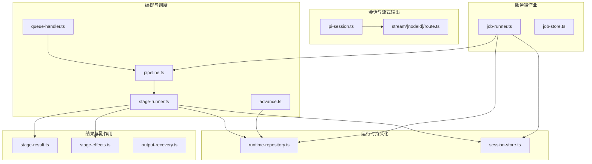
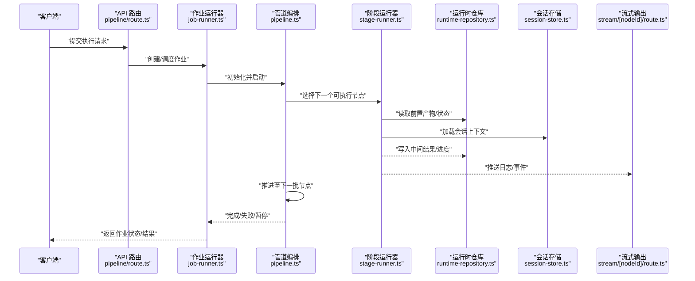
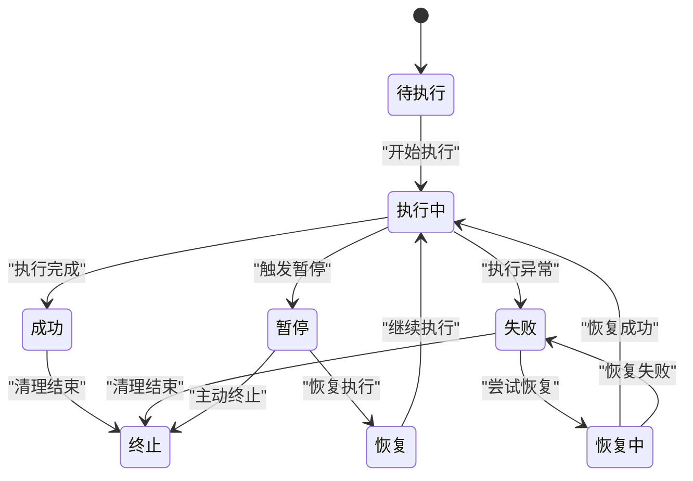
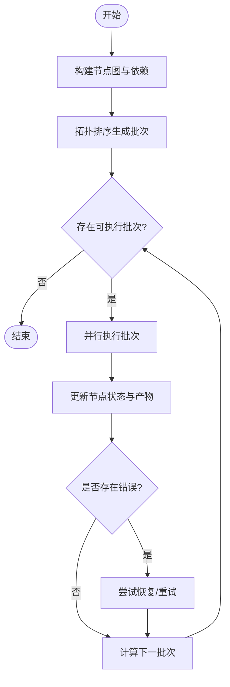
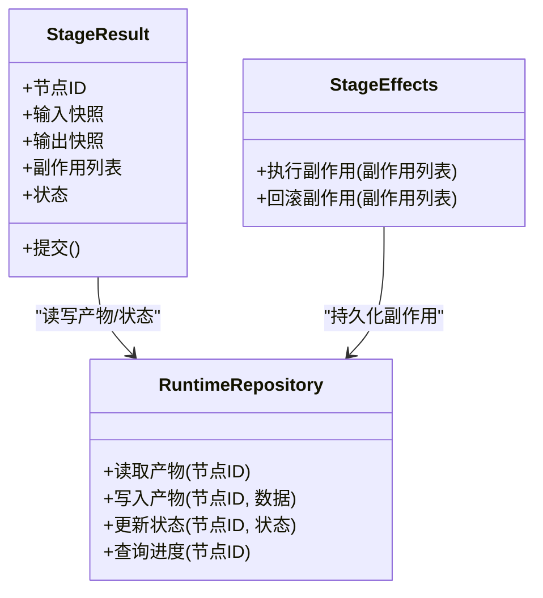
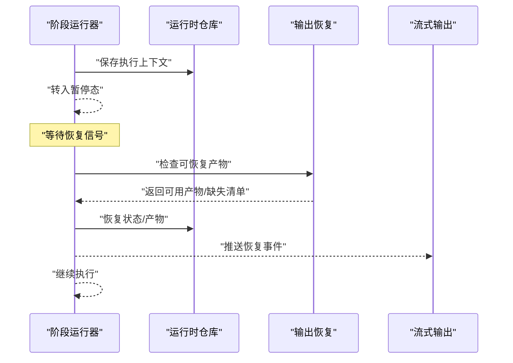
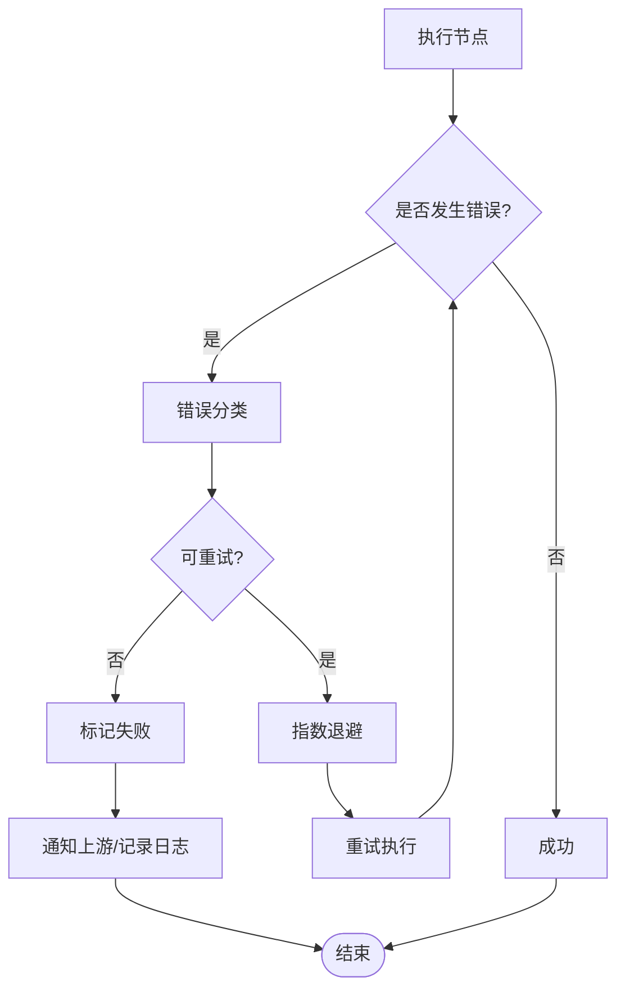
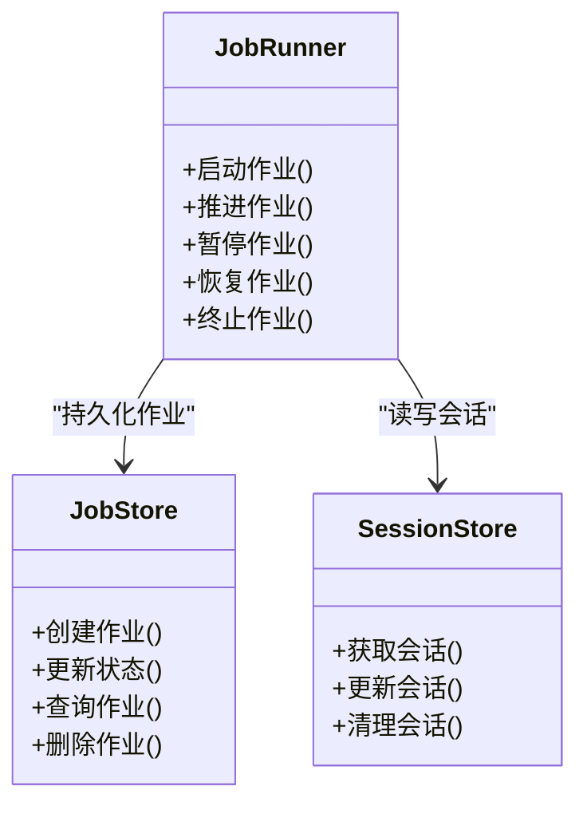
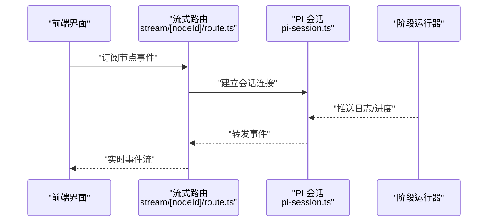
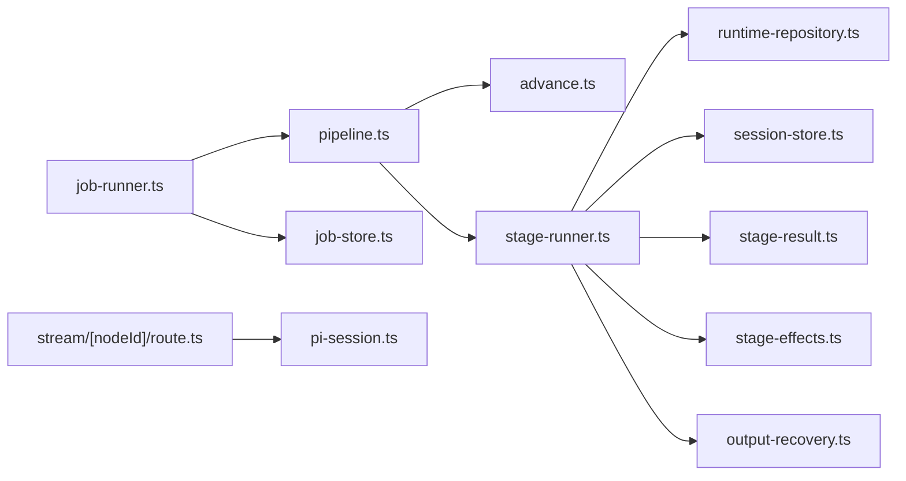

# 节点生命周期管理

<cite>
**本文引用的文件**   
- [src/features/director/pipeline.ts](file://src/features/director/pipeline.ts)
- [src/features/director/stage-runner.ts](file://src/features/director/stage-runner.ts)
- [src/features/director/advance.ts](file://src/features/director/advance.ts)
- [src/features/director/runtime-repository.ts](file://src/features/director/runtime-repository.ts)
- [src/features/director/session-store.ts](file://src/features/director/session-store.ts)
- [src/features/director/pi-session.ts](file://src/features/director/pi-session.ts)
- [src/features/director/queue-handler.ts](file://src/features/director/queue-handler.ts)
- [src/features/director/stage-result.ts](file://src/features/director/stage-result.ts)
- [src/features/director/stage-effects.ts](file://src/features/director/stage-effects.ts)
- [src/features/director/output-recovery.ts](file://src/features/director/output-recovery.ts)
- [src/lib/workflow/index.ts](file://src/lib/workflow/index.ts)
- [server/src/server/job-runner.ts](file://server/src/server/job-runner.ts)
- [server/src/server/job-store.ts](file://server/src/server/job-store.ts)
- [src/app/api/director/pipeline/route.ts](file://src/app/api/director/pipeline/route.ts)
- [src/app/api/director/stream/[nodeId]/route.ts](file://src/app/api/director/stream/[nodeId]/route.ts)
</cite>

## 目录
1. [简介](#简介)
2. [项目结构](#项目结构)
3. [核心组件](#核心组件)
4. [架构总览](#架构总览)
5. [详细组件分析](#详细组件分析)
6. [依赖关系分析](#依赖关系分析)
7. [性能考量](#性能考量)
8. [故障诊断指南](#故障诊断指南)
9. [结论](#结论)
10. [附录](#附录)

## 简介
本文件面向 PurpleInk 的“节点生命周期管理系统”，系统性阐述节点从创建到销毁的全生命周期，包括初始化、执行、暂停、恢复与终止；解释状态转换机制、错误处理与恢复策略；说明节点间数据传递、依赖解析与执行顺序控制；并提供故障诊断方法与监控调试工具使用指南。文档力求兼顾技术深度与可读性，帮助开发者与维护者快速定位问题并优化系统行为。

## 项目结构
PurpleInk 的节点生命周期管理主要位于以下模块：
- 编排与调度：pipeline、stage-runner、advance、queue-handler
- 运行时持久化：runtime-repository、session-store
- 会话与流式输出：pi-session、stream API
- 结果与副作用：stage-result、stage-effects、output-recovery
- 作业运行器（服务端）：job-runner、job-store
- API 入口：pipeline 路由、stream 路由

**图表来源** 
- [src/features/director/pipeline.ts](file://src/features/director/pipeline.ts)
- [src/features/director/stage-runner.ts](file://src/features/director/stage-runner.ts)
- [src/features/director/advance.ts](file://src/features/director/advance.ts)
- [src/features/director/queue-handler.ts](file://src/features/director/queue-handler.ts)
- [src/features/director/runtime-repository.ts](file://src/features/director/runtime-repository.ts)
- [src/features/director/session-store.ts](file://src/features/director/session-store.ts)
- [src/features/director/pi-session.ts](file://src/features/director/pi-session.ts)
- [src/app/api/director/stream/[nodeId]/route.ts](file://src/app/api/director/stream/[nodeId]/route.ts)
- [server/src/server/job-runner.ts](file://server/src/server/job-runner.ts)
- [server/src/server/job-store.ts](file://server/src/server/job-store.ts)

**章节来源**
- [src/features/director/pipeline.ts](file://src/features/director/pipeline.ts)
- [src/features/director/stage-runner.ts](file://src/features/director/stage-runner.ts)
- [src/features/director/advance.ts](file://src/features/director/advance.ts)
- [src/features/director/queue-handler.ts](file://src/features/director/queue-handler.ts)
- [src/features/director/runtime-repository.ts](file://src/features/director/runtime-repository.ts)
- [src/features/director/session-store.ts](file://src/features/director/session-store.ts)
- [src/features/director/pi-session.ts](file://src/features/director/pi-session.ts)
- [src/app/api/director/stream/[nodeId]/route.ts](file://src/app/api/director/stream/[nodeId]/route.ts)
- [server/src/server/job-runner.ts](file://server/src/server/job-runner.ts)
- [server/src/server/job-store.ts](file://server/src/server/job-store.ts)

## 核心组件
- 管道编排（Pipeline）：定义节点图、依赖关系与执行顺序，负责启动、推进与收尾。
- 阶段运行器（Stage Runner）：按拓扑顺序调度单个节点执行，管理输入/输出、副作用与结果提交。
- 推进器（Advance）：基于当前状态计算下一步可执行的节点集合，支持并发与资源限制。
- 队列处理器（Queue Handler）：将外部任务入队，协调后台执行与重试。
- 运行时仓库（Runtime Repository）：持久化节点状态、中间产物与进度，提供查询与更新能力。
- 会话存储（Session Store）：维护会话级上下文，如配置、凭据、临时状态等。
- 会话与流（PI Session & Stream）：为前端提供实时日志与进度推送。
- 结果与副作用（Stage Result & Effects）：封装节点产出、副作用执行与幂等提交。
- 输出恢复（Output Recovery）：在失败或中断后尝试恢复部分输出，减少重复工作。
- 作业运行器（Job Runner）：服务端侧的作业调度与执行引擎，驱动 Pipeline 生命周期。

**章节来源**
- [src/features/director/pipeline.ts](file://src/features/director/pipeline.ts)
- [src/features/director/stage-runner.ts](file://src/features/director/stage-runner.ts)
- [src/features/director/advance.ts](file://src/features/director/advance.ts)
- [src/features/director/queue-handler.ts](file://src/features/director/queue-handler.ts)
- [src/features/director/runtime-repository.ts](file://src/features/director/runtime-repository.ts)
- [src/features/director/session-store.ts](file://src/features/director/session-store.ts)
- [src/features/director/pi-session.ts](file://src/features/director/pi-session.ts)
- [src/features/director/stage-result.ts](file://src/features/director/stage-result.ts)
- [src/features/director/stage-effects.ts](file://src/features/director/stage-effects.ts)
- [src/features/director/output-recovery.ts](file://src/features/director/output-recovery.ts)
- [server/src/server/job-runner.ts](file://server/src/server/job-runner.ts)

## 架构总览
下图展示了从请求进入、作业调度、节点执行到结果落盘与流式反馈的整体流程。

**图表来源** 
- [src/app/api/director/pipeline/route.ts](file://src/app/api/director/pipeline/route.ts)
- [server/src/server/job-runner.ts](file://server/src/server/job-runner.ts)
- [src/features/director/pipeline.ts](file://src/features/director/pipeline.ts)
- [src/features/director/stage-runner.ts](file://src/features/director/stage-runner.ts)
- [src/features/director/runtime-repository.ts](file://src/features/director/runtime-repository.ts)
- [src/features/director/session-store.ts](file://src/features/director/session-store.ts)
- [src/app/api/director/stream/[nodeId]/route.ts](file://src/app/api/director/stream/[nodeId]/route.ts)

## 详细组件分析

### 节点生命周期状态机
节点生命周期包含以下关键状态与转换：
- 待执行（Pending）→ 执行中（Running）→ 成功（Succeeded）
- 执行中（Running）→ 暂停（Paused）→ 恢复（Resumed）→ 执行中（Running）
- 执行中（Running）→ 失败（Failed）→ 恢复中（Recovering）→ 执行中（Running）或失败（Failed）
- 任意状态 → 终止（Terminated）

**图表来源** 
- [src/features/director/stage-runner.ts](file://src/features/director/stage-runner.ts)
- [src/features/director/advance.ts](file://src/features/director/advance.ts)
- [src/features/director/output-recovery.ts](file://src/features/director/output-recovery.ts)

**章节来源**
- [src/features/director/stage-runner.ts](file://src/features/director/stage-runner.ts)
- [src/features/director/advance.ts](file://src/features/director/advance.ts)
- [src/features/director/output-recovery.ts](file://src/features/director/output-recovery.ts)

### 执行与推进逻辑
- 依赖解析：根据节点图的边关系构建有向无环图（DAG），确保前置节点成功后再执行后继节点。
- 执行顺序：通过拓扑排序与优先级策略确定批次执行顺序，支持并发度限制。
- 推进算法：每批执行完成后，重新计算可执行集合，直到所有节点完成或遇到不可恢复错误。

**图表来源** 
- [src/features/director/pipeline.ts](file://src/features/director/pipeline.ts)
- [src/features/director/advance.ts](file://src/features/director/advance.ts)
- [src/features/director/stage-runner.ts](file://src/features/director/stage-runner.ts)

**章节来源**
- [src/features/director/pipeline.ts](file://src/features/director/pipeline.ts)
- [src/features/director/advance.ts](file://src/features/director/advance.ts)
- [src/features/director/stage-runner.ts](file://src/features/director/stage-runner.ts)

### 数据传递与副作用
- 数据传递：节点通过运行时仓库读写中间产物，保证跨节点的数据一致性。
- 副作用：阶段结果与副作用分离，确保幂等提交与可重放。
- 流式输出：在执行过程中推送日志与进度，便于前端实时展示。

**图表来源** 
- [src/features/director/stage-result.ts](file://src/features/director/stage-result.ts)
- [src/features/director/runtime-repository.ts](file://src/features/director/runtime-repository.ts)
- [src/features/director/stage-effects.ts](file://src/features/director/stage-effects.ts)

**章节来源**
- [src/features/director/stage-result.ts](file://src/features/director/stage-result.ts)
- [src/features/director/runtime-repository.ts](file://src/features/director/runtime-repository.ts)
- [src/features/director/stage-effects.ts](file://src/features/director/stage-effects.ts)

### 暂停与恢复
- 暂停：在执行中捕获外部信号或内部条件，保存上下文并转入暂停态。
- 恢复：从持久化上下文恢复执行，必要时进行输出恢复以减少重复工作。
- 恢复策略：优先复用已有产物，仅重算必要分支。

**图表来源** 
- [src/features/director/stage-runner.ts](file://src/features/director/stage-runner.ts)
- [src/features/director/output-recovery.ts](file://src/features/director/output-recovery.ts)
- [src/features/director/runtime-repository.ts](file://src/features/director/runtime-repository.ts)

**章节来源**
- [src/features/director/stage-runner.ts](file://src/features/director/stage-runner.ts)
- [src/features/director/output-recovery.ts](file://src/features/director/output-recovery.ts)
- [src/features/director/runtime-repository.ts](file://src/features/director/runtime-repository.ts)

### 错误处理与重试
- 分类处理：区分可重试错误（网络超时、限流）与不可重试错误（参数校验失败）。
- 重试策略：指数退避、最大重试次数、熔断保护。
- 失败路径：记录错误详情，通知上游，允许人工干预或自动回滚。

**图表来源** 
- [src/features/director/stage-runner.ts](file://src/features/director/stage-runner.ts)
- [src/features/director/advance.ts](file://src/features/director/advance.ts)

**章节来源**
- [src/features/director/stage-runner.ts](file://src/features/director/stage-runner.ts)
- [src/features/director/advance.ts](file://src/features/director/advance.ts)

### 作业运行与持久化
- 作业运行器：负责作业生命周期管理，驱动 Pipeline 启动、推进与收尾。
- 作业存储：持久化作业元数据、状态与审计信息。
- 会话存储：维护会话级配置与临时状态，保障跨节点一致性。

**图表来源** 
- [server/src/server/job-runner.ts](file://server/src/server/job-runner.ts)
- [server/src/server/job-store.ts](file://server/src/server/job-store.ts)
- [src/features/director/session-store.ts](file://src/features/director/session-store.ts)

**章节来源**
- [server/src/server/job-runner.ts](file://server/src/server/job-runner.ts)
- [server/src/server/job-store.ts](file://server/src/server/job-store.ts)
- [src/features/director/session-store.ts](file://src/features/director/session-store.ts)

### 流式监控与调试
- 流式输出：为每个节点提供独立的事件流，支持实时日志与进度。
- 监控接口：暴露节点状态、进度与错误信息的查询端点。
- 调试建议：结合流式输出与运行时仓库快照，快速定位问题节点。

**图表来源** 
- [src/app/api/director/stream/[nodeId]/route.ts](file://src/app/api/director/stream/[nodeId]/route.ts)
- [src/features/director/pi-session.ts](file://src/features/director/pi-session.ts)
- [src/features/director/stage-runner.ts](file://src/features/director/stage-runner.ts)

**章节来源**
- [src/app/api/director/stream/[nodeId]/route.ts](file://src/app/api/director/stream/[nodeId]/route.ts)
- [src/features/director/pi-session.ts](file://src/features/director/pi-session.ts)
- [src/features/director/stage-runner.ts](file://src/features/director/stage-runner.ts)

## 依赖关系分析
- 低耦合高内聚：各组件职责清晰，通过接口与仓库抽象降低耦合。
- 直接依赖：stage-runner 依赖 runtime-repository、session-store、stage-result、stage-effects。
- 间接依赖：pipeline 通过 advance 计算可执行集，避免直接实现拓扑逻辑。
- 外部集成：job-runner 与 job-store 对接持久层，stream 路由对接前端。

**图表来源** 
- [src/features/director/pipeline.ts](file://src/features/director/pipeline.ts)
- [src/features/director/advance.ts](file://src/features/director/advance.ts)
- [src/features/director/stage-runner.ts](file://src/features/director/stage-runner.ts)
- [src/features/director/runtime-repository.ts](file://src/features/director/runtime-repository.ts)
- [src/features/director/session-store.ts](file://src/features/director/session-store.ts)
- [src/features/director/stage-result.ts](file://src/features/director/stage-result.ts)
- [src/features/director/stage-effects.ts](file://src/features/director/stage-effects.ts)
- [src/features/director/output-recovery.ts](file://src/features/director/output-recovery.ts)
- [server/src/server/job-runner.ts](file://server/src/server/job-runner.ts)
- [server/src/server/job-store.ts](file://server/src/server/job-store.ts)
- [src/app/api/director/stream/[nodeId]/route.ts](file://src/app/api/director/stream/[nodeId]/route.ts)
- [src/features/director/pi-session.ts](file://src/features/director/pi-session.ts)

**章节来源**
- [src/features/director/pipeline.ts](file://src/features/director/pipeline.ts)
- [src/features/director/advance.ts](file://src/features/director/advance.ts)
- [src/features/director/stage-runner.ts](file://src/features/director/stage-runner.ts)
- [src/features/director/runtime-repository.ts](file://src/features/director/runtime-repository.ts)
- [src/features/director/session-store.ts](file://src/features/director/session-store.ts)
- [src/features/director/stage-result.ts](file://src/features/director/stage-result.ts)
- [src/features/director/stage-effects.ts](file://src/features/director/stage-effects.ts)
- [src/features/director/output-recovery.ts](file://src/features/director/output-recovery.ts)
- [server/src/server/job-runner.ts](file://server/src/server/job-runner.ts)
- [server/src/server/job-store.ts](file://server/src/server/job-store.ts)
- [src/app/api/director/stream/[nodeId]/route.ts](file://src/app/api/director/stream/[nodeId]/route.ts)
- [src/features/director/pi-session.ts](file://src/features/director/pi-session.ts)

## 性能考量
- 并发控制：合理设置批次大小与并发度，避免资源争用。
- 产物缓存：利用运行时仓库缓存中间产物，减少重复计算。
- 流式输出：采用增量推送，降低内存占用与延迟。
- 重试策略：指数退避与熔断，避免雪崩效应。
- I/O 优化：批量读写与异步处理，提升吞吐。

[本节为通用指导，不直接分析具体文件]

## 故障诊断指南
- 常见问题
  - 节点卡住：检查依赖是否满足、是否有死锁或阻塞调用。
  - 频繁失败：查看错误分类与重试策略，确认是否为外部服务限流。
  - 恢复失败：核对产物完整性与会话一致性。
- 诊断步骤
  - 查看流式输出与节点状态，定位失败节点。
  - 检查运行时仓库中的产物与进度快照。
  - 审查会话存储的配置与上下文。
  - 启用更详细的日志级别，复现问题。
- 恢复策略
  - 针对可重试错误自动重试。
  - 针对不可重试错误提示人工干预。
  - 使用输出恢复最小化重算范围。

**章节来源**
- [src/features/director/stage-runner.ts](file://src/features/director/stage-runner.ts)
- [src/features/director/output-recovery.ts](file://src/features/director/output-recovery.ts)
- [src/features/director/runtime-repository.ts](file://src/features/director/runtime-repository.ts)
- [src/features/director/session-store.ts](file://src/features/director/session-store.ts)

## 结论
PurpleInk 的节点生命周期管理系统通过清晰的编排、稳健的状态机、完善的错误处理与恢复策略，以及高效的流式监控，实现了从创建到销毁的全链路可控与可观测。建议在开发中遵循依赖解析与副作用隔离原则，充分利用运行时仓库与会话存储，结合流式输出进行实时监控与快速排障。

[本节为总结性内容，不直接分析具体文件]

## 附录
- 术语表
  - 节点：执行单元，具有输入、输出与副作用。
  - 阶段：节点的一次执行实例。
  - 产物：节点生成的中间数据或最终结果。
  - 副作用：对外的影响操作，如写库、发送消息。
  - 会话：执行上下文，包含配置与临时状态。
- 最佳实践
  - 明确节点依赖，避免循环依赖。
  - 幂等设计，确保可重放与恢复。
  - 细粒度错误分类，便于差异化处理。
  - 合理使用并发与缓存，平衡性能与一致性。

[本节为概念性内容，不直接分析具体文件]