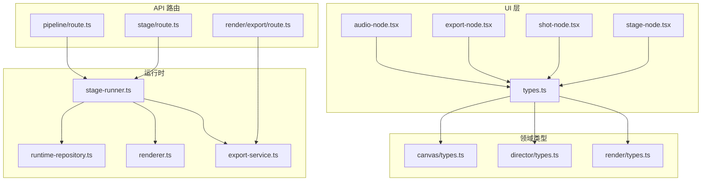
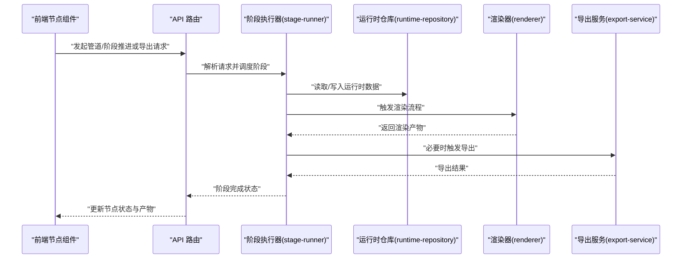
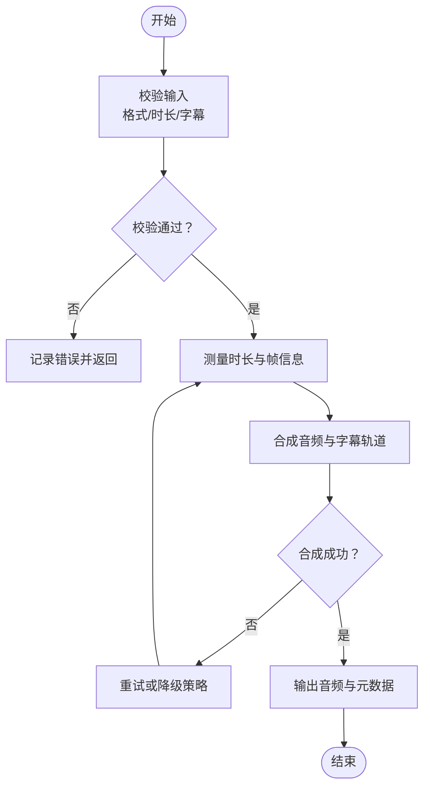
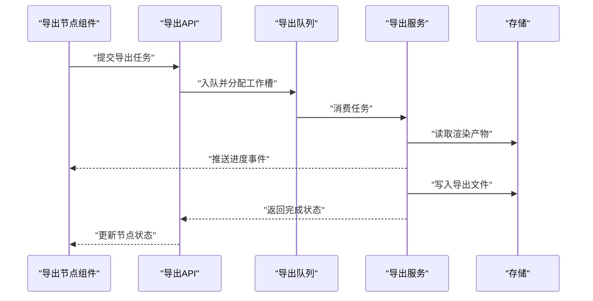
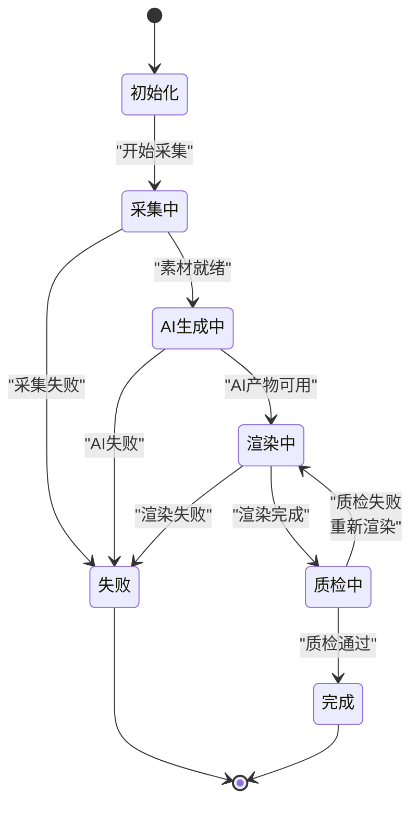
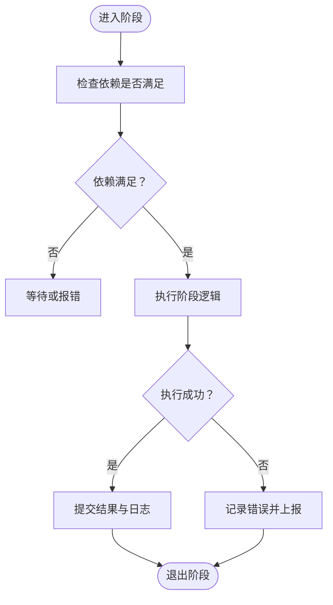
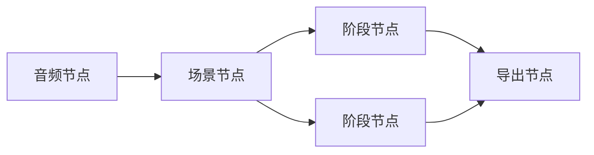
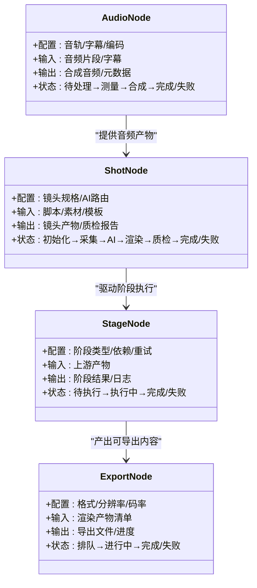

# 节点类型详解

<cite>
**本文引用的文件**   
- [src/components/ui/node/audio-node.tsx](file://src/components/ui/node/audio-node.tsx)
- [src/components/ui/node/export-node.tsx](file://src/components/ui/node/export-node.tsx)
- [src/components/ui/node/shot-node.tsx](file://src/components/ui/node/shot-node.tsx)
- [src/components/ui/node/stage-node.tsx](file://src/components/ui/node/stage-node.tsx)
- [src/components/ui/node/types.ts](file://src/components/ui/node/types.ts)
- [src/features/canvas/types.ts](file://src/features/canvas/types.ts)
- [src/features/director/types.ts](file://src/features/director/types.ts)
- [src/features/render/types.ts](file://src/features/render/types.ts)
- [src/app/api/director/pipeline/route.ts](file://src/app/api/director/pipeline/route.ts)
- [src/app/api/director/stage/route.ts](file://src/app/api/director/stage/route.ts)
- [src/app/api/render/export/route.ts](file://src/app/api/render/export/route.ts)
- [src/features/director/stage-runner.ts](file://src/features/director/stage-runner.ts)
- [src/features/director/runtime-repository.ts](file://src/features/director/runtime-repository.ts)
- [src/features/render/renderer.ts](file://src/features/render/renderer.ts)
- [src/features/render/export-service.ts](file://src/features/render/export-service.ts)
</cite>

## 目录
1. [简介](#简介)
2. [项目结构](#项目结构)
3. [核心组件](#核心组件)
4. [架构总览](#架构总览)
5. [详细组件分析](#详细组件分析)
6. [依赖关系分析](#依赖关系分析)
7. [性能考量](#性能考量)
8. [故障排查指南](#故障排查指南)
9. [结论](#结论)
10. [附录](#附录)

## 简介
本文件面向 PurpleInk 的“节点”体系，系统性梳理音频节点、导出节点、场景节点、阶段节点等核心类型的功能特性、配置参数与使用方法。文档从输入输出接口、状态管理、错误处理机制入手，辅以流程图与时序图解释数据流转，并提供性能优化建议与最佳实践，帮助读者快速上手并高效使用各类节点。

## 项目结构
PurpleInk 的节点相关代码主要分布在以下位置：
- UI 层节点组件：位于 src/components/ui/node，负责可视化展示与交互
- 类型定义：位于 src/components/ui/node/types.ts 以及各业务域 types.ts（如 canvas、director、render）
- 运行时与编排：位于 src/features/director 与 src/features/render，负责阶段执行、渲染与导出服务
- API 路由：位于 src/app/api，提供管道推进、阶段推进与导出入口

图表来源
- [src/components/ui/node/audio-node.tsx](file://src/components/ui/node/audio-node.tsx)
- [src/components/ui/node/export-node.tsx](file://src/components/ui/node/export-node.tsx)
- [src/components/ui/node/shot-node.tsx](file://src/components/ui/node/shot-node.tsx)
- [src/components/ui/node/stage-node.tsx](file://src/components/ui/node/stage-node.tsx)
- [src/components/ui/node/types.ts](file://src/components/ui/node/types.ts)
- [src/features/canvas/types.ts](file://src/features/canvas/types.ts)
- [src/features/director/types.ts](file://src/features/director/types.ts)
- [src/features/render/types.ts](file://src/features/render/types.ts)
- [src/features/director/stage-runner.ts](file://src/features/director/stage-runner.ts)
- [src/features/director/runtime-repository.ts](file://src/features/director/runtime-repository.ts)
- [src/features/render/renderer.ts](file://src/features/render/renderer.ts)
- [src/features/render/export-service.ts](file://src/features/render/export-service.ts)
- [src/app/api/director/pipeline/route.ts](file://src/app/api/director/pipeline/route.ts)
- [src/app/api/director/stage/route.ts](file://src/app/api/director/stage/route.ts)
- [src/app/api/render/export/route.ts](file://src/app/api/render/export/route.ts)

章节来源
- [src/components/ui/node/types.ts](file://src/components/ui/node/types.ts)
- [src/features/canvas/types.ts](file://src/features/canvas/types.ts)
- [src/features/director/types.ts](file://src/features/director/types.ts)
- [src/features/render/types.ts](file://src/features/render/types.ts)

## 核心组件
本节聚焦四类核心节点：音频节点、导出节点、场景节点、阶段节点。每个节点均包含：
- 功能特性：该节点在管线中的职责
- 配置参数：关键可配置项及其含义
- 输入输出接口：入参与出参的数据契约
- 状态管理：节点生命周期与状态机
- 错误处理：异常分类与恢复策略
- 使用示例：如何正确配置与调用（以路径引用代替具体代码）

章节来源
- [src/components/ui/node/audio-node.tsx](file://src/components/ui/node/audio-node.tsx)
- [src/components/ui/node/export-node.tsx](file://src/components/ui/node/export-node.tsx)
- [src/components/ui/node/shot-node.tsx](file://src/components/ui/node/shot-node.tsx)
- [src/components/ui/node/stage-node.tsx](file://src/components/ui/node/stage-node.tsx)
- [src/components/ui/node/types.ts](file://src/components/ui/node/types.ts)

## 架构总览
PurpleInk 的节点运行由“前端可视化 + 后端编排与执行”构成：
- 前端通过节点组件呈现当前项目/镜头/阶段的可视化与编辑能力
- 后端通过 director 模块编排阶段执行，通过 render 模块进行渲染与导出
- API 路由暴露管道推进、阶段推进与导出能力

图表来源
- [src/app/api/director/pipeline/route.ts](file://src/app/api/director/pipeline/route.ts)
- [src/app/api/director/stage/route.ts](file://src/app/api/director/stage/route.ts)
- [src/features/director/stage-runner.ts](file://src/features/director/stage-runner.ts)
- [src/features/director/runtime-repository.ts](file://src/features/director/runtime-repository.ts)
- [src/features/render/renderer.ts](file://src/features/render/renderer.ts)
- [src/features/render/export-service.ts](file://src/features/render/export-service.ts)

## 详细组件分析

### 音频节点（Audio Node）
- 功能特性
  - 管理与音频相关的素材、时长测量、字幕对齐与音效合成
  - 支持多轨音频合并、时间轴对齐与导出前校验
- 配置参数
  - 音轨列表、采样率、编码格式、音量增益、静音阈值、字幕文件路径
- 输入输出接口
  - 输入：原始音频片段、字幕文本、时间戳映射
  - 输出：合成后的音频文件、时长元数据、字幕轨道
- 状态管理
  - 待处理 → 测量中 → 合成中 → 已完成 / 失败
- 错误处理
  - 非法音频格式、时长测量失败、字幕时间戳越界、合成资源不足
- 使用示例
  - 配置音轨与字幕后，调用合成接口；失败时回滚中间产物并重试

图表来源
- [src/components/ui/node/audio-node.tsx](file://src/components/ui/node/audio-node.tsx)
- [src/components/ui/node/types.ts](file://src/components/ui/node/types.ts)

章节来源
- [src/components/ui/node/audio-node.tsx](file://src/components/ui/node/audio-node.tsx)
- [src/components/ui/node/types.ts](file://src/components/ui/node/types.ts)

### 导出节点（Export Node）
- 功能特性
  - 将渲染产物打包为最终媒体文件，支持多种编码与分辨率
  - 集成队列与并发控制，保障高吞吐导出
- 配置参数
  - 目标格式、分辨率、码率、封面生成、分片策略、存储位置
- 输入输出接口
  - 输入：渲染产物清单、导出配置、元数据
  - 输出：导出文件、进度事件、校验报告
- 状态管理
  - 排队中 → 进行中 → 完成 / 失败
- 错误处理
  - 编码失败、磁盘空间不足、网络上传失败、配额超限
- 使用示例
  - 提交导出任务后轮询进度；失败时根据错误码选择重试或更换编码器

图表来源
- [src/components/ui/node/export-node.tsx](file://src/components/ui/node/export-node.tsx)
- [src/app/api/render/export/route.ts](file://src/app/api/render/export/route.ts)
- [src/features/render/export-service.ts](file://src/features/render/export-service.ts)

章节来源
- [src/components/ui/node/export-node.tsx](file://src/components/ui/node/export-node.tsx)
- [src/app/api/render/export/route.ts](file://src/app/api/render/export/route.ts)
- [src/features/render/export-service.ts](file://src/features/render/export-service.ts)

### 场景节点（Shot Node）
- 功能特性
  - 表示一个镜头/场景的完整生命周期，包括素材采集、AI 生成、渲染与质检
- 配置参数
  - 镜头规格、模板、AI 模型路由、质检阈值、缓存策略
- 输入输出接口
  - 输入：镜头脚本、素材清单、模板参数
  - 输出：镜头产物、质检报告、元数据
- 状态管理
  - 初始化 → 采集中 → AI 生成中 → 渲染中 → 质检中 → 完成 / 失败
- 错误处理
  - 素材缺失、AI 调用失败、渲染超时、质检不通过
- 使用示例
  - 创建场景节点后，按阶段推进；质检失败时回退到上一阶段修正

图表来源
- [src/components/ui/node/shot-node.tsx](file://src/components/ui/node/shot-node.tsx)
- [src/features/director/types.ts](file://src/features/director/types.ts)

章节来源
- [src/components/ui/node/shot-node.tsx](file://src/components/ui/node/shot-node.tsx)
- [src/features/director/types.ts](file://src/features/director/types.ts)

### 阶段节点（Stage Node）
- 功能特性
  - 表示管线中的一个处理阶段，如“提示词组装”、“素材摄取”、“AI 生成”、“渲染”等
  - 支持阶段间数据传递与依赖收敛
- 配置参数
  - 阶段类型、输入依赖、工具链、重试策略、超时设置
- 输入输出接口
  - 输入：上游阶段产物、阶段配置
  - 输出：阶段结果、日志、指标
- 状态管理
  - 待执行 → 执行中 → 完成 / 失败
- 错误处理
  - 依赖缺失、工具不可用、执行超时、资源不足
- 使用示例
  - 定义阶段依赖图，推进至目标阶段；失败时根据错误类型选择重试或跳过

图表来源
- [src/components/ui/node/stage-node.tsx](file://src/components/ui/node/stage-node.tsx)
- [src/features/director/stage-runner.ts](file://src/features/director/stage-runner.ts)

章节来源
- [src/components/ui/node/stage-node.tsx](file://src/components/ui/node/stage-node.tsx)
- [src/features/director/stage-runner.ts](file://src/features/director/stage-runner.ts)

### 概念总览
下图展示了节点间的依赖关系与数据流转方式，强调“阶段驱动、产物导向”的设计思想。

[此图为概念性说明，不直接映射具体源码文件]

## 依赖关系分析
- 组件耦合
  - UI 节点组件依赖类型定义，保持前后端契约一致
  - 阶段执行器依赖运行时仓库与渲染/导出服务
- 外部依赖
  - 存储系统（对象存储/本地磁盘）、队列服务、AI 模型服务、编码工具链
- 潜在循环依赖
  - 通过明确阶段边界与产物契约避免循环调用
- 接口契约
  - 阶段输入/输出采用统一数据结构，便于组合与复用

图表来源
- [src/components/ui/node/types.ts](file://src/components/ui/node/types.ts)
- [src/features/director/types.ts](file://src/features/director/types.ts)
- [src/features/render/types.ts](file://src/features/render/types.ts)

章节来源
- [src/components/ui/node/types.ts](file://src/components/ui/node/types.ts)
- [src/features/director/types.ts](file://src/features/director/types.ts)
- [src/features/render/types.ts](file://src/features/render/types.ts)

## 性能考量
- 并行与并发
  - 导出节点启用队列与工作槽限制，避免资源争用
  - 阶段执行器对独立阶段进行并行推进
- 缓存与幂等
  - 对 AI 生成与渲染结果进行哈希缓存，减少重复计算
  - 阶段推进具备幂等性，支持安全重试
- I/O 优化
  - 大文件流式读写，降低内存峰值
  - 预取与分片下载提升导入效率
- 监控与度量
  - 阶段耗时、失败率、队列长度等指标上报，辅助容量规划

[本节为通用指导，不直接分析具体文件]

## 故障排查指南
- 常见问题
  - 阶段依赖未满足：检查上游产物是否存在且有效
  - 导出失败：确认编码器可用、存储空间充足、权限正确
  - 音频合成失败：验证字幕时间戳与音频时长匹配
- 定位方法
  - 查看阶段日志与错误码，结合运行时仓库快照定位问题
  - 使用 API 路由返回的详细错误信息进行修复
- 恢复策略
  - 针对可重试错误实施指数退避重试
  - 对不可重试错误进行降级或人工介入

章节来源
- [src/app/api/director/pipeline/route.ts](file://src/app/api/director/pipeline/route.ts)
- [src/app/api/director/stage/route.ts](file://src/app/api/director/stage/route.ts)
- [src/app/api/render/export/route.ts](file://src/app/api/render/export/route.ts)
- [src/features/director/runtime-repository.ts](file://src/features/director/runtime-repository.ts)

## 结论
PurpleInk 的节点体系以“阶段驱动、产物导向”为核心，通过清晰的输入输出契约与状态机管理，实现了音频、导出、场景、阶段等节点的稳定协作。遵循本文的配置规范、错误处理与性能优化建议，可显著提升开发效率与系统可靠性。

## 附录
- 最佳实践
  - 明确阶段边界与产物契约，避免隐式依赖
  - 对昂贵操作启用缓存与幂等，提高可重复性
  - 合理设置并发与超时，平衡吞吐与稳定性
  - 完善日志与指标，便于问题定位与容量规划

[本节为通用指导，不直接分析具体文件]