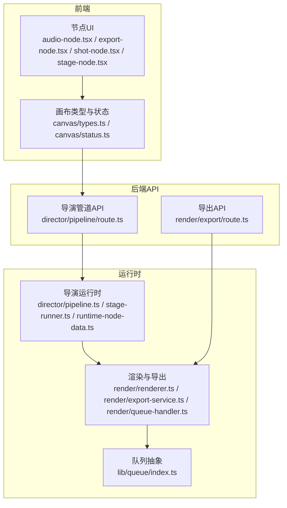
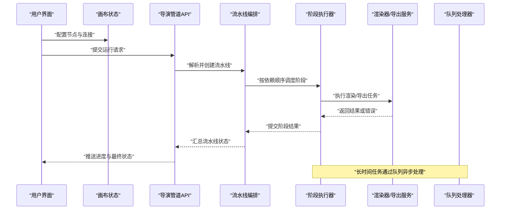
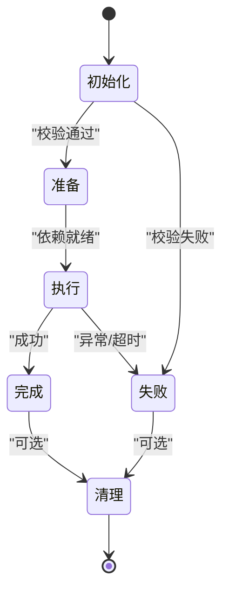
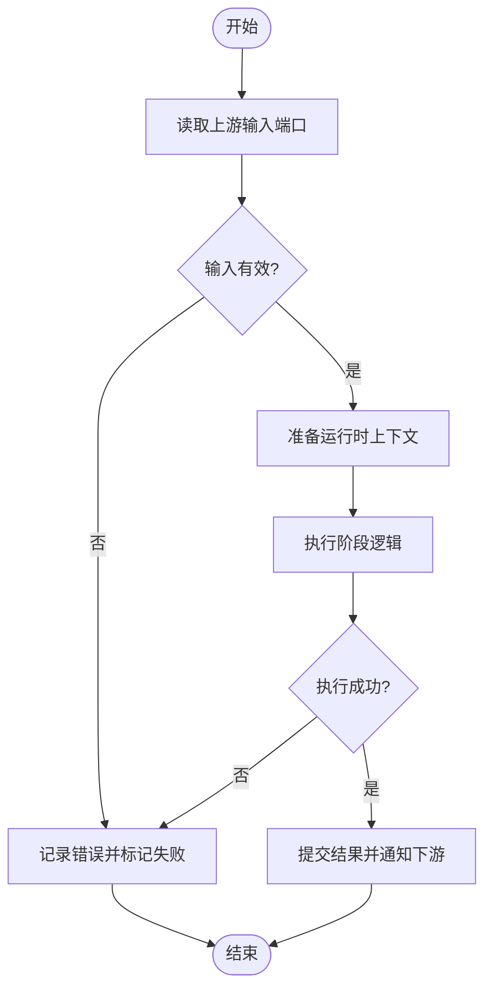
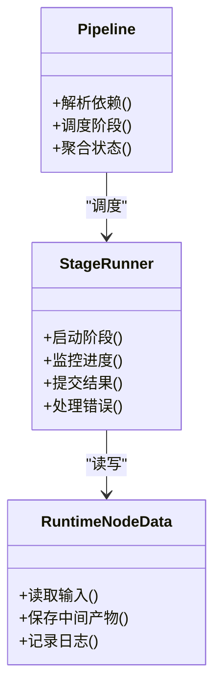
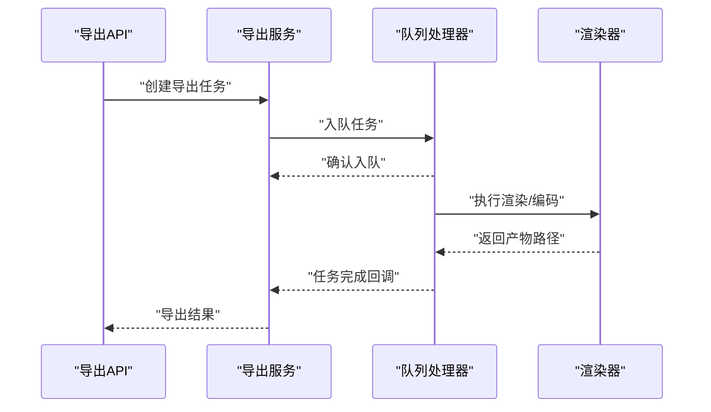

# 节点系统

<cite>
**本文引用的文件**   
- [src/components/ui/node/types.ts](file://src/components/ui/node/types.ts)
- [src/components/ui/node/audio-node.tsx](file://src/components/ui/node/audio-node.tsx)
- [src/components/ui/node/export-node.tsx](file://src/components/ui/node/export-node.tsx)
- [src/components/ui/node/shot-node.tsx](file://src/components/ui/node/shot-node.tsx)
- [src/components/ui/node/stage-node.tsx](file://src/components/ui/node/stage-node.tsx)
- [src/features/canvas/types.ts](file://src/features/canvas/types.ts)
- [src/features/canvas/status.ts](file://src/features/canvas/status.ts)
- [src/features/director/runtime-node-data.ts](file://src/features/director/runtime-node-data.ts)
- [src/features/director/stage-runner.ts](file://src/features/director/stage-runner.ts)
- [src/features/director/stage-result.ts](file://src/features/director/stage-result.ts)
- [src/features/director/pipeline.ts](file://src/features/director/pipeline.ts)
- [src/app/api/director/pipeline/route.ts](file://src/app/api/director/pipeline/route.ts)
- [src/app/api/render/export/route.ts](file://src/app/api/render/export/route.ts)
- [src/features/render/renderer.ts](file://src/features/render/renderer.ts)
- [src/features/render/export-service.ts](file://src/features/render/export-service.ts)
- [src/features/render/queue-handler.ts](file://src/features/render/queue-handler.ts)
- [src/lib/queue/index.ts](file://src/lib/queue/index.ts)
</cite>

## 目录
1. [简介](#简介)
2. [项目结构](#项目结构)
3. [核心组件](#核心组件)
4. [架构总览](#架构总览)
5. [详细组件分析](#详细组件分析)
6. [依赖关系分析](#依赖关系分析)
7. [性能考量](#性能考量)
8. [故障排查指南](#故障排查指南)
9. [结论](#结论)
10. [附录](#附录)

## 简介
本文件为 PurpleInk 节点系统的全面技术文档，聚焦于节点的生命周期、数据流与状态管理；覆盖音频节点、导出节点、场景节点等类型及其配置选项；解释节点的连接机制、参数传递与错误处理；并提供自定义节点开发指南与最佳实践，以及构建复杂工作流的示例。

## 项目结构
PurpleInk 的节点系统由前端可视化节点 UI、画布与运行时编排、后端 API 与渲染服务共同组成：
- 前端节点 UI：位于 components/ui/node，提供音频、导出、场景、阶段等节点类型的可视化与交互。
- 画布与类型：features/canvas 定义节点图元、布局、状态与查询能力。
- 导演与运行时：features/director 负责阶段执行、结果提交、运行时数据读写与流水线编排。
- 渲染与导出：features/render 提供渲染器、导出服务与队列处理器。
- 后端 API：app/api 暴露管道运行、导出等接口。
- 通用队列：lib/queue 提供任务队列抽象。

图表来源
- [src/components/ui/node/audio-node.tsx](file://src/components/ui/node/audio-node.tsx)
- [src/components/ui/node/export-node.tsx](file://src/components/ui/node/export-node.tsx)
- [src/components/ui/node/shot-node.tsx](file://src/components/ui/node/shot-node.tsx)
- [src/components/ui/node/stage-node.tsx](file://src/components/ui/node/stage-node.tsx)
- [src/features/canvas/types.ts](file://src/features/canvas/types.ts)
- [src/features/canvas/status.ts](file://src/features/canvas/status.ts)
- [src/app/api/director/pipeline/route.ts](file://src/app/api/director/pipeline/route.ts)
- [src/app/api/render/export/route.ts](file://src/app/api/render/export/route.ts)
- [src/features/director/pipeline.ts](file://src/features/director/pipeline.ts)
- [src/features/director/stage-runner.ts](file://src/features/director/stage-runner.ts)
- [src/features/director/runtime-node-data.ts](file://src/features/director/runtime-node-data.ts)
- [src/features/render/renderer.ts](file://src/features/render/renderer.ts)
- [src/features/render/export-service.ts](file://src/features/render/export-service.ts)
- [src/features/render/queue-handler.ts](file://src/features/render/queue-handler.ts)
- [src/lib/queue/index.ts](file://src/lib/queue/index.ts)

章节来源
- [src/components/ui/node/types.ts](file://src/components/ui/node/types.ts)
- [src/features/canvas/types.ts](file://src/features/canvas/types.ts)
- [src/features/canvas/status.ts](file://src/features/canvas/status.ts)

## 核心组件
- 节点类型与属性定义：统一在 types.ts 中声明节点类型、端口、输入输出契约与默认值，确保前后端一致。
- 节点UI组件：各节点类型对应独立组件，封装编辑表单、预览与状态展示。
- 画布状态机：status.ts 定义节点与管道的运行态（如待执行、运行中、成功、失败），驱动 UI 与调度。
- 运行时数据：runtime-node-data.ts 维护节点实例的运行期上下文、中间产物与日志。
- 阶段执行器：stage-runner.ts 负责单个阶段的启动、监控、结果写入与错误上报。
- 流水线编排：pipeline.ts 串联多个阶段，管理依赖、并发与回滚策略。
- 渲染与导出：renderer.ts 执行媒体渲染，export-service.ts 协调导出流程，queue-handler.ts 消费队列任务。
- API 路由：director/pipeline/route.ts 与 render/export/route.ts 暴露外部调用入口。

章节来源
- [src/components/ui/node/types.ts](file://src/components/ui/node/types.ts)
- [src/features/canvas/status.ts](file://src/features/canvas/status.ts)
- [src/features/director/runtime-node-data.ts](file://src/features/director/runtime-node-data.ts)
- [src/features/director/stage-runner.ts](file://src/features/director/stage-runner.ts)
- [src/features/director/pipeline.ts](file://src/features/director/pipeline.ts)
- [src/features/render/renderer.ts](file://src/features/render/renderer.ts)
- [src/features/render/export-service.ts](file://src/features/render/export-service.ts)
- [src/features/render/queue-handler.ts](file://src/features/render/queue-handler.ts)
- [src/app/api/director/pipeline/route.ts](file://src/app/api/director/pipeline/route.ts)
- [src/app/api/render/export/route.ts](file://src/app/api/render/export/route.ts)

## 架构总览
下图展示了从前端到后端的端到端数据流与状态流转：

图表来源
- [src/app/api/director/pipeline/route.ts](file://src/app/api/director/pipeline/route.ts)
- [src/features/director/pipeline.ts](file://src/features/director/pipeline.ts)
- [src/features/director/stage-runner.ts](file://src/features/director/stage-runner.ts)
- [src/features/render/renderer.ts](file://src/features/render/renderer.ts)
- [src/features/render/export-service.ts](file://src/features/render/export-service.ts)
- [src/features/render/queue-handler.ts](file://src/features/render/queue-handler.ts)
- [src/lib/queue/index.ts](file://src/lib/queue/index.ts)

## 详细组件分析

### 节点类型与生命周期
- 节点类型
  - 音频节点：用于音频采集、合成、转码与字幕生成。
  - 导出节点：触发视频/图片导出、缩略图生成与归档。
  - 场景节点：描述分镜/镜头规格、画面内容与时间线片段。
  - 阶段节点：表示可复用的处理阶段（如 AI 生成、转码、质检）。
- 生命周期
  - 初始化：加载默认配置、校验输入端口与必填项。
  - 准备：解析上游依赖，拉取运行时数据，预热资源。
  - 执行：进入运行态，开始计算或调用外部服务。
  - 完成：产出结果，更新下游节点就绪状态。
  - 失败：记录错误原因，支持重试或降级路径。
  - 清理：释放临时资源，归档日志与中间产物。

章节来源
- [src/components/ui/node/types.ts](file://src/components/ui/node/types.ts)
- [src/features/canvas/status.ts](file://src/features/canvas/status.ts)

### 数据流与连接机制
- 连接模型：节点间通过“端口”建立有向边，上游输出作为下游输入。
- 参数传递：运行时将上游产物序列化后注入下游输入端口，支持引用与占位符。
- 数据一致性：阶段执行器在提交结果前进行校验，失败时回滚已写部分。
- 流式处理：长耗时任务通过队列与事件流推进，避免阻塞主线程。

章节来源
- [src/features/director/runtime-node-data.ts](file://src/features/director/runtime-node-data.ts)
- [src/features/director/stage-runner.ts](file://src/features/director/stage-runner.ts)

### 状态管理与错误处理
- 状态机：节点与管道具备明确的状态转换规则，UI 实时反映当前状态。
- 错误分类：分为输入错误、运行时错误、外部依赖错误与超时错误。
- 恢复策略：支持重试、跳过、降级与人工干预。
- 可观测性：每个阶段记录结构化日志与指标，便于定位问题。

章节来源
- [src/features/canvas/status.ts](file://src/features/canvas/status.ts)
- [src/features/director/stage-result.ts](file://src/features/director/stage-result.ts)

### 音频节点
- 功能要点：音频采样率/比特率设置、多轨混音、静音检测、字幕对齐。
- 配置项：输入源、处理链、输出格式、质量阈值。
- 典型用法：录制语音 → 降噪 → 合成背景音乐 → 输出 MP3/WAV。

章节来源
- [src/components/ui/node/audio-node.tsx](file://src/components/ui/node/audio-node.tsx)

### 导出节点
- 功能要点：帧序列拼接、编码参数、水印/封面、多分辨率输出。
- 配置项：目标格式、码率、关键帧间隔、并发度。
- 典型用法：渲染完成后触发导出，生成最终交付物与缩略图。

章节来源
- [src/components/ui/node/export-node.tsx](file://src/components/ui/node/export-node.tsx)
- [src/features/render/export-service.ts](file://src/features/render/export-service.ts)

### 场景节点
- 功能要点：镜头时长、画面比例、内容模板、转场效果。
- 配置项：素材引用、文本/图像占位、时间轴片段。
- 典型用法：组合多个素材形成完整分镜，供后续渲染使用。

章节来源
- [src/components/ui/node/shot-node.tsx](file://src/components/ui/node/shot-node.tsx)

### 阶段节点
- 功能要点：可插拔的处理单元，支持 AI、转码、质检等。
- 配置项：工具适配器、参数模板、重试策略、超时控制。
- 典型用法：将复杂逻辑封装为阶段，复用并组合成流水线。

章节来源
- [src/components/ui/node/stage-node.tsx](file://src/components/ui/node/stage-node.tsx)
- [src/features/director/stage-runner.ts](file://src/features/director/stage-runner.ts)

### 运行时与流水线编排
- 运行时数据：集中管理节点实例的上下文、中间产物与日志。
- 阶段执行器：负责单阶段生命周期、错误捕获与结果提交。
- 流水线编排：根据依赖拓扑调度阶段，支持并行与回退。

图表来源
- [src/features/director/runtime-node-data.ts](file://src/features/director/runtime-node-data.ts)
- [src/features/director/stage-runner.ts](file://src/features/director/stage-runner.ts)
- [src/features/director/pipeline.ts](file://src/features/director/pipeline.ts)

章节来源
- [src/features/director/runtime-node-data.ts](file://src/features/director/runtime-node-data.ts)
- [src/features/director/stage-runner.ts](file://src/features/director/stage-runner.ts)
- [src/features/director/pipeline.ts](file://src/features/director/pipeline.ts)

### 渲染与导出服务
- 渲染器：负责媒体解码、滤镜、合成与编码。
- 导出服务：协调渲染、缩略图生成、归档与通知。
- 队列处理器：消费导出任务，保证并发与幂等。

图表来源
- [src/app/api/render/export/route.ts](file://src/app/api/render/export/route.ts)
- [src/features/render/export-service.ts](file://src/features/render/export-service.ts)
- [src/features/render/queue-handler.ts](file://src/features/render/queue-handler.ts)
- [src/features/render/renderer.ts](file://src/features/render/renderer.ts)

章节来源
- [src/app/api/render/export/route.ts](file://src/app/api/render/export/route.ts)
- [src/features/render/export-service.ts](file://src/features/render/export-service.ts)
- [src/features/render/queue-handler.ts](file://src/features/render/queue-handler.ts)
- [src/features/render/renderer.ts](file://src/features/render/renderer.ts)

## 依赖关系分析
- 模块耦合：节点 UI 依赖画布类型与状态；运行时依赖阶段执行器与渲染服务；API 路由仅暴露必要接口。
- 外部依赖：媒体处理库、AI 适配器、存储与队列后端。
- 循环依赖：通过接口与数据契约解耦，避免直接循环导入。

图表来源
- [src/components/ui/node/types.ts](file://src/components/ui/node/types.ts)
- [src/features/canvas/types.ts](file://src/features/canvas/types.ts)
- [src/features/canvas/status.ts](file://src/features/canvas/status.ts)
- [src/app/api/director/pipeline/route.ts](file://src/app/api/director/pipeline/route.ts)
- [src/app/api/render/export/route.ts](file://src/app/api/render/export/route.ts)
- [src/features/director/pipeline.ts](file://src/features/director/pipeline.ts)
- [src/features/director/stage-runner.ts](file://src/features/director/stage-runner.ts)
- [src/features/render/export-service.ts](file://src/features/render/export-service.ts)
- [src/features/render/queue-handler.ts](file://src/features/render/queue-handler.ts)

章节来源
- [src/features/canvas/types.ts](file://src/features/canvas/types.ts)
- [src/features/director/pipeline.ts](file://src/features/director/pipeline.ts)
- [src/features/render/export-service.ts](file://src/features/render/export-service.ts)

## 性能考量
- 并发控制：阶段级与任务级并发上限，避免资源争用。
- 缓存策略：对重复输入的结果进行缓存，减少重复计算。
- 流式处理：大文件采用分块与流式传输，降低内存峰值。
- 背压与限流：队列消费者按能力消费，防止雪崩。
- I/O 优化：批量写入、异步落盘与压缩归档。

[本节为通用指导，不直接分析具体文件]

## 故障排查指南
- 常见问题
  - 输入端口缺失或类型不匹配：检查节点配置与连接关系。
  - 阶段执行超时：调整超时阈值与重试策略。
  - 导出失败：查看渲染日志与存储权限。
  - 队列堆积：检查消费者健康与资源配额。
- 诊断步骤
  - 查看阶段结果与错误信息。
  - 检查运行时数据与中间产物。
  - 验证依赖拓扑与资源可用性。
  - 启用更详细的日志级别。

章节来源
- [src/features/director/stage-result.ts](file://src/features/director/stage-result.ts)
- [src/features/director/runtime-node-data.ts](file://src/features/director/runtime-node-data.ts)

## 结论
PurpleInk 节点系统以清晰的类型定义、严格的状态机与可扩展的阶段模型为核心，结合渲染与导出服务，实现了从可视化编排到可靠执行的完整闭环。通过合理的并发、缓存与错误恢复策略，系统在复杂工作流下仍保持高可用与高性能。

[本节为总结性内容，不直接分析具体文件]

## 附录

### 自定义节点开发指南
- 定义节点类型与端口契约：在类型文件中声明输入/输出、默认值与校验规则。
- 实现节点 UI：提供编辑表单、预览与状态展示。
- 编写阶段执行器：实现生命周期钩子、错误处理与结果提交。
- 注册与编排：将新节点纳入画布与流水线，确保依赖解析正确。
- 测试与可观测性：编写单元测试与集成测试，记录关键指标与日志。

章节来源
- [src/components/ui/node/types.ts](file://src/components/ui/node/types.ts)
- [src/features/director/stage-runner.ts](file://src/features/director/stage-runner.ts)

### 使用示例：构建复杂工作流
- 示例一：语音合成与字幕对齐
  - 音频节点：TTS 生成语音 → 降噪 → 合成背景音。
  - 场景节点：定义台词时长与画面模板。
  - 导出节点：输出带字幕的视频与 SRT 文件。
- 示例二：多镜头拼接与质检
  - 场景节点：多个分镜片段。
  - 阶段节点：转码、画质检测、水印添加。
  - 导出节点：多分辨率输出与缩略图。

[本节为概念性示例，不直接分析具体文件]