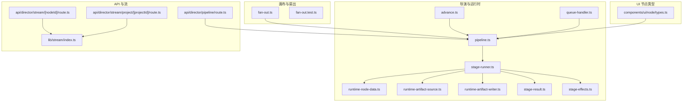
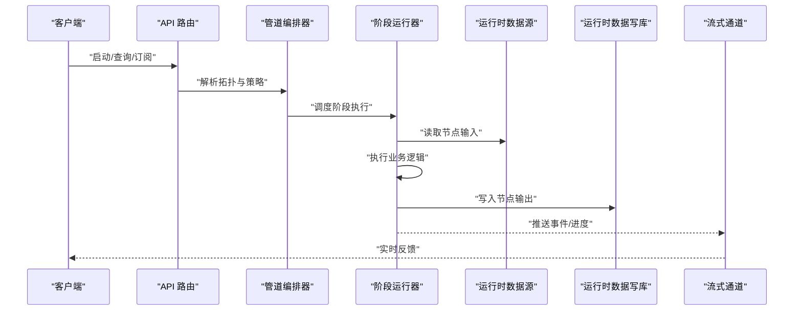
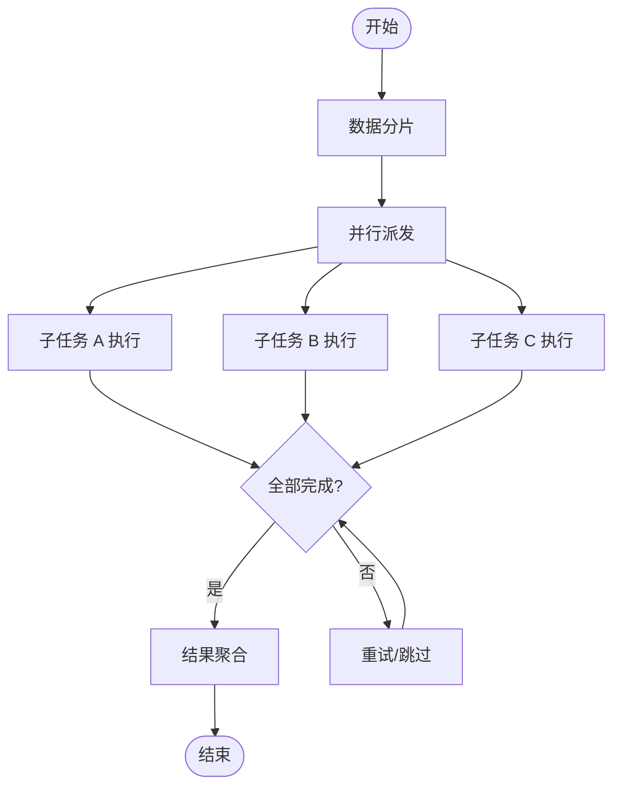
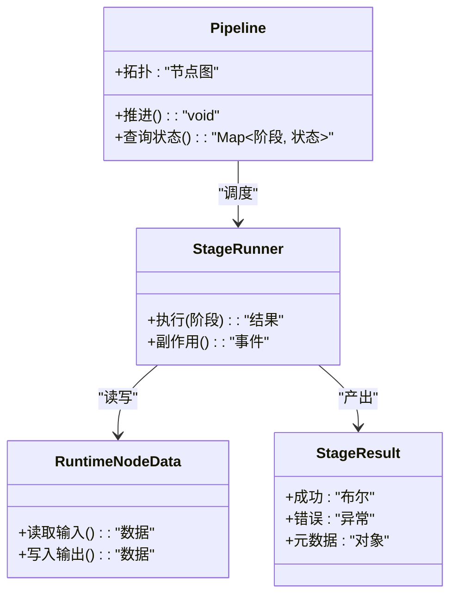
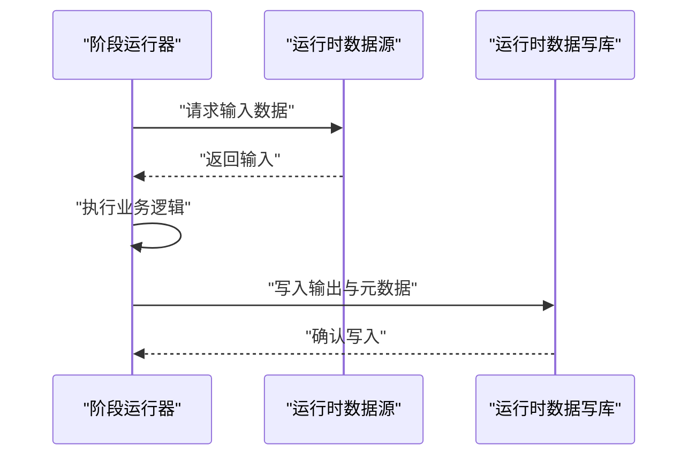
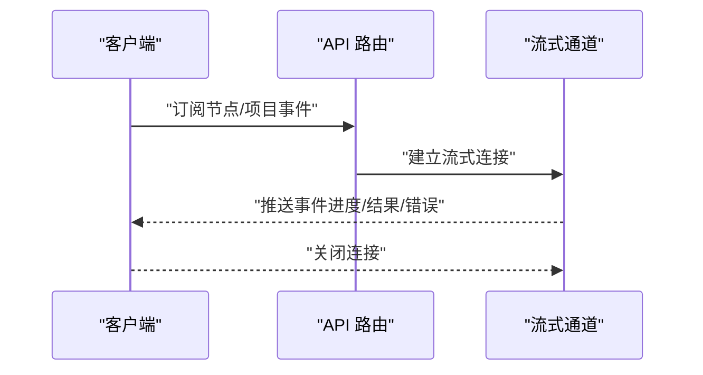
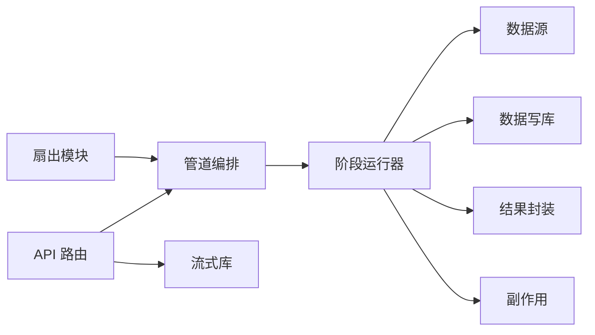

# 节点连接与数据流

<cite>
**本文引用的文件**   
- [src/features/canvas/fan-out.ts](file://src/features/canvas/fan-out.ts)
- [src/features/canvas/fan-out.test.ts](file://src/features/canvas/fan-out.test.ts)
- [src/features/director/pipeline.ts](file://src/features/director/pipeline.ts)
- [src/features/director/stage-runner.ts](file://src/features/director/stage-runner.ts)
- [src/features/director/runtime-node-data.ts](file://src/features/director/runtime-node-data.ts)
- [src/features/director/runtime-artifact-source.ts](file://src/features/director/runtime-artifact-source.ts)
- [src/features/director/runtime-artifact-writer.ts](file://src/features/director/runtime-artifact-writer.ts)
- [src/features/director/advance.ts](file://src/features/director/advance.ts)
- [src/features/director/queue-handler.ts](file://src/features/director/queue-handler.ts)
- [src/features/director/stage-result.ts](file://src/features/director/stage-result.ts)
- [src/features/director/stage-effects.ts](file://src/features/director/stage-effects.ts)
- [src/app/api/director/pipeline/route.ts](file://src/app/api/director/pipeline/route.ts)
- [src/app/api/director/stream/[nodeId]/route.ts](file://src/app/api/director/stream/[nodeId]/route.ts)
- [src/app/api/director/stream/project/[projectId]/route.ts](file://src/app/api/director/stream/project/[projectId]/route.ts)
- [src/components/ui/node/types.ts](file://src/components/ui/node/types.ts)
- [src/lib/stream/index.ts](file://src/lib/stream/index.ts)
</cite>

## 目录
1. [简介](#简介)
2. [项目结构](#项目结构)
3. [核心组件](#核心组件)
4. [架构总览](#架构总览)
5. [详细组件分析](#详细组件分析)
6. [依赖关系分析](#依赖关系分析)
7. [性能考量](#性能考量)
8. [故障排查指南](#故障排查指南)
9. [结论](#结论)
10. [附录](#附录)

## 简介
本文件面向 PurpleInk 的“节点连接与数据流系统”，系统性阐述：
- 节点间的连接机制、端口定义与数据类型约束
- 数据流的传播方式、转换规则与错误传播机制
- 扇出（fan-out）逻辑、数据分片与合并策略
- 复杂工作流的设计模式与优化技巧
- 数据流调试工具与性能分析方法

该文档以代码仓库中的实际实现为依据，结合可视化图示，帮助读者从高层到代码层全面理解 PurpleInk 的数据流引擎。

## 项目结构
与节点连接和数据流相关的核心模块主要分布在以下路径：
- 画布与扇出：src/features/canvas
- 导演（编排与执行）：src/features/director
- API 路由与流式输出：src/app/api/director
- UI 节点类型定义：src/components/ui/node
- 通用流处理库：src/lib/stream

图表来源
- [src/features/canvas/fan-out.ts](file://src/features/canvas/fan-out.ts)
- [src/features/director/pipeline.ts](file://src/features/director/pipeline.ts)
- [src/features/director/stage-runner.ts](file://src/features/director/stage-runner.ts)
- [src/features/director/runtime-node-data.ts](file://src/features/director/runtime-node-data.ts)
- [src/features/director/runtime-artifact-source.ts](file://src/features/director/runtime-artifact-source.ts)
- [src/features/director/runtime-artifact-writer.ts](file://src/features/director/runtime-artifact-writer.ts)
- [src/features/director/advance.ts](file://src/features/director/advance.ts)
- [src/features/director/queue-handler.ts](file://src/features/director/queue-handler.ts)
- [src/features/director/stage-result.ts](file://src/features/director/stage-result.ts)
- [src/features/director/stage-effects.ts](file://src/features/director/stage-effects.ts)
- [src/app/api/director/pipeline/route.ts](file://src/app/api/director/pipeline/route.ts)
- [src/app/api/director/stream/[nodeId]/route.ts](file://src/app/api/director/stream/[nodeId]/route.ts)
- [src/app/api/director/stream/project/[projectId]/route.ts](file://src/app/api/director/stream/project/[projectId]/route.ts)
- [src/lib/stream/index.ts](file://src/lib/stream/index.ts)
- [src/components/ui/node/types.ts](file://src/components/ui/node/types.ts)

章节来源
- [src/features/canvas/fan-out.ts](file://src/features/canvas/fan-out.ts)
- [src/features/director/pipeline.ts](file://src/features/director/pipeline.ts)
- [src/app/api/director/pipeline/route.ts](file://src/app/api/director/pipeline/route.ts)

## 核心组件
- 扇出调度器（Fan-Out）：负责将输入数据按策略拆分并分发到多个下游节点，支持并行执行与结果聚合。
- 管道编排器（Pipeline）：维护节点拓扑、阶段顺序与依赖关系，驱动阶段推进与状态同步。
- 阶段运行器（Stage Runner）：具体执行单个阶段的业务逻辑，管理输入读取、输出写入、副作用与结果提交。
- 运行时数据访问：提供对节点输入/输出的统一读写接口，屏蔽存储细节。
- 结果与副作用：封装阶段执行结果、错误与副作用（如日志、指标）。
- 队列处理器：基于任务队列进行并发控制与重试，保障稳定性与吞吐。
- API 与流式输出：对外暴露启动/查询/订阅接口，并通过流式通道实时推送节点事件。

章节来源
- [src/features/canvas/fan-out.ts](file://src/features/canvas/fan-out.ts)
- [src/features/director/pipeline.ts](file://src/features/director/pipeline.ts)
- [src/features/director/stage-runner.ts](file://src/features/director/stage-runner.ts)
- [src/features/director/runtime-node-data.ts](file://src/features/director/runtime-node-data.ts)
- [src/features/director/runtime-artifact-source.ts](file://src/features/director/runtime-artifact-source.ts)
- [src/features/director/runtime-artifact-writer.ts](file://src/features/director/runtime-artifact-writer.ts)
- [src/features/director/stage-result.ts](file://src/features/director/stage-result.ts)
- [src/features/director/queue-handler.ts](file://src/features/director/queue-handler.ts)
- [src/app/api/director/pipeline/route.ts](file://src/app/api/director/pipeline/route.ts)
- [src/app/api/director/stream/[nodeId]/route.ts](file://src/app/api/director/stream/[nodeId]/route.ts)
- [src/app/api/director/stream/project/[projectId]/route.ts](file://src/app/api/director/stream/project/[projectId]/route.ts)

## 架构总览
PurpleInk 的数据流架构由“编排—执行—存储—观测”四层组成：
- 编排层：定义节点拓扑、阶段顺序与依赖；解析扇出策略与合并策略。
- 执行层：阶段运行器根据输入数据执行节点逻辑，产出中间产物与最终结果。
- 存储层：统一的运行时数据源/写入库，保证可恢复与可重放。
- 观测层：通过 API 流式推送节点事件，支持前端实时渲染与调试。

图表来源
- [src/app/api/director/pipeline/route.ts](file://src/app/api/director/pipeline/route.ts)
- [src/features/director/pipeline.ts](file://src/features/director/pipeline.ts)
- [src/features/director/stage-runner.ts](file://src/features/director/stage-runner.ts)
- [src/features/director/runtime-node-data.ts](file://src/features/director/runtime-node-data.ts)
- [src/features/director/runtime-artifact-source.ts](file://src/features/director/runtime-artifact-source.ts)
- [src/features/director/runtime-artifact-writer.ts](file://src/features/director/runtime-artifact-writer.ts)
- [src/lib/stream/index.ts](file://src/lib/stream/index.ts)

## 详细组件分析

### 扇出（Fan-Out）与合并策略
- 扇出策略：将单条输入拆分为多条子任务，分别投递给下游节点并行处理。
- 合并策略：等待所有子任务完成或满足阈值后，按约定规则聚合结果。
- 容错与重试：失败子任务可按策略重试，整体失败时回滚或降级。

图表来源
- [src/features/canvas/fan-out.ts](file://src/features/canvas/fan-out.ts)
- [src/features/canvas/fan-out.test.ts](file://src/features/canvas/fan-out.test.ts)

章节来源
- [src/features/canvas/fan-out.ts](file://src/features/canvas/fan-out.ts)
- [src/features/canvas/fan-out.test.ts](file://src/features/canvas/fan-out.test.ts)

### 管道编排与阶段推进
- 拓扑解析：构建 DAG，识别阶段依赖与入度。
- 推进算法：当阶段输入就绪且无阻塞时，触发执行；完成后更新下游依赖。
- 状态机：阶段状态包括待执行、执行中、成功、失败、取消等。

图表来源
- [src/features/director/pipeline.ts](file://src/features/director/pipeline.ts)
- [src/features/director/stage-runner.ts](file://src/features/director/stage-runner.ts)
- [src/features/director/runtime-node-data.ts](file://src/features/director/runtime-node-data.ts)
- [src/features/director/stage-result.ts](file://src/features/director/stage-result.ts)

章节来源
- [src/features/director/pipeline.ts](file://src/features/director/pipeline.ts)
- [src/features/director/stage-runner.ts](file://src/features/director/stage-runner.ts)
- [src/features/director/advance.ts](file://src/features/director/advance.ts)

### 运行时数据访问（读/写）
- 数据源抽象：统一读取节点输入（可能来自上游输出、外部存储或配置）。
- 数据写库：统一写入节点输出（中间产物、最终产物、元数据）。
- 一致性：支持事务或幂等写入，避免重复与丢失。

图表来源
- [src/features/director/runtime-node-data.ts](file://src/features/director/runtime-node-data.ts)
- [src/features/director/runtime-artifact-source.ts](file://src/features/director/runtime-artifact-source.ts)
- [src/features/director/runtime-artifact-writer.ts](file://src/features/director/runtime-artifact-writer.ts)

章节来源
- [src/features/director/runtime-node-data.ts](file://src/features/director/runtime-node-data.ts)
- [src/features/director/runtime-artifact-source.ts](file://src/features/director/runtime-artifact-source.ts)
- [src/features/director/runtime-artifact-writer.ts](file://src/features/director/runtime-artifact-writer.ts)

### 结果与副作用
- 结果封装：包含成功标志、错误信息、耗时、产物引用等。
- 副作用：日志、指标、缓存更新、消息通知等。
- 副作用隔离：确保副作用不影响主流程的可恢复性。

章节来源
- [src/features/director/stage-result.ts](file://src/features/director/stage-result.ts)
- [src/features/director/stage-effects.ts](file://src/features/director/stage-effects.ts)

### 队列与并发控制
- 任务队列：缓冲阶段任务，限制并发度，避免过载。
- 重试与退避：失败任务按策略重试，指数退避降低冲突。
- 优先级与抢占：关键路径优先，必要时抢占低优先级任务。

章节来源
- [src/features/director/queue-handler.ts](file://src/features/director/queue-handler.ts)

### API 与流式输出
- 启动/查询：通过 REST API 启动管道、查询阶段状态。
- 流式订阅：按节点或项目维度订阅事件，实时推送进度与结果。
- 背压与限流：保护服务端与客户端，避免雪崩。

图表来源
- [src/app/api/director/pipeline/route.ts](file://src/app/api/director/pipeline/route.ts)
- [src/app/api/director/stream/[nodeId]/route.ts](file://src/app/api/director/stream/[nodeId]/route.ts)
- [src/app/api/director/stream/project/[projectId]/route.ts](file://src/app/api/director/stream/project/[projectId]/route.ts)
- [src/lib/stream/index.ts](file://src/lib/stream/index.ts)

章节来源
- [src/app/api/director/pipeline/route.ts](file://src/app/api/director/pipeline/route.ts)
- [src/app/api/director/stream/[nodeId]/route.ts](file://src/app/api/director/stream/[nodeId]/route.ts)
- [src/app/api/director/stream/project/[projectId]/route.ts](file://src/app/api/director/stream/project/[projectId]/route.ts)
- [src/lib/stream/index.ts](file://src/lib/stream/index.ts)

### 节点端口定义与数据类型约束
- 端口模型：每个节点定义输入/输出端口，指定名称、类型与可选性。
- 类型约束：在连接时校验上下游端口类型兼容，防止运行时错误。
- 默认值与转换：支持默认值填充与轻量类型转换。

章节来源
- [src/components/ui/node/types.ts](file://src/components/ui/node/types.ts)

## 依赖关系分析
- 松耦合：各模块通过明确接口交互，便于替换与扩展。
- 内聚性：扇出、编排、执行、存储职责清晰，减少跨域影响。
- 潜在循环：需避免编排与执行之间的直接循环依赖。

图表来源
- [src/features/canvas/fan-out.ts](file://src/features/canvas/fan-out.ts)
- [src/features/director/pipeline.ts](file://src/features/director/pipeline.ts)
- [src/features/director/stage-runner.ts](file://src/features/director/stage-runner.ts)
- [src/features/director/runtime-node-data.ts](file://src/features/director/runtime-node-data.ts)
- [src/features/director/runtime-artifact-source.ts](file://src/features/director/runtime-artifact-source.ts)
- [src/features/director/runtime-artifact-writer.ts](file://src/features/director/runtime-artifact-writer.ts)
- [src/features/director/stage-result.ts](file://src/features/director/stage-result.ts)
- [src/features/director/stage-effects.ts](file://src/features/director/stage-effects.ts)
- [src/app/api/director/pipeline/route.ts](file://src/app/api/director/pipeline/route.ts)
- [src/lib/stream/index.ts](file://src/lib/stream/index.ts)

章节来源
- [src/features/canvas/fan-out.ts](file://src/features/canvas/fan-out.ts)
- [src/features/director/pipeline.ts](file://src/features/director/pipeline.ts)
- [src/features/director/stage-runner.ts](file://src/features/director/stage-runner.ts)
- [src/app/api/director/pipeline/route.ts](file://src/app/api/director/pipeline/route.ts)

## 性能考量
- 并行度调优：根据资源与 I/O 特性调整扇出并行度与队列大小。
- 批处理与合并：批量读取/写入，减少锁竞争与网络往返。
- 缓存与去重：对热点数据与幂等操作启用缓存，避免重复计算。
- 背压与限流：在流式输出端实施背压，防止客户端拥塞。
- 监控与度量：采集阶段耗时、吞吐、错误率，定位瓶颈。

[本节为通用指导，不直接分析具体文件]

## 故障排查指南
- 常见问题
  - 阶段卡住：检查依赖是否就绪、队列是否饱和、是否有死锁。
  - 数据不一致：核对读写一致性与幂等性，查看事务边界。
  - 扇出不完整：确认子任务是否全部完成，失败重试策略是否生效。
  - 流式中断：检查连接生命周期、背压设置与客户端消费能力。
- 诊断步骤
  - 使用 API 流式订阅观察节点事件与状态变化。
  - 检查运行时数据源/写库的写入记录与错误日志。
  - 验证端口类型与数据契约是否匹配。
  - 逐步缩小范围，隔离问题阶段或扇出分支。

章节来源
- [src/features/director/stage-result.ts](file://src/features/director/stage-result.ts)
- [src/features/director/stage-effects.ts](file://src/features/director/stage-effects.ts)
- [src/app/api/director/stream/[nodeId]/route.ts](file://src/app/api/director/stream/[nodeId]/route.ts)
- [src/app/api/director/stream/project/[projectId]/route.ts](file://src/app/api/director/stream/project/[projectId]/route.ts)

## 结论
PurpleInk 的节点连接与数据流系统通过清晰的编排、执行与存储分层，结合扇出/合并策略与流式观测，实现了高内聚、可扩展且可观测的数据流水线。合理配置并发与缓存、完善错误与副作用处理，是提升性能与稳定性的关键。

[本节为总结，不直接分析具体文件]

## 附录
- 设计模式建议
  - 使用策略模式实现不同扇出/合并策略。
  - 采用观察者模式实现副作用与事件推送。
  - 通过工厂模式创建阶段实例，简化配置与注册。
- 最佳实践
  - 明确端口类型与契约，严格校验输入输出。
  - 保持阶段幂等，便于重试与恢复。
  - 将副作用与主流程解耦，确保可恢复性。
  - 为关键路径添加度量与告警。

[本节为补充内容，不直接分析具体文件]