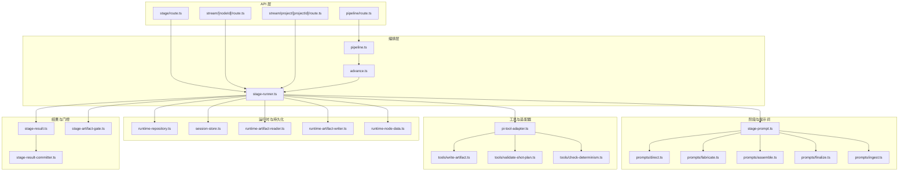
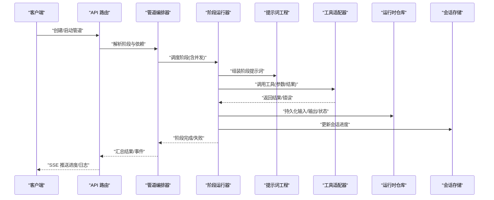
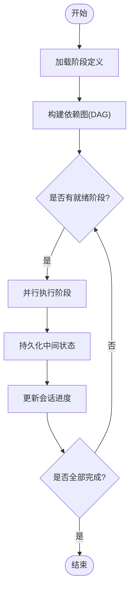
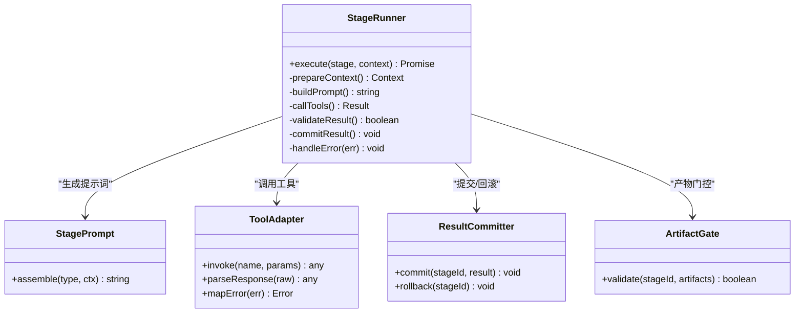
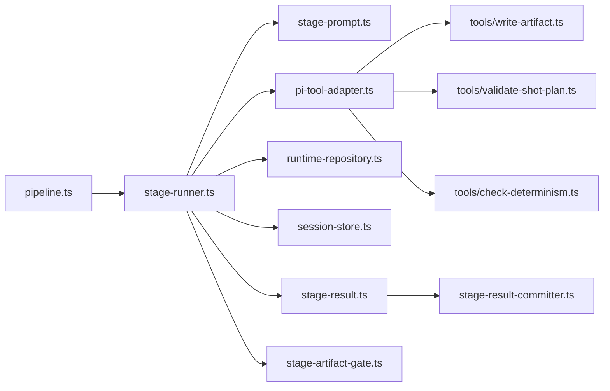

# 导演系统

<cite>
**本文引用的文件**   
- [src/features/director/index.ts](file://src/features/director/index.ts)
- [src/features/director/pipeline.ts](file://src/features/director/pipeline.ts)
- [src/features/director/advance.ts](file://src/features/director/advance.ts)
- [src/features/director/stage-runner.ts](file://src/features/director/stage-runner.ts)
- [src/features/director/stage-prompt.ts](file://src/features/director/stage-prompt.ts)
- [src/features/director/pi-provider.ts](file://src/features/director/pi-provider.ts)
- [src/features/director/pi-tool-adapter.ts](file://src/features/director/pi-tool-adapter.ts)
- [src/features/director/runtime-repository.ts](file://src/features/director/runtime-repository.ts)
- [src/features/director/session-store.ts](file://src/features/director/session-store.ts)
- [src/features/director/stage-result.ts](file://src/features/director/stage-result.ts)
- [src/features/director/stage-result-committer.ts](file://src/features/director/stage-result-committer.ts)
- [src/features/director/stage-artifact-gate.ts](file://src/features/director/stage-artifact-gate.ts)
- [src/features/director/runtime-artifact-reader.ts](file://src/features/director/runtime-artifact-reader.ts)
- [src/features/director/runtime-artifact-writer.ts](file://src/features/director/runtime-artifact-writer.ts)
- [src/features/director/runtime-node-data.ts](file://src/features/director/runtime-node-data.ts)
- [src/features/director/output-recovery.ts](file://src/features/director/output-recovery.ts)
- [src/features/director/audio-timing.ts](file://src/features/director/audio-timing.ts)
- [src/features/director/prompts/direct.ts](file://src/features/director/prompts/direct.ts)
- [src/features/director/prompts/fabricate.ts](file://src/features/director/prompts/fabricate.ts)
- [src/features/director/prompts/assemble.ts](file://src/features/director/prompts/assemble.ts)
- [src/features/director/prompts/finalize.ts](file://src/features/director/prompts/finalize.ts)
- [src/features/director/prompts/ingest.ts](file://src/features/director/prompts/ingest.ts)
- [src/features/director/schemas/shot-plan.ts](file://src/features/director/schemas/shot-plan.ts)
- [src/features/director/schemas/ingest.ts](file://src/features/director/schemas/ingest.ts)
- [src/features/director/tools/write-artifact.ts](file://src/features/director/tools/write-artifact.ts)
- [src/features/director/tools/validate-shot-plan.ts](file://src/features/director/tools/validate-shot-plan.ts)
- [src/features/director/tools/check-determinism.ts](file://src/features/director/tools/check-determinism.ts)
- [src/app/api/director/pipeline/route.ts](file://src/app/api/director/pipeline/route.ts)
- [src/app/api/director/stage/route.ts](file://src/app/api/director/stage/route.ts)
- [src/app/api/director/stream/[nodeId]/route.ts](file://src/app/api/director/stream/[nodeId]/route.ts)
- [src/app/api/director/stream/project/[projectId]/route.ts](file://src/app/api/director/stream/project/[projectId]/route.ts)
</cite>

## 目录
1. [简介](#简介)
2. [项目结构](#项目结构)
3. [核心组件](#核心组件)
4. [架构总览](#架构总览)
5. [详细组件分析](#详细组件分析)
6. [依赖关系分析](#依赖关系分析)
7. [性能考量](#性能考量)
8. [故障排查指南](#故障排查指南)
9. [结论](#结论)
10. [附录](#附录)

## 简介
本文件为 PurpleInk 平台的“导演系统”提供系统化、可操作的文档。内容覆盖工作流编排、阶段管理、工具链集成与状态持久化机制，并深入解释导演提示词工程、工具调用协议、结果验证与错误处理。同时给出管道执行流程、并行处理、依赖管理与回滚机制的设计说明，并提供配置示例以定义新阶段、集成外部工具与自定义处理逻辑。最后包含调试技巧、性能监控与故障恢复策略，帮助开发者快速上手与高效排障。

## 项目结构
导演系统位于前端特性模块 src/features/director 下，围绕“管道-阶段-工具-会话-存储”的清晰分层组织：
- 管道与编排：pipeline.ts、advance.ts、stage-runner.ts
- 阶段与提示词：stage-prompt.ts、prompts/*
- 工具与适配器：pi-tool-adapter.ts、tools/*
- 运行时数据与持久化：runtime-repository.ts、session-store.ts、runtime-artifact-reader/writer.ts、runtime-node-data.ts
- 结果与门控：stage-result.ts、stage-result-committer.ts、stage-artifact-gate.ts
- 输出恢复与音频时序：output-recovery.ts、audio-timing.ts
- API 路由：app/api/director/*

图表来源
- [src/app/api/director/pipeline/route.ts](file://src/app/api/director/pipeline/route.ts)
- [src/app/api/director/stage/route.ts](file://src/app/api/director/stage/route.ts)
- [src/app/api/director/stream/[nodeId]/route.ts](file://src/app/api/director/stream/[nodeId]/route.ts)
- [src/app/api/director/stream/project/[projectId]/route.ts](file://src/app/api/director/stream/project/[projectId]/route.ts)
- [src/features/director/pipeline.ts](file://src/features/director/pipeline.ts)
- [src/features/director/advance.ts](file://src/features/director/advance.ts)
- [src/features/director/stage-runner.ts](file://src/features/director/stage-runner.ts)
- [src/features/director/stage-prompt.ts](file://src/features/director/stage-prompt.ts)
- [src/features/director/prompts/direct.ts](file://src/features/director/prompts/direct.ts)
- [src/features/director/prompts/fabricate.ts](file://src/features/director/prompts/fabricate.ts)
- [src/features/director/prompts/assemble.ts](file://src/features/director/prompts/assemble.ts)
- [src/features/director/prompts/finalize.ts](file://src/features/director/prompts/finalize.ts)
- [src/features/director/prompts/ingest.ts](file://src/features/director/prompts/ingest.ts)
- [src/features/director/pi-tool-adapter.ts](file://src/features/director/pi-tool-adapter.ts)
- [src/features/director/tools/write-artifact.ts](file://src/features/director/tools/write-artifact.ts)
- [src/features/director/tools/validate-shot-plan.ts](file://src/features/director/tools/validate-shot-plan.ts)
- [src/features/director/tools/check-determinism.ts](file://src/features/director/tools/check-determinism.ts)
- [src/features/director/runtime-repository.ts](file://src/features/director/runtime-repository.ts)
- [src/features/director/session-store.ts](file://src/features/director/session-store.ts)
- [src/features/director/runtime-artifact-reader.ts](file://src/features/director/runtime-artifact-reader.ts)
- [src/features/director/runtime-artifact-writer.ts](file://src/features/director/runtime-artifact-writer.ts)
- [src/features/director/runtime-node-data.ts](file://src/features/director/runtime-node-data.ts)
- [src/features/director/stage-result.ts](file://src/features/director/stage-result.ts)
- [src/features/director/stage-result-committer.ts](file://src/features/director/stage-result-committer.ts)
- [src/features/director/stage-artifact-gate.ts](file://src/features/director/stage-artifact-gate.ts)

章节来源
- [src/features/director/index.ts](file://src/features/director/index.ts)

## 核心组件
- 管道编排器（Pipeline）：负责加载阶段定义、构建依赖图、调度执行顺序与并发控制。
- 阶段运行器（Stage Runner）：驱动单个阶段的执行，包括上下文准备、提示词组装、工具调用、结果校验与提交。
- 提示词工程（Stage Prompt）：按阶段类型动态拼装提示词模板，注入上下文与约束。
- 工具适配器（Tool Adapter）：统一封装外部工具调用协议，支持参数序列化、结果解析与错误映射。
- 运行时仓库（Runtime Repository）：持久化阶段输入/输出、节点状态与中间产物，保障幂等与可恢复。
- 会话存储（Session Store）：维护会话级元数据、进度与临时状态。
- 结果与门控（Result & Gate）：标准化阶段结果结构，提供一致性校验与产物门控。
- 输出恢复（Output Recovery）：在失败或中断后基于已持久化状态进行断点续跑与补偿。
- 音频时序（Audio Timing）：对齐音频与画面时序，确保多模态一致性。

章节来源
- [src/features/director/pipeline.ts](file://src/features/director/pipeline.ts)
- [src/features/director/stage-runner.ts](file://src/features/director/stage-runner.ts)
- [src/features/director/stage-prompt.ts](file://src/features/director/stage-prompt.ts)
- [src/features/director/pi-tool-adapter.ts](file://src/features/director/pi-tool-adapter.ts)
- [src/features/director/runtime-repository.ts](file://src/features/director/runtime-repository.ts)
- [src/features/director/session-store.ts](file://src/features/director/session-store.ts)
- [src/features/director/stage-result.ts](file://src/features/director/stage-result.ts)
- [src/features/director/stage-result-committer.ts](file://src/features/director/stage-result-committer.ts)
- [src/features/director/stage-artifact-gate.ts](file://src/features/director/stage-artifact-gate.ts)
- [src/features/director/output-recovery.ts](file://src/features/director/output-recovery.ts)
- [src/features/director/audio-timing.ts](file://src/features/director/audio-timing.ts)

## 架构总览
导演系统采用“API 路由 -> 编排器 -> 阶段运行器 -> 工具/提示词 -> 运行时存储”的分层架构。API 层暴露 REST/SSE 接口；编排层负责拓扑与并发；阶段层聚焦业务逻辑；工具层抽象外部能力；存储层保证状态一致性与可恢复性。

图表来源
- [src/app/api/director/pipeline/route.ts](file://src/app/api/director/pipeline/route.ts)
- [src/app/api/director/stage/route.ts](file://src/app/api/director/stage/route.ts)
- [src/app/api/director/stream/[nodeId]/route.ts](file://src/app/api/director/stream/[nodeId]/route.ts)
- [src/app/api/director/stream/project/[projectId]/route.ts](file://src/app/api/director/stream/project/[projectId]/route.ts)
- [src/features/director/pipeline.ts](file://src/features/director/pipeline.ts)
- [src/features/director/stage-runner.ts](file://src/features/director/stage-runner.ts)
- [src/features/director/stage-prompt.ts](file://src/features/director/stage-prompt.ts)
- [src/features/director/pi-tool-adapter.ts](file://src/features/director/pi-tool-adapter.ts)
- [src/features/director/runtime-repository.ts](file://src/features/director/runtime-repository.ts)
- [src/features/director/session-store.ts](file://src/features/director/session-store.ts)

## 详细组件分析

### 管道编排器（Pipeline）
- 职责：加载阶段定义、构建依赖图、计算执行顺序、控制并发度、处理阶段间数据传递。
- 关键点：
  - 依赖解析：基于阶段声明的输入/输出键生成有向无环图（DAG）。
  - 并发调度：按依赖就绪情况并行执行多个阶段，避免资源争用。
  - 容错推进：结合 advance.ts 实现失败重试、跳过与回退策略。
  - 事件上报：通过 SSE 将执行事件推送到前端。

图表来源
- [src/features/director/pipeline.ts](file://src/features/director/pipeline.ts)
- [src/features/director/advance.ts](file://src/features/director/advance.ts)

章节来源
- [src/features/director/pipeline.ts](file://src/features/director/pipeline.ts)
- [src/features/director/advance.ts](file://src/features/director/advance.ts)

### 阶段运行器（Stage Runner）
- 职责：执行单个阶段的全生命周期，包括上下文准备、提示词组装、工具调用、结果校验、提交与异常处理。
- 关键点：
  - 上下文装配：从运行时仓库读取上游产物，构造阶段输入。
  - 提示词生成：委托 stage-prompt.ts 按阶段类型生成结构化提示。
  - 工具调用：通过 pi-tool-adapter 统一调用 write-artifact、validate-shot-plan、check-determinism 等工具。
  - 结果提交：使用 stage-result-committer 写入最终结果，并通过 gate 校验产物完整性。
  - 错误处理：捕获异常、记录日志、触发输出恢复与回滚。

图表来源
- [src/features/director/stage-runner.ts](file://src/features/director/stage-runner.ts)
- [src/features/director/stage-prompt.ts](file://src/features/director/stage-prompt.ts)
- [src/features/director/pi-tool-adapter.ts](file://src/features/director/pi-tool-adapter.ts)
- [src/features/director/stage-result-committer.ts](file://src/features/director/stage-result-committer.ts)
- [src/features/director/stage-artifact-gate.ts](file://src/features/director/stage-artifact-gate.ts)

章节来源
- [src/features/director/stage-runner.ts](file://src/features/director/stage-runner.ts)
- [src/features/director/stage-prompt.ts](file://src/features/director/stage-prompt.ts)
- [src/features/director/pi-tool-adapter.ts](file://src/features/director/pi-tool-adapter.ts)
- [src/features/director/stage-result-committer.ts](file://src/features/director/stage-result-committer.ts)
- [src/features/director/stage-artifact-gate.ts](file://src/features/director/stage-artifact-gate.ts)

### 提示词工程（Prompts）
- 职责：根据阶段类型与上下文动态组装提示词，确保模型输出符合 schema 约束。
- 阶段类型：
  - direct：直接指令型任务
  - fabricate：素材合成与生成
  - assemble：片段组装与拼接
  - finalize：收尾与质检
  - ingest：采集与解析
- 关键点：
  - 模板化：按阶段类型选择模板，注入变量与约束。
  - 结构化输出：配合 schemas/shot-plan.ts 与 schemas/ingest.ts 对输出进行校验。
  - 可观测性：记录提示词版本与哈希，便于复现与回溯。

章节来源
- [src/features/director/stage-prompt.ts](file://src/features/director/stage-prompt.ts)
- [src/features/director/prompts/direct.ts](file://src/features/director/prompts/direct.ts)
- [src/features/director/prompts/fabricate.ts](file://src/features/director/prompts/fabricate.ts)
- [src/features/director/prompts/assemble.ts](file://src/features/director/prompts/assemble.ts)
- [src/features/director/prompts/finalize.ts](file://src/features/director/prompts/finalize.ts)
- [src/features/director/prompts/ingest.ts](file://src/features/director/prompts/ingest.ts)
- [src/features/director/schemas/shot-plan.ts](file://src/features/director/schemas/shot-plan.ts)
- [src/features/director/schemas/ingest.ts](file://src/features/director/schemas/ingest.ts)

### 工具链集成（Tools & Adapter）
- 职责：统一对外部工具的调用协议，屏蔽差异，提供参数序列化、响应解析与错误映射。
- 内置工具：
  - write-artifact：写入阶段产物到运行时存储
  - validate-shot-plan：校验分镜计划的结构与一致性
  - check-determinism：检查关键步骤的可确定性
- 关键点：
  - 协议规范：统一的入参/出参契约，便于扩展新工具。
  - 错误映射：将第三方错误转换为内部标准错误，便于上层处理。
  - 幂等性：工具调用具备幂等语义，支持重试与去重。

章节来源
- [src/features/director/pi-tool-adapter.ts](file://src/features/director/pi-tool-adapter.ts)
- [src/features/director/tools/write-artifact.ts](file://src/features/director/tools/write-artifact.ts)
- [src/features/director/tools/validate-shot-plan.ts](file://src/features/director/tools/validate-shot-plan.ts)
- [src/features/director/tools/check-determinism.ts](file://src/features/director/tools/check-determinism.ts)

### 运行时数据与持久化（Runtime & Storage）
- 运行时仓库（Runtime Repository）：
  - 持久化阶段输入/输出、节点状态、中间产物与审计日志。
  - 提供事务性写入与查询，保障一致性。
- 会话存储（Session Store）：
  - 维护会话级元数据、进度、重试计数与时间戳。
- 产物读写（Artifact Reader/Writer）：
  - 统一访问中间产物，支持缓存与增量更新。
- 节点数据（Runtime Node Data）：
  - 描述节点拓扑、依赖、状态机与执行上下文。

章节来源
- [src/features/director/runtime-repository.ts](file://src/features/director/runtime-repository.ts)
- [src/features/director/session-store.ts](file://src/features/director/session-store.ts)
- [src/features/director/runtime-artifact-reader.ts](file://src/features/director/runtime-artifact-reader.ts)
- [src/features/director/runtime-artifact-writer.ts](file://src/features/director/runtime-artifact-writer.ts)
- [src/features/director/runtime-node-data.ts](file://src/features/director/runtime-node-data.ts)

### 结果与门控（Result & Gate）
- 阶段结果（Stage Result）：
  - 标准化阶段输出结构，包含状态、指标、产物引用与诊断信息。
- 结果提交器（Result Committer）：
  - 原子提交结果，支持回滚与版本化。
- 产物门控（Artifact Gate）：
  - 校验产物完整性与一致性，阻止不合规产物进入下游。

章节来源
- [src/features/director/stage-result.ts](file://src/features/director/stage-result.ts)
- [src/features/director/stage-result-committer.ts](file://src/features/director/stage-result-committer.ts)
- [src/features/director/stage-artifact-gate.ts](file://src/features/director/stage-artifact-gate.ts)

### 输出恢复与音频时序（Recovery & Audio Timing）
- 输出恢复（Output Recovery）：
  - 基于持久化状态进行断点续跑、补偿与回滚，确保最终一致性。
- 音频时序（Audio Timing）：
  - 对齐音频与画面时序，确保多模态一致性，减少漂移与错位。

章节来源
- [src/features/director/output-recovery.ts](file://src/features/director/output-recovery.ts)
- [src/features/director/audio-timing.ts](file://src/features/director/audio-timing.ts)

### API 路由（Director API）
- pipeline/route.ts：创建/启动/暂停/恢复管道，返回执行事件流。
- stage/route.ts：单阶段执行与查询接口。
- stream/[nodeId]/route.ts：按节点维度推送实时日志与状态。
- stream/project/[projectId]/route.ts：按项目维度聚合事件流。

章节来源
- [src/app/api/director/pipeline/route.ts](file://src/app/api/director/pipeline/route.ts)
- [src/app/api/director/stage/route.ts](file://src/app/api/director/stage/route.ts)
- [src/app/api/director/stream/[nodeId]/route.ts](file://src/app/api/director/stream/[nodeId]/route.ts)
- [src/app/api/director/stream/project/[projectId]/route.ts](file://src/app/api/director/stream/project/[projectId]/route.ts)

## 依赖关系分析
- 组件耦合：
  - 编排器与阶段运行器松耦合，通过统一上下文与结果契约交互。
  - 工具适配器屏蔽外部差异，降低上层复杂度。
  - 运行时仓库与会话存储解耦，分别关注数据与元数据。
- 外部依赖：
  - 第三方工具通过适配器接入，遵循统一协议。
  - 数据库/对象存储由运行时仓库抽象，便于替换实现。
- 循环依赖：
  - 通过接口与契约隔离，避免循环导入。

图表来源
- [src/features/director/pipeline.ts](file://src/features/director/pipeline.ts)
- [src/features/director/stage-runner.ts](file://src/features/director/stage-runner.ts)
- [src/features/director/stage-prompt.ts](file://src/features/director/stage-prompt.ts)
- [src/features/director/pi-tool-adapter.ts](file://src/features/director/pi-tool-adapter.ts)
- [src/features/director/runtime-repository.ts](file://src/features/director/runtime-repository.ts)
- [src/features/director/session-store.ts](file://src/features/director/session-store.ts)
- [src/features/director/stage-result.ts](file://src/features/director/stage-result.ts)
- [src/features/director/stage-result-committer.ts](file://src/features/director/stage-result-committer.ts)
- [src/features/director/stage-artifact-gate.ts](file://src/features/director/stage-artifact-gate.ts)
- [src/features/director/tools/write-artifact.ts](file://src/features/director/tools/write-artifact.ts)
- [src/features/director/tools/validate-shot-plan.ts](file://src/features/director/tools/validate-shot-plan.ts)
- [src/features/director/tools/check-determinism.ts](file://src/features/director/tools/check-determinism.ts)

章节来源
- [src/features/director/pipeline.ts](file://src/features/director/pipeline.ts)
- [src/features/director/stage-runner.ts](file://src/features/director/stage-runner.ts)
- [src/features/director/pi-tool-adapter.ts](file://src/features/director/pi-tool-adapter.ts)

## 性能考量
- 并发与吞吐：
  - 基于 DAG 的并行调度，按依赖就绪度最大化并发，避免热点瓶颈。
  - 限制最大并发度，防止资源耗尽与下游服务过载。
- I/O 优化：
  - 产物读写采用缓冲与增量更新，减少重复 I/O。
  - 会话存储与运行时仓库分离，降低锁竞争。
- 缓存策略：
  - 对确定性工具调用启用缓存，提升重复执行效率。
  - 提示词模板与 schema 预编译，减少运行时开销。
- 背压与限流：
  - 对高耗时阶段实施背压，避免队列堆积。
  - 对第三方工具调用设置超时与重试上限。

[本节为通用指导，不直接分析具体文件]

## 故障排查指南
- 常见问题定位：
  - 阶段失败：查看阶段运行器日志与结果结构，确认工具调用与校验环节。
  - 产物不一致：检查产物门控与提交器的原子性，核对版本与哈希。
  - 会话丢失：确认会话存储写入成功，检查持久化事务是否提交。
- 调试技巧：
  - 开启详细日志与追踪 ID，关联跨组件调用链。
  - 使用单阶段模式隔离问题，逐步缩小范围。
  - 借助 determinism 检查工具验证关键步骤稳定性。
- 恢复策略：
  - 利用输出恢复模块进行断点续跑与补偿。
  - 对幂等工具调用进行重试，非幂等调用需人工介入。
  - 必要时回滚至最近稳定快照，确保一致性。

章节来源
- [src/features/director/stage-runner.ts](file://src/features/director/stage-runner.ts)
- [src/features/director/stage-result.ts](file://src/features/director/stage-result.ts)
- [src/features/director/stage-result-committer.ts](file://src/features/director/stage-result-committer.ts)
- [src/features/director/stage-artifact-gate.ts](file://src/features/director/stage-artifact-gate.ts)
- [src/features/director/output-recovery.ts](file://src/features/director/output-recovery.ts)
- [src/features/director/tools/check-determinism.ts](file://src/features/director/tools/check-determinism.ts)

## 结论
导演系统通过清晰的层次化设计与严格的契约约束，实现了灵活的工作流编排、可靠的阶段管理、可扩展的工具链集成与稳健的状态持久化。借助提示词工程与结果验证，系统在复杂多模态任务中保持高质量输出；通过并发调度、依赖管理与回滚机制，提升了鲁棒性与性能。建议在生产环境中结合监控与告警，持续优化并发策略与缓存命中率，确保端到端稳定性。

[本节为总结性内容，不直接分析具体文件]

## 附录

### 配置示例：定义新的工作流阶段
- 阶段定义要点：
  - 指定阶段类型（如 direct/fabricate/assemble/finalize/ingest）。
  - 声明输入/输出键与依赖关系。
  - 绑定提示词模板与工具列表。
  - 配置校验规则与重试策略。
- 集成外部工具：
  - 在工具适配器中注册新工具，定义入参/出参契约。
  - 实现错误映射与幂等语义。
- 自定义处理逻辑：
  - 在阶段运行器中扩展上下文装配与结果校验逻辑。
  - 通过产物门控确保下游数据质量。

章节来源
- [src/features/director/stage-prompt.ts](file://src/features/director/stage-prompt.ts)
- [src/features/director/pi-tool-adapter.ts](file://src/features/director/pi-tool-adapter.ts)
- [src/features/director/stage-runner.ts](file://src/features/director/stage-runner.ts)
- [src/features/director/stage-artifact-gate.ts](file://src/features/director/stage-artifact-gate.ts)

### 调试技巧与性能监控
- 调试：
  - 使用单阶段执行与详细日志定位问题。
  - 借助 determinism 检查工具验证稳定性。
- 监控：
  - 跟踪阶段耗时、成功率与错误分布。
  - 监控 I/O 吞吐与缓存命中率。
  - 观察并发度与队列长度，及时调整策略。

章节来源
- [src/features/director/tools/check-determinism.ts](file://src/features/director/tools/check-determinism.ts)
- [src/features/director/runtime-repository.ts](file://src/features/director/runtime-repository.ts)
- [src/features/director/session-store.ts](file://src/features/director/session-store.ts)

### 故障恢复策略
- 断点续跑：基于运行时仓库与会话存储恢复执行。
- 补偿与回滚：对非幂等操作进行补偿，必要时回滚至稳定快照。
- 重试与降级：对瞬时错误进行指数退避重试，对不可用工具降级处理。

章节来源
- [src/features/director/output-recovery.ts](file://src/features/director/output-recovery.ts)
- [src/features/director/runtime-repository.ts](file://src/features/director/runtime-repository.ts)
- [src/features/director/session-store.ts](file://src/features/director/session-store.ts)