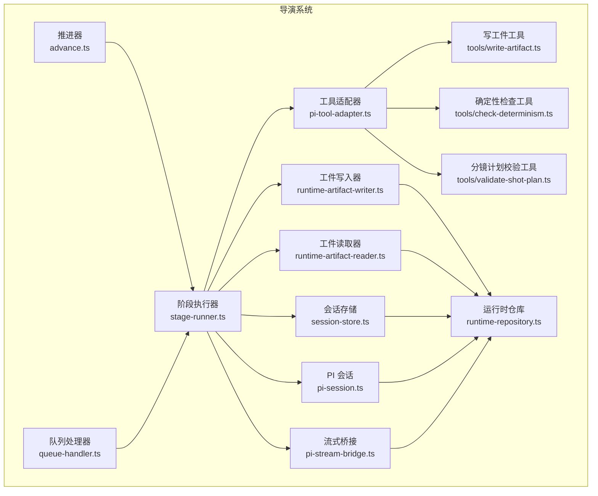
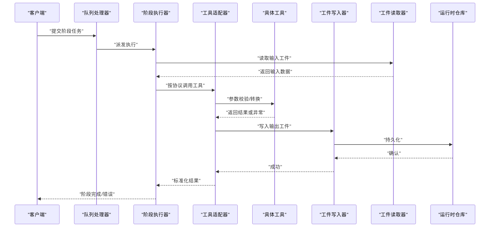
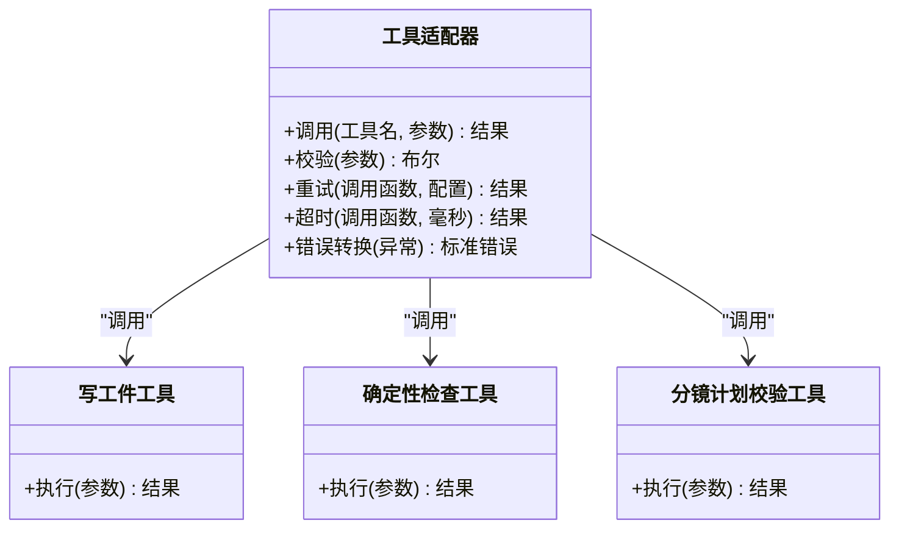
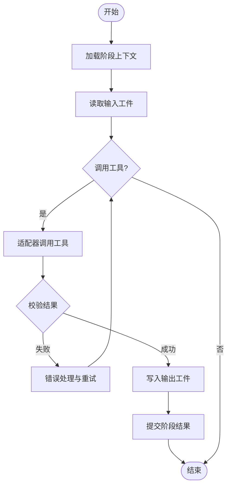
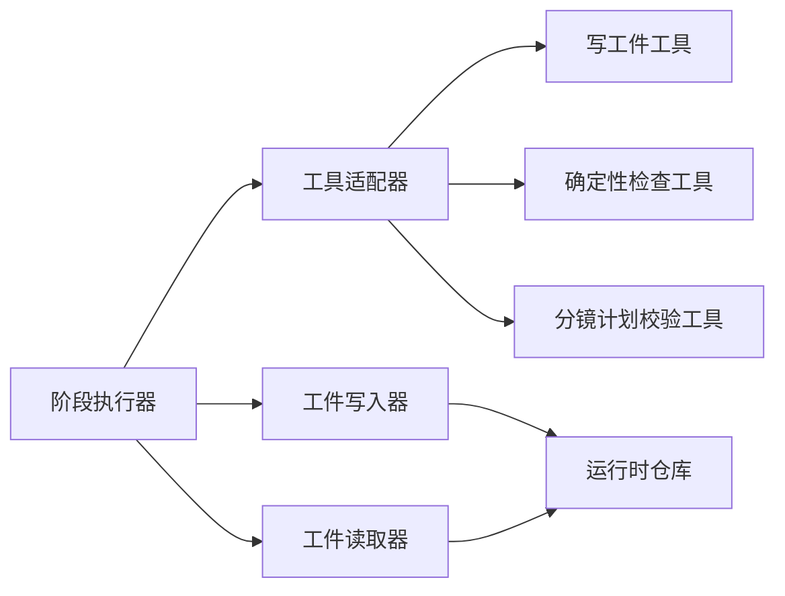

# 工具集成框架

<cite>
**本文引用的文件**   
- [pi-tool-adapter.ts](file://src/features/director/pi-tool-adapter.ts)
- [stage-runner.ts](file://src/features/director/stage-runner.ts)
- [advance.ts](file://src/features/director/advance.ts)
- [queue-handler.ts](file://src/features/director/queue-handler.ts)
- [runtime-artifact-writer.ts](file://src/features/director/runtime-artifact-writer.ts)
- [runtime-artifact-reader.ts](file://src/features/director/runtime-artifact-reader.ts)
- [runtime-repository.ts](file://src/features/director/runtime-repository.ts)
- [session-store.ts](file://src/features/director/session-store.ts)
- [pi-session.ts](file://src/features/director/pi-session.ts)
- [pi-stream-bridge.ts](file://src/features/director/pi-stream-bridge.ts)
- [tools/write-artifact.ts](file://src/features/director/tools/write-artifact.ts)
- [tools/check-determinism.ts](file://src/features/director/tools/check-determinism.ts)
- [tools/validate-shot-plan.ts](file://src/features/director/tools/validate-shot-plan.ts)
- [types.ts](file://src/features/director/types.ts)
- [index.ts](file://src/features/director/index.ts)
</cite>

## 目录
1. [简介](#简介)
2. [项目结构](#项目结构)
3. [核心组件](#核心组件)
4. [架构总览](#架构总览)
5. [详细组件分析](#详细组件分析)
6. [依赖关系分析](#依赖关系分析)
7. [性能考虑](#性能考虑)
8. [故障排查指南](#故障排查指南)
9. [结论](#结论)
10. [附录](#附录)

## 简介
本文件面向“导演系统”的工具集成框架，系统性说明工具的注册机制、调用协议与参数传递方式；解释工具适配器的设计模式（外部 API 封装、错误处理与重试）；文档化工具生命周期管理、资源清理与并发控制；并提供开发新工具、集成第三方服务与处理异步操作的实践指引。同时覆盖测试策略、性能监控与安全注意事项，帮助读者快速上手并稳定扩展。

## 项目结构
导演系统的工具能力集中在 features/director 模块中，围绕“阶段执行器”“会话与状态”“运行时工件读写”“队列与并发”“工具适配器”等关键子系统进行组织。工具实现位于 tools 子目录，通过统一的适配器与调度层接入编排流程。

图表来源
- [stage-runner.ts](file://src/features/director/stage-runner.ts)
- [advance.ts](file://src/features/director/advance.ts)
- [queue-handler.ts](file://src/features/director/queue-handler.ts)
- [pi-tool-adapter.ts](file://src/features/director/pi-tool-adapter.ts)
- [runtime-artifact-writer.ts](file://src/features/director/runtime-artifact-writer.ts)
- [runtime-artifact-reader.ts](file://src/features/director/runtime-artifact-reader.ts)
- [runtime-repository.ts](file://src/features/director/runtime-repository.ts)
- [session-store.ts](file://src/features/director/session-store.ts)
- [pi-session.ts](file://src/features/director/pi-session.ts)
- [pi-stream-bridge.ts](file://src/features/director/pi-stream-bridge.ts)
- [tools/write-artifact.ts](file://src/features/director/tools/write-artifact.ts)
- [tools/check-determinism.ts](file://src/features/director/tools/check-determinism.ts)
- [tools/validate-shot-plan.ts](file://src/features/director/tools/validate-shot-plan.ts)

章节来源
- [index.ts](file://src/features/director/index.ts)
- [types.ts](file://src/features/director/types.ts)

## 核心组件
- 阶段执行器：负责编排阶段任务、协调工具调用、管理上下文与会话、处理结果提交与错误恢复。
- 工具适配器：统一工具调用协议，屏蔽外部差异，提供参数校验、错误转换、重试与超时控制。
- 运行时工件读写：为工具提供稳定的输入输出通道，支持持久化与缓存。
- 会话与状态：维护工具运行所需的上下文、配置与中间状态，保证跨阶段一致性。
- 队列与并发：对工具调用进行限流、排队与并发控制，保障系统稳定性。

章节来源
- [stage-runner.ts](file://src/features/director/stage-runner.ts)
- [pi-tool-adapter.ts](file://src/features/director/pi-tool-adapter.ts)
- [runtime-artifact-writer.ts](file://src/features/director/runtime-artifact-writer.ts)
- [runtime-artifact-reader.ts](file://src/features/director/runtime-artifact-reader.ts)
- [runtime-repository.ts](file://src/features/director/runtime-repository.ts)
- [session-store.ts](file://src/features/director/session-store.ts)
- [queue-handler.ts](file://src/features/director/queue-handler.ts)

## 架构总览
下图展示了从请求进入、阶段编排到工具调用的完整链路，以及数据在工件仓库中的流转。

图表来源
- [queue-handler.ts](file://src/features/director/queue-handler.ts)
- [stage-runner.ts](file://src/features/director/stage-runner.ts)
- [pi-tool-adapter.ts](file://src/features/director/pi-tool-adapter.ts)
- [runtime-artifact-writer.ts](file://src/features/director/runtime-artifact-writer.ts)
- [runtime-artifact-reader.ts](file://src/features/director/runtime-artifact-reader.ts)
- [runtime-repository.ts](file://src/features/director/runtime-repository.ts)

## 详细组件分析

### 工具适配器（pi-tool-adapter.ts）
- 职责：统一工具调用协议、参数校验与转换、错误归一化、重试与超时控制、日志与指标上报。
- 设计要点：
  - 将不同外部 API 的差异抽象为一致的调用接口，便于新增工具时仅关注业务逻辑。
  - 错误处理：捕获网络、鉴权、限流等异常，转换为标准错误类型，附带可观测信息。
  - 重试机制：基于指数退避与最大重试次数，区分可重试与不可重试错误。
  - 超时控制：为每个工具调用设置合理超时，避免阻塞阶段执行。
  - 参数传递：严格遵循工具契约，支持序列化/反序列化的安全边界。

图表来源
- [pi-tool-adapter.ts](file://src/features/director/pi-tool-adapter.ts)
- [tools/write-artifact.ts](file://src/features/director/tools/write-artifact.ts)
- [tools/check-determinism.ts](file://src/features/director/tools/check-determinism.ts)
- [tools/validate-shot-plan.ts](file://src/features/director/tools/validate-shot-plan.ts)

章节来源
- [pi-tool-adapter.ts](file://src/features/director/pi-tool-adapter.ts)

### 阶段执行器（stage-runner.ts）
- 职责：编排阶段任务、管理上下文与会话、协调工具调用、处理结果提交与错误恢复。
- 关键点：
  - 上下文隔离：每阶段拥有独立上下文，避免副作用泄漏。
  - 结果提交流程：工具输出经适配器标准化后，由写入器持久化。
  - 错误恢复：捕获异常并记录诊断信息，必要时回滚部分状态。
  - 并发控制：限制并行度，防止资源争用。

图表来源
- [stage-runner.ts](file://src/features/director/stage-runner.ts)
- [pi-tool-adapter.ts](file://src/features/director/pi-tool-adapter.ts)
- [runtime-artifact-writer.ts](file://src/features/director/runtime-artifact-writer.ts)

章节来源
- [stage-runner.ts](file://src/features/director/stage-runner.ts)

### 推进器（advance.ts）
- 职责：驱动阶段推进、状态机演进、阶段间依赖解析与触发。
- 关键点：
  - 依赖图解析：确保前置阶段完成后才推进当前阶段。
  - 状态同步：与运行时仓库保持一致，支持断点续跑。
  - 事件通知：阶段推进过程中发出事件供监听与审计。

章节来源
- [advance.ts](file://src/features/director/advance.ts)

### 队列处理器（queue-handler.ts）
- 职责：任务入队、出队、并发控制、优先级与重试策略。
- 关键点：
  - 并发限制：按资源类型划分队列，避免热点竞争。
  - 幂等性：支持重复消费时的去重与幂等处理。
  - 背压与降级：在高负载下自动削峰与降级策略。

章节来源
- [queue-handler.ts](file://src/features/director/queue-handler.ts)

### 运行时工件读写（runtime-artifact-writer.ts / runtime-artifact-reader.ts）
- 职责：为工具提供稳定的输入输出通道，支持持久化、缓存与版本管理。
- 关键点：
  - 写入器：原子写入、校验和验证、失败回滚。
  - 读取器：缓存命中优先、按需加载、错误降级。
  - 与仓库交互：事务性操作，保证一致性。

章节来源
- [runtime-artifact-writer.ts](file://src/features/director/runtime-artifact-writer.ts)
- [runtime-artifact-reader.ts](file://src/features/director/runtime-artifact-reader.ts)
- [runtime-repository.ts](file://src/features/director/runtime-repository.ts)

### 会话与状态（session-store.ts / pi-session.ts）
- 职责：维护工具运行上下文、配置与中间状态，保证跨阶段一致性。
- 关键点：
  - 会话隔离：多租户或多实例下的状态隔离。
  - 状态快照：支持阶段性快照与恢复。
  - 安全边界：敏感信息加密存储与访问控制。

章节来源
- [session-store.ts](file://src/features/director/session-store.ts)
- [pi-session.ts](file://src/features/director/pi-session.ts)

### 流式桥接（pi-stream-bridge.ts）
- 职责：对接流式输出，将工具产生的增量数据实时推送给上层。
- 关键点：
  - 背压处理：消费者慢时暂停生产者，避免内存膨胀。
  - 错误恢复：断线重连与数据完整性校验。
  - 兼容层：统一不同流式协议的差异。

章节来源
- [pi-stream-bridge.ts](file://src/features/director/pi-stream-bridge.ts)

### 工具示例与开发指南
- 写工件工具：用于将结构化数据写入运行时工件，确保幂等与校验。
- 确定性检查工具：对输入进行哈希与比较，确保可重现性。
- 分镜计划校验工具：对计划进行规则校验，返回错误与修复建议。

开发新工具步骤：
1. 定义工具契约：输入输出类型、错误码与重试策略。
2. 实现工具逻辑：遵循适配器协议，处理异常与超时。
3. 注册工具：在适配器中声明工具名称与元数据。
4. 编写测试：单元测试覆盖正常路径与异常分支，集成测试验证端到端流程。
5. 上线与监控：开启指标采集与告警，观察延迟与错误率。

章节来源
- [tools/write-artifact.ts](file://src/features/director/tools/write-artifact.ts)
- [tools/check-determinism.ts](file://src/features/director/tools/check-determinism.ts)
- [tools/validate-shot-plan.ts](file://src/features/director/tools/validate-shot-plan.ts)
- [pi-tool-adapter.ts](file://src/features/director/pi-tool-adapter.ts)

## 依赖关系分析
- 低耦合高内聚：工具与执行器通过适配器解耦，便于替换与扩展。
- 明确的数据流向：输入工件→工具处理→输出工件，仓库作为唯一真相源。
- 潜在循环依赖：避免工具直接依赖执行器内部状态，使用注入的上下文对象。

图表来源
- [stage-runner.ts](file://src/features/director/stage-runner.ts)
- [pi-tool-adapter.ts](file://src/features/director/pi-tool-adapter.ts)
- [runtime-artifact-writer.ts](file://src/features/director/runtime-artifact-writer.ts)
- [runtime-artifact-reader.ts](file://src/features/director/runtime-artifact-reader.ts)
- [runtime-repository.ts](file://src/features/director/runtime-repository.ts)

章节来源
- [types.ts](file://src/features/director/types.ts)
- [index.ts](file://src/features/director/index.ts)

## 性能考虑
- 并发控制：按资源类型划分队列，限制并行度，避免热点竞争。
- 缓存策略：读取器优先命中缓存，减少重复计算与 I/O。
- 超时与重试：合理设置超时与退避策略，降低抖动影响。
- 背压处理：流式输出需实现背压，防止内存溢出。
- 指标与追踪：采集延迟、吞吐、错误率与资源使用，定位瓶颈。

## 故障排查指南
- 常见问题：
  - 工具调用超时：检查网络、远端服务健康与超时配置。
  - 参数校验失败：核对工具契约与输入格式。
  - 工件写入失败：检查权限、磁盘空间与事务一致性。
  - 会话状态不一致：查看快照与恢复日志。
- 诊断手段：
  - 启用详细日志与追踪 ID，关联阶段与工具调用。
  - 使用回放与快照对比，定位回归问题。
  - 监控指标阈值告警，提前发现异常。

章节来源
- [pi-tool-adapter.ts](file://src/features/director/pi-tool-adapter.ts)
- [stage-runner.ts](file://src/features/director/stage-runner.ts)
- [runtime-repository.ts](file://src/features/director/runtime-repository.ts)

## 结论
本框架通过统一的工具适配器与清晰的阶段编排，实现了工具的可插拔、可观测与高可靠。借助工件读写与会话管理，保证了数据一致性与状态可恢复。配合队列与并发控制，系统在大规模场景下仍保持稳定。建议在新工具开发中严格遵循契约与测试策略，持续完善监控与告警，以支撑业务的长期演进。

## 附录
- 术语表：
  - 阶段：一个完整的处理单元，包含输入、工具调用与输出。
  - 工件：阶段间传递的结构化数据或文件。
  - 会话：工具运行所需的上下文与配置集合。
- 最佳实践：
  - 工具幂等：确保多次调用结果一致。
  - 错误分类：区分可重试与不可重试错误。
  - 最小权限：仅授予必要资源访问权限。
  - 渐进发布：灰度上线与回滚预案。