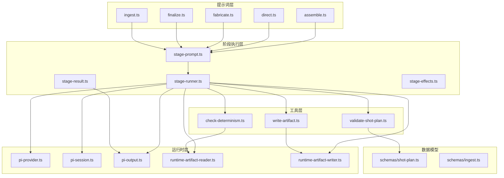
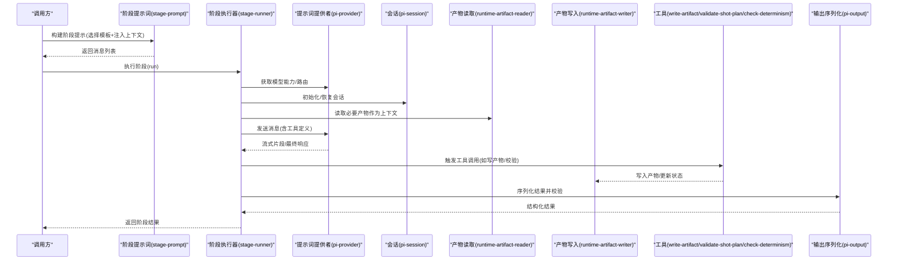
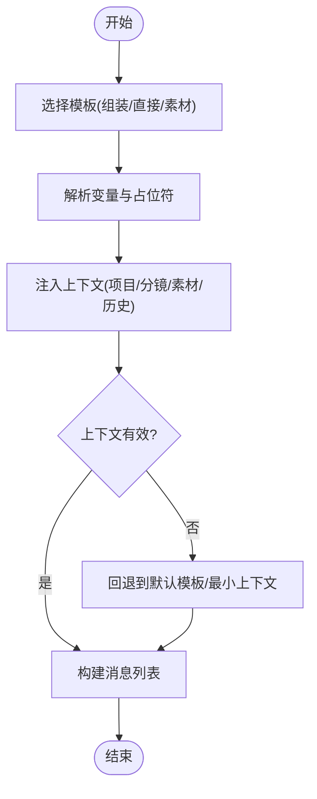
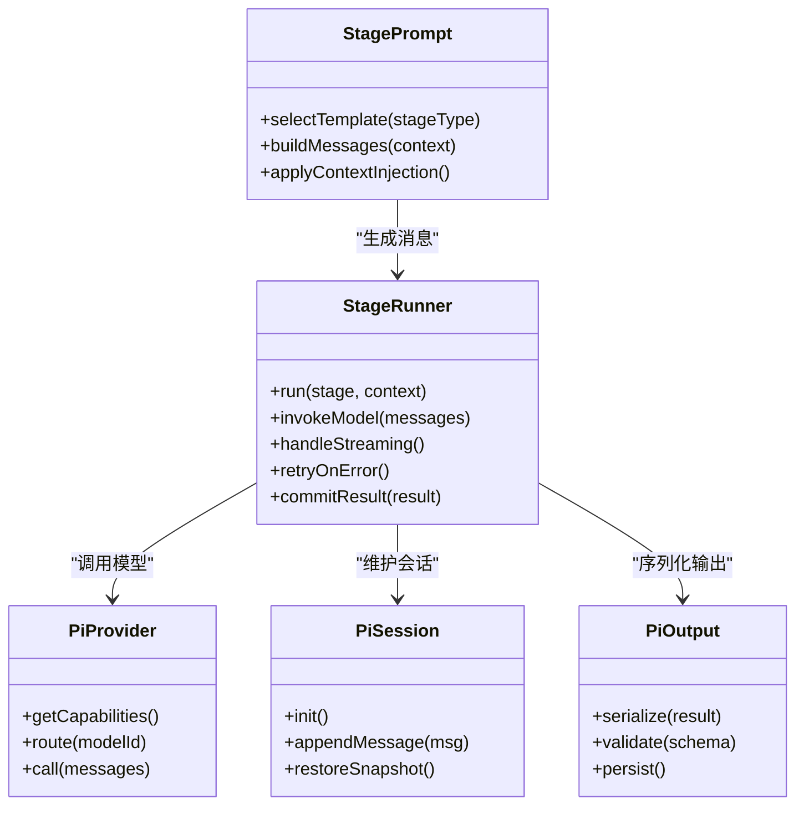
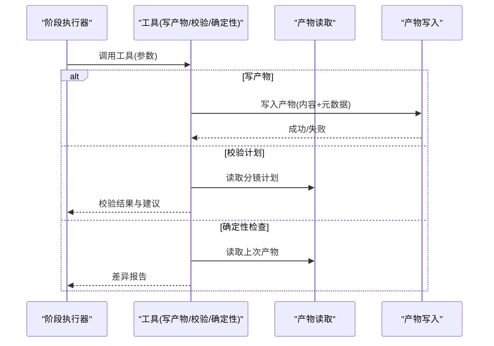
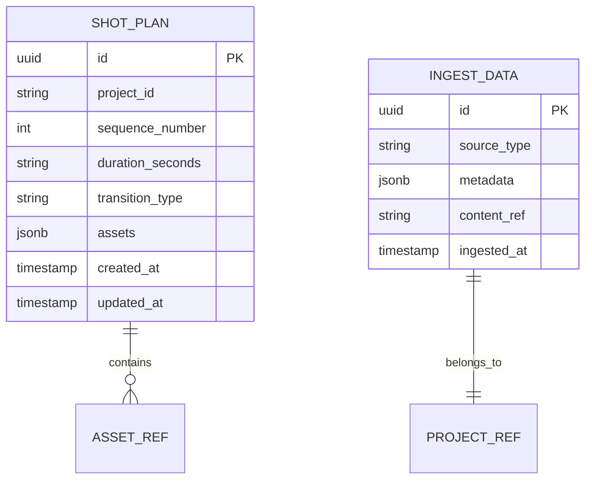
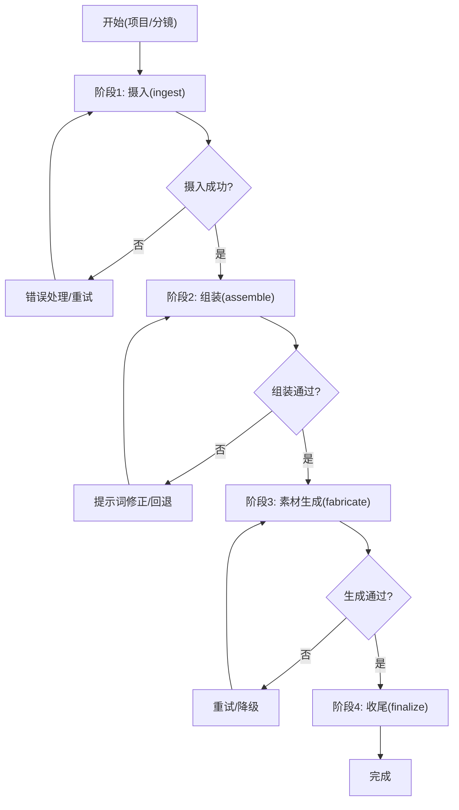
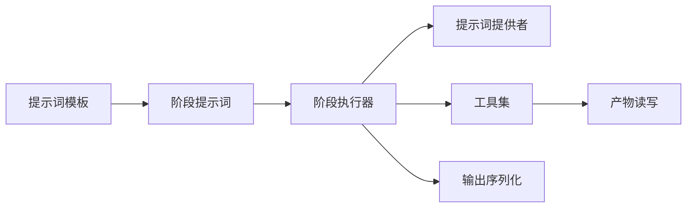

# 提示词工程

<cite>
**本文引用的文件**   
- [src/features/director/prompts/assemble.ts](file://src/features/director/prompts/assemble.ts)
- [src/features/director/prompts/direct.ts](file://src/features/director/prompts/direct.ts)
- [src/features/director/prompts/fabricate.ts](file://src/features/director/prompts/fabricate.ts)
- [src/features/director/prompts/finalize.ts](file://src/features/director/prompts/finalize.ts)
- [src/features/director/prompts/ingest.ts](file://src/features/director/prompts/ingest.ts)
- [src/features/director/prompts/prompts.test.ts](file://src/features/director/prompts/prompts.test.ts)
- [src/features/director/stage-prompt.ts](file://src/features/director/stage-prompt.ts)
- [src/features/director/stage-runner.ts](file://src/features/director/stage-runner.ts)
- [src/features/director/pi-provider.ts](file://src/features/director/pi-provider.ts)
- [src/features/director/pi-session.ts](file://src/features/director/pi-session.ts)
- [src/features/director/pi-output.ts](file://src/features/director/pi-output.ts)
- [src/features/director/pi-tool-adapter.ts](file://src/features/director/pi-tool-adapter.ts)
- [src/features/director/runtime-artifact-reader.ts](file://src/features/director/runtime-artifact-reader.ts)
- [src/features/director/runtime-artifact-writer.ts](file://src/features/director/runtime-artifact-writer.ts)
- [src/features/director/tools/write-artifact.ts](file://src/features/director/tools/write-artifact.ts)
- [src/features/director/tools/check-determinism.ts](file://src/features/director/tools/check-determinism.ts)
- [src/features/director/tools/validate-shot-plan.ts](file://src/features/director/tools/validate-shot-plan.ts)
- [src/features/director/schemas/shot-plan.ts](file://src/features/director/schemas/shot-plan.ts)
- [src/features/director/schemas/ingest.ts](file://src/features/director/schemas/ingest.ts)
- [src/features/director/pipeline.ts](file://src/features/director/pipeline.ts)
- [src/features/director/advance.ts](file://src/features/director/advance.ts)
- [src/features/director/stage-result.ts](file://src/features/director/stage-result.ts)
- [src/features/director/stage-effects.ts](file://src/features/director/stage-effects.ts)
</cite>

## 目录
1. [简介](#简介)
2. [项目结构](#项目结构)
3. [核心组件](#核心组件)
4. [架构总览](#架构总览)
5. [详细组件分析](#详细组件分析)
6. [依赖分析](#依赖分析)
7. [性能考虑](#性能考虑)
8. [故障排查指南](#故障排查指南)
9. [结论](#结论)
10. [附录](#附录)

## 简介
本文件面向“导演系统”的提示词工程，系统化说明模板系统、变量替换与上下文注入机制；梳理不同类型提示词的设计模式（组装提示词、直接指令、素材生成提示词）；并文档化版本管理、A/B 测试与效果评估方法。同时提供高质量提示词的编写示例路径、优化响应质量与处理边界情况的实践，以及调试工具、性能分析与最佳实践指南。

## 项目结构
提示词工程位于 features/director 模块中，围绕“阶段（Stage）—会话（Session）—输出（Output）—工具（Tools）—Schema（校验）”分层组织：
- prompts：提示词模板与类型定义（assemble/direct/fabricate/finalize/ingest）
- stage-*：阶段提示词装配、执行与结果提交
- pi-*：提示词提供者、会话管理与输出序列化
- tools：LLM 可调用的工具（写产物、校验计划、确定性检查等）
- schemas：结构化数据模型与校验（分镜计划、摄入数据等）
- pipeline/advance：流水线编排与阶段推进

图表来源
- [src/features/director/prompts/assemble.ts](file://src/features/director/prompts/assemble.ts)
- [src/features/director/prompts/direct.ts](file://src/features/director/prompts/direct.ts)
- [src/features/director/prompts/fabricate.ts](file://src/features/director/prompts/fabricate.ts)
- [src/features/director/prompts/finalize.ts](file://src/features/director/prompts/finalize.ts)
- [src/features/director/prompts/ingest.ts](file://src/features/director/prompts/ingest.ts)
- [src/features/director/stage-prompt.ts](file://src/features/director/stage-prompt.ts)
- [src/features/director/stage-runner.ts](file://src/features/director/stage-runner.ts)
- [src/features/director/pi-provider.ts](file://src/features/director/pi-provider.ts)
- [src/features/director/pi-session.ts](file://src/features/director/pi-session.ts)
- [src/features/director/pi-output.ts](file://src/features/director/pi-output.ts)
- [src/features/director/runtime-artifact-reader.ts](file://src/features/director/runtime-artifact-reader.ts)
- [src/features/director/runtime-artifact-writer.ts](file://src/features/director/runtime-artifact-writer.ts)
- [src/features/director/tools/write-artifact.ts](file://src/features/director/tools/write-artifact.ts)
- [src/features/director/tools/check-determinism.ts](file://src/features/director/tools/check-determinism.ts)
- [src/features/director/tools/validate-shot-plan.ts](file://src/features/director/tools/validate-shot-plan.ts)
- [src/features/director/schemas/shot-plan.ts](file://src/features/director/schemas/shot-plan.ts)
- [src/features/director/schemas/ingest.ts](file://src/features/director/schemas/ingest.ts)

章节来源
- [src/features/director/prompts/assemble.ts](file://src/features/director/prompts/assemble.ts)
- [src/features/director/prompts/direct.ts](file://src/features/director/prompts/direct.ts)
- [src/features/director/prompts/fabricate.ts](file://src/features/director/prompts/fabricate.ts)
- [src/features/director/prompts/finalize.ts](file://src/features/director/prompts/finalize.ts)
- [src/features/director/prompts/ingest.ts](file://src/features/director/prompts/ingest.ts)
- [src/features/director/stage-prompt.ts](file://src/features/director/stage-prompt.ts)
- [src/features/director/stage-runner.ts](file://src/features/director/stage-runner.ts)
- [src/features/director/pi-provider.ts](file://src/features/director/pi-provider.ts)
- [src/features/director/pi-session.ts](file://src/features/director/pi-session.ts)
- [src/features/director/pi-output.ts](file://src/features/director/pi-output.ts)
- [src/features/director/runtime-artifact-reader.ts](file://src/features/director/runtime-artifact-reader.ts)
- [src/features/director/runtime-artifact-writer.ts](file://src/features/director/runtime-artifact-writer.ts)
- [src/features/director/tools/write-artifact.ts](file://src/features/director/tools/write-artifact.ts)
- [src/features/director/tools/check-determinism.ts](file://src/features/director/tools/check-determinism.ts)
- [src/features/director/tools/validate-shot-plan.ts](file://src/features/director/tools/validate-shot-plan.ts)
- [src/features/director/schemas/shot-plan.ts](file://src/features/director/schemas/shot-plan.ts)
- [src/features/director/schemas/ingest.ts](file://src/features/director/schemas/ingest.ts)

## 核心组件
- 提示词模板与装配器
  - 组装提示词：将多源上下文（项目设定、分镜计划、素材元数据）拼装为统一输入
  - 直接指令：对 LLM 给出明确约束与输出格式要求
  - 素材生成提示词：针对图像/音频/文本等素材生成的专用模板
- 阶段提示词与执行器
  - 阶段提示词：按阶段选择模板、注入上下文、构造消息
  - 阶段执行器：调用模型、流式输出、错误重试、结果落库
- 会话与输出
  - 会话：维护对话历史、工具调用状态、上下文快照
  - 输出：结构化序列化、校验、持久化
- 工具与校验
  - 写产物：将 LLM 产出写入运行时产物存储
  - 校验计划：确保分镜计划符合 Schema
  - 确定性检查：保障可复现性
- 数据模型
  - 分镜计划 Schema：强类型约束与字段校验
  - 摄入数据 Schema：规范输入结构

章节来源
- [src/features/director/prompts/assemble.ts](file://src/features/director/prompts/assemble.ts)
- [src/features/director/prompts/direct.ts](file://src/features/director/prompts/direct.ts)
- [src/features/director/prompts/fabricate.ts](file://src/features/director/prompts/fabricate.ts)
- [src/features/director/prompts/finalize.ts](file://src/features/director/prompts/finalize.ts)
- [src/features/director/prompts/ingest.ts](file://src/features/director/prompts/ingest.ts)
- [src/features/director/stage-prompt.ts](file://src/features/director/stage-prompt.ts)
- [src/features/director/stage-runner.ts](file://src/features/director/stage-runner.ts)
- [src/features/director/pi-session.ts](file://src/features/director/pi-session.ts)
- [src/features/director/pi-output.ts](file://src/features/director/pi-output.ts)
- [src/features/director/tools/write-artifact.ts](file://src/features/director/tools/write-artifact.ts)
- [src/features/director/tools/check-determinism.ts](file://src/features/director/tools/check-determinism.ts)
- [src/features/director/tools/validate-shot-plan.ts](file://src/features/director/tools/validate-shot-plan.ts)
- [src/features/director/schemas/shot-plan.ts](file://src/features/director/schemas/shot-plan.ts)
- [src/features/director/schemas/ingest.ts](file://src/features/director/schemas/ingest.ts)

## 架构总览
下图展示从“阶段提示词装配”到“模型调用与产物落地”的关键流程，包括上下文注入、工具调用与结果校验。

图表来源
- [src/features/director/stage-prompt.ts](file://src/features/director/stage-prompt.ts)
- [src/features/director/stage-runner.ts](file://src/features/director/stage-runner.ts)
- [src/features/director/pi-provider.ts](file://src/features/director/pi-provider.ts)
- [src/features/director/pi-session.ts](file://src/features/director/pi-session.ts)
- [src/features/director/runtime-artifact-reader.ts](file://src/features/director/runtime-artifact-reader.ts)
- [src/features/director/runtime-artifact-writer.ts](file://src/features/director/runtime-artifact-writer.ts)
- [src/features/director/tools/write-artifact.ts](file://src/features/director/tools/write-artifact.ts)
- [src/features/director/tools/validate-shot-plan.ts](file://src/features/director/tools/validate-shot-plan.ts)
- [src/features/director/tools/check-determinism.ts](file://src/features/director/tools/check-determinism.ts)
- [src/features/director/pi-output.ts](file://src/features/director/pi-output.ts)

## 详细组件分析

### 提示词模板系统与变量替换
- 模板分类
  - 组装提示词：聚合项目设定、分镜计划、素材清单，形成统一上下文
  - 直接指令：明确任务目标、约束条件、输出格式
  - 素材生成提示词：针对特定模态（图/音/文）生成指令
- 变量替换机制
  - 通过占位符注入运行时值（如项目 ID、分镜索引、素材 URL、时间码）
  - 支持条件分支与可选段落，避免空值污染
- 上下文注入策略
  - 优先注入“最近 N 条关键消息”和“当前阶段必需产物”
  - 对长上下文进行摘要或裁剪，控制 Token 成本

图表来源
- [src/features/director/prompts/assemble.ts](file://src/features/director/prompts/assemble.ts)
- [src/features/director/prompts/direct.ts](file://src/features/director/prompts/direct.ts)
- [src/features/director/prompts/fabricate.ts](file://src/features/director/prompts/fabricate.ts)
- [src/features/director/prompts/finalize.ts](file://src/features/director/prompts/finalize.ts)
- [src/features/director/prompts/ingest.ts](file://src/features/director/prompts/ingest.ts)

章节来源
- [src/features/director/prompts/assemble.ts](file://src/features/director/prompts/assemble.ts)
- [src/features/director/prompts/direct.ts](file://src/features/director/prompts/direct.ts)
- [src/features/director/prompts/fabricate.ts](file://src/features/director/prompts/fabricate.ts)
- [src/features/director/prompts/finalize.ts](file://src/features/director/prompts/finalize.ts)
- [src/features/director/prompts/ingest.ts](file://src/features/director/prompts/ingest.ts)

### 阶段提示词与执行器
- 阶段提示词
  - 根据阶段类型选择模板，注入上下文，生成消息
  - 支持多轮对话与工具声明
- 阶段执行器
  - 负责会话生命周期、模型调用、流式输出、错误重试
  - 集成产物读写与工具调用，保证结果一致性

图表来源
- [src/features/director/stage-prompt.ts](file://src/features/director/stage-prompt.ts)
- [src/features/director/stage-runner.ts](file://src/features/director/stage-runner.ts)
- [src/features/director/pi-provider.ts](file://src/features/director/pi-provider.ts)
- [src/features/director/pi-session.ts](file://src/features/director/pi-session.ts)
- [src/features/director/pi-output.ts](file://src/features/director/pi-output.ts)

章节来源
- [src/features/director/stage-prompt.ts](file://src/features/director/stage-prompt.ts)
- [src/features/director/stage-runner.ts](file://src/features/director/stage-runner.ts)
- [src/features/director/pi-provider.ts](file://src/features/director/pi-provider.ts)
- [src/features/director/pi-session.ts](file://src/features/director/pi-session.ts)
- [src/features/director/pi-output.ts](file://src/features/director/pi-output.ts)

### 工具与产物管理
- 写产物工具：将 LLM 输出写入运行时产物存储，附带元数据与校验信息
- 校验计划工具：基于 Schema 验证分镜计划，失败时返回修正建议
- 确定性检查工具：对比两次运行结果，确保一致性与可复现

图表来源
- [src/features/director/tools/write-artifact.ts](file://src/features/director/tools/write-artifact.ts)
- [src/features/director/tools/validate-shot-plan.ts](file://src/features/director/tools/validate-shot-plan.ts)
- [src/features/director/tools/check-determinism.ts](file://src/features/director/tools/check-determinism.ts)
- [src/features/director/runtime-artifact-reader.ts](file://src/features/director/runtime-artifact-reader.ts)
- [src/features/director/runtime-artifact-writer.ts](file://src/features/director/runtime-artifact-writer.ts)

章节来源
- [src/features/director/tools/write-artifact.ts](file://src/features/director/tools/write-artifact.ts)
- [src/features/director/tools/validate-shot-plan.ts](file://src/features/director/tools/validate-shot-plan.ts)
- [src/features/director/tools/check-determinism.ts](file://src/features/director/tools/check-determinism.ts)
- [src/features/director/runtime-artifact-reader.ts](file://src/features/director/runtime-artifact-reader.ts)
- [src/features/director/runtime-artifact-writer.ts](file://src/features/director/runtime-artifact-writer.ts)

### 数据模型与校验
- 分镜计划 Schema：定义镜头序列、时长、转场、资源引用等字段及约束
- 摄入数据 Schema：规范输入数据的结构与必填项

图表来源
- [src/features/director/schemas/shot-plan.ts](file://src/features/director/schemas/shot-plan.ts)
- [src/features/director/schemas/ingest.ts](file://src/features/director/schemas/ingest.ts)

章节来源
- [src/features/director/schemas/shot-plan.ts](file://src/features/director/schemas/shot-plan.ts)
- [src/features/director/schemas/ingest.ts](file://src/features/director/schemas/ingest.ts)

### 流水线与阶段推进
- 流水线编排：定义阶段顺序、依赖关系、并行度
- 阶段推进：根据上游结果决定下一步动作，支持回滚与补偿

图表来源
- [src/features/director/pipeline.ts](file://src/features/director/pipeline.ts)
- [src/features/director/advance.ts](file://src/features/director/advance.ts)
- [src/features/director/stage-result.ts](file://src/features/director/stage-result.ts)
- [src/features/director/stage-effects.ts](file://src/features/director/stage-effects.ts)

章节来源
- [src/features/director/pipeline.ts](file://src/features/director/pipeline.ts)
- [src/features/director/advance.ts](file://src/features/director/advance.ts)
- [src/features/director/stage-result.ts](file://src/features/director/stage-result.ts)
- [src/features/director/stage-effects.ts](file://src/features/director/stage-effects.ts)

## 依赖分析
- 内聚与耦合
  - 提示词模板与阶段提示词解耦：模板仅负责内容构造，阶段提示词负责装配与注入
  - 执行器与提供者解耦：通过接口抽象模型能力，便于切换供应商
  - 工具与产物读写解耦：工具只关注业务语义，读写由运行时层实现
- 外部依赖
  - 模型服务：通过提供者路由与能力发现
  - 产物存储：读写分离，支持缓存与校验
- 潜在循环依赖
  - 通过分层与接口隔离避免循环导入

图表来源
- [src/features/director/prompts/assemble.ts](file://src/features/director/prompts/assemble.ts)
- [src/features/director/stage-prompt.ts](file://src/features/director/stage-prompt.ts)
- [src/features/director/stage-runner.ts](file://src/features/director/stage-runner.ts)
- [src/features/director/pi-provider.ts](file://src/features/director/pi-provider.ts)
- [src/features/director/tools/write-artifact.ts](file://src/features/director/tools/write-artifact.ts)
- [src/features/director/runtime-artifact-reader.ts](file://src/features/director/runtime-artifact-reader.ts)
- [src/features/director/runtime-artifact-writer.ts](file://src/features/director/runtime-artifact-writer.ts)
- [src/features/director/pi-output.ts](file://src/features/director/pi-output.ts)

章节来源
- [src/features/director/prompts/assemble.ts](file://src/features/director/prompts/assemble.ts)
- [src/features/director/stage-prompt.ts](file://src/features/director/stage-prompt.ts)
- [src/features/director/stage-runner.ts](file://src/features/director/stage-runner.ts)
- [src/features/director/pi-provider.ts](file://src/features/director/pi-provider.ts)
- [src/features/director/tools/write-artifact.ts](file://src/features/director/tools/write-artifact.ts)
- [src/features/director/runtime-artifact-reader.ts](file://src/features/director/runtime-artifact-reader.ts)
- [src/features/director/runtime-artifact-writer.ts](file://src/features/director/runtime-artifact-writer.ts)
- [src/features/director/pi-output.ts](file://src/features/director/pi-output.ts)

## 性能考虑
- 上下文长度控制
  - 动态裁剪历史消息，保留关键片段
  - 使用摘要压缩长上下文
- 流式输出
  - 降低首字节延迟，提升交互体验
- 重试与熔断
  - 指数退避重试，限制最大重试次数
  - 快速失败，避免雪崩
- 产物缓存
  - 对稳定产物启用缓存，减少重复计算
- 并发与限流
  - 控制阶段并发度，避免过载

[本节为通用指导，不直接分析具体文件]

## 故障排查指南
- 常见错误
  - 上下文缺失：检查产物读取与注入逻辑
  - 模板变量未替换：确认占位符与运行时值映射
  - 校验失败：查看 Schema 校验日志与错误位置
  - 模型调用超时：检查网络与配额，调整重试策略
- 调试工具
  - 确定性检查：对比两次运行产物，定位不稳定因素
  - 产物审计：查看写入内容与元数据是否完整
  - 会话快照：回放对话历史，定位问题阶段

章节来源
- [src/features/director/tools/check-determinism.ts](file://src/features/director/tools/check-determinism.ts)
- [src/features/director/tools/write-artifact.ts](file://src/features/director/tools/write-artifact.ts)
- [src/features/director/pi-session.ts](file://src/features/director/pi-session.ts)
- [src/features/director/pi-output.ts](file://src/features/director/pi-output.ts)

## 结论
本提示词工程以“模板—装配—执行—工具—校验”为核心，实现了高内聚、低耦合的可扩展架构。通过严格的 Schema 校验、产物读写与确定性检查，保障了输出质量与可复现性。配合流式输出、重试与缓存等机制，兼顾性能与稳定性。建议在迭代中持续完善模板库、强化上下文注入策略，并建立 A/B 测试与效果评估体系，持续提升提示词质量与系统表现。

[本节为总结，不直接分析具体文件]

## 附录
- 高质量提示词编写要点
  - 明确目标与约束，限定输出格式
  - 使用结构化上下文，避免冗余信息
  - 对边界情况给出明确处理规则
- 版本管理与 A/B 测试
  - 模板版本化：每个模板带版本号与变更说明
  - A/B 分流：按项目或分镜维度分流不同模板
  - 效果评估：定义指标（通过率、耗时、Token 消耗、人工评分）
- 最佳实践
  - 小步快跑：每次仅改动一处模板，便于定位问题
  - 回归测试：覆盖典型用例与边界用例
  - 监控告警：对异常率、延迟、错误码设置阈值

[本节为通用指导，不直接分析具体文件]