# 状态持久化

<cite>
**本文引用的文件**   
- [session-store.ts](file://src/features/director/session-store.ts)
- [runtime-repository.ts](file://src/features/director/runtime-repository.ts)
- [stage-runner.ts](file://src/features/director/stage-runner.ts)
- [advance.ts](file://src/features/director/advance.ts)
- [output-recovery.ts](file://src/features/director/output-recovery.ts)
- [pi-session.ts](file://src/features/director/pi-session.ts)
- [job-store.ts](file://server/src/server/job-store.ts)
- [job-runner.ts](file://server/src/server/job-runner.ts)
- [persistence.ts](file://src/features/render/persistence.ts)
- [export-service.ts](file://src/features/render/export-service.ts)
- [queue-handler.ts](file://src/features/render/queue-handler.ts)
- [repository.ts](file://src/features/render/repository.ts)
- [drizzle.config.ts](file://drizzle.config.ts)
- [db-migrate.ts](file://scripts/setup/db-migrate.ts)
- [sqlite-backup.ts](file://scripts/migration/sqlite-backup.ts)
- [import-postgres.ts](file://scripts/migration/import-postgres.ts)
- [export-sqlite.ts](file://scripts/migration/export-sqlite.ts)
- [reconcile-postgres.ts](file://scripts/migration/reconcile-postgres.ts)
- [provision-master-key.ts](file://scripts/migration/provision-master-key.ts)
- [streaming-log-card.tsx](file://src/app/products/(app)/canvas/[projectId]/streaming-log-card.tsx)
- [live-status.ts](file://src/app/products/(app)/canvas/[projectId]/live-status.ts)
</cite>

## 目录
1. [简介](#简介)
2. [项目结构](#项目结构)
3. [核心组件](#核心组件)
4. [架构总览](#架构总览)
5. [详细组件分析](#详细组件分析)
6. [依赖关系分析](#依赖关系分析)
7. [性能考量](#性能考量)
8. [故障排查指南](#故障排查指南)
9. [结论](#结论)
10. [附录](#附录)

## 简介
本文件面向导演系统的“状态持久化机制”，覆盖会话存储设计、运行时数据模型与访问接口、快照与增量更新策略、一致性保证、前端锁与并发控制、中断与异常恢复、备份迁移方案以及性能优化建议。文档以代码级为依据，结合架构图、序列图与流程图帮助读者快速理解并正确使用相关能力。

## 项目结构
导演系统状态持久化涉及前后端多个模块：
- 前端（Next.js App Router）通过 API 路由与后端交互，实时展示执行状态与日志。
- 服务端提供作业调度、持久化存储与导出流水线等能力。
- 导演运行时负责阶段推进、会话状态管理、输出恢复与工件读写。
- 渲染子系统负责媒体制品的持久化与导出队列。

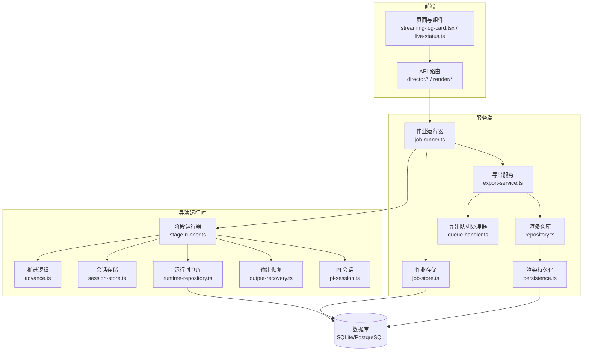

**图示来源** 
- [streaming-log-card.tsx](file://src/app/products/(app)/canvas/[projectId]/streaming-log-card.tsx)
- [live-status.ts](file://src/app/products/(app)/canvas/[projectId]/live-status.ts)
- [job-runner.ts](file://server/src/server/job-runner.ts)
- [job-store.ts](file://server/src/server/job-store.ts)
- [stage-runner.ts](file://src/features/director/stage-runner.ts)
- [advance.ts](file://src/features/director/advance.ts)
- [session-store.ts](file://src/features/director/session-store.ts)
- [runtime-repository.ts](file://src/features/director/runtime-repository.ts)
- [output-recovery.ts](file://src/features/director/output-recovery.ts)
- [pi-session.ts](file://src/features/director/pi-session.ts)
- [repository.ts](file://src/features/render/repository.ts)
- [persistence.ts](file://src/features/render/persistence.ts)
- [queue-handler.ts](file://src/features/render/queue-handler.ts)
- [export-service.ts](file://src/features/render/export-service.ts)

**章节来源**
- [drizzle.config.ts](file://drizzle.config.ts)
- [db-migrate.ts](file://scripts/setup/db-migrate.ts)

## 核心组件
- 会话存储（Session Store）：维护导演会话的生命周期、元数据与关键指针（如当前阶段、游标），支持序列化与恢复。
- 运行时仓库（Runtime Repository）：抽象运行时数据的读写，统一对数据库或缓存的访问，保障事务与一致性。
- 阶段运行器（Stage Runner）：编排阶段的执行、副作用提交与失败回滚，触发快照与增量更新。
- 推进逻辑（Advance）：根据状态机规则决定下一阶段动作，处理分支与合并。
- 输出恢复（Output Recovery）：在进程重启或中断后，基于持久化信息重建执行上下文，避免重复工作。
- PI 会话（PI Session）：封装与外部智能体/工具的会话上下文，确保工具调用幂等与结果可追溯。
- 作业运行器与存储（Job Runner/Store）：将导演任务纳入作业系统，提供持久化的作业状态与重试语义。
- 渲染持久化与仓库（Render Persistence/Repository）：媒体制品的落盘、索引与查询。
- 导出服务与队列（Export Service/Queue Handler）：异步导出任务的调度、去重与进度上报。

**章节来源**
- [session-store.ts](file://src/features/director/session-store.ts)
- [runtime-repository.ts](file://src/features/director/runtime-repository.ts)
- [stage-runner.ts](file://src/features/director/stage-runner.ts)
- [advance.ts](file://src/features/director/advance.ts)
- [output-recovery.ts](file://src/features/director/output-recovery.ts)
- [pi-session.ts](file://src/features/director/pi-session.ts)
- [job-runner.ts](file://server/src/server/job-runner.ts)
- [job-store.ts](file://server/src/server/job-store.ts)
- [persistence.ts](file://src/features/render/persistence.ts)
- [repository.ts](file://src/features/render/repository.ts)
- [export-service.ts](file://src/features/render/export-service.ts)
- [queue-handler.ts](file://src/features/render/queue-handler.ts)

## 架构总览
导演系统采用“运行时状态持久化 + 作业驱动”的混合架构：
- 前端通过 API 发起导演任务，服务端将其入队为作业。
- 作业运行器拉取作业并启动阶段运行器，阶段运行器通过推进逻辑驱动状态机。
- 会话存储与运行时仓库负责状态的快照与增量更新，输出恢复用于崩溃恢复。
- 渲染持久化与导出服务负责媒体制品的写入与导出流程。

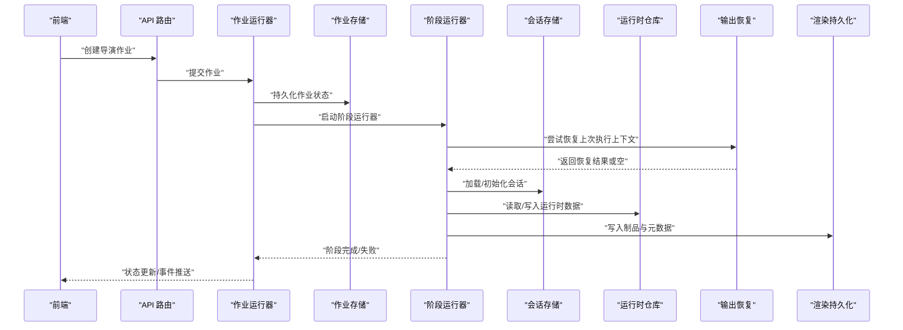

**图示来源** 
- [job-runner.ts](file://server/src/server/job-runner.ts)
- [job-store.ts](file://server/src/server/job-store.ts)
- [stage-runner.ts](file://src/features/director/stage-runner.ts)
- [session-store.ts](file://src/features/director/session-store.ts)
- [runtime-repository.ts](file://src/features/director/runtime-repository.ts)
- [output-recovery.ts](file://src/features/director/output-recovery.ts)
- [persistence.ts](file://src/features/render/persistence.ts)

## 详细组件分析

### 会话存储（Session Store）
- 职责：维护会话生命周期、元数据、阶段指针、检查点与快照；提供序列化/反序列化接口。
- 设计要点：
  - 原子性写入：使用事务或写时复制策略避免部分写入导致的状态不一致。
  - 版本兼容：会话结构变更需带版本号，恢复时进行迁移或降级。
  - 最小化持久化：仅保存必要字段，减少 I/O 压力。
- 典型操作：
  - 初始化会话、加载会话、保存检查点、清理过期会话。

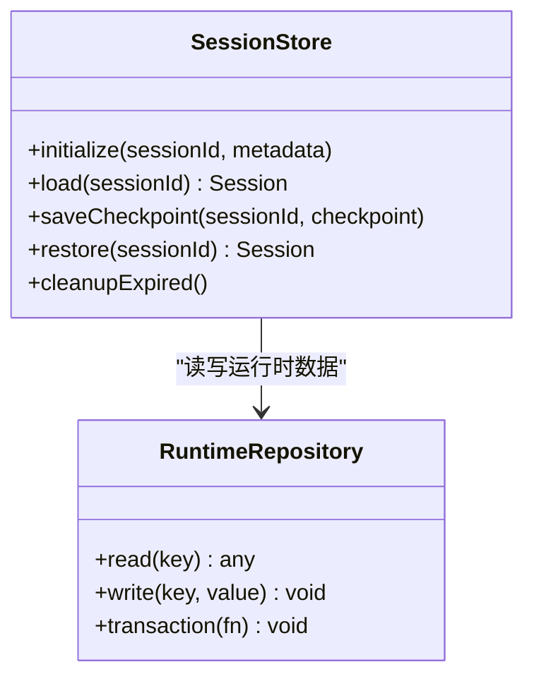

**图示来源** 
- [session-store.ts](file://src/features/director/session-store.ts)
- [runtime-repository.ts](file://src/features/director/runtime-repository.ts)

**章节来源**
- [session-store.ts](file://src/features/director/session-store.ts)
- [runtime-repository.ts](file://src/features/director/runtime-repository.ts)

### 运行时仓库（Runtime Repository）
- 职责：抽象运行时数据的读写，统一事务边界与错误处理。
- 设计要点：
  - 事务封装：所有关键写操作包裹在事务中，失败自动回滚。
  - 幂等写入：通过唯一键或版本号防止重复写入。
  - 批量操作：对高频小写进行批处理，降低锁竞争。
- 典型操作：
  - 读取节点状态、写入阶段结果、批量更新工件索引。

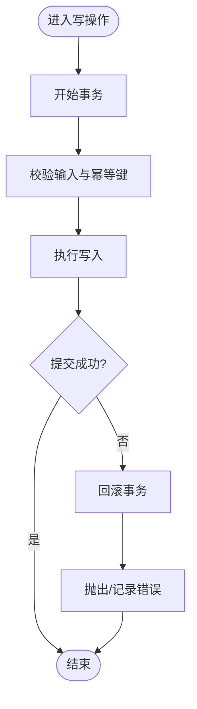

**图示来源** 
- [runtime-repository.ts](file://src/features/director/runtime-repository.ts)

**章节来源**
- [runtime-repository.ts](file://src/features/director/runtime-repository.ts)

### 阶段运行器（Stage Runner）与推进逻辑（Advance）
- 职责：编排阶段执行、副作用提交、失败回滚；依据状态机推进到下一阶段。
- 设计要点：
  - 阶段幂等：同一阶段多次执行应产生相同结果。
  - 副作用隔离：副作用在事务内提交，失败则整体回滚。
  - 推进决策：advance 模块根据当前状态与约束计算下一步动作。
- 典型操作：
  - 执行阶段、捕获异常、提交结果、触发下游阶段。

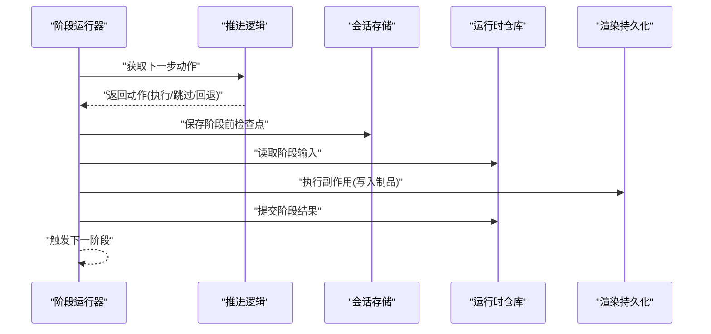

**图示来源** 
- [stage-runner.ts](file://src/features/director/stage-runner.ts)
- [advance.ts](file://src/features/director/advance.ts)
- [session-store.ts](file://src/features/director/session-store.ts)
- [runtime-repository.ts](file://src/features/director/runtime-repository.ts)
- [persistence.ts](file://src/features/render/persistence.ts)

**章节来源**
- [stage-runner.ts](file://src/features/director/stage-runner.ts)
- [advance.ts](file://src/features/director/advance.ts)

### 输出恢复（Output Recovery）
- 职责：在进程重启或中断后，基于持久化信息重建执行上下文，避免重复工作。
- 设计要点：
  - 检查点扫描：识别最近一次成功检查点。
  - 差异恢复：仅恢复未完成阶段与缺失工件。
  - 一致性校验：恢复后验证状态机一致性与工件完整性。
- 典型操作：
  - 扫描检查点、重建会话、校验工件、标记待修复项。

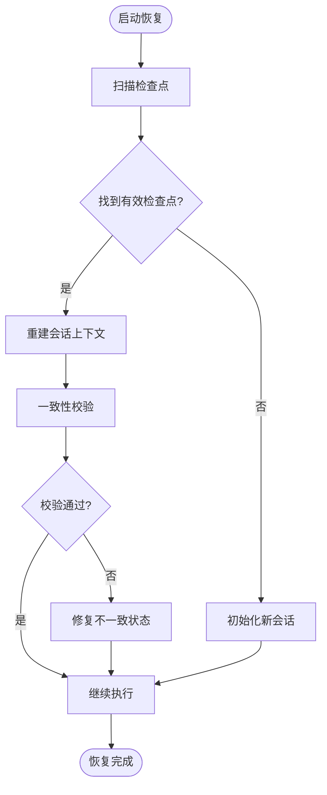

**图示来源** 
- [output-recovery.ts](file://src/features/director/output-recovery.ts)

**章节来源**
- [output-recovery.ts](file://src/features/director/output-recovery.ts)

### PI 会话（PI Session）
- 职责：封装与外部智能体/工具的会话上下文，确保工具调用幂等与结果可追溯。
- 设计要点：
  - 会话隔离：每个导演任务拥有独立会话。
  - 调用追踪：记录工具调用链路与返回值。
  - 超时与重试：对外部依赖设置超时与重试策略。
- 典型操作：
  - 创建会话、调用工具、记录结果、关闭会话。

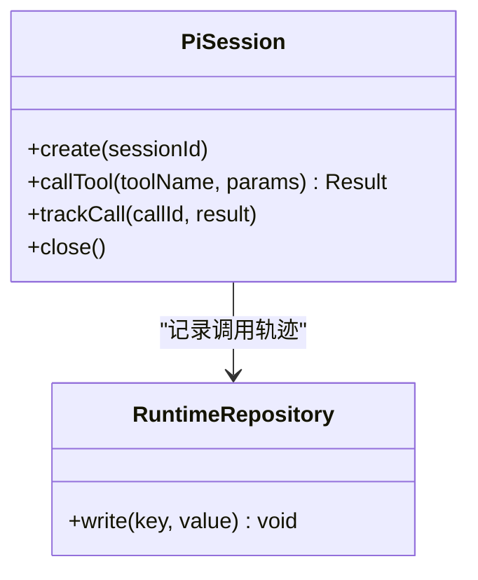

**图示来源** 
- [pi-session.ts](file://src/features/director/pi-session.ts)
- [runtime-repository.ts](file://src/features/director/runtime-repository.ts)

**章节来源**
- [pi-session.ts](file://src/features/director/pi-session.ts)

### 作业运行器与存储（Job Runner/Store）
- 职责：将导演任务纳入作业系统，提供持久化的作业状态、重试与取消语义。
- 设计要点：
  - 作业状态机：Pending/Running/Succeeded/Failed/Canceled。
  - 幂等消费：同一作业只执行一次。
  - 优先级与限流：支持优先级队列与并发限制。
- 典型操作：
  - 提交作业、拉取作业、更新状态、重试失败作业。

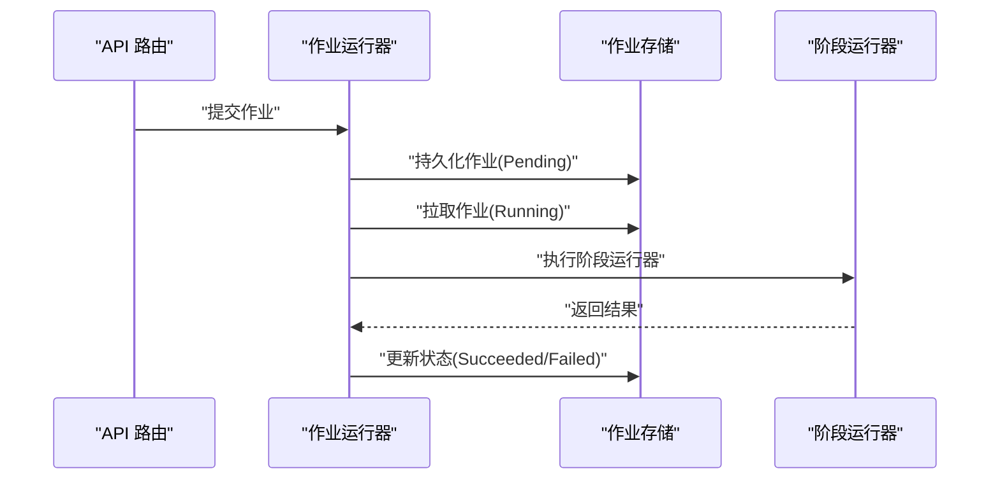

**图示来源** 
- [job-runner.ts](file://server/src/server/job-runner.ts)
- [job-store.ts](file://server/src/server/job-store.ts)
- [stage-runner.ts](file://src/features/director/stage-runner.ts)

**章节来源**
- [job-runner.ts](file://server/src/server/job-runner.ts)
- [job-store.ts](file://server/src/server/job-store.ts)

### 渲染持久化与仓库（Render Persistence/Repository）
- 职责：媒体制品的落盘、索引与查询，保障制品完整性与可恢复性。
- 设计要点：
  - 原子写入：先写临时文件，成功后再重命名。
  - 元数据同步：制品与元数据在同一事务中提交。
  - 分块上传：大文件分块上传与断点续传。
- 典型操作：
  - 写入制品、更新索引、删除废弃制品、查询制品元数据。

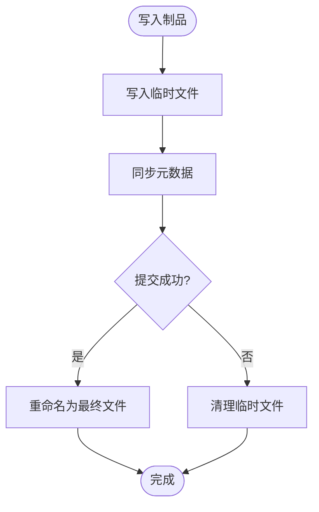

**图示来源** 
- [persistence.ts](file://src/features/render/persistence.ts)
- [repository.ts](file://src/features/render/repository.ts)

**章节来源**
- [persistence.ts](file://src/features/render/persistence.ts)
- [repository.ts](file://src/features/render/repository.ts)

### 导出服务与队列（Export Service/Queue Handler）
- 职责：异步导出任务的调度、去重与进度上报。
- 设计要点：
  - 任务去重：基于输入指纹生成唯一任务 ID。
  - 进度上报：通过事件通道向前端推送进度。
  - 失败重试：指数退避与最大重试次数。
- 典型操作：
  - 提交导出任务、监听进度、完成回调、失败处理。

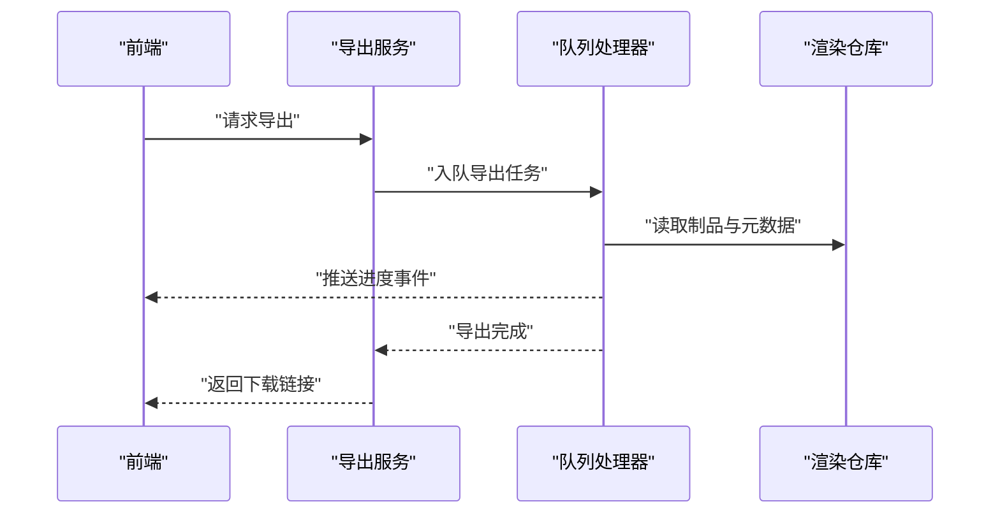

**图示来源** 
- [export-service.ts](file://src/features/render/export-service.ts)
- [queue-handler.ts](file://src/features/render/queue-handler.ts)
- [repository.ts](file://src/features/render/repository.ts)

**章节来源**
- [export-service.ts](file://src/features/render/export-service.ts)
- [queue-handler.ts](file://src/features/render/queue-handler.ts)

## 依赖关系分析
- 低耦合高内聚：各模块通过明确接口交互，减少直接依赖。
- 事务边界清晰：运行时仓库与持久化层统一处理事务。
- 外部依赖隔离：PI 会话与外部工具调用通过适配器隔离。
- 潜在循环依赖：需避免 stage-runner 与 advance 之间的循环引用。

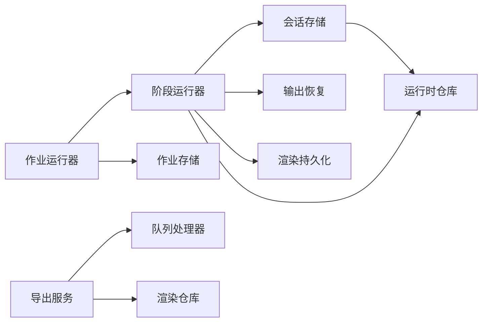

**图示来源** 
- [session-store.ts](file://src/features/director/session-store.ts)
- [runtime-repository.ts](file://src/features/director/runtime-repository.ts)
- [stage-runner.ts](file://src/features/director/stage-runner.ts)
- [output-recovery.ts](file://src/features/director/output-recovery.ts)
- [persistence.ts](file://src/features/render/persistence.ts)
- [job-runner.ts](file://server/src/server/job-runner.ts)
- [job-store.ts](file://server/src/server/job-store.ts)
- [export-service.ts](file://src/features/render/export-service.ts)
- [queue-handler.ts](file://src/features/render/queue-handler.ts)
- [repository.ts](file://src/features/render/repository.ts)

**章节来源**
- [session-store.ts](file://src/features/director/session-store.ts)
- [runtime-repository.ts](file://src/features/director/runtime-repository.ts)
- [stage-runner.ts](file://src/features/director/stage-runner.ts)
- [output-recovery.ts](file://src/features/director/output-recovery.ts)
- [persistence.ts](file://src/features/render/persistence.ts)
- [job-runner.ts](file://server/src/server/job-runner.ts)
- [job-store.ts](file://server/src/server/job-store.ts)
- [export-service.ts](file://src/features/render/export-service.ts)
- [queue-handler.ts](file://src/features/render/queue-handler.ts)
- [repository.ts](file://src/features/render/repository.ts)

## 性能考量
- 批量写入：合并频繁的小写操作，减少锁竞争与 I/O 开销。
- 连接池：数据库连接复用，避免频繁建立连接。
- 缓存热点：对读多写少的元数据使用内存缓存。
- 异步处理：耗时操作（如导出、转码）放入队列异步执行。
- 分片与分页：大数据集操作采用分片与分页，避免一次性加载。

## 故障排查指南
- 常见问题：
  - 状态不一致：检查事务是否完整提交，确认幂等键是否正确。
  - 恢复失败：验证检查点完整性，确认恢复逻辑的版本兼容性。
  - 死锁预防：避免长事务与跨表锁顺序不一致。
  - 性能瓶颈：监控 I/O 与 CPU 使用率，定位热点路径。
- 调试技巧：
  - 启用详细日志，记录关键步骤与异常堆栈。
  - 使用快照对比工具，定位状态差异。
  - 模拟故障注入，验证恢复与重试逻辑。

**章节来源**
- [streaming-log-card.tsx](file://src/app/products/(app)/canvas/[projectId]/streaming-log-card.tsx)
- [live-status.ts](file://src/app/products/(app)/canvas/[projectId]/live-status.ts)

## 结论
导演系统的状态持久化机制通过会话存储、运行时仓库、阶段运行器与输出恢复等组件协同工作，实现了可靠的快照与增量更新、一致的事务边界与高效的并发控制。结合作业系统与导出服务，系统具备强大的容错与扩展能力。通过合理的备份迁移策略与性能优化，可进一步提升系统的稳定性与吞吐。

## 附录

### 数据模型与访问接口
- 会话模型：包含会话 ID、元数据、阶段指针、检查点与快照。
- 运行时模型：包含节点状态、工件索引、阶段结果与事务元数据。
- 作业模型：包含作业 ID、状态、优先级、重试计数与错误信息。
- 制品模型：包含文件路径、大小、哈希值、元数据与关联关系。

### 备份策略与迁移方案
- 定期备份：每日全量备份与每小时增量备份。
- 在线迁移：使用双写与灰度切换，确保零停机迁移。
- 数据校验：备份后执行一致性校验，确保数据完整性。
- 回滚预案：保留旧版本数据，支持快速回滚。

**章节来源**
- [sqlite-backup.ts](file://scripts/migration/sqlite-backup.ts)
- [import-postgres.ts](file://scripts/migration/import-postgres.ts)
- [export-sqlite.ts](file://scripts/migration/export-sqlite.ts)
- [reconcile-postgres.ts](file://scripts/migration/reconcile-postgres.ts)
- [provision-master-key.ts](file://scripts/migration/provision-master-key.ts)
- [db-migrate.ts](file://scripts/setup/db-migrate.ts)
- [drizzle.config.ts](file://drizzle.config.ts)

### 代码示例路径
- 保存执行状态：参考 [session-store.ts](file://src/features/director/session-store.ts)、[runtime-repository.ts](file://src/features/director/runtime-repository.ts)。
- 恢复执行状态：参考 [output-recovery.ts](file://src/features/director/output-recovery.ts)、[stage-runner.ts](file://src/features/director/stage-runner.ts)。
- 处理中断与异常：参考 [advance.ts](file://src/features/director/advance.ts)、[job-runner.ts](file://server/src/server/job-runner.ts)。
- 数据备份与迁移：参考 [sqlite-backup.ts](file://scripts/migration/sqlite-backup.ts)、[import-postgres.ts](file://scripts/migration/import-postgres.ts)、[db-migrate.ts](file://scripts/setup/db-migrate.ts)。