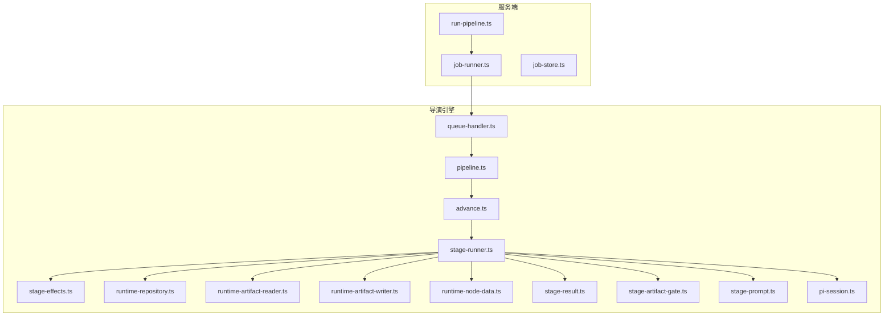
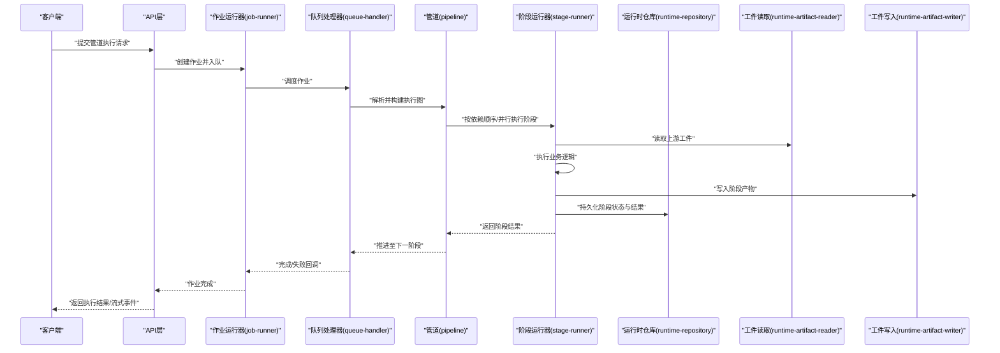
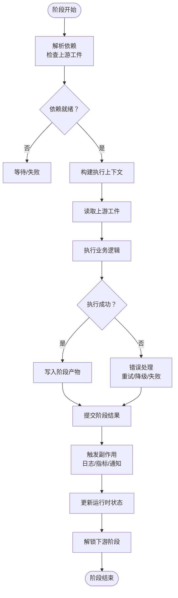
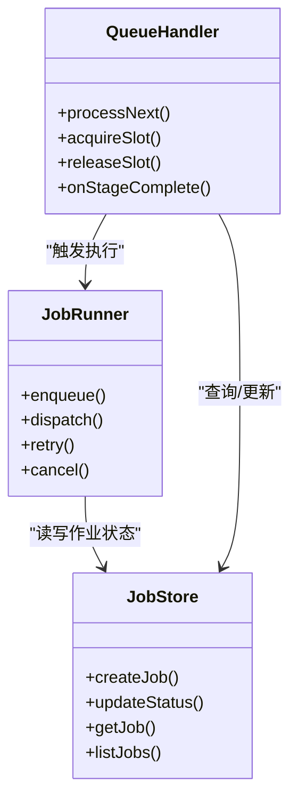
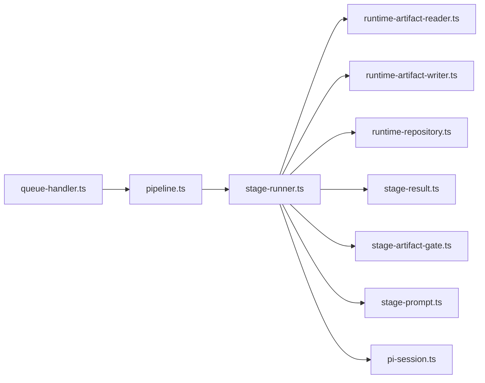

# 管道执行引擎

<cite>
**本文档引用的文件**   
- [pipeline.ts](file://src/features/director/pipeline.ts)
- [stage-runner.ts](file://src/features/director/stage-runner.ts)
- [queue-handler.ts](file://src/features/director/queue-handler.ts)
- [runtime-repository.ts](file://src/features/director/runtime-repository.ts)
- [stage-result.ts](file://src/features/director/stage-result.ts)
- [stage-effects.ts](file://src/features/director/stage-effects.ts)
- [advance.ts](file://src/features/director/advance.ts)
- [pi-session.ts](file://src/features/director/pi-session.ts)
- [pi-provider.ts](file://src/features/director/pi-provider.ts)
- [runtime-artifact-reader.ts](file://src/features/director/runtime-artifact-reader.ts)
- [runtime-artifact-writer.ts](file://src/features/director/runtime-artifact-writer.ts)
- [runtime-node-data.ts](file://src/features/director/runtime-node-data.ts)
- [stage-prompt.ts](file://src/features/director/stage-prompt.ts)
- [stage-artifact-gate.ts](file://src/features/director/stage-artifact-gate.ts)
- [job-runner.ts](file://server/src/server/job-runner.ts)
- [job-store.ts](file://server/src/server/job-store.ts)
- [run-pipeline.ts](file://server/src/compose/run-pipeline.ts)
</cite>

## 目录
1. [简介](#简介)
2. [项目结构](#项目结构)
3. [核心组件](#核心组件)
4. [架构总览](#架构总览)
5. [详细组件分析](#详细组件分析)
6. [依赖关系分析](#依赖关系分析)
7. [性能考量](#性能考量)
8. [故障排查指南](#故障排查指南)
9. [结论](#结论)
10. [附录](#附录)

## 简介
本文件面向导演系统的“管道执行引擎”，系统性阐述工作流管道的定义、阶段编排与执行流程，深入解析阶段运行器的实现机制（依赖解析、并行执行、错误处理、状态管理），并文档化管道生命周期管理、任务调度策略与资源分配。同时提供新增管道阶段的实践方法、执行参数配置与异常处理示例，以及性能优化技巧、监控指标与调试方法，帮助读者快速掌握并高效扩展该引擎。

## 项目结构
围绕管道执行引擎的核心代码主要分布在以下模块：
- 管道编排与执行：pipeline.ts、advance.ts
- 阶段运行器与副作用：stage-runner.ts、stage-effects.ts
- 运行时工件读写与节点数据：runtime-artifact-reader.ts、runtime-artifact-writer.ts、runtime-node-data.ts
- 阶段结果与门控：stage-result.ts、stage-artifact-gate.ts
- 会话与提示：pi-session.ts、stage-prompt.ts
- 队列与作业调度：queue-handler.ts、job-runner.ts、job-store.ts
- 服务端入口与流水线调用：run-pipeline.ts
- 运行时持久化：runtime-repository.ts

图表来源
- [run-pipeline.ts](file://server/src/compose/run-pipeline.ts)
- [job-runner.ts](file://server/src/server/job-runner.ts)
- [job-store.ts](file://server/src/server/job-store.ts)
- [pipeline.ts](file://src/features/director/pipeline.ts)
- [advance.ts](file://src/features/director/advance.ts)
- [stage-runner.ts](file://src/features/director/stage-runner.ts)
- [stage-effects.ts](file://src/features/director/stage-effects.ts)
- [runtime-repository.ts](file://src/features/director/runtime-repository.ts)
- [runtime-artifact-reader.ts](file://src/features/director/runtime-artifact-reader.ts)
- [runtime-artifact-writer.ts](file://src/features/director/runtime-artifact-writer.ts)
- [runtime-node-data.ts](file://src/features/director/runtime-node-data.ts)
- [stage-result.ts](file://src/features/director/stage-result.ts)
- [stage-artifact-gate.ts](file://src/features/director/stage-artifact-gate.ts)
- [stage-prompt.ts](file://src/features/director/stage-prompt.ts)
- [pi-session.ts](file://src/features/director/pi-session.ts)
- [queue-handler.ts](file://src/features/director/queue-handler.ts)

章节来源
- [pipeline.ts](file://src/features/director/pipeline.ts)
- [stage-runner.ts](file://src/features/director/stage-runner.ts)
- [queue-handler.ts](file://src/features/director/queue-handler.ts)
- [runtime-repository.ts](file://src/features/director/runtime-repository.ts)
- [stage-result.ts](file://src/features/director/stage-result.ts)
- [stage-effects.ts](file://src/features/director/stage-effects.ts)
- [advance.ts](file://src/features/director/advance.ts)
- [pi-session.ts](file://src/features/director/pi-session.ts)
- [pi-provider.ts](file://src/features/director/pi-provider.ts)
- [runtime-artifact-reader.ts](file://src/features/director/runtime-artifact-reader.ts)
- [runtime-artifact-writer.ts](file://src/features/director/runtime-artifact-writer.ts)
- [runtime-node-data.ts](file://src/features/director/runtime-node-data.ts)
- [stage-prompt.ts](file://src/features/director/stage-prompt.ts)
- [stage-artifact-gate.ts](file://src/features/director/stage-artifact-gate.ts)
- [job-runner.ts](file://server/src/server/job-runner.ts)
- [job-store.ts](file://server/src/server/job-store.ts)
- [run-pipeline.ts](file://server/src/compose/run-pipeline.ts)

## 核心组件
- 管道定义与编排：负责声明阶段序列、依赖关系、输入输出契约与执行约束。
- 阶段运行器：解析依赖、准备上下文、读取工件、执行阶段逻辑、写入结果、触发副作用、更新状态。
- 队列与作业调度：将管道实例化为作业，进行并发控制、重试、优先级与资源配额。
- 运行时仓库：持久化阶段状态、工件元数据、进度与审计信息。
- 工件门控：基于上游产物可用性决定下游阶段是否可执行。
- 会话与提示：为 AI 驱动的阶段提供会话管理与提示模板。
- 结果提交：统一封装阶段成功/失败结果，支持回滚或补偿。

章节来源
- [pipeline.ts](file://src/features/director/pipeline.ts)
- [stage-runner.ts](file://src/features/director/stage-runner.ts)
- [queue-handler.ts](file://src/features/director/queue-handler.ts)
- [runtime-repository.ts](file://src/features/director/runtime-repository.ts)
- [stage-artifact-gate.ts](file://src/features/director/stage-artifact-gate.ts)
- [pi-session.ts](file://src/features/director/pi-session.ts)
- [stage-result.ts](file://src/features/director/stage-result.ts)

## 架构总览
下图展示了从请求进入服务端到管道执行的端到端流程，包括作业入队、调度、阶段运行、工件读写、状态持久化与结果返回。

图表来源
- [job-runner.ts](file://server/src/server/job-runner.ts)
- [queue-handler.ts](file://src/features/director/queue-handler.ts)
- [pipeline.ts](file://src/features/director/pipeline.ts)
- [stage-runner.ts](file://src/features/director/stage-runner.ts)
- [runtime-repository.ts](file://src/features/director/runtime-repository.ts)
- [runtime-artifact-reader.ts](file://src/features/director/runtime-artifact-reader.ts)
- [runtime-artifact-writer.ts](file://src/features/director/runtime-artifact-writer.ts)

## 详细组件分析

### 管道定义与编排（pipeline.ts）
- 职责：声明阶段列表、阶段间依赖、输入输出类型、执行约束（如最大并行度、超时）。
- 关键点：
  - 阶段拓扑构建：根据依赖生成有向无环图（DAG），用于后续调度。
  - 执行策略：支持串行、分组并行、条件分支等模式。
  - 校验：在启动前对阶段输入/输出契约进行静态检查。
- 扩展点：新增阶段只需注册阶段元数据与执行函数，并在依赖图中声明上下游关系。

章节来源
- [pipeline.ts](file://src/features/director/pipeline.ts)

### 阶段运行器（stage-runner.ts）
- 职责：单个阶段的完整生命周期执行，包括依赖解析、上下文装配、工件读取、业务执行、副作用触发、结果提交与状态更新。
- 关键流程：
  - 依赖解析：检查上游阶段产物是否就绪，必要时等待或报错。
  - 上下文装配：合并环境变量、配置、会话信息与工件句柄。
  - 执行与容错：支持重试、超时、取消；捕获异常并转换为标准失败结果。
  - 副作用：日志、指标上报、外部系统通知。
  - 结果提交：通过 stage-result 统一封装成功/失败，并触发下游解锁。
- 并发模型：在同一管道内，满足依赖的多个阶段可并行执行，受全局与阶段级并发限制。

图表来源
- [stage-runner.ts](file://src/features/director/stage-runner.ts)
- [stage-result.ts](file://src/features/director/stage-result.ts)
- [stage-effects.ts](file://src/features/director/stage-effects.ts)
- [runtime-artifact-reader.ts](file://src/features/director/runtime-artifact-reader.ts)
- [runtime-artifact-writer.ts](file://src/features/director/runtime-artifact-writer.ts)
- [runtime-repository.ts](file://src/features/director/runtime-repository.ts)

章节来源
- [stage-runner.ts](file://src/features/director/stage-runner.ts)
- [stage-result.ts](file://src/features/director/stage-result.ts)
- [stage-effects.ts](file://src/features/director/stage-effects.ts)
- [runtime-artifact-reader.ts](file://src/features/director/runtime-artifact-reader.ts)
- [runtime-artifact-writer.ts](file://src/features/director/runtime-artifact-writer.ts)
- [runtime-repository.ts](file://src/features/director/runtime-repository.ts)

### 队列与作业调度（queue-handler.ts、job-runner.ts、job-store.ts）
- 职责：将管道实例化为作业，维护作业状态机（待处理、运行中、完成、失败），并提供并发控制、重试与优先级。
- 关键点：
  - 作业入队：接收来自 API 的请求，生成唯一作业 ID 并持久化初始状态。
  - 调度策略：基于资源池与阶段权重动态分配执行槽位，避免热点阻塞。
  - 重试与退避：指数退避、最大重试次数、幂等性保障。
  - 资源隔离：按项目/用户维度限制并发，防止资源争用。
- 与管道集成：队列处理器驱动 pipeline 的推进，阶段完成后回调以继续调度。

图表来源
- [job-store.ts](file://server/src/server/job-store.ts)
- [job-runner.ts](file://server/src/server/job-runner.ts)
- [queue-handler.ts](file://src/features/director/queue-handler.ts)

章节来源
- [queue-handler.ts](file://src/features/director/queue-handler.ts)
- [job-runner.ts](file://server/src/server/job-runner.ts)
- [job-store.ts](file://server/src/server/job-store.ts)

### 运行时工件与节点数据（runtime-artifact-reader.ts、runtime-artifact-writer.ts、runtime-node-data.ts）
- 工件读取：按阶段依赖拉取上游产物，支持缓存、校验与版本一致性检查。
- 工件写入：原子写入、事务性提交、失败回滚与一致性保证。
- 节点数据：描述阶段输入/输出 schema、默认值、转换规则与校验约束。

章节来源
- [runtime-artifact-reader.ts](file://src/features/director/runtime-artifact-reader.ts)
- [runtime-artifact-writer.ts](file://src/features/director/runtime-artifact-writer.ts)
- [runtime-node-data.ts](file://src/features/director/runtime-node-data.ts)

### 阶段结果与门控（stage-result.ts、stage-artifact-gate.ts）
- 结果封装：统一表示成功/失败/跳过，携带元数据（耗时、大小、哈希）、追踪 ID 与诊断信息。
- 工件门控：基于上游工件存在性与完整性判定下游阶段是否可执行，支持条件门控与阈值门控。

章节来源
- [stage-result.ts](file://src/features/director/stage-result.ts)
- [stage-artifact-gate.ts](file://src/features/director/stage-artifact-gate.ts)

### 会话与提示（pi-session.ts、stage-prompt.ts）
- 会话管理：维护 AI 驱动的上下文、历史消息与工具调用状态。
- 提示模板：为不同阶段提供结构化提示，支持变量注入与格式校验。

章节来源
- [pi-session.ts](file://src/features/director/pi-session.ts)
- [stage-prompt.ts](file://src/features/director/stage-prompt.ts)

### 推进与状态机（advance.ts）
- 职责：根据当前阶段结果推进管道状态，计算下一批可执行阶段集合，处理分支与汇聚。
- 关键点：
  - 状态推进：从“运行中”到“完成/失败/暂停”的状态迁移。
  - 依赖收敛：当所有上游阶段完成后，自动解锁下游。
  - 条件分支：根据阶段输出决定后续路径。

章节来源
- [advance.ts](file://src/features/director/advance.ts)

### 服务端入口与流水线调用（run-pipeline.ts）
- 职责：对外暴露执行接口，接收请求参数，初始化管道实例，协调作业调度与结果返回。
- 关键点：
  - 参数校验：确保输入符合 schema。
  - 生命周期：创建、启动、监控、清理。
  - 流式反馈：将阶段事件推送给前端或消费者。

章节来源
- [run-pipeline.ts](file://server/src/compose/run-pipeline.ts)

## 依赖关系分析
- 松耦合设计：阶段运行器通过抽象接口访问工件读写与仓库，便于替换实现。
- 明确边界：队列层与执行层分离，调度与业务逻辑解耦。
- 潜在循环依赖：需避免阶段间直接引用，应通过工件与门控间接通信。
- 外部依赖：数据库、对象存储、AI 服务、消息队列等通过适配器接入。

图表来源
- [queue-handler.ts](file://src/features/director/queue-handler.ts)
- [pipeline.ts](file://src/features/director/pipeline.ts)
- [stage-runner.ts](file://src/features/director/stage-runner.ts)
- [runtime-artifact-reader.ts](file://src/features/director/runtime-artifact-reader.ts)
- [runtime-artifact-writer.ts](file://src/features/director/runtime-artifact-writer.ts)
- [runtime-repository.ts](file://src/features/director/runtime-repository.ts)
- [stage-result.ts](file://src/features/director/stage-result.ts)
- [stage-artifact-gate.ts](file://src/features/director/stage-artifact-gate.ts)
- [stage-prompt.ts](file://src/features/director/stage-prompt.ts)
- [pi-session.ts](file://src/features/director/pi-session.ts)

章节来源
- [pipeline.ts](file://src/features/director/pipeline.ts)
- [stage-runner.ts](file://src/features/director/stage-runner.ts)
- [queue-handler.ts](file://src/features/director/queue-handler.ts)

## 性能考量
- 并行度控制：合理设置全局与阶段级并发上限，避免 CPU/IO 饱和。
- 工件缓存：对只读工件启用本地/分布式缓存，减少重复 IO。
- 批处理：合并小工件写入，降低锁竞争与网络开销。
- 背压与限流：在高负载下对上游生产者限速，保护下游。
- 资源隔离：按租户/项目划分资源池，避免噪声邻居影响。
- 监控指标：阶段耗时、成功率、重试率、工件大小、队列长度、吞吐与延迟分位数。
- 调试方法：开启详细日志、采样追踪、阶段快照与回放、慢查询分析。

[本节为通用指导，不直接分析具体文件]

## 故障排查指南
- 常见问题：
  - 依赖未就绪：检查上游阶段状态与工件完整性。
  - 工件写入失败：确认权限、空间与原子提交策略。
  - 阶段超时：调整超时阈值或优化执行逻辑。
  - 队列积压：扩容执行槽位或优化阶段耗时。
- 定位步骤：
  - 查看运行时仓库中的阶段状态与错误码。
  - 检索阶段日志与追踪 ID，定位失败点。
  - 使用工件门控诊断上游产物缺失原因。
  - 通过会话与提示模板验证 AI 阶段输入是否正确。
- 恢复策略：
  - 重试与退避：针对瞬时错误自动重试。
  - 补偿与回滚：对已生效副作用进行反向操作。
  - 降级执行：在部分依赖不可用时走替代路径。

章节来源
- [runtime-repository.ts](file://src/features/director/runtime-repository.ts)
- [stage-result.ts](file://src/features/director/stage-result.ts)
- [stage-artifact-gate.ts](file://src/features/director/stage-artifact-gate.ts)
- [stage-effects.ts](file://src/features/director/stage-effects.ts)

## 结论
管道执行引擎通过清晰的阶段编排、健壮的运行器实现与完善的调度机制，提供了可扩展、高性能且易调试的工作流执行能力。借助工件门控、会话与提示、结果提交与副作用体系，系统能够灵活适配多种业务场景。建议在生产环境中结合监控指标与调试工具持续优化，确保稳定性与效率。

[本节为总结性内容，不直接分析具体文件]

## 附录
- 新增管道阶段实践要点：
  - 定义阶段元数据：名称、版本、输入/输出 schema、默认参数。
  - 实现执行函数：读取工件、执行业务、写入产物、抛出标准化错误。
  - 注册依赖：在 DAG 中声明上下游关系与条件。
  - 配置执行参数：并发、超时、重试、资源配额。
  - 异常处理：捕获并分类错误，记录诊断信息，触发补偿。
- 参考实现路径：
  - 阶段运行器：[stage-runner.ts](file://src/features/director/stage-runner.ts)
  - 工件读写：[runtime-artifact-reader.ts](file://src/features/director/runtime-artifact-reader.ts)、[runtime-artifact-writer.ts](file://src/features/director/runtime-artifact-writer.ts)
  - 结果提交：[stage-result.ts](file://src/features/director/stage-result.ts)
  - 副作用与指标：[stage-effects.ts](file://src/features/director/stage-effects.ts)
  - 队列与调度：[queue-handler.ts](file://src/features/director/queue-handler.ts)、[job-runner.ts](file://server/src/server/job-runner.ts)
  - 运行时仓库：[runtime-repository.ts](file://src/features/director/runtime-repository.ts)

[本节为补充说明，不直接分析具体文件]