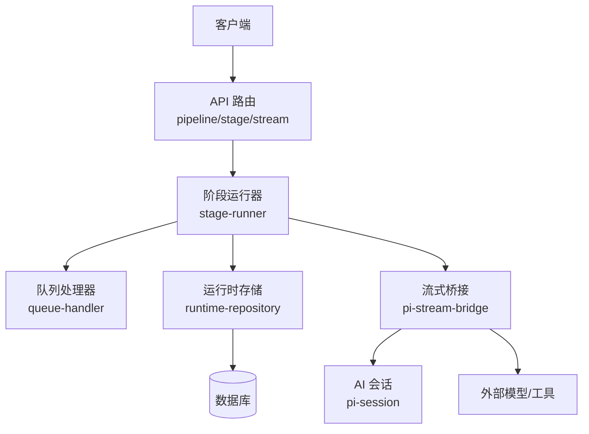
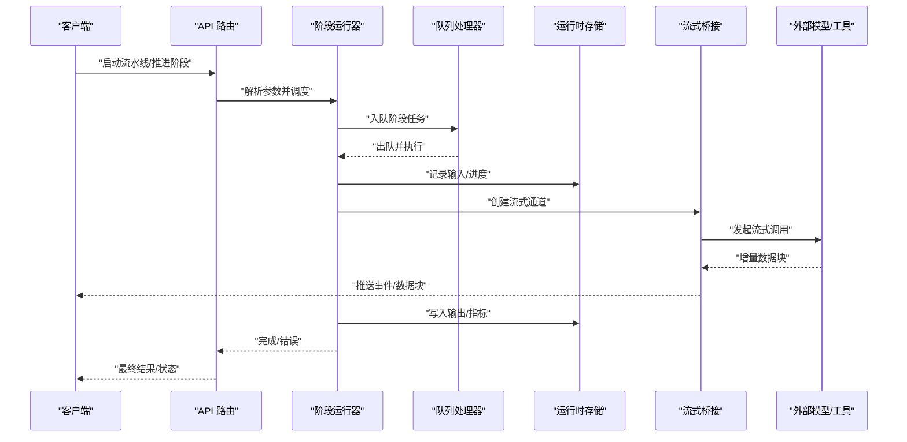
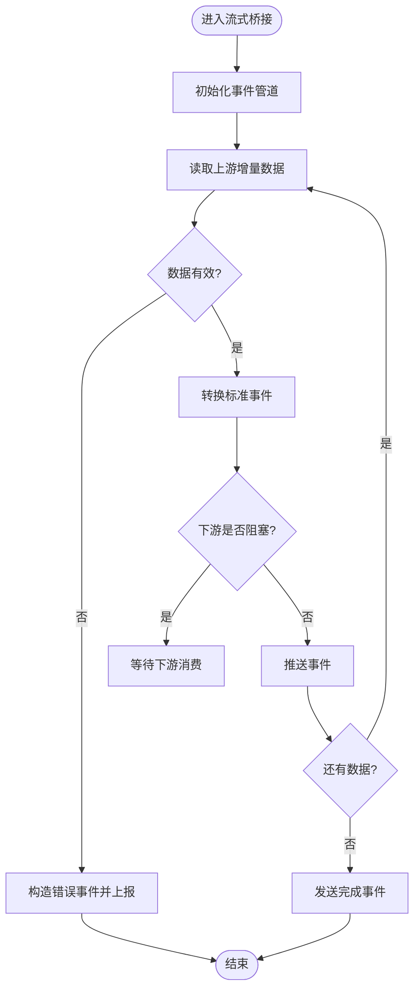
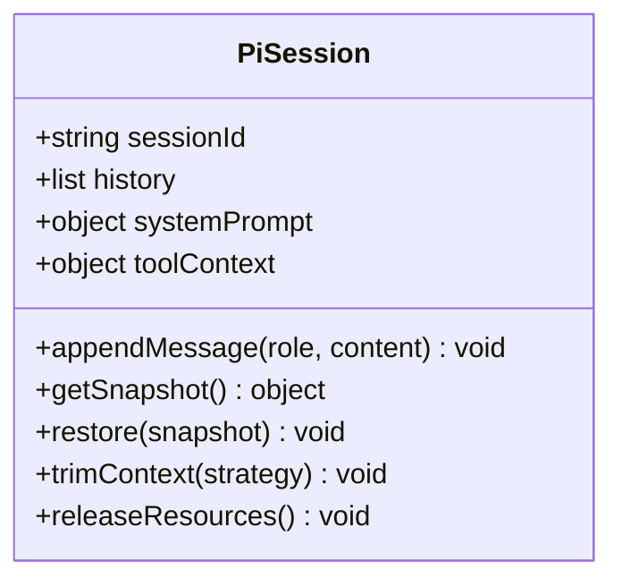
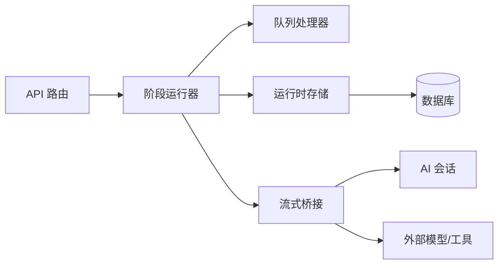

# 计费与流式处理

<cite>
**本文引用的文件**   
- [server/src/index.ts](file://server/src/index.ts)
- [server/src/server/api.ts](file://server/src/server/api.ts)
- [server/src/server/job-runner.ts](file://server/src/server/job-runner.ts)
- [server/src/server/job-store.ts](file://server/src/server/job-store.ts)
- [src/app/api/director/pipeline/route.ts](file://src/app/api/director/pipeline/route.ts)
- [src/app/api/director/stage/route.ts](file://src/app/api/director/stage/route.ts)
- [src/app/api/director/stream/[nodeId]/route.ts](file://src/app/api/director/stream/[nodeId]/route.ts)
- [src/app/api/director/stream/project/[projectId]/route.ts](file://src/app/api/director/stream/project/[projectId]/route.ts)
- [src/features/director/pi-stream-bridge.ts](file://src/features/director/pi-stream-bridge.ts)
- [src/features/director/pi-session.ts](file://src/features/director/pi-session.ts)
- [src/features/director/runtime-repository.ts](file://src/features/director/runtime-repository.ts)
- [src/features/director/advance.ts](file://src/features/director/advance.ts)
- [src/features/director/stage-runner.ts](file://src/features/director/stage-runner.ts)
- [src/features/director/queue-handler.ts](file://src/features/director/queue-handler.ts)
- [src/lib/stream/index.ts](file://src/lib/stream/index.ts)
- [src/lib/queue/index.ts](file://src/lib/queue/index.ts)
</cite>

## 目录
1. [简介](#简介)
2. [项目结构](#项目结构)
3. [核心组件](#核心组件)
4. [架构总览](#架构总览)
5. [详细组件分析](#详细组件分析)
6. [依赖关系分析](#依赖关系分析)
7. [性能考虑](#性能考虑)
8. [故障排查指南](#故障排查指南)
9. [结论](#结论)
10. [附录](#附录)

## 简介
本文件面向导演系统的“计费与流式处理”能力，聚焦以下目标：
- 实时计费机制：用量统计、成本计算与账单生成的实现思路与落地要点。
- 流式处理管道：消息流、事件分发与状态同步的端到端流程。
- AI 会话管理：会话生命周期、上下文维护与资源清理策略。
- 实践示例：流式响应、断线重连与内存优化的具体做法（以代码路径引用为主）。
- 准确性与可观测性：计费准确性验证、性能监控与常见故障排查方法。

说明：本项目未包含显式的计费模块或定价表；计费通常通过外部服务或后续扩展实现。本文在现有流式与任务执行基础上，给出可扩展的计费接入方案与最佳实践。

## 项目结构
围绕计费与流式处理的关键位置如下：
- API 路由层：提供导演流水线、阶段控制与流式输出接口。
- 流式桥接与会话：负责将上游模型/工具流式输出桥接到下游，并维护会话上下文。
- 运行时存储：持久化阶段结果、进度与指标，为计费与审计提供数据源。
- 任务调度与队列：编排阶段执行、并发控制与重试。
- 通用库：流式工具与队列抽象，便于复用与扩展。

图表来源 
- [src/app/api/director/pipeline/route.ts](file://src/app/api/director/pipeline/route.ts)
- [src/app/api/director/stage/route.ts](file://src/app/api/director/stage/route.ts)
- [src/app/api/director/stream/[nodeId]/route.ts](file://src/app/api/director/stream/[nodeId]/route.ts)
- [src/features/director/stage-runner.ts](file://src/features/director/stage-runner.ts)
- [src/features/director/queue-handler.ts](file://src/features/director/queue-handler.ts)
- [src/features/director/runtime-repository.ts](file://src/features/director/runtime-repository.ts)
- [src/features/director/pi-stream-bridge.ts](file://src/features/director/pi-stream-bridge.ts)
- [src/features/director/pi-session.ts](file://src/features/director/pi-session.ts)

章节来源
- [server/src/index.ts](file://server/src/index.ts)
- [server/src/server/api.ts](file://server/src/server/api.ts)
- [server/src/server/job-runner.ts](file://server/src/server/job-runner.ts)
- [server/src/server/job-store.ts](file://server/src/server/job-store.ts)

## 核心组件
- 流式桥接（pi-stream-bridge）：将模型/工具的增量输出转换为统一的事件流，支持背压与错误传播。
- AI 会话（pi-session）：维护对话历史、系统提示与工具调用上下文，支持上下文裁剪与快照恢复。
- 运行时存储（runtime-repository）：持久化阶段输入/输出、中间产物、进度与指标，作为计费与审计的数据源。
- 阶段运行器（stage-runner）：编排阶段执行、参数校验、副作用提交与失败回滚。
- 队列处理器（queue-handler）：任务入队、出队、重试与并发控制，保障吞吐与稳定性。
- API 路由（pipeline/stage/stream）：对外暴露流水线启动、阶段推进与流式输出通道。

章节来源
- [src/features/director/pi-stream-bridge.ts](file://src/features/director/pi-stream-bridge.ts)
- [src/features/director/pi-session.ts](file://src/features/director/pi-session.ts)
- [src/features/director/runtime-repository.ts](file://src/features/director/runtime-repository.ts)
- [src/features/director/stage-runner.ts](file://src/features/director/stage-runner.ts)
- [src/features/director/queue-handler.ts](file://src/features/director/queue-handler.ts)
- [src/app/api/director/pipeline/route.ts](file://src/app/api/director/pipeline/route.ts)
- [src/app/api/director/stage/route.ts](file://src/app/api/director/stage/route.ts)
- [src/app/api/director/stream/[nodeId]/route.ts](file://src/app/api/director/stream/[nodeId]/route.ts)

## 架构总览
下图展示从请求到流式输出的关键路径，以及可用于计费的埋点位置。

图表来源 
- [src/app/api/director/pipeline/route.ts](file://src/app/api/director/pipeline/route.ts)
- [src/app/api/director/stage/route.ts](file://src/app/api/director/stage/route.ts)
- [src/app/api/director/stream/[nodeId]/route.ts](file://src/app/api/director/stream/[nodeId]/route.ts)
- [src/features/director/stage-runner.ts](file://src/features/director/stage-runner.ts)
- [src/features/director/queue-handler.ts](file://src/features/director/queue-handler.ts)
- [src/features/director/runtime-repository.ts](file://src/features/director/runtime-repository.ts)
- [src/features/director/pi-stream-bridge.ts](file://src/features/director/pi-stream-bridge.ts)

## 详细组件分析

### 流式桥接与事件分发（pi-stream-bridge）
职责与行为
- 将上游模型的增量输出封装为标准事件（如 token、usage、error、done），并向下推送到客户端。
- 支持背压控制，避免下游消费慢导致内存膨胀。
- 对异常进行捕获与上报，保证管道健壮性。

关键设计点
- 事件类型与载荷定义需稳定，便于计费侧按事件粒度统计。
- 使用缓冲与节流策略，平衡延迟与吞吐。
- 与会话上下文解耦，仅关注数据流转发与错误传播。

图表来源 
- [src/features/director/pi-stream-bridge.ts](file://src/features/director/pi-stream-bridge.ts)

章节来源
- [src/features/director/pi-stream-bridge.ts](file://src/features/director/pi-stream-bridge.ts)

### AI 会话管理（pi-session）
职责与行为
- 维护会话历史、系统提示、工具调用上下文与用户偏好。
- 支持上下文裁剪（滑动窗口/摘要）、快照保存与恢复。
- 提供会话级限流与配额检查入口（可与计费联动）。

关键设计点
- 会话状态应可序列化，便于跨进程/节点迁移。
- 上下文裁剪策略需兼顾质量与成本（减少长上下文带来的高成本）。
- 会话销毁时需释放资源（临时文件、连接等）。

图表来源 
- [src/features/director/pi-session.ts](file://src/features/director/pi-session.ts)

章节来源
- [src/features/director/pi-session.ts](file://src/features/director/pi-session.ts)

### 运行时存储与指标（runtime-repository）
职责与行为
- 持久化阶段输入、输出、中间产物、进度与指标。
- 提供查询接口用于审计、回溯与计费对账。

关键设计点
- 指标字段需包含时间戳、阶段ID、节点ID、事件类型与计数。
- 写入操作应幂等，避免重复计费。
- 批量写入与事务边界需明确，确保一致性。

章节来源
- [src/features/director/runtime-repository.ts](file://src/features/director/runtime-repository.ts)

### 阶段运行器与队列（stage-runner / queue-handler）
职责与行为
- 阶段运行器：参数校验、副作用提交、失败回滚、指标上报。
- 队列处理器：任务入队/出队、重试、并发控制、死信队列。

关键设计点
- 阶段执行需原子化，成功则提交，失败则回滚并记录原因。
- 队列需支持优先级与速率限制，防止雪崩。
- 与运行时存储紧密协作，确保状态一致。

章节来源
- [src/features/director/stage-runner.ts](file://src/features/director/stage-runner.ts)
- [src/features/director/queue-handler.ts](file://src/features/director/queue-handler.ts)

### API 路由与流式输出（pipeline/stage/stream）
职责与行为
- pipeline：启动流水线，创建会话与任务。
- stage：推进特定阶段，返回状态或错误。
- stream：建立 SSE/WebSocket 通道，推送增量事件。

关键设计点
- 流式接口需支持断线重连（携带 lastEventId）。
- 鉴权与租户隔离需在路由层完成。
- 流式响应需设置合适的超时与心跳。

章节来源
- [src/app/api/director/pipeline/route.ts](file://src/app/api/director/pipeline/route.ts)
- [src/app/api/director/stage/route.ts](file://src/app/api/director/stage/route.ts)
- [src/app/api/director/stream/[nodeId]/route.ts](file://src/app/api/director/stream/[nodeId]/route.ts)
- [src/app/api/director/stream/project/[projectId]/route.ts](file://src/app/api/director/stream/project/[projectId]/route.ts)

## 依赖关系分析
组件间依赖与耦合关系如下：

图表来源 
- [src/app/api/director/pipeline/route.ts](file://src/app/api/director/pipeline/route.ts)
- [src/app/api/director/stage/route.ts](file://src/app/api/director/stage/route.ts)
- [src/app/api/director/stream/[nodeId]/route.ts](file://src/app/api/director/stream/[nodeId]/route.ts)
- [src/features/director/stage-runner.ts](file://src/features/director/stage-runner.ts)
- [src/features/director/queue-handler.ts](file://src/features/director/queue-handler.ts)
- [src/features/director/runtime-repository.ts](file://src/features/director/runtime-repository.ts)
- [src/features/director/pi-stream-bridge.ts](file://src/features/director/pi-stream-bridge.ts)
- [src/features/director/pi-session.ts](file://src/features/director/pi-session.ts)

章节来源
- [src/lib/stream/index.ts](file://src/lib/stream/index.ts)
- [src/lib/queue/index.ts](file://src/lib/queue/index.ts)

## 性能考虑
- 流式背压：在桥接层实现缓冲上限与消费者驱动拉取，避免内存峰值。
- 上下文裁剪：采用滑动窗口或摘要压缩，降低大上下文导致的延迟与成本。
- 批量写入：合并运行时指标写入，减少数据库往返。
- 连接复用：与外部模型/工具的连接池与超时配置，避免频繁握手。
- 并发控制：队列层级限流与分片，防止热点阶段造成拥塞。

## 故障排查指南
常见问题与定位步骤
- 流式中断：检查网络心跳、lastEventId 重连逻辑与服务器端事件缓存。
- 计费偏差：核对事件粒度、去重键与幂等写入；比对上游用量与本地指标。
- 内存泄漏：监控堆增长，定位未释放的会话上下文与缓冲区。
- 阶段卡住：查看队列堆积、锁竞争与外部依赖超时。
- 数据不一致：检查事务边界与回滚逻辑，确认副作用提交顺序。

建议的可观测性埋点
- 事件维度：阶段ID、节点ID、事件类型、时间戳、字节数/token数。
- 资源维度：CPU/内存、队列长度、外部调用耗时与错误率。
- 业务维度：租户ID、会话ID、阶段状态、重试次数。

## 结论
当前代码库提供了完善的流式处理与任务编排基础，具备扩展计费的天然条件。建议在以下方面优先落地：
- 在桥接层与运行时存储中增加用量指标采集与去重。
- 引入外部计费服务或内部计费模块，基于事件与指标生成账单。
- 完善会话上下文管理与资源清理，提升稳定性与成本可控性。
- 强化可观测性与对账能力，确保计费准确性与可追溯性。

## 附录

### 计费准确性验证清单
- 事件粒度与计费单位对齐（token/时长/调用次数）。
- 幂等写入与去重键（会话+阶段+事件序列号）。
- 抽样对账与差异告警（上游 vs 本地指标）。
- 失败重试不重复计费（幂等键覆盖）。

### 流式响应与断线重连实践要点
- 服务端：SSE/WebSocket 心跳、事件缓存窗口、错误码规范。
- 客户端：lastEventId 重连、指数退避、最大重试次数。
- 传输层：压缩与分片策略，避免小包风暴。

### 内存优化建议
- 限制单次事件大小与缓冲上限。
- 及时释放会话上下文与临时文件。
- 使用流式读写替代全量加载。