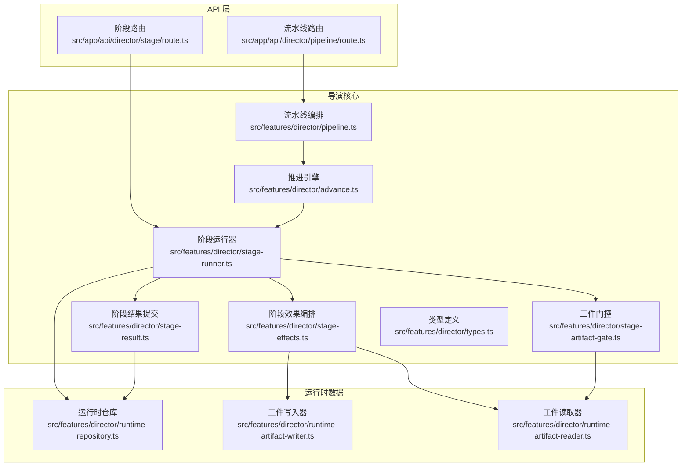
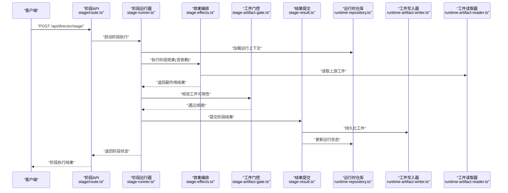
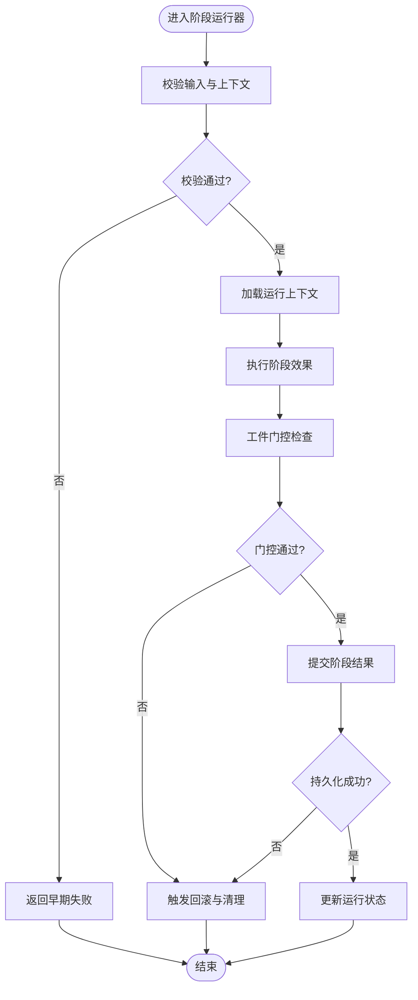
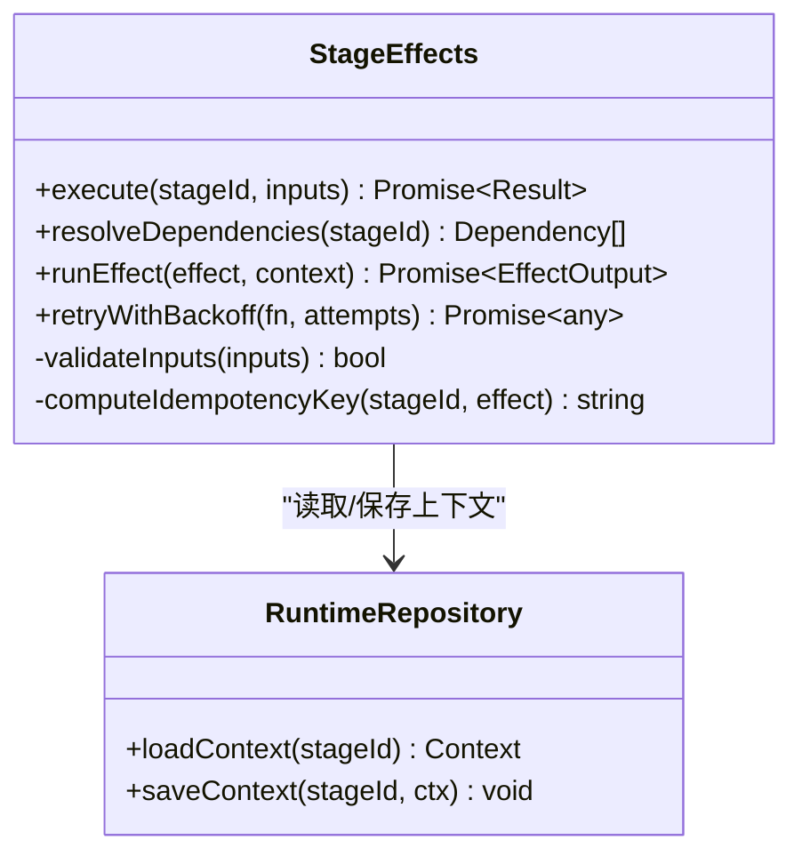
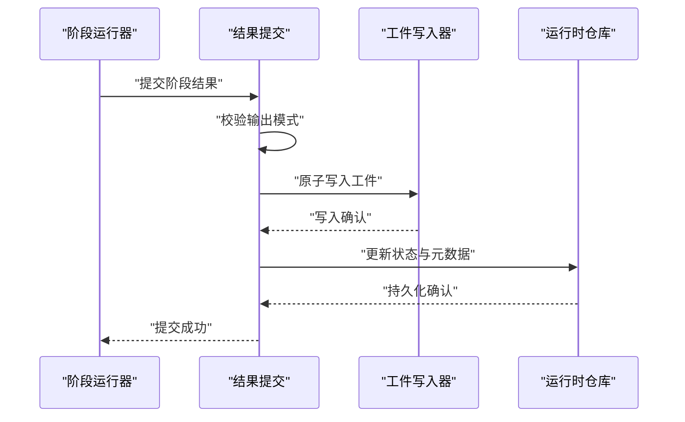
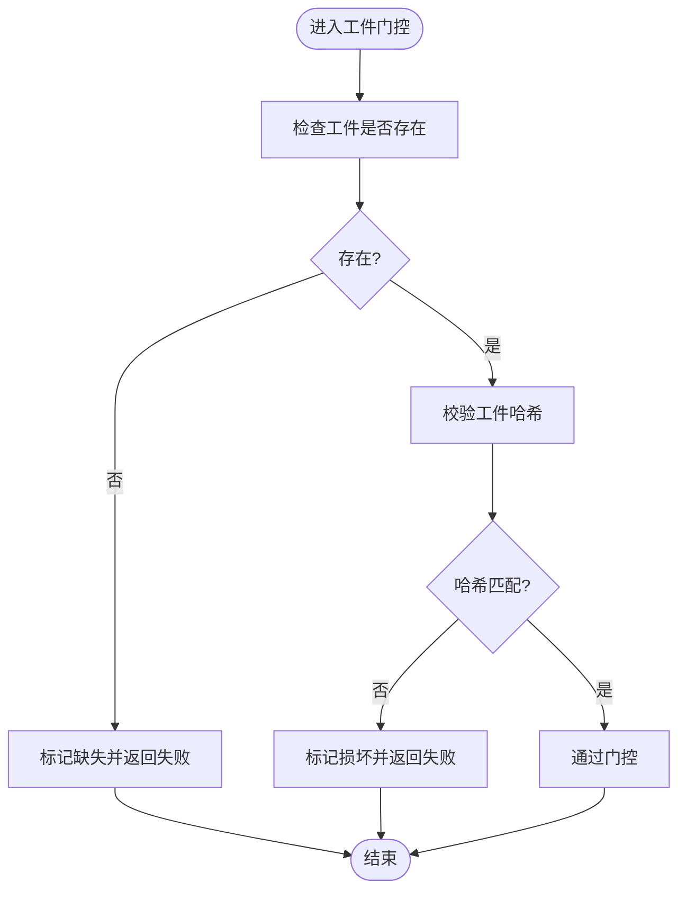
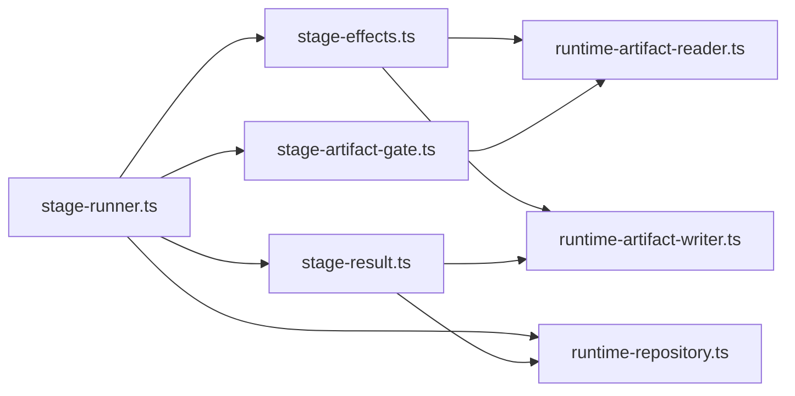

# 阶段管理系统

<cite>
**本文引用的文件**   
- [src/features/director/stage-runner.ts](file://src/features/director/stage-runner.ts)
- [src/features/director/stage-effects.ts](file://src/features/director/stage-effects.ts)
- [src/features/director/stage-result.ts](file://src/features/director/stage-result.ts)
- [src/features/director/stage-artifact-gate.ts](file://src/features/director/stage-artifact-gate.ts)
- [src/features/director/runtime-repository.ts](file://src/features/director/runtime-repository.ts)
- [src/features/director/runtime-artifact-writer.ts](file://src/features/director/runtime-artifact-writer.ts)
- [src/features/director/runtime-artifact-reader.ts](file://src/features/director/runtime-artifact-reader.ts)
- [src/features/director/advance.ts](file://src/features/director/advance.ts)
- [src/features/director/pipeline.ts](file://src/features/director/pipeline.ts)
- [src/features/director/types.ts](file://src/features/director/types.ts)
- [src/app/api/director/stage/route.ts](file://src/app/api/director/stage/route.ts)
- [src/app/api/director/pipeline/route.ts](file://src/app/api/director/pipeline/route.ts)
</cite>

## 目录
1. [简介](#简介)
2. [项目结构](#项目结构)
3. [核心组件](#核心组件)
4. [架构总览](#架构总览)
5. [详细组件分析](#详细组件分析)
6. [依赖关系分析](#依赖关系分析)
7. [性能考虑](#性能考虑)
8. [故障排查指南](#故障排查指南)
9. [结论](#结论)
10. [附录](#附录)

## 简介
本文件为导演系统的“阶段管理系统”提供系统化文档，覆盖以下关键主题：
- 阶段的定义规范与输入输出契约
- 生命周期管理与状态转换机制
- 阶段结果的验证、持久化与回滚策略
- 阶段效果的执行顺序、依赖关系与冲突解决
- 自定义阶段的创建、配置示例与副作用处理
- 阶段测试方法、性能调优与故障恢复策略

该子系统位于 src/features/director 下，围绕 stage-runner、stage-effects、stage-result、stage-artifact-gate、runtime-* 等模块协同工作，通过 API 路由对外暴露阶段与流水线控制能力。

## 项目结构
阶段管理相关代码主要分布在 features/director 与 app/api/director 两个区域：
- features/director：阶段运行器、效果编排、结果提交、工件门控、运行时读写、推进逻辑、类型定义等
- app/api/director：HTTP 接口层，负责接收请求并调用内部服务

图表来源
- [src/app/api/director/stage/route.ts](file://src/app/api/director/stage/route.ts)
- [src/app/api/director/pipeline/route.ts](file://src/app/api/director/pipeline/route.ts)
- [src/features/director/stage-runner.ts](file://src/features/director/stage-runner.ts)
- [src/features/director/stage-effects.ts](file://src/features/director/stage-effects.ts)
- [src/features/director/stage-result.ts](file://src/features/director/stage-result.ts)
- [src/features/director/stage-artifact-gate.ts](file://src/features/director/stage-artifact-gate.ts)
- [src/features/director/advance.ts](file://src/features/director/advance.ts)
- [src/features/director/pipeline.ts](file://src/features/director/pipeline.ts)
- [src/features/director/types.ts](file://src/features/director/types.ts)
- [src/features/director/runtime-repository.ts](file://src/features/director/runtime-repository.ts)
- [src/features/director/runtime-artifact-writer.ts](file://src/features/director/runtime-artifact-writer.ts)
- [src/features/director/runtime-artifact-reader.ts](file://src/features/director/runtime-artifact-reader.ts)

章节来源
- [src/features/director/types.ts](file://src/features/director/types.ts)
- [src/features/director/stage-runner.ts](file://src/features/director/stage-runner.ts)
- [src/app/api/director/stage/route.ts](file://src/app/api/director/stage/route.ts)
- [src/app/api/director/pipeline/route.ts](file://src/app/api/director/pipeline/route.ts)

## 核心组件
- 阶段运行器（stage-runner）：负责调度单个阶段的完整生命周期，包括前置校验、效果执行、结果提交、错误处理与回滚。
- 阶段效果编排（stage-effects）：按依赖与顺序执行副作用（如生成工件、调用外部服务），支持幂等与重试。
- 阶段结果提交（stage-result）：对阶段产出进行结构化验证、持久化与版本化管理。
- 工件门控（stage-artifact-gate）：在阶段间传递工件前进行存在性与一致性检查，确保下游阶段可用。
- 运行时仓库（runtime-repository）：统一存取阶段运行上下文、中间态与最终产物。
- 工件读写器（runtime-artifact-writer/reader）：抽象工件的写入与读取，屏蔽存储细节。
- 推进引擎（advance）：驱动阶段或流水线的状态推进，保证一致性与可观测性。
- 流水线编排（pipeline）：组合多个阶段形成端到端流程，管理依赖图与并发策略。
- 类型定义（types）：集中定义阶段、结果、工件、状态枚举与契约。

章节来源
- [src/features/director/stage-runner.ts](file://src/features/director/stage-runner.ts)
- [src/features/director/stage-effects.ts](file://src/features/director/stage-effects.ts)
- [src/features/director/stage-result.ts](file://src/features/director/stage-result.ts)
- [src/features/director/stage-artifact-gate.ts](file://src/features/director/stage-artifact-gate.ts)
- [src/features/director/runtime-repository.ts](file://src/features/director/runtime-repository.ts)
- [src/features/director/runtime-artifact-writer.ts](file://src/features/director/runtime-artifact-writer.ts)
- [src/features/director/runtime-artifact-reader.ts](file://src/features/director/runtime-artifact-reader.ts)
- [src/features/director/advance.ts](file://src/features/director/advance.ts)
- [src/features/director/pipeline.ts](file://src/features/director/pipeline.ts)
- [src/features/director/types.ts](file://src/features/director/types.ts)

## 架构总览
阶段管理系统采用分层与职责分离设计：API 层仅做请求解析与响应封装；核心由运行器、效果编排、结果提交与工件门控组成；运行时仓库与工件读写器提供数据面支撑；推进引擎与流水线编排负责宏观调度。

图表来源
- [src/app/api/director/stage/route.ts](file://src/app/api/director/stage/route.ts)
- [src/features/director/stage-runner.ts](file://src/features/director/stage-runner.ts)
- [src/features/director/stage-effects.ts](file://src/features/director/stage-effects.ts)
- [src/features/director/stage-artifact-gate.ts](file://src/features/director/stage-artifact-gate.ts)
- [src/features/director/stage-result.ts](file://src/features/director/stage-result.ts)
- [src/features/director/runtime-repository.ts](file://src/features/director/runtime-repository.ts)
- [src/features/director/runtime-artifact-writer.ts](file://src/features/director/runtime-artifact-writer.ts)
- [src/features/director/runtime-artifact-reader.ts](file://src/features/director/runtime-artifact-reader.ts)

## 详细组件分析

### 阶段运行器（stage-runner）
- 职责：协调阶段生命周期，包含前置校验、效果执行、工件门控、结果提交与异常回滚。
- 关键点：
  - 输入参数校验与上下文装载
  - 效果执行失败时的幂等重试与补偿
  - 结果提交失败的回滚策略（撤销已持久化的工件或状态）
  - 状态机推进（待执行→执行中→成功/失败→完成）

图表来源
- [src/features/director/stage-runner.ts](file://src/features/director/stage-runner.ts)
- [src/features/director/stage-effects.ts](file://src/features/director/stage-effects.ts)
- [src/features/director/stage-artifact-gate.ts](file://src/features/director/stage-artifact-gate.ts)
- [src/features/director/stage-result.ts](file://src/features/director/stage-result.ts)
- [src/features/director/runtime-repository.ts](file://src/features/director/runtime-repository.ts)

章节来源
- [src/features/director/stage-runner.ts](file://src/features/director/stage-runner.ts)

### 阶段效果编排（stage-effects）
- 职责：按依赖拓扑与顺序执行副作用，支持并行度控制、超时与重试。
- 关键点：
  - 依赖解析与拓扑排序
  - 副作用幂等键与去重
  - 资源隔离与限流
  - 副作用日志与追踪

图表来源
- [src/features/director/stage-effects.ts](file://src/features/director/stage-effects.ts)
- [src/features/director/runtime-repository.ts](file://src/features/director/runtime-repository.ts)

章节来源
- [src/features/director/stage-effects.ts](file://src/features/director/stage-effects.ts)

### 阶段结果提交（stage-result）
- 职责：对阶段产出进行结构化验证、持久化与版本管理。
- 关键点：
  - 输出模式校验（schema 校验）
  - 原子写入与事务保障
  - 版本快照与差异记录
  - 失败回滚与一致性修复

图表来源
- [src/features/director/stage-result.ts](file://src/features/director/stage-result.ts)
- [src/features/director/runtime-artifact-writer.ts](file://src/features/director/runtime-artifact-writer.ts)
- [src/features/director/runtime-repository.ts](file://src/features/director/runtime-repository.ts)

章节来源
- [src/features/director/stage-result.ts](file://src/features/director/stage-result.ts)

### 工件门控（stage-artifact-gate）
- 职责：在阶段间传递工件前进行存在性与一致性检查，确保下游阶段可用。
- 关键点：
  - 工件存在性检查
  - 哈希校验与完整性验证
  - 缺失工件的自动补齐或失败快速返回
  - 门控失败的可观测性上报

图表来源
- [src/features/director/stage-artifact-gate.ts](file://src/features/director/stage-artifact-gate.ts)

章节来源
- [src/features/director/stage-artifact-gate.ts](file://src/features/director/stage-artifact-gate.ts)

### 运行时仓库（runtime-repository）
- 职责：统一存取阶段运行上下文、中间态与最终产物。
- 关键点：
  - 上下文序列化与反序列化
  - 事务边界与一致性
  - 查询优化与缓存策略
  - 错误分类与重试

章节来源
- [src/features/director/runtime-repository.ts](file://src/features/director/runtime-repository.ts)

### 工件读写器（runtime-artifact-writer/reader）
- 职责：抽象工件的写入与读取，屏蔽存储细节（本地、对象存储等）。
- 关键点：
  - 分块写入与断点续传
  - 并发读与流式处理
  - 访问权限与签名URL
  - 存储后端可插拔

章节来源
- [src/features/director/runtime-artifact-writer.ts](file://src/features/director/runtime-artifact-writer.ts)
- [src/features/director/runtime-artifact-reader.ts](file://src/features/director/runtime-artifact-reader.ts)

### 推进引擎（advance）与流水线编排（pipeline）
- 推进引擎：驱动阶段或流水线的状态推进，保证一致性与可观测性。
- 流水线编排：组合多个阶段形成端到端流程，管理依赖图与并发策略。

章节来源
- [src/features/director/advance.ts](file://src/features/director/advance.ts)
- [src/features/director/pipeline.ts](file://src/features/director/pipeline.ts)

### API 路由（stage/pipeline）
- 阶段路由：接收阶段执行请求，调用运行器并返回结果。
- 流水线路由：接收流水线执行请求，调用编排器并返回进度。

章节来源
- [src/app/api/director/stage/route.ts](file://src/app/api/director/stage/route.ts)
- [src/app/api/director/pipeline/route.ts](file://src/app/api/director/pipeline/route.ts)

## 依赖关系分析
阶段系统内各组件之间的依赖关系如下：
- stage-runner 依赖 stage-effects、stage-result、stage-artifact-gate、runtime-repository
- stage-effects 依赖 runtime-repository、runtime-artifact-reader/writer
- stage-result 依赖 runtime-artifact-writer、runtime-repository
- stage-artifact-gate 依赖 runtime-artifact-reader
- advance 与 pipeline 依赖 runner 与 repository

图表来源
- [src/features/director/stage-runner.ts](file://src/features/director/stage-runner.ts)
- [src/features/director/stage-effects.ts](file://src/features/director/stage-effects.ts)
- [src/features/director/stage-result.ts](file://src/features/director/stage-result.ts)
- [src/features/director/stage-artifact-gate.ts](file://src/features/director/stage-artifact-gate.ts)
- [src/features/director/runtime-repository.ts](file://src/features/director/runtime-repository.ts)
- [src/features/director/runtime-artifact-writer.ts](file://src/features/director/runtime-artifact-writer.ts)
- [src/features/director/runtime-artifact-reader.ts](file://src/features/director/runtime-artifact-reader.ts)

章节来源
- [src/features/director/types.ts](file://src/features/director/types.ts)

## 性能考虑
- 效果编排并行度：根据阶段特性设置最大并发，避免资源争用。
- 工件读写优化：使用流式处理与分块传输，减少内存占用。
- 缓存策略：对只读工件与计算结果进行缓存，降低重复计算。
- 重试与退避：对网络与I/O失败采用指数退避与熔断。
- 监控与指标：采集阶段耗时、吞吐、错误率与资源使用。

[本节为通用指导，不直接分析具体文件]

## 故障排查指南
- 常见错误分类：
  - 输入校验失败：检查阶段输入契约与必填字段
  - 工件缺失或损坏：查看工件门控日志与哈希校验结果
  - 持久化失败：检查事务与存储后端健康状态
  - 效果执行超时：调整超时阈值与重试次数
- 定位步骤：
  - 查看阶段运行器日志与上下文快照
  - 检查工件读写器的访问权限与路径
  - 核对运行时仓库的状态一致性
  - 复现问题并启用更详细的追踪

章节来源
- [src/features/director/stage-runner.ts](file://src/features/director/stage-runner.ts)
- [src/features/director/stage-artifact-gate.ts](file://src/features/director/stage-artifact-gate.ts)
- [src/features/director/runtime-repository.ts](file://src/features/director/runtime-repository.ts)

## 结论
阶段管理系统通过清晰的职责划分与严格的契约约束，实现了高可靠、可扩展的阶段执行与流水线编排。借助工件门控、结果提交与运行时仓库，系统在正确性、一致性与可观测性方面具备良好基础。建议在生产环境中结合监控与自动化测试持续优化性能与稳定性。

[本节为总结性内容，不直接分析具体文件]

## 附录

### 阶段定义规范与输入输出契约
- 阶段标识与名称：唯一且稳定
- 输入契约：字段名、类型、必填项、默认值
- 输出契约：字段名、类型、可选字段、校验规则
- 副作用清单：外部调用、文件操作、消息发送等
- 幂等键：用于去重与重试

章节来源
- [src/features/director/types.ts](file://src/features/director/types.ts)

### 生命周期管理与状态转换机制
- 状态集合：待执行、执行中、成功、失败、回滚中、完成
- 转换规则：严格的前置条件与后置动作
- 事件通知：状态变更事件与订阅者

章节来源
- [src/features/director/stage-runner.ts](file://src/features/director/stage-runner.ts)
- [src/features/director/advance.ts](file://src/features/director/advance.ts)

### 阶段结果的验证、持久化与回滚策略
- 验证：模式校验与业务规则校验
- 持久化：原子写入与事务保障
- 回滚：撤销已持久化工件与状态，保持一致性

章节来源
- [src/features/director/stage-result.ts](file://src/features/director/stage-result.ts)
- [src/features/director/runtime-artifact-writer.ts](file://src/features/director/runtime-artifact-writer.ts)

### 阶段效果的执行顺序、依赖关系与冲突解决
- 执行顺序：基于依赖拓扑排序
- 依赖关系：声明式依赖与动态依赖
- 冲突解决：锁机制与版本号控制

章节来源
- [src/features/director/stage-effects.ts](file://src/features/director/stage-effects.ts)
- [src/features/director/pipeline.ts](file://src/features/director/pipeline.ts)

### 自定义阶段创建与配置示例
- 创建步骤：
  - 定义阶段输入输出契约
  - 实现副作用函数与幂等键
  - 注册到效果编排器
  - 配置依赖与并发策略
- 配置要点：
  - 超时与重试参数
  - 工件存储路径与格式
  - 监控与告警开关

章节来源
- [src/features/director/types.ts](file://src/features/director/types.ts)
- [src/features/director/stage-effects.ts](file://src/features/director/stage-effects.ts)

### 阶段测试方法与性能调优
- 单元测试：覆盖输入校验、副作用模拟与错误分支
- 集成测试：端到端阶段执行与工件流转
- 性能调优：并行度、缓存、I/O优化与资源限制

章节来源
- [src/features/director/stage-runner.ts](file://src/features/director/stage-runner.ts)
- [src/features/director/stage-effects.ts](file://src/features/director/stage-effects.ts)

### 故障恢复策略
- 自动重试：针对瞬时失败的指数退避
- 人工干预：失败队列与手动重放
- 数据修复：一致性检查与修复脚本

章节来源
- [src/features/director/advance.ts](file://src/features/director/advance.ts)
- [src/features/director/runtime-repository.ts](file://src/features/director/runtime-repository.ts)